## Richard Abibon

## Les trois torsions de la bande de Moebius

"Qu'on dise reste oublié derrière ce qui se dit dans ce qui s'entend" (Lacan, l'Etourdit). Je paraphrase : qu'il faille construire la BANDE DE MŒBIUS pour qu'on puisse la tenir en main est oublié par ceux qui en disent quelque chose, dans ce qui est "bien entendu" aussi bien dans le champ mathématique que dans le champ psychanalytique.

## Pour introduire : un exemple clinique de l’utilité de l’outil topologique :

J’avais commencé par traiter cette question de manière purement topologique. Puis je me suis dis que, d’une part personne n’allait rien comprendre et que, d’autre part, il importe de ne pas se perdre dans des calculs mathématiques sans fin et surtout sans rapport avec notre préoccupation : rendre compte de la psychanalyse comme pratique. Sinon, à quoi servirait la théorie ?

Pour introduire simplement la question des trois torsions de la bande de Mœbius, je dirais qu’elle renvoie à la différence local/global. Un mot, localement dans une phrase engendre tel signifié. Mais replacé dans son contexte global, il engendre une autre signification, qui était latente tant qu’on ne la rend pas manifeste par la référence à la globalité du contexte. Les polémiques à propos des citations ne sont faites que de ça.

Mais s’il ne s’agissait que de polémiques entre intellectuels, ce ne serait pas grave. Je passe donc directement à un exemple.

Un de mes analysants me raconte ceci « quand j’étais petit, j’ai tué un autre petit garçon d’un coup de bâton ; puis quelques mois plus tard j’ai rendu aveugle un autre garçon en lui retournant un pot de peinture sur la tête ». Citation locale de son propos, zone verte.

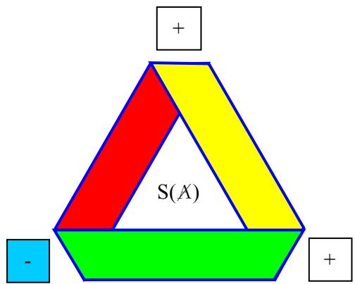

Plus tard, comme il revient souvent là-dessus je lui demande : « comment le savezvous que ce garçon est mort ? L’avez-vous revu ? Et ce garçon rendu aveugle, l’avez-vous vu ? d’où tenez-vous cela $? \rangle - \ll \mathrm { c } ^ { \prime }$ ’est mon père qui me l’a raconté ». Citation globale du propos : nous n’avions qu’une zone de la bande de Mœbius, verte, et ici on nous restitue l’autre face, rouge ce qui nous permet de comprendre rétroactivement que zone verte et rouge (le propos sous forme de mot pris pour la chose) étaient en fait condensées en une seule face jaune, qui était prise pour verte. On est passé d’un énoncé comme chose à sa restitution dans son contexte : cet énoncé a été le fait d’une énonciation du père de mon analysant, qui le reprenait dans sa propre énonciation en oubliant ce décalage du sujet de l’énonciation.

Ce qui aboutit, chez cet analysant, à ce parcours global : « si j’ai vraiment tué, eh bien j’ai assez payé, je me suis assez puni ; et si je n’ai pas tué, le fait que je me punisse n’a pas de raison d’être ; dans les deux cas j’ai toutes les raisons d’arrêter de me punir. Mais plus vraisemblablement, cette histoire de tuer et de rendu aveugle, c’était mes délires.»

Au passage il effleure le concept de signifiant d’un manque dans l’Autre (S(A) : S de A barré) ): il n’y a pas de garant de la vérité, dit-il en substance. Le parcours des trois torsions de la bande de Mœbius l’amène à se rendre compte que toute la bande tourne autour d’un vide, ce vide qui justement permet les torsions, comme le vide autour d’un pièce de monnaie permet de passer de pile à face. C’est vraiment considérer l’objet non plus du point de vue de l’objet mais du point de vue du sujet qui a un objet et qui se prend en compte dans l’élaboration de son point de vue sur l’objet. De plus, en l’occurrence, l’objet, c’est lui-même.

Mais pour reprendre en plus concret ce parcours :

face verte : les mots sont présentés comme des choses, il y a un fait indiscutable : j’ai tué et j’ai rendu aveugle.

\- Face rouge : mais le contraire peut être vrai : je n’ai ni tué, ni rendu aveugle.

Face jaune : c’est mon père qui me l’a dit. L’accent se déplace de la surface au trou, de l’énoncé à l’énonciation. Du dit au dire.

Un 2ème tour s’inaugure sous les auspices de la coupure : et scie…et scie…. :

Face verte : « si j’ai vraiment tué, eh bien j’ai assez payé, je me suis assez puni … »

Face rouge : « et si je n’ai pas tué, le fait que je me punisse n’a pas de raison d’être » ;

Face jaune : « ….dans les deux cas j’ai toutes les raisons d’arrêter de me punir. Mais plus vraisemblablement, cette histoire de tuer et de rendu aveugle, c’était mes délires »

Autrement dit, l’accent est mis sur le fait de dire, pas sur le dit. Ce n’est plus un fait indiscutable, c’est l’intérêt de la discussion comme telle, c'est-à-dire comme échange, passage, rapport d’un sujet à un autre (et plus seulement à un Autre). Le passage du 1er au 2ème tour s’est fait par le déplacement de l’accent sur un sujet de l’énonciation : « c’est mon père qui l’a dit », le 2ème tour est tout entier mise en acte d’un nouveau sujet de l’énonciation, luimême, par le fait même que le discours retrouve son caractère hypothétique. C’est la mise en place du troisième temps de la pulsion, celui où Freud dit que c’est là qu’apparaît « un nouveau sujet »(« les pulsions et leurs destins »,1915). Dans le séminaire XI, Lacan souligne que c’est là qu’apparaît du sujet, tout simplement.

Il y a donc deux lectures de la face jaune :

Objet : elle condense deux propositions contradictoires, elle représente la fonction gelée en objet.

Fonction : elle représente le mouvement de passage d’une proposition à l’autre, c'est-à-dire la torsion comme telle, la globalité de la bande de Mœbius comme telle, qui est torsion triple, lorsque la fonction au lieu d’être bloquée en objet, se remet à fonctionner comme fonction, c'est-à-dire : lorsqu’un sujet parle, au moment où il parle.

La zone jaune est à la fois dessus et dessous. Dans la première acceptation, elle reste surface désorientée, à la fois dessus et dessous, objet désorienté. Dans la seconde, elle est déplacement de l‘investissement de la surface au bord, le bord étant lui aussi une torsion, c'est-à-dire un passage de dessus à dessous, considéré comme mouvement, fonction. Elle écrit donc le bord comme une surface $( 1 ^ { \mathsf { e r } }$ temps passage de 1 dimension à 2 dimensions) puis la surface comme un bord $( 2 ^ { \mathrm { { \dot { e } m e } } }$ temps passage de 2 dimensions à 1 dimension) : c’est la totalité du bord de la bande de Mœbius qui est concerné, la totalité qui est la fois dessus et dessous : c’est le signifiant, par opposition au signifié et à la signification (surfaces).

Ceci permet de repenser théoriquement tout le parcours.

Dans la première énonciation : « j’ai tué…etc… », le propos apparaît comme un fait, une chose. Il n’y a pas évocation d’un propos contraire, ni nuanciation en termes d’hypothèse. Il n’y a pas mention du sujet de l’énonciation, qui se trouve englué dans son énoncé qui s’avérera ensuite être celui $\mathrm { d } ^ { \prime }$ un autre. $\mathrm { C } '$ est donc une surface qui se présente comme un signifié, verte, mais elle n’a pas d’envers. Si elle n’a pas d’envers, c’est qu’elle est endroitenvers partout. C’est donc que le bord ne se différencie pas de la surface : le bord, c'est-à-dire le signifiant, celui qui fait référence au sujet de l’énonciation, n’est pas distinct de la surface, qui est l’énoncé. Le local de la surface jaune est en fait global ; il $\boldsymbol { \mathrm { n ^ { \prime } y } }$ a pas de différence local/global, et nous sommes donc contraint d’écrire cela sur une bande de Mœbius homogène1, caractéristique du discours psychotique :

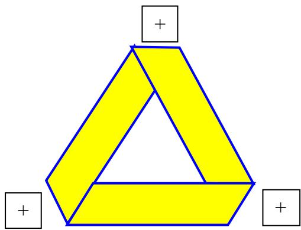

La suite de l’analyse permet de réintroduire de la différence, c'est-à-dire de l’hétérogène. On peut dire que c’est la nomination du sujet de l’énonciation qui a effectuée cette coupure : $\ll { \mathfrak { C } } ^ { \gamma }$ est mon père qui l’a dit », ce qui restitue le Nom-du-Père dans sa fonction. La fonction fonctionne au sens où elle produit de l’hétérogène, de l’analysable ( orientablerouge) de l’analysé (orienté-vert) et un reste inanalysable (inorientable-jaune) :

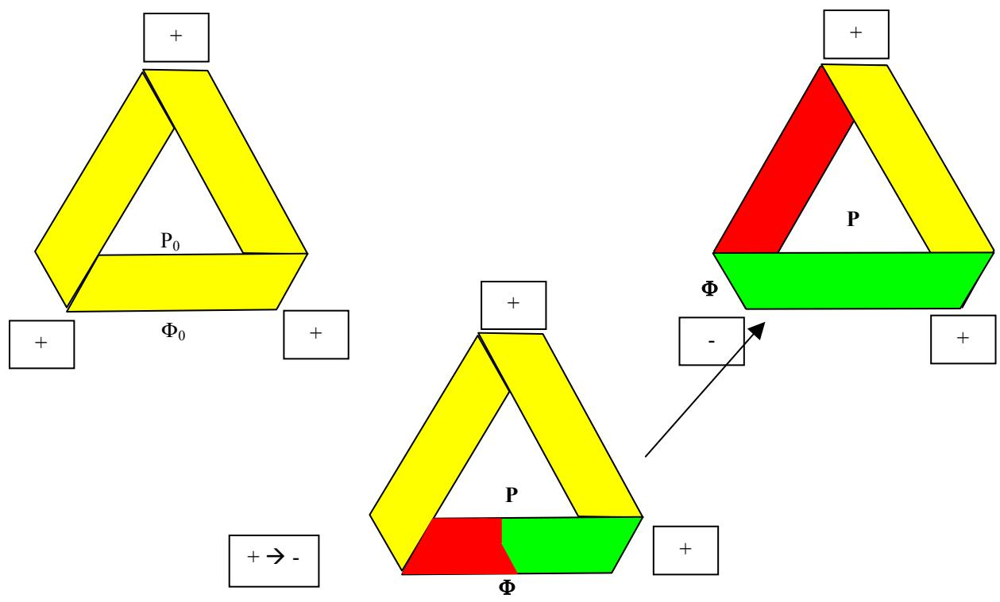

Ce sont les « trous dans la trouure » c'est-à-dire les fonctions gelées $\mathrm { P _ { 0 } }$ et $\Phi _ { 0 }$ du schéma I (dans les Ecrits :«D’une question préliminaire au traitement possible de la psychose».) qui sont restituées à leur état de fonctionnement P et Φ du schéma R.

## Lacan et la bande de Mœbius : dernières paroles

Après avoir délaissé un certain temps la bande de Moebius pour s'occuper du nœud borroméen, Lacan y revient longuement dans ses deux derniers séminaires, «le moment de conclure » (77/78) et «la topologie et le temps» (78/79).

le 11 avril 78, Lacan introduit la bande de Moebius qu'il appelle «double» (c'est celle qu’il nommera « triple » un peu plus tard, que j'appellerai «homogène» dans la suite de mon propos). Elle ne vient pas n'importe comment, non pas comme un collage, une illustration, mais comme une «symbolisation» de la sexualité :

« Il n'y a pas de rapport sexuel, sauf pour les générations voisines, à savoir les parents d'une part, les enfants de l'autre. C'est à quoi pare - je parle au rapport sexuel - c'est à quoi pare l'interdit de l'inceste. Le savoir c'est toujours en rapport avec ce que j'écris «l'asexe» à condition de le faire suivre du mot qui est à mettre entre parenthèses, «ualité»: l'asexe(ualité). Savoir «comme enfer», c'est tout au moins comme ça que je l'écris. J'ai commencé dans un temps à faire, pour symboliser cette sexualité, une bande de Moebius. Je voudrais maintenant corriger cette bande, je veux dire part là, la tripler»

Lacan produit alors les deux dessins suivants :

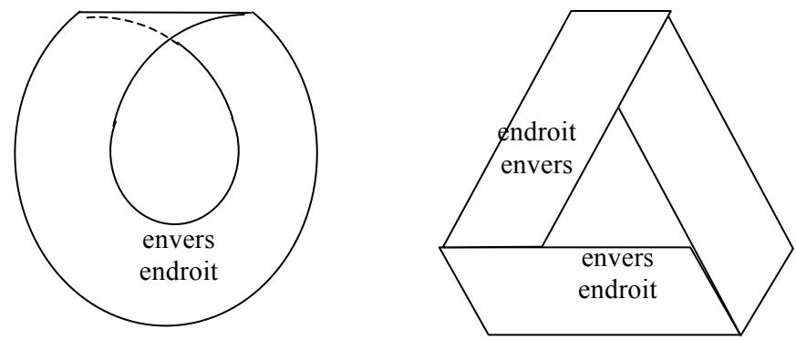

…en poursuivant :

«Ceci est une bande tout comme l'autre, c'est à savoir que son endroit coïncide avec son envers, mais cette fois-ci, ça se passe deux fois. (...) c'est donc une double bande de Moebius».

Ce faisant, il compare la carpe et le lapin. Il compare en fait deux modes d'écritures, et trouve des différences où il n'y en a pas, ne voyant pas les différences que feraient apparaître deux modes d'écritures comparables. C’est même pire que ça, puisque la figure de gauche est une chimère carpolapine : si le pli qu’on lit dans sa partie haute est une mise à plat, la boucle à lire dans sa partie basse est une chose bizarre qu’on ne peut pas assimiler à une mise à plat. Quant à la figure de droite, les écritures qu’elle contient démentent ce qu’elle écrit par ellemême : dans ce qu’elle écrit elle-même, le pli du haut sépare deux faces différentes, alors que leurs intitulés sont identiques. L’intitulé de la zone du bas est le seul à être différent, ce qui laisserait penser que les zones à droite et à gauche sont la même zone : or ce n’est pas le cas puisque la torsion du haut vient les diviser. Car la bande, celle que Lacan écrit à gauche dans ses beaux arrondis, si on la restitue dans une complète mise à plat, peut aussi s'écrire comme suit 2 :

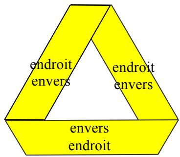

La boucle a été analysée par la mise à plat : elle se compose de deux torsions. La boucle du dessin précédent ne correspond pas à grand chose, sauf à dire, par défaut : puisque ce n’est pas une mise à plat, alors c’est une représentation dans l’espace.

... et toute la démonstration de Lacan sur «ça passe deux fois de l'envers à l'endroit» tombe, parce que sur cette écriture-ci de la bande dite «à une torsion», il y a aussi trois torsions, et ça passe aussi deux fois de l'endroit à l'envers. De plus, si on lit bien l’écriture de la bande comme telle, dans l’écriture de la bande dite « à trois torsions », il est en fait impossible de lire une différence entre les torsions, pas plus qu’entre les zones qu’elles délimitent : elles sont toutes exactement semblables, et donc, les intitulés de Lacan « endroitenvers » et « envers-endroit » introduisent une différence là où il n’y en a pas. En revanche, l’écriture ci-dessus nous donne à lire une différence très nette entre les torsions d’une part, entre les trois zones de surface d’autre part.

Il s’agit là d’un problème fondamental, qui est celui de la nomination. On pourrait très bien prendre une figure qui ne serait qu’un triangle équilatéral, par exemple, et décider arbitrairement de nommer de façons différentes ses trois sommets. Mais alors, on ne fait pas de la topologie : on fait des schémas et on raisonne sur les nominations, pas sur la figure, car les trois sommets d’un triangle ne sont pas différents l’un par rapport à l’autre. La différence y est introduite par une nomination extrinsèque. A mon sens, faire de la topologie consiste à lire à la lettre ce qui caractérise la figure de manière intrinsèque, et de nommer ses caractéristiques. Alors on raisonne sur la figure qui dès lors peut prendre le statut de lettre au sens lacanien du terme, ou au sens freudien de représentation de chose. C’est une lettre parce qu’on la lit comme telle. On ne plaque pas sur elle des différences qui ne peuvent s’y lire.

Par contre on ne pourrait pas donner une écriture de la bande de Mœbius totalement « dans l’espace », car toute écriture se fait par définition sur un plan support. Alors on pourrait « dire », en se passant d’écrire, que l’objet bande, dans l’espace, ne localise aucune torsion nulle part, et qu’ainsi la torsion serait partout. Ce serait se situer dans un idéalisme de la parole qui rejoindrait l’objectivisme de l’objet dans une in-différence fort loin de l’analyse. Ce serait supposer qu’il existerait une parole sans écriture, c'est-à-dire une parole sans mémoire, une énonciation sans appareil psychique, un conscient sans inconscient, une énonciation sans refoulement, une analyse sans résistance, et enfin : un objet sans sujet pour s’en saisir… car tout point de vue sur l’objet fonctionne comme projection de cet objet sur un plan.

La différence que Lacan ne nomme pas, entre les deux bandes, celle dite « à une » et celle dite « à trois» torsions, se trouve dans le sens de l'une des torsions. Ce qu'on peut lire en mettant côte à côte les deux écritures comparables :

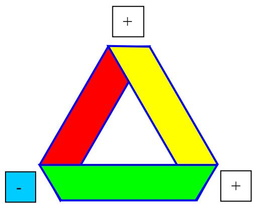

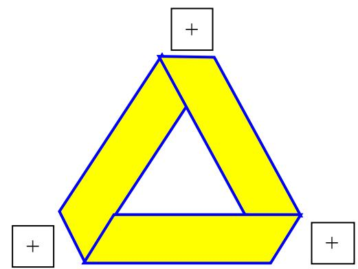

Néanmoins, dans la suite immédiate de son propos, il me semble qu'il tire les bonnes conséquences de ce soi-disant «doublement». Malgré un début où il n'est pas très évident de savoir s'il parle de celle de gauche ou de celle de droite, il m'apparaît, de par ce qu'il expose, qu'il parle bien de celle de droite, et c'est, à mon sens pour indiquer ce qui se passe dans l'inceste :

«Mais la distinction entre ceci (à droite) et cela (à gauche) tient à ce qu'il est possible d'avoir une bande de Moebius qui, sur ses deux faces, est à la fois endroit et envers. Il y a une seule face de chaque côté : c'est une bande de Moebius qui a la propriété d'être bilatérale. Qu'est-ce qu'on perd dans l'abstraction? On perd le tissu, on perd l'étoffe, c'est à dire qu'on perd ce qui se présente comme une métaphore. aussi bien je vous le fais remarquer, l'art, l'art par lequel on tisse, l'art est aussi une métaphore».

Car toute cette discussion n'a de sens pour nous, analystes, que dans un rapport à la psychanalyse, et, comme Lacan le rappelle bien dans son introduction, à la sexualité. Le fil de son discours le confirme dans la suite: il nous parle de «lalangue», de l'association libre, du rêve, du complexe d'Oedipe, et de ce fil qui tisse les métaphores. L'inceste, puisque d'Oedipe il est question, défait le tissage qui conférait une surface à la bande que j'appelle «hétérogène» (à gauche), et ne laisse plus que le fil de la bande «homogène» (à droite). C'est la torsion de sens contraire qui permettait de faire point d'arrêt lorsque sur le fil on tire. Cet arrêt, ce point de capiton, il disparaît lorsque disparaissent les différences de sens : le sens lui-même s'efface, tant il est vrai qu'il naît de sens que de la différence. Ne reste que le fil de l'association libre qui peut donner l'impression de délirer :

« Freud, dans «L'interprétation des rêves», ne fait pas mieux : sur le rêve, par l'association libre, sur le rêve, il rêve… comment savoir où s'arrêter dans l'interprétation des rêves? Il est tout à fait impossible de comprendre ce qu'à voulu dire Freud dans «l'interprétation des rêves ». C’est ce qui m’a fait délirer, il faut bien le dire, quand j’ai introduit la linguistique dans ce qu’on appelle une pâte bien efficace, tout au moins nous le supposons, et qui est l’analyse ».

Ici, Lacan rejoint Freud, lorsqu’il parle de l’impression schizophrénique du discours de l’analyste (je cite in extenso ce passage du « Complément métapsychologique à la théorie du rêve », en fin de ce travail). Il se rend compte que la mise à plat de la bande de Mœbius « n’est rien d’autre qu’un fil à trois », c'est-à-dire un trèfle. Au passage il signale que « mettre à plat quelque chose, ça sert toujours ». En effet, il aurait pu penser à terminer la mise à plat de l’autre bande de Mœbius, l’hétérogène, en aplatissant sa partie « boucle » laissée on ne sait pourquoi « dans l’espace ». Il aurait pu se rendre compte de ce qui justement empêche le fil de se défaire et le tissu de la métaphore de se conserver dans sa dynamique. Sur ce point, on lira plus loin, le chapitre que je consacre à « une écriture de la psychose »

La mise à plat se donne à lire comme écriture, et c’est une analyse ; c’est ce qui se passe lorsqu’un sujet se met à plat sur le divan : il se rend compte que ce qu’il porte en lui d’écritures comme surface fait résistance à sa parole, parce que, s’analysant, en se mettant à plat dans ses propres écritures, il s’y plonge. Il peut lire non seulement les traces, mais les effacements de la trace, elles-mêmes écritures du plongement comme tel, perte de la troisième dimension, représentation de la représentance.

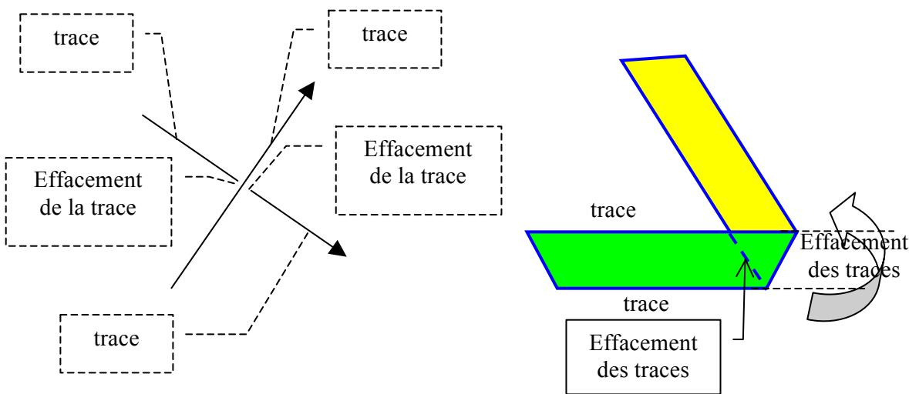

De ces deux dimensions du plan de l’écriture, il peut, dès lors qu’il a saisi le mécanisme du plongement (du refoulement) se redresser et remettre en « je » dans le vide de l’espace, le vide de cette absence de trace qui fera parole neuve.

Dans sa difficulté à dire ce dont il s’agit, Lacan nous tient un discours discordentiel : il dit d’un même jet insu : « Il y a une seule face de chaque côté : c'est une bande de Moebius qui a la propriété d'être bilatérale ». S’il voulait seulement nous dire qu’il n’y a qu’une seule face, il aurait dit « unilatérale ». Or il nous dit : « une seule face de chaque côté ». Visiblement il cherche un vocabulaire, et la suite de ses associations nous indique ce autour de quoi il tourne. C’est véritablement un moment où il est analysant, butant sur un Réel et tournant autour avec ce qui, de saisissable, lui vient à l’esprit. Et là, nous voyons les concepts de la psychanalyse venir au secours de la topologie ; mais les concepts tels que, lui, Jacques Lacan, les a introduits, maniés, triturés, la façon dont il s’est lui-même plongé dans la « pâte efficace » de la psychanalyse.

## Il cherche, mais il ne trouve pas.

A mon sens, le fil qu’il cherche c’est celui-là du trèfle, qui est celui de la bande de Mœbius homogène telle qu’en effet, étant unilatère sur chacune de ses trois faces, perd sa consistance de tissu. Si une face est à la fois dessus et dessous, qu’est-elle ? C’est un bord : elle perd, de ce fait, sa matérialité de tissu. Elle n’est plus ce tissage, ou tricotage (pour faire un clin d’œil à René Lew) qui fait la navette entre un bord et l’autre, elle n’est plus que fil. Or, ici, dans la bande homo, toutes les faces sont à la fois dessus et dessous. Cette bande homo n’est plus que fil. Elle représente le passage sur le bord, le passage aux seules représentations de mots, un peu à la manière de l’interprétation analytique. Cette dernière n’est pourtant pas la même chose que la schizophrénie. La première se trouve représentée par le bord la bande hétéro, la seconde par le bord de la bande homo (voir plus loin « Une écriture de la psychose »).

La bande hétéro dans l’écriture – dans sa mise à plat – n’est unilatère que sur l’une de ses trois faces. Dans la bouche de Lacan, comme dans celle de Terrasson, le mot « matérialité »revient souvent dans cette séance du séminaire, pour indiquer ce qui tient ensemble les bords. Il eut été plus heureux de parler de surface comme produit des deux dimensions (métaphore et métonymie : rien à voir avec quelque matière que ce soit), ou de tissu comme produit du mouvement de navette, de tricotage des deux bords. Les autres latères sont bi : les deux autres faces sont l’Une l’envers de l’Autre. Ainsi la surface maintient-elle un écart entre les bords, écart qui s’effiloche dans la bande homogène… à condition de lire le concept qu’écrit cette différence homo-hétéro, sans se laisser abuser par l’image que chacune d’elle dessine.

En d’autres termes, sur la bande hétéro, la fonction, - le bord – engendre de l’objet – la surface bilatère, à deux faces. Ce qui est réversif : l’objet unilatère, entre les deux bords, se fait le garant de l’écart entre les deux faces de l’objet bilatère. Tout aussi bien pourrait-on dire qu’il le cause ; il fait en sorte que la fonction fonctionne en produisant de l’objet, distinct de la fonction.

La fonction fonctionne dans la torsion qui fait passer d’Une face à l’Autre. Mais elle est représentée en objet par la face unilatère qui lui est opposée.

Le 18 avril 79, Lacan revient à cette comparaison des deux bandes, élevant la bande « à trois torsions » au titre de « la vraie bande de Mœbius », par opposition à celle qui préside à la couverture de Scilicet, qui serait censée être à une seule torsion. Or, sur la couverture de Scilicet, les trois torsions sont pourtant bien lisibles. C’est une mise à plat telle que pourtant il l’appelait de ses vœux la semaine précédente.

A cette occasion, Lacan inaugure le vocabulaire que lui souffle Jean-Claude Terrasson : il parle de « demi-torsion ». Je trouve que cette formule alourdit inutilement le vocabulaire, d’autant qu’elle ne m’apparaît pas justifiée. « Demi-torsion » se réfère au fait que, pour changer de face, il faut accomplir un demi-tour, c'est-à-dire 180°. En ce cas, une torsion complète serait revenir à la face de départ. Or, revenir à la face de départ, c’est une opération qui permet à certains topologues de dire que les deux demi-torsions se sont annulées, ce qui entraînerait leur effacement de l’écriture, comme dans le dessin que j’ai incriminé plus haut comme inexact. Le paradoxe de l’appellation « demi-torsion » c’est que, du coup, la torsion complète s’avère équivalente à une opération nulle pour ceux-là même qui utilisent ce vocabulaire.

Je préfère donc appeler « torsion » l’opération qui consiste à passer d’une face à l’autre ; c’est plus clair et moins lourd, d’autant que Lacan et bien d’autres glissent régulièrement en appelant torsion ce que effectivement j’appelle torsion.

Dans cette même séance du séminaire, Terrasson produit un tableau des objets à zéro, une, deux, trois torsions, comparant allégrement, lui aussi, ce qui n’est pas comparable, c'està-dire des écritures qui ne sont pas gouvernées par les mêmes principes de mise à plat.

Ainsi indique–t-il le cylindre comme objet à zéro torsion, en produisant à l’appui un dessin en perspective, et non une mise à plat. La lecture de cette écriture permet pourtant d’y repérer deux torsions :

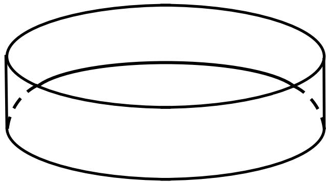

C’est tout simplement une autre sorte de mise à plat, puisque de toutes façons, nous sommes sur l’à plat du support de l’écriture. Cette autre sorte, nous pourrons l’appeler « perspective » ou « dessin », parce qu’elle met en jeu une certaine loi d’écriture, qui a eu bien du mal à se dégager dans l’histoire du dessin et de la peinture, mais qui à présent, est là. Nous distinguerons donc cette sorte de mise à plat qu’on appelle « perspective » (ou dessin) de l’autre sorte de mise à plat, que nous appellerons « mise à plat » (ou écriture) proprement dite.

Terrasson indique que les deux bords de cet objet, « si on les dessine comme ça :

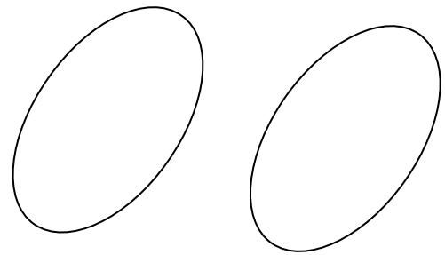

…ils ne sont liés que par le fait que la bande a une certaine matérialité pour lier ces deux bords ».

L’appel à la matérialité de l’objet permet de se passer de ce qui pourtant est essentiel : c’est que ces bords peuvent être lus comme des torsions, c'est-à-dire : passage d’une face à une autre face. Ces mouvements de passage se font à notre insu : notre œil voit successivement une face puis l’autre dans leur continuité, et nous lisons, en notre fort intérieur une maxime de ce genre : ah, il y a une face interne et une face externe, mais c’est le même objet. C’est notre œil qui fait le mouvement de navette d’une face à l’autre, tricotant « la matérialité de tissu» de la surface . C’est la même face, car si la torsion n’est pas écrite par un pli, elle est écrite par un bord, et que d’une face à l’Autre face, il s’agit pourtant bien du même tissu. Il serait donc plus juste de dire : c’est le même objet, et il a deux faces tissées du même fil. C’est un artéfact d’écriture, mais on s’aperçoit qu’il est impossible de lire l’objet autrement, même lorsqu’on le regarde dans ses trois dimensions d’objet : on voit les deux faces simultanément, et on en déduit bien qu’il s’agit du même tissu. Notre œil effectue à notre insu le mouvement de torsion, c'est-à-dire la mise à plat implicite de l’objet, sa projection sur un plan.

J’ai fait appel, non à la matérialité de l’objet, mais aux capacités de lecture du sujet.

Une certaine mise à plat, lorsqu’on écrase le cylindre sur un plan, laisserait voir un simple carré, ou un rectangle, comme Terrasson le fait remarquer lui-même. Cependant cette mise à plat ne serait pas encore une écriture parce qu’elle ne laisserait pas lire le trou qui pourtant sépare les deux faces ; on ne pourrait pas la distinguer du dessin d’un simple carré. Pour que la mise à plat soit écriture, il faut qu’elle soit analyse, c'est-à-dire, quelle rende compte de tous les éléments impliqués, y compris les trous. C’est ce que fait grosso modo le dessin avec les deux torsions. Mais une véritable écriture, mise à plat qu’on obtient d’une bande présentant suffisamment de différence entre largeur et longueur, amène à lire 4 torsions de sens opposés deux à deux :

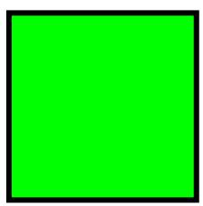  
Zéro torsion

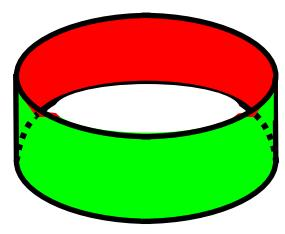  
deux torsions

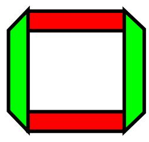  
quatre torsions  
Trois écritures du même objet : le cylindre

On y lit qu’un cylindre est en fait la mise continuité de deux boucles, l’une que l’on lit « devant » et l’autre « derrière », la boucle étant ce qui est écrit comme boucle dans le dessin de la bande de Mœbius dite « à une torsion »5.

Revenons au catalogue de Terrasson. Juste à côté, comme objet à une torsion, nous voyons, au contraire du cylindre en perspective, une complète mise à plat de la bande de Mœbius où, comme sur la couverture de Scilicet, les trois torsions sont parfaitement lisibles !

L’objet présenté comme ayant deux torsions est un hybride étrange : les deux torsions sont des mises à plat, et ce qui les relie apparaît comme une boucle, la même qui boucle la torsion dans l’objet à « une » torsion, celle dont nous avons vu que la mise à plat fait apparaître toujours deux torsions. L’objet dit « à deux torsions » en comporte en fait quatre. Il ne diffère du cylindre que par une succession différente dans le sens des torsions.

Enfin, l’objet à trois torsions est présenté dans une écriture qui est exactement celle de l’objet à une torsion (c'est-à-dire, à trois !), excepté en ce qui concerne le sens d’une des torsions, ce dont personne ne parle. Dans les dessins dont je dispose, inclus au séminaire de Lacan, on sent que la bande de Mœbius dite « à une torsion » de Terrasson est une tentative de représentation « dans l’espace » : les coins y sont arrondis, comme s’ils voulaient se faire lire à la manière dénégative : « non, ceci n’est pas une mise à plat ! ». N’empêche, ils sont là, et ils dessinent bien trois torsions, exactement comme dans le dessin de la bande dite « à trois trosions » ; ce qui démontre bien l’impossible d’une représentation dans l’espace… puisqu’on est encore et toujours dans le plan.

Ces remarques permettent de constater ici une homologie de la bande de Mœbius à trois torsions avec le nœud borroméen. Lorsqu’on recolle deux bouts d’une bande « sans torsion » chacun des futurs plis que vous faites fait bien passer d'une face à l'autre (localement, et de votre point de vue). Mais comme on le fait deux fois, cette fonction (passer d’une face à l’autre) s'annule, et ça fait un anneau. On est toujours sur deux faces séparées (globalement). C'est l'ajout d'une torsion troisième qui fait que deux torsions ne s'annulent pas, quant à la fonction de passage d’une face à l’autre. C’est une remarque à rapprocher de : il n'y a pas de nœud borroméen à deux ronds. Il faut un troisième pour que les trois tiennent. Il s'agit bien de trois ronds comme il s'agit de trois torsions. C'est pourquoi, du point de vue conceptuel (et pas du bête point de vue de l'objet bien sûr), la bande hétéro est homologue au nœud borroméen, tandis que la bande homo est analogue au trèfle.

Le 21 novembre 78, première séance de « La topologie et le temps », Lacan revient encore sur cette comparaison des deux bandes. Il opère un chiffrage des 3 faces de la mise à plat de l’une et de l’autre, et constate que cela donne une lecture identique sur les deux. Il en déduit que « la bande enveloppante a deux bords », ce que confirme la démonstration que j’en fait plus loin, en précisant la nature conceptuelle de ces bords : c’est le signifiant. C’est vrai pour les deux bandes.

Moyennant quoi, il faut lire ici entre les lignes, et lire que Lacan parle de l’écriture de la bande de Mœbius, car la bande de Mœbius comme objet n’a qu’un bord, bien entendu.

Le 19 décembre 78, il confirme cette lecture par le biais du tore : « Un tore, par exemple, est une surface sans bord. Néanmoins un tore peut être aplati, et si on l’aplatit, ça fait une surface avec bords. C’est même pour ça que le tore peut servir à faire une bande de Mœbius. Voilà comment ça se dessine. Ça fait une bande de Mœbius à condition de l’aplatir. Mais on peut la regonfler, auquel cas ça refait un tore. Il n’en reste pas moins que le tore et la bande de Mœbius, c’est distinct… »

Cette récurrence de la question de la mise à plat est cruciale pour la psychanalyse : la mise à plat, c’est l’écriture, c'est-à-dire, la mise en forme de ce qui ne peut se dire, ce qui ne peut se saisir, et qui s’écrit dans les formations de l’inconscient. La mise à plat produit des bords là où il $\boldsymbol { \mathrm { n ^ { \prime } y } }$ en avait pas : c’est une métaphore adéquate de la psychanalyse, par laquelle la mise à plat sur le divan, mais surtout, la prise de parole engendre les représentations de mots (les bords) là où il n’y avait que représentations de choses (surface) dans l’inconscient.

Je vais donc fournir quelques démonstrations à l'appui.

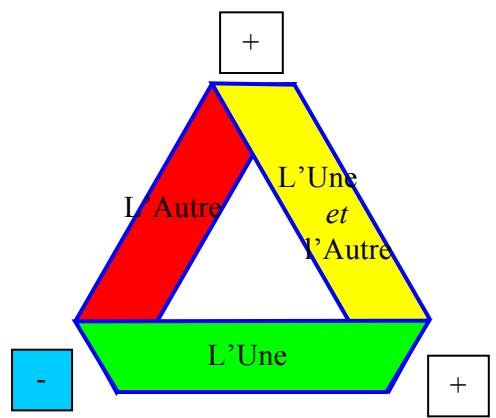

Les arguments pour la bande de Mœbius à une seule torsion tiennent en ceci : dans l’objet bande de Mœbius, la torsion unique est partout. Les deux autres ne sont qu’un artéfact de mise à plat. De plus, les deux torsions de sens contraire, + et -, de part et d’autre de la surface « Une » sont censées s’annuler : puisque en « - » on est passé d’une face à l’autre, et que en « + » on est revenu sur la face précédente, il n’y a pas lieu d’en tenir compte. C’est raisonner comme en arithmétique : 1 – 1 = 0. Or si on lit bien cette formule, 1 – 1 est bien toujours là, écrit dans la partie gauche du signe égale. Le tenir pour rien, c’est faire cette opération d’effacement d’une représentation que Freud appelle refoulement. Au contraire, ne pas effacer cette partie gauche, c’est faire de l’analyse. L’essentiel de la découverte freudienne est là : nous avons tous des pulsions contradictoires qui, pour le conscient, s’annulent…et n’en continuent pas moins leur travail dans l’inconscient, qui ne connaît pas la contradiction.

Ces arguments pour la torsion unique prennent le point de vue de l’objet, non celui de l’écriture. En fait, ils font état d’une écriture implicite, car toute théorie est écriture, point de vue sur l’objet, construction de l’objet. Or, il ne saurait y avoir d’objet en soi. Or, cette théorie implicite se situe du côté des faces de l’objet comme point de repère, c'est-à-dire du point de vue de la surface, et non de celui du mouvement qui engendre cette surface unique sous une forme triple : globalement (c'est-à-dire, dans l’espace, c'est-à-dire encore, dans la représentation que nous avons de l’espace … qui est une écriture…forcément dans un plan !) il n’y a qu’une face. Cette théorie nie donc ce qui se situe entre les faces, qu’on l’appelle le bord, la coupure ou le mouvement, ce dernier étant la prise en compte du temps. Il faut en effet un certain temps pour accomplir l’opération de passer d’Une face à une Autre, puis de repasser sur l’Une face.

Il se passe exactement la même chose lorsque Freud nous dit de tenir compte de cette expression : « ce n’est pas ma mère ». Nous pourrions la tenir pour rien : puisque le sujet a dit que ce n’était pas sa mère, eh bien voilà, ce n’est pas sa mère. Puisque nous sommes revenu sur la même face, eh bien, nous n’avons pas à tenir compte de la face intermédiaire, ni de la torsion par laquelle nous y avons accédé, ni de la torsion par laquelle nous en sommes parti. Or, nous fait observer Freud, la représentation « mère » est apparue dans le discours sous forme négative, et ce n’est pas à négliger. Ce dont il s’agit, c’est de l’opération de la représentance, qui fonctionne fondamentalement sous la forme du négatif. Ainsi dans le fortda, le premier mouvement, et le plus répété, est celui du fort, le mouvement de jeter au loin. C’est le mouvement même du symbolique, qui écrit par ce geste une représentation du départ de la mère, une représentation sous la forme négative de ce mouvement de rejet.

De même, nous lisons dans notre écriture une torsion affirmative (+) : « mère » et une torsion négative (-) : « ce n’est pas ». En tant qu’analyste, dirions-nous que nous n’allons pas tenir compte de la première torsion ? il faut un certain temps, en analyse, un temps logique, avant que n’apparaisse le signifiant « mère » : deuxième face, dans l’écriture de la cure, d’une première où il apparaît sous une forme négative. Mais « le refoulement n’est encore pas levé » nous dit Freud, c’est ma mère et ce n’est pas elle : les deux faces sont là en même temps, dans la même phrase, qui apparaît dans la globalité figée d’une holophrase.

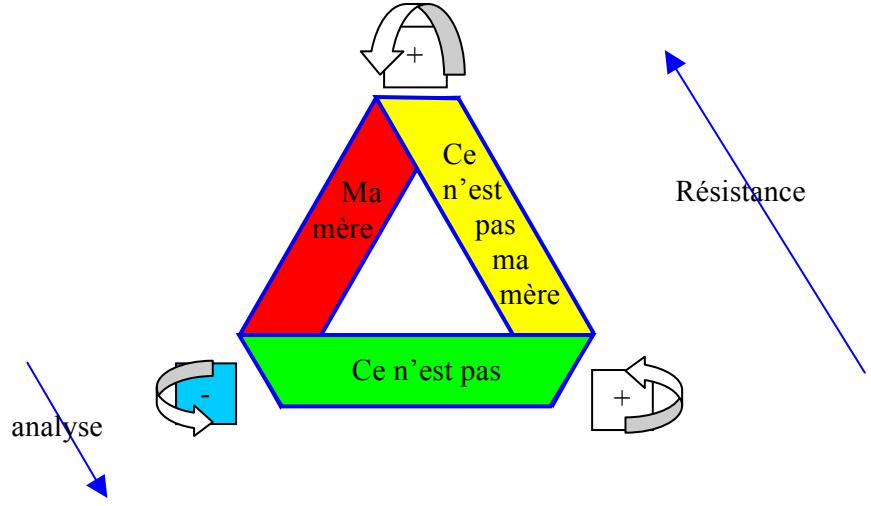

Enfin, avec un tour de plus sur la bande de Mœbius, un tour interprétatif dans la cure, le signifiant mère peut s’inclure au discours sous une forme positive, et c’est la troisième face. Plus précisément, la reconnaissance de la possible positivité de la représentation « mère » permet d’accepter de se situer dans le « ni…ni » (oui, c’est bien ma mère, mais ce n’est pas elle, celle qui aura été mon objet, ce n’est que la reconstruction que j’en ai faite dans mon analyse : une représentation ) d’une parole dégagée de la fixité de l’objet et revenue dans la mouvance de sa fonction.

La surface aura perdu sa couleur, et surtout, sa capacité de fixation du mouvement, pour se réduire au fil signifiant qui fait de la bande de Mœbius un pur bord bleu.

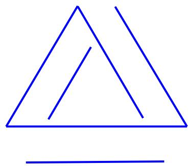

oui, $\mathbf { c } ^ { \prime }$ est bien ma mère, mais ce n’est pas elle, celle qui aura été mon objet, ce n’est que la reconstruction que $\mathrm { j } ^ { \prime }$ en ai faite dans mon analyse : une représentation, ce n’était qu’un tenant lieu de l’objet a.

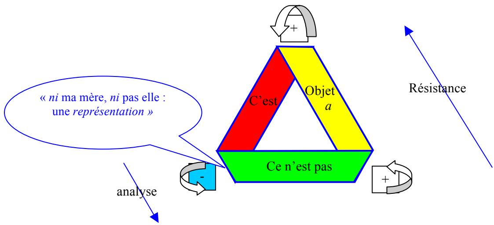

Nous en arrivons à expliciter la théorie implicite qui se lit dans une écriture de la bande de Mœbius tenue pour un objet à une seule torsion : celle-ci représente une énonciation particulière, dans ce qu’elle a d’instantané, s’évanouissant dès qu’elle apparaît, au même titre que le sujet. Elle n’est pas fausse, mais elle n’explicite pas cette ternarité dans laquelle se situe toute énonciation : qu’un signifiant (+) représente un sujet (-) pour un autre signifiant (+).

Ainsi cette écriture de la bande de Mœbius à trois torsions : oui, c’est bien la bande de Mœbius, mais ce n’est pas elle, ce n’est que la reconstruction que j’en ai faite dans mon analyse : une représentation qui en explicite la structure, conforme à la structure du signifiant.

## Démonstration 2 : travail manuel

Depuis quand la mise à plat est-elle un artéfact ? Pas plus que la mise à plat de l’analysant sur le divan, qui entraîne cet artéfact bien utile qu’on a appelé transfert. Ecrasez une bande de Mœbius bien formée sur un plan quelconque : a-t-elle oui ou non trois torsions ? En quoi ceci serait-il un artéfact ? C’est un effet de l’art, c’est sûr, et ça tombe bien : l’art est humain. L’art est fait. Rien d’humain qui ne passe par le langage, et cette négation discordantielle que je viens d’employer indique en quoi l’écriture supplée à la faille du symbolique : ce que je ne peux dire, je peux l’écrire par le biais des formations de l’inconscient : lapsus, acte manqué, rêve, symptôme. A condition d’en redire quelque chose après-coup : lire ce que ces formations écrivent. Lire à haute voix cette écriture des formations de l’inconscient induit toujours le transfert, artéfact par lequel la fixation de l’écriture va justement pouvoir se dépasser dans le mouvement de la parole ainsi engagée.

Alors, plutôt que nous focaliser sur l’objet qui bloque la représentance, analysons le mouvement par lequel nous construisons l’objet bande de Mœbius.

Si nous effectuons une torsion sur une bande de papier nous obtenons ceci :

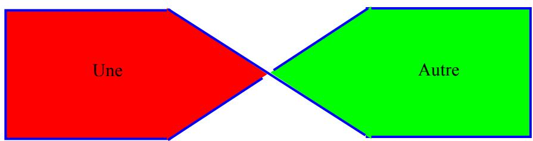

Nous avons effectué une seule torsion, certes, mais ce que nous avons obtenu est tout un plus un nœud papillon, pas une bande de Mœbius. C’est élégant, mais insuffisant. Pour construire une bande de Mœbius il nous faut encore faire coller le bord de droite avec celui de gauche.

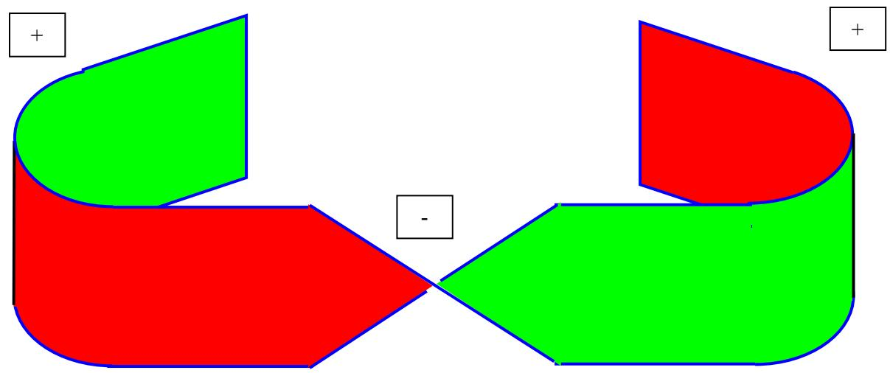

Mouvement, habituellement inaperçu, par lequel nous ajoutons une torsion à gauche (+ : de dessus à dessous6) et une torsion à droite (+ : de dessus à dessous, qui toutes deux s’opposent à la torsion primitive (- de dessous à dessus). Sans ces deux torsions, il n’y a pas « une seule face » à la bande de Mœbius, puisque nous n’avons pas mis en continuité un bord et l’autre, une face et l’autre.

Ce ne sont pas des torsions ? Pourtant, observez l’écriture ci-dessus : de chaque côté, la bande nous présente maintenant sa face de devant et sa face de derrière, exactement comme dans l’écriture précédente, celle qui ne faisait état que d’une seule torsion.

Artéfact d’écriture7 ? Mais pour effectuer ces torsions, sans lesquelles il n’y aurait pas de bande de Mœbius, il faut bien un sujet. Ce dernier, tout en effectuant ces opérations, développe forcément un point de vue. C’est bien ce point de vue que représente l’écriture cidessus ; voulez-vous supprimer le sujet pour en arriver à un point de vue du pur objet « ensoi », tout en continuant par ailleurs à dénoncer le discours ontologique?

Bien sûr, le dit sujet peut ensuite faire le tour des points de vue pour en arriver à un point de vue plus global. Il serait heureux que ça ne le supprime pas comme sujet. C’est justement ce que je propose en lui permettant d’analyser le mouvement par lequel il a construit son objet, son objet a, qu’il peut à présent jeter à la corbeille à papier, avec la bande.

Tout cela correspond au mouvement de mise à plat que le sujet effectue en s’allongeant sur le divan. Il se couche dans les deux dimensions du fantasme pour mieux en analyser les linéaments par le biais de la voix qui, elle, reste dans la troisième dimension : tout en devenant peu à peu capable de lire la mise à plat du fantasme, elle ne cesse pas de ne pas s’écrire.

## Richard Abibon

## Torsion : précision dans la définition et bande de Moebius carrée

## Précisant les démonstrations 2 et 3 des trois torsions de la bande de Moebius

Le 24 novembre 2012, en exposant une nouvelle fois la théorie des trois torsions au groupe de travail composé de Marie-Laure Caussanel, Michel Thomé, et François Duchène, je me suis aperçu, notamment grâce à la remarque de Marie Laure, qu’on pouvait préciser de la manière suivante : il faut mieux définir ce qu’est une torsion. Jusqu’à présent, je disais : c’est la fonction qui fait passer d’une face à l’autre. C’est juste. Mais on peut préciser : c’est la fonction qui inverse la troisième dimension, celle qui n’est pas dans la page d’écriture, de + z ${ \dot { \mathbf { a } } } - \mathbf { z } . \operatorname { O r } ,$ ceci ne peut se produire sans l’inversion des autres dimensions qui construisent la surface, x et y. « La » torsion, celle que tout le monde fait en préparant une bande de Moebius consiste à inverser la largeur, soit + y en – y. Là dessus, tout le monde sera d’accord. Le raboutage, que tout le monde insiste à appeler « pli » et non torsion, consiste à inverser deux fois la longueur, soit + x en – x. Or si, d’une point de vue intuitif on différencie longueur et largeur en disant : la longueur est plus grande que la largeur, quelle différence intrinsèque y at-il entre les deux dimensions de toute surface ? D’autant que, en topologie, la mesure devrait nous être indifférente. L’inversion de la largeur inverse aussi la profondeur, soit la troisième dimension, z, faisant apparaître le dessous. L’inversion de la longueur inverse de la même façon la profondeur, faisant aussi apparaître le dessous. C’est exactement la même chose. Par conséquent je demande à ceux qui insistent à appeler « pli » les deux torsions de raboutage, afin de nier qu’elles soient torsions : quelle est, selon vous, la différence ? Comment définissez-vous alors la torsion, de façon à la distinguer du pli ?

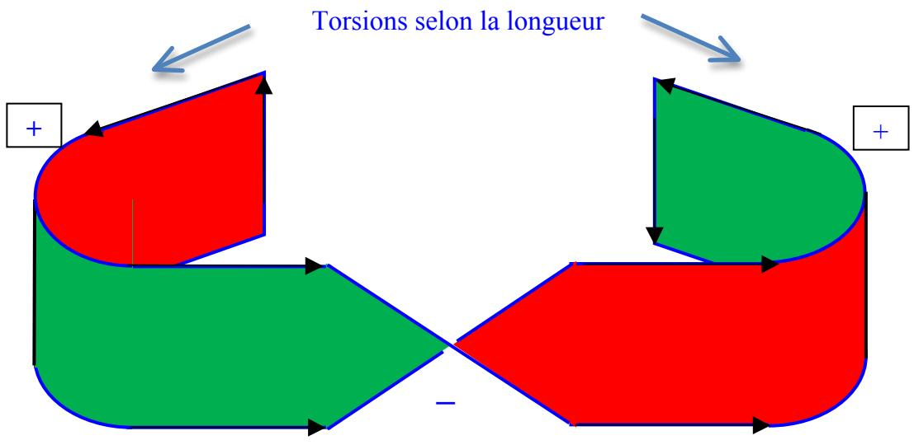  
Torsion selon la largeur

Toute torsion inverse la troisième dimension, et cela s’accompagne aussi de l’inversion de, soit l’une, soit l’autre, des deux dimensions de la surface.

La construction qui va suivre de la bande de Moebius carrée vient à l’appui de cette remarque : là, plus de différence de mesure entre les dimensions. D’ailleurs, les contraintes ainsi générées font disparaître toute différence entre pli et torsion. Ici, on n’a le sentiment de ne faire que des plis. Ils sont tous identiques et pourtant, ce sont des torsions.

## Démonstration 3 : travail manuel : construction de la bande de Mœbius carrée

Raccourci qui signifie : construction de la bande de Mœbius à partir d’un carré. Vous avez remarqué que ce qui caractérise une bande, la bande la plus commune, celle qui nous sert à construire les bande de Mœbius, c’est l’inégalité de la mesure de ces bords. Nous partons habituellement d’un rectangle. Essayez d’effectuer les trois mouvements de torsion indiqués plus haut à partir d’un carré ! Vous constaterez que vous manquez sérieusement d’amplitude pour votre mouvement. Une métaphore du blocage névrotique dans un symptôme ? Pourquoi pas…certains, qui se veulent très carrés, en morale ou en métaphysique, en logique ou en mathématique, peuvent y faire penser.

C’est pourtant possible, avec un peu d’astuce :

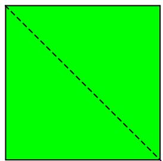

Plions le carré selon une diagonale (une torsion, +) : dans l’écriture (point de vue du plieur), c’est l’Autre face qui apparaît. Ça fait une torsion.

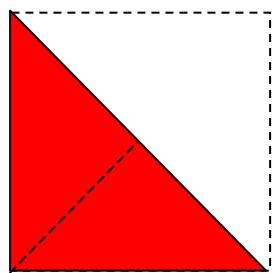

Plions le triangle obtenu selon la diagonale opposée. C’est une autre portion de l’Autre face qui apparaît. Ça fait deux torsions (encore une torsion, +).

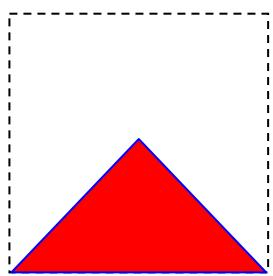

Si nous avons pris soin de colorier l’une et l’Autre, nous pouvons repérer, dans les quatre bords qui constituent la base du triangle obtenue, ceux qui font bord d’Une face, et ceux qui font celui de l’Autre face.

Ils sont opposés deux à deux. Pour identifier une face et l’Autre face, il suffit de coller une bande de scotch qui, enjambant un bord, réunit les bords de part et d’autre. Pour effectuer correctement cet office, la bande de scotch doit présenter une pliure : c’est la troisième torsion (-). On vérifie qu’on a bien construit une bande de Mœbius, en effectuant une coupure à deux tours dans l’objet obtenu. Il en tombe en effet un bilatère et une bande de Mœbius, plus aisément reconnaissable comme telle, puisqu’elle a acquis par cette opération la dissymétrie de bords que nous lui connaissons habituellement.

L’un des arguments des partisans de la bande de Moebius à une torsion serait que les torsions de raboutage s’annulent une fois celui-ci effectué. Or, ici, il est clair qu’aucune annulation n’est possible, mettant en valeur le même fait lorsque les dimensions présentent une différence de longueur.

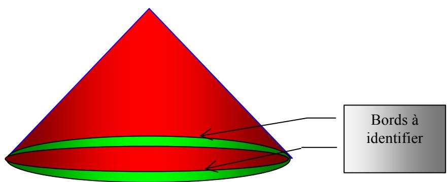

Ayant analysé le mode construction de son objet, le sujet peut encore une fois le jeter à la poubelle, avec son carré sophistiqué.

## Démonstration 4 : de la géométrie analytique à la topologie

Ecrivons sur notre papier (en l’occurrence, un écran d’ordinateur, alors, précisons : écrivons sur les deux dimensions, support nécessaire de l’écriture ) une bande de papier , c'est-à-dire la mise à plat d’une bande de papier toute simple :

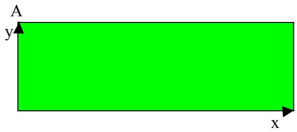

Notons les dimensions qui en tissent sa surface, x et y. Notons par des lettres ses quatre coins. Leurs coordonnées respectives dans le repère xy écrit par la bande elle-même seront :

- O $\{\mathrm{x} = 0,\mathrm{y} = 0\}$   
- A $\{\mathrm{x} = 0,\mathrm{y} = a\}$   
- B $\{\mathrm{x} = b,\mathrm{y} = 0\}$   
- C $\{\mathrm{x} = b,\mathrm{y} = a\}$

Construisons, à partir de cette bande, une bande de Mœbius. Pour cela, il nous faut quitter le plan de l’écriture, afin de porter C en O et B en A. Dans ce que nous éprouvons comme réalité de l’expérience, il nous semble que nous ne faisons qu’une seule torsion, en mettant en contact le dit plan de l’écriture avec celui qui en fait l’Autre face. Cette dernière n’est pas écrite, et même si nous écrivons deux fois le même rectangle que ci-dessus, en ajoutant en note : le premier est l’Une face, le second est l’Autre face, nous n’aurons pas la continuité requise par une bande de Mœbius. Pour chacune de ces écritures, nous supposerons une face cachée, qui n’est toujours pas celle qui est écrite à côté, mais qui la représente.

par un retournement R effectué selon l’axe des y, nous ne faisons que ramener C (nouvelle référence) à la place de A (ancienne référence) et B (nouvelle référence) à la place de O (ancienne référence) :

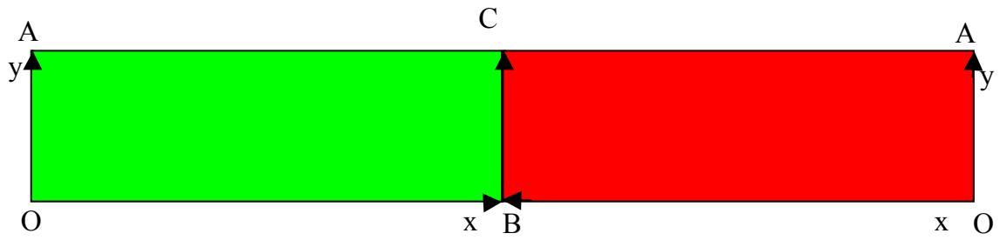

Cependant, tout en ayant effectué un mouvement progrédient dans le sens de x précédemment établi, nous avons inversé ce sens. Dans le repère de l’écriture précédente, x allait de gauche à droite, dans le nouveau repère de la nouvelle écriture il va de droite à gauche. Donc, tout en ayant rajouté, en se référant à l’ancien repère, une mesure $b = 2 b _ { \mathrm { ; } }$ , nous avons retranché une mesure –b dans une globalité qui prend en compte le dédoublage des repères.

\- par un deuxième retournement R’, selon l’axe des x, nous pouvons ramener alors C à ce qui était en O dans le premier repère, et A à ce qui était en B dans le premier repère. Ce faisant , nous avons inversé la dimension y. Tout en ayant rajouté une mesure a vers le bas, nous avons retranché une mesure – a. Nous avons construit une écriture de la bande de Mœbius :

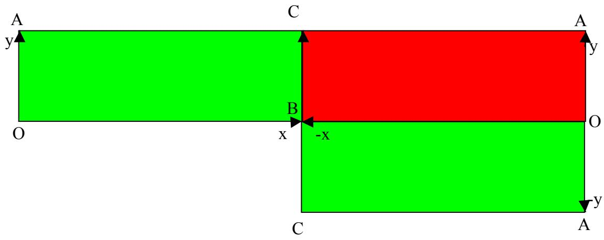

Les deux dimensions x et y sont à la fois annulées d’un point de vue global qui prend en compte le double changement de repère, et non annulées du point de vue local de chacun des nouveau repère mis en place.

Les opérations $2 a = a - a$ et $2 b = b - b .$ , écrivaient le paradoxe d’une écriture qui pose l’opération sans l’effectuer. Elles nous disent de surcroît que la surface $3 \mathrm { S } = 3 a b$ est à la fois une surface, produit de deux dimensions (en valeur absolue), et une coupure (en valeur relative) : le premier retournement annule relativement la dimension x, et réduit théoriquement la surface à sa dimension y. Le second retournement annule la dimension y par rapport à l’écriture précédente, mais non pas la dimension x par rapport à l’écriture seconde. Cette fois, la surface se réduit théoriquement à sa dimension x.

Globalement, le double mouvement de passage dans la troisième dimension a annulé xy, c'est-à-dire la surface. Nous avons construit un trou.

Ce trou soutient le paradoxe d’être néanmoins une surface, puisque la distinction des temps permet de conserver toujours une dimension relative (donc une coupure, et non un trou), et, localement, deux dimensions en valeur absolue. Selon les points de vue, notre appareil se présente donc comme à zéro, une, deux ou trois dimensions.

Nous sommes revenu au point de vue de la surface Une initiale. Pourtant, cette Une est écrite comme surface troisième, en un Autre lieu que la surface initiale. Il nous faut donc encore l’identifier à la surface Une première, sans quoi, rien ne nous dit que cette Une est la même que la Une précédente.

Nous allons l’effectuer :

par un renversement r (une rotation) autour du point B, qui est le seul à n’avoir pas changé de place de puis le début, nous identifions les positions première et tierce de A, O, C. Cette identification n’aura pas été faite en vain, puisque nous disposons à présent d’une Appellation d’Origine Contrôlée. En imaginant ce qui se passe dans cette rotation du point de vue de la $3 ^ { \mathrm { e m e } }$ dimension, nous comprenons que nous collons sur la surface verte initiale la surface rouge qui fait le dessous de la surface verte que nous manipulons. C’est là où nous identifions face rouge et face verte, ce qui m’amène à colorier cette identification en jaune, « et rouge, et verte », donc jaune. Cependant, cette localisation est toute relative. Nous pourrions colorier en jaune la deuxième face obtenue, a priori rouge, puisque annulant la dimension x, il ne reste virtuellement que la dimension y, écrivant autrement ce paradoxe de la bande de Mœbius, qui est d’être un bord (en principe : une dimension) qui présente pourtant une surface (deux dimension). Selon le même raisonnement, annulant virtuellement la dimension y, la troisième face obtenue, verte, pourrait aussi bien être coloriée en jaune. En effet une identification des deux faces se produit fatalement sur le bord, x ou y, dans la mesure où il est commun aux deux faces. « Commun » implique qu’il appartient aux deux faces et qu’on ne saurait choisir l’une des deux couleurs, rouge ou vert, nécessitant l’emploi d’une troisième, jaune.

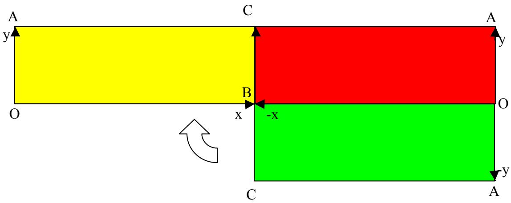

J’ai plusieurs fois employé le mot virtuel, car ma démonstration fonctionne sur les déplacements d’un rectangle de papier, chacun de ses emplacements n’étant que la trace, la mémoire de sa position précédente. Chacun de ces mouvements se présente comme une tentative de retour à une supposée écriture originelle, par exemple la première verte, mais ce pourrait être n’importe laquelle dans ce circuit. Autrement dit, chaque zone, chaque signifié (vert) produit par le mouvement (de la parole) reste insuffisant à s’identifier à ce que je suppose être la signification (rouge) que je cherche à dire, sans jamais y parvenir.

Nous retrouvons l’antinomie freudienne de la mémoire (écriture, fixe) et de la conscience (parole, mouvement), tension qui organise la structure de l’appareil psychique.

Pour écrire l’analyse des mouvements nécessaires à la construction d’une bande de Mœbius, nous sommes contraint de décrire trois opérations, deux semblables (les deux retournements) et une différente (le renversement).

Elles consistent en trois mouvements, chacun autour d’un des axes de l’espace 3 :

\- le premier autour de l’axe des x

\- le second autour de l’axe des y

\- le troisième autour de l’axe z qui perce le support de l’écriture au point B.

ce que nous pouvons écrire de manière condensée comme suit, qui est l’écriture correcte d’une bande de Mœbius :

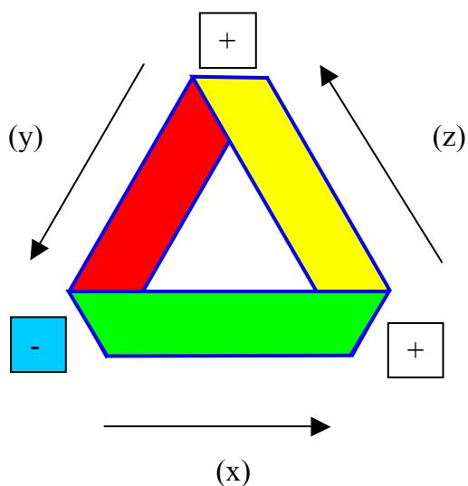

Nous y lisons les trois faces qui nous ont été nécessaire pour aboutir à cette écriture, la face Une (verte), la face Autre (rouge) et celle qui imaginarise le bord entre les deux, la Une qui est Autre (jaune): Une parce que semblable à la première, mais Autre parce qu’elle est à un autre endroit. Nous affectons chaque torsion de la lettre désignant l’opérateur à l’œuvre dans chacune d’elles, c'est-à-dire, la dimension axiale du mouvement.

Nous pouvons aussi noter la similitude des deux torsions combinant chacune une dimension du plan (x ou y ) et la dimension z de l’espace : +, +, par opposition à celle qui inverse les deux dimensions du plan (x et y ) sans toucher à z, (-). Autrement dit, les deux opérations semblables ont leurs opérateurs dans le plan de l’écriture, tandis que la troisième le prend dans la dimension Autre, la dimension du trou qui entoure le plan de l’écriture, où je situe la parole.

Ainsi, chacune des dimensions, comme opérateur de torsion (fonction), se trouve représentée par la surface qui lui fait face (objet). Z, en majuscule, est donc la surface qui représente la troisième dimension séparant l’Une et l’Autre faces, c'est-à-dire le bord.

Si les coordonnées des points de départ étaient :

$$
- \quad O \left\{x = 0, y = 0 \right\}
$$

$$
- \quad \mathrm{A} \{\mathrm{x} = 0, \mathrm{y} = a \}
$$

$$
- \quad \mathrm{B} \left\{\mathrm{x} = b, \mathrm{y} = 0 \right\}
$$

$$
- \quad C \left\{\mathrm{x} = b, \mathrm{y} = a \right\}
$$

à l’arrivée, nous avons C en O et B en A. Donc, nous avons

\- le point OC : {x = 0, y = 0}et {x = b, y = a} soit : { x = b =0, y = a = 0}

\- le point AB : {x = 0, y = a}et {x = b, y = 0} soit : { x = b =0, y = a = 0}

Nous avons construit théoriquement un plan projectif, ayant ramené toutes les coordonnées de l’objet au zéro de la fonction.

Mais nous l’avons fait en trois temps qui nous ont permis de développer :

le point de vue de la surface comme représentant le produit de deux dimensions, la surface Une, verte, S = ab

le point de vue de la surface comme représentant une coupure ; la surface Autre, rouge, de dimensions {y = a, x = b – b = 0}

le point de vue de la surface comme représentant un trou, la surface Une bis verte { x-x = b =0, y-y = a = 0}.

Moyennant quoi, nous avons un modèle pour une théorie de la représentation, ce qui se rapproche plus de la psychanalyse qu’une théorie de l’objet.

Ceci fait, nous pouvons jeter toutes ces écritures à la poubelle avec les papiers qui nous ont servis de support pour les démonstrations précédentes. Et cliquer sur « vider la poubelle ».

lundi 14 octobre 2002

## Démonstration 5 : travail manuel : construction de la bande de Mœbius homogène

La bande de Mœbius à une seule torsion pourrait prendre sa justification de la bande de Mœbius à trois torsions : si la première n’a qu’une torsion, il suffirait d’en ajouter deux pour obtenir la seconde.

Construisons une bande de Mœbius « à trois torsions » : nous effectuons les même mouvements que pour la bande « à une torsion » : nous sommes obligés d’en faire déjà une comme démontré précédemment, puis d’en faire deux pour rabouter les deux faces.

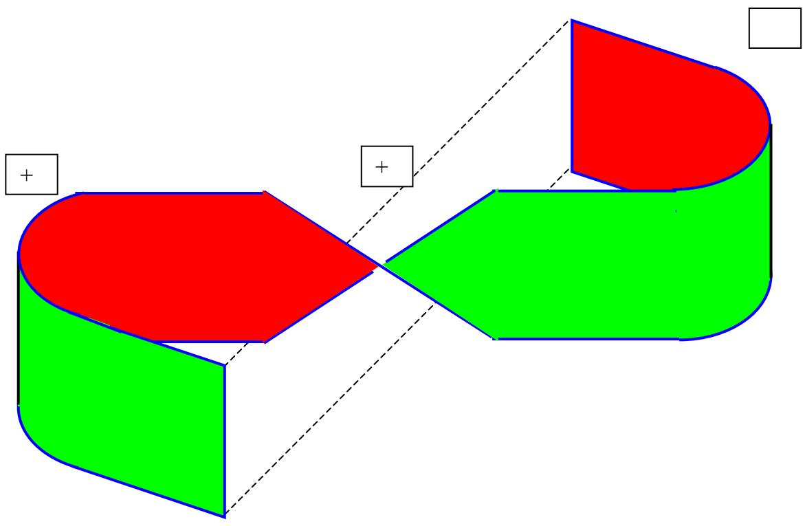

La différence entre la bande hétérogène (dont une torsion n’est pas de même sens) et celle-ci, homogène (toutes les torsions sont de même sens) ne tient donc pas au nombre des torsions, mais au sens de celles-ci. Il n’est toujours pas possible de construire une bande à une seule torsion, ou même à deux torsions. On n’a pas dû ajouter la moindre torsion par rapport à l’exercice précédent. On le vérifie : d’un simple mouvement de doigt qui inverse le sens de la torsion, on passe de la configuration dite « à une torsion » à la configuration dite « à trois torsions ». Autrement dit, la dite « à trois torsions » pourrait s’intituler tout aussi légitimement « à une torsion ». Mais on voit bien que la question n’est pas là.

La mise à plat confirme les trois torsions, et, à l’homogénéité du sens des torsions, se rajoute l’évidence de l’homogénéité des faces : toutes les zones sont à la fois dessus celle qui suit et dessous celle sui précède. Il n’est pas possible comme dans la bande hétérogène, de colorier une face en vert (dessus) et une face en rouge (dessous). Tout doit être colorié en jaune comme la seule zone dessus-dessous de la bande hétérogène.

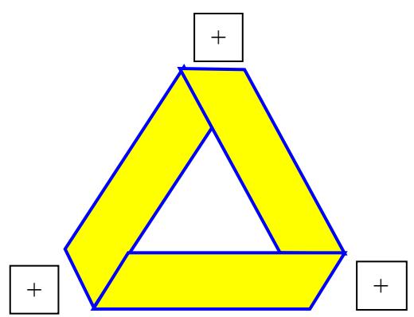

Ce qui justifie l’intérêt de ces écritures par opposition au dessin :

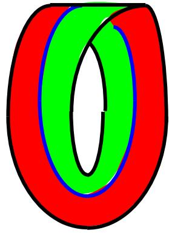

…qui ne permet pas la lecture des deux torsions de sens contraire.

D’un autre côté, cela permet de comprendre mieux l’argument de ceux qui tiennent à considérer la bande de Mœbius comme un objet à une seule torsion : ce qui fait torsion, finalement c’est la différence entre le sens des torsions ; d’où l’on pourrait dire la torsion, c’est celle qui est notée $\langle < - \ \rangle > \quad ; \ldots \ \dot { \mathrm { a } }$ condition d’ajouter que, du coup, la bande qu’ils disent « à trois torsions » n’en comporte en fait aucune, puisqu’il y a effacement de la différence. Retour dialectique : si elle n’en comporte aucune, et sachant que toutes les faces isolées par l’écriture sont discordentielles, c’est qu’elle est la torsion comme telle. Ce qui revient à confirmer mon propos de départ : la torsion, s’il n’y en a qu’une, ne peut être que triple.

Nouveau retour dialectique : la bande homo, si elle est la torsion comme fonction, ne fonctionne pas, car elle ne produit aucun objet. Sa mise en œuvre (c'est-à-dire : son écriture) ne permet pas de passer d’Une face à une Autre face, puisqu’il n’y a aucune localité. C'est-à- dire : l’écriture ne permet pas d’isoler une localité ; bien sûr, on pourra toujours dire qu’en un point de l’objet, il y a une localité. Mais cet « il y a », c’est une écriture implicite, qui tout en se référant à l’objet dans une ontologie non avouée, écrit sans le dire la différence des deux faces qu’on peut en effet lire sur l’écriture de la bande hétéro (je dis « il y a » parce que je lis ces deux faces, et si je les lis, c’est que je les ai écrites8). On ne peut pas effectuer cette lecture sur l’écriture de la bande homo. Son écriture n’isole que des surfaces qui, étant toutes à la fois dessus et dessous, ne se distinguent pas l’une de l’autre, et ne se distinguent pas non plus d’un bord : un bord, c’est ce qui est à la fois dessus et dessous. La bande de Mœbius homo représente la fonction figée en objet, telle qu’elle se présente dans la psychose. Pour qu’elle fonctionne, il faudrait qu’elle le prouve en produisant des objets qui se différencieraient de la fonction : c’est ce qui se passe dans l’écriture de la bande hétéro.

Conclusion : on ne peut pas se passer des trois torsions.

## Démonstration 6 : l’écriture est une coupure

J’appelle “dessin” l’inscription qui ne laisse lire qu’une torsion, parce qu’elle n’analyse pas la structure de la bande de Mœbius. Cependant, telle que je l’ai présentée cidesssus, un artéfact de dessin permet de présenter cette structure en coloriant les bords. Dans le réel du dessin, aucun accident de trait, aucune différence ne permet de préjuger de cette structure :

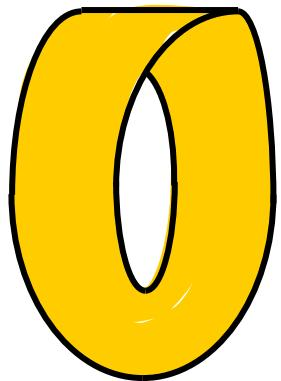

le fait de l’écrire ainsi :

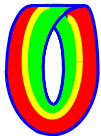

…indique l’inscription, comme artéfact d’un savoir obtenu de l’expérience. Quelle expérience ? Celle de la coupure longitudinale.

Par le milieu, elle se recoupe après un tour et permet d’obtenir une bande bilatère aux torsions homogènes :

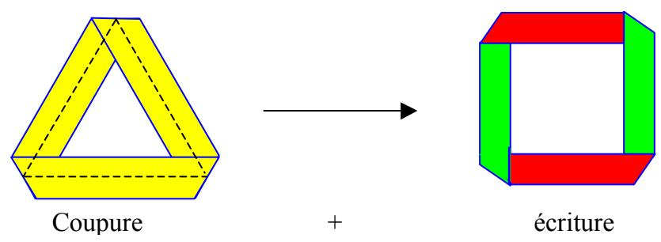

Ce qui fait que cette bande est sphérique du point de vue global (deux faces), mais asphérique du point de vue local : chaque zone est à la fois dessus et dessous par rapport à des repères locaux (la zone précédente, la zone suivante). Elle est également sphérique du point de vue global des surfaces (hétérogène) mais asphérique du point de vue des torsions (homogènes). Pour obtenir ce savoir, il faut non seulement opérer cette coupure, mais encore faire l’expérience de l’écriture. Il n’y a qu’en coloriant (ou en faisant une marque quelconque tout le long d’une face) qu’on se rend compte de cela : les tortillons obtenus après coupure ne parlent pas, seule cette écriture le « fait parler » en lui faisant révéler cette structure, dès lors inséparable de l’écriture, du réel de l’écriture.

Le long des bords, la coupure nécessite deux tours pour se recouper, et réalise le même objet que ci-dessus, mais enlacé à un reste exactement semblable à la bande départ.

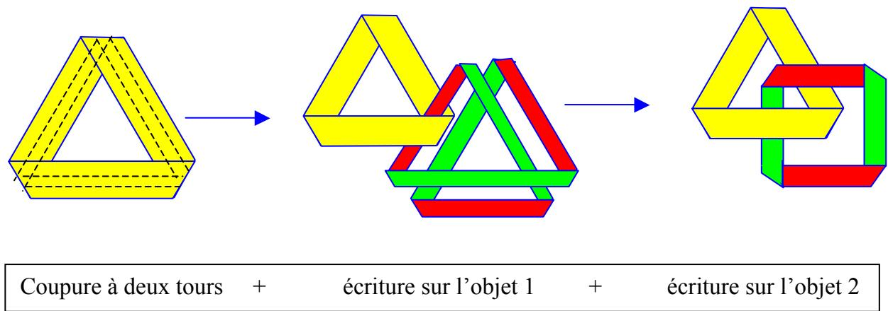

Comme précédemment, on n’obtient ce savoir que par l’expérience de l’écriture sur les deux objets. Autrement dit :

acte : coupure à UN tour à objet à UNE écriture sur l’objet à savoir : l’objet obtenu est bilatère.

Acte : coupure à DEUX tours à DEUX objets à DEUX écritures, une sur chaque objet à savoir : l’un est bilatère, l’autre est unilatère.

Il y a donc congruence entre le nombre des coupures, le nombre des objets, et le nombre des écritures, et s’il n’y avait eu écriture, on n’aurait pas su qualifier ni différencier les objets : il n’est d’objet que d’écriture. Le bilatère ne prend sens que par rapport à l’unilatère, et inversement. Une torsion ne prend sens que par rapport à une autre. Une zone n’est bilatère ou unilatère que dans le rapport à la zone précédente, la zone suivante, ou l’ensemble des zones…etc…ce qu’on écrit, le savoir, ce n’est toujours que de la différence qu’engendre le fait d’écrire.

Or la mise plat d’une bande, quelle qu’elle soit, est équivalent à une écriture parce qu’elle permet de lire :

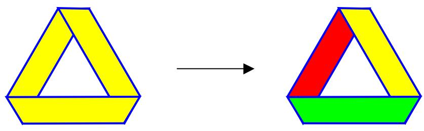  
Mise à plat = coupure = écriture

On lit très bien en effet, qu’il y a une surface dessus (verte) une surface dessous (rouge) et une surface dessus-dessous (jaune): la mise à plat a donc produit la même chose qu’une coupure à deux tours. Elle révèle ici qu’il s’agit de la structure de la bande de Mœbius, non pas une structure « en soi », car rien n’est a jamais « en soi », mais toujours « pour quelqu'un », c'est-à-dire pour un certain point de vue. L’objet produit, le bilatère rouge et vert, reste enlacé à l’unilatère jaune, de même que, dans l’écriture ci-dessus, les zones sont liées entre elles par des torsions. Les torsions sont donc aussi l’écriture de la coupure.

Il n’est pas possible d’écrire une bande de Mœbius « en soi », telle un objet purement transposé. J’ai colorié l’écriture de droite en jaune pour exprimer la désorientation première, mais c’est cela qui est artéfact d’écriture, voilant de jaune ce que l’écriture écrit malgré tout. Tout dessin s’avère le produit d’un point de vue, et si celui-ci propose le point de vue d’un savoir transposé dans le dessin :

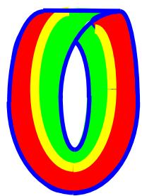

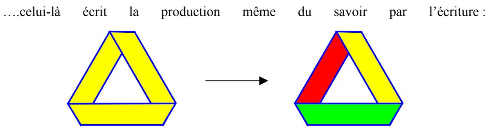  
Mise à plat = coupure = écriture

…non pas savoir sur « l’objet » mais sur un sujet développant les divers points de vue possible sur un objet au travers des accidents de l’écriture comme telle, c'est-à-dire de ce qui est repérable comme différence au sein même du réel de l’écriture.

Ainsi en est-il de la mise à plat sur le divan, qui permet au sujet de développer les différents points de vue sur son objet fantasme ; on a pu appeler ça « la traversée du fantasme ». Il va pouvoir lire en direct les écritures qu’il produit au moment même de leur production : lapsi pendant la séance, récit de rêves, d’actes manqués et de symptômes. Il ne s’agit pas de retrouver le réel d’une origine et d’une histoire « objective », il s’agit bien plutôt de la reconstruire en l’écrivant. Ceci va permettre d’établir une écriture précise, c'est-à-dire orientée (face verte, face rouge), et laissera toujours de côté une part d’inorientable (jaune : impossible de décider si dessus ou dessous), cause du désir : l’objet a. Et c’est cela qui va permettre de nouvelles orientations, soit la remise en mouvement

## Intérêt des trois torsions pour la psychanalyse

L’intérêt de la distinction : bande de Mœbius homogène, bande de Mœbius hétérogène se situe dans un renvoi à la grammaire de Damourette et Pichon, dont Lacan a su faire l’usage que l’on sait. L’hétérogène écrit la négation discordentielle, le « ce n’est pas ma mère » que j’ai évoqué à la démonstration 1. C’est aussi le « je crains qu’il ne vienne » où le « ne », dit par Lacan « explétif », représente le sujet de l’énonciation, dans l’hésitation de son désir : sur une face je crains, sur l’Autre face, je désire… quoi ? qu’il vienne, l’objet cause du désir, représenté sur cette troisième face qui n’est ni d’un côté ni de l’Autre, mais incline le sujet à pencher d’Un côté ou de l’Autre. Le « ne » est représenté par la torsion entre un « je crains » et un « je désire », ambivalence des sentiments dont l’Un peut basculer en l’Autre grâce à cette ouverture que maintient l’objet (surface) de par sa distinction d’avec le sujet (torsion = bord ≠ surface). L’objet est comme le bâton qui maintient ouverte la gueule du crocodile. La contrepartie de son existence, c’est la fonctionnalité de la fonction Φ qui maintient, elle, la possibilité de la torsion, c'est-à-dire de la fabrication d’objet par le passage d’une face à l’autre.

« C’est l’ετεροσ, remarquons-le, qui, à s’y embler de discord, érige l’homme dans son statut qui est celui de l’hommosexuel. Non de mon office, je le souligne, de celui de Freud qui, cet appendice, le lui rend, et en toutes lettres. » (Lacan, L’Etourdit, p. 24)

Cette hétérogénéité du sujet et de l’objet (témoin de ce que la fonction fonctionne, en produisant de l’objet) n’apparaît pas sur la bande de Mœbius homogène. Dans l’écriture de cette dernière, il est impossible de distinguer une localité. Dans l’écriture de l’hétérogène la localité s’inscrit depuis les signes de perception (cf. les Wahrnehmungzeichen de la lettre 52) : entre + et – ce n’est pas la même place qu’entre + et + , ni qu’entre – et +. Mais entre + et + il y a la même différence qu’entre un gendarme.

De ce fait, il est impossible de distinguer la surface du bord. De ce fait la surface n’est que bord, ou le bord n’est que surface : si la surface est représentation de chose, et le bord, représentation de mot, alors les mots y sont équivalents aux choses : nous avons une bonne écriture de la schizophrénie. La fonction n’engendre plus d’objet : elle est elle-même bloquée en objet. Le mouvement de la torsion trouve bien à s’écrire, mais justement, il ne cesse pas de s’écrire. Aucune torsion de sens contraire ne vient lui apporter de limite.

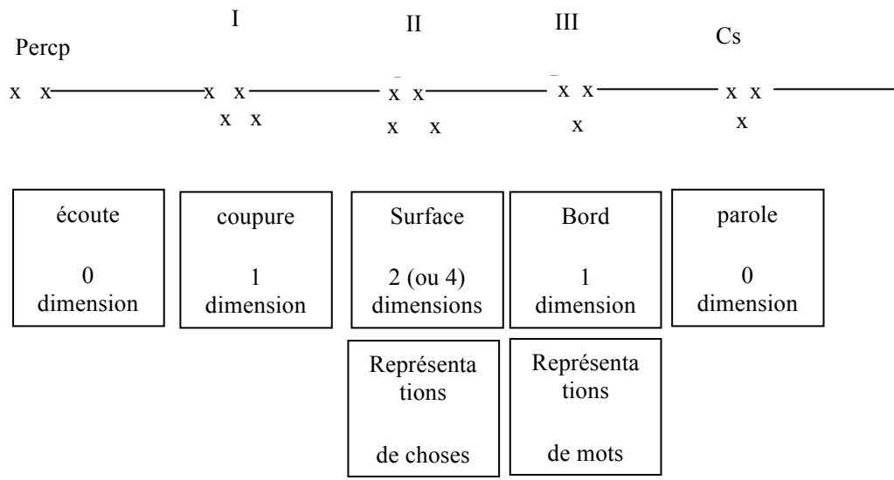

## Une écriture de l’inconscient

Si nous reprenons l’écriture du schéma de la lettre 52 de Freud à Fliess :

… nous pouvons en transcrire les données sur la bande de Mœbius hétérogène, en suivant les indications de Freud, qui considère que les deux extrémités doivent se rejoindre :

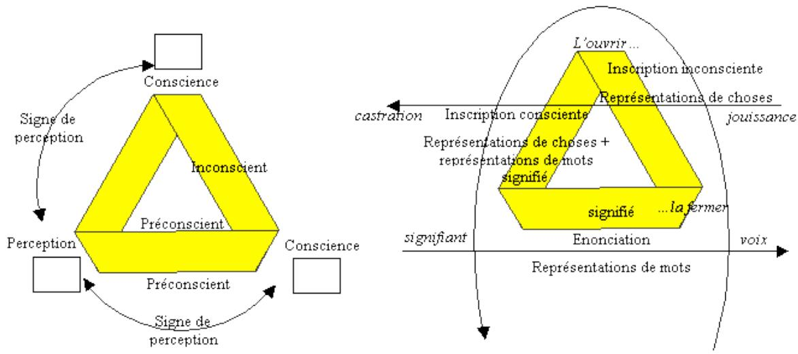

En suivant les indications de la « Metapsychologie » (1915) , nous procédons à un triple encodage, tel que Freud le propose dès la lettre 52 :

Les signes de perception seront les différences perçues dans le sens des plis. A partir de cette différence minimale se crée de la dimension, conformément à la définition de Poincaré9.

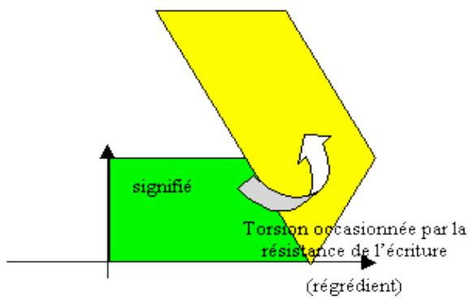

Les représentations de choses, domaine de l’inconscient seul, seront les surfaces. Une $2 ^ { \mathrm { { e m e } } }$ dimension vient s’articuler à la première : le produit de deux dimensions est bien une surface. Comme l’écrivait Freud dans « l’Esquisse », la conscience est incompatible avec la mémoire. La première est effet de la parole, la seconde, effet de son enregistrement , donc de son écriture. La linéarité de la parole se trouve donc tordue par ce qui est en mémoire (écrit), et par ce qui est en train de s’inscrire dans la mémoire de par son effet actuel lors de l’énonciation.

\- Les représentations de mots, situées dans le préconscient, seront les bords. A la trouure de l’énonciation, ils opposent la linéarité du discours, qui, articulant les signifiants en chaîne, se referme en boucle pour produire du signifié (de la surface). Les représentations de mots encadrent donc de la surface, la transformant en figure dont on peut se saisir, c'est-à-dire en écriture, à laquelle on donne le nom de signifié.

Le bord représente l’écriture de la 3ème dimension, absente comme telle de l’écriture.

Il n’est de signifié qu’à partir de l’effet du signifiant, et celui-ci s’inscrit sous cette forme du bord qui représente ce qui, dans l’écriture, n’est pas là, le mouvement (représenté plus précisément par le pli) et la troisième dimension, qui, par son absence, se pose en métaphore de la perte de la voix.

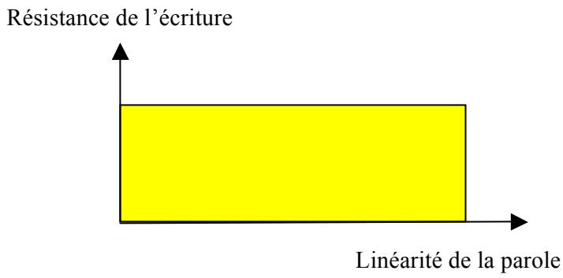

Ce qui ne peut se dire ne cesse pas de ne pas s’écrire, jusqu’à ce qu’un écrit permette d’en dire quelque chose, mais pas tout. Ce qui n’a pas trouvé parole s’écrit dans une des formations de l’inconscient, notamment dans le rêve, où il est clair que la possibilité de parole est coupée, comme tout accès à la motricité. Le paradoxe de bande de Mœbius représente bien le paradoxe de l’appareil psychique : il n’y a qu’une face (∀x Φx), mais l’écriture impose un démenti local, où il y en a deux (∃xΦx) ; son bord unique (∃xΦx) est trace d’une coupure qui a produit de l’orientation locale, mais pas partout (∀x Φx).

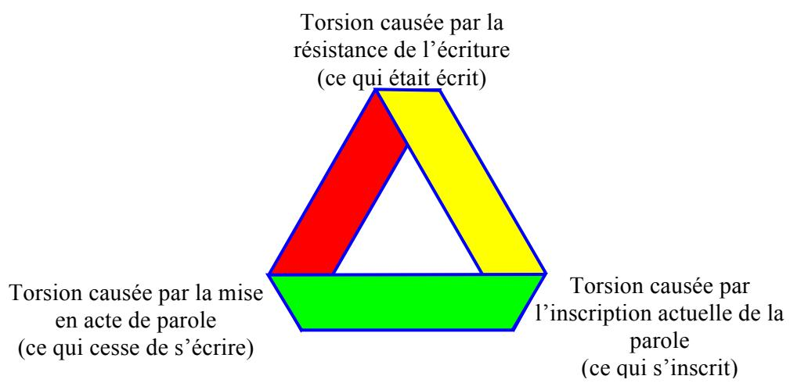

L’intérêt de la bande de Mœbius écrite avec ses trois torsions hétérogènes réside en ceci, que l’encadrement des représentations de choses par les représentations de mots produit deux sortes d’inscriptions, deux sortes de surface : les surfaces orientées (Une dessus, l’Autre dessous) et la surface désorientée (celle qui est dessus-dessous). Son paradoxe tient en cela, que cet encadrement apparemment global, laisse hors cadre la globalité de la bande, représentée dans l’écriture par la face dessus-dessous.

L’écriture de droite combine ces données avec quelques unes de celles avancées par Lacan dans le graphe de « Subversion du sujet et dialectique du désir ». Je me suis permis d’inverser le sens de la flèche supérieure, de façon à rendre cette écriture du graphe plus conforme à cette écriture de la bande de Mœbius. Dans cette perspective, et si les deux flèches parallèles de Lacan représentent bien la double inscription freudienne, représentation de chose, représentation de mot, la flèche supérieure, représentation de chose, devrait en fait être écrite par de la surface, ou alors, non pas parallèlement, mais perpendiculairement à la première de façon à produire de la surface.. Mais c’est ce qu’on peut lire déjà dans l’écriture de Lacan : pas de surface sans bord, et c’est entre ces deux flèches comme bords qu’il écrit en effet le fantasme, $\$ \diamond a,$ si on veut bien ne pas se laisser abuser par sa localisation ponctuelle. Cette localisation répond à l’ouverture du désir, d, placé en face, dont on se rappelle que, dans sa construction du graphe, Lacan l’avait placé au point où la flèche montante se divise, inaugurant entre ses branches… de la surface. En l’occurrence, un trou occupant une certaine surface que le fantasme recouvre.

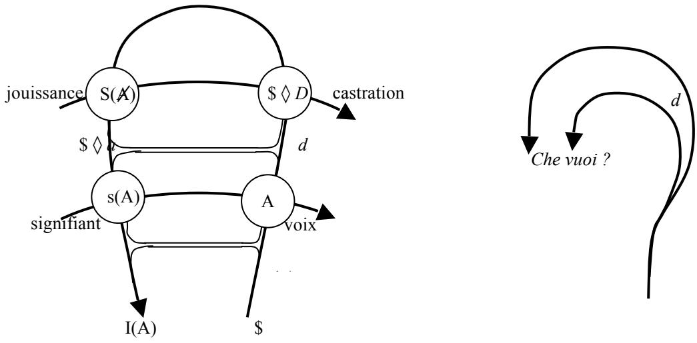

Il faut bien saisir que ces concepts ne sont pas localisés à un point du schéma. Freud, dans la lettre 52, inscrit les cinq instances de la même façon, par des petites croix désignant des points. Lacan, dans son graphe, ne distingue pas entre surfaces d’une part, trajets et points de croisements d’autre part. Il ne différencie pas non plus entre surface et trou. Par exemple, A est indiqué comme point de croisement. On pourrait lui attribuer une surface, trouée par S(Abarré), lui aussi indiqué comme point de croisement, mais qu’on écrirait mieux, conceptuellement, comme trou.

On lirait ainsi la bande de Mœbius comme surface A tordue par le trou S(Abarré). Ou encore les représentations de choses étant surface, elles sont partout et non localisées en un point de l’écriture ; elles sont la surface comme telle. De même, les représentations de mots sont partout, et pourtant, dans la face désorientée, elles sont comme dissociée de la surface : elles ne font pas bord dans cette localisation, parce la surface elle-même étant désorientée, à la fois dessus et dessous, elle est elle-même un bord. Le bord, c’est ça qui est à la fois dessus et dessous.

On pourrait pousser plus loin l’étude de cette correspondance entre le graphe et les écritures topologiques ; je me propose de le faire ultérieurement.

La formule : « correspondance point par point » n’est évidemment pas ici valide, puisqu’on passe des points et des lignes, aux bords, surfaces et trous. Sans doute cela est-il vrai de toute traduction, et a fortiori de la traduction des formations de l’inconscient, à laquelle de tels exercices préparent.

## Une écriture de la névrose

Effectuons un parcours sur la bande de Mœbius hétéro, en notant les plis par des signes distinctifs selon leur sens. + pour le passage de dessus à dessous, - pour le passage de dessous à dessus. Notre repérage sera la lecture extrinsèque que nous faisons logiquement de l’écriture, telle qu’elle se présente à nous. Nous ne supposons pas une face cachée de l’autre côté de la page, puisque la page est unilatère : nous ne lisons jamais le recto et le verso à la fois. De plus, l’Autre face est justement déjà là dans cette écriture, à un autre emplacement, sur la même face qui se présente au lecteur ; il n’y a qu’à le lire. L’écriture a remplacé les dessus-dessous par des « à côté ». Mais nous pouvons tenter de confronter l’extrinsèque du réel de notre lecture à l’intrinsèque d’un parcours imaginaire sur la surface : ce pourrait être un bon modèle pour la rencontre du Sujet et de l’Autre.

Parcourons donc cette écriture en partant d’en haut, sur cette partie de la zone jaune où j’ai écrit « dessus ».

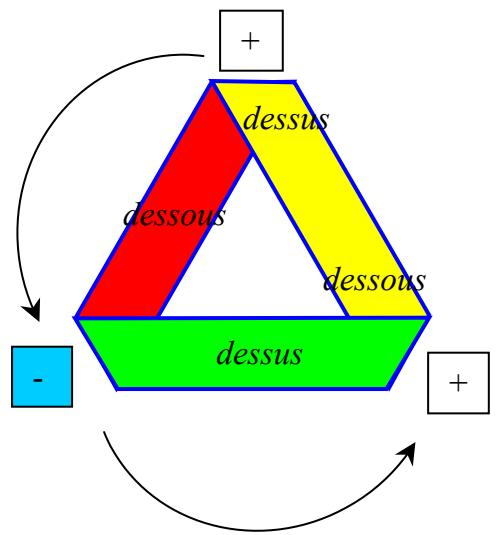

Notre parcours de lecteur ne rencontre pas de difficulté, jusqu’à ce que nous nous retrouvions sur la zone jaune de départ : « avant », nous l’avions lue « dessus », « maintenant », la logique de notre parcours nous a amené sur un «dessous»….

Notons bien ceci : quel que soit l’endroit de départ que vous choisissez, le résultat est le même. C’est pure question de logique : nous avons une surface d’écriture, la bande de Mœbius, qui est à trois zones. Et, pour nous repérer, nous voulons inscrire sur ces 3 zones une différenciation à deux éléments, dessus et dessous. C’est une confrontation du 3 et du 2, de l’impair et du pair. Fatalement, si vous écrivez successivement « dessus » puis « dessous » à chaque franchissement de seuil, au bout de trois changements, vous tombez sur une contradiction : ce que vous aviez noté « dessus » au départ se retrouve avec la mention « dessous » issue de la logique « du 2 sur du 3 » du parcours. Même si vous êtes parti de la surface verte : au bout d’un tour, si vous l’avez notée « dessus » au départ, elle se retrouve « dessous » à l’arrivée. C’est vrai aussi pour la face rouge, et pour la face jaune.

C’est ça la structure de la bande de Mœbius : elle est partout à la fois « dessus » et « dessous ». Ce que j’en inscris avec une face « dessus » verte, un face « dessous » rouge et une face « dessus-dessous », jaune, c’est l’écriture d’un parcours singulier, correspondant à ce qui s’écrit de la bande par sa mise à plat. Ce simple parcours suffit à dévoiler la structure de la bande : localement il y a un dessus et un dessous, mais globalement tout est dessusdessous, ce qui s’inscrit localement dans la zone jaune, du fait de ce réel de l’écriture qu’est la mise à plat. A partir de cette homogénéité, la bande de Mœbius hétéro permet néanmoins une écriture hétérogène en trois zones distinctes, ce que ne permet pas la bande homo. La fonction fonctionne d’autant plus qu’on peut l’écrire (zone jaune), et écrire à son côté l’objet qu’elle produit (rouge-vert). Cette homogénéité de la bande hétéro, c’est de la coupure en acte. Dans la bande homo, c’est de l’objet.

Il faut bien faire attention à ce paradoxe : la zone jaune écrit localement ce qu’est la structure globale de la bande de Mœbius.

Cette face jaune est donc à la fois dessus et dessous… Nous sommes confrontés à une négation discordentielle : je crains que ce ne soit dessous, là où nous pourrions être tenté de ne vouloir entendre qu’une négation forclusive : ce qui est dessus n’est pas dessous.

« Je », le « je » qui désire, peut à ce moment craindre la contradiction, comme le petit Hans qui a peur d’en vouloir à son père parce que c’est un rival auprès de sa mère, alors qu’en même temps, il l’aime. « Je » recule devant la contradiction logique, et, dans l’inhibition, refuse d’avancer plus loin. « Je » reste chez moi, cloué par la phobie.

« Je » peux choisir aussi la régression sur mon parcours. Je parviens alors au pli par lequel je viens de passer : je l’avais noté « - » comme passage du dessous au dessus. Or, mon parcours m’amène à présent, si je veux rester logique, à le noter « + » puisque ma régression se fait dans le sens de dessus à dessous. Je suis donc coincé entre les contradictions de ma propre notation, et dès lors, renvoyé sans fin entre un « u » et un « o » incompatibles et « + » et un « –» tout aussi incompatibles. Ce serait un modèle de l’obsession.

Enfin, je peux décider de ne pas voir la contradiction des notations de pli, et revenir jusqu’au pli de départ. Cette grande régression ne m’empêche pas de retomber par l’autre côté sur la contradiction des faces, qui m’arrête à nouveau. Je reste bloqué à cet endroit là, qui, par défaut d’autre nomination, s’avère le lieu de l’hystérie. Lieu où la torsion fait osciller entre le symptôme somatique et l’angoisse, tout deux étant surfaces, représentations de choses : le premier et une surface orientée, car le symptôme, à l’abri de l’alibi somatique, écrit quelque message de l’inconscient bien lisible ; le second est surface désorientée entre dessus et dessous, momentanément illisible, mais où l’objet de l’angoisse s’avère le même que l’objet cause du désir.

Entre ces deux faces, la face horizontale qui soutient les trajets de l’obsession et ceux dictés par l’inhibition de la phobie, prendra le nom d’inhibition.

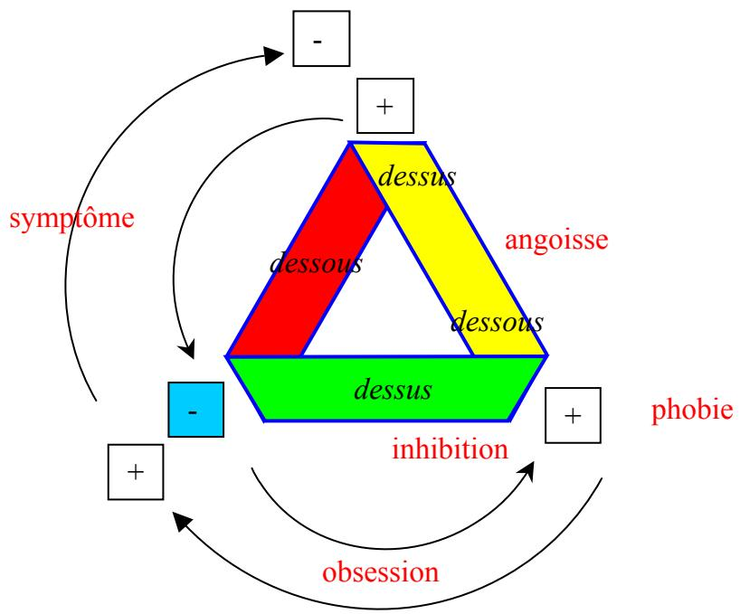  
On voit qu’il est très facile de passer de l’une à l’autre, en fonction des choix de trajets.

## De la lettre au signifiant : une écriture de l’analyse.

Finalement, cette dimension forclusive représente n’importe quel symptôme, ou manifestation de l’inconscient, lettre qui écrit ce qui ne peut se dire. Sans qu’il soit besoin de symptôme, d’inhibition, ou d’angoisse, un rêve, un lapsus, un acte manqué suffit parfois à écrire la contradiction, qu’elle se situe dans les plis, dans les faces, ou dans les deux, si le récit de cette formation de l’inconscient trouve un interlocuteur. Ça signifie : descendre là, sur cette face « dessous » qui est aussi « dessus » : « mettre les deux pieds dans le caniveau », comme le dit Jean-Michel Vappereau, empruntant à Wittgenstein.

J’écris les différences de face par des lettres : « u » pour dessus et « o » pour dessous. Et sur cette face problématique, à la fois dessus et dessous, contradiction qui n’est due qu’à ma lecture et à mes propres notations inscrites au préalable, je peux écrire côte à côte « u » et « o », mais pas sur la même bord : c'est-à-dire faire le récit de cette formation de l’inconscient.

C’est se lancer dans un deuxième parcours sur la bande de Mœbius. Autrement dit, si le premier parcours représentait la coupure à un tour (qui produit seulement un bilatère, un objet à deux faces, forclusif), il s’agit de se lancer dans la coupure à deux tours (qui produira, en plus d’un bilatère, une autre bande de Mœbius enlacée, unilatère, discordentielle).

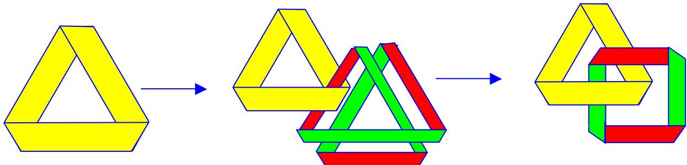

Je suis passé d’un encodage des faces et des plis à un chiffrage des bords. Je me repérais grâce aux signes de perception « + » et « - », qui me permettaient de lire dessus et dessous, Une face et l’Autre face. Je viens à présent d’effectuer la coupure à deux tours, c'est-à-dire de remplacer les représentations de choses « Une face », « l’Autre face » par des représentations de mots : « o » et « u », autrement dit, des phonèmes. J’ai trouvé à qui parler des formations de l’inconscient. Je me rends compte que l’objet désorienté , jaune, qui tombe de la coupure, a exactement la même structure non seulement que l’objet de départ, mais encore de la fonction mise en œuvre lors de la coupure :

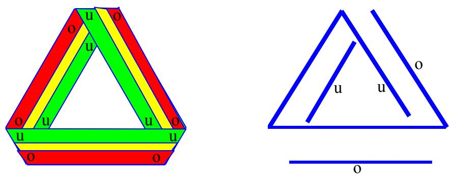

Et comme j’ai établit l’équivalence de la coupure et de l’écriture, je peux poursuivre dans ce sens en trouvant une écriture de la fonction, une écriture de la parole, sur les bords. La linéarité saussurienne du signifiant s’inscrit alors du bleu de la coupure. En lisant ce trait bleu tel qu’il s’écrit, c'est-à-dire en respectant ses coupures, nous trouvons une première continuité, le son prononcé « u » de « dessus », qui, après un tour trois fois tordu dans l’inconscient, se retrouve entendu comme le « o » de « dessous ». le même trait s’avère s’énoncer de deux façons différentes, et pourtant c’est la même énonciation, ou mieux : ce sont les deux bords de la même énonciation discordentielle:

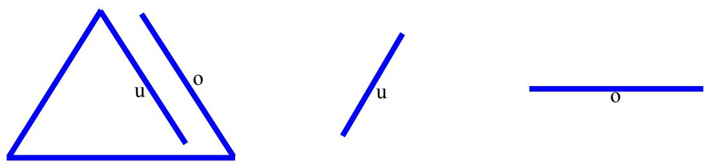

Nous distinguons ensuite les deux traits, forclusifs : « u » d’un côté, « o » de l’autre. L’opposition discordentiel-forclusif des surfaces (jaune – vert.rouge), c'est-à-dire des lettres se dialectise de la même opposition dans le domaine du signifiant : u-o discordentiel, u et o, forclusif.

Comme Emma (cf. « l’Esquisse »), je me rends compte que le traumatisme de la contradiction entre la lecture « dessus » et la lecture « dessous » n’était due qu’à mes propres inscriptions. Mon 2ème passage sur la face « moebienne » entrait en contradiction avec le premier du fait de la notation que j’avais laissée là : du fait de son écriture. La parole me permet de relativiser cet état des « choses », en me permettant d’accepter la cohabitation d’une inscription présente avec une inscription passée contradictoire, un « o » à côté d’un « u ». La remise en acte de la temporalité de la parole permet une autre inscription de la temporalité. Ce que ne permettait pas la lettre, le signifiant l’autorise.

La contradiction ainsi écrite peut se situer dans le champ logique (+ et -, aimer et haïr, noir et blanc, etc…), dans le champ grammatical (actif ou passif, forclusif ou discordentiel, sujet ou objet, etc…), ou dans le champ de l’homophonie (le même signifiant renvoyant à plusieurs signifiés).

Tout se passe comme si j’avais ajouté une torsion supplémentaire à la place de la face jaune qui faisait problème de sa désorientation. Le passage sur les bords représente la torsion qui se trouve en face dans l’écriture :

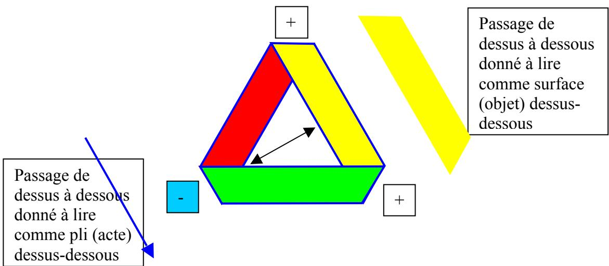

C’est bien un passage de dessus à dessous, mais sur la même face, c'est-à-dire sur la linéarité de la parole. Dans mon parcours, je peux à présent choisir telle ou telle orientation. Pour un nouveau départ dans la vie (c'est-à-dire, à partir de cette face là, qui faisait problème de la contradiction oedipienne, aimer et haïr papa en même temps), je peux :

\- choisir de rester dessous parce que ce bord là, je le dis « o », et alors je peux jalonner un nouveau parcours, étant, à chaque face, sur l’Autre bord que lors de mon parcours précédent. J’achève ainsi la coupure à deux tours, et je constate, depuis ma position extrinsèque que je viens de dialectiser d’un parcours intrinsèque, que tous les « o » sont « externes » et tous les « u » « internes » . J’ai donc trouvé une écriture des dessus-dessous par les dedans-dehors.

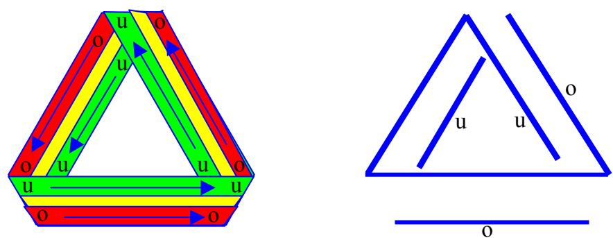

La correspondance de l’un avec l’autre est tout aussi arbitraire que le choix que j’avais fait au départ de me situer sur une face dite « dessus » ; j’aurais pu, choisissant la même face, l’intituler « dessous ». Chaque bord peut dès lors être lu comme une torsion : il opère en effet le passage de dessus à dessous. Au centre se lit, en reste, jaune, la bande de Mœbius qui a opéré la coupure, c'est-à-dire le passage au bords, c'est-à-dire encore, le passage aux représentations de mots. Sur elle ne s’inscrit aucune lettre, puisqu’elle est fonction, mouvement, passe de la lettre au signifiant.

\- choisir de changer de bord afin de rattraper le trajet de mon premier parcours ; de « dessous » je repasse « dessus » du seul fait de passer de bas en haut de la face.

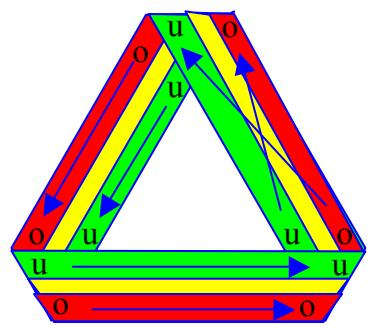

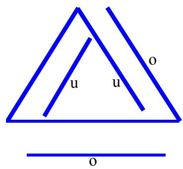

Ceci revient à considérer le parcours sur cette face comme une torsion. La surface peut donc être lue comme un bord, c'est-à-dire comme une torsion. Je constate ainsi qu’il peut en être de même sur chacune des faces.

Quel que soit mon choix, je cesse d’être bloqué par la surface (l’objet) et je remets en jeu du mouvement, c'est-à-dire de la fonction, sous cette forme d’articulation des phonèmes qu’on appelle la parole.

## Une écriture de la psychose

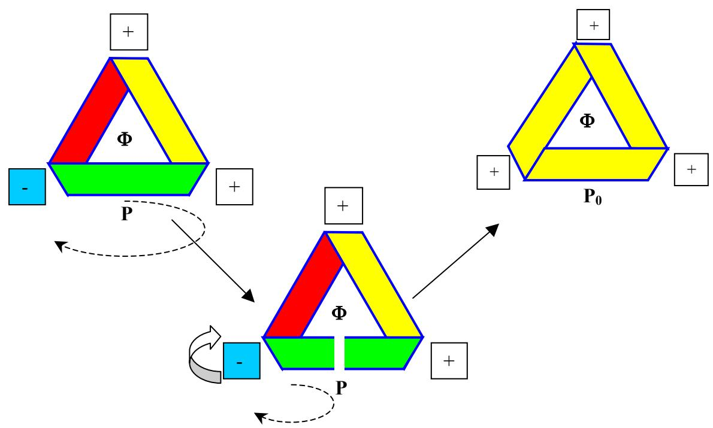  
La régression à partir de la découverte de la face inorientée, s’ajoutant à la désorientation éprouvée en retour à propos de la notation du pli, peut avoir des conséquences beaucoup plus graves que la névrose. Un autre façon de se sortir de ces deux contradictions, cette fois de manière radicale, c’est d’opérer une coupure dans la bande, afin de remettre de l’ordre dans le sens des plis. Puisque la réalité (c'est-à-dire la notation que j’avais laissé lors d’un premier parcours) ne correspond pas à ce que je perçois (la notation contradictoire avec la première que ma logique me contraint à apposer au même endroit, lors d’un $2 ^ { \mathrm { { e m e } } }$ parcours regréssif), je vais changer ce que je perçois, et au niveau de la face problématique, j’opère cette coupure qui va me permettre de changer le sens de la torsion afin de le rendre conforme

au sens initial, sans tenir compte de l’aspect régressif de mon trajet. Cette coupure, on devrait la nommer l’acoupure, puisqu’elle intervient pour supprimer l’efficience de la coupure qu’est la bande de Mœbius hétérogène comme telle, efficience localisée dans sa torsion $\ll - \ \ll$ . Elle s’effectue par un trou $\mathrm { P _ { 0 } }$ dans le symbolique, c'est-à-dire dans les représentations de mots, autrement dit dans le bord de la bande, et par un trou $\Phi _ { 0 }$ dans l’imaginaire, c'est-à-dire dans les représentations de choses, autrement dit dans la surface. Tout ceci n’est qu’une autre présentation du schéma I de Lacan (dans « Du traitement possible de la psychose », in Ecrits).

Nous avons à présent un modèle explicatif de l’hallucination.

C’est le petit mouvement de doigt qui change le sens de la torsion au moment de la construction de la bande de Mœbius, ce qui a fait l’objet de ma démonstration 5.

Ça remet de l’ordre dans les torsions, c'est-à-dire dans le mouvement de la parole, mais ça ne supprime aucunement la contradiction entre Une face et l’Autre face. L’inconscient est à présent « à ciel ouvert $ ,$ et exprime crûment, dans la souffrance, la contradiction oedipienne et les exigences libidinales, sous les formes érotomaniaque, de jalousie, et de persécution.

Freud écrivait, dans son étude sur la président Schreber, que ces trois formes de paranoïa décrivaient les trois façons de négativer la proposition « je l’aime, lui, un homme . en effet, cette proposition est écrite par le mouvement de torsion « - » de la bande de Mœbius hétéro. Le mouvement, passage dans la troisième dimension ainsi que dans la dimension supplémentaire du temps, décrit l’émotion, le sentiment tel qu’il s’éprouve (Réel), non pas encore tel qu’il s’imagine (Imaginaire), encore moins tel qu’il se dit (symbolique). Dans notre modèle, les plis, qui représentent le mouvement de la torsion, représenteront donc l’amour, la haine et l’ignorance. Les surfaces distinguées dans l’écriture par les plis représenteront l’imaginaire du moi et de son objet. Les bords seront les mots par lesquels tout cela se parle… ou ne se dit pas.

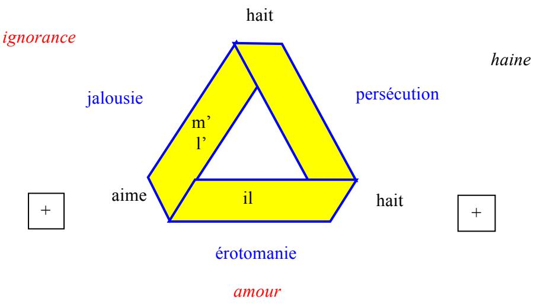

Dans tous les cas, l’acoupure fait disparaître la bienheureuse ignorance du névrosé. Au gré des déplacements successifs, la haine ou l’amour prendront sa place. Si l’attention est portée vers le côté gauche de la figure, par l’inversion du sens de la torsion écrite à gauche, l’homogénéisation qui s’ensuit dans les plis portera l’amour à la place de l’ignorance. Si l’attention se focalise au contraire à droite, c’est une inversion des deux plis notés «+ » qui aura lieu, afin d’homogénéiser tous les plis en « - ». Alors c’est la haine qui délogera l’ignorance.

Le gonflement imaginaire de la surface l’amènera à s’autotraverser pour finalement se fermer en surface de Boy : c’est le délire des grandeurs. La faible distinction établie entre le moi et son objet disparaît, et le moi se présente dans son imaginaire de toute puissance solipsiste. La fonction ne produit plus d’objet : elle est elle-même devenu un objet.

Notons au passage que le même gonflement de surface dans le cas de la bande hétéro produira le cross-cap, c'est-à-dire le fantasme :

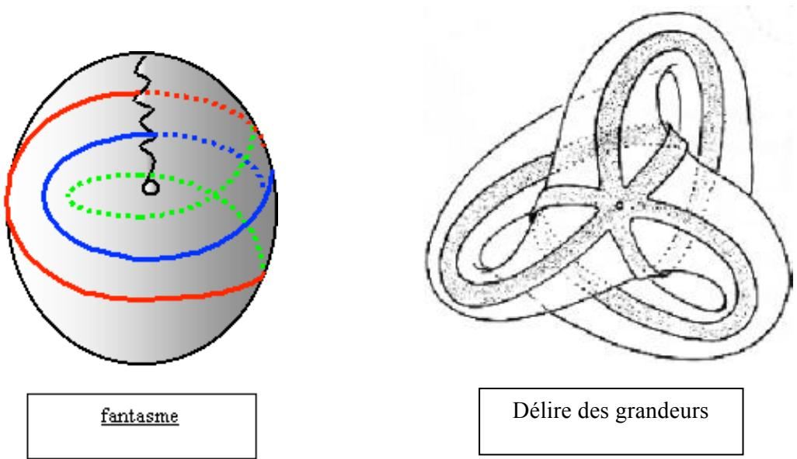

. Comme le dit Freud, le névrosé conserve un rapport à l’objet dans son fantasme. L’hétérogénéité entre point hors ligne et ligne sans point est conservée dans le cross-cap, alors qu’elle est annulée dans la surface de Boy (ci-dessus à gauche).

« Le remarquable de cette suite est que l’asphère (écrit l, apostrophe), à commencer au tore, (elle s’y présente de première main) ne vient à l’évidence de son asphéricité, qu’à se supplémenter d’une coupure sphérique ». (Lacan, l’Etourdit, p. 28)

« C’est la topologie sphérique de cet objet a qui se projette sur l’autre composé, hétérogène, que constitue le cross cap ». (L’Etourdit, p. 30)

Une hétérogénéité minimum est conservée dans la bande de Mœbius homo : c’est la différence entre les mots et les choses, entre le bord et la surface, autrement dit entre la fonction et l’objet : le paranoïaque parle, sans souci de la contradiction que lui apporte la réalité (c'est-à-dire, ses précédentes écritures). La surface de Boy achève la suppression de cette dernière hétérogénéité. Mais c’est dans une tentative de guérison : nous l’avons vu dans la démonstration 4 – qu’on peut faire aussi bien pour l’homo que pour l’hétéro, simplement en changeant le sens d’un des retournements – l’identification finale des surface permet de conjoindre plusieurs points de vue, dont celui d’une double surface (donc, à 4 dimensions, plan projectif) et celui d’un trou (zéro dimension). L’extension psychotique de la surface dans la 4 dimensions de la Boy vise à retrouver le chemin du zéro dimension qui remettrait la fonction en mouvement. C’est la trajectoire du président Schreber et des délires des grandeurs d’une manière générale : l’inflation du délire entraîne jusqu’à la fin du monde (perte de l’objet) et la mort du sujet (perte du moi), qui en lit l’annonce dans le journal. Sur ces ruines, il va être possible d’engendrer « une humanité nouvelle ».

Au contraire, le rétrécissement de la surface jusqu’à sa réduction au bord entraînera le discours métonymique du schizophrène. Il considère les mots comme des choses, parce que les seules choses qu’il a sa disposition, ce sont les mots.

« Ici apparaît la différence décisive entre le travail du rêve et la schizophrénie. Dans celle-ci, ce sont les mots eux-même, dans lesquels étaient exprimés la pensée préconsciente, qui deviennent l’objet du processus primaire ; dans le rêve, ce ne sont pas les mots, mais les représentations de choses auxquels les mots ont été ramenés. Le rêve connaît une régression topique, ce qui n’est pas le cas de la schizophrénie. Les interprétations du rêve que nous faisons dans la pratique analytique affaiblissent précisément le sentiment que nous avons de cette différence. Lorsque l’interprétation du rêve suit à la trace le cours du travail du rêve, suit les voies qui conduisent des pensées latentes aux éléments du rêve, découvre le parti qui est tiré du double sens des mots, et indique les ponts verbaux qui relient les différentes champs de matériel (materialkreisen) différents, elle produit une impression qui est tantôt celle du trait d’esprit, tantôt celle de la schizophrénie, et elle nous fait oublier que toutes les opérations portant sur des mots ne sont pour le rêve qu’une préparation à la régression aux (représentation de) choses (Sachregression). » (Freud « Complément métapsychologique à la théorie du rêve » GW X p.418, Gallimard, p. 134)

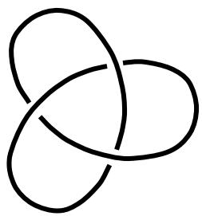

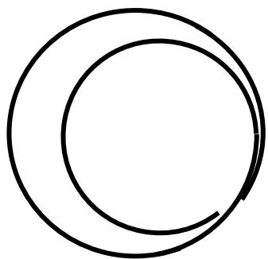

L’interprétation du rêve sera donc la réduction de la bande hétéro à son bord, le huit intérieur (ci-dessus à droite), tandis que la schizophrénie sera la même réduction appliquée à la bande homo (ci-dessus à gauche)

Sur la bande homogène la négation forclusive est généralisée à l’ensemble de la structure. Elle n’est pas mise en rapport avec la négation discordantielle. C’est de ce fait qu’on peut l’appeler forclusion .

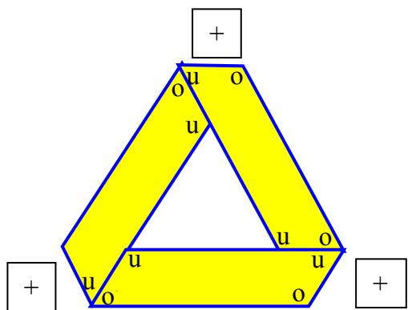

On remarquera cependant qu’il est possible de faire exactement la même expérience d’un double parcours sur la bande homo et sur la bande hétéro, en nommant les faces par des phonèmes. la parole est aussi la dit-solution de la psychose… si ce modèle tient le coup

Mais en ce domaine, l’étude est loin d’être terminée, puisqu’on sait que la coupure à deux tours dans la bande homo donne bien un bilatère enlacé avec un autre unilatère… mais cet enlacement est triple, et l’unilatère obtenu est une autre bande homo. On ne revient à la bande hétéro qui si l’on recours à une nouvelle coupure, semblable à celle réalisée pour changer le sens de la torsion.

lundi 28 octobre 2002