# Richard Abibon 10ème démonstration des trois torsions de la bande de Mœbius

Il me vient une 10ème démonstration, que j’avais en fait à portée de la main puisqu‘elle est publiée implicitement dans mon livre « De l’autisme ». La voici donc de manière explicite.

Considérons la bande de Mœbius pour ce qui nous intéresse en psychanalyse : une fonction, et non un objet. Quelle est cette fonction ? Elle consiste à faire passer un objet d’une face à une autre, mais cette face, c’est la même. Nous avons donc une écriture de la fonction signifiante en tant que l’énonciation d’un même signifiant peut être entendu sur le versant du signifié conscient et sur le versant de la signification inconsciente.

Prenons l’écriture de cette fonction dans sa version traditionnelle, et faisons lui accomplir cette fonction sur une lettre quelconque. Ce pourrait être une lettre de l’alphabet ou n’importe quel caractère présentant de la dissymétrie afin de nous orienter dans les trois dimensions de l’espace euclidien. Cependant, il faut rappeler que nous sommes dans le cadre d’une écriture, qui n’a réellement que deux dimensions. La troisième n’y peut exister qu’à l’état symbolique de représentation.

Comme lettre-objet de l’expérience je choisis l’image du corps, soit tout simplement un bonhomme que je représente par son minimum « fil-de-fer ». Deux points pour les yeux suffisent à distinguer le devant et le derrière. La tête opposée aux pieds définit la dimension haut-bas. Je le représente dans la partie gauche de la bande de Mœbius comme regardant la surface de cette bande pour faciliter l’identification avec le lecteur : ainsi sa gauche et sa droite seront respectivement ma gauche et ma droite. Voici définies les trois dimensions de l’expérience.

La fonction de la bande va être de transformer l’écriture du bonhomme en changeant une, deux, ou trois dimensions en son inverse. Faisons donc circuler l’écriture du bonhomme en fonction des bords de la bande que nous prenons comme guide, lui faisant ainsi jouer son rôle de fonction.

Mais par où commencer à tourner ? Deux options se présentent : en empruntant la boucle en bas sur cette écriture ou en empruntant la torsion, en haut sur l’écriture ?

Faisons donc les deux :

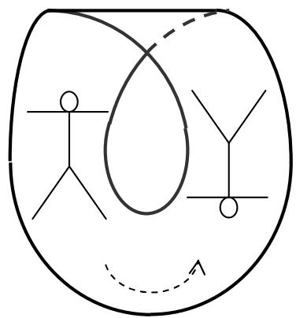  
Que constatons-nous ?

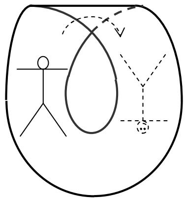

La boucle a inversé le haut et le bas, la droite et la gauche mais pas le devant et le derrière. Nous sommes sur la même face dans ce rapport à nous qui lisons cette écriture.

La torsion a inversé aussi le haut et le bas, et le devant et le derrière (nous voyons les yeux du bonhomme, et je l’ai écrit en pointillé : pour nous, il est passé de l’autre côté). Mais elle n’a pas inversé la droite et la gauche.

L’argument essentiel des tenants de cette écriture (notamment René Lew) est le suivant : dans l’écriture à trois torsions, il y a deux torsions de sens inverse, une (-1) et une (+1). Elles s’annulent donc : +1-1 = 0.

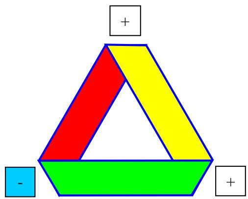

Nul besoin de les écrire. Or, si nous travaillons avec des modèles en papier, ceci est vrai pour des bandes de Mœbius d’un nombre supérieur à 3 torsions. En effet toutes les torsions supérieures à 3 s’annulent lorsqu’elles sont de sens contraire… mais pas les trois dernières, sauf à supposer la souplesse de l’étoffe. (Voir : Bande de Moebius à 5 torsions (démonstration 7))

A considérer la bande de Mœbius comme une fonction, nous voyons ici que la boucle qui représente les deux torsions non écrites n’est pas nulle. Pour être nulle, il faudrait qu’elle ne puisse pas modifier l’écriture du bonhomme. Or, elle imprime une modification à cet objet : il s’agit bien d’une fonction non nulle, étoffe souple ou pas.

La boucle n’est donc pas rien, elle n’est pas « 0 » dans le concept de la bande de Moebius comme fonction. Elle n’est pas rien et elle n’est pas non plus réductible à une réplique de la torsion : ce qu’elle produit comme écriture est différent de ce que produit la torsion. Comme la torsion, elle inverse aussi deux dimensions sur trois mais l’une d’elle n’est pas la même.

La boucle est obtenue en prenant appui sur ce principe de la topologie classique : les objets sont souples. On peut donc écraser les deux torsions et obtenir ainsi une boucle. Si ce principe peut s’avérer fructueux dans une topologie purement mathématique, il ne convient pas à l’écriture théorique de la psychanalyse. En effet, pour la topologie classique une sphère trouée est un bol, qui est aussi un disque :

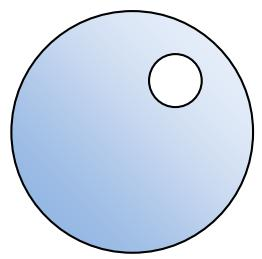

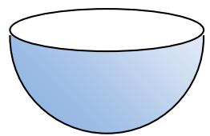

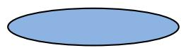

Pour la topologie classique ces trois objets sont équivalents. Or de la sphère trouée et du bol au disque on passe cependant de 3 à 2 dimensions : c'est-à-dire du réel à la représentation, ou de la parole (à considérer uniquement la troisième dit-mention) à l’écriture, c'est-à-dire à la mémoire. (voir : démonstration 9)

Il est intéressant de constater que les deux écritures obtenues se regardent en miroir. Ceci s’inscrit parfaitement dans la théorie lacanienne du miroir, dans laquelle il est dit que la fonction « image du corps » dépend étroitement de la fonction signifiante. S’il y a un corps réel « de départ » (notre bonhomme initial, à gauche), je n’y ai accès que par l’intermédiaire de la fonction signifiante : quelqu'un, un adulte tutélaire, doit me parler pour me signifier cette image du corps, c'est-à-dire me signifier qu’il s’agit bien de « moi ».

Comme Marc Saint Paul et Jean Michel Vappereau, on peut n’être pas convaincu que l’image du miroir inverse la gauche et la droite. Il me semble qu’il y a (3+1) points de vue au miroir plan :

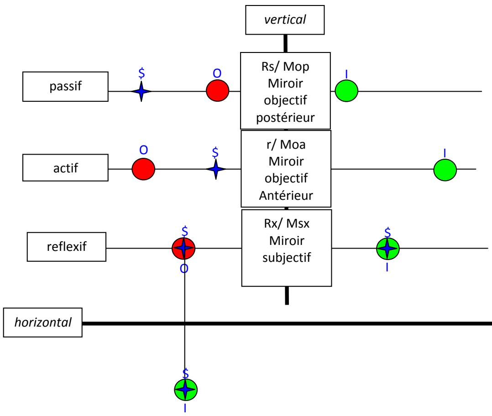

Les trois premiers étant dans le miroir vertical, le dernier qui peut redoubler les trois autres, dans le miroir horizontal. S désigne le sujet qui voit l’objet O et son image I.

Dans le premier point de vue, le sujet se situe derrière l’objet : il voit d’un seul regard le dos de l’objet et l’image au miroir. Le sujet est donc passif, le miroir (soit, chez Lacan l’Autre), fait le travail pour lui. Dans ce cas de figure, le sujet voit la droite de l’objet à sa droite : il n’y a pas d’inversion de la droite et de la gauche.

Dans le second point de vue, le sujet se situe entre l’objet et le miroir. Il voit donc soit l’objet, soit son image, mais la simultanéité lui est interdite. Pour apercevoir l’un, puis l’autre il doit se retourner : il est donc actif. Ici, le sujet voit la droite de l’objet à sa gauche puisqu’il lui fait face (il faut supposer un objet dissymétrique selon les trois dimensions), mais en se retournant pour voir l’image dans le miroir, la droite de l’objet se reflétant toujours à droite comme dans le cas précédent, le sujet voit donc la droite de l’objet à sa droite. Il n’y a donc pas d’inversion de la dimension droite-gauche de l’objet, mais il y a retournement du sujet, qui lui a mis sa droite à la place de sa gauche.

Enfin dans le troisième point de vue, comme dans le troisième temps de la pulsion, le sujet se prend lui-même comme objet. C’est donc lui qu’il aperçoit dans le miroir, à condition qu’il ne prenne pas cette image pour un objet, c'est-à-dire un autre : il doit faire l’opération de s’identifier à cette image, et pour cela il doit se retourner, passer imaginairement derrière le miroir, position dans laquelle il opère un peu comme le bonhomme sur la bande de Mœbius : il se repère de façon intrinsèque : ma droite est bien toujours à ma droite et extrinsèque : d’ici où je suis, devant le miroir, si je m’identifie à l’image du miroir, alors je me retourne et de ce fait je peux apercevoir que ma droite est passée à ma gauche dans le repérage extrinsèque.

Je laisserai ici de côté l’examen de la question du miroir horizontal. Pour ceux que ça intéresse on en retrouvera le développement dans mon livre « De l’autisme » (EFEditions@wanadoo.fr).

Prenons alors l’écriture du bonhomme que nous avions obtenue par la boucle. Faisons lui subir le passage par la fonction torsion :

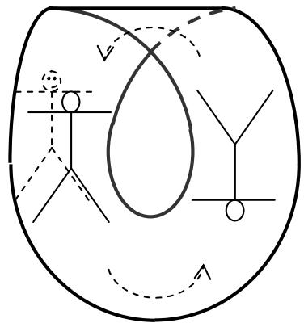

Comme au passage dans l’autre sens, cette opération inverse le haut et le bas, ce qui fait que notre bonhomme se retrouve sur ses pieds et nous fait face, mais de l’autre côté de la bande. Deux dimensions ont été inversées par rapport au bonhomme tête en bas dont nous étions partis, issu de la boucle, et nous constatons que deux dimensions sont aussi inversées par rapport au bonhomme de base, celui qui sur cette face, nous tourne le dos.

Ces deux derniers se regardent en miroir : comme démontré ci-dessus, le miroir subjectif inverse le devant et le derrière, la droite et la gauche. Où il se démontre que, pour obtenir notre image dans le miroir il faut en passer par deux fonctions : la boucle et la torsion. Ces deux fonctions étant différentes, on ne peut les réduire à une seulement et dire : c’est le résultat de LA torsion. Le résultat de LA torsion, nous venons de le voir ce n’est pas l’image en miroir, mais l’image qui inverse le haut et le bas d’une part, le devant et le derrière d’autre part. La boucle étant équivalente à deux torsions, on peut dire : l’image en miroir est le produit de trois torsions. Telle est en réalité la décomposition (l’analyse) de la fonction signifiante qui s’impose.

Ici le parcours est inversé mais équivalent :

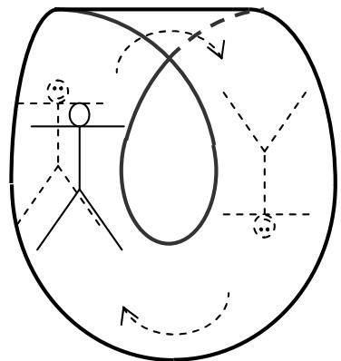

On pourrait comparer ce parcours sur la bande de Mœbius à la théorie freudienne des pulsions, au schéma optique de Lacan, mais aussi au plus tardif nœud borroméen. C’est en effet la globalité de la bande, en tant qu’elle est à trois torsions qui écrit le nouage de la fonction signifiante (symbolique) avec la fonction miroir (imaginaire) à partir d’un objet réel comme le corps. Nous y lisons les conditions de base de la topologie comme outil de la psychanalyse :

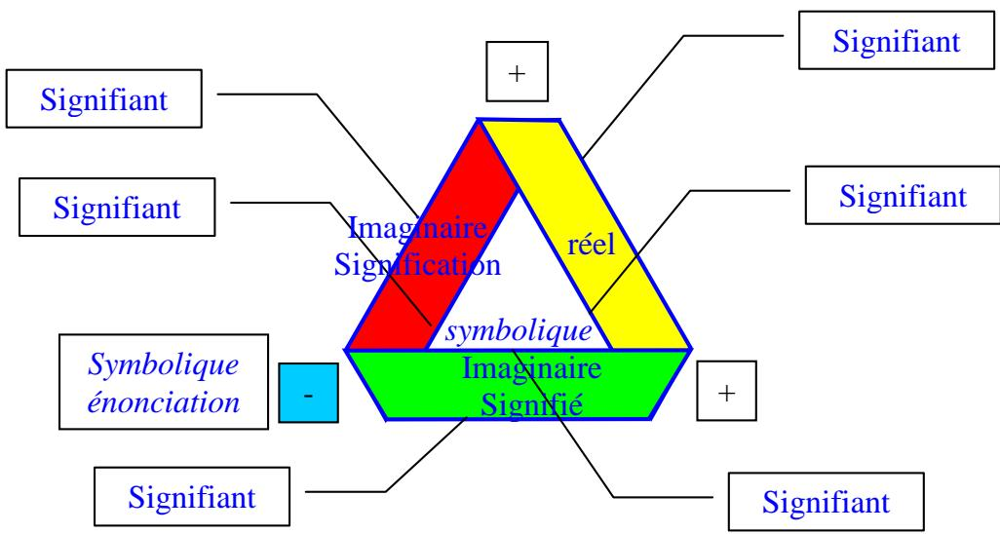

Le bord unique, c’est le signifiant, c’est le symbolique en tant que trou représenté ici par son bord c'est-à-dire ce qui s’écrit de ce qui s’entend, la représentation de mot, le signifiant. Ce bord unique, comme signifiant, ne peut être que triple en fonction de la définition de Lacan : un signifiant représente un sujet pour un autre signifiant. Il faut toujours rappeler que ce qu’on appelle LE signifiant par raccourci c’est cette articulation d’un signifiant à un autre signifiant.

Le trou à l’intérieur de la bande reste ce qui ne s’écrit pas mais se laisse circonscrire comme l’écriture théorique de l’énonciation. C’est le symbolique à l’état pur.

La surface, c’est l’imaginaire c'est-à-dire ce que le signifiant permet de circonscrire d’image du corps ainsi que des représentations de toute chose : ce sont les représentations de choses. La double inscription freudienne (représentation de mot = signifiant ; représentation de chose = signifié (conscient) et signification (inconscient) ) trouve ici son écriture sous forme du double tour de la bande qui fait huit intérieur : ce qu’elle ne fait pas sans les trois torsions. La surface orientée (soit dessus verte, soit dessous, rouge) de l’imaginaire se distingue de la surface désorientée du réel (zone dessus et dessous, jaune).

Le réel est l’objet qui circule dans le signifiant sans qu’il soit possible de l’atteindre comme tel, comme le vase renversé disposé sous le cache. Il doit en passer par les écritures de la fonction. Le corps « réel » en donne ici une écriture théorique.

Le choix d’un vase comme objet de l’expérience du schéma optique avait un double sens. Il correspondait à l’objet utilisé dans l’expérience originelle de Bouasse et il pouvait servir de métaphore au corps comme contenant. Mais il présentait le défaut d’être symétrique, empêchant tout repérage devant-derrière et droite-gauche.

Marc Saint Paul m’a fait remarqué que mon bonhomme présentait un axe de symétrie vertical. C’est vrai dans l’écriture que j’ai produite, mais cette écriture, partant d’un bonhomme qui nous tourne le dos a été choisie pour faciliter l’identification de Je qui regarde avec ce dernier. Par cette identification nous pouvons croiser un point de vue intrinsèque (le bonhomme sur la bande) avec un point de vue extrinsèque (je qui lis). Et donc je qui lis sais bien que la droite n‘est pas symétrique de la gauche. Je le sais de ne pas être ambidextre : une main écrit, l’autre pas. Je le sais aussi si je tente de superposer mes deux mains. Si je fais coïncider la dimension haut-bas, c'est-à-dire si le pose la paume d’une main sur le dos de l’autre, alors les pouces sont inversés, l’un est droite l’autre est à gauche. Si je fais coïncider la droite et la gauche c'est-à-dire les deux pouces alors les deux mains sont paume contre paume, c'est-à-dire que le haut et le bas sont inversés. Il n’y a pas moyen de les faire coïncider selon les trois dimensions. Elles présentent une fondamentale dissymétrie, qui peut fonder la dissymétrie générale de la droite et de la gauche chez tous les humains, mais qui est beaucoup plus subjective. Enfin, si j’applique ma main sur le miroir, je constate que, si le pouces coïncident avec la main de l’image, par contre elles sont paume contre paume : tout se passe comme lorsque j’applique ma main droite sur ma main gauche, paume contre paume. L’image de la main droite est donc bien une main gauche.

L’analogie avec le schéma optique tient aux trois temps nécessaires à obtenir une image du corps : le vase réel, l’image réelle obtenue du miroir sphérique, l’image virtuelle produite par le miroir plan. Cette analogie n’est pas exacte dans les contenus puisque le miroir sphérique inverse les trois dimensions de l’objet.

L’analogie avec les trois temps de la pulsion tient aussi à cette ternarité : passif, actif, réflexif, qui sont les trois modes du verbe. Je ne pense pas qu’on puisse trouver une équivalence de contenu à chaque temps, par exemple, la boucle (deux torsions) qui serait le passif, la torsion qui serait l’actif, et le dernier temps du miroir qui serait le réflexif, car il nécessite la double fonction boucle + torsion, comme dans l’expression : se faire battre, ou se faire voir. La justesse de l’analogie s’apprécie plus dans ce troisième temps où l’on retrouve les deux miroirs du schéma optique, tout en comprenant pourquoi c’est de la structure du langage dont il s’agit. Dans le séminaire XI, Lacan remarque que, chez Freud c’est au troisième temps de la pulsion qu’apparaît un nouveau sujet c'est-à-dire tout simplement, le sujet, celui qui est représenté par un signifiant pour un autre signifiant.

Enfin le nœud borroméen se présente aussi comme un tout qui ne saurait se passer de l’un des ses ronds, qui sont chacun dans une position de stricte équivalence. Si on en coupe un, tous sont libres. Bien sûr, ce n’est pas cette libération qui nous intéresse, mais le nouage comme tel, c'est-à-dire la structure du langage. L’équivalence des ronds se retrouve alors dans l’équivalence des trois torsions de la bande de Mœbius. Dans chacune de ces présentations, schéma optique, théorie des pulsions, bande de Mœbius et nœud borroméen, c’est la globalité des trois opérations qui permet l’apparition d’une image d’un côté, du sujet de l’autre.

Revenons un instant sur l’idée des deux torsions de sens inverses qui s’annuleraient. Une bande de Mœbius généralisé se définit comme présentant un nombre impair de torsions. Or, comment écrit-on un nombre impair ? Par 2n+1. Pour n = 1, ça ne peut faire moins de trois. Mais pour n = 0, me direz vous ? Eh bien s’il n’y a pas de torsion, que serait ce « 1 » qui reste ? Mais, ajouterez vous encore, on peut écrire l’impair par 2n – 1 ! Et alors, pour n = 1, il nous reste une torsion !

Certes, mais nous sommes ici dans l’arithmétique. Et qui a dit que l’arithmétique pouvait refléter exactement la topologie ? Rien n’est moins sûr, et c’est là que l’équivalence : +1 -1 = 0 ne s’applique pas aux trois dernières torsions de la bande de Mœbius minimum.

Par contre on peut remarquer ceci : l’arithmétique, pour écrire le nombre impair ne peut faire autrement que d’avoir recours à 3 nombres. On peut remarquer aussi que l’arithmétique peut s’écrire toute entière dès qu’on dispose de trois nombres : 0, 1, et 2. Par addition ou multiplication, avec ceux-là, on peut créer tous les nombres. Avec 0 et 1 on ne le peut pas.

Je pourrais aussi citer ici toutes les recherches de Lacan autour de la théorie des ensembles et de l’écriture du Un ; on les trouve principalement dans « d’un Autre à l’autre ». Dans ma façon de le comprendre, il est impossible d’écrire le Un tout seul : au moindre trait il faut une surface d’accueil, qui est forcément à deux dimensions. Ce qui fait trois. Engendrer un ensemble à un élément suppose qu’on l’isole de l’environnement. Nous avons donc : UN élément placé dans Un ensemble, ce qui fait deux, et il nous faut ne pas confondre l’élément avec l’ensemble, ce qui suppose la partie vide (∅) entre les deux : on ne peut écrire un ensemble à Un élément qu’avec trois éléments.

D’où l’écriture qui me semble correcte de la bande de Mœbius prise comme écriture de la fonction signifiante :

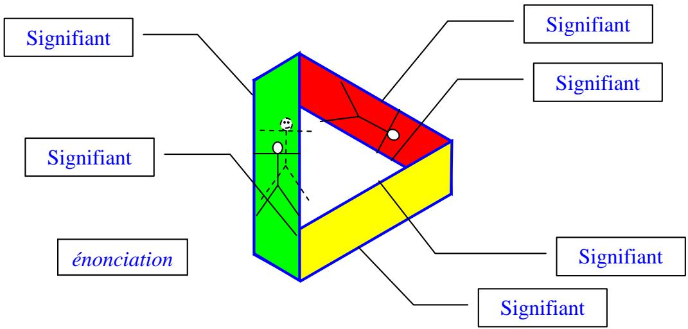

Dans laquelle on peut vérifier la construction en trois temps de l’image du corps ou de toute représentation de chose en fonction des représentations de mots. Je n’écris pas le passage derrière la face jaune que je tiens pour une écriture du refoulement originaire. Et c’est logique puisque cette face, pour nous lecteurs, est désorientée. Selon le repère qu’on prend, elle est à la fois dessus et dessous. Je ne saurais si je dois écrire le bonhomme en traits pleins ou en pointillés. Ne pas l’écrire, c’est écrire l’impossible de l’accès au corps réel, que n’est pas le bonhomme écrit « au départ » sur la face verte. Ce dernier est celui qui se formate dans la réalité sous l’impulsion en retour de l’image dans le miroir, sur l’autre face de la face verte.

L’autre face de la bande est devenue directement lisible pour nous, lecteurs, et c’est la face rouge que je tiens pour représentation de l’inconscient, le refoulement proprement dit. Pour nous, lecteurs, elle est lisible en tant que cette écriture a analysé la structure de la bande, exactement comme le processus analytique qu’elle représente. Le sujet en analyse n’est pas seulement en présence de son moi, formaté sur l’image du corps, mais aussi de ça, ses pulsions inconscientes figurées sur la face rouge désormais disponible.

L’énonciation signifiante s’y lit dans son écriture théorique pour la psychanalyse : le signifiant est un seul bord, mais il peut être lu comme le bord de droite ou le bord de gauche de la partie verte de l’écriture, sachant que pour accéder à ce bord gauche il faut avoir fait un tour complet par les trois torsions.

mercredi 1er août 2007

corrigé et augmenté le jeudi 23 août 2007

corrigé et augmenté le lundi 13 juillet 2009