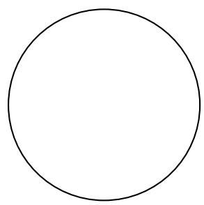
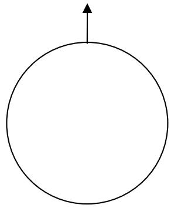
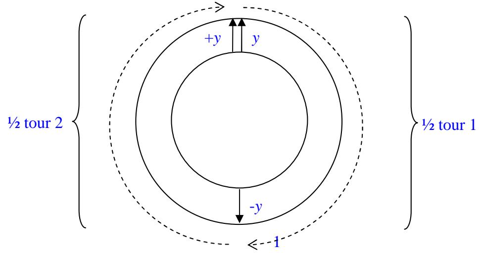
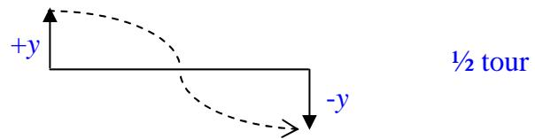
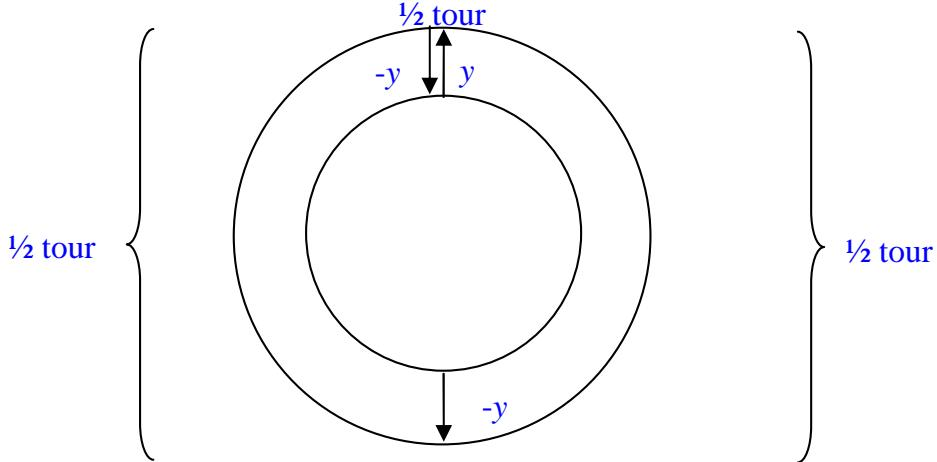
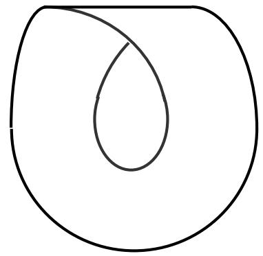
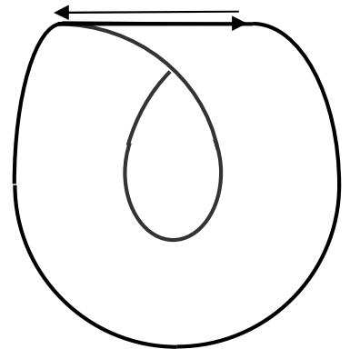
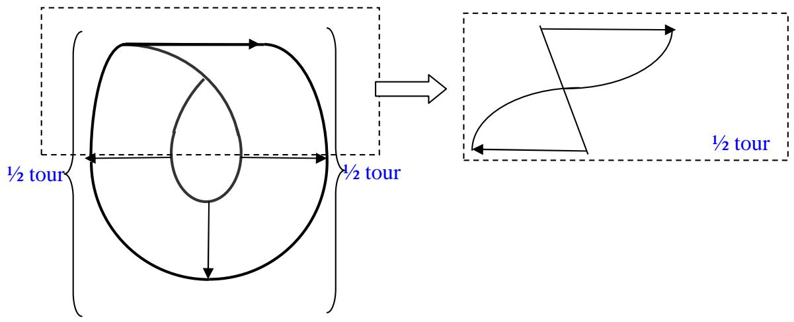

# Les trois torsions de la bande de Moebius , démonstrations 11

Définition matérielle de la bande de Moebius :

« Un ruban de Möbius est une surface obtenue en cousant bord à bord deux extrémités d’un ruban rectangulaire avec une torsion d'un demi-tour»

Définition mathématique de la bande de Moebius :

« On obtient un ruban de Möbius en faisant tourner régulièrement un segment de longueur constante autour d'un cercle avec une rotation d'un demi-tour ou plus généralement, d'un nombre impair de demi-tours »

Si on reprend cette $2 ^ { \mathrm { { \dot { e } m e } } }$ définition de manière précise :

Soit un cercle :

Et un segment de longueur constante :

Que l’on fait tourner régulièrement autour :

On n’obtient pas une bande de Moebius, mais une couronne. Ce faisant, on a fait faire au segment orienté une rotation de $2 \pi ( 3 6 0 ^ { \circ } )$ , soit : deux demi-tours.

Si l’on fait effectuer une rotation d’un demi-tour à un segment orienté, de manière linéaire, on n’obtient pas non plus une bande de Moebius :

Par contre, si on combine les deux mouvements, ce qui est la définition : On obtient un ruban de Möbius en faisant tourner régulièrement un segment de longueur constante autour d'un cercle avec une rotation d'un demi-tour

Le segment a bien effectué trois demi-tours. Le dessin ci-dessus est donc bien une représentation de la bande de Moebius, et elle a trois torsions, au sens de ce que $\mathrm { j } '$ appelle en effet torsion : changement de sens d’une dimension, de $y \ { \hat { \mathbf { a } } } - y .$ le segment est passé de y $\dot { \boldsymbol { \mathrm { a } } } - \boldsymbol { y }$ puis de -y à y afin d’effectuer la rotation, à quoi il a fallu ajouter une torsion supplémentaire afin d’obtenir l’opposition requise $\left( y , \cdot y \right)$ à l’arrivée. Tout se passe dans le plan, à base de rotations que j’appelle $\%$ tours. Là, $\mathrm { c } '$ est une question de vocabulaire, mais je viens de montrer qu’il n’y a pas de différence entre les deux premiers ½ tours et le troisième. Dans les trois cas, il s’agit d’une rotation de π. Dans les trois cas, la rotation d’accompagne $\mathrm { d } '$ un déplacement linéaire, de haut en bas $\mathrm { ( y \to - y ) }$ , puis de bas en haut, $( - \mathbf { y } \mathbf {  } \mathbf { y } )$ et enfin de gauche à droite $\mathrm { ( y \to - y ) }$

Il faut concevoir que, dans une dynamique, ces trois torsions se produisent dans un même mouvement.

Le dessin canonique de la bande de Moebius :

…en tient compte, si on l’analyse bien : le trait rectiligne supérieur qui désigne le changement de face, soit la torsion, inscrit la fusion des deux vecteurs de sens contraire :

Si le vecteur avait parcouru le bord de la bande sans subir de torsions il se serait retrouvé de même sens :

  
Rotation de deux ½ tours (2 π)  
Inversion par déplacement linéaire de ½ tour supplémentaire (π)

La question qui se pose alors devient celle de la troisième dimension. Car dans cette représentation, on été contraint d’en passer par une représentation fictive de la troisième dimension pour une seul torsion en l’oubliant pour les deux autres dont on vient de voir qu’elles n’ont pas de différence entre elles.

Ceci introduit tout la question de la mise à plat en topologie. Dans une topologie des surfaces dites intrinsèques, on ne se préoccupe pas de cette troisième dimension : un bol et identique à un disque. Et pourtant, ce qui nous intéresse en psychanalyse c’est le passage de la mémoire (conscient et inconsciente) à la parole. Or, la parole se produit à la manière d’un espace à une dit-mention venant couper un espace à deux dimensions, la mémoire. Car la mémoire, comme tout ce qui s’écrit, s’inscrit sur un support à deux dimensions. La parole coupe dans cette surface, c'est-à-dire qu’elle taille et choisit les morceaux de mémoire qu’il lui intéresse de faire parler. Elle en prend (préconscient) et elle en laisse (inconscient). De même l’écoute se présente comme une découpe qui va inscrire des éléments, certains dans la partie préconscient, d’autres dans la partie inconsciente.

Autrement dit, il nous importe de trouver un système d’écriture qui puisse décrire cette mise à plat de la parole dans la mémoire sous forme d’écriture. Or, le bol, en passant au disque, perd une dimension, la troisième. Le signifiant perd son support de voix et devient lettre.

Je me réfère donc à une source de la topologie : Poincaré, lorsqu’il décrit l’espace comme définit par sa coupure : un espace de dimensions n et coupé par un espace de dimensions n-1. Je ne me réfère pas à la topologie des surfaces intrinsèques, d’autant que rien n’est intrinsèque dans l’humain : il est toujours dans un rapport avec l’extrinsèque, c'est-à-dire l’autre, cet autre auquel il s’adresse par la parole, troisième dit-mention qui découpe un espace de mémoire. Je ne me réfère pas à une topologie dans laquelle les surfaces sont aussi souples qu’on le voudra, car cette souplesse forclos la question de la perte de la troisième ditmention, qu’on peut aussi référer à ce que Freud nommait la castration.

Richard Abibon

jeudi 12 février 2009