# Richard Abibon

# 9EME DEMONSTRATION DES TROIS TORSIONS DE LA BANDE DE MŒBIUS

Les questionnements de Marie-Laure Caussanel m’ont poussé à écrire cette nouvelle démonstration : qu’elle en soit ici remerciée.

Du croisement à la torsion : deux logiques d’écritures de la $3 ^ { \dot { \mathsf { e m e } } }$ dimension ; perspective et topologie

L’enjeu de ce travail est une représentation de la 3ème dimension, et donc de ce qui ne cesse pas de ne pas s’écrire, car dans les 2 dimensions d’un support de l’écriture, il n’y aura jamais, réellement de 3ème dimension. C’est donc bien la question de la dit-mention, comment, dans l’écriture théorique, on mentionne le dit. Ce qui recoupe la question que Freud traitait sous le registre de la double inscription en représentation de mot et représentation de chose. Les mots, si on les prononcent, ne sont pas ceux qui s’en écrivent. Le son comme tel ne s’écrit pas : une représentation du son s’en inscrit et ce n’est plus le son, même si, lorsqu’on s’en souvient, il peut apparaître comme une apparence de son. Il ne redevient son que si réellement on en parle à nouveau, et non virtuellement dans sa tête. C’est la raison pour laquelle il ne peut y avoir de psychanalyse par écrit.

La 3ème dimension peut s’écrire selon les lois de la perspective. Qu’il ait fallu des siècles pour parvenir à l’établissement de ces lois montre bien qu’elles n’ont rien de naturel. Par contre elles ont quelque chose de réel. Ces lois sont incontournables : impossible de faire autrement, à moins de le décider comme Picasso par exemple, pour des raisons esthétiques. Mais alors il ne prétend pas faire un tableau en perspective ;

Ces loi je peux les résumer à un artifice qui est celui-là même de la représentation – c'est-à-dire de la représentance : la fonction qui crée des représentation – c'est-à-dire ce qui nous occupe en psychanalyse : comment obtenir des représentations de ce qui nous travaille sans que nous le sachions. Car produire un symptôme, c’est cela : donner une écriture d’un quelque chose que nous ne savons pas ou que nous savons d’une savoir insu : nous n’en avons pas la représentation.

L’artifice auquel a recours la perspective est le suivant : la profondeur, soit la dimension devant-derrière (la 3ème dimension) sera représentée par une dimension qui est déjà dans la feuille de papier : la dimension bas-haut. Cette dernière sera donc chargée de se représenter elle-même et de représenter la dimension absente, devant–derrière. Dans un tableau ce qui est en bas est aussi devant, ce qui est en haut est aussi derrière. Il y a deux dimensions, mais dans la représentation, c’est la même. Exactement comme dans une bande de Mœbius : il y a deux faces, mais c’est la même. Il y a deux dimensions à une bande de papier L et l, et en les raboutant par une torsion on supprime la différence L, l, il n’y a plus qu’un seul bord.

Plus précisément c’est une combinatoire de la dimension x (droite-gauche) et y (bashaut) qui va donner l’illusion de la 3ème dimension : les obliques convergeant vers le point de fuite écrivent la profondeur en restituant l’illusion de petitesse croissante qui en rend l’aspect perceptif. Ces obliques s’écrivent en géométrie : y = a x, a étant la pente de la droite oblique, où on retrouve l’objet a de Lacan qui ne cesse pas de ne pas s’écrire. Cette pente représente ce qui n’est pas représentable comme tel. C’est une écriture de l’aphorisme : le mot n’est pas la Chose. Il en est la représentation.

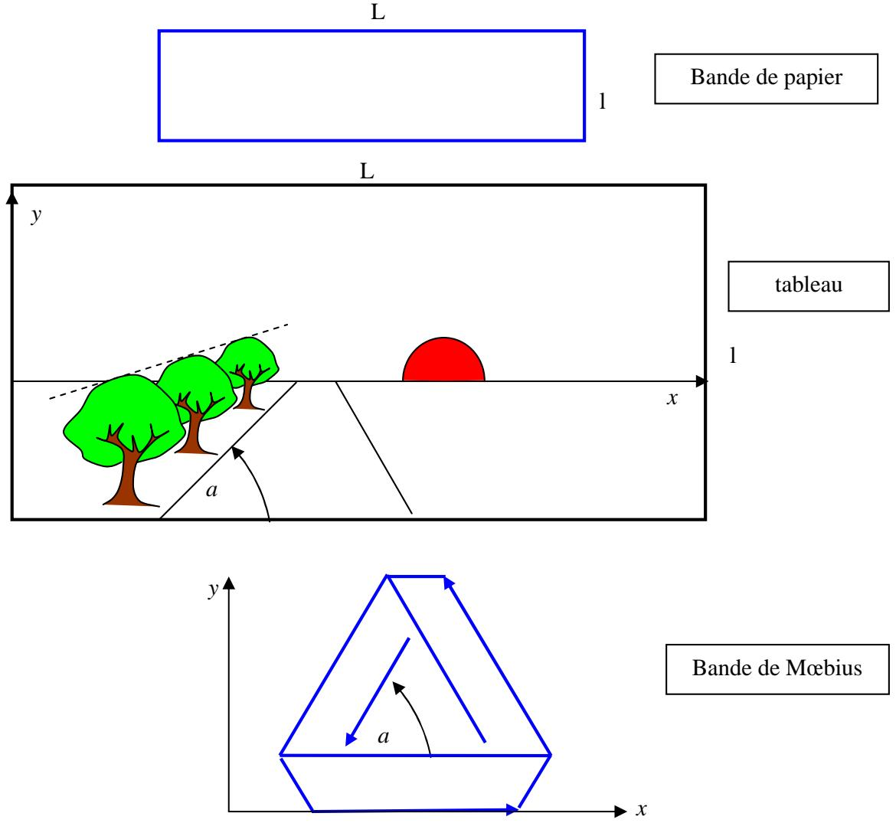

La bande de Mœbius ne prétend pas donner l’illusion de la perspective elle écrit la 3ème dimension comme représentation (et non comme telle) en écrivant qu’un bord x est venu en continuité avec le bord y pour faire un seul. Elle le fait par l’inclinaison a, qui indique la nécessité du retournement (ou torsion) et par les interruptions de traits, qui indiquent là où ils se continuent dans un dessous, cessant de pouvoir s’écrire. Cette cessation représente l’absence : absence de trait, absence de la troisième dimension. De la même façon qu’un signifiant prononcé peut s’enfoncer dans l’oubli une fois prononcé, cette écriture représente le refoulement.

J’écris « peut s’enfoncer » car le refoulement n’est pas fatal, même s’il est permanent. Ainsi si on considère les deux bords du bas de la bande de Mœbius : l’un des traits est continu et fait le tour de la figure, entourant par deux fois l’une des zones, celle qui est justement à la fois dessus et dessous :

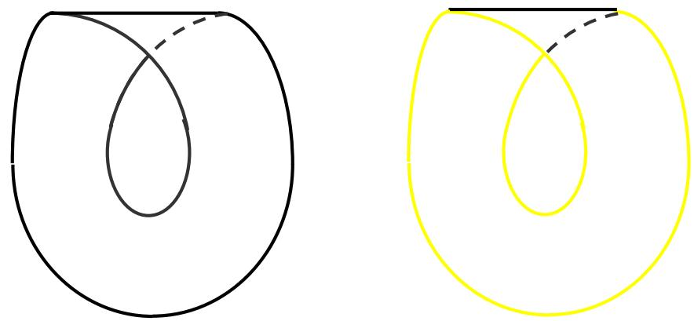

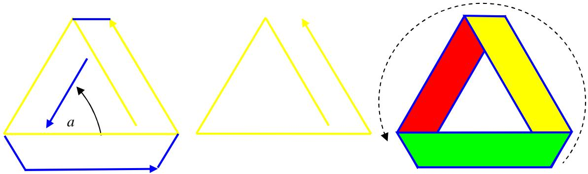

Ce trait écrit la globalité de la bande de Mœbius, et mieux, son mouvement. Ce trait qui s’écrit en bas selon la dimension x, se combine par la torsion de droite à la dimension y, y = a x ; indiquant en quoi la dimension x ne peut pas tout représenter : il y a de l’irreprésentable qui cherche se faire représenter. Cette torsion de droite écrit le moment où une parole cesse de pouvoir tout dire, et pourtant le dit malgré tout, en faisant une tour dans une combinatoire avec la $2 ^ { \mathrm { { \dot { e } m e } } }$ dimension y. Ainsi le sens de cette parole est double ce que cette écriture écrit en venant doublement border la zone jaune. Voilà la double inscription freudienne : la signifiant cesse d’être à une seule dimension, la dimension du bord (bleu) mais, parcourant celui-ci deux fois, il crée de la surface cette zone jaune représente donc une formation de l’inconscient : rêve, acte manqué, lapsus, symptôme.

Voilà ce qu’on représente par une seule torsion :

Mais le travail de l’analyse consiste à revenir là-dessus pour faire parler ce qu’il y a dessous : c’est ce que mettent à jour les deux torsions suivantes (en tournant dans le sens anti horaire). Ces deux torsions écrivent la coupure (qui ne saurait avoir lieu sans la troisième) de l’interprétation. Ce qui ne cessait pas de ne pas s’écrire a trouvé une écriture (donc : a cessé de ne pas s’écrire) par une formation de l’inconscient qui ne cesse pas de s’écrire : c’est la continuité qu’écrit ce trait faisant le tour de la figure. Il arrive un moment où cette formation cesse de s’écrire : par l’interprétation, qui va dissocier les deux écritures de bord, et permettre la prononciation des deux signifiants (deux bords) dont l’un (vert) servait de couverture à l’Autre (rouge) :

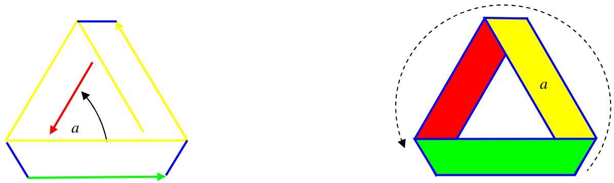

Par là même se révèle ce qu’il en est de l’inclinaison (comme on dit : avoir de l’inclinaison pour quelqu'un, ou avoir un penchant) cause du désir. Où il s’avère après-coup que la surface jaune en était la représentation insue. Etant à la fois en dessus et en dessous (sous la zone verte et sur la zone rouge) elle écrivait le compromis qu’est toute formation de l’inconscient entre deux tendances contradictoires du désir (à la fois dessus et dessous) : la représentation symptomatique était donc elle-même une représentation de l’objet a, la contradiction ne cessant pas de ne pas s’écrire dans la logique de notre monde.

La mise à plat, faisant écriture, a permis la mise à jour des deux objets contradictoires du désir, un vert et un rouge, représenté dans la parole par les deux signifiants, le vert et le rouge (figure de gauche) que les trois torsions ont permis de dire.

Voilà ce que manque à écrire la représentation canonique de la bande de Mœbius.

Un croisement de ficelles est une autre modalité de représentation de la torsion. Cette fois le dessus-dessous du symptôme est écrit par une double interruption de l’écriture. Passant dessous, le trait vert cesse de s’écrire. Un autre trait, jaune, passant dessus ne cesse pas de s’écrire, jusqu’à ce qu’un trait oblique, rouge, formation de compromis permette que ça cesse de s’écrire en revenant dessus. Ainsi ce qui ne cessait pas de ne pas s’écrire trouve une écriture qui dans une nouvelle parole qui cesse de s’écrire.

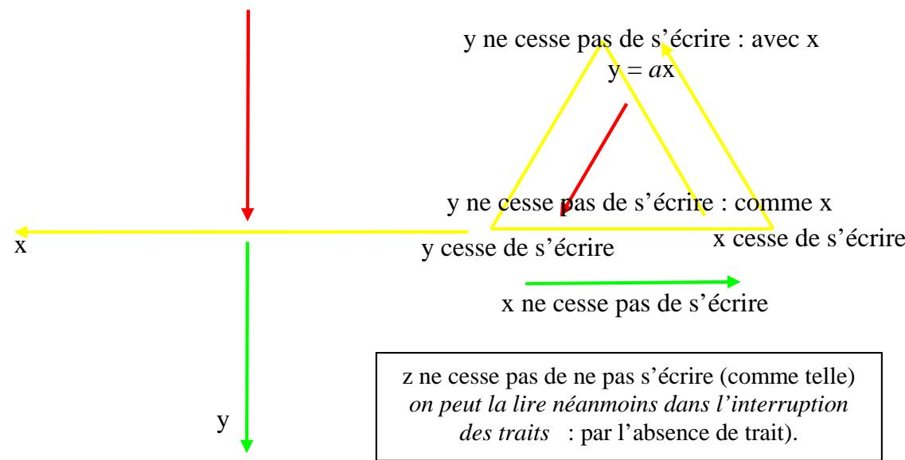

Et les trois traits bleus qui représentent les plis ?  
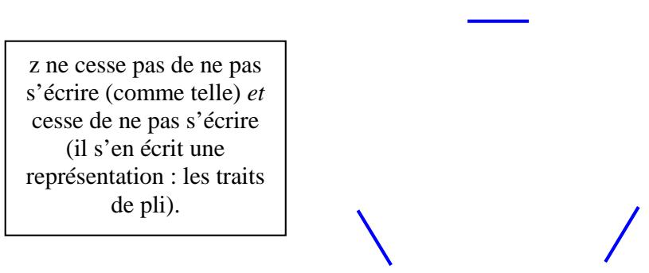

Ils sont nécessaires car la mise à plat d’une bande de Mœbius écrit réellement ces trois traits. La 3ème dimension : z ne cesse pas de ne pas s’écrire (comme telle) et cesse de ne pas s’écrire (il s’en écrit une représentation). Ce trait de coin représente la torsion comme telle, c'est-à-dire la 3ème dimension = z : absente réellement elle est représentée par ce trait, qui est le bord par lequel x devient y. il représente le lieu où la surface a fonction de bord.

Ces traits sont la modalité topologique de la troisième dimension, à l’opposé de la perspective. On vient devoir en effet que dans cette représentation de la bande de Mœbius, la modalité « droite oblique » ne représente pas la troisième dimension, elle ne fait qu’y contribuer.

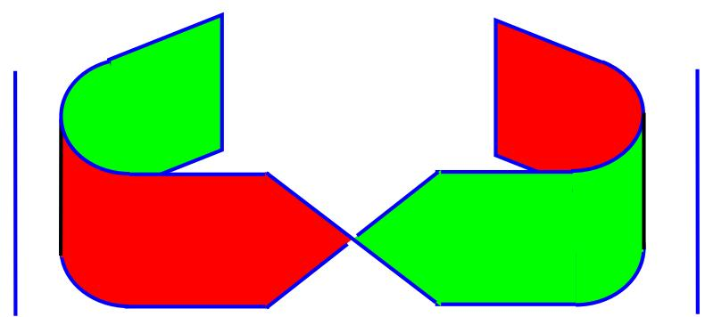  
Pour rabouter le dessus avec le dessous, il faut ajouter deux torsions. De ce fait, dans l’écriture, on est obligé de rajouter aussi deux traits, qui représentent ces torsions comme telle, lieu de passage du dessus au dessous, lieu où c’est la surface qui fait bord au vide.

## La représentation canonique de la bande de Mœbius représente le refoulement

Cette représentation de la bande de Mœbius :

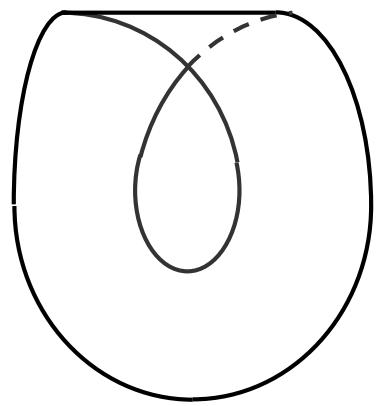

J’ai déjà écrit de quelle façon elle n’était pas satisfaisante, car la mise à plat, réellement, donne ceci, selon que toutes les torsions sont de même sens (à droite) ou qu’il y en a une de sens contraire (à gauche) :

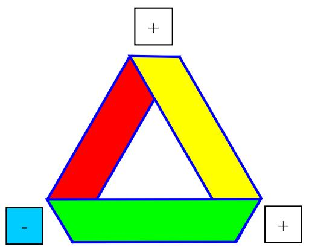

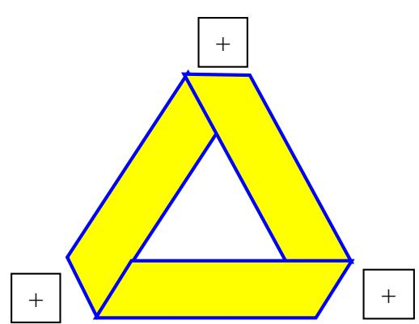

Donc la question se pose, dans la représentation précédente : s’il s’agit d’une mise à plat, pourquoi ne pas représenter les trois plis ? Et sinon pourquoi en représenter un et un seul? C’est comme si nous nous trouvions en présence d’une demi-mise à plat, dont on peut se demander sur quelle logique elle s’appuie.

Si on suppose une bande de papier, qui n’est pas un matériau extensible, c’est la mise à plat à trois torsions qui s’impose, même pour une représentation soit disant dans l’espace, comme sur la couverture de tous les Numéros de Scilicet :

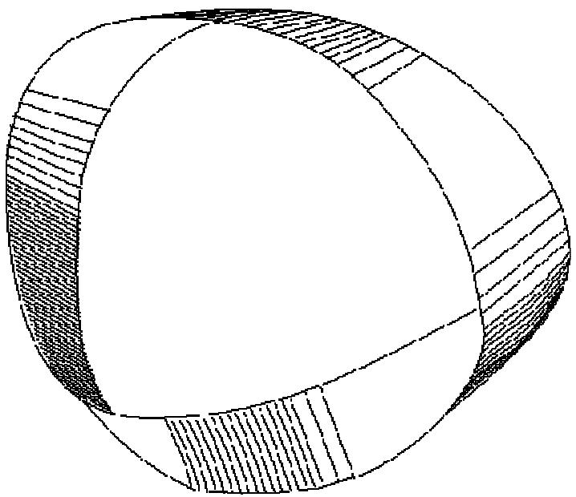

Mais on pourrait supposer que l’on construise la bande de Mœbius à partir d’une bande de papier déjà aplatie, une couronne qu’on aurait découpée de cette forme :

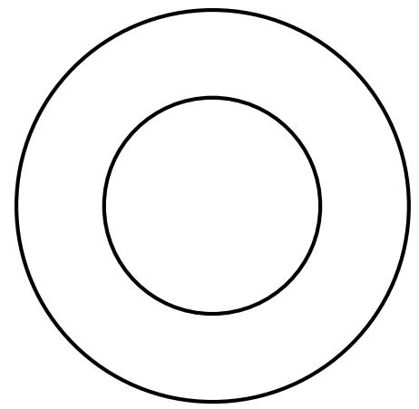

On aurait pu alors y pratiquer une coupure comme ceci

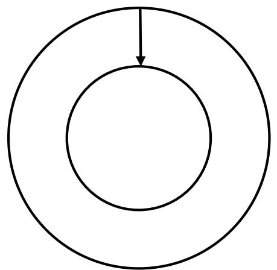

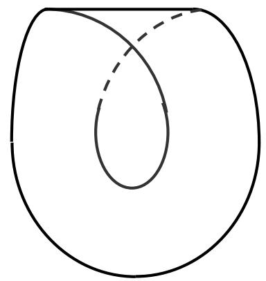

Pour ensuite recoller les morceaux moyennant une torsion, de façon à mettre en continuité les deux faces, celle que nous voyons et la face cachée. Ainsi, on pourrait peut-être se trouver justifiée la représentation à une torsion, la courbure sans torsion étant déjà là, comme dans le dessin canonique si souvent utilisé par Lacan et ses continuateurs.

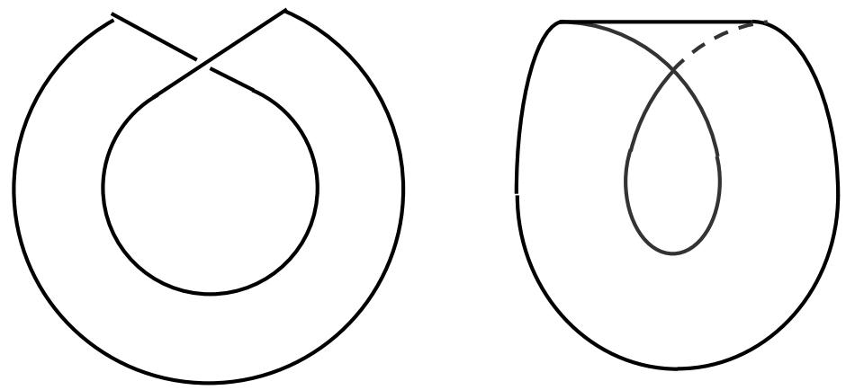

Hélas pour la représentation traditionnelle, quand on procède ainsi, on voit alors la bande se tortiller sur la table, se dresser comme un serpent selon deux torsions supplémentaires, et refuser de revenir au sol une fois la coupure scotchée. Force est de constater, alors, que la création d’Une torsion en a créé deux supplémentaires malgré la courbure déjà présente. Ce constat est confirmé par une remise à plat qui fait apparaître les trois torsions comme dans le modèle triangulaire.

Alors essayons de sauver ce modèle encore d’une autre façon.

La boucle est obtenue en prenant appui sur ce principe de la topologie classique : les objets sont souples. On peut donc écraser les deux torsions et obtenir ainsi une boucle. Si ce principe peut s’avérer fructueux dans une topologie purement mathématique, il ne convient pas à l’écriture théorique de la psychanalyse. En effet, pour la topologie classique une sphère trouée est un bol, qui est aussi un disque :

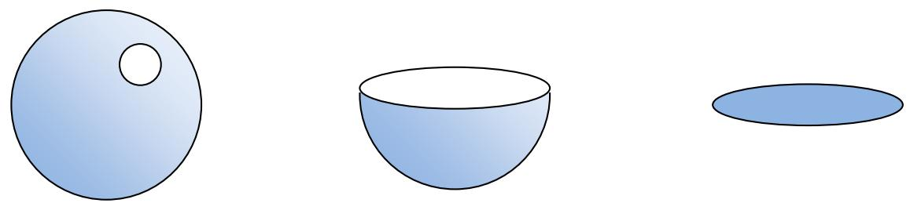

Pour la topologie classique ces trois objets sont équivalents. Or, de la sphère trouée et du bol au disque on passe cependant de 3 à 2 dimensions : c'est-à-dire du réel à la représentation, ou de la parole (à considérer uniquement la troisième dit-mention) à l’écriture, c'est-à-dire à la mémoire. On perd donc cette richesse qui consiste à adopter un modèle théorique écrivant ce qui se passe lorsque nous mettons quelque chose en mémoire, ce qui passe par la perte d’une dimension. On retrouve d’ailleurs dans cette perte le concept psychanalytique fondamental de castration. Mettre en mémoire c’est bien accepter que les représentations ne sont pas des choses : nous nous rappelons d’une représentation de la chose nous ne faisons pas venir la chose elle-même devant nous. Pour nous, dans la dynamique psychique, un disque est une représentation de la sphère, ce n’est pas la sphère, fût-elle trouée. Le disque est la mise en mémoire de la sphère (éventuellement trouée).

Par ailleurs, cette opération de mise à plat par assouplissement est-elle neutre ? A mon sens, non, car elle revient à ajouter une certaine quantité de surface à la surface initiale, ce qui n’est pas anodin. Cette quantité de surface est même calculable.

Supposons une bande de surface souple raboutée en cylindre, pour simplifier le problème. Le cercle du dessus et le cercle du dessous on le même rayon R.

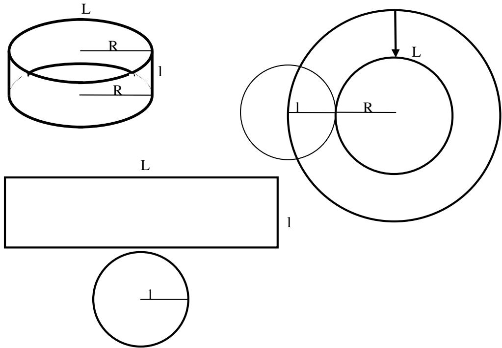  
Si L et l sont les dimensions de la bande avec laquelle on a construit le cylindre, l’écrasement de ce cylindre, autrement dit sa mise à plat, revient à augmenter le rayon du cercle du bas d’une longueur l. la surface initiale de la bande était Lxl = S. C’était aussi celle du cylindre. Par contre il est facile de voir que la surface de l’anneau obtenu par la mise à plat aura pour surface : $S ^ { \prime } = \pi ( \mathbf { R } + \mathbf { l } ) ^ { 2 } - \pi \mathbf { R } ^ { 2 } { = } \pi \mathbf { R } ^ { 2 } + 2 \pi \mathbf { R } \mathbf { l } + \pi \mathbf { l } ^ { 2 } - \pi \mathbf { R } ^ { 2 } { = } 2 \pi \mathbf { R } \mathbf { l } + \pi \mathbf { l } ^ { 2 }$

Comme 2π R = L, nous avons : ${ \bf S } ^ { \prime } = { \bf L } { \bf l } + \pi { \bf l } ^ { 2 }$

L’augmentation de surface est donc de $\pi ^ { 2 }$ , soit l’équivalent de la surface d’un disque de rayon l.

Il en est de même quel que soit le mode de raboutage de l’anneau, une torsion ne change pas le rayon R, ni la longueur l.

Au lieu d’écrire deux torsions, c'est-à-dire des écritures de la $3 ^ { \mathrm { { \dot { e } m e } } }$ dimension, écritures théoriques de la parole, on rajoute de la surface : c’est ce que fait le refoulement, en substituant une formation de l’inconscient (symptôme, rêve = surface, écriture) à une parole $( 3 ^ { \mathrm { \dot { \mathrm { e m e } } } }$ dimension = torsion). Ceci rappelle la rondelle que Lacan ajoutait à la bande de Mœbius pour former le cross cap. Nous voyons ici qu’il n’est pas besoin d’en passer par le cross cap pour écrire ce que nous avons besoin d’écrire en psychanalyse. Ce qui tombe bien, car le cross cap est une figure impossible à représenter dans l’espace 3 et a fortiori dans l’espace 2 de l’écriture.

Cette rondelle, dans la mesure où elle est fondue dans la surface obtenue par la mise à plat, c’est l’objet cause du désir, l’objet a en tant qu’il n’est pas reconnu, lette volée au sein des lettres lisibles.

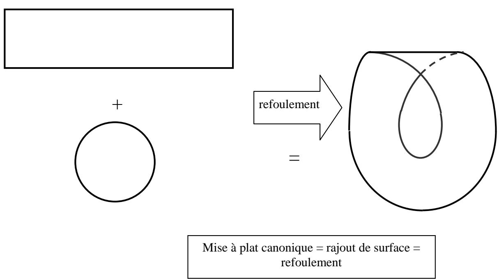

Ceci serait une écriture du cross cap comme plongement dans une surface. On y lit la désorientation que cherche à écrire le concept de cross cap : on ne sait pas si ce qui est écrit est une face dessus ou une face dessous, c’est « une face ».

Les trois torsions que je propose d’écrire, comme ceci :

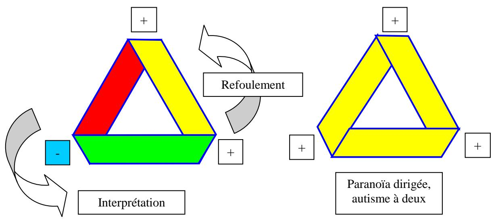

…écrivent de la $3 ^ { \mathrm { { \dot { e } m e } } }$ dimension, c'est-à-dire du passage par la parole, qui ne cesse pas de ne pas s’écrire comme telle, mais qui trouve une représentation écrite de la même façon que nous écrivons dans la mémoire ce que nous avons entendu. Elles écrivent la dialectique qui balance sans cesse entre le refoulement (torsion de droite et du haut)) et l’interprétation (torsion de gauche). Car il n’y a jamais l’un sans l’autre, comme le rappelle Lacan lorsqu’il dit : plus le discours est interprété, plus il est refoulé.

A l’inverse, la représentation canonique, si on veut la lire comme une seule torsion, ne rend pas compte de cette dialectique. Si on veut la lire comme une seule face, elle ne rend pas compte de ce que, sous tout discours manifeste, il y a un discours latent, ce qui est à la base de l’invention même de la psychanalyse. Elle ne rend pas compte de ce que, dans l’analyse, au lieu de s’en tenir à la manifestation du discours (une seule face) justement on le coupe, ne serait-ce que par la fin de la séance, afin de pouvoir revenir dessus à la séance suivant c'est-à- dire après cette nouvelle coupure de l’entrée en séance. Alors, en revenant sur le discours de la séance précédente, on fait venir dessus ce qui était dessous. Lacan : « si l’analyste coupe le discours c’est pour permettre l’avènement de la parole ».

Si on s’en tient à une seule face, alors il faut écrire plutôt la bande de Mœbius homogène : chaque face est dessus-dessous. Elle écrit donc l’analyse comme paranoïa dirigée (ou autisme à deux), à lire par : on s’en tient à ce qui est dit. Il n’empêche que, de cet autisme disait Lacan, on peut en sortir par la parole, et c’est le passage à l’hétérogène, par une coupure et un changement de sens de la torsion,

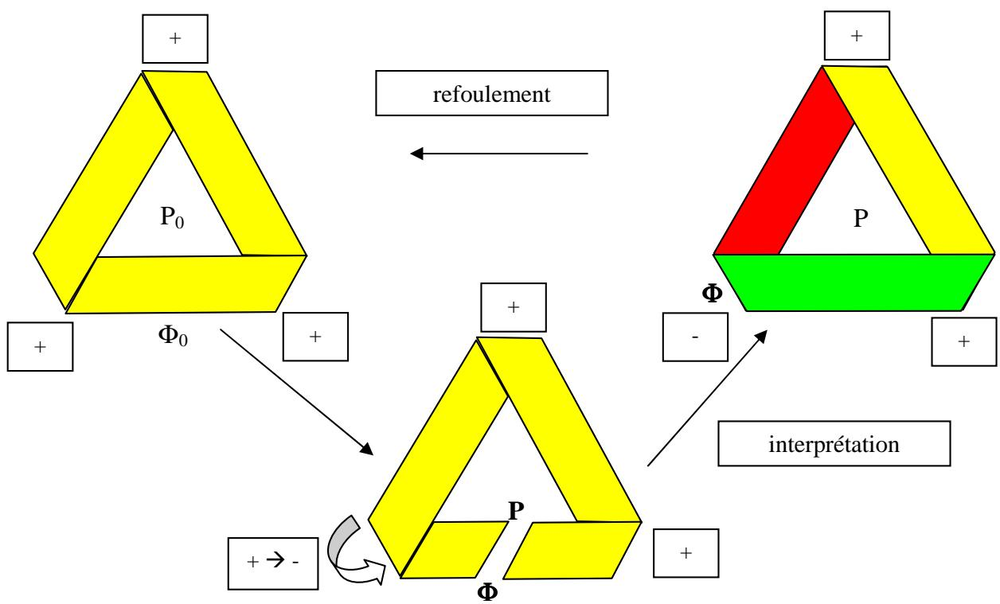

Qu’on la lise par coupure ou torsion ou retournement, l’interprétation est toujours ce qui fait apparaître une autre face. L’intérêt ne réside cependant pas dans cette autre face comme telle, mais dans le mouvement dialectique ainsi amorcé. Celui-ci déplace l’attention de la surface vers le bord, toujours en mouvement entre une face et l’autre. C’est sans doute ce que veulent lire les tenants de l’écriture canonique de la bande de Mœbius. S’ils la lisent ainsi, je me retrouve d’accord avec eux. Mais il se trouve que, dans le réel de leur écriture, au lieu d’en rajouter sur la coupure, ils ont réellement rajouté une surface de dimension πl . C’est ce que fait le symptôme, ou tout autre formation de l’inconscient. Ce n’est peut-être pas la meilleure façon de mettre l’accent sur la coupure, surtout lorsqu’on ne s’aperçoit pas de ce rajout qui ressemble bien à ce qui se passe dans le refoulement : ce que je ne peux pas dire (par une torsion triple) je l’écris (par une surface : lapsus, rêve, acte manqué, symptôme).

## La bande de Mœbius représente la coupure interprétative

La représentation que je propose ne fait pas autre chose que donner la structure potentielle de la bande de Mœbius, lorsqu’on met en œuvre la coupure deux tours :

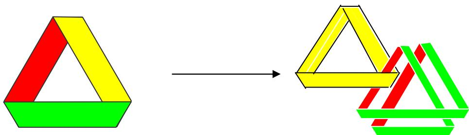

En somme, la mise à plat est une opération qui rend comte de la coupure à deux tours. Elle rend compte de ce qu’est la bande de Mœbius non coupée, comme reste de la coupure ce qui apparaît dans la zone jaune de l’écriture à trois torsions, tandis que la bande bilatère obtenue par la coupure apparaît dans l’autre partie de cette même écriture.

D’un autre côté, lorsque je faisais l’exposé de cette théorie chez Marie Laure Caussanel le 20 novembre 2004 ; Claude Harder m’a opposé les arguments habituels de ceux qui restent partisans de la représentation canonique à une seule torsion. Entre autre : « la torsion est partout, elle n’est pas localisée à l’endroit où l’on écrit le pli ». Je suis d’accord avec cet argument, pourtant : certes, la torsion, en tant que fonction, n’est pas localisée puisque aucune fonction ne l’est, étant globale par définition. Mais aucune fonction ne peut être connue si elle n’en passe pas par des localisations en termes d’objets.

Or la structure même de cette fonction, comme telle (et sans en passer par les objets) est triple ; je l’ai déjà montré il y a longtemps, en faisant remarquer ceci : qu'est-ce que cette fonction opère ? elle opère le passage d’un face à une autre face ; en ce sens un bord quelconque noté ainsi :

…représente aussi bien cette « torsion qui est partout ».

Il suffit d’y adjoindre les deux faces dont il assure la communication pour préciser que ce trait est un bord et non autre chose :

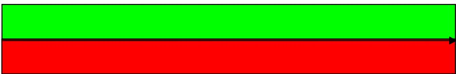

Ce trait représentant la coupure entre deux faces représente donc tout aussi bien cette fonction que la bande de Mœbius représente à sa manière.

Je reprends la démonstration que j’avais écrite pour mon premier livre sur l’autisme :

Si on dispose d’une coupure rectiligne infinie, coupant un plan aussi infini, elle ne coupe rien du tout, car elle n’atteint jamais l’infini du bord. Il faudrait un bord à cet infini pour que la coupure, rencontrant une autre coupure, puisse découper quelque chose, c'est-à- dire une rondelle, un morceau de surface ; et encore cela n’y suffit pas, il faut au minimum une troisième coupure car sinon rien ne se détache :

Pas possible détacher un morceau

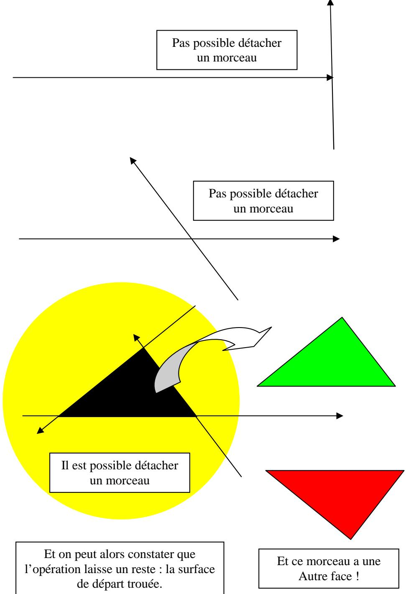

Pas possible détacher un morceau

Il est possible détacher un morceau

Et on peut alors constater que l’opération laisse un reste : la surface de départ trouée.

Et ce morceau a une Autre face !

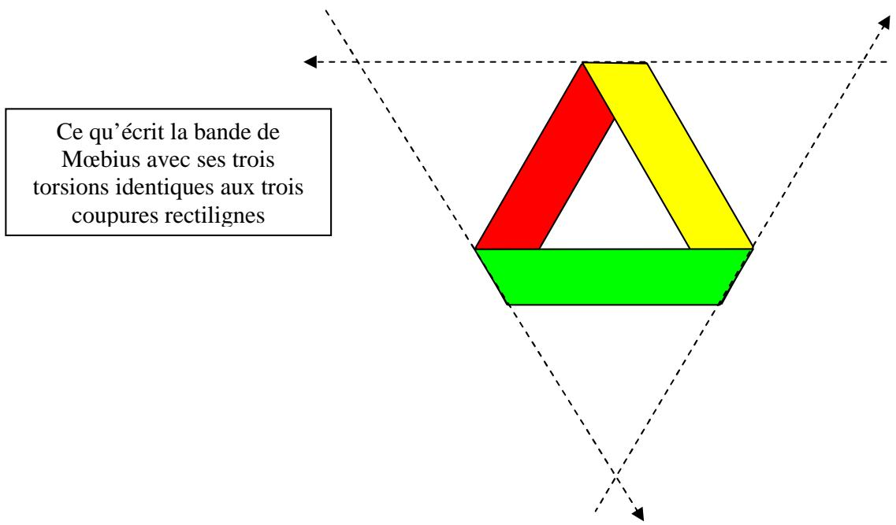

C’est la raison pour laquelle j’avais nommé « l’acoupure » cette coupure solitaire qui est incapable de produire de l’objet, c'est-à-dire un morceau détaché. Elle serait identique à la bande de Mœbius écrite à une seule torsion. Je l’avais proposée comme le modèle de l’autisme.

On peut supposer aussi que l’acoupure solitaire se recourbe : elle n’aurait alors pas besoin de deux autres coupures. Mais pour qu’elle se recourbe il faut qu’elle adjoigne à la première dimension, x, une autre dimension y :

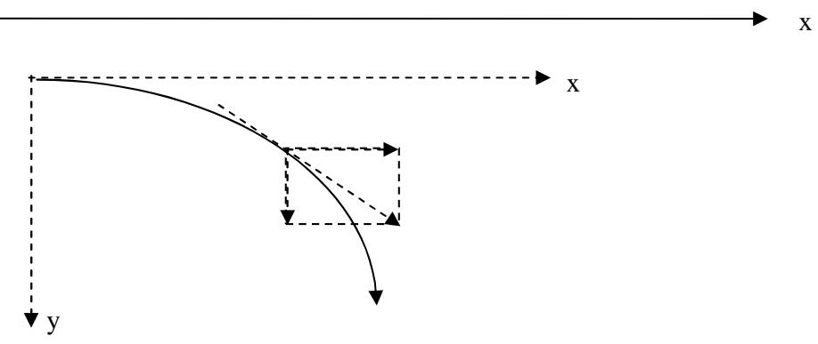

En chaque point de la courbe, la dimension x est pondérée par une certaine fonction de y, l’équation de la tangente en chaque point étant $\mathbf { y } = \mathbf { f } ( \mathbf { x } ) = a \mathbf { x }$ , où nous retrouvons notre objet a cause du désir, celui qui traduit un penchant… mais ça ne suffit pas : il existe des courbes ouvertes, comme la parabole et l’hyperbole qui ne découpent aucun morceau dans une surface.

Pour qu’une courbe découpe un morceau de surface il faut qu’elle se recoupe, c'est-à- dire qu’elle passe deux fois au même endroit, écrivant un dessus-dessous : le seconde coupure passe sur la première, en détachant un morceau. Cette troisième condition se laisse écrire ellemême en termes de fonction : $\mathbf { z } = \mathbf { h } ( \mathbf { x } , \mathbf { y } ) = \mathbf { h } ( \mathbf { f } ( \mathbf { x } ) )$ . Fonction f : l’acoupure ; fonction h : la courbure ; fonction z : la recoupe. Trois fonctions sont nécessaires pour rendre l’acoupure efficiente c'est-à-dire en faire une coupure.

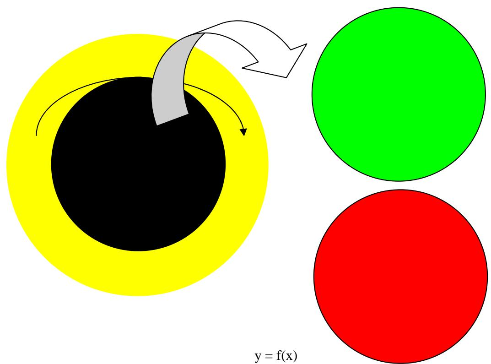  
Ce qu’écrit la bande de Mœbius avec ses trois torsions identiques aux trois fonctions nécessaires

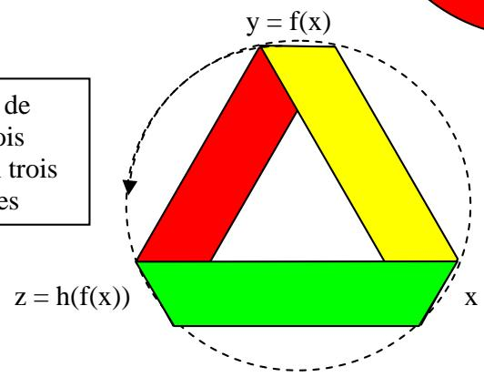

Evidemment la fonction z est partout : la bande de Mœbius écrit dans sa globalité le fait même de passer dans la troisième dimension, le fait de tourner le page ou de retourner la rondelle pour découvrir son Autre face. C’est une écriture de la troisième dimension : et pourtant l’écriture ne saurait être la troisième dimension comme telle, puisqu’elle se situe dans les deux dimensions de la page. C’est donc une écriture théorique de ce qui ne cesse pas de ne pas s’écrire : une écriture de l’énonciation en ce qu’elle ne peut se passer du support de la voix. L’analyse du concept de troisième dimension nous ramène de cette évidence : la troisième dimension suppose les deux autres. Pas de trois sans deux ni un. L’écriture à trois torsions écrit l’acte de la coupure ainsi que son produit : deux faces et un reste.

Ainsi la troisième dimension se trouve écrite sur la troisième torsion, celle qui n’est pas de même sens que les deux autres, celle qui, faisant la différence, assure la coupure. Celle-ci, en acte, articule une face avec l’Autre au niveau d’un pli, tandis qu’en regard s’inscrit la face jaune qui écrit l’objet a, lui aussi dans la troisième dimension, mais de manière passive. Cette surface écrit en effet le passage d’une face à l’autre, mais de manière désorientée : elle désoriente (c’est le refoulement : l’ajout de surface qui fait que, ici, la coupure s’écrit avec de la surface, la zone jaune) tandis que l’articulation de la troisième torsion oriente (c’est l’interprétation).

Par conséquent, quel que soit le mode d’écriture choisi : coupure rectiligne, coupure courbe, bande de Mœbius, on ne peut faire l’économie d’inscrire le trois dans l’écriture. La bande de Mœbius étant justement là comme concept pour écrire ce qu’est la structure de la coupure, l’écrire avec une seule torsion serait passer à côté de sa fonction de représentation du concept de coupure.

Je rejoins là un des derniers arguments de Claude Harder lors de cette soirée : il en venait à dire que même l’écriture à une torsion ne convenait pas, en effet, puisqu’il s’agissait de représenter la bande de Mœbius « qui est dans la tête », c'est-à-dire si j’ai bien compris, le concept : or le concept, quel que soit la manière dont on l’aborde est triple. De même, il n’y a pas de nœud borroméen en dessous de trois ronds. Le nœud borroméen n’est pas autre chose qu’une autre écriture de la coupure.

L’avantage de ces démonstrations est de mettre l’accent sur ce fait que le Un ne saurait se tenir tout seul, conformément à la définition de Lacan, elle-même triple : un signifiant représente un sujet pour un autre signifiant. « Le » signifiant, c’est au moins trois. Et, revenant à Freud nous lisons qu’il y a trois temps à la pulsion (actif, passif, réflexif), qu’il y a deux libidos (rouge, vert, l’objet –sexuel – et le moi), mais que c’est la même : il y a un temps où le narcissisme prend le moi en objet (jaune).

Tout cela est quand même d’importance si l’on songe que ce que Lacan nomme coupure, c’est essentiellement la coupure de l’interprétation. Il s’agit ici de rendre compte de l’acte psychanalytique, rien moins !

Je renvoie donc à mes autres articles pour qu’on se rendre compte de la façon dont ces concepts fonctionnent au plus près de la clinique.

## Annexe phénoménologique

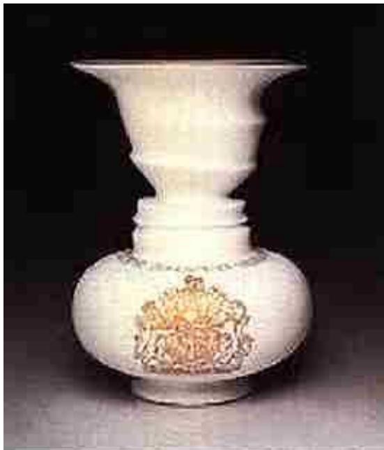

Le vase aux deux images n’est qu’une autre écriture de la bande de Mœbius ; ou l’inverse : la bande de Mœbius est une autre écriture du vase aux deux visages. Evidemment, l’exemple est trop simple, car si l’un voit deux visages et l’autre un vase, ils ont tôt fait en se parlant de voir l’un ce que voyait l’autre.

Si la question est plus compliquée, comme dans ce que nous débattons, il en est de même : c’est en nous parlant que nous pouvons rapprocher nos points de vue. Je crois que la figure du vase (ahaha ! la figure du vase ! vous entendez ?) est cependant exemplaire en ceci : ce qui est commun aux deux figures, c’est le trait qui les sépare, ce trait qui opère la bascule d’une perception à une autre. Ce trait, comme bord, c’est une écriture du signifiant. En disant « la figure du vase », je veux dire, sur un versant : la métaphore que représente cette expérience ambiguë ; et sur le second versant, je présentifie cette ambiguïté comme telle, en faisant entendre « visage » en synonyme de « figure ». C’est le même mot, mais il a deux acceptions différentes ; je peux choisir l’une, l’autre ou laisser dans l’ambiguïté, ce pourquoi la bande de Mœbius a trois torsions.

Ainsi la perception visuelle : on peut penser qu’elle est individuelle, et que, ensuite je parle de ce que je vois à l’autre, qui me parle de ce qu’il voit. L’individuel se collectivise en empruntant les bottes du langage qui nous est commun. Or le langage nous est commun, certes, mais également dans son ambiguïté. Il y a aussi perception individuelle des sons qui sont censé être communs. Et, de plus, nous avons appris à parle en même temps que nous avons appris à voir ; il a fallu qu’on nous montre les choses, qu’on nous les désigne de façon à lier le mot et la chose. Cet apprentissage a été en même temps celui de l‘ambiguïté dans tous les domaines.

Ce sein est à moi, dit la mère, mais je te nourris avec ; certes, ne répond pas encore le nourrisson, mais chère maman, formule-je à sa place, je considère ce sein comme faisant partie de moi. Le trait qui sépare les deux figures n’est pas encore né. Ce trait sera le langage, torero qui parfois se laisse encorner par le taureau pulsionnel. C’est pourquoi je suis obligé d’imaginer leur dialogue, mais en fait c’est bien ce qui s’imagine quelque part chez tout els deux, au travers de la seule qui à ce moment, là parle, la mère. Elle construit ce trait dans le dialogue imaginaire qu’elle noue avec l’enfant. Elle imagine ce qu’il veut, ce qu’il demande, ce qu’il lui dit. Elle lui en redit suffisamment pour qu’il se forge une parole d’abord modelée sur la sienne et qui en gardera la marque. Quand je parle, ce que je me figure que je dis a toujours été plus ou moins puisé au vase d’un autre.

Ainsi tout cela a plus ou moins été puisé au vase de Lacan, mais je l’écoule dans une sauce de mon cru.

Au fait, avez-vous remarqué que, dans un procès, si l’avocat n’est pas cru, son client est cuit.