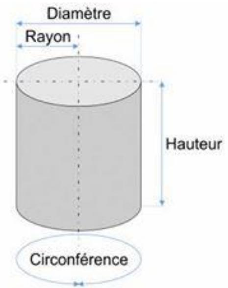
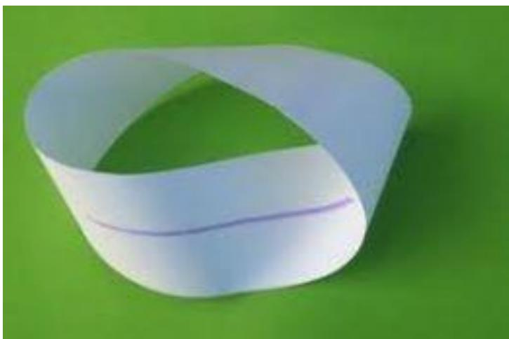

# Des trois torsions de la bande de Moebius

(en réponse à Emmanuel Bing)

Emmanuel Bing Richard Abibon Pour former l'anneau de Mœbius il est évident qu'il n'y a qu'une seule torsion qui s'applique. L'ennui c'est qu'elle s'applique à une bande qui en a déjà deux, chacune en sens contraire, qui forment l'anneau initial. Mon précieux... Mon précieux !... On a donc en tout trois torsions, trois plis etc., comme tu ne cesses de le démontrer. Les deux premières torsions sont invisibles tant que la troisième n'est pas réalisée. Elles sont, en quelque sorte, inconscientes, masquées par la parole du maître, non pas parce qu'elle serait vraie ou fausse, mais parce qu'elle est prise dans la glu de la sanctification des suiveurs, dont tu fus, toi aussi, à ce que tu dis.

J’en fus, mea culpa. Il est extrêmement difficile de s’extraire d’une doxa, même lorsqu’elle s’avère fausse. Mais parfois des remarques intelligentes comme la tienne viennent faire progresser la science.

merci pour ta reconnaissance des trois torsions : là aussi tu entres dans un club extrêmement fermé.

ceci dit, non, les deux torsions autres ne sont pas invisibles. ce sont celles qui forment un cylindre, n'importe quel cylindre mais ,plus particulièrement, le bord d'une boite de camembert, qui est une bande de largeur compatible avec la formation d'une bande de Moebius. Bien entendu, ces deux torsions ne sont pas localisées, elles se manifestent en continu, mais c'est ce qui fait qu'on observe un cylindre et non une platitude. C'est sans doute ce que tu essaies de signifier par "invisibles" ou "inconscientes". il suffit cependant de représenter un cylindre en perspective , ou de l'écraser, pour observer une localisation des deux torsions, qui peuvent aussi être 4, c'est selon le mode de mise à plat que l'on choisit. La mise à plat à 4 torsions est impossible partir du moment où la largeur devient égale à la longueur. Donc, nul besoin d'une troisième torsion pour les rendre visibles car, dans une perception de la vie quotidienne, notre regard aplatit forcément tout objet en nous le faisant voir en perspective, comme ce que les peintres ont appris à réaliser avec beaucoup d'essais et erreurs dans l'histoire. Donc même si on comprend intellectuellement que les deux torsions se présentent en continuité, il est impossible de ne pas voir les deux torsions se manifester dans une simple aperception non intellectuelle.

De même, en réponse à tous ceux qui disent que les trois torsions ne sont qu'un artéfact de mise à plat, eh bien cette mise à plat est déjà un effet de la perception dans la considération d'une bande de Moebius non aplatie à la main. C'est le dessin qu'on pouvait voir sur la couverture de scilicet et sur la couverture du livre de Vappereau "étoffe". IL est d'ailleurs foutrement étonnant que les gens qui contemplent ces dessins depuis 40 ans continuent à ne pas voir les deux torsions supplémentaires qui y sont pourtant, reflétant exactement la réalité de l'objet. enfin je ne sais pas si tu as vu ma vidéo sur la démonstration 74,

(https://www.youtube.com/watch?v=e\_bhuuzdMUw&t=3s) on peut faire circuler "LA" torsion , la dite seule torsion pour les aveugles de service, on peut la faire circuler de manière à ce qu'elle prenne la place de chacune des deux autres, montrant l'identité de nature et de fonction entre les trois torsions.

https://www.youtube.com/watch?v=e\_bhuuzdMUw&t=3s

Même dans cette photo ci-dessous, où l'on voit, comme dans un cylindre, les deux autres torsions "en continu" si on parcourt du regard ce que l'on voit, on s'aperçoit que l'on passe de dessus à dessous (dans la partie un peu plus ombrée) puis de dessous à dessus. La localisation est moins évidente, mais elle est là.

J'entends bien que les gens disent : oui, mais globalement elle est partout. Oui, globalement les trois torsions sont partout, comme le prouve ma démonstration 74. On peut les faire circuler en tout point. Mais même dans cette manœuvre, à chaque instant elles ont une triple localisation distincte.

Et puis, erreur supplémentaire des "gens" : celle de ne vouloir voir QUE le point de vue global. Or, nulle part il n'y a de point de vue global sans point de vue local. http://une-psychanalyse.com/3\_torsions\_demonstration\_12

un cylindre où l'on voit nettement les deux torsions dues à la phénoménologie du regard. On passe deux fois de la face grise à la face blanche. Bien entendu, ici, il s'agit seulement d'une artéfact phénoménologique. Un bonhomme circulant sur l'une des faces reste sur cette face, il ne passe pas à l'autre face. Mais notre regard, si. Et c'est ce qui nous fait voir qu'il y a deux faces, et donc, que nous sommes en présence d'un cylindre. s'il n'y avait que le point de vue intrinsèque ( ce que développe Vappereau dans son ouvrage "Etoffe : topologie des surfaces intrinsèques") ce bonhomme n'aurait aucun moyen de se rendre compte qu'il y a une autre face. Il pourrait tout aussi bien conclure qu'il est sur une bande de Moebius où, globalement, il n'y a qu'une face. Où l'on voit que c'est toujours l'articulation des deux points de vue qui nous permet une juste appréciation de la réalité. Cette articulation se fait par une troisième torsion virtuelle qui met en rapport une face et l'autre face, nous permettant de dire : ah, globalement, il y a deux faces qui ne sont pas en continuité, mais je les vois quand même en continuité grâce à la perspective, car je vois les deux torsions grâce à la troisième, virtuelle.

Donc dans un certain sens, Emmanuel tu as raison : dans le cas du cylindre, la troisième torsion virtuelle est ce qui rend explicite les deux autres. Dans le cas de la bande de Moebius, cette troisième torsion cesse d’être virtuelle pour devenir matérielle, et les deux autres torsions restent là, tout aussi matérielles.

## 21 décembre 2018