# Richard Abibon 4 discours en 4 minutes (Ou : la vérité est dans le trou)

La théorie est une chose, elle ne vaut rien si elle n’est pas issue de la clinique, et si elle ne s’y confronte pas en retour. S’y confronter ne veut pas dire s’y appliquer. J’entends par là une mise en tension de l’une par l’autre de façon à ce que chacun de ces pôles soit mis en question par l’autre.

Je viens de produire un « Théorie du nœud borroméen en relation avec la théorie des 4 discours ». Voici à présent un exemple de la façon dont elle permet de parler de la scène analytique.

Deux heures avant sa séance, un analysant me téléphone. Je ne peux venir à ma séance dit-il, je suis submergé de travail, je peux vraiment pas. A ce genre de discours (discours du maître, car il essaye de bouleverser l’ordre des choses par une nouvelle donne) les analystes ont l’habitude de répondre sur un ton calme : « très bien, je vous attendrais tout à l’heure, à l’heure habituelle de votre séance ». Au contraire, j’admets l’entorse à la règle : dans mon conscient à moi, le travail c’est sacré. Ce n’est pas facile d’en avoir un, de nos jours, ni de le conserver. Je propose donc, une séance déplacée au lundi suivant, ce qu’il accepte. Un rapide coup d’œil à mon agenda me fait apercevoir que je n’ai de place pour lui qu’à 20h30, ce qui est bien tard. Alors, lui ayant dit l’heure, qu’il accepte sans sourciller, j’ajoute : mais donnez moi votre N° de téléphone à votre boulot : si une place venait à se libérer plus tôt, je vous appellerai. Par conséquent ce n’est plus une entorse à la règle, c’en est une modification, et je me réserve le droit de modifications ultérieures. En parlant, nous nous mettons d’accord, et ceci est en accord avec la loi du langage ; trouver un accord, ce n’est pas autre chose que la mise en acte de la loi du langage.

Mon analysant est coutumier de ces déplacements, retards et oublis. Mais, bon, il est comme ça, et le problème n’est pas que la règle soit aveuglément respectée, mais que toutes les modifications qu’on y imprime soient prises dans le processus analytique. En parlant ainsi, je ne réponds pas en maître, seul garant de la règle, mais en hystérique, qui reprend le propos avancé par celui qui se met en place de maître pour l’interroger afin de lui faire produire autre chose : un savoir S2, ici déjeté à la place de l’objet.

L’accord étant conclu, je raccroche.

Quatre minutes plus tard le téléphone sonne à nouveau. C’est encore lui. Bon, je me suis arrangé, me dit-il : je viendrais tout à l’heure à ma séance, à l’heure habituelle. Ah, bien… je suis étonné de cette volte face mais je ne m’interroge pas plus avant.

Il arrive donc à l’heure dite et me déclare aussitôt : je vous ai menti. Je n’étais pas submergé de boulot. J’avais rendez-vous avec un mec qui devait me vendre du shit. Je devais le trouver à 8h dans le nord de Paris…c'est-à-dire juste au moment où je devais sortir de ma séance. Je n’aurais jamais été à l’heure au rendez vous avec lui. Et puis quand je vous appelé, c’est lorsque vous m’avez dit « donnez moi votre N° au boulot »… que je me suis arrêté…. Je me suis dit, ah, là, il y a quelque chose.

Et là je m’interromps pour vous dire, à vous lecteur : il y avait plutôt quelqu'un, un sacré numéro ! Sur le moment je n’avais pas compris cela, bien sûr. Un sacré numéro, c’est celui qu’il était en train de me faire, à quoi je lui répondais par une question dont j’ignorais totalement le sens caché : qu'est-ce que c’est que ce numéro que vous me faites ? Qu’est-ce que c’est que ce travail ? Ce qui a donné en condensation : qu'est-ce que votre numéro au travail ?

Oui, un sacré numéro : là en me disant cela, en revenant sur l’échange précédent, il tient le discours de l’analyste, ou plus exactement le discours que lui permet la tenue de sa séance d’analyse, un discours d’analysant dans lequel il dévoile la vérité du discours précédent.

## Qu'est-ce qu’un discours ?

Je vais tenter d’en démonter la structure à partir de ce petit exemple.

1) Dans toute interlocution, il n’y a pas d’accord entre les partenaires du discours tant qu’une réponse n’a pas été donnée, positive, négative, ou autre. Tant qu’on parle au mur, on peut bien croire parler, on peut bien s’imaginer comprendre ce qu’on dit, si ce n’est pas entendu par un autre, ce n’est pas validé. Parler au mur ou parler sans se soucier si on est entendu par l’autre, ou ne pas tenir compte de ce que dit l’autre, voilà autant de manière de se situer dans la psychose. Si quelqu'un vous dit qu’il voit la sainte vierge, et s’il ne tient pas compte au moins de ceci, c’est que vous, vous ne la voyez pas, on ne peut pas dire que nous soyons d’accord sur la « réalité ». Il parle à un mur en s’obstinant à vous dire qu’il voit ce que vous ne voyez pas, et vous parlez à un mur en insistant pour lui démonter qu’il n’y a rien à voir. Evidemment, si vous êtes croyant, vous pouvez vous mettre d’accord sur ceci que, justement, vous ne voyez pas la sainte vierge, qu’il la voit, et que vous le croyez quand il vous le dit. On ne se met pas d’accord sur une réalité matérielle, mais sur une vérité de croyance. C’est une manière de socialiser la psychose.

Tout ceci pour dire qu’il est impossible de tenir un discours sans autre pour l’entendre. Le principe même du fonctionnement de la parole, c’est qu’elle suppose un autre à qui l’on s’adresse, et qui, par une réponse, la valide. Cette réponse peut bien être un désaccord, l’accord repose au moins sur ceci : j’ai entendu ce que vous avez dit. Je peux contester le contenu de ce que vous avez dit, mais je ne saurais contester que vous l’ayez dit. Quoiqu’il en soit de la vérité du contenu, il est vrai que vous avez parlé. S’il fait beau et que je vous dis : tiens, il pleut, certes, d’un point de vue météorologique, c’est faux, mais du point de vue de notre relation, il est vrai que j’ai dit : il fait beau.

La tenue du discours suppose donc au moins ces deux places : celle d’un agent qui parle et d’un autre qui écoute :

$$
\text { Agent } \rightarrow \text { autre }
$$

Dans ma petite histoire, comme dans toute psychanalyse, l’agent, c’est l’analysant. C’est lui qui choisit de franchir ce seuil de me téléphoner pour modifier quelque chose dans le protocole. Mais dans toute séance d’analyse, l’analysant est toujours l’agent au sens où c’est lui qui parle. Il ne répond pas à la demande de l’analyste, au contraire, c’est lui qui pose une demande, une demande de savoir (sur lui-même et sur l’autre) une demande de soulagement. Ce pourquoi je ne cesse pas de ne pas comprendre les analystes qui s’obstinent à appeler patients leurs analysants. Le patient, c’est bien le contraire de l’agent. L’autre, c’est l’analyste.

L’analysant est donc l’agent et ici, le signifiant S1 qu’il prononce, c’est je ne viens pas.

2) Il y a un second principe au fonctionnement de la parole : élément de discours, le signifiant, ne se rencontre jamais seul. De même qu’un élément de son, le phonème, ne prend sens que de son rapport avec au moins un autre (et finalement de tous les autres), un signifiant ne devient signifiant que de son rapport à au moins un autre signifiant. C’est la définition de

Lacan bien connue : le signifiant représente un sujet pour un autre signifiant. Voilà pourquoi la structure de la parole se formalise au minimum ainsi :

## S1  S2

« Le » signifiant se présente comme l’articulation d’un premier signifiant qui inaugure le discours à un autre qui le conclue. Le premier en sera dit l’agent (il occupe la place de l’agent), puisqu’il est celui qui permet de franchir un seuil, celui de se mettre à parler, celui qui constitue la parole comme acte. L’acte de parler, comme dit plus haut, nécessite forcément l’adresse à un autre : telle est l’ambiguïté de la place du signifiant dit « autre » dans la théorie des 4 discours : c’est à la fois l’autre signifiant nécessaire au premier pour qu’il fasse sens (et il s’agit ici du S2), et l’autre personne à laquelle le sujet adresse son discours (et il s’agit de la place de l’autre que ce S2 occupe).

3) Lorsque je parle, la plupart du temps je parle d’un objet, et si j’en parle c’est que cet objet m’intéresse. Il convoque mon désir. Mais ce n’est jamais le désir qui sera mis en avant dans le discours courant. A sa place viendra le savoir, celui qui se construit de l’articulation S1 S2. Ce peut être n’importe quel objet de la vie quotidienne, dont je parle à un autre parce que je le lui demande, ou parce que, en en faisant valoir ses qualités et ses défauts dans l’usage que j’en fais, par exemple, je démontre, mine de rien, mon savoir et ma maîtrise auprès de l’autre. Cet objet peut être aussi un objet d’amour, et ce peut être justement cette personne à laquelle je m’adresse, et alors je me fais valoir auprès d’elle comme objet désirable. Enfin, si je parle d’un tiers, ce sera le plus souvent pour le dénigrer : en faire un objet de rebut. Quel que soit l’objet sur lequel on peut formuler un savoir, l’objet réel qui serait censé le soutenir, la chose, reste inaccessible. Mais elle se pose théoriquement comme toujours là en soutient au discours qu’elle cause. C’est l’objet a, que Lacan situe sous le savoir S2 qui permet d’en parler. L’objet a cause le désir, mais seul le savoir qui se construit de l’articulation de S1 à S2 permet d’en parler.

Cette place de l’objet a détermine celle de la production : le discours produit du savoir, certes, mais du coup ce savoir rejette hors de lui l’objet sur lequel il est sensé porter. Le savoir sur l’objet, ce n’est pas l’objet. Par contre ce n’est qu’après en avoir causé, de cet objet, qu’on pourra se rendre compte justement des imperfections de ce savoir et de l’insatisfaction qu’il cause, en regard d’un objet supposé réel qu’on ne pouvait imaginer auparavant. L’objet qu’on peut après coup supposer présent avant le discours, n’est jamais que le reste que le discours aura produit.

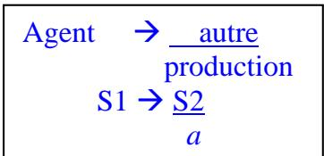

4) le savoir est-il le tout du discours ? On vient de le voir, si l’objet est l’enjeu de ce savoir, il renvoie toujours au sujet qui en tire valeur par contre coup. Faire valoir l’objet au yeux d’un autre c’est toujours se faire valoir comme objet de l’autre. Mais d’être l’objet du désir de l’autre, c’est parfois ainsi que je peux me sentir sujet. Dénigrer un tiers, je l’ai dit plus haut, est aussi une façon de rejeter un objet extérieur afin de prendre la place comme sujet. Si parfois mon propos peut prendre les accents de la louange, ce sera alors pour recueillir quelques lauriers de la couronne que je lui tresse.

Donc, au-delà du savoir qui porte sur l’objet, il y a une vérité non dite, qui est la valeur que le sujet cherche à faire valoir dans l’acte de parler. C’est pourquoi Lacan inaugure sous la place de l’agent qui inaugure cet acte, la place de la vérité.

<table><tr><td>$ \underline{\text{S1}} $ → $ \underline{\text{S2}} $</td></tr></table>

S’il y a un agent du discours, on pourrait penser qu’il s’agit du sujet : celui qui énonce les signifiants S1 S2. Et bien non, l’agent est bien le signifiant comme tel. C’est pourquoi on demande à l’analysant de dire ce qui lui passe par la tête : non pas un discours qu’il aurait l’illusion de construire en raisonnant correctement et dont l’agent serait le moi, mais au contraire, un discours où c’est bien le signifiant qui serait l’agent. Il faut que le sujet laisse le signifiant parler par sa bouche. C’est la seule façon de s’en rendre compte, car en dehors de l’analyse, c’est aussi le signifiant qui parle, mais le moi se donne l’illusion de maîtriser son discours.

Alors le sujet ? Il n’est pas dans la chaîne signifiante, on ne l’entend pas dans le discours, mais il y est supposé, en dessous. Il se sert de l’articulation signifiante pour se faire représenter auprès de l’autre, à la manière d’un ambassadeur qu’on envoie à l’étranger. Dans le discours du maître, Lacan pose le sujet \$ à la place qu’il nomme « vérité ».

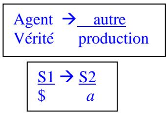

C’est plus particulièrement le S1, le signifiant dit « signifiant maître » qui sera chargé de cette représentation, car il est celui qui franchit le seuil, celui qui inaugure le tranchant de l’acte de parler. C’est le moment où j’envoie l’ambassadeur de ma parole auprès de l’autre.

Et pour valider mon discours, cet autre doit répondre.

En d’autres termes, si la vérité de mon discours, c’est toujours de tenter de me faire valoir comme sujet auprès de l’autre (faire mon numéro, et de préférence le N°1 : S1), j’en passe forcément par un objet, et cet objet est nécessairement double, ainsi que Freud le démontre dans son introduction du narcissisme : il y a le moi et un objet extérieur, l’un ne pouvant se passer de l’autre. Pas de signifiant sans autre signifiant, et donc pas de sujet sans autre, ce qui revient à : pas de moi sans objet extérieur.

Ainsi la structure des discours S1  S2 est-elle posée comme une machine qui, comme toute machine, produit un objet qui, dès lors qu’il est produit, se situe hors de la machine, même si la machine est aussi une production d’elle-même. De la même façon, la vérité de la machine, son principe de fonctionnement, n’est pas non plus incluse en elle, même si, d’en dessous, il la soutient.

Dans cette machine, les 4 lettres s’échangent leurs places en se déplaçant d’un quart de tour, donnant lieu à 4 discours différents, chacun constituant la réponse de l’autre au sujet qui tient le discours précédent.

<table><tr><td>MaîtreS1 → S2$ a</td><td>Hystérique (sujet)$ → S1a S2</td><td>Analystea → $S2 S1</td><td>universitaire (passe)S2 → aS1 $</td></tr></table>

Ainsi, en demandant de changer l’horaire de la séance comme il le fait souvent, mon analysant tient le discours du maître : il veut être celui qui décide. Notamment lorsqu’un objet est en jeu, cet objet si bien nommé « shit » auquel il ne veut pas renoncer. Il en convoite la jouissance au sens quasi juridique du terme : il souhaite en avoir l’usufruit. Mais pour cela, il doit obtenir l’accord de l’autre, à savoir son analyste, auquel il téléphone à cet effet. Sans cela, la vérité de son discours ne pourra pas tenir, quitte à ce que ce soit un mensonge. L’autre est convoqué pour valider cet effet de discours par lequel sera produit, d’une part un objet, le shit, (qui restera bien hors discours, en tout cas hors du discours tenu à l’analyste), d’autre part un sujet.

<table><tr><td>Je ne viendrais pas → j&#x27;ai trop de travail$ a (shit)</td></tr></table>

Dans cette demande, pour moi, c’était le sujet moi-même qui était concerné, et qui n’avait pas envie de finir trop tard. Si j’avais été un lacanien orthodoxe, j’aurais répondu non à sa demande : pas de question, je vous attends à l’heure prévue. Ça aurait été un autre discours du maître. Nous aurions vu alors l’affrontement de deux maîtres avec, forcément, l’abdication de l‘un au profit de l’autre, sans possibilité de faire avancer les discours. Mais comme je n’ai pas envie de faire le maître, je ne suis pas un lacanien orthodoxe, je ne résiste pas à sa demande (« il n’est de résistance que de l’analyste »), sauf par les conséquences d’un coup d’œil à mon emploi du temps : je ne peux lui proposer un rendez-vous que fort tard. Mon désir à moi, c’est de jouir de l’objet temps, qui m’est compté. Ce pourquoi je lui demande aussitôt son Numéro au travail afin que, si une place se libérait dans la journée, je puisse le faire venir.

C’est donc mon désir de sujet, ma vérité qui se manifeste dans cette demande que je lui fais en retour. Je ne réponds pas par un autre discours du maître, mais par un discours dans lequel je mets en avant ce qui me barre dans mon élan : \$, S barré par l’absence de cet objet temps. Le déplacement du \$ engendre celui de son S1, qui devient l’autre signifiant auquel je m’adresse en réponse. Le fait de lui demander son N° pour l’appeler le jour du nouveau rendez-vous, suppose en effet que j‘ai bien entendu son propos S1 : je ne peux pas venir à l’heure prévue. Le savoir S2 par lequel il justifiait son absence S1, tombe en dessous comme lieu commun : tous les deux, nous avons trop de travail. Il se trouve en place de la production à présent, car nous n’en avons plus rien à faire. Néanmoins c’est quand même cet objet ici jeté qui a causé notre désir:

<table><tr><td>$ → S1/a S2</td></tr></table>

<table><tr><td>quel est votre N° au boulot ?</td><td>→ j&#x27;ai bien entendu que vous ne viendrez pas</td></tr><tr><td>je n&#x27;ai pas le temps</td><td>j&#x27;ai bien entendu que vous avez trop de travail : moi aussi</td></tr></table>

On voit que dans cette nouvelle écriture, la lettre \$ a changé de statut : ce n’est plus la vérité du discours du maître, c’est l’agent du discours de l’hystérique, et donc c’est un signifiant. Et ce n’est plus le même sujet, puisque, ici, il représente l’analyste et non plus l’analysant. Néanmoins ce n’est pas n’importe quel signifiant qui vient là me représenter : c’est le signifiant « numéro », identique au sien. Car mon numéro, mon cirque à moi, c’est de lui demander son numéro à lui, au moment où il me le présente sur un plateau. Ça aurait pu être le signifiant travail : vous mettez en avant votre excès de travail, moi aussi. Mais ce n’est pas ce que j’ai dit.

Ça reste dans le dessous, a, comme vérité non encore dite.

## Une écriture topologique

## Le discours du maître

Posons une identité de base, que je me réserve de démontrer plus tard : le signifiant est une coupure. S’il n’y a pas de signifiant sans autre, alors le discours, c'est-à-dire l’articulation signifiante, se présentera comme le croisement de deux coupures.

Toutefois, le croisement de deux coupures dans un plan infini, fussent-elles infinies et quel que soit l’angle qu’elles forment ne permet pas de détacher un morceau de la surface. L’accord, ce serait un morceau de surface qui se détache, ce qu’on pourrait appeler le signifié de ce qui a été dit. Ce qui permet, grosso modo, de répondre à celui qui a parlé : je vous ai entendu.

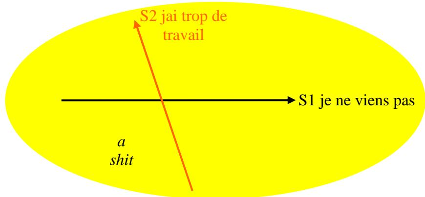

De même que, à la fin d’une phrase, il faut se souvenir du début pour boucler un signifié, de même la réponse de l’autre doit tenir compte de l’ensemble de ce qui vient d’être dit. Sinon le mur qui sépare les interlocuteurs ne saurait être troué.

Pour faire trou, c'est-à-dire pour permettre le détachement d’un morceau de surface il est nécessaire qu’une troisième coupure vienne barrer les deux premières. Vous aurez remarqué que la définition de Lacan ne met pas seulement en relation deux signifiants : il y a aussi cette affirmation qu’un signifiant représente un sujet pour un autre signifiant. Le sujet constitue ce troisième nécessaire. Est-il un signifiant ? Non, sans doute, ce n’est pas ce que dit la définition de Lacan. Par contre il est représenté par un signifiant. Par conséquent si nous nous en tenons à la définition que j’ai donnée plus haut, « le signifiant est une coupure », et si nous en restons au discours du maître, nous ne pouvons pas écrire le sujet comme une coupure.

Par contre, en faisant pivoter les lettres d’un quart de tour, nous passons au discours du sujet (dit de l’hystérique). Le sujet \$, quittant la place de la vérité, monte en position d’agent, devenant un signifiant, sous cette forme voilée du « numéro ». Un signifiant, voilà la troisième coupure qui peut venir achever la trouure commencée par son « numéro » de maître :

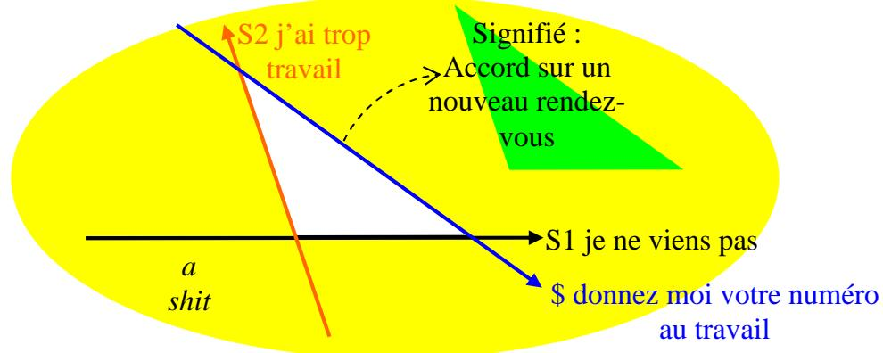

L’achèvement de la trouure se produit de la clôture de ce trou engendré par le détachement du signifié que nous venons de construire à deux : l’accord sur un nouveau rendez-vous. A la place du morceau de surface détachée se dévoile un trou : celui de la vérité du discours du maître, dont on voit bien ici qu’il ne se construit comme tel, après-coup, que de la réponse de l’hystérique. Je préférerais dire : du sujet barré. Et en effet, c’est le sujet barré que je pose à cette place du trou. Je le note d’un indice v : \$v. Au sein de la surface infinie désorientée, le trou vide qui, en tant que tel, n’est pas orienté, provoque de l’orientation : lorsqu’il y a trou, on sait au moins où sont les bord. Nous disposons d’un repère fini. Le trou représente dans l’écriture ce qui ne cesse pas de ne pas s’écrire : la parole. Il en représente néanmoins la fonction s’opposant d’une part à l’objet détaché de la surface, le signifié, d’autre part à l’entourage de surface désorientée. Autrement dit, tout en cherchant l’objet qui cause son désir, ce qui lui permettra d’acquérir du savoir, le sujet court également après la vérité. L’un et l’autre ne sont obtenus qu’après-coup, lors de la réponse de l’autre.

Au changement de discours, c'est-à-dire lors de la réponse que j’ai apportée aux propos de mon analysant, le prolongement des deux coupures, ouvre dans la surface jaune un trou de désorientation entre les signifiants concernés, \$ et S1. De ce côté-là, la surface reste infinie, comme en attente, à son tour, d’une troisième coupure :

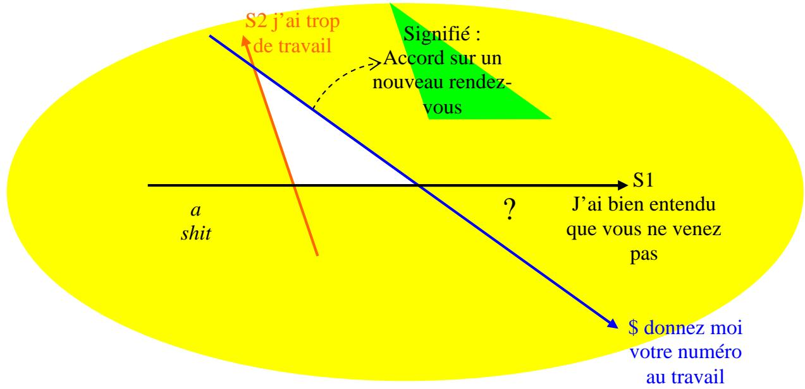

Comment allons nous repérer la nomination de cette troisième coupure ? La théorie des 4 discours prévoit qu’il va s’agir de la lettre a qui monte en place d’agent au discours de l’analyste. Jusqu’à présent cette lettre n’explicite rien. Dans l’après-coup nous avons pu savoir qu’elle écrivait l’objet cause du désir chez l’un et l’autre des interlocuteur, le shit pour l’un, le temps pour l’autre. Par ailleurs, la chronologie de l’histoire rapporte que le signifiant suivant à être prononcé le sera par l’analysant dans un nouveau coup de téléphone par lequel il annonce sa venue à l’heure prévue. En d’autres termes, ce nouveau signifiant signale le changement d’objet de l’analysant : il renonce à son shit pour mettre à la place son analyste. C’est en ce sens qu’il s’agit bien d’un expression de l’objet a : au delà des changements d’objets de la demande, objets de la réalité, le changement comme tel fait valoir l’objet a comme fondement de tout objet.

## De trois coupures rectilignes à trois ronds noués

Comme nous venons de le voir, il faut un minimum de trois coupures rectilignes pour détacher un morceau de plan. Mais un trait courbe qui se referme sur lui-même en ferait tout autant. Cela suppose que ce mouvement de la coupure est infléchi par l’autre dimension du plan :

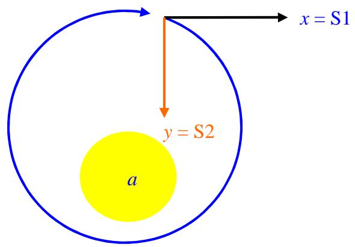

Ce S2, en combinaison avec S1, produit de la surface au sens où le trait se doit à présent d’occuper de la surface. Comme un trait rectiligne, il n’a qu’une dimension, il est toujours un signifiant, mais son trajet désigne maintenant de la surface, à deux dimensions : deux, comme S2. Ce S2 représente en chaque point de la courbe le « poids » de l’objet dans le discours, qui représente le désir, notamment le désir de savoir, bien sûr, puisque le transfert s’effectue sur un sujet supposé savoir. Ainsi voyons nous le signifiant de la demande tourner autour de l’objet sans toutefois l’atteindre.

Le sujet n’est pas non plus dans le discours, le bouclage de la courbe en témoigne, de la même manière que la recoupe par une troisième coupure rectiligne. Là, c’est la courbe ellemême qui se recoupe, par une troisième fonction qui permet de faire passer dans la troisième dit-mention une rondelle de surface. Là nous situerons une écriture topologique du sujet, à cet endroit de la recoupe, dans la troisième dit-mention, dans le trou de la vérité. Le lieu de la recoupe est en effet un point double : il pourrait être d’abord dessous puis dessus s’il s’agissait d’une ficelle faisant une boucle. S’agissant de coupure, donc de vide, le point de recoupe renoue le vide avec le vide, mais il permet, d’une part l’éviction d’une rondelle de surface dans la troisième dit-mention, d’autre part la mise en évidence de cette troisième ditmention comme telle, le trou laissé par cette éviction.

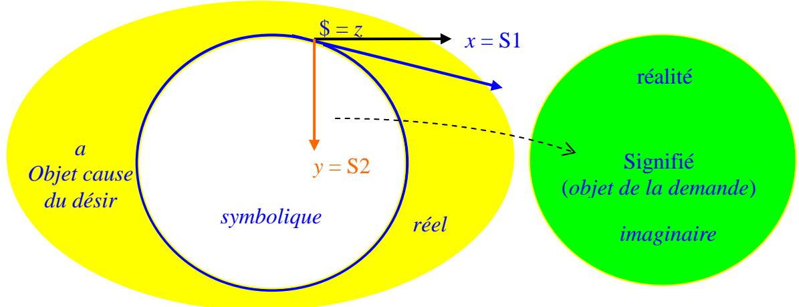

Cette représentation d’une courbe qui se recoupe est plus proche de la réalité du signifiant : de même que chaque point x se trouve pondéré d’une valeur y, de même, à chaque instant, chaque élément du discours est pondéré par l’objet qui le motive, construisant son référent. La surface de la réalité se construit en référence à un réel que produit le discours, de même que la surface s’engendre par le produit, c'est-à-dire la référence en tout point, d’une dimension à l’autre dimension. Chaque phonème ne prend son sens que dans le rapport à tous les autres, chaque mot, chaque morphème ne prend son sens que dans le rapport à tous les autres, et enfin, le sens ne produit un signifié que dans le mesure où tout ce qui a été dit a été mis en mémoire et se rassemble à cet instant là dans cette globalité d’une rondelle qui en tombe et qu’on nomme le signifié. En ce dernier, on peut reconnaître l’objet de la demande : ce n’est plus l’objet cause du désir.

L’objet n’est donc plus au centre : s’il avait courbé la trace du signifiant par le désir qu’il cause, il ne saurait être à la place du signifié, qui n’est qu’une illusion qui tombe de la recoupe de la trace du signifiant par elle-même. Le signifié n’est pas l’objet ; au mieux, pour suivre De Saussure, il s’y réfère, ce qui fait de l’objet son référent. L’objet cause du désir n’a donc d’autre place que celle de l’extérieur, ce qui, compte tenu de la place « intime » où je l’avais placé d’abord, le resitue dans son caractère d’extime, selon le néologisme que nous a proposé Lacan.

Parlant de l’objet, je dois bien convenir que ce n’est pas l’objet comme tel qui est dans mon discours. Il n’y est que représenté par les mots que j’emploie pour le désigner. Dans cette nouvelle écriture, comme dans la précédente, « le » signifiant est représenté par le bord du trou. Mais ici, chaque point de la courbe représente l’articulation d’un signifiant avec l’autre, S1  S2, comme cela se passe en effet dans n’importe quelle énonciation. On n’a pas distingué l’un et l’autre, on ne représente que leur combinatoire. Il s’agit donc d’un point de vue plus synthétique qu’analytique.

Et le sujet ? Comme dans notre écriture précédente, nous ne pouvons pas le trouver dans le discours lui-même, mais dans sa réponse venant d’un autre. Cette autre dit-mention, ce sera la troisième, celle qui permet, au moment où la coupure se recoupe, de plonger cet objet « rondelle » dans l’espace de la réalité, tout en ouvrant le trou de la parole, en tant qu’elle a circulé avec efficace de l‘un à l’autre. Cette réponse d’un autre, nous ne pouvons l’écrire que par une autre coupure circulaire, qui recoupe celle que la première énonciation vient de tracer.

Nous pourrions écrire ainsi l’articulation de ces deux coupures :

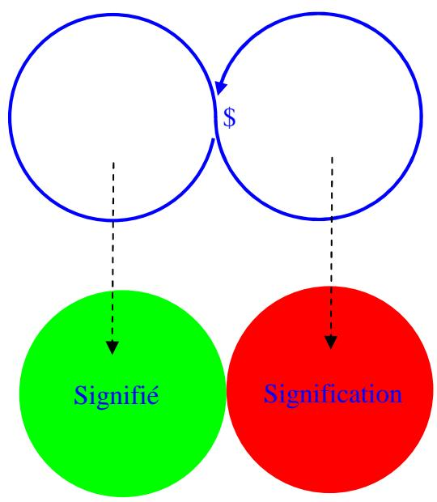

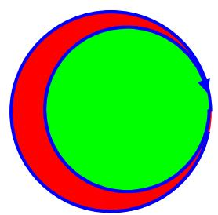

C’est un huit dans lequel le signifiant prononcé effectue un tour d’énonciation dans la bouche de celui qui parle puis suscite un tour de réponse de la part de celui qui a entendu. On y retrouve le huit intérieur de Lacan.

Mais cette représentation supposerait que l’envers, s’il n’est pas l’endroit, en épouse cependant exactement le contour enserrant la même surface. C’est en ce sens que le huit intérieur est plus intéressant : il écrit un écart entre l’envers et l’endroit, entre ce que je dis et ce que l’autre entend. Les cercles d’Euler, longtemps utilisés par Lacan donnent une écriture plus précise :

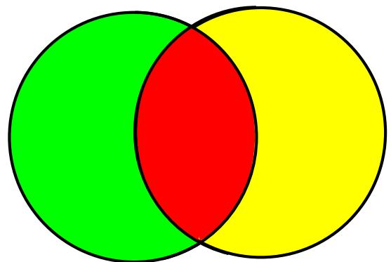

Il y a ce que je dis (vert) ce que l’autre comprend, et qui est donc commun aux deux parties (rouge), et ce qui échappe, l’objet a (jaune). Ceci est mon interprétation, fonction de ce qui nous occupe ici, et non les développements que Lacan en a tiré autour de sa lecture de la formule de Descartes : ou je ne pense pas, ou je ne suis pas.

Cette écriture nous rapproche de celle du nœud borroméen. Cette dernière a l’avantage de combiner ce que nous avons constaté de la nécessité d’au moins trois coupures rectilignes, et le fait que « le » signifiant serait en fait toujours courbe. Ainsi, la nécessité des phonèmes de toujours renvoyer aux phonèmes déjà dits et aux phonèmes à dire, ce qui implique la courbure, se combine à la nécessité d’un autre signifiant construisant un savoir, puis d’un troisième venant d’un autre disant qu’il a entendu.

L’écriture du nœud borroméen se présente alors comme une combinatoire de trois ronds qui délimitent huit triskels, huit zones limitées chacune par trois coupures :

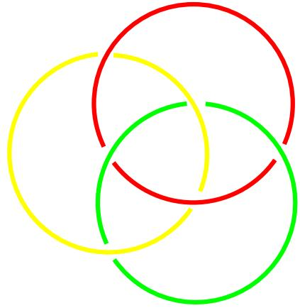

Dans chacune de ces zones nous pouvons suivre un parcours de discours semblable à celui que nous venons de décrire avec trois coupures rectilignes. Un signifiant (articulation de phonèmes) s’articule à un autre signifiant (autre articulation de phonèmes), ce qui n’est pas suffisant pour délimiter entièrement une zone de surface. Un troisième y est nécessaire, \$, représentant la réponse que le discours suivant apporte au discours précédent.

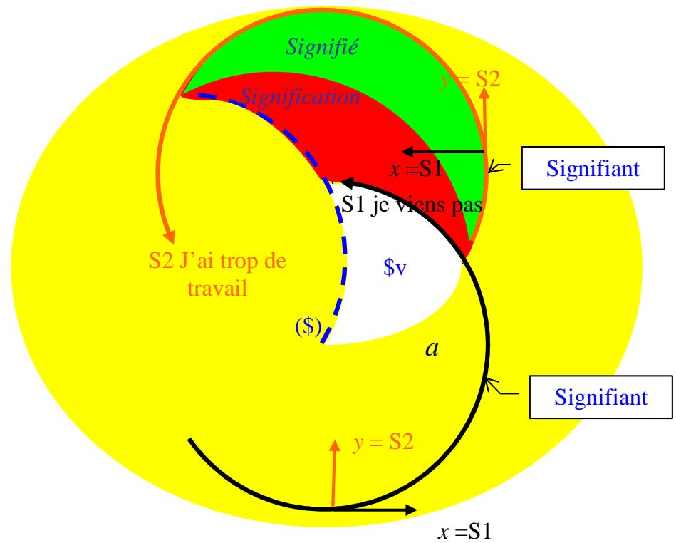

La dynamique du mouvement s’écrit ainsi doublement :

par la courbure que l’objet impose au signifiant qui le vise, mais qui, étant toujours hors discours, transmet son influence par le biais de l’autre signifiant, comme on peut le lire ci-dessus.

par le croisement d’un mouvement signifiant avec une autre mouvement signifiant, croisement qui engendre un signifié faisant office de référent.

J’en viens ainsi à l’écriture que je nomme dynamique du nœud borroméen, car ce qu’elle tente d’écrire, c’est le mouvement de la parole dans son rapport à ce qui s’en fixe dans le souvenir conscient (vert) et inconscient (rouge) ; le triskel ci-dessus se décompose en deux mouvements correspondant à l’énonciation successive de S1, puis S2. Nous allons supposer que l’agent S1, se déplace de la gauche vers la droite en laissant sur place la surface, et la trouant lors de son retour dans le plan. Dans l’écriture des coupures rectilignes, la coupure permettait le détachement d’un morceau de surface fini. Ici, elle est prise comme un rond de ficelle dont la mise à plat sur le support plan organise sur ce dernier la coupure virtuelle d’une écriture, tel un trait de plume séparant deux domaines. La coupure courbe se détache de la surface pour se réinscrire, vide, de l’autre côté. C’est ce vide de l’énonciation, à inscrire a posteriori comme vérité, qui va permettre la mise en valeur de la zone finie de surface contiguë, prise entre l’inscription des deux signifiants considérés, ici : S1 et S2.

Conformément à l’écriture des 4 discours, le premier nœud borroméen ci-dessous inscrit l’acte de l’agent (l’ouverture de la parole), tandis que le second représente l’autre avec laquelle l’agent s’articule (la fin de l’énonciation). La combinaison de ces deux signifiants délimite la zone de surface du signifié, avec cependant un manque : la réponse de l’autre est encore en attente, laissant inconnue la zone rouge de la signification. Le signifiant qui viendrait fermer le triskel n’a pas encore été prononcé. Il faudra retourner le rond suivant, bleu (\$) pour fermer cette zone. C’est pourquoi la zone verte du signifié se restreint à la partie qui, à partir de S1, élargit le bord de S2, tandis que la partie devant s’engendrer par l’articulation de S1 et de \$ reste un potentiel pour l’instant interdit, en rouge. Il s’agit de la signification latente, par opposition au signifié patent.

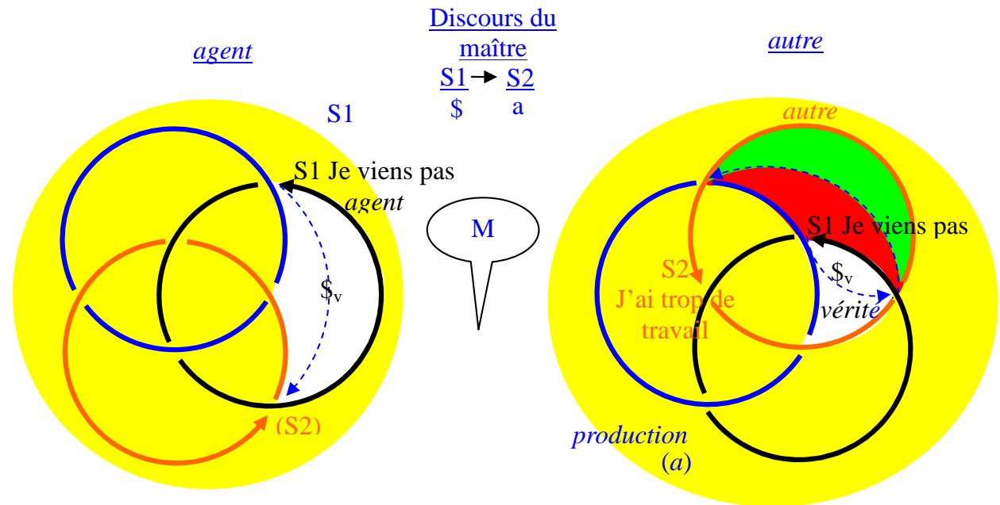

L’écriture joue sur une ambiguïté de la représentation. Les traits représentent aussi bien des ronds de ficelles que les coupures qu’ils occasionnent sur un plan de support lorsqu’on le met à plat. Autrement dit, ils représentent les signifiants. L’énonciation, qu’on ne peut jamais écrire – car alors, elle cesse d’être énonciation pour devenir écriture - est représentée par le mouvement d’un rond de ficelle circulant d’un côté à l’autre autour de l’axe que constitue les deux autres ronds, qui restent immobiles. Ici, le retournement de gauche à droite du rond noir autour de l’axe constitué par le rond orange et le rond bleu, inscrit l’énonciation : je ne viens pas. Je pose l’axiome d’écriture suivant : ce mouvement du rond, qui est sorti de son support plan pour passer dans la troisième dit-mention et se reposer de l’autre côté, ce mouvement étant celui du signifiant, laisse en plan la surface qui le supportait (a), et, se recouchant de l’autre côté dans le plan, y découpe un trou représentant en quelque sorte le mouvement qu’il vient de faire, trou dans l’écriture, puisque l’écriture ne saurait inscrire le mouvement.

Mais ce trou dans l’écriture, trou imposé par l’énonciation, doit s’achever par la rencontre de ses bords, afin qu’un morceau se détache, comme dans l’écriture des coupures qui se recoupent. Ici, les traits d’écritures représentent des ronds de ficelles et non des coupures ; ils découpent néanmoins des zones virtuelles dans le champ que leur support délimite, et en ce sens, ils restent des coupures. Le trou s’achève à la fin de l’énonciation du deuxième signifiant, en déposant sur son bord le signifié qu’encadre les deux signifiants successivement prononcés. La signification inconsciente du propos reste suspendue, tout comme sa vérité, au troisième signifiant qui ferme le triskel esquissé par les deux premiers.

Ce dernier est déjà écrit sous la forme du trait bleu du troisième rond, qui n’a pas encore bougé. Car seul le mouvement peut rendre compte d’une énonciation. Et c’est à un nouveau discours tenu en réponse au précédent, qu’incombera la tâche d’achever véritablement le trou de ce premier triskel.

Il nous faut donc écrire ce nouveau discours, qui sera lui aussi inachevé. Car, s’il achève le discours précédent en reprenant certains termes, il ne s’en constitue pas moins pour l’instant que de deux coupures, insuffisantes pour délimiter un nouveau morceau.

Dans cette écriture, on voit bien les deux signifiants tenter de se recourber sur le trou de la vérité, mais il y manque des éléments : un bout d’arc bleu et un bout d’arc orange, représentant les signifiants qui n’ont pas été dits lors de ce premier échange. Dans le même temps ils essaient aussi de se refermer sur l’objet a de la surface jaune indéfinie, ce que pourrait faire un rond tout seul. Mais le fait même de la présence de plusieurs ronds les en empêche. Et c’est ainsi dans le langage : un mot n’est pas une entité close sur elle-même, Lacan énonce : le signifiant n’est pas identique lui-même. Il renvoie au minimum à un autre signifiant, laissant ouverte cette possibilité du vide de l’énonciation qui pourra produire du sujet.

## Le discours du sujet (dit par Lacan « discours de l’hystérique »)

Discours de l’hystérique : ce nom choisi par Lacan m’indispose un peu, vu la connotation sociale péjorative, je préférerais parler du discours du sujet ou du discours de l’analysant, puisque c’est celui qui met le sujet en position d’agent.

Quel est donc ce troisième signifiant qui cette fois va achever le trou ?

Un premier réflexe m’avait entraîné à écrire la vérité de ce discours du sujet : je suis bien d’accord pour changer le rendez-vous mais, voyez-vous, ça m’embête, parce que je n‘ai pas vraiment de temps. Mais à ce moment là, je ne l’ai pas dit. Ce n’est pas du signifiant, c’est une vérité qui se trouve dans un trou non encore ouvert, sous la proposition : donnez-moi votre Numéro. Le temps qui me manque pourrait donc être inscrit dans cette position de la vérité du deuxième discours.

```txt
quel est votre N° au boulot ? → je viendrais
j'ai trop de travail j'ai bien entendu que vous avez trop de travail :moi aussi
je manque de temps
```

Mais si c’est une vérité qui s’énonce dans le discours que je vous tiens ici même, ce n’est pas celle qui s’est dévoilée à ce moment là.

En suivant simplement une logique chronologique, la parole suivante, c’est la réponse que mon analysant m’a fait 4 minutes plus tard sous la forme de son nouveau coup de téléphone : finalement, je viendrais à l’heure prévue. La vérité de mon discours n’est dévoilée ici qu’à la manière de son effet qui s’écrit par un acte de l’autre : je viendrais.

Et ce n’est que plus tard, dans la séance, que mon analysant me fera part de l’effet de vérité que mes paroles ont produites sur lui. Et je dis bien : l’effet de vérité, car s’il n’a pas perçu mes hésitations quant à mon manque de temps (la vérité), puisque je n’en ai rien dit d’explicite, il en a par contre saisi ses effets sur lui, l’incitant à dire la vérité sur lui-même. De la même façon, j’avais répondu à sa demande de modification de rendez-vous, non en fonction de l‘idée que je me fais de la place de l’analyste, mais en fonction de la vérité de mon désir.

Nous nous trouvons devant ce qui pourrait apparaître comme un paradoxe : ce n’est pas le même sujet qui profère les deux signifiants du discours que j’appelle à présent discours du sujet. S1, c’était son annonce d’absence, et je ne fais qu’en prendre acte : maintenant je sais qu’il ne sera pas là, c’est devenu un savoir, et S1 glisse en position de deuxième signifiant, sur lequel travaille ma réponse, celle d’un autre sujet : donnez moi votre numéro au travail.

Et c’est l’acte de venir, cette fois vraiment posé comme acte analytique et non comme routine, c’est cet acte qui lui permet de transformer son mensonge en vérité en revenant, troisième coupure a, sur ses deux dires précédents, montrant comment c’est mon intervention sur le numéro de téléphone (l’expression de mon désir) qui lui a permis d’inverser le sens de la coupure S1. Pourquoi est-ce que je parle d’inversion du sens de la coupure ? Tout simplement parce qu’il s’agit du même propos inversé : je ne viens pas, et puis, au $2 ^ { \mathrm { { \dot { e } m e } } }$ coup de fil : je viens. C’est donc ce je viens qui pourrait tenir la place du troisième dans l’achèvement du deuxième discours.

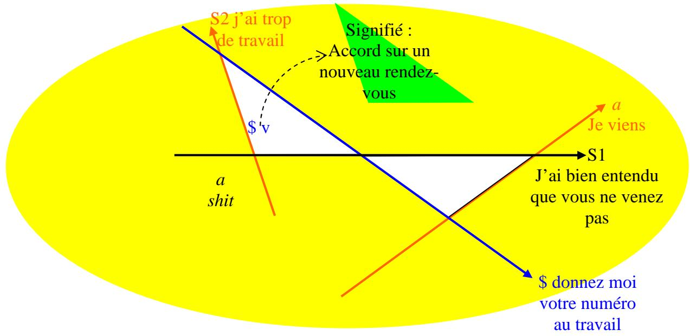  
C’est ici que l’écriture borroméenne nous apporte un complément intéressant, permettant de préciser la nomination de nos coupures :

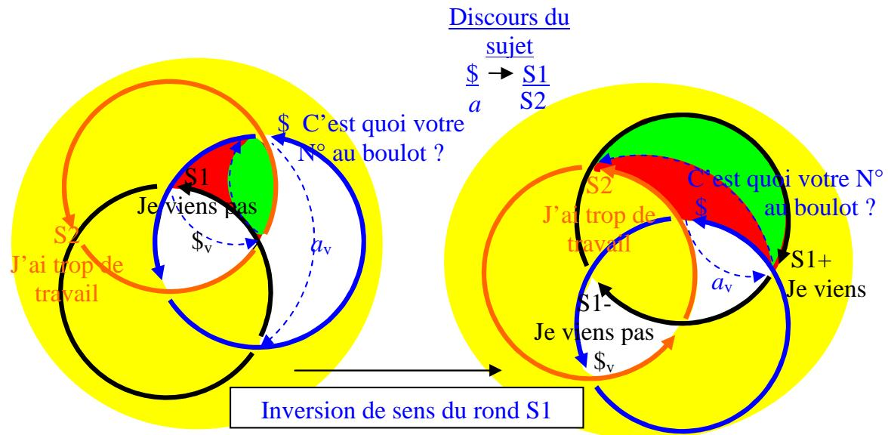

Si nous suivons toujours la même syntaxe dans le retournement des ronds, c'est-à- dire l’ordre : noir, orange, bleu, alors le deuxième retournement du discours du sujet (dit « de l’hystérique ») et un deuxième retournement du rond noir S1. Et ce retournement a pour effet de le faire changer de sens. La coupure de chaque rond en deux par l’écriture des deux autres favorise l’inscription de ce double sens : c’est le même rond (de l’opération transfert) mais ses deux parties peuvent se lire d’un côté négativement (je ne viendrais pas) de l’autre, affirmativement (je viendrais). Ainsi nous disposons d’une opération graphique qui représente exactement ce qu’il en est de l’opération interprétative : le deuxième retournement, c'est-à- dire la deuxième énonciation d’un signifiant inscrit une Autre lecture.

Voilà pourquoi, en nous appuyant sur l’identité d’un rond qui change de sens lorsqu’ on le retourne, nous pouvons réutiliser l’écriture d’un coupure en changeant son sens :

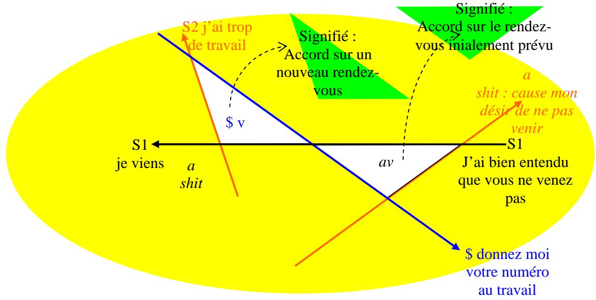

## Le discours de l’analyste

C’est en arrivant à sa séance que l’analysant achèvera le discours du sujet (dit « de l’hystérique ») en prononçant le discours de l’analyste. On peut donc constater que le discours de l’analyste, ce ne sont pas les paroles que prononce l’analyste, mais celle que le dispositif analytique permet à l’analysant d’énoncer. En arrivant à sa séance, il commence par me dire qu’il m’a menti : il n’avait pas trop de boulot. Il avait par contre besoin d’un prétexte pour aller acheter du shit. Et puis, ajoute-t-il, c’est ma demande de son numéro au boulot qui l’a fait changer d’avis ; sans trop savoir pourquoi d’ailleurs, mais tout d’un coup, c’est cette histoire de numéro qui lui a fait inverser le sens d’un signifiant.

Ce n’est donc pas ce je viens qui monte comme a dans le discours suivant, dit discours de l’analyste. Dans le respect de la logique de la petite machine de Lacan, c’est l’objet cause du désir qui, montant en première ligne, va trouver place signifiante. Ce faisant, ce n’est plus l’objet a comme tel, bien sûr, ça en devient l’expression, tout bêtement dans l’expression du désir de venir, et non de suivre la règle. Du coup la règle est néanmoins respectée, mais dans le respect du désir. Dans ce renversement se révèle le changement d’objet, témoin de l’absence du petit a comme tel.

Dans la figure que j’ai construite, cette coupure a revient naturellement couper le savoir S2 produit au discours du maître pour inverser aussi ce « trop de travail » en « travail analytique », achevant ainsi le discours de l’analyste. Le travail analytique, c’est cette bascule qui fait basculer le savoir inconscient en position de vérité. Au départ, il s’agissait de faire savoir ce qui empêchait la tenue de la séance. Ici, après trois glissements, il s’agit de faire savoir la vérité.

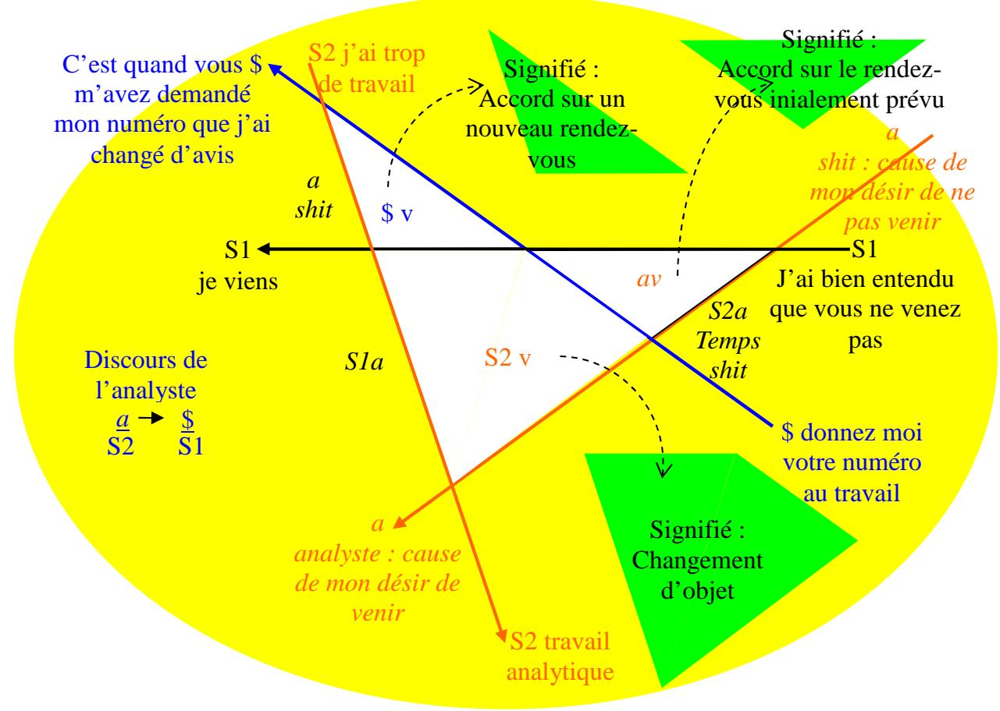

$$
\frac {a}{\mathrm{S2}} \to \frac {}{\mathrm{S1}}
$$

Analyste (comme objet de l’analysant)j’ai bien entendu votre demande de mon numéro Le Savoir sur l’objet en position de vérité ne pas venir et venir

Signalons une différence d’avec les discours précédent : cette fois, le morceau enlevé, le signifié, n’a pas la forme triangulaire attendue. Et pour cause : il lui manque le morceau déjà enlevé au discours du maître. Or c’est bien cela la caractéristique du discours de l’analyste : c’est celui qui amène à saisir que, de même qu’un signifiant appelle toujours un autre signifiant et celui-ci un troisième, de même le signifié sera toujours incomplet.

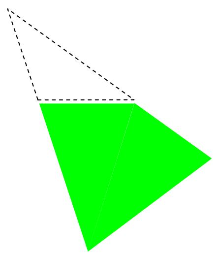

La différence entre les deux écritures présente encore une fois un certain intérêt. Si les coupures S2 et a sont ci-dessus deux coupures différentes, elles s’avèrent, dans le nœud borroméen, les deux parties d’un même rond :

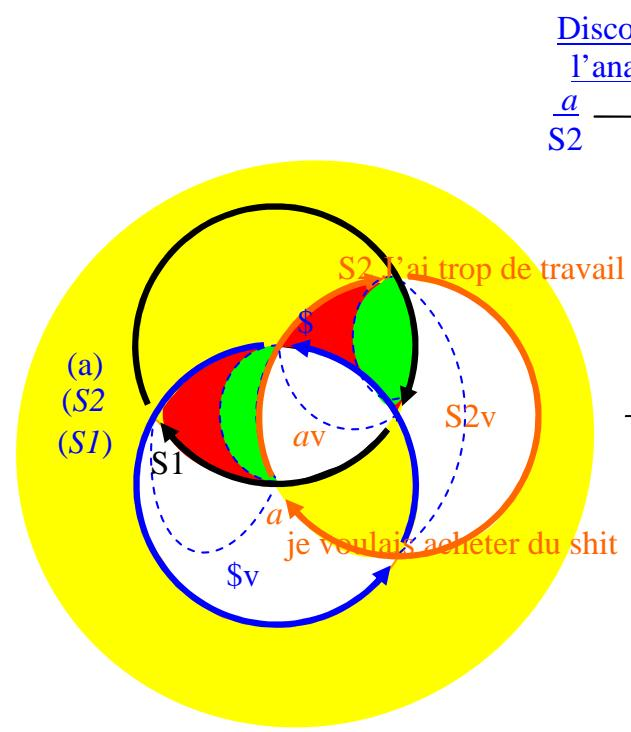

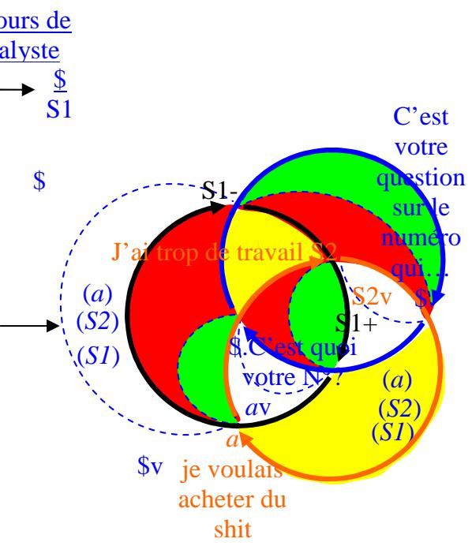

C’est toute la différence du 4 au 3, puisque nous avons d’un côté 4 coupures, et de l’autre 3 ronds, ou 6 demi ronds. Elle s’actualise ici en toute logique, puisque le savoir en position de vérité, qu'est-ce d’autre, sinon un savoir sur le désir et l’objet qui le cause ?

Ceci ne peut que nous inciter à ne pas nous laisser duper par le jeu de l’écriture. Aucune écriture ne recèle une vérité dernière : la vérité est plutôt dans le trou entre les écritures, et chacune apporte son lot d’enseignements.

Autre différence, le deuxième retournement de rond de ce discours concerne le rond bleu \$. Le premier arc retourné de ce rond était une parole de l’analyste : quel est votre numéro au boulot ? Le second sera donc la reprise qu’en fait l’analysant lorsqu’il énonce que c’est cette parole qui l’a fait changé d’avis. Il avait donc entendu dans cette parole plus qu’elle n’en disait explicitement. Je peux y entendre en retour une interprétation dévoilant cette fois le désir qui sous tendait le propos du premier arc. La vérité se dévoilant ici est donc triple :

\- le prétexte du travail voilait la recherche d’un objet de plaisir, chez l’analysant. Je peux faire l’hypothèse de l’avoir entendu sans m’en rendre compte, et que toujours sans le savoir, c’est un qu'est-ce que c’est que ce numéro que vous me faites ? qui a été entendu par l’analysant. En tout cas c’est ce que j’entends après coup dans ce qu’il m’a dit avoir entendu au-delà de mon propos.

\- le prétexte du travail (modifier le rendez-vous) voilait la recherche d’un objet de plaisir (d’un temps de loisir), chez l’analyste

\- au-delà des deux objets demandés (le shit, puis l’analyste) l’analysant repère l’oscillation essentielle du désir (sur un objet qu’il ne nomme pas et que je nomme ici : l’objet a, représenté par le trou comme tel et par le manque dans la surface du signifié)

C’est à ce sixième retournement que ce qui est laissé « dehors », hors de la zone circonscrite par le dessin des trois ronds, devient un vide ; et ce vide, c’est le sujet en position de vérité. Au départ, la zone jaune est partout, et le travail de la parole ouvre le trou de la vérité dans cette zone jaune désorientée ; le travail d’orientation se poursuit par le creusement de ces trous successifs, aboutissant à ceci, que c’est à présent le vide qui entoure les deux zones jaunes désorientées et irréductiblement désorientées. Tout nouveau retournement de rond ne pourra revenir sur ce fait.

On ne pourra pas non plus revenir sur ceci, que la coupure entre signifié et signification (pointillé bleu), qui a tissé un lent continuum se referme ici sur elle-même, circonscrivant clairement et définitivement la séparation du signifié et de la signification. Cette coupure, qui oriente la réalité dans son rapport à une vérité toujours potentielle, laisse en dehors de son champ deux zones jaunes. Celles-ci resteront définitivement inorientables et pas seulement désorientées comme les zones que nous venons successivement d’orienter par le retournement successif des ronds. Dans celles-là, le sujet peut s’orienter, non seulement dans l’espace de la réalité, mais dans celui de la réalité psychique où se pose la fameuse question che vuoi ? (Que veux-tu ?) La question du désir, que me pose l’Autre.

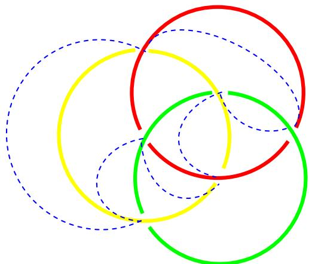

Cette coupure se referme sur elle-même comme une coupure courbe, ou comme les trois coupures rectilignes qui ont façonné notre module de base. Elle présente le même processus à un degré de complexité plus élevé, un peu comme nos coupures rectilignes se développent sur le modèle d’une fractale.

## Le discours dit « de l’universitaire »

Dans l’écriture des coupures rectilignes, même constat, ce qui est plutôt rassurant quant à la cohérence des écritures : elles se sont déjà toutes recoupées, il n’y a pas d’autre recoupe à attendre. Par contre une lecture dernière est encore à faire celle du S2 s’articulant avec a, dans le discours dit « de l’universitaire ».

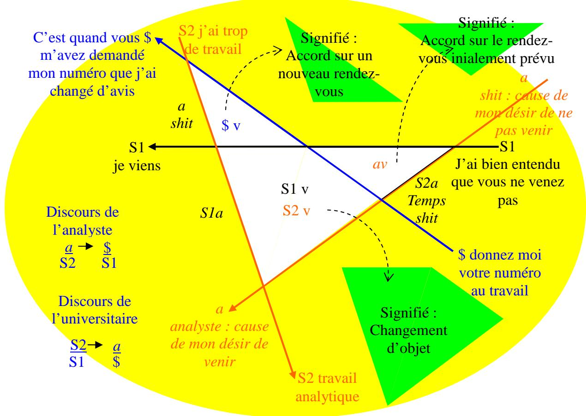

Ce discours n’est pas attente d’un troisième qui l’achèverait : il y est déjà. C’est un discours tout cuit, un discours complet, dans lequel l’universitaire ne fait que répéter le savoir qu’il a appris. C’est pourquoi il n’attend pas sa validation par l’étudiant, c’est au contraire l’étudiant qui attend la validation de son examen. Je n’ajoute rien, sauf la mention du S1v en position de vérité dans le trou, la vérité du signifiant maître qui avait engendré tout ce cycle. Impossible à distinguer du trou précédent S2v, le savoir en position de vérité, il ne fait que confirmer cette consécration du savoir en place de vérité. Il n’y a pas de détachement d’une nouvelle surface, donc pas de production de signifié nouveau.

Ce pourrait être la façon universitaire de se sortir de l’analyse : aller dans les universités ou dans les écoles de psychanalyse pour répéter ce qu’on appris de sa cure. Mais il y a une autre façon d’envisager la question, en remarquant que cette dernière paire ordonnée S2a amorce une nouvelle coupure dans la zone désorientée du réel. Elle est, là, comme précédemment, en attente d’une troisième coupure, en attente d’un nouveau S1 qui recommencerait un cycle de 4 discours entièrement nouveau, même s’il se base sur les acquis du cycle précédent :

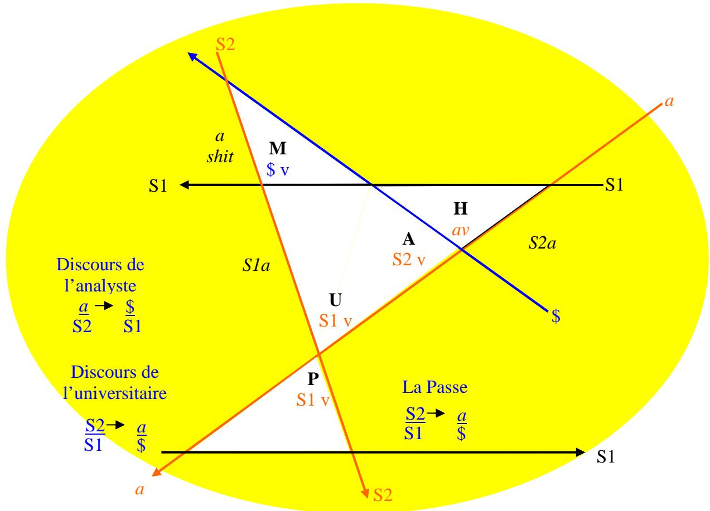

Ce serait la continuation de l’analyse après l’analyse telle que Freud l’appelait de ses vœux dans « Analyse finie et infinie ». Là se dévoilerait une nouvelle vérité avec l’apparition d’un signifiant nouveau, l’invention de ce S1. Ici, ce S1, c’est l’invention de ce nouveau graphe. Alors ce S1 croiserait le \$ déjà là un peu plus loin, achevant un nouveau discours du maître par une nouvelle interpellation du sujet, toujours le même cette fois-ci mais qui prend une nouvelle ampleur, si l’on, en juge à la taille du trou nouvellement découpé :

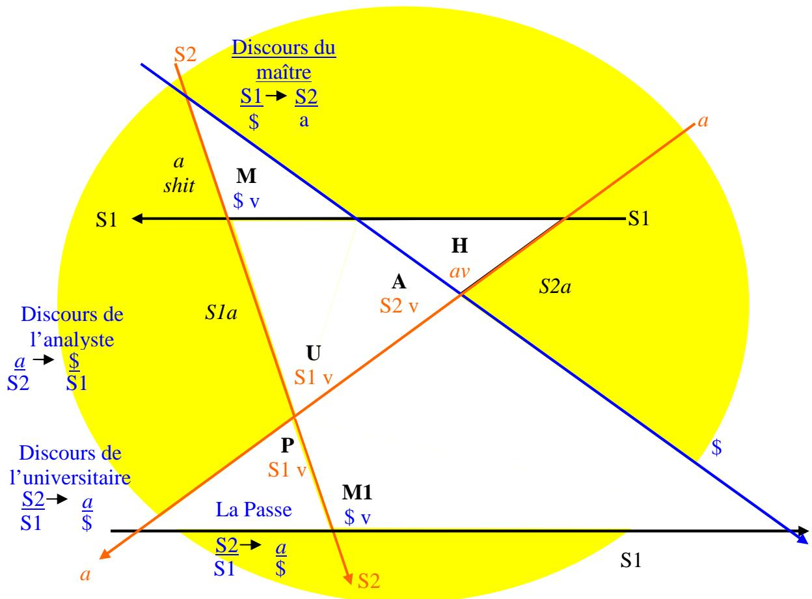

Et il n’est pas besoin d’être grand clerc pour saisir comment la suite, moyennant régulièrement un nouveau S1 et un nouveau signifiant pour l’objet a (mais toujours le même sujet, toujours le même savoir), va se développer selon la logique d’une fractale, agrandissant sans cesse le trou de la vérité, sans que la logique du savoir n’en soit affectée :

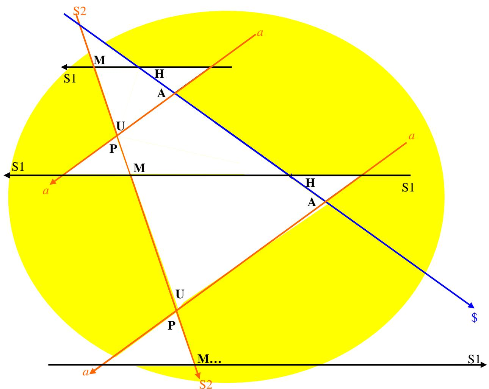

On peut y lire, comme sur le tore, la succession des « a » comme le défilé des objets de la demande entourant d’un cercle insu l’objet cause du désir, qui, comme sur le graphe cidessus restera dans le trou de désorientation externe, en jaune. La succession des S1 se repère alors dans le tracé même du tore, la surface de ce dernier étant engendrée par le produit S1. a.

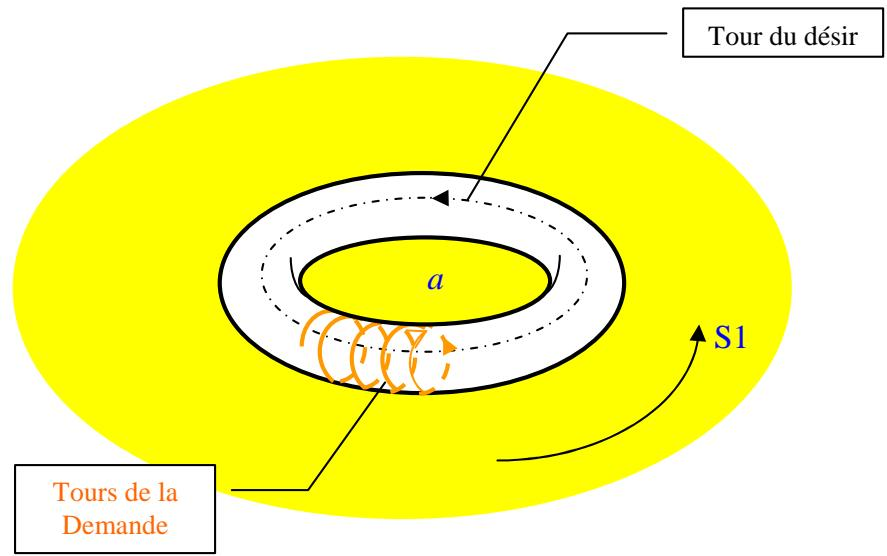  
Voyons à présent ce qu’il en est de cette écriture dans sa version borroméenne :

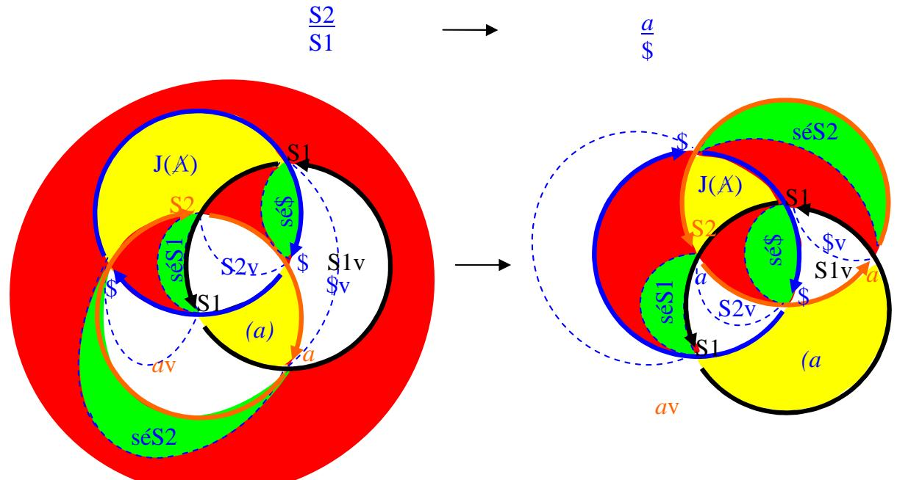

La zone mise à l’extérieur lors du premier retournement de ce discours, est, pour la première fois, non pas un réel mais un signifié : on peut dire que c’est à cette étape que se construit une réalité, dont on voit qu’elle se base essentiellement sur l’accord avec l’autre, qui a été conclu dans un laborieux travail en quatre étapes. En conséquence, la vérité sur l’objet, av, tombe dans le trou lors du retournement suivant : elle s’avère n’être autre chose qu’un vide. Dans ce dernier résonne l’énonciation, seul moyen d’obtenir cet accord contribuant à la construction de la réalité.

Je n’ai plus besoin de rajouter les éléments de conversation avec mon analysant, puisque ce discours est celui que je tiens ici même, et non avec lui. Il s’agit d’un discours de théorisation. Le particulier s’efface devant une formule abstraite à forme mathématique, susceptible de généralisation et de transmission.

L’avantage de cette écriture, c’est qu’elle prend le parti de la Passe contre le discours universitaire. Autant la structure du mouvement des ronds répète celui du discours du maître, autant le mouvement de surfaces qui s’en suit est différent. Nous avons à l’extérieur, non plus l’extension du réel, mais une zone de réalité bien circonscrite (en vert à gauche), s’opposant au vide de l’énonciation comme tel (à droite). Et le suite, sera-t-elle contrainte de répéter toujours le même discours ? Que nenni ! Comme dans l’écriture des coupures rectilignes, la suite de ces mouvements peut se développer à l’infini sur une portée, qui, certes répète la structure, mais, la répétant, ne cesse de parcourir de nouvelles zones de la surface d’accueil.

Si on a pris le soin de poser des lignes de repères dans la page, et si on a bien respecté les déplacements successifs des ronds, on peut constater un mouvement de continuelle ascension :

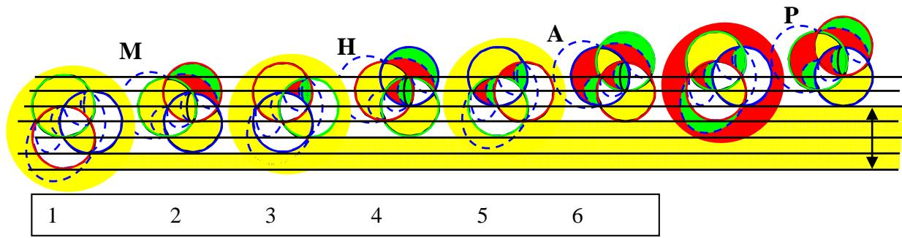

Comme par hasard, c’est après quatre discours qu’on est monté de quatre degrés dans l’échelle des objets perdus…

## Vérité de l’écriture, vérité du transfert

Confrontons ces écritures topologique aux schémas que Lacan amène dans « l’Acte psychanalytique », et d’abord celui de la séance du 6/12/67 :

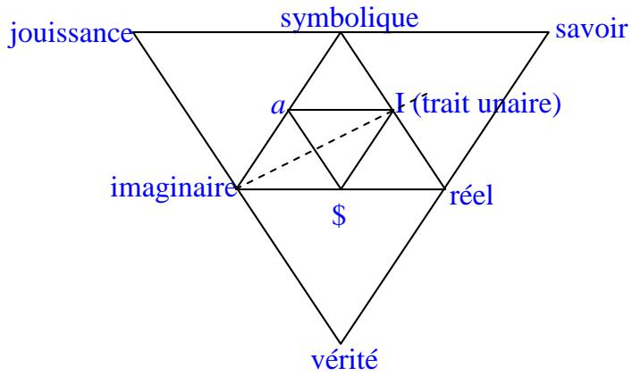

Ce schéma n’est pas une écriture topologique au sens où chaque élément est représenté par un point : du point de vue topologique, cela voudrait dire que la jouissance, le savoir, et la vérité, c’est la même chose, puisque sa représentation est identique. En revanche, mon écriture topologique distingue :

\- le savoir comme surface orientée, verte.

La vérité comme la trouure qui oriente, blanche.

La jouissance comme surface désorientée, jaune.

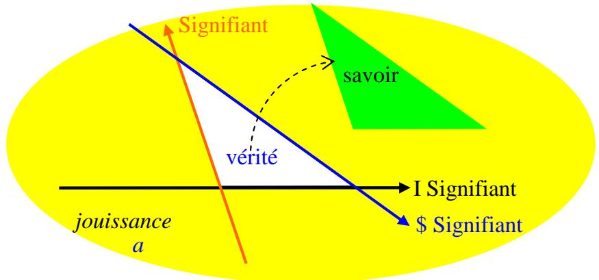

Vous remarquez qu’à ce moment de l’histoire, la vérité n’est pas dévoilée comme contenu. Elle ne se présente que sous cette forme du trou, comme l’inverse de l’objet a cause du désir et qui pour l’instant reste non-dit : c’est l’envers du trou dans cette zone située au niveau du croisement des deux signifiants du discours du maître, entre S1 et S2. Ce non-dit implique une désorientation, conforme à cette écriture par une zone de surface désorientée car infinie.

A l’achèvement de l’histoire et en référence à ce schéma de Lacan, je propose cette

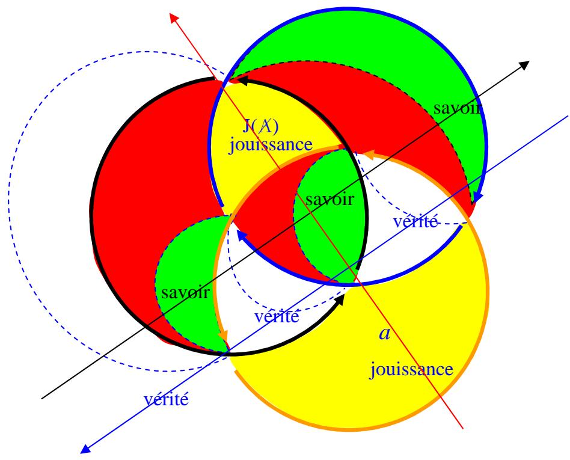

…dans laquelle on peut lire le rapport nodal qui se tisse entre la vérité et l’objet supposé apporter la jouissance, avec en prime, le savoir.

Entre celle de Lacan et celle que je propose, on peut mesurer la distance qui sépare un schéma d’une écriture topologique. Dans les triangles de Lacan, ce qui est mis en lumière ce sont les rapports entre des concepts ; dans le noeud ci-dessus, c’est l’écriture elle-même qui différencie les concepts. Chez Lacan, jouissance, savoir et vérité sont les trois sommets d’un triangle : il n’y a pas de différence au niveau de l’écriture. Un sommet ne présente pas de différence de nature avec un autre sommet ; l’un vaut l’autre. Seule leur nomination permet la distinction : c’est un apport extérieur à l’écriture du schéma. Mon nœud borroméen au contraire permet de lire d’emblée, sans qu’il soit besoin de nomination extérieure, la différence entre surface et trou, entre bord et surface, et entre surface orientées (rouge et vertes) et surface désorientées (jaunes). Bien sûr, il faut quand même ajouter et argumenter en quoi la vérité est dans le trou, le savoir dans la surface orientée et la jouissance dans la surface désorientée. C’est l’objet du présent écrit.

Nous sommes en accord avec la théorie lacanienne : ce qui est la production du discours du maître, a, devient la vérité du discours de l’hystérique (du sujet), puis s’avère, au discours de l’analyste, un signifiant, puisque quelque chose se dit de la vérité de ce qui au discours du maître, S2, était mensonge (j’ai trop de travail). C’est un signifiant qui dévoile l’objet cause du désir. Ici, il est encore un peu voilé sous l’objet de la demande, le shit, puis l’analyste. Mais la volte face indique bien le peu d’importance de cet objet, guidé en sousmain par l’objet cause du désir, l’objet a, dont on ne pourra en effet parler qu’en termes d’objet demandable.

Un petit passage par la bande de Mœbius hétérogène permet de s’en rendre compte :

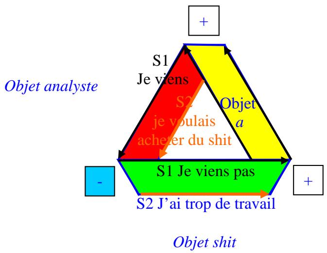

Le discours de l’universitaire, qui dans la théorie lacanienne des 4 discours, suit le discours de l’analyste, ne nécessite aucune coupure supplémentaire : toutes les coupures sont là, ainsi que les recoupes. Il suffit de les parcourir à nouveau, ce que je fais en produisant cet écrit. C’est pour cela qu’à cette nomination de « discours de l’universitaire » je préfère celle de « discours de la passe ». Je considère en effet que cette pratique, inventée par Lacan pour connaître un peu mieux ce qui se passe en fin d’analyse, c’est celle qui consiste à faire passer à un public ce qu’on a appris de la psychanalyse en tant que pratique. Pour un analysant, il s’agit d’un premier pas à l’extérieur permettant de témoigner à quelques autres de ce savoir qu’il a acquis du fait de la production des trous de la vérité. Pour un analyste, c’est là où il redevient analysant pour analyser, pour quelques autres, ce qu’il en est de son implication dans sa pratique.

La passe n’est donc pas pour moi une épreuve, un rite de passage du divan au fauteuil, mais un témoignage constamment renouvelé de ce que l’analyste ne s’en tient pas à un dogme, mais qu’il ne cesse de remettre en question son savoir au feu de la vérité.

Ce n’est évidemment pas tout le parcours d’une analyse qui est décrit dans les 4 minutes de ces deux entretiens téléphoniques, et en même temps, si, c’est cela. Les 3 premiers discours ne cessent de se répéter, sans doute parce qu’il y manque le 4<sup>ème</sup>, la passe, qui signerait la vérité du discours de l’analyste. D’une manière générale, il peut arriver et il arrive souvent, que seuls les deux premiers discours se répètent jusqu’à ce qu’il y ait passage au 3<sup>ème,</sup> puis au 4<sup>ème</sup>.

En témoigne cette petite suite qui se déroule immédiatement après, et dans laquelle la même problématique « qui est le maître ? » se représente.

## Qui est le maître ?

Mon analysant a loupé sa séance de jeudi. Il a confondu samedi et jeudi, dit-il… je lui avais dit que je serais absent samedi et c’est pour cela que je le faisais venir lundi à la place. Donc il est venu lundi et… pas jeudi comme d’habitude, mais samedi, où je n’étais pas là.

Le mardi suivant, il me téléphone : il ne va pas bien il aimerait bien une séance supplémentaire aujourd’hui ou demain. Malheureusement mon emploi du temps rend la chose impossible. Je ne peux que lui demander d’attendre sa séance habituelle du jeudi.

A cette séance, je l’interroge : eh bien et la séance de jeudi dernier, où vous n’êtes pas venu ? Ah mais vous m’aviez dit que vous étiez absent, par contre samedi, j’étais là, et je me suis heurté à porte close. Ah mais, je réplique, vous avez confondu : c’était samedi que je ne devais pas être là. Jeudi j’étais là comme d’habitude et je vous attendais. Et qui me dit, répond-il que ce n’est pas vous qui vous êtes trompé ? En vous disant que j’étais absent jeudi, répliquais-je, je veux bien en admettre l’hypothèse, mais jeudi, tous mes analysants étaient là, sauf vous, et samedi, vous êtes le seul à vous être présenté.

J’avoue que je suis un peu déstabilisé, à ce moment là, par son aplomb ; je connais un peu l’inconscient, quand même, et je conçois que ce genre de chose puisse être possible. Néanmoins, dans cette affaire, je ne pense pas avoir pu faire une telle confusion.

Lui non plus. Alors ?

Qui dit la vérité ? Comment savoir la vérité ? Toute la contradiction est là, dans les termes : il s’agit de transformer la vérité en savoir, car, pour chacun d’entre nous, il nous semble que nous disons la vérité. Mais comme le discours de l’autre ne confirme pas cette vérité, ça ne fait pas savoir. Ça ne construit pas de réalité. Je maintiens malgré tout mon point de vue, avec néanmoins un doute intérieur.

Il se met alors à parler. Il fait le bilan de son analyse. En 7 ans dit-il, je suis comme celui de la blague, arrivé à l’état de celui qui faisait pipi au lit et qui en définitive fait toujours pipi au lit, mais s’en fout. Moi, ajoute-t-il, j’étais bordélique et je passais mon temps à essayer de l’être moins. Maintenant je m’en fous. Je passais mon temps à fumer du shit et à essayer de m’arrêter. Maintenant je m’en fous, je fume tant et plus ; je n’arrivais pas à avoir de femme. Je n’ai toujours pas de femme mais je m’en fous. En êtes-vous bien sûr? Conclue-je.

Il développe encore un moment ses affirmations puis me déclare soudain, au milieu d’une phrase : là, je sens que vous allez conclure la séance là-dessus. Si vous faites ça, je vous fous mon poing dans la gueule.

Je ne le fais donc pas. Je le laisse continuer un bon moment. Malgré ce bilan qu’il a présenté comme positif, il n’est pas bien. Il ne comprend pas pourquoi et se demande si son analyse va durer encore longtemps. Il évoque cette image : c’est comme si j’étais dans un puit accroché à une corde ; …mais la corde descend ; pour m’en sortir, je sais que je dois lâcher la corde, mais voilà, je ne peux pas lâcher. Maintenant que j’ai bien démailloté le truc… démailloter ? J’interromps, car je me rappelle, et je lui rappelle, une scène de son enfance, qu’il m’a racontée il y a des années, et sur laquelle il est revenu souvent : sur la plage, sa mère le débarrasse de son maillot de bain, alors qu’il ne veut pas. Tout nu devant tout le monde, il court après sa mère en pleurant, réclamant son maillot. Enfin je mets un terme à la séance. Et là sa réaction est immédiate : eh bien moi, je ne pars pas d’ici. Je reste. Et il s’allonge sur le divan (peu auparavant, il s’était relevé pour parler, comme il le fait parfois).

Alors je pique ma colère. Oh, je reste assez soft dans mon attitude, mon ton de voix et mes propos : je suis comme ça. Mais affectivement ça y est, dans la colère, j’y suis. Je lui réplique : vous vous rendez compte de ce que vous faites ? Vous êtes en train de vous comporter comme un enfant de 3 ans. Vous ne voulez pas lâcher. Allez, à samedi, et je lui tends une main impérative.

Il insiste, et je devrai renouveler au moins trois fois mon invitation. Dans notre échange, il reconnaît le caractère phallique de la corde à laquelle il s’accroche dans le puit. Il part enfin en maugréant : c’est une torture.

Mais à la séance d’après, tout va mieux. Ça se passe de façon très détendue. Il me dit en entrant en séance : vous me faites penser à mon père, tout d’un coup ; et puis il me dit comment il a compris le titre de Kundera « l’insoutenable légèreté de l’être ». Il se voyait (je ne sais plus si c’est en rêve ou en rêverie éveillée) arriver chez lui, marchant dans la rue, heureux, léger... et c’était insoutenable. Il a compris qu’avec la lourdeur, la douleur, il sentait son corps. Il ajoute : je n’ai pas d’odorat, alors je ne sens rien. Avec la douleur, quand j’ai bien fumé du shit et que je suis mal, eh bien ça me fait sentir mon corps ; de plus, d’avoir traversé une maladie aussi grave ça m’a donné un statut de superman, et maintenant il faut que je sois à la hauteur. C’est trop lourd à porter.

Il conclue en disant : je suis ici pour ma santé, pour me sauver.

Qu’en est-il de tout cela ? Ce que je raconte là, c’est la lutte de deux maîtres. D’abord le mensonge sur le trop de travail est une manière de garder la main en décidant des rendez-vous à la place de la règle établie entre nous. Ensuite, l’acte manqué de la séance manquée continue dans le même registre. Enfin le refus d’accepter le terme de la séance est du même tonneau : conserver l’acte de coupure par devers soi au lieu d’en faire une continuité qui amène l’autre à valider le discours par une reprise du S1 de la position d’agent à celle du savoir obtenu en position d’autre. Dans cette structure, j’y suis autant que lui, bien entendu.

J’y suis tant que je résiste, c'est-à-dire, que je cherche à opposer ma maîtrise à la sienne, ce qui est parfois nécessaire, ne serait-ce que pour des raisons pratiques : une séance ne peut pas être déplacée aussi facilement qu’on veut, sa fin ne peut être éternellement différée : il y a d’autres analysants !

Seulement, lors du coup de fil analysé aux chapitres précédents, je ne résiste pas. Il en est de même lorsque j’admets devant lui l’hypothèse que l’acte manqué puisse être le mien et non le sien ; par contre, lorsque je mets fin à la séance de façon impérative, je conserve la maîtrise.

Et le discours de l’analyste ? C’est celui qui se produit de ce dispositif, dans le silence auquel je laisse une large place, néanmoins. Ça lui permettra de tenir un discours d’analysant, c'est-à-dire de prendre à son tour le discours du sujet (dit « de l’hystérique »).

D’avoir repéré dans la structure la place de la vérité comme celle du trou donne un certain éclairage à l’image de mon analysant dans le puit, accroché à une corde qui descend inexorablement. Dans le puit, il se sent tomber vers la vérité, et il se raccroche à la corde phallique du savoir. Dans les séances qui suivront il analysera comment en effet il fait beaucoup de théorie. Oh, pas de la théorie analytique, avec laquelle il n’entretient aucun rapport, mais une façon de parler universalisante. Il parle beaucoup et aime séduire les femmes, ou plutôt, les mettre en difficulté par ses remarques. Il s’agi de pousser le bouchon jusqu’à atteindre une espèce d’euphorie. Il repère ainsi que ce qu’il ne fait pas avec son phallus, il le fait avec sa bouche. Quand, face à son discours incessant et habile, une femme baisse les bras, il est content. C’est comme ça qu’il en jouit, d’une femme.

## L’acte analytique : un renversement de point de vue. Une discussion avec Lacan

Le point de vue analytique part toujours d’un renversement de point de vue. Lacan en parle ainsi par exemple dans le début du séminaire sur « l’acte » (22/ 11/ 67) : il repère qu’un de ses contradicteurs, pourtant analyste, s’étonne de ce qu’il ait parlé, lui, Lacan d’un « malade », alors que, s’étonne ce contradicteur, Lacan s’appuie quand même d’habitude sur la structure du langage. Lacan, lisant cela, s’étonne aussi : « ce n’est pas ma manière, en effet », dit-il (de parler du « malade »). Cependant il s’interroge : après tout, ça a pu lui échapper, il feuillette ses « Ecrits » et trouve le passage en question. Le mot malade y est en effet, mais… dans une citation que fait Lacan d’un autre auteur, et c’est donc un propos d’Abraham. Voilà, dit Lacan ce qu’est un acte analytique, ce qu’il vient de faire pour le public du séminaire : bien resituer le sujet de l’énonciation. On ne va pas s’interroger sur les motifs de « l’erreur » du contradicteur de Lacan qui a pris ce mot dans les « Ecrits » et qui a cru, comme les « Ecrits » sont de Lacan, que ce propos était de Lacan. On ne va pas demander si cette erreur est due à sa névrose, à sa psychose ou à sa perversion.

Non, on opère seulement cette opération topologique qui s’appelle un retournement et qui consiste à revenir au sujet de l’énonciation, à ne pas se tromper sur le sujet de l’énonciation. Et ça, en effet, c’est s’appuyer sur la structure du langage, que Lacan réaffirme là pour l’occasion, et non sur une quelconque pathologie, ce qu’il énonce d’ailleurs explicitement au passage.

Car le dit contradicteur ne fait pas que se tromper de sujet de l’énonciation, il affirme, et j’en profite pour citer l’ensemble du passage de cette leçon du 22/ 11/ 67 :

« ... « C'est ce contexte intersubjectif écrit-on, qui me paraît original dans l'analyse, il fait éclater les camisoles de force des diagnostics dits " d'affection mentale ", non pas que la psychopathologie soit un vain mot, elle est à coup sûr indispensable pour l'échange entre individus hors de l'expérience, mais son sens s'évanouit pendant la cure ». Vous voyez le ton à ceci près que entre " non pas que la psychopathologie soit un vain mot ", et " elle est à coup sûr indispensable ", une parenthèse éclate dont je vous demande ce qui la justifie là.

« A ce propos en relisant un Écrit de Lacan, j'ai été étonné de voir qu'il parlait du malade, lui qui s'oriente vers le langage avant tout " . .

« C'est dans mon propos vous allez voir ; je dois dire que je ne sais pas dans lequel de mes Écrits je parle du malade, ce n'est en effet pas tout à fait ma façon.

« Je n'y verrais pas en tous les cas d'objection, mais l'idée de refeuilleter les 950 pages de mes Écrits pour savoir où je parle du malade ne me serait assurément pas venue.

« A la page 70 par contre, je trouve : « le désir », désir de ce qu'on n'est pas, désir qui ne peut pas être satisfait, ou même désir d'insatisfaction tel que Lacan, Lacan dans le même écrit cité... (Ah soulagement, nous allons pouvoir aller voir)... dans le même écrit cité le présente lestement à propos de la bouchère; et il y a une petite note (ce que je dis de la bouchère, qui est assez connu, car c'est un morceau plutôt brillant, on pourrait s'attendre que ce soit à ça qu'on renvoie, pas du tout, on renvoie à la bouchère dans Freud). Bon à moi ça me sert. Je peux aller chercher non pas le passage de la bouchère que vous trouverez page 620, mais ce dont il s'agit :

...« Cette théorie, (je prends la seconde théorie du transfert) à quelque point de ravalement qu'elle soit venue ces derniers temps en France, - il s'agit de la relation d'objet, et comme je m'explique, il s'agit de Maurice Bouvet)- a, comme le génétisme, son origine noble ». C'est Abraham qui en a ouvert le registre, la notion d'objet partiel est sa contribution originale. Ce n'est pas ici le lieu d'en démontrer la valeur. Nous sommes plus intéressés à en indiquer la liaison à la partialité de l'aspect qu'Abraham détache du transfert pour le promouvoir dans son opacité comme la capacité d'aimer, comme si c'était là, cette (capacité d'aimer), une donnée constitutionnelle chez le malade où puisse se lire le degré de sa curabilité ... »

Je vous passe la suite, ce « chez le malade » est donc mis à l'actif d'Abraham » ».

L’avalanche de citations dans la citation ne facilite pas la tâche. Ça tombe bien c’est exactement le problème qui est en cause. La forme même du propos renvoie à son contenu : citer pour démontrer à quel point la citation, au-delà de la forme, représente un problème, celui du contenu même du propos. C’est pourquoi, après avoir, dans mes études, appris à reconnaître la nécessité d’un bon usage de guillemets et des nominations de l’auteur, après m’être formé par des années de travail analytique, en prenant soin de bien noter, toujours à travers des guillemets, ce qui venait de moi et ce que j‘avais entendu de l’autre, j’ai fini par choisir de laisser tomber tout guillemet, assumant en mon nom propre tout ce qui se dit. Car il est indéniable que ce que je dis, même quand je dis que je cite l’autre, c’est moi qui le dis. Je le reprends en mon nom propre, non pas pour dire : c’est moi qui l’ai dit, mais en disant bien qui l’a dit et en prenant en compte cette nuance fondamentale : ce n’est que ce que je vous dis de ce que je crois avoir retenu de ce que je crois avoir entendu. La mémoire est passée par là, consciente et inconsciente, comme processus dynamique ; et avant elle, l’écoute, avec ce qu’elle comporte de résistances de l’analyste.

Voilà ma façon de rendre compte de l’acte analytique de la façon dont Lacan luimême en donne la démonstration. Sa démonstration est magistrale, et dans sa vérité : son contradicteur s’est en effet trompé de sujet de l’énonciation, et dans son erreur : Lacan a bien dit « le malade » dans un autre passage des « Ecrits », comme on va le voir immédiatement ciaprès. Sans doute peut-on dire que, si la distorsion de lecture a joué pour son contradicteur, c’est la distorsion de la mémoire qui joue pour Lacan lui-même.

## Il dit un peu plus loin, pour compléter son analyse du propos de ce contradicteur

« Ne voila-t-il pas touché le fait qu'il est singulier qu'on soit reconnaissant, par cette erreur évidemment, sinon par la référence irrépressible à mon nom, même si on le met sous la rubrique de je ne sais quel achoppement incompréhensible de la part de quelqu'un qui parle du langage avant tout, comme il s'exprime, est-ce qu'il n'y a pas là quelque chose qui nous fait nous interroger? Sur quoi ? Sur ce qu'il en est de ceci qu'au regard d'une certaine analyse, d'un certain champ de l'analyse, qu'on ne puisse, même à s'appuyer expressément sur ce que j'avance, le faire qu'à condition de le renier, dirai-je ».

Voilà : cette personne, qu’il cite, s’appuie sur lui, Lacan, en soulignant ce qu’il en est de l’avancée de Lacan, qui est en effet de briser « la camisole de force de diagnostics », de « laisser tomber la psychopathologie », etc.… mais c’est pour le renier aussitôt :

" non pas que la psychopathologie soit un vain mot ", et " elle est à coup sûr indispensable ",

Ce que Lacan dénonce avec la même promptitude :

« …une parenthèse éclate dont je vous demande ce qui la justifie là ».

Bien sûr, rien n’est simple, et je conçois qu’on puisse lire ce compte rendu du séminaire autrement que moi, par exemple en lisant dans la phrase ci-dessus le contraire de ce que j’y lis, soit : que, si, si Lacan est en train de dire que, si la parenthèse ne se justifie pas, c’est que la psychopathologie est tout à fait justifiée. Et, de fait, Lacan a bel et bien justifié la psychopathologie en se préoccupant pas mal de diagnostic, ce qu’il dément ici : comme quoi lui-même ne s’appuie sur ce qu’il avance qu’à la condition de se renier.

C’est souvent ça quand on lit Lacan, l’ambiguïté de ses propos permet volontiers les doubles lectures… et disant cela, je m’appuie bien, comme lui, sur le langage, et c’est l’ensemble de l’œuvre que je considère comme le contexte qui me permet de lier comme je le fais ce qui a été écrit de ce qu’il a dit (je n’oublie pas que c’est d’un séminaire parlé et retranscris que je parle); en reconnaissant qu’il y a des passages ponctuels dans son œuvre, qui, si on les prends comme référence contextuelle, permettraient l’autre interprétation.

En se contentant du contexte de ce seul passage, il me semble que Lacan, en resituant l’accent sur le sujet de l’énonciation (comme acte analytique par excellence), à propos de cette question précise de parler des gens comme des malades, eh bien, il fait d’une pierre deux coups : en traitant les gens de malades, ce qu’il affirme qu’il ne fait pas, on se trompe à coup sûr de sujet de l’énonciation, car en général - et ça nous ramène au propos de départ sur la psychose – dans le domaine, disons, des difficultés relationnelles, le malade, c’est toujours l’autre. N’avez-vous jamais dit : « non mais, il est malade, l’autre! » Rassurez vous, je l’ai dit aussi : personne n’y échappe.

Et Lacan le premier, car cette petite démonstration sur laquelle Lacan vient d’appuyer son propos est démentie par un passage de la page 534 des Ecrits :

« Nous illustrerons ce qui vient d'être énoncé par un phénomène détaché d'une de nos présentations cliniques de l'année 1955-56, soit l'année même du séminaire dont nous évoquons ici le travail. Disons que semblable trouvaille ne peut être que le prix d'une soumission entière, même si elle est avertie, aux positions proprement subjectives du malade, positions qu'on force trop souvent à les réduire dans le dialogue au processus morbide, renforçant alors la difficulté de les pénétrer d'une réticence provoquée non sans fondement chez le sujet. (…)

Cet homme, donc partie dans la situation à un titre indirect, et figure au reste assez effacée dans les allégations de la malade, avait à l'entendre, lancé à son adresse en la croisant dans le couloir de l'immeuble, le terme malsonnant de : « Truie ! » »

Certes voilà Lacan démenti par lui-même sur ce point particulier du terme « malade ». Mais si on lit bien cette citation, que dit-il ? Que ce qu’il a fait, pour obtenir cette savoureuse vignette clinique, c’est de se soumettre entièrement «aux positions proprement subjectives du malade », dénonçant le fait qu’on réduise trop souvent le dialogue au processus morbide. Autrement dit, soit on parle au sujet, soit on parle au malade, c'est-à-dire à celui qui est porteur du « processus morbide ». Et dans ce dernier cas, on en fait un « cas » en ne s’adressant qu’à ce qu’on a reconnu de malade en lui. Donc, tout en employant le terme convenu de « malade », sans doute par habitude de médecin, Lacan enfonce le clou d’une pratique qui se démarque radicalement de la position médicale.

Mais revenons à la bonne foi de Lacan, dont nous venons de voir que nous pouvons l’admettre dans sa vérité plus que dans sa lettre, lorsqu’il démontre qu’il n’a jamais dit « le malade ». L’erreur sur le sujet de l’énonciation, telle qu’il la découvre, cette erreur à l’avantage de nous dire quelque chose de la vérité, comme toujours. C’est ce sur quoi Lacan embraye dans la suite de cette leçon du 22/11/67, en citant le Freud de « Psychopathologie de la vie quotidienne ». Dans le passage de cet ouvrage cité ici par Lacan Freud s’interroge sur les erreurs qu’il a commises dans la rédaction de la « Traumdeutung ». Il souligne qu’à chaque réédition, relisant l’ouvrage, les erreurs lui ont à chaque fois échappées. Et, les repérant enfin, il se rend compte que, chaque fois, elles dissimulent une vérité. Quelle vérité ? Une vérité sur lui-même, Freud. L’erreur portait à chaque fois sur un savoir qu’il savait savoir, une partie de sa culture germano-gréco-latine qu’en bon élève et en passionné du savoir, il connaissait avec certitude. Mais chaque erreur le renvoie à une jalousie ou une haine, c'est-à- dire à des sentiments qu’on a toujours du mal à reconnaître en soi.

Ce sont ces sentiments personnels qui lui ont fait commettre des erreurs là où il n’y avait aucune chance qu’il les commette. Nous retrouvons là ce que je disais de la mémoire dynamique, c'est-à-dire du savoir tel qu’il peut être tordu par la vérité.

Donc si psychopathologie il y a, c’est celle de la vie quotidienne. Et elle n’a rien à voir avec celle de l’hôpital psychiatrique.

Continuant à glisser sur cette pente, au fil des séances de « L’Acte », Lacan s’attarde sur la notion de « faux self », qu’on doit à Winnicott :

6/12/67 : « Derrière ce faux-sens attend quoi ? Le vrai pour repartir. Qui ne voit déjà que nous avons dans la théorie analytique ce Real Ich, ce Lust Ich, cet ego, ce id, toutes ces références déjà assez articulées pour définir notre champ, que l’adjonction de ce self ne représente rien d’autre que comme c’est avoué dans le texte avec false et true, la vérité ? mais qui ne voit aussi bien qu’il n’y a d’autre true-self derrière situation, que M.Winnicott luimême, qui là se pose comme présence de la vérité. »

Retour de Lacan à Freud, qui s’interroge sur ses erreurs. Retour de Lacan sur luimême qui cherche dans ses propres écrits ce qu’il a pu dire lui-même au-delà d’une erreur de citation commise par un autre, mais commettant lui-même de ce fait un erreur de mémoire. Retour du faux sur le vrai en la promotion du concept de self, qui ne peut renvoyer à rien d’autre qu’à son promoteur, Winnicott.

Lacan ne cesse de nous pointer la vérité là où elle se trouve : dans le trou de l’énonciation du sujet, lorsqu’il croit énoncer un savoir, mais aussi bien lorsqu’il parle de luimême. Cependant, c’est dans la deuxième formule, parler de lui-même, qu’il pourra, au-delà des savoirs, s’affronter à sa vérité.

Le problème, quand même, c’est que celui qui en parle le plus de lui-même, dans tous ces exemples, c’est quand même Freud. Raison de plus pour pratiquer encore plus avant le retour à Freud prôné par Lacan : en parlant de soi.

## Développements aquatiques

Alors je vais donc me mouiller un peu et y aller de mon « parler de moi ». Bien sûr, c’est ce que je ne cesse de faire depuis le début de cet écrit, comme dans une bonne partie de ceux que j’ai déjà commis.

Rêve :

Je suis dans un train qui arrive en gare. Avant l’arrêt, je m’engage dans la porte ouverte du wagon, me tenant à la main courante verticale qui longe le bord de la porte. Le train va entrer en gare, c'est-à-dire passer sous un porche assez étroit : je risque d’être écrabouillé vu que la dimension de mon corps excède celle du train. Il faut donc que je saute au plus vite, mais mon bras est très engagé dans le trou de la main courante, d’autant que ma manche retroussée fait un bourrelet qui m’empêche de me dégager. J’ai très peur et d’ailleurs au passage je vois le visage très large de la conductrice du train qui me lance un regard narquois genre : bien fait pour toi ! Enfin, je saute, sans dommage.

Un peu plus tard je m’aperçois que j’ai oublié mon petit sac dans le train. Je dois y retourner au plus vite. Alors une petite fille en robe blanche s’accroche à moi, sans cri, sans pleurs, mais dans une attitude implorante. Je sens bien qu’il faudrait que je m’occupe d’elle, mais je n’ai pas le temps, je dois d’abord aller récupérer ma bourse, c’est vital. Je choisis finalement de l’amener avec moi, car, malgré les efforts que je fais pour la décrocher, elle s’agrippe de plus belle. Pour rejoindre le train avant qu’il ne reparte, je dois, nous devons franchir un bras de mer, tumultueux, houleux, qui, curieusement, remonte la pente. Je pense un instant à le franchir en sautant sur des îlots rocheux qui en encombrent le cours. Finalement je choisis la nage ; c’est un peu dangereux, notamment du fait de la petite fille toujours accrochée à moi, mais j’y arrive.

Me revoilà sur le quai. Des gens montent dans le train, il va repartir. Je dois donc me dépêcher. Je ne reconnais pas mon wagon. Il y a une porte curieuse dans le sens de la marche qui s’ouvre en deux moitiés (je pense aux grandes lèvres d’une vulve) mais ce n’était pas là. Je redescends. Enfin je retrouve mon wagon. Je monte vite dans mon compartiment et je retrouve en effet ma bourse. Je dois redescendre très vite sinon je suis bon pour la prochaine gare, et voyage de retour. Je dois encore m’habiller. Mes vêtements sont par terre devant moi, je n’arrive pas enfiler les jambes de mon caleçon de velours noir. Je trébuche, j’essaie plusieurs fois… en me disant que si j’arrive au moins à mettre le caleçon je pourrais mettre le reste sur le quai. C’est très angoissant et je me réveille.

Après nouvel endormissement :

Je nage dans une piscine dont l’eau est totalement emprisonnée dans un immense sac plastique transparent. On a l’impression qu’il y a de l’eau mais en fait, je nage en glissant à la surface du plastique. On a mis quelque chose de lubrifiant qui fait que, en agitant bras et jambes comme si je nageais, je glisse très vite au bout ;

Tout ça en présence de l’analysant dont je parle depuis le début de cet écrit. Je ne

Pour simplifier, j’aurais pu me contenter, du récit de ce dernier rêve, puisque lui seul fait référence à mon analysant. Pourtant, le premier rêve donne un bon éclairage a posteriori sur la façon dont il faut interpréter le second. Que dit ce premier rêve alors ?

Il parle de castration.

Cette position de mon corps dans l’ouverture d’un train en marche me rappelle un article que j’avais lu alors que j’étais très jeune, qui racontait comment un jeune garçon, se tenant de la même façon que moi sur le bord d’un train en marche, s’était fait couper net un bras au moment de l’entrée dans un tunnel, et comment on le lui avait recousu ! Ça m’avait fortement impressionné. Dans mon rêve, je vois arriver la gare avec cette même inquiétude, écrite d’une manière inversée par l’impossibilité de dégager mon bras de la main courante.

Par conséquent il faut tenir compte de cette inversion. Ce n’est pas un membre qui risque d’être coupé, c’est mon corps qui risque d’être écrabouillé tandis que le bras resterait intact. Dans ce sens là, la possibilité du recoudre s’avère moins facile ! Tout cela parle de la valeur phallique respective à accorder respectivement au corps et à ses membres.

Le sceptique pourrait me rétorquer : oui, et alors, ce n’est que de la coupure d’un bras dont il est question… pourquoi rapportez vous ça à la castration ? Encore vos préjugés freudiens ? C’est une bonne question. On a toujours trop tendance à s’endormir dans les habitudes interprétatives, il faut donc toujours tenter d’en sortir.

Si je rapporte ça à la castration, c’est à cause de la petite fille qui s’accroche à moi, et qui n’est autre qu’une image de moi enfant : j’aurais pu être cette petite fille, ce qui aurait supposé mon acceptation de la castration. C’est aussi à cause de cette curieuse porte de wagon qui s’ouvre comme une vulve. Là, c’est moi qui me retrouve en position d’être le phallus d’un grand corps mobile, le train. Mais comme avant de le rejoindre je dois traverser un bras (sic) de mer(e) (re-sic !), avec cette petite fille accrochée à mon cou, c’est que je dois bien me résoudre à interpréter ce train pour ce qu’il est, à savoir ma mère, celle qui m’a porté dans cette gare d’où je suis descendu dans le monde.

J’y suis descendu muni de cette angoisse de castration qui me fait dire que j’aurais bien pu oublier mes bourses à l’intérieur du train, c'est-à-dire dans le ventre de ma mère. Je dois très vite en descendre, car ma mère, venue pour un temps dans cette gare, c’en est allée. Je suis pressé d’en descendre car je ne suis pas pressé de repartir avec elle vers je ne sais quel au-delà. Le caleçon noir signe le deuil de cette affaire. Dans mon enfance, on se signalait encore d’un deuil par un ruban de velours noir porté au revers du veston. Le changement de lieu (dans une topologie du transfert) de mon rêve me signale que le deuil ne concerne pas seulement la mort, il inclut dans l’angoisse la menace de castration. J’ai bien besoin de ce deuil pour redescendre à quai, en effet, pour ne pas dévoiler aux autres la possible faille de mon entre jambes.

Si le rêve premier parle de la castration, c’est aussi bien pour donner la clef du suivant. Etre un rampant, une chose en position horizontale, qui dépasse du train d’un côté, qui surnage de l’autre dans la position horizontale, c’est bien être le phallus. Il y a dans ce second rêve la même inversion des valeurs : le phallus n’est pas un petit membre accessoire d’un grand corps, c’est le petit corps qui est devenu comme l’accessoire d‘un grand membre tout emmailloté de plastique faisant office de capote.

Si mon analysant est présent sans que je sache précisément où c’est que cette configuration spatiale me donne une écriture de ce qu’il en est de nos rapports transférentiels : ou il est mon phallus, ou je suis le sien. Ce qui n’exclut nullement la proposition discordantielle : s’il est mon phallus, alors je suis le sien. En tout cas, voilà comment nous nageons de concert.

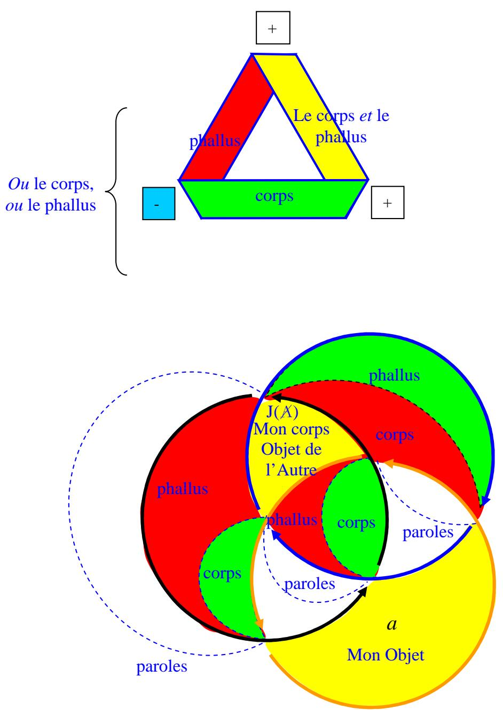

Dans la partie forclusive, (ou une face verte, conscient, ou une face rouge, inconscient), est retranscrite la lutte des deux maîtres. La partie discordantielle, au contraire fait valoir l’interchangeabilité de l’objet et des positions : c’est un lieu désorienté (jaune) qui permet cependant l’orientation dans les autres lieux. C’est l’entre deux, le moment de passage, celui de l’échange de paroles (dans les trous, en blanc dans les deux écritures) autour des objets en fait inaccessibles : l’objet a, d’une part, l’objet qui me ferait jouir si j’entrais en sa possession et la jouissance de l’Autre d’autre part, là où je m’imagine l’objet d’un Autre qui en jouit. C’est en se parlant qu’on trouve des repères à s’orienter dans sa vie.

Je ne vais pas raconter ici les épisodes par lesquels il m’a communiqué ses propres relations avec sa mère. Ce ne serait que paroles rapportées et interprétation de ma part. Il me suffit que mon inconscient me dise de quelles façons je me sens rattaché à lui. Ainsi je suis sûr de ne pas interpréter à sa place : il fait très bien ça lui-même en ce qui le concerne, ayant réussi à me dire un jour : je ne suis qu’un partie du corps de ma mère, une partie qui la fait jouir : je suis son clitoris ! À placer dans l’écriture topologique ci-dessus au lieu où « mon corps est l’objet de l’Autre ».

En cela il est freudien, Freud ayant assimilé le clitoris à une sorte de phallus de la mère. On n’a pas besoin d’être au fait de la théorie du père de la psychanalyse pour en arriver à des formulations qui semblent directement sorties de ses textes.

Je ne raconterais pas non plus comment, victime dans sa jeunesse d’une très grave maladie, il n’a dû la vie qu’à une greffe prise sur le corps de sa sœur. C’est ainsi que je m’identifie à lui dans mon rêve avec cette petite fille autour du cou, qui me permet de traverser les dangers du bras de mer. La mère comme maladie ?

Pas besoin de cela, car ce qui importe ici est la façon dont je vis cette relation, et surtout la façon dont je la vis inconsciemment. Car pour ce qui est du conscient, je n’en suis évidemment pas là. La lutte entre deux maîtres dont j’ai fait état plus haut n’est elle pas à imputer à ce registre ? Qui va accepter d’être le phallus de l’autre ? Qui va s’aligner sur la coupure (de la séance) que chacun voudrait délimiter à sa guise ? Qui va admettre que la mise en conjonction des corps pour un temps donné doit se solder de toutes façon par une coupure, et que le fait d’être celui qui en décide, du lieu et du moment, ne change rien à ce fait fondamental que nous ne serons jamais un seul corps, quoiqu’en ait rêvé le fantasme, en fonction, pour l’un comme pour l’autre, de ce qu’il s’est déjà passé avec nos mères respectives.

L’épisode que j’ai choisi d’isoler, en tant qu’il fût décisif, indique comment la coupure o-père son long cheminement, malgré la brièveté de l’échange ainsi mis en relief. Ce n’est pas une simple rupture entre un corps et un phallus, c’est toute la complexité d’un nouage de parole ne tenant ici qu’au fil du téléphone, mais, plus généralement, au fil de la parole. On le retrouve, ce fil, si on veut, dans la corde qui le maintenait au-dessus du vide du puit.

On le retrouve dans la complexité de son nouage dans le nœud borroméen dont j’ai déplié la dynamique dans les chapitres précédents.

Il se trouve que juste après cet épisode, une alerte somatique le met en émoi. Pendant sa longue maladie, il contracté l’hépatite C par transfusion sanguine à l’hôpital, à une époque où on ne savait pas encore la dépister. La maladie est donc en lui à l’état latent depuis cette date. Une échographie lui signale « un nodule » inquiétant sur le foie. Il restera suspendu à la corde de ce non savoir pendant un peu plus d’une semaine, dans l’attente d’analyse complémentaires. Celles-ci se montreront très rassurantes : le nodule n’était qu’un angiome, une malformation congénitale sans importance. Pas de cancer, pas de cirrhose en préparation.

Ceci fera cependant l’effet d’un coup de fouet : du jour au lendemain, il arrête de fumer et, bien sûr, de fumer du shit. On se rappelle qu’il s’agissait de l’objet en litige dans notre échange téléphonique. Du jour au lendemain, il se met à surveiller son alimentation, avec laquelle il faisait n’importe quoi. En quelques semaines, le voilà devenu un autre homme, envisageant l’avenir avec sérénité. Et envisageant d’une toute autre façon la coupure d’avec son analyste.
