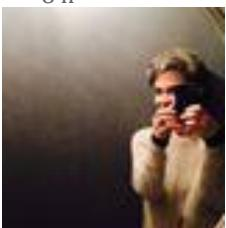
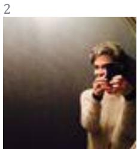
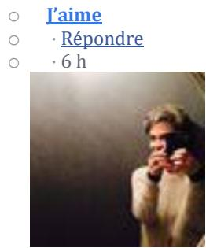
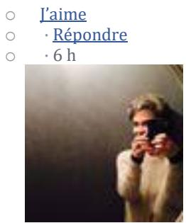
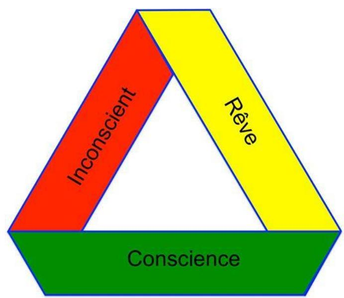
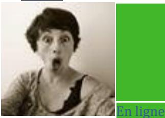
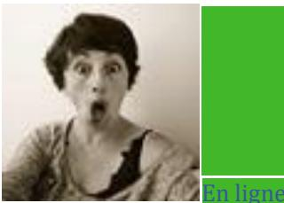

Christine Dornier Sophie Jaussi oh comment je me reconnais dans ce que tu dis... Aujourd'hui comprends la bande de mieux en mieux de jour en jour... Surtout avec mes rêves en fait

1

Supprimer ou masquer ceci

o J’aime

o · Répondre

o · 8 h

Christine Dornier Sophie Jaussi et merci de ton témoignage de te sentir nouille devant cette bande... Je me sens moins seule

1

Supprimer ou masquer ceci

o J’aime

o · Répondre

o · 8 h

Sophie Jaussi Christine : j'adore "se sentir nouille devant une bande" ( ;-) ). Plus sérieusement : merci Honnêtement, je ne vois même pas l'utilité (c'est-à-dire que je ne comprends pas ce qu'il y a à comprendre et où je pourrais en apercevoir quelque chose, ni où…Voir plus

Supprimer ou masquer ceci

2

Christine Dornier Sophie Jaussi ba centrale je pense pas pour moi... Au contraire les fois où je me suis acharnée sur une bande (�) comme toute autre théorie du dehors de moi je me suis rendu compte à posteriori qu'en fait je refoulais grave... Et pas du goulot. Nan là où la bande de Moebius me parle c'est dans mes rêves, dans cette superbe idée qu'elle porte: contradiction permanente une face et deux faces à la fois...

Sophie Jaussi "dans cette superbe idée qu'elle porte: contradiction permanente une face et deux faces à la fois..." --> Et bien je ne comprends toujours pas :-) Je ne vois absolument pas ce qui, dans mes rêves, ou dans ceux des autres quand je les lis, pourrait conceptualiser la contradiction par la représentation d'une bande. Que les rêves soient contradictoires, c'est une évidence pour toute personne qui en fait l'expérience, il me semble. Mais je ne comprends pas ce que la bande et ses torsions \*amènent\* à l'idée de contradiction. Quand je vous lis, c'est comme si je lisais : "alors là je repère une contradiction (par exemple et exemplairement chez moi: je désire cette chose et en même temps je la rejette de toute mes forces) et cette contradiction ben je peux l'expliquer avec un ruban qui se tord (bon on est pas d'accord sur combien de fois il se tord, mais en tout cas il se tord), on voit le dessus et le dessous en même temps (mais sans savoir ce qui est dessus et ce qui est dessous) et donc je peux modéliser cette contradiction". Alors attention, je me doute bien que ce n'est pas du tout ça et que ça doit amener complètement autre chose, mais chaque fois je ne vois que ça :-( :-(

Supprimer ou masquer ceci

o J’aime

o · Répondre

Sophie Jaussi Ne t'embête pas, Christine, vraiment :-) Je pense que je me heurte à un mur que je m'érige moi-même. Un jour je contournerai ou je trouverai une petite porte et tout s'éclairera. Mais je m'en voudrais de te prendre du temps pour ça, c'est à moi de faire l'effort. Je t'embrasse bien fort, en tout cas.

o J’aime

o · Répondre

o · 6 h

Christine Dornier Sophie Jaussi oh non j'écris pour moi dans l'idée qu'un autre me lise... Je n'ecrirai que sûr ma pratique et rien que ça j'aime l'idée

2

Supprimer ou masquer ceci

o J’aime

o · Répondre

Richard Abibon "alors là je repère une contradiction (par exemple et exemplairement chez moi: je désire cette chose et en même temps je la rejette de toute mes forces) et cette contradiction ben je peux l'expliquer avec un ruban qui se tord (bon on est pas d'accord sur combien de fois il se tord, mais en tout cas il se tord), on voit le dessus et le dessous en même temps (mais sans savoir ce qui est dessus et ce qui est dessous) et donc je peux modéliser cette contradiction". Alors attention, je me doute bien que ce n'est pas du tout ça et que ça doit amener complètement autre chose, mais chaque fois je ne vois que ça "

ben, c'est ça quoi. c'est l'essentiel.

2

Modifier ou supprimer

o J’aime

Sophie Jaussi Donc c'est juste une mise en espace du mot "contradiction" ? Quelque chose qui rendrait tangible et visuelle l'idée "ça arrive en même temps alors que ça dit deux choses contraires" ? Quelle différence, dans ce cas, avec une historiette comme celle du Chat de Schrödinger ?

o J’aime

o · Répondre

o · 5 h

o · Modifié

Richard Abibon aucune. ce sont deux métaphores pour la même idée.

2

o J’aime o · Répondre o · 5 h

  
Richard Abibon après , on peut un peu sophistiquer le truc :

Modifier ou supprimer

Modifier ou supprimer

o J’aime o · Répondre o · 5 h

Sophie Jaussi Mais... cela veut dire que, tel que vous le comprenez, l'inconscient est contradictoire par rapport au conscient ? Avec le rêve comme passerelle entre les deux ? (pardon, vous me dites de me taire dès que je vous ennuie, je ne voudrais pas être trop boulet).

2

Supprimer ou masquer ceci

o J’aime

o · Répondre

o · 4 h

Christine Dornier Sophie Jaussi moi j'aime tes interventions

2

Supprimer ou masquer ceci

o J’aime

o · Répondre

o · 4 h

Christine Dornier Pour moi c'est l'interprétation du rêve qui fait passerelle. En recollant une des torsions à l'inverse pour éviter le phénomène de serpent qui se mort la/queue/quand

Christine Dornier Sophie Jaussi BAF où pas en fait. Après tout le rêve seul (sans interprétation) fait partie de ce tout que je suis consciente et inconsciente. Le truc c'est que pas interprété ou quand je le lis pas il reste lettre morte. Pis y a ces gens dit psychotique qui plus je les écoute me font penser dans la structure de leur discours à la structure de se que je me conte à moi même autour de mes rêves. Différence non négligeable, je vis mes rêves en vie endormie, eux vivent en vie de veille ces senarios qualifié de délire Et ça c'est rudement différents, moi c'est dedans avec des sorties en vie de veille dans mon corps quand ça lutte fort. Eux c'est dehors...

Supprimer ou masquer ceci

o J’aime

o · Répondre

Richard Abibon Sophie Jaussi : "cela veut dire que, tel que vous le comprenez, l'inconscient est contradictoire par rapport au conscient ? Avec le rêve comme passerelle entre les deux ? " exactement.on ne peut pas dire que le rêve soit inconscient , puisqu'on peut le raconter. Donc le rêve est conscient, le rêve manifeste. et il peut révéler un contenu inconscient si on l'interprète.

Modifier ou supprimer

o J’aime

o · Répondre

o · 2 h

Richard Abibon Christine Dornier, j'vais pas vu ce que vous dites là avant de répondre à Sophie. en fait vous aviez dit la même chose que moi. mais vous avez raison dans vos deux formulations pour la passerelle : faut regarder la bande en ce qu'elle oppose d'un côté la surface jaune à, de l'autre, la torsion entre rouge et vert. le rêve donne , dans la surface jaune, une expression de al question , mais bloquée en mode surface. la torsion , en face le donne en mode mouvement, le passage du manifeste (rouge) au latent (vert).

o J’aime

o · Répondre

o · 2 h

Christine Dornier Richard Abibon c'est marrant je me disais la même chose à ceci près que vos écrits sonnent dans une fréquence que je capte plutôt bien � et pas que moi d'ailleurs. L'image qui me vient est la fréquence de l'eau ...

1

Supprimer ou masquer ceci

o J’aime

o · Répondre

o · 2 h

Sophie Jaussi Ce que vous précisez tous les deux, Christine, Richard, m'aide à mieux comprendre le point où je bute (et merci, c'est déjà extrêmement important!!) : je n'arrive pas à comprendre l'inconscient comme quelque chose de "contradictoire" au conscient. Que …Voir plus

Supprimer ou masquer ceci

o J’aime

o · Répondre

o · 1 h

o · Modifié

Christine Dornier Richard Abibon " en mode surface " d'où la problématique quand c'est toujours jaune, enfin il me semble.

o J’aime

o · Répondre

o · 36 min

Christine Dornier Sophie Jaussi je tente de te donner de ce que je pense en fonction de ce que j'ai compris de ton dernier poste. Donc concernant mes contradictions elles résident globalement sur ma bande de Moebius (moi) pour les plus terribles, celles que je ne veux pas voir elles sont enfouis au fin fond des méandres puants de mon inconscient, heu toutes en fait � je viens de faire une qdécouverte surprenante pour moi: je connais Oedipe, ai identifié mon désir sexuel pour mon père et je viens juste de commencer à toucher du doigt, à ouvrir un œil sur mon désir de tuer ma mère. Tout mon savoir tiré des livres m'a servi à passer à côté, à ne pas voir. Je savais comment ça marche et j'ai pas vu pour moi (migraine ophtalmique et mal de dos en sortie corporelle de ma contradiction j'aime maman et je la tuerais bien). Pour moi l'inconscient, le conscient le rêve c'est un tout de moi. La contradiction réside sur ce que je peux appeler inconscient et l'interprétation me ramène au conscient mes contradictions. Tant que mes contradictions ne trouvent pas de représentations supportable ben ça se traduit sur mon corps...

Richard Abibon Sophie Jaussi le contradictoire vient de ceci : j'ai des pensées qui me plaisent bien et d'autres qui ne me plaisent pas, pourquoi? parce qu'elles viennent en contradiction avec les premières. Par exemple, 'j'ai envie de tuer maman et pourtant j'aime bien maman". c'est contradictoire. donc la pensée la moins agréable, disons par exemple "j'ai envie de tuer maman" se trouve refoulée. Elle devient inconsciente, tandis que l'autre reste consciente. sauf que la manoeuvre marche pas toujours et que les deux pensées réapparaissent ensemble dans le rêve, qui est donc bien un intermédiaire entre le conscient et l'inconscient ce pourquoi il présente des contradictions.

Modifier ou supprimer

o J’aime

Richard Abibon d'une manière générale les pensées de bonne moralité restent conscientes, mais contredisent des pensées pas belles du tout, qui se trouvent donc refoulées dans l'inconscient.

o J’aime

o · Répondre

o · 10 min

o · Modifié

Richard Abibon je ferais mieux de lire Christine avant de répondre à Sophie. . ça m'éviterait de la répéter.