# Calcul    intégral    et    différentiel comme modèle    de    l’appareil    psychique

## La    fonction    et    l’objet

Je    vais    tenter    une    théorisation    de    l’appareil    psychique    en    essayant    de    mettre    en formule    les    enseignements    de    mes    rêves    grâce    à de    ce qui    me    reste    de    l’enseignement des mathématiques    que    j’ai    reçu    en    l’université    de    la    bonne    ville    de    Besançon.

Je    me    suis    aperçu    que    de    très    nombreux    rêves    faisaient    allusion    à    mon    origine, non    seulement    la    naissance,    mais,    en-deçà,    la    grossesse    et    la    conception,    ce    que    Freud avait    appelé    la    scène    primitive.    Ce    sont    des    événements    dont    il    est    vraisemblable    que    je n’ai    gardé    aucun    souvenir.        Eventuellement,    des    traces,    et    c’est    ce    que    l’appelle    le    Réel : ça    n’a    pas    de    nom,    pas    d’image,    ça    ne    se    décrit    pas,    et    pourtant    ce    n’est    pas    un    vide,    c’est là.    C’est un    manque    de    représentation.    C’est    ce    qui    suscite    l’effort    de    la    pulsion    de    mort, c'est-à-dire    le    symbolique,    qui    cherche    vainement    à    construire    des    représentations    de    ce qu’il est impossible de représenter. Des représentations imaginaires, il en construit, le symbolique,    mais    ça    ne    se    substitue    en    rien    à    ces    traces    qui    restent    là    comme    pointillés, limite inachevée autour d’un dessin au contour ouvert. Ces représentations substitutives, je les ai toujours repérées comme ayant un rapport avec l’Œdipe et la castration.

Les    écritures    laissées    en    moi    par    ce    que    j’ai    reçu    d’enseignement    mathématique associent    spontanément    cette    origine impossible    à    représenter    à    ce    qui    sert    de    base    à une    représentation    en    géométrie    analytique :    des    axes    de    coordonnées    se    recoupant    en un    point    O    que    l’on    appelle…    origine.

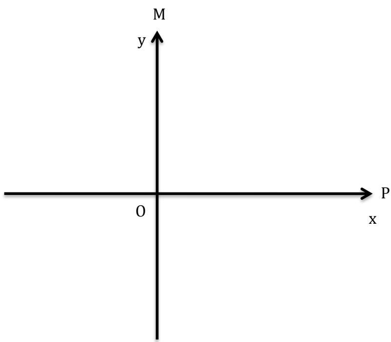

En maths, ces axes déploient les deux dimensions d’un plan, que l’on nomme traditionnellement x et y. Par leur croisement, ils constituent un repère, et si l’angle qu’ils forment est un angle droit, on le dit orthonormé. Mais comme nous sommes en psychanalyse,    nommons    ces    axes    Père    et    Mère,    leur    rencontre    en    O    constituant    en    effet notre origine, tandis que leur tracé va représenter tout ce qu’ils nous ont apporté de connaissances,    d’attitudes    et    de    sentiments.    Cela    nous    sert    de    repère    pour    l’écriture    de notre    existence.    C’est    aussi    par    eux    que    transite ce    qu’ils    ont    eux-mêmes    reçu    de    leurs parents    et    des    générations    antérieures.

Pendant    les    premiers    temps    de    la    vie,    nous    ne    parlons    pas, mais    nous    entendons les    autres    parler,    essentiellement    père    et    mère.    Nous    recevons    en    outre    des    sensations diverses par les organes des sens. Celles-ci s’inscrivent dans la mémoire, mais ne s’écrivent    pas,    puisque    nous    ne    disposons    pas    du    bagage    verbal    nécessaire    à    les    décrire. Pour la théorie, mais pas dans l’espace psychique où cela demeure impossible, je vais symboliser ces inscriptions par le tracé hésitant d’une courbe à l’origine certes irréfutable,    mais    au    destin    incertain.

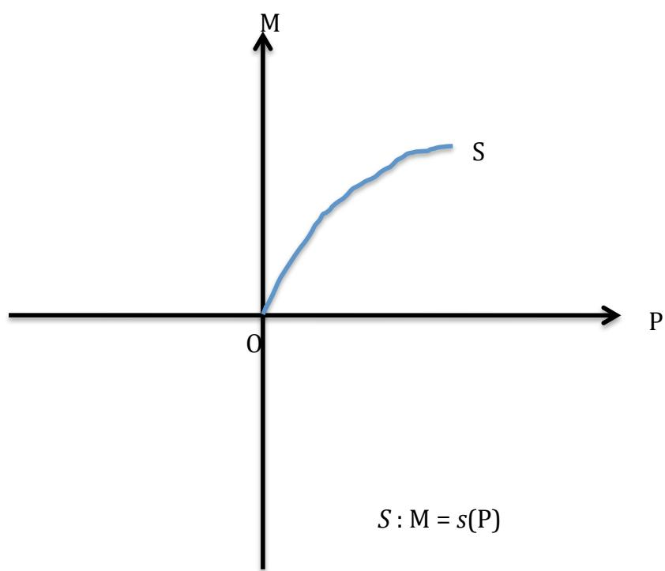  
Cette inscription peut être tenue pour la première manifestation du sujet. En géométrie    analytique,    on    écrirait : $\boldsymbol { \mathrm { y } } = \boldsymbol { f } ( \mathbf { \boldsymbol { x } } )$ ,    marquant    que    la    dimension $_ \textrm { y }$ est    dépendante de la dimension $\textbf { X : }$ en avançant sur l’axe de $\mathbf { X } ,$ la hauteur de point de la courbe ${ \tt y } ,$ est différente.    C’est    là    où    de    notre    côté,    nous    écrivons $\mathrm { { M } } = s \left( \mathrm { { P } } \right)$ .    Le    sujet    s’écrit    comme    une fonction, $s ,$ dans    laquelle    il    est    organisé    par    ce    que    la    mère    dit du    père    et    inversement, sachant    que    l’expérience    nous    informe que    c’est    le    plus    souvent    et    le    plus    intensément    la mère    qui    s’occupe    de    l’enfant.    Quoiqu’il    en    soit,    c’est    bien    l’interaction    des    deux    qui va faire    repère    pour    l’enfant,    lui    conférant    sa    position    dans    l’espace    et    dans    le    temps.    Ce    que la    mère    dit    du    père,    le    mettant    sur    un    piédestal    ou    le    vouant    au    contraire    à    l’opprobre, avec    toutes    les    nuances    et    les    contradictions dont    l’esprit    est    capable,    car    l’un    n’empêche pas    l’autre.    La    mère    et    le    père    ne    sont    pas    des    entités $\twoheadleftarrow$ comme    telles $\gg ,$ elles    n’ont    d’être que    dans    les    interactions    qu’elles    tissent    en    elles.    Comme le    dit    le    langage courant, elles sont    fonctions l’une    de    l’autre,    ce    pourquoi    le    sujet    à    l’état    naissant    est    lui    aussi    fonction de    ce    tissage.

## Construction de l’image du corps et du moi par le Calcul intégral

Si    on    voulait    l’intégrale    de    ces    inscriptions    précoces,    sans    doute    faudrait-il    tenir compte    de    toute la    surface    qui    se    déploie    entre    son    trajet    S    et    l’axe    sur    lequel    il    s’appuie pour    apprendre    à    se    nourrir,    marcher,    parler, etc.

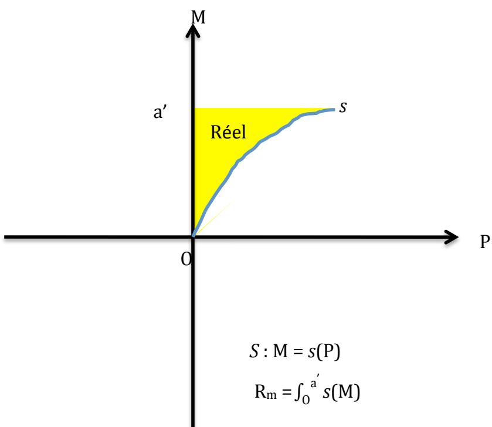

Il se trouve qu’une géométrie analytique, on appelle aussi « intégrale » cette surface,    représentée    ici    en    jaune.        On    la    note    avec    le    signe        ∫ en    ajoutant    en    bas    et    en    haut les limites que l’on donne arbitrairement à cette surface. Ainsi la surface R, en jaune, comprise    entre    l’origine    O    et    le    point    a’    sera    quantifiée    par    la    formule :

$$
\mathrm {R_ {m}} = \int_ {0} ^ {\mathrm{a} ^ {\prime}} S (\mathrm{M})
$$

Qui se lit : somme de 0 à a’ de toutes valeurs du sujet S rapportées à l’axe maternel    M.

Il    existe    bien    entendu    la    somme    de    0    à    b de    toutes    les    valeurs    du    sujet    rapportées à    l’axe    paternel    P :

$$
\mathrm {R_ {p}} = \int_ {0} ^ {\mathrm{b}} S (\mathrm{P})
$$

Ces calculs n’ont de validité que mathématique. A cette époque, le sujet ne se calcule    pas,    il    serait    plutôt    calculé    par    les    autres.

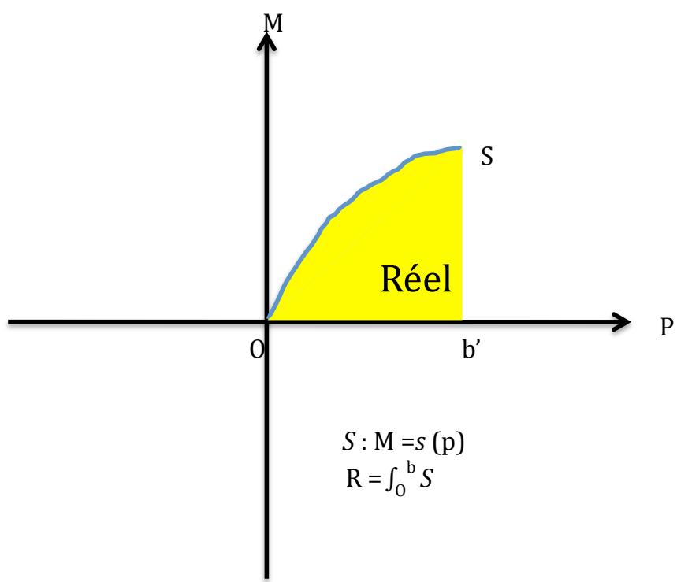

Je dirais volontiers qu’à cette époque archaïque la fonction sujet n’a pas conscience    d’elle-même.    Pour    que    ceci    advienne    il    faut    qu’elle    puisse    se    replier    sur    ellemême,    ou    se    réfléchir    dans    un    miroir,    et    que    ce    qu’on    lui    dit    qu’elle    est    corresponde,    par divers recoupements sensoriels, à ce qu’elle parvient à saisir d’elle-même. Ah oui ce machin auquel maman s’adresse, c’est moi ! Ah oui, c’est cette image qu’elle désigne dans    le    miroir,    qui    n’est    pas    moi,    puisque    ce    n’est    que    mon    image,    eh    bien    malgré    tout, c’est    moi.    Ah    oui,    ce    mot    quand    papa    et    maman    parlent    entre    eux,    c’est    de    moi    dont    il s’agit,    c’est    mon    nom.

La    courbe    se    retourne    donc    progressivement    sur    elle-même :

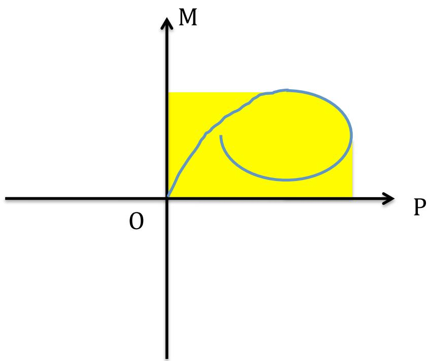  
Et lorsque la courbe se recoupe, on obtient une surface fermée. Il y a un changement    radical,    analogue    à    ce    qu’on    pourrait    appeler,    en    physique,    une    transition    de phase, ces moments où l’eau se transforme en glace, où l’énergie se transforme en matière :    il y    a    naissance    d’un    moi qui, dès    lors, peut    dire    « je    suis ».

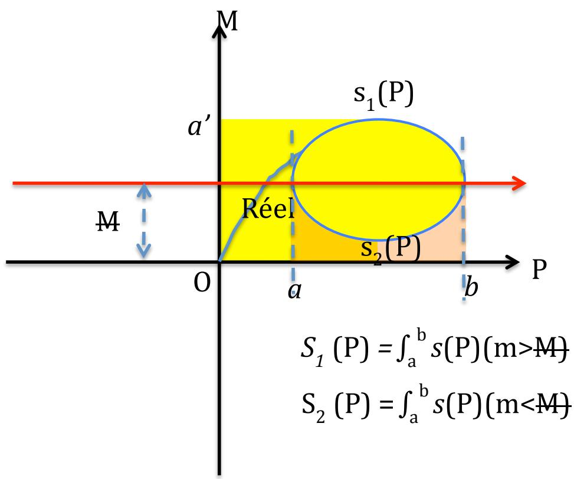

Il    y    a    un    dedans    et    un    dehors.    Le    sujet    en    constitue    la    limite,    sa    fonction    étant    de dire :    dedans,    ceci    est    moi,    et    dehors, cela    est    la    réalité.    Ce    n’est    plus    seulement    un    trait, c’est    une    coupure.    Ce    n’est    plus    seulement    l’acoupure,    mais    la    coupure,    celle    qui    permet à    un    morceau    de    se    détacher de    la    surface    d’origine.

Il    y    a    des    gens    qui    ne    vous    calculent    même    pas.    Mais    vous, vous    cherchez    tout    le temps    à    vous    calculer,    ce    qui    est    une    façon    de    se    demander :    « qu'est-ce    que    je    vaux ? », un    équivalent    de :    « qui    suis-je ? ».

Comment    le    sujet    va-t-il $\mathbf { \Delta } _ { \mathbf { { S } } ^ { ' } \mathbf { { y } } }$ prendre    pour    calculer    la    surface    de    son    moi ?    Par    la même    méthode    de    l’intégrale (je    veux    me    connaître    en totalité !),    sauf    que    c’est    devenu un    petit    peu    plus    compliqué.    Il    va    falloir    diviser    la    fonction    sujet    en    deux,    celle    du    dessus $\mathsf { S } _ { 1 } ( \mathsf { P } )$ et    celle    du    dessous,    S2(P).    Mathématiquement,    c’est    très    facile. Il    suffit    de    prendre l’intégrale    de    S de    a    à    b    en    précisant :    pour    les    valeurs    de    M    supérieures    à    la    ligne    rouge (quantité    M),    et    d’y    retrancher    les    valeurs    de    l’intégrale    de    a    à    b    pour    les    valeurs    de    M inférieures    à    M.    Les    premières    représentent    l’ensemble    jaune    entre    les    deux    verticales pointillées    et    l’axe    P.    Les    secondes,    ce    qu’on    va    retrancher    à    cet    ensemble :

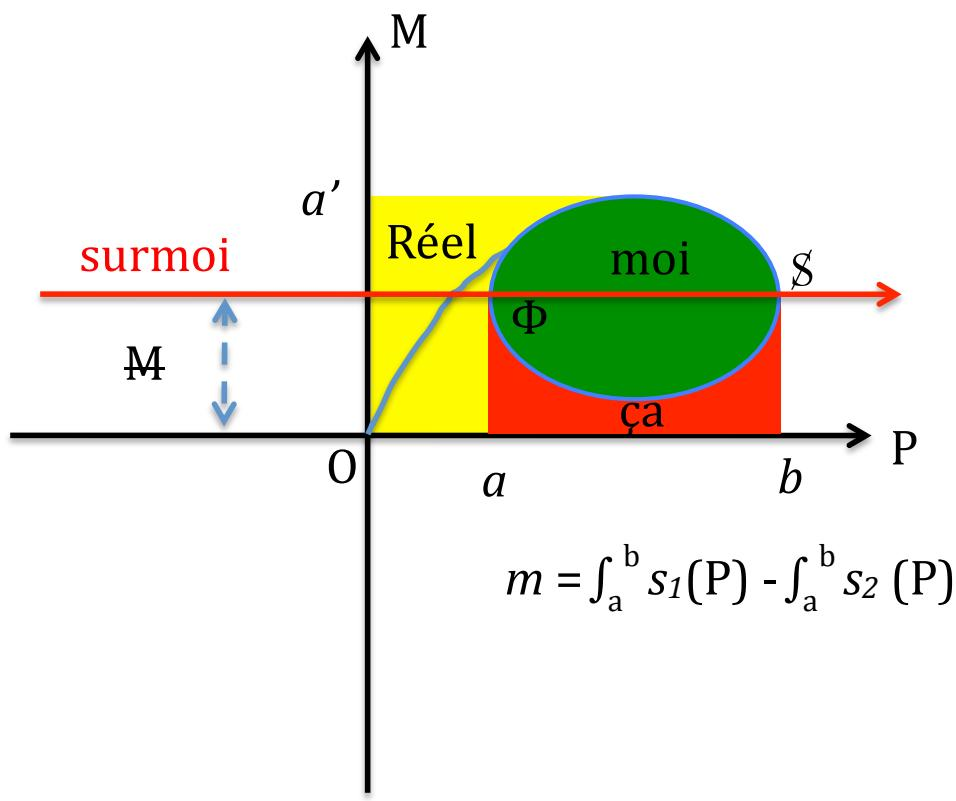  
m =    ∫ab    s1(x) - ∫ab s2 (x)

Nous    pouvons    nommer    ce    qui    vient    de    se    passer    avec    les    termes    de    Freud,    que    je n’ai cessé de vérifier à travers mon expérience pratique. Le moi, cette rondelle de surface, vient de se détacher de sa surface d’origine, sa mère, et ceci par référence essentielle    à    l’axe    paternel.        Ça    se    traduit    par    un    clivage    de    l’appareil    psychique    coupant le    sujet    en    deux,    et    laissant    une    partie    de    sa    surface    en    dehors    du    moi.    Celle-ci    se    divise en    une    surface    rouge,    qui    a    été    « calculée »,    c'est-à-dire    symbolisée,    mais    qui    se    trouve    là refoulée, et une surface jaune qui est restée hors symbolique, le Réel, le refoulement originaire    de    Freud.    Ce    clivage    s’effectue    selon    le    paramètre    M,    se    lisant    « M    barré »,    qui indique l’interdit que le père porte sur la mère, en apparence pour des raisons d’éducation    et    d’éthique, en    profondeur    pour    de    bêtes    questions    de    jalousie (ce    n’est    pas toi    qui    couche    avec    maman,    c’est    moi !).    De    la    même    façon, les    désirs    dits    œdipiens,    les désirs du sujet pour sa mère sont, non pas éteints, mais refoulés à l’extérieur du moi, dans    la    zone    rouge    que    nous    pouvons    nommer    avec    Freud,    le    « ça ».    La    quantité    M est appréciée selon une droite parallèle à l’axe P, qui représente la fonction paternelle à l’intérieur    de    l’appareil    psychique.    Freud    avait    nommé cette    fonction le    surmoi,    trace    du complexe    d’Œdipe    dans    la    mémoire    et    continuant    à    assurer,    tout    au    long    de    la    vie, une fonction    interdictrice    et    plus    généralement    morale.

Cela    est    vrai    pour    les    filles    comme    pour    les    garçons.    D’ailleurs,    cette    séparation    de la rondelle n’est pas neutre : il s’agit de la castration de la mère qui perd son enfantphallus.        C’est    pourquoi    j’ai    noté    Φ,    emblème    du    phallus,    le    lieu    où    l’acoupure    se    recoupe, devenant    la    coupure.    J’ai    nommé    S l’autre côté de la rencontre entre la fonction S et l’axe du surmoi. C’est la partie consciente du sujet qui vient, lui, de perdre sa mère, ce pourquoi il est également barré. Le moi n’est pas la seule partie consciente du sujet. Le moi est la partie qui lui paraît acceptable, et qui présente une certain constance dans le temps. Il n’en est pas moins conscient de ce qu’une partie de lui-même est dynamique et pousse au changement.

Puisque la    coupure    permet    à    un    morceau    de    surface    de    se    détacher,    il    nous    faut maintenant    passer    à    une    représentation    spatiale    en    ajoutant    une    dimension.    Se    dressant hors du plan délimité par père et mère, je l’appellerai la dimension du sujet. Les trois dimensions    ainsi    réunies    vont    former    ce    que    nous    appelons    la    réalité.

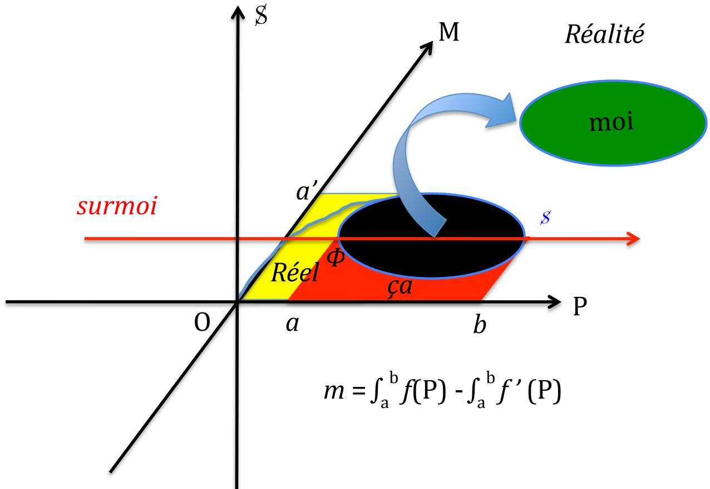  
Mais    ce    n’est    pas    tout.    En    tant    que    phallus    de    la    mère,    il    était    question    de    l’être    ou de    ne    pas    l’être,    bien    que    tout    le    monde    l’ait été,    et    dans    l’imaginaire    maternel,    et    dans

celui de chaque sujet. La mémoire de cette position primitive ne s’efface jamais et se reposera chaque    fois    qu’il    sera question    d’indépendance.    A    l’adolescence,    lors    d’un    deuil, d’une    séparation    quelconque.    J’en    tiens    pour    témoin    la    récurrence    universelle    des    rêves de    chute.

En miroir de ce trou dans le plan d’origine que l’on nommera après-coup « la mère »    un    trou    se    creuse    dans    la    rondelle    sujet-moi    nouvellement    indépendante,    laissant tomber    une    autre    rondelle    hors    du    corps    que    le    sujet    tient    pour    le    lieu    de    son    moi.    C’est là    que    se    pose    pour    chaque    sujet    la    question    de    l’avoir    ou    pas,    le    phallus.    C’est    le trou de sa propre castration. Ce trou interne est donc équivalent chez les filles et chez les garçons, même si pour les premières, elles l’éprouvent comme un manque, comme si elles avaient été castrées, tandis que les seconds le sentent comme la menace d’une castration    toujours    possible ;    le    manque    éprouvé    devient    alors    le    manque    de    certitude de    l’avoir.    Chez    les    filles,    cela    provoque    l’envie    de posséder    ce    phallus    qui    manque et    de se    venger    de    n’en    avoir    pas    été    pourvue. Chez les    garçons, cela    provoque    le    désir    de    se prouver    et    de    prouver    au    monde    qu’ils l’ont    bien,    ce    qui    passe    par    la    confrontation pas toujours    aimable au    sexe    féminin.    Tout    cela    est,    bien    entendu,    imaginaire    et    inconscient. Cela prend appui sur la différence anatomique mais ce n’est pas la réalité de la différence    anatomique    comme    telle,    c’est    son    interprétation    en    termes    de    castration.    J’ai donc    représenté    ce    phallus    tombé    ou    en    risque    de    tomber, comme    la    rondelle    qui    a    été soustraite    au    moi    pour    se    réfugier    dans    le    ça.    Je    l’ai    collé    en    limite    de    la zone    du    Réel,    la zone originaire perdue, car la perte de phallus vient en substitut de cette autre perte. Elle vient apporter une représentation, le phallus, au bord de ce qui n’en a pas (de représentation).

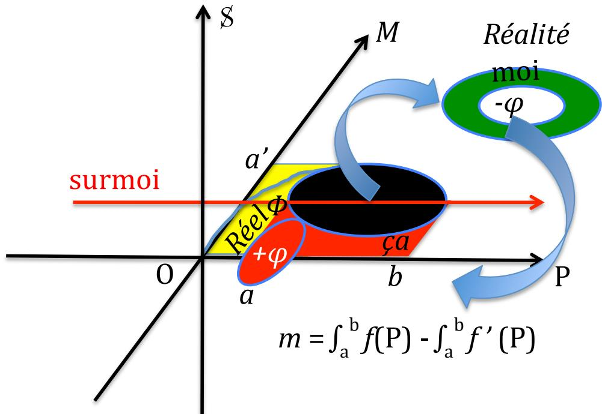

Autrement dit, ce n’est pas la réalité, mais son interprétation imaginaire. Ça n’empêche    ni    la    réalité    d’exister,    ni    la    capacité    à    faire    des    projections    inconscientes    de cet    imaginaire    sur    la    réalité.

Le    trou    interne    à    la    rondelle    du    moi    est    éprouvé    comme    un    manque,    origine    du désir, dont    la    castration    est    la    matrice    et    le    phallus    l’objet.    Son    trou    externe,    c'est-à-dire le vide qui l’entoure, témoin du trou laissé dans le plan du Réel, est aussi éprouvé comme    un    manque,    mais    cette    fois    il    ne    s’agit    pas    du    désir,    mais    de    la    pulsion.    Elle    vise    le manque    de    représentation    qui    règne    dans    le    Réel,    tandis    que    l’objet    imaginaire    du    désir est    parfaitement    représenté,    il    s’agit    du    phallus.    Le    manque    de    représentation    régnant dans    le    Réel    prend    appui    sur    le    manque    de    représentation    du    sexe    féminin.    Ainsi,    la    zone rouge referme toutes les représentations qui sont refoulées du fait de leur relation à l’Œdipe et à la castration. La zone jaune quant à elle, est juste un repérage théorique pour    tout    ce    qui    manque    de    représentation.    Sur    son    bord    se    tient    toujours    le    phallus : c’est    le    fait    de    mon    expérience    onirique    qui    me    fait    écrire    ainsi.

Revenons un instant dans le plan pour un dessin plus facilement compréhensible :

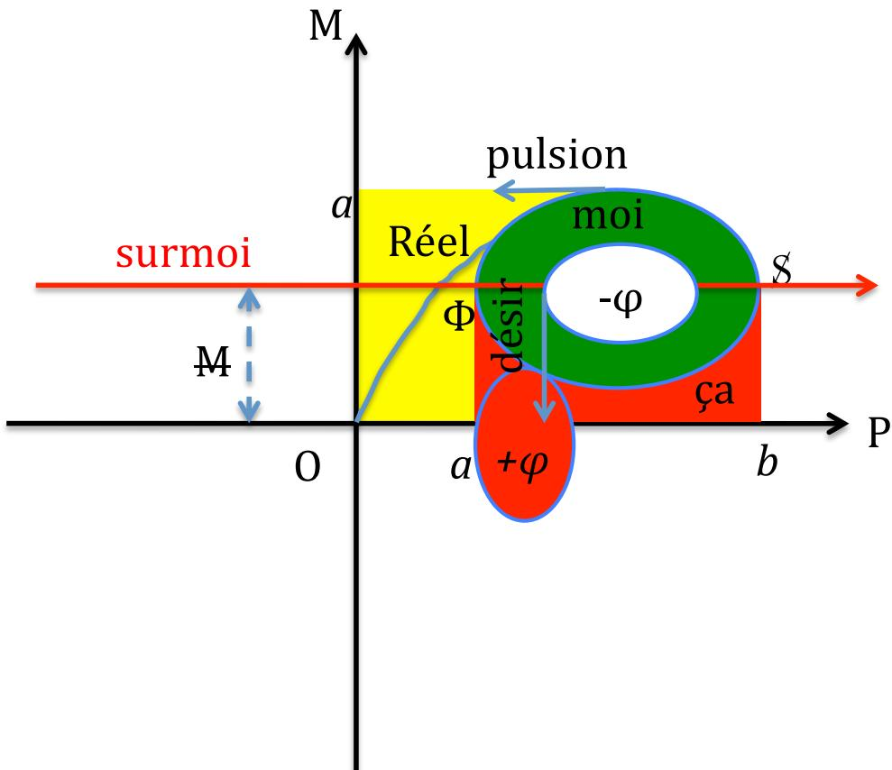

La    pulsion    est    essentiellement    pulsion    de    mort,    au    sens    que    Freud    avait    donné    à ce    vocable    dans    son    texte    de 1920    « Au-delà    du    principe    de    plaisir ».    Lacan    a    eu    ce    coup de    génie    de    repérer    dans    cette    pulsion    la    fonction    symbolique,    à    la    fin    du    séminaire    II. Cette    fonction    symbolique    en    effet,    c’est    celle    du    fort-da qui    jette    au    loin    l’objet    (ici,    une rondelle    de    surface)    pour    laisser    à    la    place    un    trou bordé    par    un    son,    la    représentation de mot et, au-delà, une image, la représentation de chose. C’est le trou que laisse la rondelle verte en se séparant de son plan d’origine. Ce plan n’est absolument pas symbolisé,    et    sa    trace    ne    s’efface    jamais.    On    n’y    trouve    pas    de    représentation,    seulement des traces mnésiques sensorielles. On n’y trouve pas d’écriture, seulement des inscriptions.

C’est    pourquoi,    faute    de    parvenir    à    cette    symbolisation    de    l’origine,    le    symbolique creuse    cet    autre    trou    dans    le    moi,    là    où    son    corps    présente    des    trous :    œil,    oreille,    bouche anus,    sexe.    Un    seul    d’entre    ces    trous présente    une    différence :    le    sexe    féminin.    Il vient    à point    nommé    pour    représenter    le    fort-da à    un    niveau    corporel :    le    phallus    a    été    jeté    au loin, mais il est toujours là en image, symbolisé en substitut de la représentation impossible    du    sexe    féminin.    Tel    est    le    relais    que    le    désir    prend    de    la    pulsion.

Les    autres    trous    du    corps,    semblables    chez    tous    les    humains,    prendront    aussi    le relais    de    cette    symbolisation,    entre    ce    qui    sort    et ce    qui    rentre,    ce    qui    fait    manque    et    ce qui    comble.    Ce    pourquoi    ils    seront    tous    érotisés,    plus    ou    moins    en    fonction    de    l’histoire de    chacun    qui    cartographie    le    corps    de    manière    chaque    fois    particulière.

Cet    ensemble    articulé    par    le    désir    correspond    à    tout    ce    que    Freud    mettait    sous    le registre    de    la    pulsion    de    vie.

## Les    tendances    du    sujet    repérées    par    le    Calcul    différentiel

J’ai écrit le désir et la pulsion comme des segments orientés, courant respectivement le long des bords intérieur et extérieur de la rondelle trouée. Leur orientation    principale    est    celle    que    j’ai    choisi    de    fixer    dans    le    dessin :    la    pulsion    vers    le Réel    de    l’origine,    le    désir    vers    le    phallus    se    tenant    dans    le    ça    au    bord    du    Réel.    Mais    ils peuvent    faire    plusieurs    tours    sur    ces    bords,    se    fixant    éventuellement    à    tel    ou    tel    autre endroit, signalant tel ou tel autre lieu du corps ou de l’âme comme investi de cette énergie    que    Freud    appelait    libido.    Cette    fixation    produit    éventuellement    du    symptôme.

Ces    segments    orientés    s’écrivent    mathématiquement    le    long    de    la    tangente    à    la courbe.    Celle-ci    peut    se    décliner    dans    un    calcul    différentiel.    Il    consiste    à    prendre    sur    la courbe    un    segment    aussi    petit    que    nécessaire,    afin    qu’il    puisse    être    considéré    comme    un segment    de    droite :

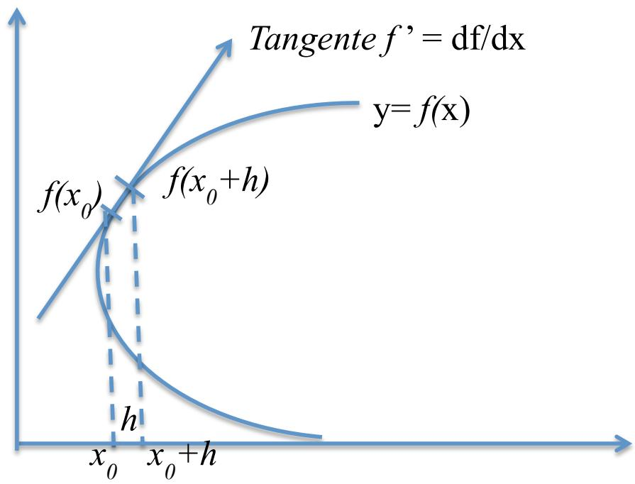

On    appelle $t _ { x 0 } \left( h \right)$ taux    d’accroissement    de        f    en x0 et    avec    un    pas    de h        la    quantité :

$$
t _ {x _ {0}} (h) = \frac {f (x _ {0} + h) - f (x _ {0})}{h}
$$

Si $t _ { x 0 } \left( h \right)$ admet    une    limite finie    lorsque    h tend    vers    0,    on    dit    que    fest dérivable    en    x0, auquel    cas    le    nombre    dérivé    de    fen    x0 est    égal    à    la    limite    de    ce    taux d'accroissement. On note    alors :

$$
f^{\prime}(x_{0}) = \lim_{\substack{h\to 0\\ h\neq 0}}t_{x_{0}}(h) = \lim_{\substack{h\to 0\\ h\neq 0}}\frac{f(x_{0} + h) - f(x_{0})}{h}
$$

Dans    le    cas    de    notre    rondelle    trouée,    on    peut    comprendre    que    le    petit    segment $h ,$ lorsqu’il s’approche de la dimension 0, il s’approche aussi de trou qui est dans son voisinage. Cela représente un glissement continu de « quelque chose » vers « rien » : nous pouvons le tenir pour une image du $f o r t - d a ,$ dans laquelle, lorsque l’enfant tient quelque    chose    en    main,    il    le    jette    au    loin    pour    qu’il    disparaisse    ou    se    casse.    Il    en    ramène une    représentation    de    ce    qui    a    cessé    d’être    une    chose    pour    devenir    un    objet.    De    surcroit il en devient sujet, défini comme celui qui a obtenu une emprise sur son corps et les choses. Cette représentation, il l’intègre dans sa mémoire, ce qui est une façon de la placer    dans    le    moi.    Il    l’assimile    à    la    surface    de    la    rondelle.    La    limite    de    la    disparition,    c’est la    représentation.    La    dérivée    représente    alors    l’effort    du    sujet    pour    assimiler    l’objet,    s’en emparer,    le    faire    sien.    J’avais    défini    le    bord    S comme    coupure et    mouvement    du    sujet.    Je peux    à    présent    le    préciser    comme    la    trace    de    cet    effort    pour    obtenir    des    représentations avec les objets de la réalité, tandis que la tangente, limite de la courbe, représente la pulsion.

On    a    bien    cette    notion    d’une    dérive    lorsqu’on    éprouve    une    très    forte    émotion.    Par exemple :    si    je    ne me    retenais,    pas,    j’irais    tout    casser !    Il    se    trouve    qu’en    anglais,    « drive » est    le    terme    employé    pour    « pulsion ».    Il    n’est    pas    très    loin    du    « Trieb »    dont    Freud    usait pour    dire    la    même    chose.

C’est aussi une tangente, dont la pente (l’inclinaison par rapport à l’axe horizontal)    indique    la    tendance    qu’aurait    la    courbe    en    chaque    point,    si    elle    n’était    attirée par    une    autre    force,    dont    j’ai    déjà    parlé : celle    qu’impose    le    symbolique    avec    la    nécessité de    boucler    une    zone    de    surface    fermée. Ce    n’est    qu’à    cette    condition    que    se    forge    une représentation. On s’en souvient, cette fermeture se soumettait à la condition M du surmoi.    Tel    est    le    but    de    la    pulsion :    fabriquer    des    représentations    là    où    il    n’y    en    a    pas,    et, pire : là où il est impossible qu’il y en ait. Ce qui rend compte du caractère infini de la pulsion    revenant    sans    cesse    tourner    autour    des    mêmes    « non-objets »,    à    l’origine.    Elle    ne cesse donc de viser la zone jaune du Réel sans jamais parvenir à la circonscrire. Rappelons-nous que la rondelle se meut à présent dans l’espace. En tant que tangentielle,    la    pulsion    semble    viser    l’espace    vide    environnant,    en    fait,    tous    les objets    qui $\mathbf { \Delta } _ { \mathbf { { S } } ^ { ' } \mathbf { { y } } }$ trouvent. En effet pour la plupart des objets et des espaces, la pulsion de mort (le symbolique) est parvenu à ses fins : du jet de l’objet au loin, dans l’espace, le sujet a ramené    une    représentation.    Mais    le    Réel    resté    dans    le    plan    en    dessous    oriente    toujours son    énergie    en    pure    perte.

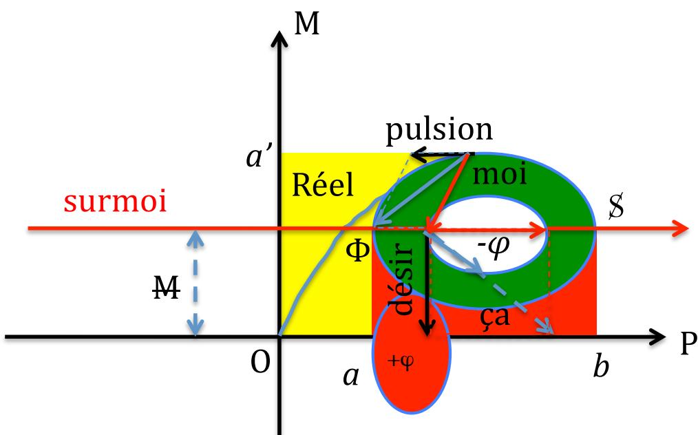  
Et le désir ? C’est aussi une dérive, une tangente, la pente sur laquelle je me laisserais    bien    aller    s’il    n’y    avait    le surmoi.    Elle    marque    une    tendance    du    sujet    orientée vers    les    objets,    non    pas    impossible    comme    dans    le    cas    de    la    pulsion,    mais    interdits.    Sa courbe de référence court sur le bord interne de la rondelle moïque. Elle présente la même constance que la pulsion mais, tournant autour du manque interprété comme castration, elle vise le phallus, refoulé en zone rouge. Cette dernière, je l’ai dit, recèle toutes les représentations qui ont une liaison quelconque avec l’Œdipe (la mère interdite)    et    la    castration (le    sexe    interdit).    Ici    la    quantité    h se    réduit    de    +    ϕ        à    - ϕ,    c'est-à- dire    la    distance    qui    sépare    le    phallus    de    la    castration.    Le    manque    n’est    plus    un    manque de représentation, puisqu’il y a une représentation de ce qui manque ou pourrait manquer : c’est le phallus. Dans le cadre de l’Œdipe, ce qui manque ou pourrait manquer,    c’est    la    mère.

Nous pouvons faire appel au concept de parallélogramme des forces pour disposer    les    flèches    correspondantes    dans    le    dessin.    La    trajectoire    de    la    courbe,    visant un point ultérieur de celle-ci (un état du sujet souhaité par lui pour son futur) sera la résultante    de    la    combinaison    d’une    force    tangentielle,    la    pulsion    et    le    désir,    tempérée    par le    surmoi    (la    flèche    rouge    le    désigne    dans    sa    fonction    de    coupure    en    deux    de    la    fonction sujet.    C’est    le    « si    je    ne    me    retenais    pas ! »).    Ceci    correspond    à    la    définition    du    symptôme comme formation de compromis. Mais il ne s’agit pas seulement du symptôme, c’est toute    la    vie    qui    fonctionne    ainsi,    tenant    compte    de    ces    forces    contradictoires    venues    du ça    et    du    surmoi.

Cet    essai    de    théorisation    se    base    sur    une    sédimentation    lente    de    ce    que    m’apporte l’expérience, notamment l’analyse des rêves, les miens et ceux de mes analysants. Je précise    le    terme    de    sédimentation :    ça    se    dépose    en    couche    fines,    peu    à    peu,    lentement    et ça    finit    par    faire    sol,    roche,    sur    lequel    il    est    possible    d’avancer    le    pied.    Associé    au    savoir mathématique    que    j’ai    appris    à    l’université,    associé    au    savoir    que    j’ai    intégré    à    la    lecture des    œuvres    de    Freud,    ça    organise    une    articulation,    presque    malgré    moi.    C’est ce    dont    j’ai rendu compte ici, dans une abstraction mathématique dont on pourrait fort bien se passer,    l’essentiel    étant, je    le    répète, l’analyse    des    formations    de l’inconscient,    les    rêves constituant la    voie    d’accès    royale    à    celui-ci.

Normalement    je    n’écris    pas    d’article    purement    théorique.    La    pratique    est    ce    qui conditionne    la    théorie    et    non    l’inverse.    Mais    pour    savoir    si    la    théorie    issue    de    la    pratique s’avère    utile    pour    analyser    la    pratique,    il    faut    bien    une    confrontation    qui,    si    possible, ne devrait    pas    être    un    illustration    simplement    destinée    à    étayer    le    bien    fondé de    la    théorie. C’est    une    gageure.    Je    me    propose    de    la    tenter    dans    le    prochain    article.

24.04.2015

## Complément    du    31.03.2016

Comme    je    l’ai    écrit,    les    axes    P    et    M    ne    sont    pas    des    entités    en    elles-mêmes,    mais    le fruit de leurs interactions réciproques. Leur position orthogonale dit ceci : le désir de l’un    ne    va    pas    dans    le    même    sens    que    le    désir    de    l’autre.    Je parle    évidemment    du    désir inconscient,    et    non    de    la    volonté    consciente.    Si    on    interroge    les    parents    sur    leur    but    en mettant    au    monde    un    enfant,    ils    vous    répondront tous    avec    des    étincelles    dans    les    yeux leur    confiance    en    un    petit    être    radieux    qu’ils    vont    éduquer dans    le    sens    d’être    heureux, de    bien    réussir    à    l’école,    de    trouver    une    bonne    place    dans    la    société,    etc.    Je    laisse    de    côté les accidents malheureux qui voient de très jeunes filles tomber enceintes puis être abandonnées    par    le    géniteur,    ou    des    plusieurs    fois    mères    qui    considèrent    avec    angoisse une    nouvelle    grossesse    non    désirée.    Plus    exactement,    je    vais    y    venir.

Cet    idéal    commun    d’un enfant    roi    qui    va    venir    sauver    les    parents    du    malheur    ou les    conforter    dans    leur    bonheur    actuel    de    jeune    couple,    on    comprend    bien    qu’il    pourrait se    théoriser    par    le    rabattement    d’un    axe    sur    l’autre :    il    y    a    une    vision    commune    des    deux parents.    Mais    c’est    un    idéal,    c'est-à-dire    que    c’est    dans    l’idée    que    ça    se    passe,    et    non    dans la pratique. Ça ne veut pas dire que c‘est inutile ou nocif. Je ne fais pas de morale, je constate    simplement.    La    suite    du    constat    tel    qu’on    peut    le    déduire    de    cet    effort    théorique pour écrire le sujet sous la forme d’une coupure qui se recoupe, c’est que, si les deux axes    sont    confondus,    il    n’y    a    plus    de place    pour    lui.

Cela me fait aussitôt penser à ce couple qui m’avait confié leur enfant dit « autiste »    alors    âgé    de    neuf    ans.    J’avais    raconté    son    histoire    par    le    menu    dans    le    tome    1 de mon livre « de L’autisme ». Ces parents se présentaient comme un couple modèle, amant et sans conflits. Lorsque j’interrogeais la mère sur sa grossesse et son accouchement,    elle    répondait    qu’elle    avait    si    ardemment    désiré    cet    enfant,    obtenu    après bien    des    efforts    et    finalement    une    FIVE,    qu’elle    l’aurait    volontiers    appelé    « Désiré ».    Le père    confirmait    ce    son    de    cloche.    Il    était    d’ailleurs    là    à    tous    les    rendez-vous,    ce    qui    est assez exceptionnel de la part d’un père. Ça concordait assez mal avec la théorie lacanienne    de    la    « forclusion    du    Nom-du-Père ».    Mais    le    résultat    était    cet    enfant    qui    ne parlait    pas,    poussait    des    grognements    de    bête    et    courrait    d’un    bout    à    l’autre    de    l’espace disponible    apparemment    sans    but.

Pourtant,    avec    cette    théorie    d’un    graphe    déterminé    par    les    axes    « père    et    mère », on    voit    que,    plus    ces    axes    se    rapprochent    l’un    de    l’autre,    plus    le    sujet    est    écrasé    entre    les deux. Ce peut être le produit d’une absence d’un des parents aussi bien que de leur accord    total    en    tout.

En outre, l’idéal dont j’ai parlé sert souvent d’emballage affriolant pour une réalité    beaucoup    plus    nuancée.    Elle    se    nuance    d’autant    plus    si    on    explore    l’inconscient des    deux    parents :    là,    dans    la    couple    comme    dans    la    procréation,    hommes    et    femmes    ne poursuivent    pas    le    même    but.    Un    homme    recherchera    plus    le    sexe,    tandis    qu’une femme sera en quête d’amour. L’un n’empêche pas l’autre, mais les priorités ne sont pas les mêmes, quel    que    soit    le    discours    consciemment    tenu.    Une    femme    goutera    plus    le    sexe    si c’est un témoignage d’amour. Un homme se mettra à aimer s’il trouve son compte au niveau sexuel.    Une    femme    se    mettra    en    couple    en    vue    de    « fonder    une    famille »,    comme elles    disent,    c'est-à-dire    avoir    des    enfants,    en    compensation    du    phallus    inconsciemment manquant. Un homme acceptera des enfants comme pis aller, ou, au mieux, comme condition imposée pour garder une femme auprès de lui, ce qui le rassure sur la possession    d’un    phallus    bien    menacé.

Tout cela, non seulement ce sont des généralités qui peuvent souffrir des exceptions,    mais    encore    il    faut    compter    avec    la    part    féminine    inconsciente    chez    l’homme et    la    part    masculine    inconsciente    chez    la    femme.    Le    résultat    est    donc    très    complexe    et    ne s’explique que dans la parole de chaque particulier. La généralité structurale qui s’en dégage    néanmoins, c’est    que,    sauf    exception, les    axes    sont    bien    distincts    l’un    de    l’autre, notamment    si    on    se    réfère    au    point    de    vue    inconscient.    Cette    diversité,    source    éventuelle de    bien    des    conflits,    laisse    donc    toute    sa    place    au    développement    du    sujet.
