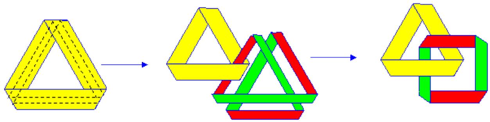
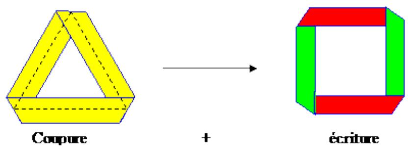
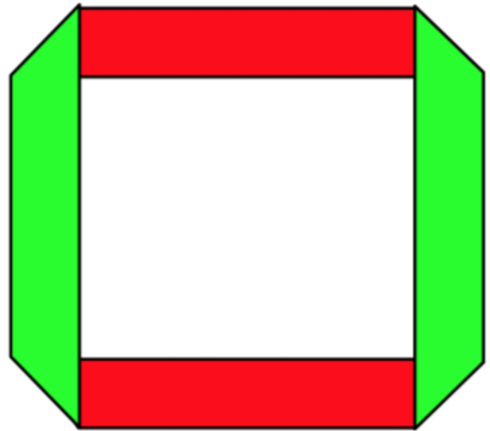
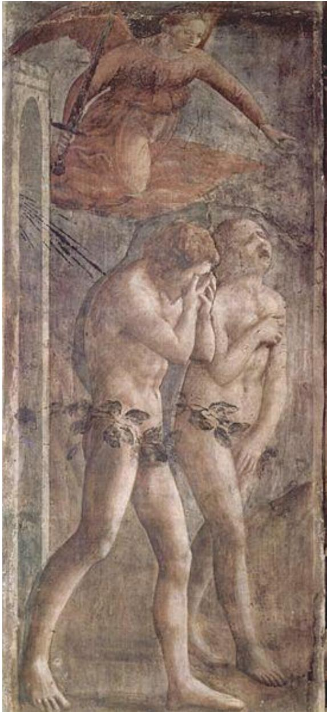

# Clivage du sujet : effet du langage ou de la castration ?

Je réponds à Serafino Malaguarenra :

https://www.youtube.com/watch?v=e54LSmlHiZY&feature=share

qui développe le point de vue lacanien classique sur la bande de Mœbius.

Je me permets de contester dès les premiers mots. Il donne l'exemple : la pomme que j’ai mangée hier soir. il dit que c'est un réel. Et il insiste, employant le mot plusieurs fois ; ben non c'est une réalité. si le réel est ce qui se tient hors langage, hors symbolique, alors on ne peut pas en parler. Or, non seulement il en parle, mais il ajoute : " quand je dis : la pomme que j'ai mangée hier soir, j'emploie des symboles, et ces symboles ne sont pas le réel". Voyez que dans le même discours la même phrase est qualifiée une fois de réel, une autre fois de symbolique.

Et c'est en cela, dit-il, que le sujet est divisé, car c'est le langage qui divise. Oui, ça divise au sens où le mot n'est pas la chose. La phrase "la pomme que j'ai mangée" n'est pas l'acte de manger la pomme.

Mais la division du sujet amenée par Freud et à laquelle je souscris ce n'est pas ça du tout ! c'est le fait que je suis divisé par des désirs contradictoires. j'aime papa, parce qu'il est sympa avec moi, mais en même temps comme je voudrais être seul avec maman, j'aimerais bien le tuer. Comme cette deuxième phrase (ce deuxième désir surtout) est contradictoire avec le premier, il est refoulé.

L'autre sujet, celui qui est divisé de moi, c'est celui-là, fait de désirs refoulés. "la pomme que j'ai mangée hier soir", ce n'est contradictoire avec rien et ce n'est pas refoulé du tout. voilà comment Lacan tord complètement la pensée de Freud et comment des gens suivent sans se poser de question.

Je plussoie : tout le sel de la découverte freudienne est enlevé. On ne parle plus d'Œdipe, ni de castration, on parle du langage. C'est plus propre. Pour moi, ça explique en grande partie le succès de Lacan : on ne parle plus de ces choses dégoûtantes (et qui, comme dit Onfray, peuvent concerner Freud, car c'était un grand pervers, mais pas moi! ).

Pour ce qui est de la bande de Moebius, même suivisme de Lacan. il parle de "LA'" torsion en oubliant les deux autres qui sont nécessaires pour boucler la boucle . Il ajoute que, par une coupure médiane, on obtient une bande qui a les mêmes caractéristiques que celle refermée sans LA torsion.

Oui c'est une bande bilatère, car elle a deux faces. Non car les 4 torsions de cette bande sont toutes de même sens comme dans la bande de Moebius homogène (celle dite "à trois torsions" par Lacan). la bande qu'il a réalisée au départ sans LA torsion, est un cylindre. la bande obtenue par une coupure médiane n'est pas un cylindre. La première définit, il est vrai, un intérieur et un extérieur. la seconde , si elle définit bien une face et une autre face distincte, ne permet pas de définir un intérieur et un extérieur, car la même face se retrouve deux fois à l'extérieur, deux fois à l'intérieur, de même pour l'autre face . Ça, c'est la confusion entre la dimension "intérieur-extérieur" avec la dimension "une face- l'autre face".

## Ça a des conséquences.

Par exemple sur la castration. L’humain est divisé en deux sexes, mais l'enfant croit qu'il n'y en a qu'un. C'est une bande de Moebius : une seule face, même si, localement, il va repérer qu'il y a quand même quelques différences entre papa et maman, différences dues essentiellement à la jalousie. Et puis, s'apercevant de la différence des sexes qu'il imagine aussitôt comme castration, cela produit bien une coupure médiane, mais sans qu'il soit possible de déterminer un intérieur et un extérieur, genre : moi je suis garçon, c'est mon intérieur et à l'extérieur ce sont les filles (ou l'inverse). car dans mon intérieur restent des caréctéristiques de la bande de Moebius (toutes les torsions de même sens) c'est-à-dire des caractéristiques de l'autre sexe pensées comme menace de castration. Pour l'autre sexe , ce sera le rejet du masculin , mais en conservant l'envie du phallus.

La coupure à deux tours dont il ne parle pas ici, rend mieux compte de cela : on obtient une bande de Moebius enlacée avec une bande blatère de même caractéristiques que celle obtenue par la coupure à un tour. La coupure à deux tours représente alors le refoulement, c'est-à-dire le véritable clivage du sujet : d'un côté la croyance en un seul sexe (le phallus, bien sûr) n'est pas abolie, la bande de Moebius est intacte mais séparée du reste du moi, qui est la bande bilatère qui pense faire la différence, tout en en conservant les traces sous la forme des 4 torsions, toutes de même sens. Du point de vue de la dimension "intérieur-extérieur" le sujet reste divisé, essentiellement au sens sexuel tandis qu'il peut maintenir un moi conscient qui semble unifié sous la bannière d'un seul sexe, l'autre étant profondément refoulé.

Illustration : la coupure à deux tours (le long du bord). La bande bilatère obtenue, enlacée à une bande de Moebius est repérable à son aspect carré, où on lit parfaitement la contradiction entre les deux "intérieurs" (noirs) et les deux "extérieurs " (blanc), ou l'inverse : ce n'est plus qu'une question de convention et non de réalité

  
Coupure à un tour (au centre)

Cylindre écrasé : on voit bien les torsions de sens opposés deux à deux. Dans le dessin précédent, elles étaient toutes de même sens.

vendredi 2 août 2019

la pomme que j’ai mangée hier soir permet de cacher les sexes sous des feuillages habilement disposés.

  
Ce qui n’empêche ni l’angoisse ni la douleur lorsque « ils virent qu’ils étaient nus » :

Serafino Malaguarnera :

Avant tout, je vous remercie pour votre long commentaire. Pour introduire mon commentaire, je dirais que "essayer d'être claire ne signifie pas essayer d'être simple". Je voudrais commencer à préciser une distinction que je souligne dès le début, mais que vous par contre vous ne tenez pas compte. Je dirais même que vous les confondez. Mes explications sur le sujet divisé se développent sur deux temps. Dans un premier temps, je fais référence à une caractéristique propre du langage, caractéristique qui, que je sache, est admise par les linguistiques et par les sémiologues. Et c'est pour expliquer cette caractéristique que je propose l'exemple de 'Hier j'ai mangé seulement une pomme". Cette caractéristique avait déjà été mise en évidence par Hegel quand il disait "le mot est le meurtre de la Chose". Quelle est donc cette caractéristique? Lorsque vous utilisez un mot pour signifier la Pomme, nous devrions dire que nous utilisons un symbole (Pomme) qui se réfère à la Chose en soi à laquelle ce symbole se réfère. Je vais maintenant imaginer comment Hegel aurait développé le raisonnement suivant en restant sur le terrain du langage. Quand j'utilise le symbole 'Pomme", j'oublie le réel auquel il se réfère, la chose en soi, alors que le symbole 'Pomme' et le réel auquel ce symbole se réfère ne sont absolument pas les mêmes. L'utilisation du symbole 'Pomme' donne la sensation d'unité, du 'Un'. Lorsque je m'approche de cette Chose en soi auquel le symbole 'Pomme' se réfère, je me rends compte que ce réel est composé d'une pluralité d'aspect (forme, couleur, texture, etc....). Cette première unité que le symbole 'Pomme' donne se dissout, apparait par contre une division, division entre le Symbole 'Pomme' et ce auquel elle se réfère, la Chose en soi. Cette caractéristique du langage que je viens d'expliquer représente la première partie de mon exposé, la première partie où je présente l'exemple de la 'Pomme que j'ai mangé hier'.

Ensuite, je vais dans un autre registre, le registre où les développements de la pensée de Lacan si situent. En lisant le commentaire de Abibon, je constate que ce passage n'a absolument pas été saisi. C'est le passage entre deux temps d'explications, deux temps qui correspondent à un premier temps où se déroule une explication de la division que le langage comporte, en d'autres termes un plan linguistique,et à un deuxième temps qui correspond au plan psychanalytique. Abibon reprend mon exemple de la 'Pomme que j'ai mangé hier" comme si cet exemple se référait à la pensée de Lacan, ce qui n'est absolument pas le cas. Je continue. Comme je disait, dans un deuxième temps je donne une explication de la division du sujet dans le domaine de la psychanalyse. Voilà ce que Abibon nous dit : "et c'est en cela, dit-il, que le sujet est divisé, car c'est le langage qui divise. oui, ça divise au sens où le mot n'est pas la chose, la phrase "la pomme que j'ai mangée" n'est pas l'acte de manger la pomme. mais la division du sujet amenée par Freud et à laquelle je souscris ce n'est pas ça du tout! c'est le fait que je suis divisé par des désirs contradictoires. j'aime papa, parce qu'il est sympa avec moi, mais en même temps comme je voudrais être seul avec maman, j'aimerais bien le tuer. Comme cette deuxième phrase ( ce deuxième désir surtout ) est contradictoire avec le premier, il est refoulé. l'autre sujet, celui qui est divisé de moi, c'est celui-là, fait de désirs refoulés. "la pomme que j'ai mangée hier soir", ce n'est contradictoire avec rien et ce n'est pas refoulé du tout. voilà comment Lacan tord complètement la pensée de Freud et comment des gens suivent sans se poser de question...." Si nous nous référons à la pensée de Lacan, ce que je viens de reprendre d'Abibon est complètement incorrect. Je ne veux pas dire que ce que Abibon dit est incorrect, je précise encore une fois, c'est incorrect si nous nous référons à la pensée de Jacques Lacan. Par contre, Abibon peut très bien nous exposer ses élaborations, et en cela, je répète, je ne peux que le remercier. Pourquoi c'est incorrecte? Pour deux raisons. La première : c'est la signifiant qui fait surgir le sujet et c'est la signifiant qui le divise (c'est ce que j'explique dans la deuxième partie de ma vidéo). En deuxième lieu, le désir est une conséquence de cette réfente, de cette division et non pas, comme nous dit Abibon, le moteur de la division. Maintenant, qu'il y ai des désirs contradictoires ne change rien à cela. Que la Bande de Moebius puisse être utilisée pour montrer la coprésence de l'amour et de la haine, ne change non plus rien à ce que je viens d'expliquer. En ce qui concerne la partie d'Abibon qui parle de la Bande de Moebius, je trouve le contenu pas très claire, mais je me promets de le relire attentivement et ensuite donner mon avis;

## Cordialement, Serafino Malaguarnera

## Merci aussi pour cette réponse.

J’ai beau vous relire, je ne vois pas de deuxième temps dans votre élaboration.

Premier temps (linguistique): le mot est le meurtre de la chose, parfaitement d’accord. Deuxième temps : (psychanalytique) « c'est la signifiant qui fait surgir le sujet et c'est la signifiant qui le divise (c'est ce que j'explique dans la deuxième partie de ma vidéo). » pour moi c’est une redite de la première partie en d’autres termes. Le signifiant fait bien référence à la linguistique ? le sujet est divisé de la réalité, car il utilise des symboles, ou des signifiants : n’est-ce pas dire la même chose ?

« En deuxième lieu, le désir est une conséquence de cette réfente, de cette division et non pas, comme nous dit Abibon, le moteur de la division »

Nous avons deux phénomènes en effet, mais concomitants :

La fente, soit, la séparation de la Chose hors de la sphère psychique. La refente c'est-à-dire la séparation en deux (ou plus) dans la sphère psychique.

Pour moi « parce que » nous avons des désirs contradictoires, et non par effet de la perte de la Chose, ce qui est ce que j’ai retenu de l’explication de Lacan. Le symbolique, sépare de la chose mais une fois la chose perdue elle n’a plus d’effets, sauf fantasmatiques, par désir de retour au ventre de la mère : mais justement ce n’est plus la chose, c’est ce qui est devenu « le ventre de la mère » par effet rétroactif du symbolique.

Nous avons donc deux divisions et, pour moi, la problématique en se situe pas dans le fait de savoir quelle est la cause ou la conséquence. Enfin, si, mais pas autour d’une seule division. C’est pourquoi je parlais de celle de Freud (ça , moi, surmoi) et de celle de Lacan (perte de la chose). Mais c’est peut-être ça que vous appelez vos deux temps d’élaboration, mais ici, c’est une hypothèse que votre texte ne laisse pas clairement apparaitre, du moins pour moi. Pour vous ce qui est cause, ( si j’ai bien compris) ce serait cette perte de la chose. Je suis parfaitement d’accord qu’il y a perte de cette chose, et en effet, comme vous le dites « Maintenant, qu'il y ait des désirs contradictoires ne change rien à cela ». Les désirs contradictoires viennent ensuite, une fois que le symbolique a permis de distinguer plusieurs objets d’investissement et que la différence sexuelle a été symbolisée par la castration. Donc je suis d’accord avec vous que les désirs contradictoires ne sont pas les moteurs de la séparation d’avec la chose.

Mais que la séparation de la chose soit la cause des désirs contradictoires, à la fois oui et non. Oui, parce que c’est l’accès au symbolique qui permet une contradiction entre les affects d’une part (amour et haine) et entre les objets (papa et maman) d’autre part. Non, parce que ce n’est pas la chose perdue qui est la cause du désir ainsi que le soutient Lacan. C’est le phallus perdu, car la chose, pour le psychisme n’ayant jamais été possédée, n’est jamais perdue non plus. J’entends bien que c’est une question de nuance dans la formulation car Lacan dit : « elle est toujours déjà perdue », mais pour moi, cette formule ne tient pas. Que le phallus perdu (castré) puisse en faire métaphore, je veux bien. Ça pourrait être une façon de nous arranger sur un moyen terme. Qu’en pensez-vous ?