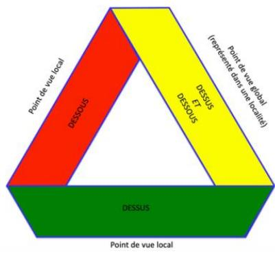
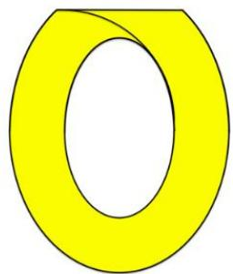
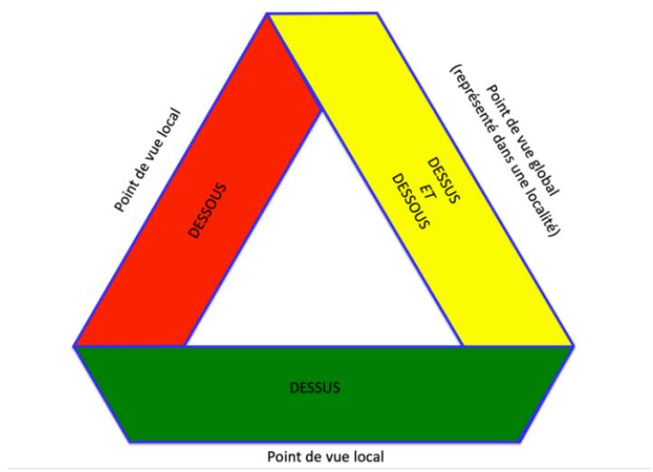
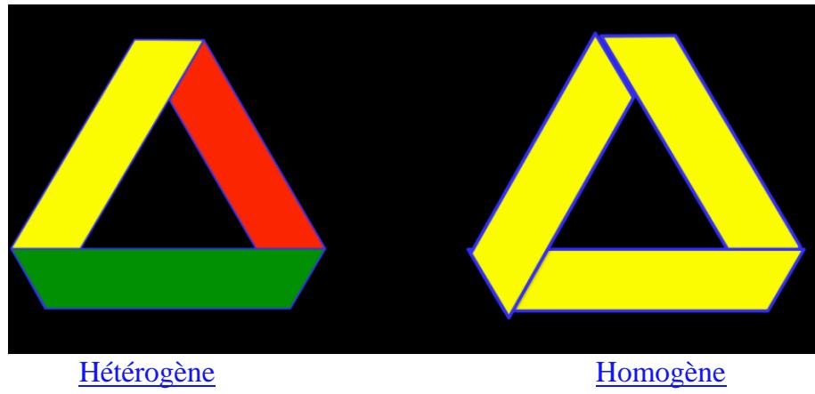
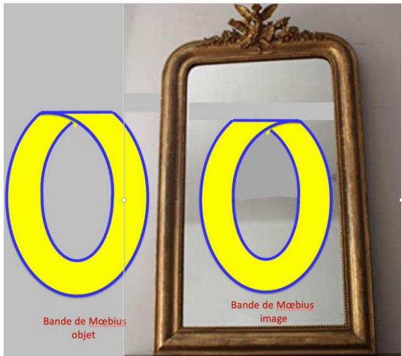
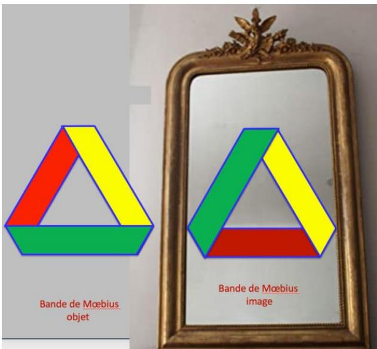
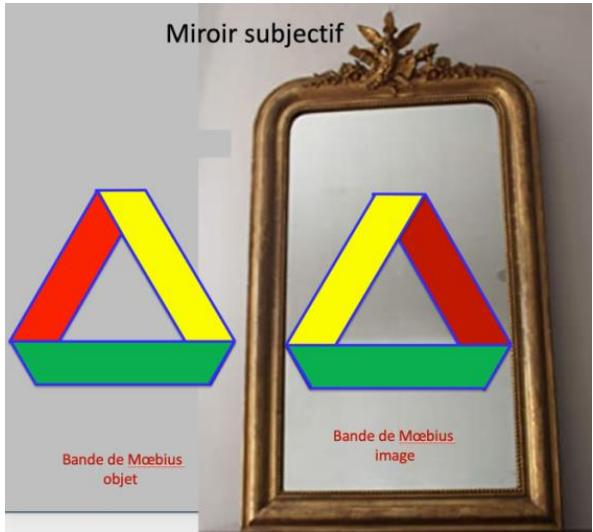
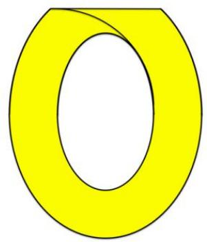
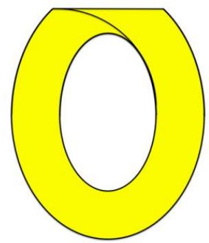

# Richard Abibon

## The cut is not the essence of the Möbius strip

From this article:

<https://l.facebook.com/l.php?u=https%3A%2F%2Fwww.apsychanalyse.org%2Fpost%2Fpost%2Fjoseph-rouzel-la-psychanalyse-est-une-pratique-de-bavardage%3Ffbclid%3DIwAR0PwkZuhLKD4TbOArFqjdiLWQEPukdp1CmQBBqy3VJqwMBEA_nWzj0LGio&h=AT2ozb017oTp2hxWljbyM7xuz6gAcVvxbUI8KqyZbVOGwYkpeVT_DQFEt6-j3OFmwBXE3tjxRQ2SNSVNVkGocWldwsotgSxyKhx82SXXOinJS0LeJQndNiv3p6u0D853Q1N7qC0&__tn__=-UK-R&c[0]=AT02mRrEOV_QFNorTZZ56iurJJh9ReuHPliv0EmJ1hDQNtTYH2wDdmmEJ5V8wcTXvgj2obs4yve2TKpZXb1BIT8Se7urMT9o0Y_VUunkGAMK_lQ_KpweXrX9A0A9OMa8Lnhvtxh_ME-p05tQBZK4J8xpEaU>

### I take up this passage

> "In the session of 15 December 1965 of his unpublished seminar *The Object of Psychoanalysis*, Lacan gives us the user manual. 'The Möbius strip is a surface such that the cut traced in its middle is itself a Möbius strip. The Möbius strip in its essence is the cut itself. This is how the Möbius strip can be for us the structural support of the constitution of the subject as divisible.'"

Try it out: the cut in the middle of the Möbius strip does not yield a Möbius strip, but a two‑sided surface. Unless one understands that Lacan indeed means to designate the cut itself. But there too, it is a mistake by abuse of language. Certainly, the Möbius strip has only one edge, globally, and the edge of a surface normally has only one dimension. The edge indeed represents the cut of the surface, as a special case of Poincaré's theorem: "what cuts a space of n dimensions is a space of dimensions n‑1. The surface cuts the volume, the line cuts the surface, the point cuts the line."

But the error lies here: in considering the Möbius strip only globally. For locally, it also has a surface, all along, because each element possesses a locality. What constitutes the characteristic of the Möbius strip is not that it is "the cut itself" – a dimension – because, from that point of view, it loses its paradoxical quality: of having both a single edge (globally) and two edges (locally), both one side (globally) and two sides (locally). If one reduces the strip to the cut inflicted upon it, it is no longer a strip. Even globally, it "has" an edge, but it does not "is" an edge. It is a surface called one‑sided.

Therefore, however one understands these assertions of Lacan, they are false.

Thus the subject is a paradox, when he wants at once the thing and its opposite – to fuck mummy and not to fuck her so as to respect daddy, because he also loves daddy. This is well represented by the two sides (local) which are nonetheless within the same subject (global). That is why the subject is indeed the Möbius strip, provided one does not reduce it to the cut, which is not its essence. This rather blows apart all those theories of practice that would be made efficient by the cut alone.

In short, after this, can we trust Lacan? And can we trust people who repeat Lacan's words verbatim without even thinking a little about what he says?

That is why I have always represented the Möbius strip with its three twists, which allows one to distinguish, on the same drawing, the local and the global, without suppressing one in favour of the other.

Lacan's usual drawing, which shows only one twist, and therefore only one side, is erroneous. All the more erroneous since I have produced 74 demonstrations of the existence of these three twists. (I'm exaggerating a bit, ok).

If you read the article I cited as a reference, you will see how the author uses his (false, albeit Lacanian) conception of the Möbius strip to justify the techniques of the short session and of the cut as interpretative. I did not need the Möbius strip to realise the clinical impasse of these techniques. They are ineffective and inhumane. They effectively justify frustrating people to make them discover the virtues of the Name‑of‑the‑Father and of the cut.

And so, with the Möbius strip, this is one more argument indicating how all this is based on false conceptions. That is for the clinical implications of Lacan's "concepts". I put it in quotes because a concept, in principle, benefits from a precise definition and an articulation with other concepts within a coherent theoretical framework. Now that is not the case, which can be demonstrated, already mathematically, with the Möbius strip. As for the "clinical implication", it is of course more delicate to demonstrate, since everyone always sees things from their own doorstep.

... this is where my demonstration passes through the publication of my dreams, which is far more important than all these mathematical amusements. (see the article I cite as a reference at the end of this text). And I never cease to be amazed at how little reaction these publications provoke, whereas the Möbius strip immediately triggers a plethora of comments and questions. In fact, what I expect as comments on the publication of my dreams is: well, I dreamed of that. Or: your dream makes me think of such and such an episode of my childhood. That each person speaks of himself, you know, according to what my dream resonates with. Like that, it is not an interpretation of my dream, it is just resonances, as in music. No one interprets the other, but each speaks of himself, possibly leaning on what the other has said to understand his own speech.

I sometimes practice this in analytic sessions, when I tell one of my dreams to the analysand concerned by that dream. Thus there is communication from unconscious to unconscious: there are two sides, the analysand and the analyst, but, within the framework of the transference, it is the same. It is not just a cut: it also requires the surface of the narrative. There is no narrative without punctuation, that is, without cut, but there is also no punctuation (that is, cut) without narrative. Just as there is no edge without surface, even if there are surfaces without edges (the sphere, for example).

*Tuesday, 21 December 2021*

**Nathalie Cappe**  
Even Wikipedia explains that Lacan is wrong in this affair... that is to say if the whole band is on the bridge [^1], ah ah!!

### In Lacan

In Jacques Lacan's vocabulary: "1962/63 – Anxiety – 09/01/63 – What makes a specular image distinct from what it represents? It is that the right becomes the left and vice versa. – A one‑sided surface cannot be turned over. – Thus a Möbius strip, if you turn it over on itself, will always be identical to itself. That is what I call having no specular image."

From a mathematical point of view, the preceding assertion of Lacan is erroneous: we have seen in the previous sections that the mirror image of a Möbius strip corresponds to a reversal (before gluing) of a half‑turn in the other direction, and therefore is not identical to the initial strip (more generally, if the mirror image of a figure can be superimposed on it by a displacement, that is because the figure possesses a plane of symmetry).

### Richard Abibon

Nathalie Cappe, that's it. I add that my version of the Möbius strip no longer has anything to do with Lacan's.

### Dominique Bertin

Nathalie Cappe, why would he be wrong? It is an attempt to account for the unconscious through topology, not to be taken literally, like his other formulations of the unconscious. That would be like using optics to understand the mirror stage.

### Richard Abibon

Dominique Bertin, but one must use optics to understand the mirror stage! precisely in order to distinguish the objective mirror (pure optics) from the subjective mirror (optics + identification to the image).

On the topological difference of the three points of view of the mirror, read (above I only spoke of two, to simplify):

<https://unepsychanalyse.files.wordpress.com/2019/06/3_torsions_demonstration_10.pdf>

Usually, everyone confuses them, and Lacan first and foremost. Likewise, one must examine closely the object "Möbius strip" in its physical aspect if one wants to understand how it can be used as an illustration of the unconscious. And therefore, on the physical and mathematical level, Lacan's assertions on this subject are false. Yet he relies on them with aplomb. If one wants to speak of the unconscious using the Möbius strip or the mirror as illustration, then one must know what these two objects precisely signify, otherwise it's not worth it: one might as well not use them and seek other metaphors.

Besides Nathalie Cappe's Wikipedia demonstration, I have at your disposal the numerous demonstrations I have carried out on the mirror and on the Möbius strip, notably on the relation between the two. See the videos whose references I give below:

<https://l.facebook.com/l.php?u=https%3A%2F%2Fwww.youtube.com%2Fwatch%3Fv%3DzkxK1RHLLPw%26t%3D9s%26fbclid%3DIwAR2SWnmfP4w53SgWqcCBQBstDRInTQPk98iywBke7uhaWxVnlv02Oajtd0c&h=AT0EDX1bAgENUKNOO0kx04vIoFSkMBAoUijt3x5z0dKzDquF5U04WgVMJUkdJb9kfMYFgOGWqgP4gKG96mRoGjwNF1-guKJx21FaodXjVig6NNJ7AbxyTp0Fph1XgRlYQ5XYbVw&__tn__=R]-R&c[0]=AT2joOiXs52et0jqXXol_SjR2puWvllBOOYuyPAI0x_ZBFZUvPi5V9x4o62gz8fVvoOXP8GMo-KYkGq1XaXGIY7nCRyxW57eRwqpIsNio415wuyJvD2bw8M2cTIuowdrTlTntCQ8EeLiij5IUOHMW4Ml6IM>

<https://l.facebook.com/l.php?u=https%3A%2F%2Fwww.youtube.com%2Fwatch%3Fv%3DuOyrFU3Y54o%26t%3D1121s%26fbclid%3DIwAR0zvEoij-drFx-TQHfobb9e7eB8Ak8gxfSQK4SmV2iHAi7iO3lumiFB8A0&h=AT3WFqfdclEPjgA3feji5q0M6Tm-shY4-LqwqiIbqJwRHlABoBBYhnEr0OCsTNB6Bpk2AEvyN2aK5Sb3T7__lmDu-WHbK41ck0LkOP23vwXVPVH-5bEOvpO0ebMnLtDXbJtm_G8&__tn__=R]-R&c[0]=AT2joOiXs52et0jqXXol_SjR2puWvllBOOYuyPAI0x_ZBFZUvPi5V9x4o62gz8fVvoOXP8GMo-KYkGq1XaXGIY7nCRyxW57eRwqpIsNio415wuyJvD2bw8M2cTIuowdrTlTntCQ8EeLiij5IUOHMW4Ml6IM>

<https://l.facebook.com/l.php?u=https%3A%2F%2Fwww.youtube.com%2Fwatch%3Fv%3DvdBKxMpTL4M%26t%3D142s%26fbclid%3DIwAR2hnks0RcGvRUXeLwXsXlkcIC_9xJEMH21RELyS8zkbhVqDzLblO-z9Y58&h=AT0QkCJNS6XJc0GiMwGfoKDc7BWhJ2LZCK9B8D7D2fDpDjhANuoWQPlteoKREdhzKpWmo_60vMsJFGIaSdpRywJ2m_PJF5cx-W-q1a5Ur7SaECAj8-XUuGCeb794WXLI5SjVZr0&__tn__=R]-R&c[0]=AT2joOiXs52et0jqXXol_SjR2puWvllBOOYuyPAI0x_ZBFZUvPi5V9x4o62gz8fVvoOXP8GMo-KYkGq1XaXGIY7nCRyxW57eRwqpIsNio415wuyJvD2bw8M2cTIuowdrTlTntCQ8EeLiij5IUOHMW4Ml6IM>

Lacan is wrong not only in his apprehension of these objects, but also in what he says about the unconscious by using them.

For example, if the Möbius strip has no specular image, what could that possibly mean? That it represents a so‑called autistic? For some so‑called autistics do not see themselves in the mirror, that is true, but not all. But we are completely straying, because what he calls "specular image" is not the specular image, but a turning inside out like a glove. I develop this below. If one does not have this reference, one understands nothing!

If the Möbius strip represents the signifying chain with an above and a below, as in the graph, the latter at any rate does not account for the fact that the "below" discourse can say the opposite of the "above" discourse. But above all, this says that the unconscious is present everywhere and all the time "in" the signifying chain, which is represented by the equivalence of above and below. Hence the attention paid to slips and puns. I believed in this for a long time because it seemed to go without saying: the unconscious is present everywhere and all the time with us... But not precisely in the signifying chain! repression, in waking life, and more partially in sleep, aims to keep the unconscious as far away from us as possible. It is therefore not in the signifying chain; it is vigorously expelled from it, except at those rare moments of slips or homophonies. But as I said above, these manifestations are rare and never manage to let the archaic through. Except by being so on the lookout that one ends up hearing it everywhere in spite of common sense. Which I did at a time when this theory somewhat twisted my listening. And I knew, through working groups, that I was far from being the only one!

No, the unconscious, I want to know nothing about it, and it works very strongly! It is not present in the signifying chain; it takes refuge... in dreams and delusions. It must still be deciphered, because repression continues to function there in such a way as to make it illegible. It is in this sense that Lacan makes a bad interpretation of the Möbius strip: by taking it as "the cut", in its essence, he validates his theory of the signifying chain, in which the second dimension of the surface disappears, leaving only the sole dimension of the edge, or the cut. The signifying chain, when it is uttered, does so in the sole temporal dimension, which makes it representable by a line. Now, as I said above, the Möbius strip is indeed a surface, but a paradoxical one. Said like that, it indeed represents the subject of the unconscious, whereas when reduced to the cut, it loses both its above and its below, and everything becomes the same grind, drowned in the delusions of homophony. This amounts to taking words for things. This amounts to seeing only through the global point of view, losing the local points of view. In the latter, there is indeed a surface that distinguishes above and below, at least momentarily. That is: distinction of words and things, of signifier and signified – because the unconscious must leave us in peace from time to time; besides, we work vigorously at it.

  
This is seeing the Möbius strip as always homogeneous, and never heterogeneous. Whereas the Möbius strip that Lacan most often presents is the heterogeneous one, which he distinguishes from the homogeneous in that the former would have one twist and the latter three. That is having failed to perceive that both have three twists, and that what distinguishes them is the direction of the twists, not the number. Homogeneous and heterogeneous is a distinction I introduced, because it was important to distinguish the strip where all twists are in the same direction from the strip where one of the twists is in the opposite direction. It is the latter that allows, locally, an above and a below, and therefore a distinction between words and things. So everything happens as if Lacan did not distinguish psychosis from neurosis, words from things, the signifying chain being permanently taken as the thing to be "observed".

### Möbius strip and mirror

To be more precise than Wikipedia: try it out, look at a Möbius strip in the mirror, even taking Lacan's erroneous drawing with a single twist: if you stand behind it, and if you see it turning to the right, you will see it turning to the left in the image.

This is true of each of the twists in the heterogeneous strip. It is even more spectacular because one sees the underside in place of the upper side and vice versa. So it does indeed have a specular image.

However, this shows only one point of view in the mirror: the objective point of view, where I (subject) am behind the object, simultaneously seeing the object and its image. In the case where the object is also the subject, that is, my image, if I consider it objectively, it is reversed front‑back (since I am facing myself). If I consider it subjectively, I identify with my image and therefore I am both here and there – here as object of the mirror, and there in the mirror as subject imagining having this image. In that case, the mirror has reversed right and left, since in order to have turned my image around, by identifying with it, I am turned around in the right‑left dimension, in addition to front‑back.

Is it necessary, is it even possible to say: I am a Möbius strip, so as to identify with my image? That is silly: I am not a Möbius strip! but for fun let us attempt the challenge. The subjective image of the Möbius strip is then this:

I have respected the data of what I make my body undergo in identification. So the strip is indeed reversed right‑left, but, surprise, no longer above‑below! if one considers that above‑below is the equivalent, for the strip, of front‑back, that is quite bizarre! but it is a specular image, since it is different from the object. All this to say that one does not get rid of the problem as easily as by an assertion: it is specular, it is not. See that the problem is far more complex, although the answer is always unequivocal: it is specular, but not in the same way according to points of view!

But Lacan does not speak of this; he speaks of turning inside out: indeed, when one turns the Möbius strip like a glove, if it turns in one direction at the start, it will turn in the same direction at the end.

Now, that is not the specular image; it is another operation. It is therefore erroneous to call it "specularity". Applying this word to turning inside out is as if I decided to call a willow a birch, a 15mm spanner a screwdriver, and a *religieuse* [^2] a Paris‑Brest [^3]. There are after all limits to the overhaul of vocabulary, otherwise we no longer understand each other.

What is this other operation? if one refers to the glove, it is putting the inside outside. Now, can this dimension "inside‑outside" be assimilated to "right‑left" or to "front‑back"? It seems to me not. It is not the same thing, and therefore what is reversed in this operation cannot be compared to what is reversed in the mirror. So we are speaking neither of the same operation nor of the same dimensions. It is therefore doubly erroneous to call it "specularity".

Let us look more closely, out of simple curiosity. The operation of turning inside out consists in taking the external edge and putting it in the place of the internal edge. Now, without doing anything other than following an edge with one's finger, one observes that one passes from outside to inside, then outside again. It is the same edge. It is therefore logical that its turning inside out produces only the same thing. It is no doubt easier to assimilate "inside‑outside" to "interior‑exterior". And indeed I have observed that the subjective mirror of the Möbius strip did not reverse above‑below. Therefore, notwithstanding an assimilation of these two dimensions (which remains debatable), one can say that the "subjective" Möbius strip is not specular within the framework of this sole dimension, while remaining specular for the "right‑left" dimension.

Having worked with so‑called autistics for a large part of my life, I was indeed able to observe that for a certain number of them, the dimension "inside‑outside" did not exist, or at least posed a problem. I think of René (see my book *De l'autisme*), who spent his life around doors. He goes out, slamming the door violently, and immediately comes back in, slamming it just as violently – every day, all day long. I understood that he did not grasp the difference marked by the threshold, and therefore never stopped testing it. Incontinence sometimes seems to me a consequence of this difficulty: what is inside is also outside, no problem. Or anorexia, diarrhoea and constipation. Or finally, hallucinations: the representation that should be inside (mental image) is perceived outside.

Now, if some so‑called autistics thus remain on the threshold of the Symbolic, I have observed that they did not see themselves in the mirror. They were therefore aspecular... subjectively! although the definition of aspecularity requires revision: for Lacan it is the identity of object and image; for my so‑called autistics it is the absence of image. And, objectively, I saw them in the mirror. But this is not generalisable, notably to the anorexias and digestive problems of people who speak. One must always remember to consider each case as new, irreducible to any generality.

Nevertheless, this work can help us orient ourselves with respect to these people, whatever their difficulties, never forgetting that the subjective‑objective dimension of the therapist has its role to play, and not the least. This seems to me far more fruitful than trying at all costs to bring them back to a category: autistic or not? psychotic or not? personally I don't care at all and I listen to them in their singularity, asking myself, while observing them, while following them (if they don't speak), where their steps carry them, on the threshold representing the cut in which dimension, and in which pole of the dimension I observe them.

To finish, I invite you to observe this: if one considers the Möbius strip as the cut, all these problematics fall away. The question of specularity does not even arise. So why does Lacan pose the question? it is contradictory with his point of view on the Möbius strip. Yet, in relation to the practice of psychoanalysis, these are fruitful questions, notably in relation to "so‑called autistics", and even to transference: what do I put inside myself that comes to me from outside, from the person I am listening to? and what do I give back to him, putting outside again what I had put inside? Is there continuity or rupture between the analysand and myself? or is there both at once? I lean towards the latter solution, which is well represented by the heterogeneous Möbius strip.

My article "Wandering Vulva" is a good example of how to treat this question in the practice of psychoanalysis.

<https://unepsychanalyse.files.wordpress.com/2021/12/vulve_baladeuse-1.pdf>

*Wednesday, 22 December 2021*

---

### Translator's notes

[^1]: **"toute la bande est sur le pont"** – A pun in French: *la bande* means both "the strip" (the Möbius strip) and "the gang/group"; *être sur le pont* means "to be on deck / on duty / alert". Nathalie Cappe is playing on words: "the whole gang is on the alert" – while also referring to the Möbius strip.

[^2]: ***Religieuse*** – A French pastry consisting of two choux buns stacked, filled with crème pâtissière, and glazed. The name means "nun".

[^3]: ***Paris‑Brest*** – A French pastry made of choux dough and praline cream, shaped like a ring. The author uses these pastry names to illustrate his point about the arbitrary and confusing nature of misapplying terminology.

---

## Interpretation

**This interpretive supplement is generated by DeepSeek, for readers unfamiliar with mathematics and topology.**

### Section 1: Lacan's Claim and the Author's Challenge

> **Quote from the article**: "The Möbius strip is a surface such that the cut traced in its middle is itself a Möbius strip. The Möbius strip in its essence is the cut itself."

**Interpretation**:

Lacan makes a very bold claim here: he asserts that the "essence" of the Möbius strip is the act of "cutting" itself – or rather, that if you cut a Möbius strip down the middle, what you get is still a Möbius strip. This sounds like an elegant philosophical symmetry, much like saying "if you cut an apple in half, each half is still an apple."

But the author, Abibon, says: **try it yourself**. In fact, if you take a real Möbius strip and cut it along its centre line, what you get is a longer loop with **two twists** (360°), and **it is no longer a Möbius strip** – it becomes a **two-sided surface**. Lacan made a factual error here.

> **Key term: Two-sided surface (bilatère / two-sided surface)**

An ordinary strip of paper has two sides – a front and a back. If you draw a line on the front, you cannot reach the back without crossing an edge. A surface with two independent sides like this is called a **two-sided surface** (also called an **orientable surface**).

A Möbius strip, on the other hand, has only **one side** – you can draw a continuous line on it and, without crossing any edge, you will visit every part of what looks like "front" and "back". A surface with only one side is called a **one-sided surface** (or **non-orientable surface**).

When you cut a Möbius strip along its centre line, what you get is a **two-sided surface** – it now has two distinct sides. So Lacan's claim that "the cut itself is still a Möbius strip" is **factually wrong**.

### Section 2: Poincaré's Theorem

> **Quote from the article**: "The edge indeed represents the cut of the surface, as a special case of Poincaré's theorem: 'what cuts a space of n dimensions is a space of dimensions n-1. The surface cuts the volume, the line cuts the surface, the point cuts the line.'"

**Interpretation**:

The author references an important topological principle, often referred to as **Poincaré duality** or the **cutting principle** (note: this is **not** the famous "Poincaré conjecture").

The core idea is: **to cut something, you need a tool with one fewer dimension**.

In plain language:

| Object being cut | Its dimension | Tool used to cut it | Tool's dimension |
|---|---|---|---|
| A solid ball (volume) | 3D | A knife slice (plane) | 2D |
| A sheet of paper (surface) | 2D | Scissors (a line) | 1D |
| A thread (line) | 1D | Scissor tip (a point) | 0D |

So "the surface cuts the volume, the line cuts the surface, the point cuts the line" – a 2D surface can cut a 3D volume in half; a 1D line can cut a 2D surface; a 0D point can cut a 1D line.

The author uses this theorem to set up his central argument: **an edge is the cut of a surface, but an edge is not the surface itself**. A Möbius strip has an edge (1D), but it is itself a surface (2D). Reducing the strip to its edge would be like saying "a person is just their shadow" – it misses the substance.

### Section 3: The Paradox of Whole and Part – The Core Contradiction of the Möbius Strip

> **Quote from the article**: "What constitutes the characteristic of the Möbius strip is not that it is 'the cut itself'... because, from that point of view, it loses its paradoxical quality: of having both a single edge (globally) and two edges (locally), both one side (globally) and two sides (locally)."

**Interpretation**:

This is the most crucial topological insight in the entire article.

The "paradox" of the Möbius strip is that **its global properties are completely different from its local properties**:

- **Globally (as a whole)**: the Möbius strip has only **1 side** and only **1 edge**.
- **Locally (any small segment)**: every small piece of the strip has **2 sides** (top and bottom) and **2 edges** (left and right).

This contradiction is precisely what makes the Möbius strip so fascinating. You can think of it this way:

> If you look at a small segment of a Möbius strip under a magnifying glass, it looks no different from an ordinary strip – it has a top and a bottom, a left and a right. But as you follow it all the way around, you find that "top" gradually becomes "bottom", and "left" gradually becomes "right". In the whole, they have become one.

Abibon's criticism is: **Lacan only saw the "global" level** (one side, one edge, one cut), **and completely ignored the "local" level** (two sides, two edges, a surface with thickness). Reducing the Möbius strip to "the cut itself" is to **cancel its paradoxical nature** – and it is precisely that paradoxical nature that makes it useful as a metaphor for the subject.

### Section 4: What is a "Two-Sided Ring"?

> **Quote from the article**: "The cut in the middle of the Möbius strip does not yield a Möbius strip, but a two-sided surface."

**Interpretation**:

A "two-sided surface" is what was explained above – a surface with **two independent sides**, like an ordinary paper strip, the surface of a cylinder, or the surface of a sphere.

When you cut a Möbius strip along its centre line, the result is a **longer loop**. This new loop has **two twists** (360°), **but it is no longer a Möbius strip** – it has **two sides**. An ant walking on this new loop would have to cross an edge to get from the "front" to the "back". So it's called a "two-sided ring".

This fact directly refutes Lacan's claim that "the cut itself is still a Möbius strip."

### Section 5: The Three-Twist Model – The Author's Own Solution

> **Quote from the article**: "That is why I have always represented the Möbius strip with its three twists, which allows one to distinguish, on the same drawing, the local and the global, without suppressing one in favour of the other."

**Interpretation**:

Abibon believes he has corrected Lacan's mistake. Lacan's classic diagram shows only **one twist** (180°), looking like a ring with a single half-twist.

But Abibon claims: **a true Möbius strip, when flattened out (projected onto a 2D plane), must be shown with three twists**. What he means by "three twists" is: when you flatten a 3D Möbius strip onto a 2D piece of paper, in order to faithfully represent the entire process of "top becoming bottom", you need to draw **three creases/folds**.

Why three? The author's logic is:

- **First twist**: represents the "top" of the surface beginning to turn toward "bottom".
- **Second twist**: completes the transition from top to bottom.
- **Third twist**: the one in the opposite direction, representing the occurrence of the "cut" – it is this twist that allows "top" and "bottom" to be distinguished, thus allowing the "local" to exist.

In the author's own words: "The three-twist writing writes the act of the cut as well as its product: two sides and a remainder." – **one side** (global), **two sides** (local), and **a remainder** (what falls off after the cut, i.e., the *objet a*).

### Section 6: Why is Lacan's "One-Twist" Diagram Wrong?

**Interpretation**:

The author argues that Lacan's one-twist diagram is **wrong** for two reasons:

1. **At the physical level**: If you actually make a Möbius strip with one twist (180°) and try to **flatten it on a table**, it will not lie flat as a neat ring – it will have extra creases and distortions. These extra creases are the evidence for the "two additional twists". Lacan's diagram ignores this physical reality.

2. **At the conceptual level**: A one-twist diagram represents only the **global** aspect (one side, one edge), **completely losing the local** (two sides, two edges). But psychoanalysis is concerned with the "subject" – something that exists both as a whole (I am one person) and as a site of local contradictions (I want this and I want that). Using a one-twist Möbius strip as a metaphor for the subject is only telling half the story.

The author adds sarcastically: "Lacan's usual drawing, which shows only one twist, and therefore only one side, is erroneous. All the more erroneous since I have produced 74 demonstrations of the existence of these three twists." (He admits, "I'm exaggerating a bit, ok".)
