Richard Abibon

# Démonstration 76 des trois torsions de la bande de Moebius A partir des raboutages de la bande à trois torsions initiales, et de celle à 4 torsions initiales.

J’ai défini ce qu’est une torsion :

https://unepsychanalyse.files.wordpress.com/2019/06/torsion\_definition\_moebius\_carree.pdf

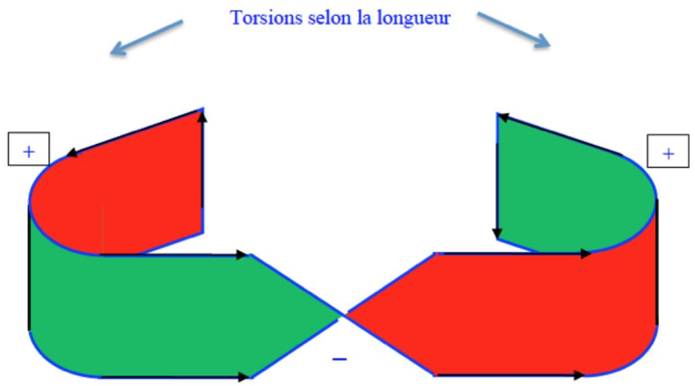

Torsion selon la largeur

Une torsion imprimée à une bande de papier est un mouvement qui inverse deux dimensions sur trois : toujours la hauteur, l’autre dimension inversée étant, soit la longueur, soit la largeur. Je dis bien une bande de papier, car en supposant un matériau plus souple, ou plus rigide, les torsions ne fonctionnent pas de la même façon. Par exemple, avec du tissu ou de la pâte à modeler, on obtiendra le modèle de Lacan, repris par Vappereau et tant d’autres :

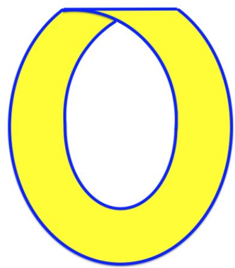

Le problème, c’est qu’il est dit, par Mœbius comme par Lacan, Vappereau et tant d’autres, qu’il s’agit d’une bande de papier. Or, une bande de papier n’a pas ces caractéristiques. Je sais bien qu’en topologie le principe est de travailler avec des surfaces souples et extensibles autant qu’on le veut. Mais alors, on ne dit pas que c’est une bande de papier. J’ai entendu parler de stages de topologie, notamment avec Jeanne Lafont, où l’on ne fait que des exercices avec du papier et des ciseaux. J’ai même assisté à des exposés sur des modèles de bouteille de Klein et de cross cap réalisés en papier. A l’époque, je dénonçais d’ailleurs cet usage du papier pour ces deux objets, car ce sont des objets vraiment théoriques, pour le coup, devant être modelés dans des surfaces auto-traversantes, ce qui n’existe pas en réalité. Il y a donc erreur sur la marchandise.

Et cette bande de papier, la bande de Mœbius, possède des caractéristiques topologiques suffisamment intéressantes pour qu’on s’y attarde. Je dis bien topologique, « étude des lieux », car il s’agit bien d’étudier ce lieu, même s’il ne satisfait pas à la condition de souplesse et d’extensibilité des surfaces théoriques de la topologie.

Ayant rappelé ce qu’est la définition d’une torsion (mes opposants ne donnent pas de définition autre qu’intuitive), pour satisfaire à mes détracteurs qui n’admettent comme torsion que celles qui inversent la largeur, j'admets un instant, pour la démonstration, qu'il n'y a que des torsions inversant la largeur.

Je prends une bande de papier un peu plus mince, afin de faciliter les torsions. Je lui fais subir non pas une mais trois torsions inversant la largeur.

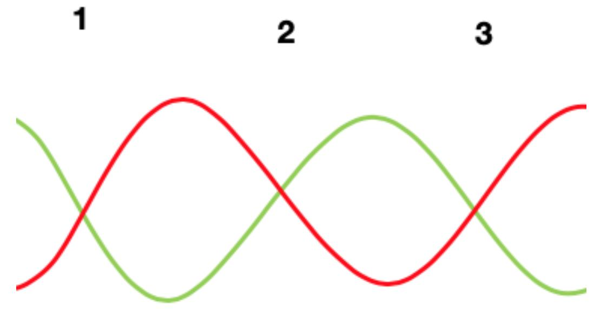

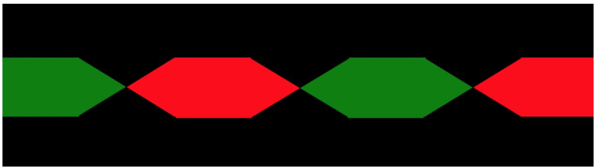

Je suis obligé néanmoins de faire les deux mouvements (que mes détracteurs ne veulent pas admettre comme torsion) pour rabouter.

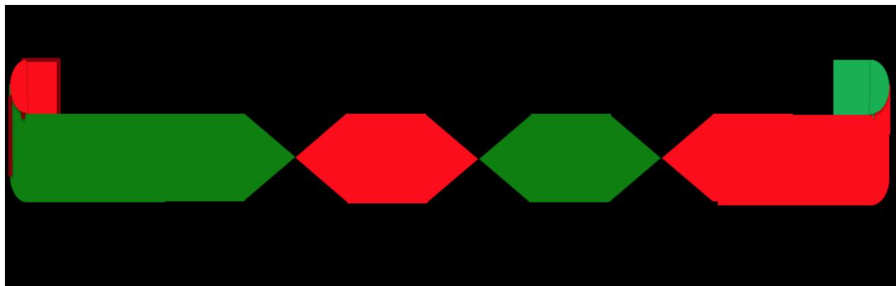

Qu’est-ce que j'obtiens ? une bande de Moebius à trois torsions HOMOGENES, c'està-dire que les torsions sont de même sens.

Tandis que lorsqu'on faisait subir à la bande une seule torsion (plus les deux mouvements de raboutages) on obtenait une bande de Moebius à trois torsions HETEROGENE, c'est-à-dire où les torsions n'ont pas le même sens.

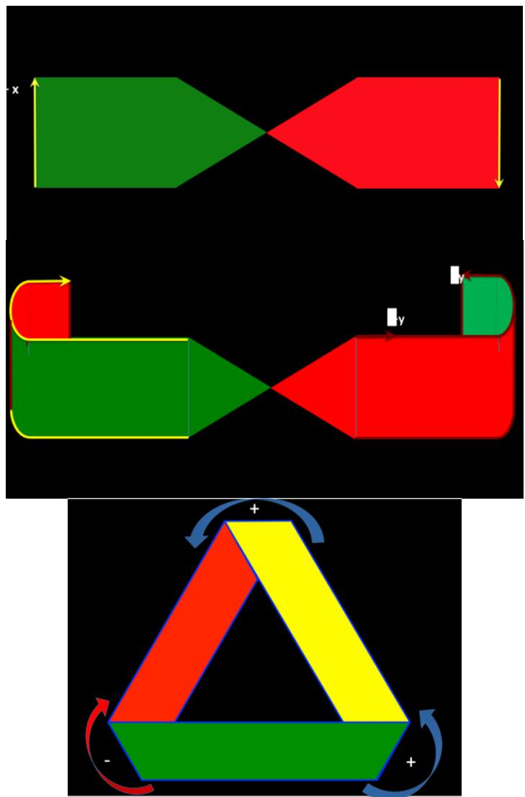  
Revenons à la bande de Moebius homogène, trois torsion à la base :

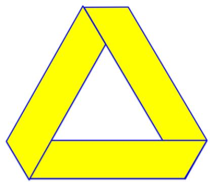

Ceci pourrait aller dans le sens de mes opposants car, si on compte les torsions comme moi, on avait trois torsions inversant la largeur, et on a au final seulement trois torsions. Pourquoi ? mes opposants diraient : parce qu'il n'y a que trois torsions, et que les deux mouvements de raboutage ne comptent pas.

Selon moi : parce qu’il y a deux torsions de sens contraire qui s'annulent. C'est l'intérêt de prendre en compte le sens des torsions. Et attention de ne pas aller trop vite. Les partisans de la « Une » torsion diraient : oui, bien sûr ce sont les deux mouvements (ou plis) de raboutages qui s’annulent. Eh bien il suffit de faire l’expérience.

Après avoir fait subir trois torsions de même sens à la bande, je raboute, et ça me donne ça :

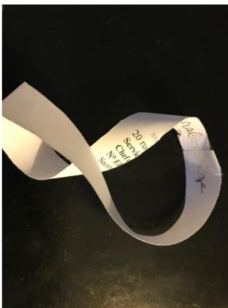  
Je mets à plat les trois torsions que l’ai imprimées au départ, afin de s’y repérer.

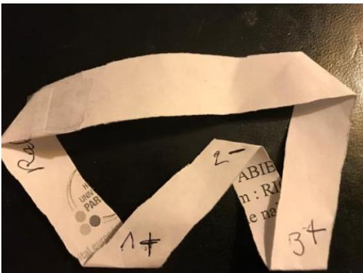

Je les note 1, 2, 3. Je note leur sens selon la définition arbitraire que j’ai donnée du sens : en se choisissant un sens de rotation :

– de dessus à dessous : +

– de dessous à dessus : -

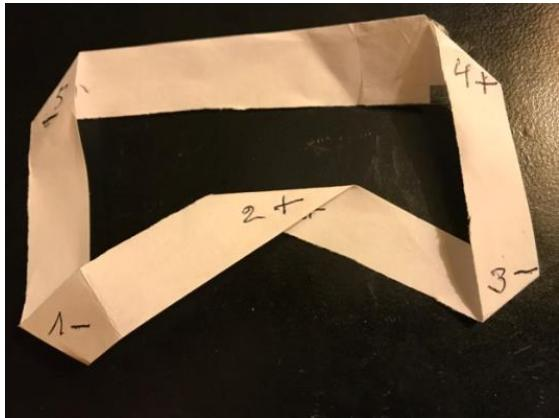

Je note aussi les « mouvements de raboutage », que je n’ose encore pas appeler torsion : 4 et 5. Il s’avère qu’ils sont de sens contraire : le « bon sens » intuitif voudraient que les contraires s’annulent. Je triture un peu la bande pour faire agir cette annulation.

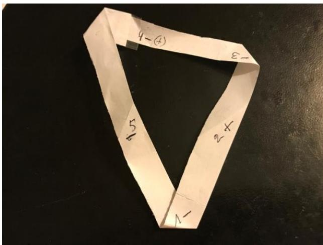

Or, force est de constater que sont les « plis » 2 et 5 qui se sont annulés ; certes, ils étaient de sens contraire, mais pas contigus ! l’intuition qui aurait fait dire que c’est la contiguïté de torsions contraires (4 et 5) qui provoque l’annulation s’avère fausse. La torsion 4, je peux l’appeler torsion, maintenant, car tout le monde l’appelle torsion dans cette présentation de la bande de Moebius à trois torsions homogènes. C’était pourtant un des « plis » contesté au départ comme n’étant pas une torsion. Et force est de constater qu’il a changé de sens. Par contre une des « torsions » de départ, incontestablement appelée torsion par tout le monde, s’est annulée, la 2.

Ce ne sont donc pas les deux mouvements de raboutage qui s’annulent, contrairement à ce que dit la doxa à laquelle je me heurte depuis 20 ans. C’est l’un de ces mouvements (5) et l’une des torsions de départ (2), censée ne pas s’annuler. Or, par quoi une torsion peut -elle être annulée, si ce n’est pas une autre torsion ?

Démonstration est faite que tous ces « mouvements » ou « plis » sont des torsions. Si on se rappelle bien, j’avais montré comment la torsion 2, comme les trois torsions de base, est une torsion inversant la largeur, tandis que la torsion 5 était une torsion inversant le la longueur. Démonstration est faite qu’il n’y a pas de différence fonctionnelle entre ces deux types de torsions.

Effectuons maintenant le même travail avec 4 torsions.

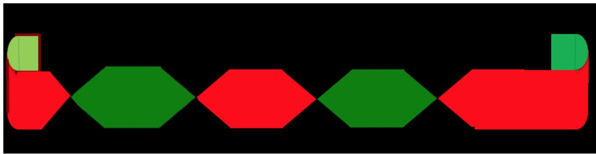

On obtient ceci :

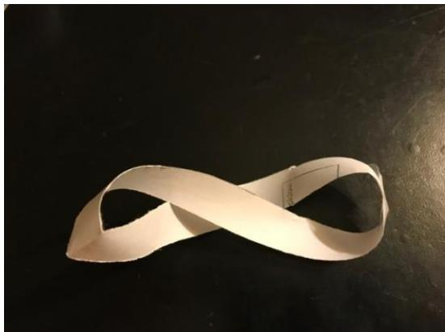  
Mettons à plat les 4 torsions de base, en les isolant des deux mouvements de raboutage :

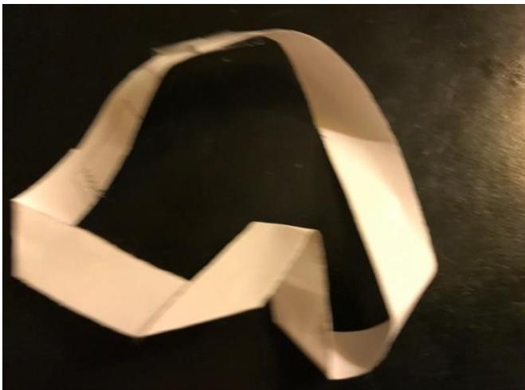

Mettons à plat ces deux mouvements de raboutage et numérotons les en donnant un sens aux torsions :

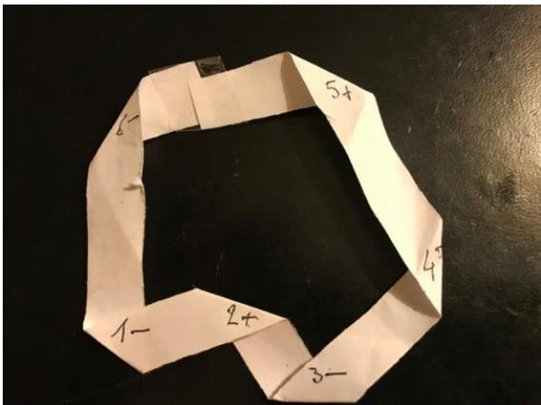

Comme précédemment, nous constatons que des torsions, a priori effectuées d’un mouvement de même sens, sont de sens contraire. Les deux mouvements de raboutage sont aussi de sens contraire. Or, après trituration pour faire jouer les annulations, nous constatons la même chose que précédemment :

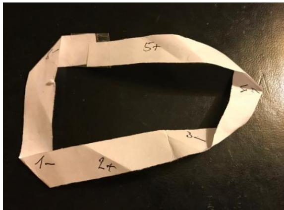

Ce sont les torsions 2 et 5 qui se sont annulées, et non les deux torsions de raboutage. Et cette fois nous avons obtenu un bilatère c'est-à-dire une surface à deux faces.

C'est autre chose. C’est ce qu'on obtient lorsqu'on coupe la bande longitudinalement en longeant le bord.

Quel que soit le nombre des torsions qu'on imprime à une bande, n, les torsions de sens contraire s'annulent toujours ... sauf à la base, quand on fait une bande de Moebius à "une" torsion, qui sont en fait trois. C'est ça l'intérêt unique de cette bande, car bien que de sens contraire, elles peuvent se substituer l'une à l'autre comme dans ma démonstration vidéo.

https://www.youtube.com/watch?v=e\_bhuuzdMUw

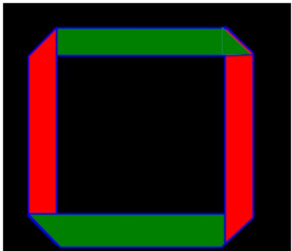

La bande obtenue est un bilatère (deux faces). Ce n'est pas une bande de Moebius. Pourtant elle présente bien 4 mouvements, que moi j'appelle des torsions. Ce n'est pas un cylindre (qui a aussi deux faces),

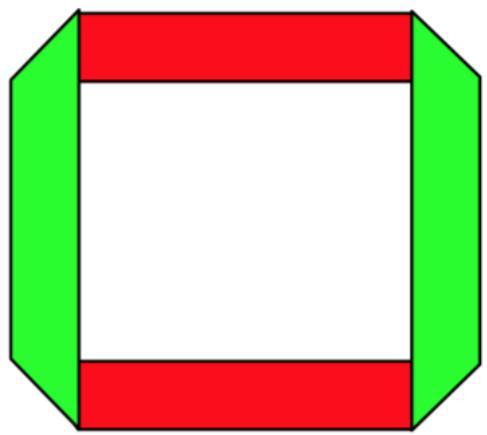

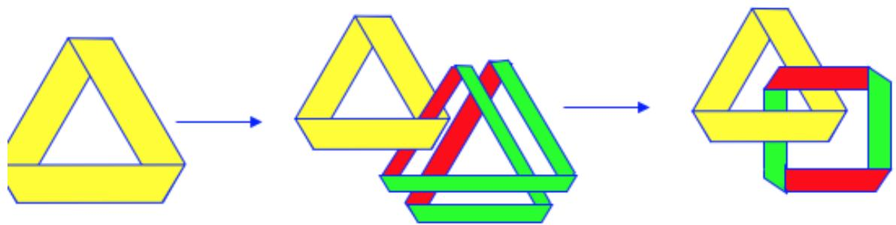

On peut ainsi produire des bandes à n torsions : on se rend compte que c'est une bande de Moebius si le nombre des torsions est impair, et c'est une bande du type de la bande à 4 lorsque n est pair. Et là on est bien obligé de parler du nombre de torsions. Simplement, ce n'est pas l'inversion de la largeur ou de la longueur qui est déterminant, c'est le nombre. Sens des torsions, nombre, tout cela compte.

Si, une dernière fois, on veut en rester au point de vue de mes opposants, on donne la définition suivante : une torsion est ce qui permet de mettre en rapport une face et une autre face afin de construire un unilatère. Et rien d'autre. Mais cette définition-là, il fallait la donner, au lieu d'en rester à l'énoncé d'un préjugé, ce qui en général le cas des dits détracteurs. Alors j'aurais pu dire : bien, nous n'avons pas la même définition. Et c’est une question de mots, il suffit que nous nous entendions bien sur les définitions, qui peuvent être divergentes. Mais même cette définition se conteste, car d'un point de vue externe on peut très bien voir comment une torsion selon la longueur met en rapport les deux faces, sauf que ce n'est pas le même rapport.

Différence entre le cylindre (4 torsions de sens opposés) et le résultat de la coupure à deux tours de la bande de Moebius (4 torsions de même sens) :

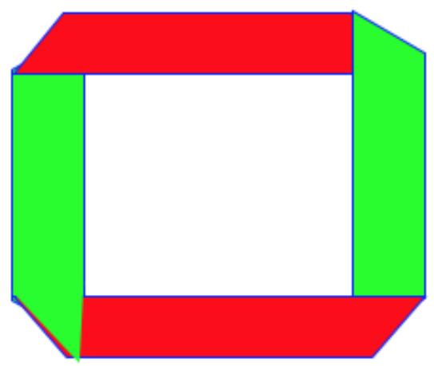

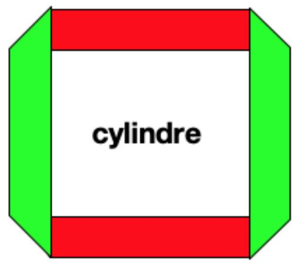

Rien ne permet de distinguer les torsions de l’un des torsions de l’autre, si ce n’est leur SENS. Dans les deux cas il s’agit d’un bilatère, c'est-à-dire d’une surface à deux faces.