# Des raisons d’une écriture à torsions

Je profite du message de Margarita pour l’inclure dans la discussion sur la bande de Moebius.

Par exemple le malentendu sur pli et torsion… je vais tenter de m’en expliquer encore une fois. Sans espoir d’être compris, puisque je m’aperçois qu’en effet c’est incompréhensible, mais, comme dit Lacan, ça n’empêche pas de s’expliquer. Celui qui s’explique y gagne toujours, contrairement à celui qui, en guise d’explication, se retranche derrière la citation, c'est-à-dire derrière la doxa.

N’empêche Jean Pierre, le lien que vous avez donné à ce site de mathématique ne marche pas. Dommage, j’y serais bien allé voir quand même. Parce que, entre autre, c’est bien la définition à laquelle Gabrielle ne cesse de se référer sans jamais l’avoir prononcée de façon aussi claire et avec une référence aussi précise.

Vous savez on dit souvent, pour résoudre un problème, il faut changer de référentiel c'est-à-dire de point de vue. Il y a des tas de petits pièges mathématiques comme ça qui circulent. On vous pose un problème apparemment insoluble… sauf si on sort du cadre dans lequel il a l’air d’être posé. Mais c’est tout simplement vrai de la solution des équations du second degré : pour celles qui n’ont pas de solution dans l’ensemble des réels, ni dans l’ensemble des rationnels, alors on invente l’ensemble des imaginaires. Et là, on a les solutions qui manquaient.

Je reviens au malentendu de Margarita : je dis ceci vous dites cela, nous ne sommes pas d’accord. Parce que nous avons chacun un référentiel différent. Le truc de l’analyse c’est de passer au référentiel commun : l’analyste accepte de laisser tomber son moi comme référence. Mais pas le sujet, puisque ce sujet c’est la fonction qu’il a en commun (pas au même moment, mais c’est la même fonction) avec l’analysant. Par conséquent on cesse de se référer à l’objet du malentendu - vous le voyez comme ci, je le vois comme ça - mais à la mise en œuvre de la fonction sujet.

C’est ce que je fais ici pour mon compte. C’est pas facile paskya un objet entre nous : cette foutue bande de Moebius. Alors on peut se référer en effet aux définitions dites mathématiques telles que jean Pierre nous en a fait citation l’autre jour. J’ai déjà montré en quoi c’était une définition qui ne nos permettait pas de sortir du cercle car le cercle est justement posé comme une donnée de départ. Or s’il est vrai que pour nous tous le langage est une donnée de départ, notre façon d’y rentrer suppose effraction, malentendu, ce fameux négativisme des enfants qui peuvent dire non à tout et n’importe quoi au simple motif que niant un objet éventuellement très rationnel évident, nécessaire et tout ce que vous voulez ce qu’ils veulent par leur « non ! » c’est mettre en route de la fonction sujet. Je l’avais décrit ici je crois à moins que ce ne soit sur une autre liste, cette anecdote de mon petit fils courant vers la route en transgressant l’interdit qui lui a été fait, interdit légitime, évident, nécessaire, mais qui préférait le transgresser en rigolant… y’a rien de plus rigolo que de mettre en route (sic) de la fonction sujet.. au risque de sa vie.

Donc ce cercle, nous n’y entrons qu’à condition de le briser pour le reconstruire à notre façon. Voilà ce que dit la construction de la bande de Moebius. Alors je brise la définition mathématique, à laquelle il est de bon ton de se référer (à défaut de la comprendre, ça fait cultivé) ce qui me permet de mettre à jour des propriétés d’une portée sans égale.

Je dis ceci : le point de vue intrinsèque dont on nous a bassiné comme étant le nec plus ultra de la topologie, ce point de vue n’a pas de sens. Car, et là je sais que Marie Laure est d’accord, de ce point de vue, on ne peut rien dire : c’est l e point de vue de l’autiste. Sur une sphère, le paradigme de la catégorie des sphériques en topologie classique et lacanienne, du point de vue intrinsèque je peux aller n’importe où, je ne change pas de bord, je suis toujours sur la même face. Je suis sur un unilatère sur un bilatère rien ne me permet d’en juger. A cela il y a une objection : oui, mais nous nous supposons non sur un objet matériel mais sur un objet mathématique sans épaisseur, et donc, étant sur une face je suis aussi sur l’autre. Ah, très bien avec cette définition si je suis sur une sphère, c’est que je suis sur une bande de Moebius : je suis toujours sur les deux faces en même temps.

Seule la référence à un point de vue extrinsèque, celui qui par exemple manipule le petit bonhomme se baladant à la surface et censé n’avoir qu’un point de vue intrinsèque, seule la référence à ce point de vue extrinsèque permet de saisir qu’il y a, par rapport à la sphère, un dedans et un dehors, qu’on la considère comme ayant deux faces, ou qu’on la considère comme n’ayant qu’une face sans épaisseur. Considérer la surface du seul point de vue de la surface comme on nous dit qu’il faut le faire pour entrer en topologie est un impossible : pas de surface sans trou autour. C’est un réel, et comme toujours du réel, on ne peut rien dire. Malheureusement nos topologues en disent quelque chose, et le disant, s’imaginent dire quelque chose du réel, ce qui justifie du coup toutes les assertions : le réel est comme ça, et vous ne pouvez pas dire autrement.

J’ai pris acte de ce point de vue extrinsèque nécessaire à l’établissement d’un point de vue intrinsèque, au même titre qu’il s’agit de pouvoir faire la distinction dedans dehors. Comme les enfants qui commencent à dessiner des gribouillis, et puis soudain, un jour, ils arrivent à boucler une boucle : il y a un dedans et un dehors. Ça veut dire qu’ils ont un moi, une image du corps et qu’ils peuvent donc à présent jouer sur les ouvertures et fermetures, le rapport à cet autre qui est dehors mais ne cesse de vouloir rentrer dedans pour informer l’enfant selon ses désirs. C’est ça d’ailleurs, l’inceste, ce n’est pas seulement une affaire de baise intergénérationnelle. Encore une fois c’est nécessaire, comme tout aussi nécessaire est la résistance de l’enfant, comme la résistance de l’analyste. La résistance de l’analysant je la lui laisse : à lui de s’en expliquer. J’ai assez à faire à m’expliquer de la mienne, ce en quoi je suis analysant.

Alors voilà j’en viens enfin à la bande de Moebius. Prenant acte de cette nécessité de la dialectique intrinsèque extrinsèque, je considère que ce sur quoi je travaille lorsque je fais de la théorie est un écrit. Oui, il n’est de science que de l’écrit, car l’écrit peut se transmettre indépendamment de la fonction sujet : ça ne parle pas. En même temps, s’il n’y a pas de sujet pour écrire, s’il n’y a pas de sujet pour lire, l’écrit reste lettre morte. Il n’existe pas. Tout écrit est sur un à plat. Que ce soit l’écran d’ordinateur, la feuille de papier, la feuille de papyrus, le flanc d’une jarre ou d’une colonne, c’est une surface. L’écrit met à plat ce qui se dit, qui lui, ne sera jamais une surface : ça reste dans la troisième dit-mention.

C’est génial ce jeu de mot de Lacan mais il ne l’avait jamais explicité comme je l’explicite moi-même : mention du dit, c’est mentionner ce qui ne peut s’écrire mais le mentionnant, on l’écrit, tout en sauvegardant cette distance entre le dit et l’écrit, c'est-à-dire entre le dit et sa mention. C’est pourquoi je ne suis jamais assertif, contrairement à Vappereau qui en faisait une doxa. Ce que je dis n’est jamais que ce que je dis, c’est mon point de vue, ce n’est pas la caractéristique de l’objet devant s’imposer à tous les sujets. Et pourtant il y a des objets aussi, et il faut bien qu’on se mette d’accord sur un certain nombre d’objets comme on se met d’accord sur un prix afin que se fasse l’échange. Comme quoi, à la dialectique de l’intrinsèque et de l’extrinsèque du dedans et du dehors, il faut y articuler la dialectique de l’objectif et du subjectif.

Alors , à plat, un pli c’est une torsion. Voici un cylindre, mis à plat, c'est-à-dire vu dans une perspective qui nous permet de lire un cylindre sinon, si les boucles ne sont pas un peu décalées on voit un rectangle, et c’est tout.

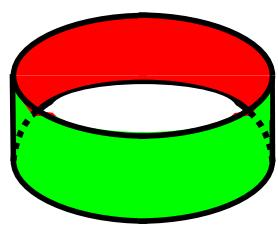

C’est un objet objectif, un cylindre on peut en construire un, on peut le dessiner, on peut le mettre à plat de différente façon notamment avec 4 torsions si on veut :

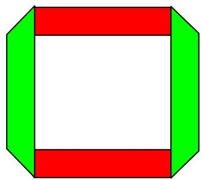

Ça, c’est une parfaite mise à plat dans laquelle ce qui est écrit sous forme de boucles dans la représentation précédente est ici écrit sous forme de pli. C'est-à-dire de torsion. Ce n’est pas une torsion ? Si on s’en tient à ce que j’ai définit de la torsion : passage d’une face à une autre on passe bien d’une face à une autre, du point de vue qui est le notre, le point de vue de quelqu'un qui lit quelque chose qui est écrit.

Mais on pourrait l’écrire ainsi, en tenant compte des définitions de la topologie classique: les objets sont souples :

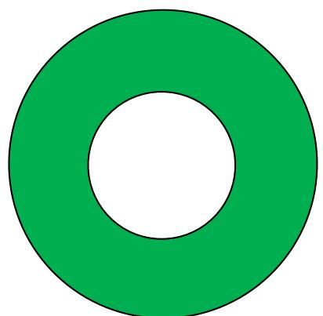

Un cylindre n’est pas autre chose qu’un disque troué. Alors là, en effet, pas de torsion. Et il faut passer à l’écriture de la bande de Moebius « classique » pour inaugurer une torsion. Or ceci est une opération dont on peut tenir compte ou pas : il s’agit justement de l’écrasement, de la mise à plat, de la perte de la troisième dit-mention. En se situant dans la définition classique d’une topologie d’objets en caoutchouc, on néglige cette différence qui est à mon sens fondamentale. Je me suis amusé à « mettre à plat » ce qu’impliquait cette mise à plat. J’ai calculé (oui, là j’ai été obligé de revenir à la mesure) la quantité de surface supplémentaire que supposait cette mise à plat. C’est là : http://pagespersoorange.fr/topologie/3torsionsBMdemo9.htm

Avec ce constat paradoxal : pour donner une écriture de la coupure (la bande de Moebius est une coupure) on rajoute de la surface. Car, en terme de perte de la troisième ditmention, cette mise à plat est la même pour le cylindre ou la bande de Moebius.

Mais cet objet, si on le considère comme objet, a une autre face :

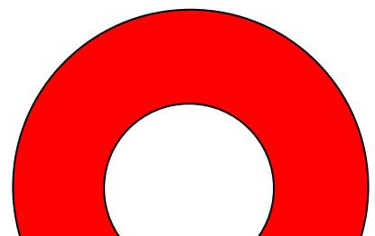

Comment accède-t-on à cette autre face ? Par une torsion. Il faut retourner l’objet, ce qui est exactement l’opération de la bande de Moebius qui retrouve ici son caractère d’écriture d’une fonction et non d’un objet : c’est l’écriture de la fonction qui permet de retourner l’objet cylindre écrit de cette façon. Donc pour un interlocuteur extrinsèque de cet objet, qui apparemment est sans torsion, il faut inclure au minimum la torsion de retournement, sans quoi on loupe l’existence de son autre face et on peut aussi bien le considérer comme n’ayant qu’une face, la verte, c'est-à-dire comme, en définitive, une bande de Moebius. Et de ce fait on peut dire que cette torsion, représentée par le bord de l’objet, est intrinsèque à l’objet pour l’observateur extrinsèque, qui ne saurait s’en passer. Comme on le voit en écrivant, la torsion ainsi conçue, écrit non seulement la troisième dit-mention mais aussi le temps, caractéristique de la parole et de la vie humaine.

J’en suis donc revenu à une nécessité de se conformer à la rigidité de l‘objet, qui permet d’en dévoiler la structure par les contraintes en découlant pour la mise à plat. Ces contraintes me semblent de celles qui s’imposent à nous entre le dire et la dit-mention, le dire et sa mise à plat, la parole et l’écriture. Je tiens donc compte d’une double contrainte : la nécessité de la mise à plat pour toute écriture, la nécessité de conserver la rigidité du support traditionnel de cette mise à plat, le papier.

Curieusement c’est cette admission d’une contrainte physique qui nous permet d’accéder au concept, un concept évidemment différent de celui qui découle de la souplesse des objets topologiques de la topologie classique. Car cette contrainte permet de parvenir à une définition de la fonction, tandis que la souplesse ne permet que de produire une nouvelle façon de catégoriser les objets : il y a des objets troués et des objets non troués, des objets ouverts et des objets fermés, des sphériques et des asphériques etc…on en reste à un mode de pensée catégoriel (physique d’Aristote) et non fonctionnel (lois de Galilée).

Curieusement, les mêmes topologues qui travaillent ainsi sur un concept d’objet bande de Moebius indépendant des contraintes du papier, sont les mêmes qui vont travailler sur les coupures d’une bouteille de Klein en papier, ou un cross cap en papier, oubliant cette fois qu’il s’agit d’un pur concept irréalisable dans le monde matériel. Ils tirent alors des conclusions du modèle de papier comme s’il s’agissait d’un objet physique, se situant en physicien, tout en continuant à travailler sur une bande de Moebius qui ne serait pas un objet physique mais une pure écriture théorique.

Je me situe dans le même paradoxe, mais à l’envers : tant qu’on peut réaliser l’objet en papier, j’accepte les contraintes de l’objet physique, mais pour construire un concept, tandis que lorsque le concept impose une impossibilité physique de l’objet, j’y renonce, me bornant au concept. Mon paradoxe et que, acceptant les contraintes de l’objet physique pour la bande de Moebius, j’en étudie l’écriture, et il s’en découle aussi une étude du phénomène perceptif ; je constate que ce dernier fonctionne déjà comme une écriture, donnant raison à Freud lorsqu’il nous dit, dans son commentaire du schéma de la lettre 52, que la perception doit de rabattre sur la représentation, soit, les deux extrémités de son schéma.

Pour reconnaître un objet de la perception, nous dit-il, il faut en avoir une représentation, pour pouvoir faire la comparaison entre ce qui est dedans, la représentation, et ce qui est dehors, la perception. Il y a deux faces, perception et représentation, mais c’est la même : son schéma est déjà une bande de Moebius, conforme à l’écriture que j’en propose. Mais pour avoir une représentation dedans il faut qu’elle y soit rentrée, et il faut disposer d’un dedans s’opposant à un dehors, c'est-à-dire d’une image du corps qui est déjà une représentation opérant la limite, la coupure entre le dedans et le dehors. C’est là le paradoxe que ma construction conceptuelle de la bande de Moebius reflète. Il faut avoir perçu pour se représenter, et on ne peut percevoir si on n’a pas de représentation. C’est tout cela que suppose les apprentissages d’un enfant qui ne cesse de faire ce va-et-vient qui n’est autre chose qu’un fort-da. Qui ne cesse de fabriquer des écritures, c'est-à-dire de la mémoire, en se débrouillant comme il peut entre ce qui ne cesse pas de s’écrire (le réel), ce qui cesse de ne pas s’écrire (la mémoire), ce qui, du coup, ne cesse pas de s’écrire (le symptôme), et ce qui cesse de s’écrire (la lecture à haute voix, pour un autre qui entend, du sens du symptôme).

Ainsi le paradoxe de l’écriture, c’est ce qui fait lire des plis, c'est-à-dire des torsions, sur l’écriture du cylindre, alors que cet objet est censé ne pas faire un pli, être sans torsion. Car il n’y a pas d’objet sans sujet pour le lire. Même lorsqu’on regarde l’objet comme tel, l’objet non mis à plat, il nous apparaît comme dans la mise à plat : notre perception est informée – déformée si on veut- par la représentation. En quelque sorte, nous voyions l’objet en perspective parce que la perspective est l’encodage que nous avons intégré pour percevoir ce que nous nommons la réalité.

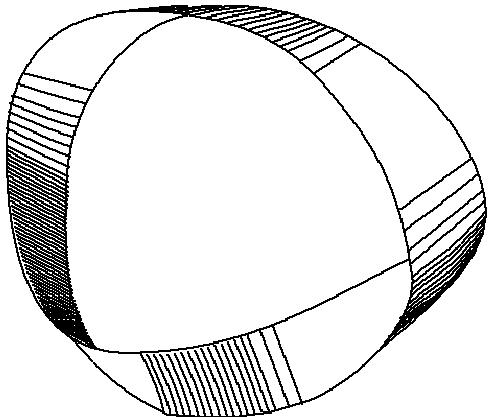

Là où c’est encore plus intéressant, c’est lorsqu’on s’aperçoit que, dans cette apparence des trois torsions, si on cherche la torsion « initiale », celle qu’on a fait pour faire une torsion, pas celle qu’on a dû faire pour rabouter, on ne la retrouve pas. La représentation ci-dessus est bien celle d’un bande de Moebius hétérogène, avec une torsion de sens contraire, ça on peut le repérer ; ça c’est une différence pertinente. Mais les trois torsions comme telles, elles ont toutes pris le même aspect, l’aspect d’un pli. Même la dite torsion originale a pris l’aspect d’un pli, exactement comme sur l’écriture d’un cylindre (ou la perception d’un cylindre). Et le plus rigolo, lorsqu’on a pris soin de noter par une marque extrinsèque quelle était cette torsion originale, on s’aperçoit que ce n’est même pas celle qui s’avère de sens contraire aux deux autres : elle a pris le même statut que l’une des deux torsions du raboutage ! Par conséquent la différence pli et torsion n’est pas un artéfact de mise à plat, ce n’est pas une différence pertinente : il y a toujours un artéfact de mise à plat, car l’humain, du fait du langage, fait de sa réalité un artéfact. Un fait de l’art.

D’où l’intérêt de se pencher sur la façon dont la perspective a été inventée : la perspectiva artificialis se veut l’exacte copie de la perspectiva naturalis, et pour cause puisque c’est la même, c'est-à-dire que l’encodage est le même, il ne suffisait que de trouver les règles de cet encodage. Or ces règles sont précises. Elles sont objectives, mais en tant qu’elles sont le fait d’un sujet qui se donne objet ! Découvertes par Brunelleschi, puis mises en forme et théorisée en dessin par Piero della Francesca, enfin théorisée en écriture par Alberti : il fallait trouver l’organisation des lignes supportant les dimensions, en trouvant les règles de leur intersection. Pour cela deux opérateurs sont nécessaires : le point de fuite et le point de distance qui, au croisement des lignes qui convergent vers l’un et vers l’autre, permettent d’élaborer le troisième opérateur à leur intersection, celui qui, permettant de tirer la projection des horizontales dans le tableau, va donner l’exacte mesure des diminutions à accorder aux objets en fonction leur éloignement fictif.

Pour assurer une illusion perspective correcte, le point de fuite ne suffit pas. En effet si nous partons du plan au sol d’un édifice (la nature ne présentant pratiquement pas de ligne droite, elle se prête moins à l’exercice) représenté par un carrelage régulier :

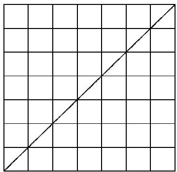

Le point de fuite permet une projection dans le tableau de toutes les droites parallèles entre elles et perpendiculaires au tableau, soit les y, pour leur donner un nom :

Projections des y dans le tableau

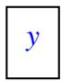

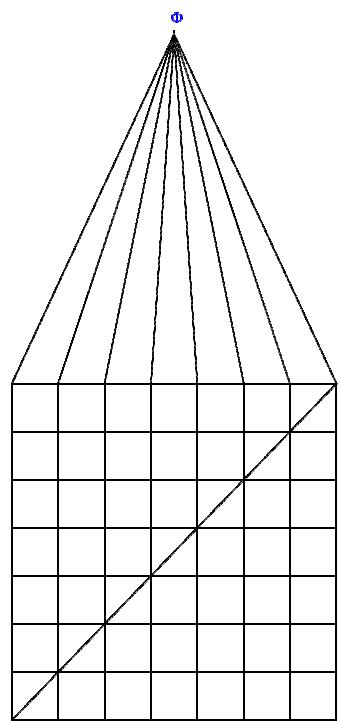

On sait intuitivement que les proportions des objets diminuent au fur et à mesure de leur éloignement. Mais dans quelles proportions exactes ? Le point de distance donne réponse à cette question. Le point de fuite définit le lieu où va passer la ligne d’horizon. C'est sur cette ligne qu’on se choisit un point de distance, peu importe à quelle distance d’ailleurs, ce n’est là qu’une question esthétique. Par contre, ce point sera celui où on va faire se rejoindre des droites z issues de chacun des points de concours entre les droites y et leurs projection dans le tableau. Ce sont les projections de toutes les diagonales du tableau. Leur faisceau croise celui des droites concourant au point de fuite. Les points d’intersection donnent le lieu où passent aussi les horizontales, projections dans le tableau des horizontales  x du plan au sol.

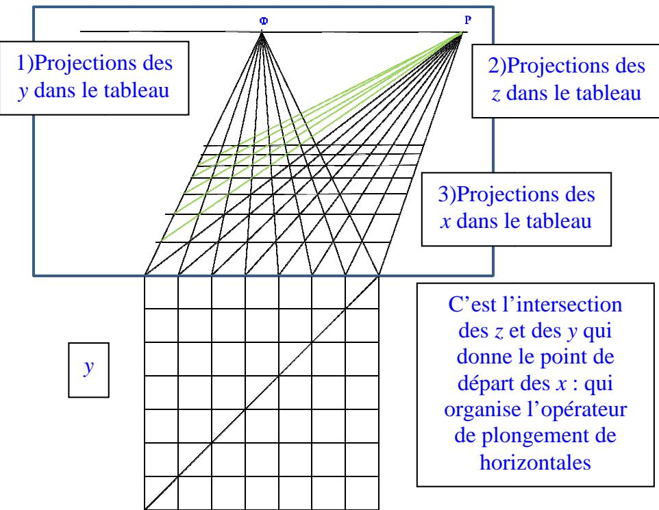  
La diminution des distances entre elles, ainsi imposée, est celle qui convient.

Je n’ai pas hésité à nommer Φ le point de fuite et P le point distance, en référence à ce que ces deux lettres dénomment dans les schémas de Lacan R et I, le phallus et le Nom-du-Père. Le troisième opérateur, je le nomme l’objet a, au sens de la fonction de l’objet. $\mathbf { C } '$ est en effet ce qui prend le statut de surface dans le schéma R, la bande centrale comme bande de Moebius. Les deux trous Φ et P qui encadrent le schéma en seraient rien sans la surface qu’ils délimitent au centre (fonction de l’objet, résistance qui détermine la pulsion  en la courbant en retour), lieux des moi qui se prennent en objet d’interlocution, la relation $\boldsymbol { a } \cdot \boldsymbol { a } ^ { \prime }$ du schéma L.

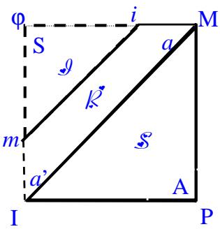

Trois fonctions sont donc nécessaires pour assurer la projection de la perspectiva naturalis dans la perspectiva artificialis, une par dimension. C’et le prix de la mise à plat qui nous informe non seulement de comment se construit un tableau en perspective, mais encore dans quelle perspective nous envisageons la réalité. Sans le savoir, nous évoluons dans un espace à trois dimensions qui est encodé de la même façon que nos représentations.

Ce pourquoi, même dans l’espace, lorsque nous regardons une bande de Moebius « sans pli », nous voyons trois torsions : notre perception met à plat en nous donnant une vision du relief encodée de la même façon que l’illusion du relief dans une peinture du quattrocento. Un tel tableau peut être lu comme une bande de Moebius : il n’a qu’une face, et pourtant l’astuce du peintre nous fait distinguer un premier plan, confondu avec le plan matériel du tableau, et un arrière plan virtuel s’achevant au point de fuite. L’un et l’autre peuvent se distinguer comme on peut, d’un point de vue local, distinguer une face et l’autre sur la bande de Moebius ; pourtant ils se présentent en continuité avec tous les plans intermédiaires unifiant l’espace du tableau comme illusion d’un trou, comme la bande de Moebius vue d’un point de vue global.

De plus cet objet bande de Moebius nous donne une projection de la façon dont nous projetons, c'est-à-dire dont nous construisons la réalité. Chaque torsion peut se lire en effet comme l’opération nécessaire à la mise à plat d’une dimension : trois sont nécessaires, de même qu’il est nécessaire de retourner l’objet « disque troué » (ou disque tout court, d’ailleurs) pour voir les deux dimensions de son autre face en passant par la troisième dimension, qui n’existe pas dans son écriture ; mais qui existe potentiellement dans … la fonction de l’objet ! C’est cette fonction qui se matérialise dans les règles de la perspective au croisement de la troisième (z) et de la deuxième dimension (y), pour faire apparaître la dite « première », les horizontales (x). C’est elle, cette fonction de l’objet, dont je tiens compte en revenant aux rigidités de l’objet de papier pour ce qui est de la mise à plat de la bande de Moebius.

C’est le moment de la recoupe dans le découpage d’une rondelle. Là je renvoie à : http://pagesperso-orange.fr/topologie/rondelle\_et\_4\_discours.pdf

Voilà donc tout ce dont on se prive en n’écrivant la bande de Moebius qu’avec une torsion et une boucle (qui vaut deux torsions).

Bien sûr on peut bien écrire, mathématiquement, abstraitement, des espaces à n dimensions. Mais ce qui compte dans notre réalité, c’est comment nous articulons les trois dimensions qui la construisent. Elles le font dans cette coupure essentielle entre deux espaces : l’espace à trois dimensions dans lequel évolue, seule la dit-mention de la parole, et l’espace de l’écriture, l’espace de l’écriture l’espace de la mémoire à deux dimensions qui consacre cette castration du passage des perceptions aux représentations. En ce sens, l’écriture de cette opération de passage se soutient d’un simple -1, ce qui nous ramène à la définition de Poincaré : un espace à n dimensions se définit d’être coupé par une espace à n-1 dimensions. Car il n’est pas d’espace intrinsèque ; tout espace se définit de l’espace voisin, c'est-à-dire de sa coupure, -1, la castration. L’homme ne se définit que de l’espace voisin, la femme qui elle même… représente la coupure dont l’homme se définit, et se représente en fonction de cet espace voisin qu’elle a contribué à définir.

Nous ne parlons que parce que avons pu mettre des mots en mémoire, c'est-à-dire parce que nous les avons écrits. Les écrivant en réseau bien sûr, car un signifiant représente un sujet pour un autre signifiant, nous dessinons des surfaces de ce qui produit notre mémoire des mots (les bords) et notre mémoire des choses (les surfaces qu’ils encadrent), c'est-à-dire les représentations qui nous servent ensuite de référence pour les perceptions.

Cette dialectique du deux et du trois, elle ne peut évidemment commencer qu’à trois : c’est pourquoi la bande de Moebius nous est utile écrite avec ses trois torsions. Le -1 de la torsion de sens contraire écrit littéralement cette coupure qui n’est pas lisible avec une seule torsion. D’autre part, cette seule torsion, quand on l’écrit ainsi, écrit bien la troisième dimension telle qu’elle s’imprime sur un objet à deux dimensions. On n’échappe pas à cette dialectique du deux et du trois, que l’Oedipe reproduit dans ses modalité maman-bébé/ maman-papa-bébé. Il y a bien d’autres modalités à l’Œdipe, mais c’est ainsi que le mythe a traduit la dialectique de la mémoire et de la parole actuelle.

C’est ainsi que le remet en jeu la psychanalyse, dans sa modalité propre.

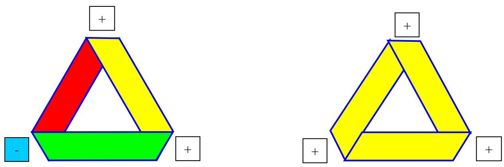  
lundi 5 janvier 2009