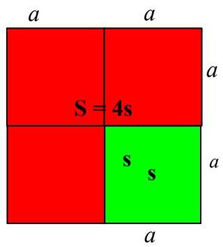
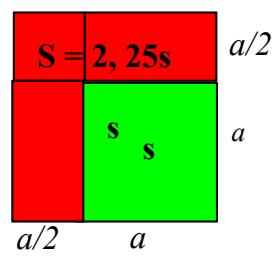
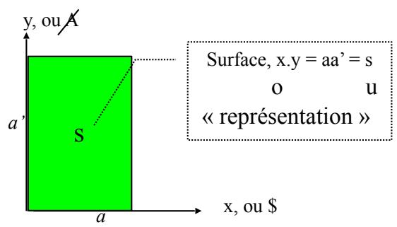
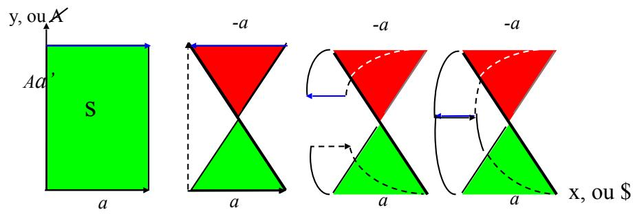
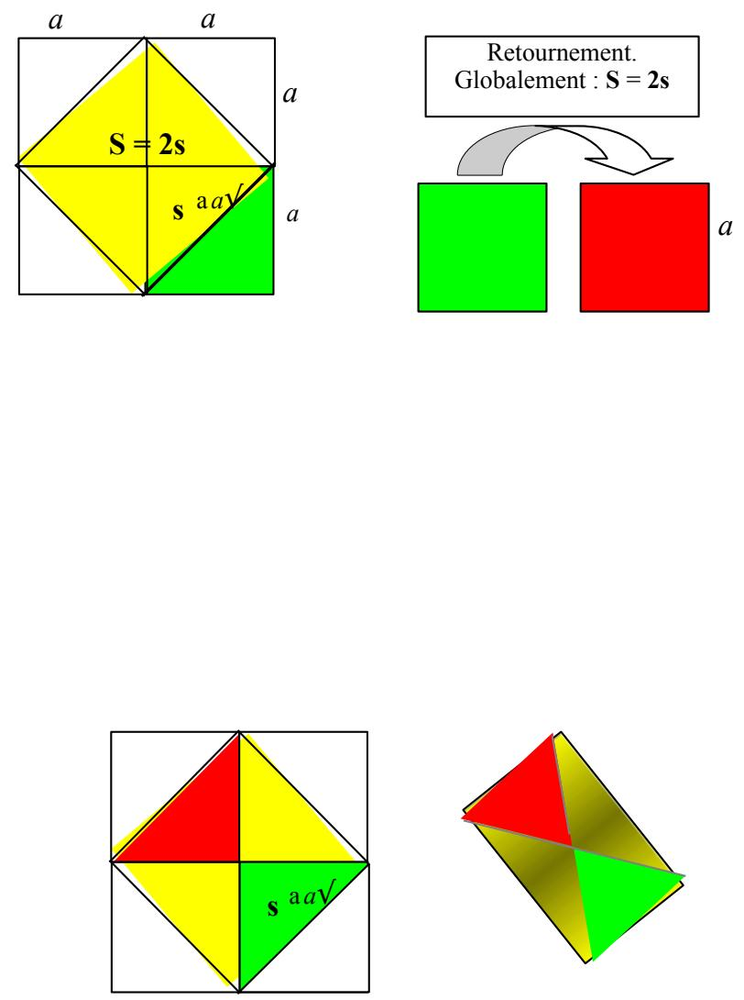

# LA DIAGONALE DE SOCRATE

Extrait de mon livre « le rêve de l’analyste »

Dirigeons-nous à présent vers un des écrits de Platon, le Ménon , qui1 est un dialogue où Socrate veut prouver à Ménon qu’il n’y a ni souvenir, ni savoir, seulement des réminiscences. Il s’agit de convaincre Ménon de la métempsycose c'est-à-dire de la réincarnation.

Tout homme sait. L’enseignement ne consiste pas à apporter un savoir que l’autre ne saurait pas, mais à accoucher l’autre du savoir qu’il ne se sait pas savoir. Il s’agit de libérer l’esclave (puisque c’est l’esclave qui va être pris en exemple), de le libérer de sa passion du non-savoir. Comment s’y prend-il ? Socrate choisit un esclave, censé ne pas savoir, et va montrer à Ménon comment cet esclave sait malgré tout, à condition de l’accoucher correctement.

Il lui pose une question de mathématique : voici un carré de côté a (deux pieds). Sa surface sera a2 (quatre pieds). « Ne pourrait-il y avoir un autre espace, dit-il à l’esclave, double de celui-ci, mais semblable, ayant toutes ses lignes égales comme celui-ci ? »2

En termes plus accessibles à notre compréhension moderne : quel est le carré qui aura le double de la surface d’un carré donné? Ou : quelle doit être la longueur du côté d’un carré pour que sa surface soit le double d’un carré de coté a (dont la surface est par conséquent a2, le double étant 2a2).

Socrate trace des figures dans le sol (il écrit) et lui pose des questions habiles, de façon à trouver « quelle est la ligne », c'est-à-dire la longueur du côté du carré qui aura pour surface 2a2 . Socrate organise ses questions par des périphrases de l’ordre du dire : « dis-moi … essaye de dire…. réponds moi…qu’en dis-tu ? ». Il commence par faire éliminer à l’esclave toutes les mauvaises solutions, celle qui double la ligne (ce qui donne un « espace quadruple »),

(Doubler le côté ne double pas la surface, ça la quadruple !) …et celle qui ajoute une moitié de ligne (ce qui donne un espace de neuf pieds au lieu de huit) :

A un moment précis, la rhétorique change : « Tâche de me le dire exactement, et si tu ne peux faire le calcul, Si tu ne peux pas dire, montrela nous . » Nous voici brusquement plongés au cœur de la thèse3 psychanalytique : ce qu’il n’est pas possible de dire, je peux néanmoins, par une écriture, le montrer. Je traduirais ceci en langage freudien : ce qui n’est pas conscient, c’est la représentation de chose, en tant qu’elle n’est pas liée à une représentation de mot. La représentation de chose se manifeste seule sous la forme d’une des formations de l’inconscient : lapsus, acte manqué, rêve, symptôme. Lacan insiste bien là-dessus : « Il n’y a de lapsus que calami, même quand c’est un lapsus linguae ». Je4 traduirais beaucoup plus simplement dans mon langage d’aujourd’hui, 20 ans plus tard : ce que je ne peux pas dire, je peux le rêver. (ajout du vendredi 19 juin 2020)

En faisant référence au calame, Lacan pose ici les formations de l’inconscient du côté de l’écrit. Comme la diagonale du carré initial, qui est la réponse au problème formulé par Socrate, on ne peut la dire, on ne peut même pas la calculer, mais on peut parfaitement l’écrire. Ainsi en estil de tout problème qui ne trouve pas sa réponse dans la parole : il s’inscrit à l’état inconscient et un rêve, un lapsus, ou un symptôme en donnera une écriture.

Il se trouve que, dans le texte de Platon, c’est le moment où, de son côté, Socrate insiste auprès de Ménon, sur l’embarras de l’esclave :

« Socrate

Crois-tu donc qu’il se fût mis à chercher et à apprendre une chose qu’il pensait savoir, quoiqu’il ne la sût pas, avant d’être tombé dans l’embarras en se rendant compte de son ignorance et d’avoir senti le désir de savoir ? »5

Ménon

Je ne le crois pas, Socrate

Socrate

Il a donc profité à être engourdi ? »

Quelques échanges plus haut, Socrate avait en effet fait usage de cette métaphore : « En le jetant dans l’embarras, en l’engourdissant comme une torpille, lui avons-nous fait quelque tort ? »… qu’il confirme un peu plus loin : « « c’est ainsi que, chez cet esclave, ces opinions viennent de surgir comme dans un songe ».6

Je vais tirer juste un petit peu la couverture à moi, en rappelant, d’une part, les propos de Lacan nommant l’embarras comme dernière étape avant le passage à l’acte et l’angoisse , et en rapprochant, d’autre part, cet7 engourdissement du sommeil. Ce dernier est en effet l’état dans lequel nous laissons tomber notre savoir sur le monde, pour ne rester réceptif qu’à ce savoir inconscient qui, ne pouvant se dire, ne peut que se montrer en s’écrivant sur le tableau noir des rêves. L’esclave, sous les questions de Socrate, a en effet progressivement abandonné tout le savoir qu’il pouvait se croire posséder sur le doublement de la surface d’un carré. Il perd le contact avec ce qui soutenait sa réalité, sidéré d’en découvrir la fausseté. Le savoir inconscient se présente d’abord à lui comme indéchiffrable, et c’est l’évidence de ce mystère qui produit l’émergence du désir, sous cette forme fondamentale du désir de savoir. C’est bien ce type de désir qui précipite quelqu'un en analyse.

Alors Socrate, maître accoucheur, matrice des rêves, trace « cette ligne tirée d’un angle à l’autre », et amène peu à peu l’esclave à la réponse : « Cette ligne, les sophistes l’appellent diagonale. Si tel est son nom, c’est sur la diagonale, que selon toi, esclave de Ménon, se construit l’espace double ».8

Ensuite, Socrate, se tournant vers Ménon, lui fait admettre l’immortalité de la vérité des choses, présente dans l’âme de tout temps. Il opère ainsi un retournement sur la personne propre (« Wendung gegen die eigene Person ») : ce qu’on ne sait pas, on ne l’acquiert pas d’un maître,9 c'est-à-dire d’une autre personne, mais en cherchant en soi-même. Encore y faut-il l’habileté maïeutique de Socrate. L’autre est donc implicitement nécessaire, non pas comme pourvoyeur de représentations (objets, formulations du savoir), mais comme catalyseur de la représentance, (fonction, capacité de l’Un à produire des représentations).

Comme Freud, Socrate suppose dans le sujet la présence d’un savoir inconscient : « Ainsi donc, celui qui ignore une chose, quelle qu’elle soit, a en lui des opinions vraies sur la chose qu’il ignore ? ». « Apparemment » confirme Ménon, et nous agréons avec lui, sinon dans le domaine des choses du monde, au moins dans le champ de la Chose freudienne, das Ding. Ainsi, dans la maïeutique socratique, comme dans l’analyse freudienne, l’autre personne tient la fonction de l’Autre, opérateur du retournement sur la personne propre, lui permettant d’énoncer en vérité le savoir que, sujet barré, il ignore posséder.

Dans une simple interlocution entre un Sujet \$ et un Autre, A, dialogue de la vie de tous les jours, chacun ramène la couverture à soi : chacun apporte ses expériences, son vécu, ses sentiments, bref : ses représentations. Celles-ci ne sauraient voir le jour, passant du préconscient au conscient, que si l’autre qui écoute est là, assurant cette fonction d’Autre pour que la fonction Sujet de l’Un puisse s’exercer par la résonance de la voix, l’énonciation. Cet Autre est un autre sujet lorsqu’il parle, moment où notre sujet \$ est un Autre pour lui. Autrement dit, ces deux fonctions, le Sujet et l’Autre, s’échangent au gré de la prise de parole. $\mathrm { C } '$ est par leur échange (diachronique) et leur combinaison (synchronique) que ces deux fonctions font naître des représentations, de la même façon que deux dimensions engendrent, par leur produit, une surface.

Cette représentation ne serait pas forcément la même si, pour le sujet qui parle, la fonction d’Autre était tenue par un autre autre. On ne dit pas la même chose à tout le monde, et cette chose, si elle est la même, ne prend pas le même valeur en fonction de l’autre à qui on la dit. $\mathrm { C } '$ est ce qui fait tout le piquant du rapport à l’autre, permettant à Lacan de faire le jeu de mot : ce qu’on dit ment. $\mathrm { C } '$ est la raison pour laquelle nous avons écrit cette dissymétrie entre les longueurs a et $\boldsymbol { a } ^ { \prime }$

Cette surface qui émerge du produit x.y, rencontre d’un sujet et d’un Autre, n’a donc pas l’objectivité d’une chose du monde (qui se signerait d’un hypothétique $\boldsymbol { a } = \boldsymbol { a } ^ { \prime } )$ mais rend compte de la subjectivité qui ne s’actualise que dans l’altérité $( a \ne a ^ { \prime } )$ . Nous pouvons donc distinguer trois fonctions dans la production de cette surface $\mathrm {  ~ \ q u ~ } ^ { \mathrm { \scriptsize } }$ on nomme « représentation » ou encore « signification » :

la fonction énonciative du sujet \$, a, linéaire en x… … se complétant nécessairement de la fonction d’écoute de l’Autre, A, a’, linéaire en y…

… rôle tenu nécessairement par un autre, a, qui, se faisant sujet en retour(nement), infléchit, modalise…

… la réponse énonciative $\boldsymbol { a } ^ { \prime }$ du sujet … par retournement sur l’autre face du tissu considéré…etc…

Ce quatrième temps n’étant que la reprise du premier, nous avons bien trois fonctions, autant qu’il en faut pour boucler une coupure sur une surface indéfinie . Mais il est nécessaire que cette reprise soit effective10 comme redoublement du premier temps, qui $\boldsymbol { \mathrm { n ^ { \prime } } }$ est pas le premier. Ce quatrième temps sera donc celui de la torsion nécessaire à ce que la portion de surface se détache de la surface indéfinie du plan d’écriture, marquant l’altération que la réponse de l’autre a produit sur le propos du sujet. .

Je l’écris tout naturellement par le retournement de la réponse de l’autre sur le sujet qui reprend la parole en fonction de cette réponse, soit, la torsion d’un bande de Mœbius.

Celle-ci aura pour largeur a et la longueur de son bord unique sera $2 a ^ { \prime }$ , puisque nous avons mis en continuité les deux bords $\boldsymbol { a } ^ { \prime }$ . La surface obtenue sera donc le double de la surface initiale, $\mathrm { S } = 2 \mathrm { s } = 2 a a ^ { \prime }$

On peut lire de manière discordentielle la coïncidence des vecteurs orientés en sens inverse par la torsion : $a - a = 0$ et $a - a = a .$ . La première écriture se réfère à l’algèbre, la seconde à la géométrie.

A les lire ensemble, nous faisons de la topologie. L’inversion des vecteurs, au niveau de la lettre, nous oblige à lire une annulation, tandis que la bande obtenue a bel et bien la largeur a. $\mathrm { C } '$ est un discordentiel. $\mathrm { C } '$ est ainsi que cette surface, dite de Mœbius présente le paradoxe d’être à la fois surface (produit de deux dimensions) et coupure (l’une des dimensions s’annulant, il ne reste plus que l’autre, $\grave { a \ } )$ . Il est possible de conserver une seule formule condensée : $a - a = 0$ , en convenant de tenir compte du temps. La partie gauche se lit alors comme l’opération en instance, non effectuée, la partie droite comme effectuée. Le signe $\langle \langle = \rangle \rangle$ se lit donc plus comme une fonction d’identification, au sens dynamique du terme, que comme un constat d’identité.

A conserver ces deux lectures, nous faisons de la psychanalyse. Dans cet exercice, l’un des sujets se place plus spécialement en fonction d’Autre, annulant de l’échange son propre savoir, sa dimension $\overrightarrow { \mathbf { a } } \overrightarrow { \mathbf { \Gamma } } _ { ; }$ , et faisant entièrement confiance au savoir de l’Un. S’il lui vient des représentations, au lieu de les prendre pour « les siennes », il va faire l’hypothèse $\mathrm { \ q u } ^ { \prime }$ elles sont engendrées chez lui par le discours de l’autre, faisant ainsi coïncider $a$ et $\boldsymbol { a } ^ { \prime }$ . Et il ne ${ \bf \vec { S } } ^ { ' }$ en servira $\mathrm { { q u } } ^ { } \dot { \mathrm { { a } } }$ bon escient, c'est-à- dire dans le but de laisser émerger un savoir chez l’autre. Il se tient d’emblée pour nul $( a - a = 0 )$ , laissant à l’analysant la responsabilité du produit qu’il opère des deux dimensions qu’il met en jeu $( 2 a a ^ { \prime } { = } \mathbf { S } )$ , et des surfaces de représentations qui $\mathbf { \vec { s } } ^ { \prime } \mathbf { \vec { e } } \mathbf { \vec { n } }$ engendrent. L’autre dimension a sera celle mise en jeu par l’analysant, justement à la place de cet $a - a = 0$

Si, du fait de l’identification d’un a de l’analysant avec un a de l’analyste, un tel engendrement se produit aussi en lui, l’analyste, s’il en fait savoir quelque chose à l’autre, il ne le fera qu’en remettant en jeu de la torsion, c'est-à-dire de la coupure et non de la surface, de façon à ce que l’autre, non seulement engendre de lui-même des représentations, mais surtout trouve le moyen d’engendrer de la représentance (de la torsion ) par ses propres moyens (par l’usage, comme Autre, d’autres qui ne soient pas forcément supposés savoir). L’analyste opère ainsi le retournement sur la personne propre du premier sujet, ce qui engendre le redoublement de la surface, soit : non seulement l’apparition d’une Autre face, mais encore le repérage du mouvement de torsion par lequel ça se produit.

Et comment se produit l’annulation de a de l’analyste de façon à laisser le champ libre à celui de l’analysant ? Par le redoublement de cette torsion elle-même, c'est-à-dire le retournement sur la personne propre de celui qui est en position d’Autre et entend le rester. Il effectue sur luimême –analyse de ses résistances - ce que sa fonction l’amène à effectuer sur l’autre, de par ce que l’autre effectue comme effet sur lui.

C’est le cas de la maïeutique socratique – telle que Platon la conçoit idéalement - comme celui de l’analyse freudienne – telle qu’elle se produit réellement. Autrement dit : l’analyste ne produit cette fonction d’analyse qu’en étant l’analysant de son rapport avec l’analysant.

(ce n’est pas du tout l’opinion de Lacan, qui rejette toute analyse du contre transfert, décrit ici comme : l’analysant de son rapport avec l’analysant. Je n’avais pas encore perçu cela à cette époque, où j’étais encore très lacanien. On voit ici que j’avais pourtant déjà eu la bonne intuition, qui ici est plus qu’intuition, puisqu’issue d’un raisonnement mathématique. Ajout du vendredi 19 juin 2020.)

Plus précisément, la fonction de redoublement de la surface $f ( \mathbf { s } ) = \mathbf { S }$ telle que S = 2s peut s’exercer de trois manières : soit par le retournement et la mise en continuité de la surface avec son envers (on peut parfaitement faire une bande de Mœbius avec un carré), soit par le remplacement du côté du carré par sa diagonale (et d’ailleurs la bande de Mœbius obtenue à partir d’un carré se présente comme un triangle, sachant qu’on a dû le plier deux fois selon sa diagonale), soit enfin en soutenant un double point de vue sur le carré, celui qui considère globalement ses deux faces, pièce de tissu considérée comme « une », la surface de son envers s’ajoutant à celle de son endroit. Le retournement, comme nous venons de le voir, suppose la mise en jeu d’une parole dans une relation telle $\mathrm { \ q u } ^ { \prime }$ elle annule une dimension. Mais lorsqu’une parole ne peut être dite, $\mathbf { c } ^ { \prime }$ est une formation de l’inconscient qui prend le relais, en tant $\mathrm { \ q u } ^ { \prime }$ elle écrit, sur la même surface, sans faire appel à la troisième dimension, l’incommensurable à la recherche de son expression.

La mesure de cette écriture, la diagonale, est longtemps restée un problème majeur pour les mathématiciens. Cette mesure, $\mathbf { c } ^ { \prime }$ est ce que nous avons appris à nommer la racine carrée. En effet, si la surface s est $a ^ { 2 } ,$ le double en sera $\mathrm { S } = 2 a ^ { 2 }$ . Nous savons calculer une surface en effectuant le produit des côtés. Mais retrouver le côté alors que nous avons la surface, $\mathbf { c } ^ { \prime }$ est retourner le problème. $\mathrm { C } '$ est être muni de l’objet engendré pour en retrouver la fonction engendrante. $\mathrm { C } '$ est revenir sur ce qui a produit la surface, de la même façon $\mathrm { \ q u } ^ { \prime }$ un sujet qui se prend pour la somme de ses représentations, qui font surface, s’interroge sur ce qui a engendré cet espace qu’il appelle aujourd’hui son moi. Il s’interroge sur ses parents, sur son origine, son histoire, son enfance, la scène primitive qu’il imagine comme un coït. Freud imaginait ainsi le moment originaire des troubles de l’homme aux loups. On voit qu’en passant par les mathématiques, la question de l’origine de la surface permet d’éviter toute fixation sur un imaginaire quelconque, laissant à chaque analysant le maximum d’ouverture quant à sa capacité imaginative.

On déduit le côté du carré de surface s en trouvant la racine carrée de $a ^ { 2 } { \mathrm { , } }$ ce qui est évidemment a. Mais que faire lorsque la surface devient 2 $a ^ { 2 }$ ? Quelle est la racine de 2 ? Il a fallu des siècles pour qu’on arrive à faire trou dans ce problème de la racine carrée. Pendant des siècles on ${ \bf \vec { S } } ^ { ' }$ est servi de cette diagonale parce qu’on pouvait la dessiner, la montrer. Si on pouvait la montrer on pouvait la lire ; mais on ne pouvait pas l’écrire d’une lettre, et il a fallu attendre les travaux de Al Kharismi, mathématicien arabe qui a été le premier à appeler cela la « racine de... », en toutes lettres. Et c’est Jacques Pelletier du Mans , qui a inventé, au 16ème siècle, le signe11 «√ ».

Ainsi a-t-on appris à calculer les racines. Mais pas complètement. Les racines des nombres qui ne sont pas des carrés (2 n’est pas un carré) présentent une suite infinie de chiffres dont on ne peut pas prévoir lequel est le suivant : ce sont des irrationnels. Ces nombres, on ne peut toujours pas les dire, sauf par approximation. La seule façon de les écrire de façon juste, c’est de tracer la diagonale ou : √.

Posons le retournement du carré comme une parole qui, dans la mesure où elle est entendue par un autre comme discours de l’Autre, effectue une coupure réelle engendrant l’Autre face et donc, un redoublement de la surface. Lorsque cette parole ne peut se dire, la fonction f (s) = S telle que S = 2s est prise en charge sur la même face, par l’écriture, soit la fonction d’allongement du côté ϕ (a) = Φ telle que Φ = a√2. On a donc ϕ (a) ⇒ f (s).

Le retournement est une coupure réelle parce qu’il a fait apparaître réellement l’Autre face. L’écriture en donne un équivalent symbolique, d’une part dans la mesure de la surface obtenue de la diagonale, d’autre part dans la torsion qui peut se lire, si on le veut bien, dans la manière dont se recoupent le carré double et le carré simple.

On a coupé le carré initial en deux. A la moitié verte de ce carré, il a suffit d’ajouter trois triangles identiques (un rouge et deux jaunes) pour construire le carré de surface double. Nous pouvons même imaginer que cette construction s’est faite par coupure selon la diagonale, puis trois retournements du triangle vert : le long de son bord horizontal, puis de son bord vertical faisant charnières, puis en opposition à sa pointe . Tout cela12 n’est qu’un rêve ; certes, l’image est découpée, encadrée du bord symbolique de l’écriture, mais il n’y a pas de trou. Il n’y a pas eu trouure, contrairement à la construction de la bande de Mœbius que je rappelle en regard.

Il faudrait y ajouter la parole pour couper réellement et détacher la représentation. Un récit de ce rêve qui lirait l’écriture comme nous venons de l’imaginer, hiéroglyphe racontant l’histoire de sa propre construction.

Il existe d’autres sortes de nombres irrationnels : π = 3,1416...

Il y en a de plus simples : 2/3 = 0,666666666666… c’est aussi incommensurable.

On peut traiter des formations de l’inconscient, en termes mathématiques, si on veut, en utilisant ce que les mathématiques nous offrent pour parler de l’irrationnel.

L’irrationnel c’est : j’ai fait un rêve, je n’y comprends rien, c’est absurde..., j’ai fait un lapsus, ce n’est pas ce que je voulais dire, n’y faites pas attention... j’ai un symptôme, je voudrais bien ne plus souffrir, mais il me permet d’exister en me faisant valoir auprès des autres comme souffrant…

La médecine est là pour nous donner des tas de raisons expliquant le symptôme. Quelques fois elle a raison, mais quelques fois elle a tort, et il y a des foules de symptômes qui ne sont que la façon pour le sujet d’écrire par le biais de son corps un π, un √2 ou un 2/3. Ça va s’inscrire dans la surface corporelle comme douleur, sans qu’il se produise quoi que ce soit de réel : c’est bien d’écriture symbolique qu’il s’agit, repérée sous le nom de symptôme hystérique.

Quelquefois, ça ira jusqu’à la lésion réelle. Ça peut fabriquer des maladies repérables qu’il faut soigner. Nous supposons que c’est une tentative, pour le sujet, de faire trou dans un problème qui se présente à lui comme une surface indéfinie dans laquelle il ne peut détacher aucun morceau et sur laquelle il n’arrive pas à tracer d’écriture. Il n’arrive pas à faire trou parce qu’il n’arrive ni à écrire, ni à parler et n’arrivant pas à dire, il fait comme l’esclave avec Socrate, il montre. Il va montrer au médecin où il a mal.

Dans le cas du symptôme hystérique, il est possible de lire l’écriture, la solution analytique consistant à permettre à au sujet de lire lui-même à haute voix ce qu’il a écrit sur son corps. Dans le cas de la lésion réelle, il n’y a rien à lire ; il faut donc commencer par permettre la production d’une écriture… à moins qu’il ne soit possible de passer directement à la coupure réelle de la parole.

Ajout du vendredi 19 juin 2020 :

Le problème décrit ci dessus, celui du calcul de la diagonale du carré, est du même ordre que celui qui a conduit à l’invention des nombres imaginaires. Parfois on a besoin d’extraire la racine carrée d’un nombre négatif. Par exemple pour trouver la solution d’une équation du second degré qui n’a pas de solution dans les nombres réels, car son déterminant est négatif. Or par définition, un carré n’est jamais négatif, car le produit de deux nombres négatifs et toujours positif.

$$
(- a) \times (- a) = a ^ {2} = a \times a
$$

Donc, en principe on n’a pas le droit d’écrire √-a. Eh bien on va faire un coup de force, on va dire que si, c’est possible, pas dans le réel (l’ensemble des nombre réels), mais dans l’imaginaire. On pose donc arbitrairement l’existence d’un nombre imaginaire tel que :

$$
i ^ {2} = - 1
$$

et on définit du coup l’ensemble des nombres imaginaires comme iN. Ainsi on pourra avoir la racine carrée d’un nombre négatif :

$$
i = \surd - 1.
$$

Le rêve fait exactement le même chose : ne pouvant trouver de solution dans la réalité à un problème pourtant crucial, mon origine et la différence des sexes, j’en trouve une dans l’imaginaire. Et je pose :

différence des sexe = castration

## Et castration= -1

ce qui se trouve à la racine de moi-même via la scène primitive, cette scène imaginaire par lequel je me constitue comme le fécondateur de ma mère, à la place de mon père. C’est impossible dans la réalité, mais j’ai inventé une solution dans l’imaginaire. Je suis la racine de -1, √-1, à l’origine de moi-même.

$$
M o i = - 1
$$

Car je n’étais pas là (-1) mais je fais en sorte de me mettre au monde, via un double imaginaire de moi-même :

$$
i ^ {2} = - 1
$$

Où l’on retrouve la problématique du carré qui fait le double de la surface d’un carré donné.

√-1 sera donc ce double imaginaire qui m’engendre, moi, auquel il manque toujours quelque chose : -1.