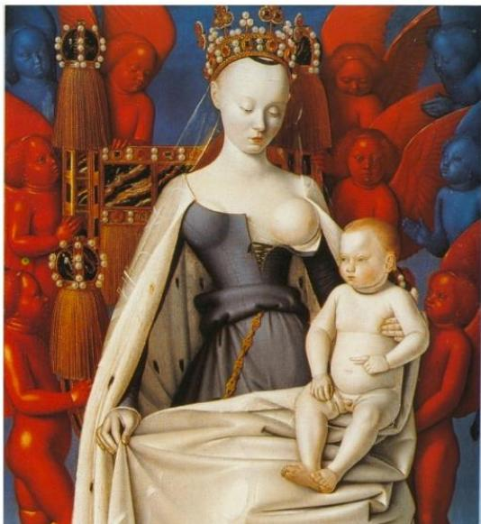

# Le ditpyque de Melun et l’acoupure dans le nœud borroméen

La Vierge à l'enfant entourée d'anges Jean Fouquet, (vers 1452-1458)

C’est mon ami François Duchenne qui a soumis ce tableau à ma sagacité, disant qu’il l’avait fort impressionné, ne sachant trop dire pourquoi. Composé de deux tableaux aujourd’hui séparés, il éblouit par les couleurs éclatantes qu’une fidèle restauration lui a redonnées. Pris du même saisissement, que je nomme pour mon propre compte « malaise diffus », je me mets donc au travail d’analyse.

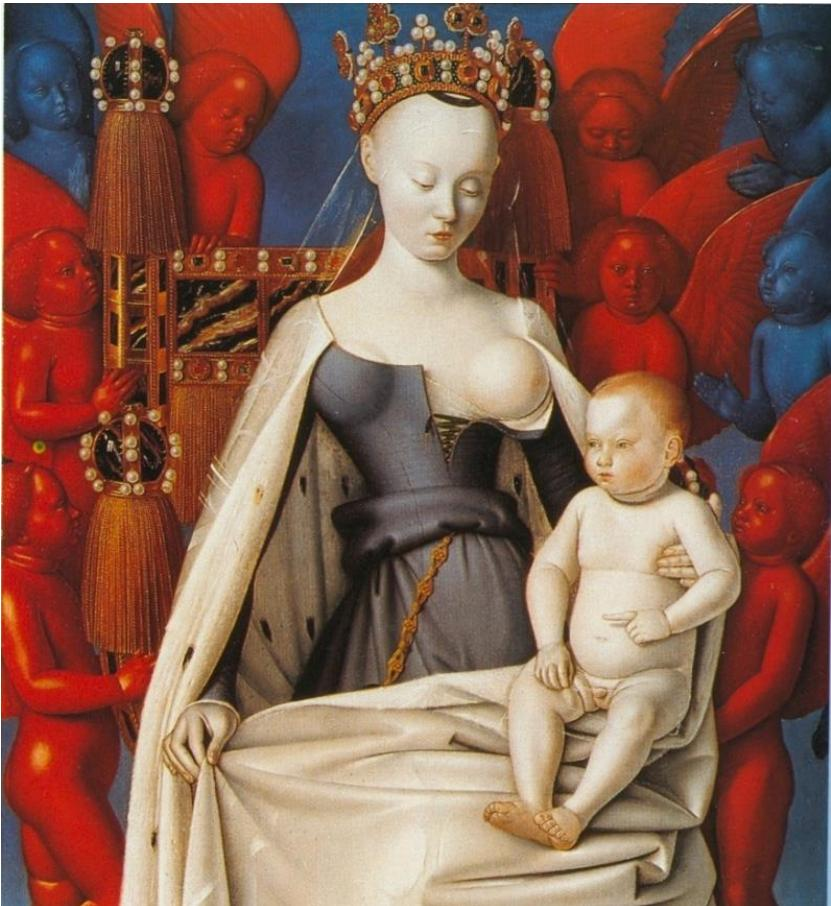

Du tableau de gauche qui va focaliser notre attention, on nous propose l’analyse graphique suivante :

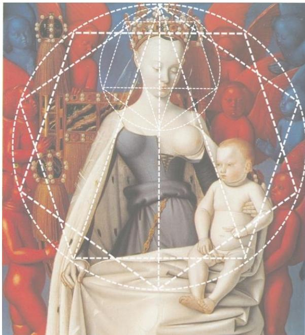

Elle a ses pertinences, notamment en rapport avec la symbolique de l’époque : le rapport du côté au diamètre d’un pentagone fait intervenir le nombre d’or. D’un autre côté, c’est quelque peu approximatif. Par exemple, si certains angles des pentagones prennent appui sur l’œil de quelques anges, d’autres non. Le triangle du visage maternel inversant le triangle proposé par l’ouverture du manteau est également bien vu, d’autant qu’il est l’égal et l’inverse du précèdent, permettant à son prolongement de venir coïncider avec le côté inférieur horizontal de l’un des pentagones. Son côté droit croise un côté de l’autre pentagone au niveau de la main de Jésus qui montre du doigt. Certes, mais aucun autre croisement n’indique un point remarquable. L’un d’eux s’appuie sur la direction du bras de Jésus qui désigne, la direction du bras opposé de la Vierge et sur l’horizontale. L’autre se justifie du sommet du diadème, du poignet droit de la Vierge, et de l’œil de deux anges. C’est pas mal, mais ça laisse les autres coins et arrête des pentagones vides de soutien pertinent.

Les deux pentagones inversés se retrouveraient aussi dans la composition du médaillon émaillé supportant l’autoportrait de Jean Fouquet, qui ornait le cadre en compagnie d’autres médaillons.

Le nombre d’or se retrouve ici sans aucun doute, puisqu’il s’établit du rapport

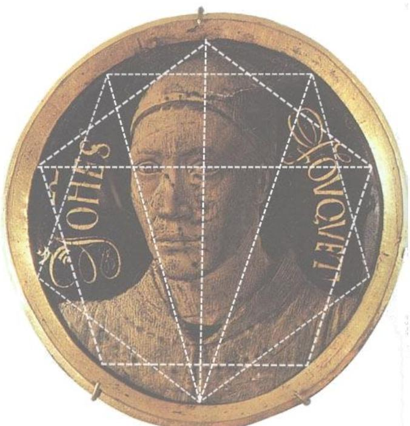

entre un côté du pentagone et son diamètre, qui traverse la ligne des yeux du peintre, essentiels à son art.

En dépit de l’intérêt de cette symbolique connue, je reste quelque peu insatisfait. Ça ne permet pas d’expliquer le malaise diffus que j’éprouve à la contemplation de l’œuvre… et que je sais n’être pas le seul éprouver. Cette analyse souligne quelques proportions harmonieuses, mais c’est tout.

Comment ne pas admettre, alors, qu’on est fasciné par ce sein découvert, d’une rondeur tout à fait excessive, évoquant presque, au-delà de la demi sphère, la sphère… comme s‘il s’agissait d’une pièce rapportée plus que d’une partie intégrante de la dame. Cette impression est renforcée par l’écartement inhabituel des deux seins, comme s’il s’agissait d’objets déplaçables, voire détachables. N’y aurait-il pas là évocation de l’aspect phallique de cet attribut féminin ? La nudité calme de l’enfant Jésus ne nous détrompera pas. L’érotisme est roi, même si c’est exactement ce qu’on n’ose pas se dire, tant nous intimide le caractère sacré de la figure, souligné par les attitudes hiératiques. Le sein dévoilé d’une mère ne l’est en principe que pour mettre en jeu sa fonction nourricière. C’est ce qu’on nous dit pour justifier l’attitude : allaitante. Or, nulle évocation de celle-ci : la vierge n’est pas en train d’ouvrir son corsage pour donner la tétée, l’enfant n’a pas le visage tourné vers l’objet de sa convoitise, et, si c’est parce qu’il est satisfait, ayant pris tout ce qui était à prendre, elle ne fait pas mine de penser à se ficeler. Dans ces conditions, que fait-elle d’autre que de s’exhiber ? Le couvert de la piété abrite bien des plaisirs !

D’une manière générale, la culture admet fort bien qu’une femme dénude sa poitrine en famille lorsqu’il s’agit d’alimenter l’enfant. Tout le monde affecte de trouver ça mignon et sans problème, au prix de dissimuler le malaise diffus qui s’empare de chacun devant le dévoilement de cet objet éminemment érotique. Brassens en a donné une superbe version avec sa chanson :

Quand Margot dégrafait son corsage

Pour donner la gougoutte à son chat,

Tous les gars, tous les gars, du village

étaient lalalalalala…

Au point que l’auditeur en oublie que la lallation « lalalalala » traditionnelle incarnation du chant dépourvu de paroles renvoie non seulement au lieu de la scène, là, mais aussi à l’exclamation du bébé qui jouit de l’objet, certes alimentaire, mais pour lui aussi jouissif, tandis que ce qui lui est encore impossible, parler, se transforme en interdit pour les gars du village : ce qui est là, mais qu’on ne peut que voiler sous la censure de la lallation retrouvée, ce qui est là, par leur présence, c’est le phallus venant se dresser devant son absence remplacée, métaphorisée par le sein. Il est là, et un peu là !

Apparemment ce qu’exhibe la Vierge, c’est son enfant, le Christ. Elle ouvre ses bras et le tient dans un pli de son manteau. C’est vrai qu’il est tout nu, mais… elle aussi, en partie ! Elle exhibe son phallus sous sa double forme : le sein et l’enfant. D’autant que chaque repli du dit manteau se laisse volontiers lire comme un sexe féminin : ce qui est censé être caché dessous, se dévoile et se multiplie dessus, dans l’étoffe même du voile.

La vierge est assise sur un magnifique trône richement orné. L’étude de l’autre panneau du diptyque présente des lignes de fuite permettant de reconstituer la structure de la perspective dont le point de vue se situe dans l’autre partie du diptyque, tandis que le point de fuite pointe le cou de la vierge. Il vient d’abord à l’esprit que c’est ce qui incline son trône. Cela donne une impression d’étrangeté, car la première perception nous l’impose de face. Or, ce n’est pas le cas. Finalement, il semble qu’elle se détourne du donateur qui fait l’objet de l’autre panneau, normalement à gauche, pour consacrer son regard uniquement à son fils, à droite par rapport à nous.

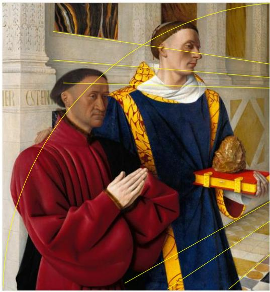

Son inclinaison entraine son corps à nous dissimuler l’une des boules noires serties d’or et ornées de perles qui composent le cadre de son avènement. La symétrie supposée du trône nous invite en effet à imaginer ces boules comme les coins d’un quadrilatère dont une partie nous est cachée : il en manque une, plaçant le portrait sous l’égide d’une absence aussitôt voilée par l’imagination. Comme l’enfant découvrant le manque féminin et le recouvrant aussitôt du phallus, nous comblons sur le champ celuici par l’imagination que suggère la symétrie.

Deux petites perles placées derrière l’oreille de l’enfant donneraient l’indice d’un déplacement de cette boule manquante. Elle aurait suivi le geste d’ouverture du manteau de la vierge. Dans ce cas, elle indique bien le rôle de l’enfant comme venant se substituer à la boule qui, de toute façon, manque à sa place… attendue. Je dois à Michel Thomé de m’avoir fait remarquer que ceci pourrait être dû à la perspective qui tord la structure de l’œuvre : le trône de la vierge ne nous ferait pas face, mais serait incliné selon cette perspective venant de l’autre tableau sur la gauche. Ainsi, la boule de marbre noir en bas à gauche serait placée à l’extrémité de l’accoudoir et non sur le dossier. Nous pouvons nous en assurer en reportant un cercle de même diamètre de la boule du bas à celle du haut : cette dernière s’avère légèrement plus petite, ce qui confirme son éloignement.

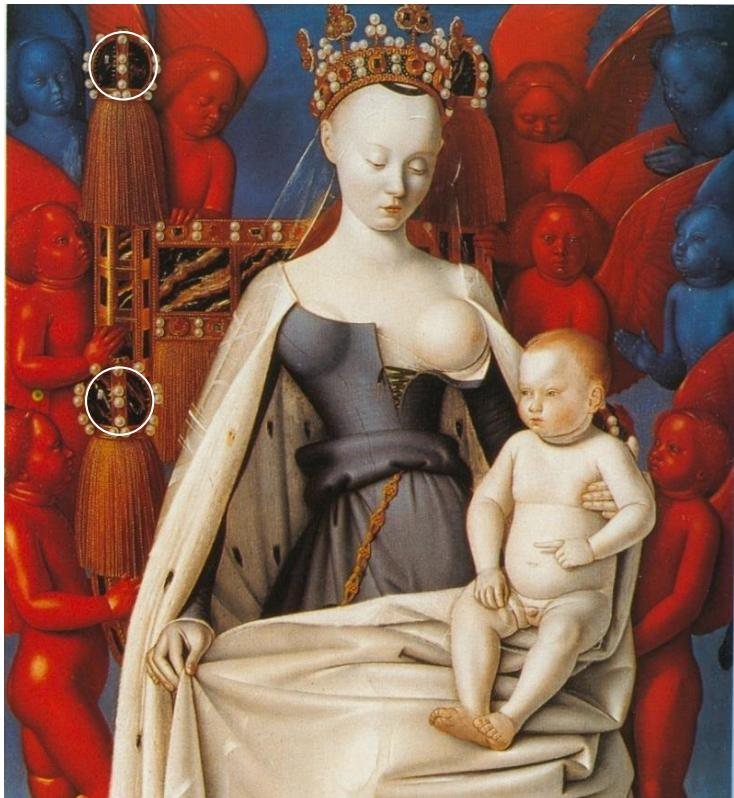

L’accoudoir de gauche seul nous ferait face, d’où cette illusion, renforcée par la jupe de fils dorés qui tombe de chaque boule, dissimulant son piètement. L’accoudoir de droite, décalé par la perspective, serait donc à sa bonne place derrière l’oreille de l’enfant… ce qui n’en souligne pas moins le décalage et la place vide, effet de la perspective, c'est-à-dire d’un point de vue venant de l’autre panneau. Tout cela déterminerait un second point de vue, totalement opposé au premier.

Dessinons le cadre perceptif qui nous est suggéré par les trois boules noires et la dissimulation du piétement de la boule du bas, entrainant l’idée du manque de la boule en bas à droite :

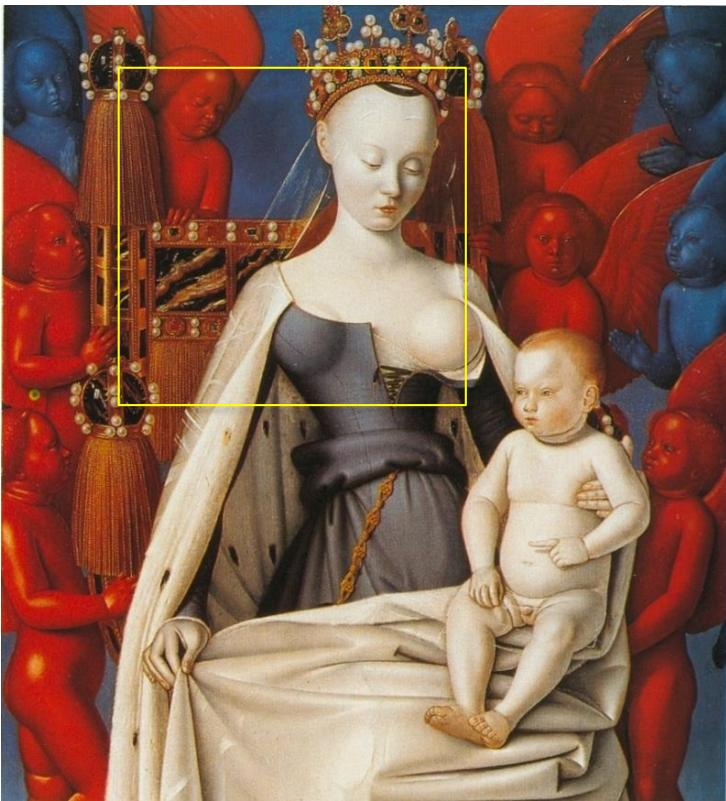  
Dessinons à présent le cadre supplémentaire, plus grand, qui tient compte de l’indice de la boule cachée derrière la tête de l’enfant.

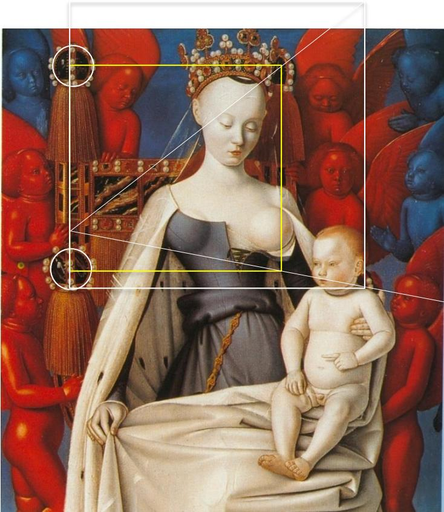

En joignant l’angle de ces deux cadres nous obtenons le tracé de l’accoudoir voilé et donc les lignes d’une nouvelle perspective (en blanc) et d’un nouveau point de fuite, propre à ce tableau, venant croiser en s’opposant à la perspective géométrique de l’ensemble (en jaune). Nous pouvons encore ajouter une perspective que nous appellerons « psychanalytique » (en noir), centrée sur le manque que la perspective géométrique creuse sans le montrer de manière explicite.

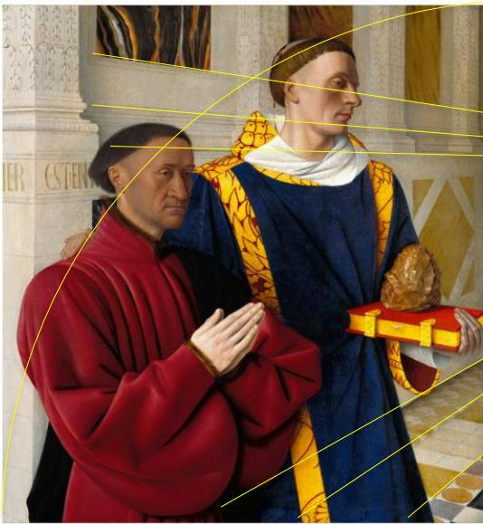

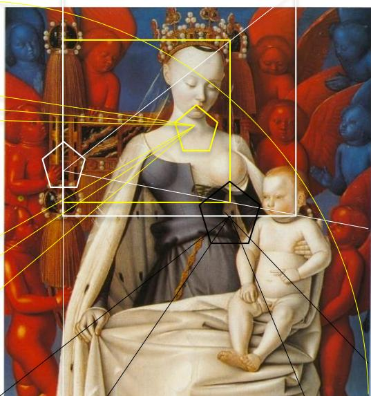

En léger décalé par rapport à la place du manque, de part et d’autre du vide, deux autres boules se proposent en remplacement : le sein de la mère et la tête de l’enfant. C’est peut-être bien là l’origine du caractère exagérément sphérique du sein dévoilé et de l’écart excessif entre les deux seins. Ce dernier redouble en quelque sorte l’écart entre les boules noires des accoudoirs, dont l’excès se trouve renforcé par son voilement (fils dorés voilant le piétement, tête de l’enfant dissimulant la 4ème boule). Dans les deux boules noires de gauche, les exégètes ont pu remarquer le reflet d’une fenêtre à croisée. Ils y lisent une allusion à la métaphore courante à l’époque, qui compare la virginité de Marie au verre d’une fenêtre : la lumière la traverse sans la briser. Et le sein, et l’enfant, occultent le manque sans le combler !

Ceci nous donne une petite arithmétique en forme de 4 - 1 = 3. Or nous observons justement 2 x 3 anges rouges + 3 anges bleus = 9 anges + 1, Jésus. Ou encore : 10 – 1 = 9 = 3 x 3. Autrement dit, la dynamique du manque n’affecte pas que le dossier du fauteuil. C’est une arithmétique tout à fait douteuse que je ne mentionne ici qu’à titre de curiosité.

Le caractère sexuel du voilement-dévoilement est confirmé par d’autres particularités géométriques du tableau. Une droite joignant le sexe de l’enfant et son redoublement, le doigt pointé, s’avère l’exacte médiane de son corps, passant par son nombril, accrochant dans son prolongement un œil de chacun des deux anges rouges situés au-dessus. C’est quand même du donné à voir, tout ça ! Une droite passant par le sexe de l’enfant Jésus puis par le téton de sa mère vient percuter le milieu exact du diadème maternel en son sommet. Elle semble indiquer, dans l’autre sens, le lieu du corps de l’enfant sur lequel tombe le regard de sa mère.

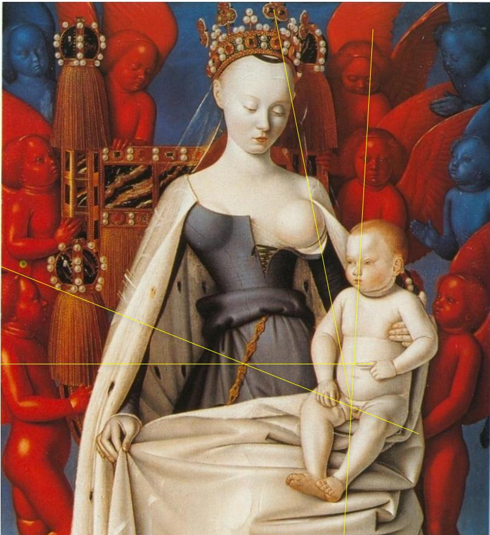  
Mais que désigne donc le doigt de l’enfant si magnifiquement érigé ? Tout simplement le portrait du donateur, Etienne Chevalier, grand argentier du roi Charles VII, soutenu par Saint-Etienne, son patron. Autrement dit une figure du père puisque c’est bien l’ensemencement de ses pièces d’or qui a engendré l’œuvre.

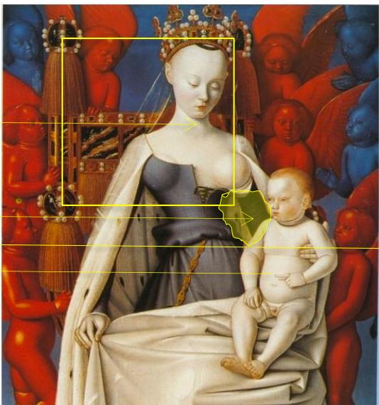  
Saint Etienne tient un livre dont on pense qu’il pourrait être les évangiles ou peut-être le livre d’heures d’Etienne Lechevallier. Sur ce livre, un silex rappelle qu’il a

été lapidé. Je me suis demandé si on pouvait établir un rapport entre ce silex et la place vide de la boule déplacée, car les deux sont situés sur une même horizontale. D’à peu près même taille, ils sont aussi d’à peu près même forme si on retourne le silex verticalement. Leur distance est égale à celle séparant le cou de la vierge du cou de Saint Etienne. On se rappelle que le point de fuite de la perspective géométrique se situe au milieu du cou de la Vierge. Le vide, le caillou qui tue : la castration et la mort sont de même taille, sur le même parallèle.

Mais que fait donc cet ange rouge placé derrière l’enfant Jésus ? Sa main curieusement placée, la légère cambrure de son corps, son regard un peu bizarre finissent par suggérer l’inimaginable, non seulement dans le cadre d’une peinture religieuse, voué au respect le plus absolu, mais plus largement dans le cadre de l’enfance, dédiée à une pureté originelle que nulle transgression ne saurait entacher. Pourtant j’en ai entendu, des histoires transgressives mettant en scène des bébés ! Fantasmes ou réalité, les deux existent et se côtoient sans s’exclure. Je tire donc la droite indiquant cette direction d’interprétation en reliant ce qu’on devine de la main de l’ange rouge au sexe de l’enfant. Elle recoupe la direction que montre ce dernier au niveau de la tresse oblique ornant la robe maternelle. Cette tresse s’avère exactement perpendiculaire à la direction difficile à admettre d’un désir sexuel de l’ange pour Jésus. Elle est parallèle à l’ouverture gauche du bras de la vierge ; si on trace cette parallèle en lui faisant effleurer le dos de sa main et le flanc du sein couvert, elle vise le sommet du diadème, où elle rencontre la droite qui joignait le sexe de l’enfant au téton de la mère. La tresse est alors exactement médiane entre bras et phallus.

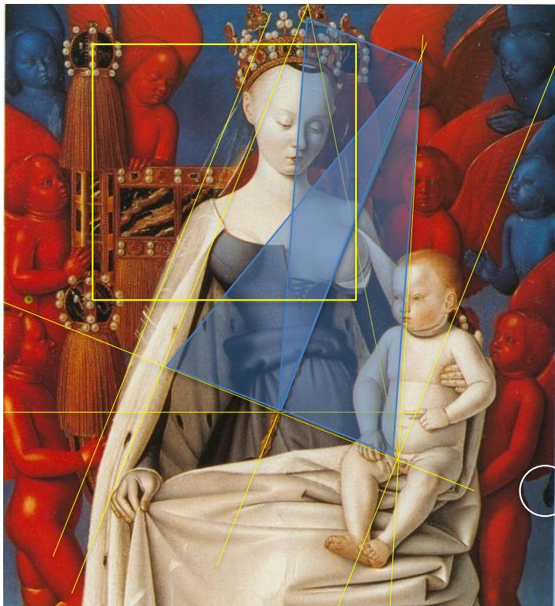  
Alors que désigne le doigt de l’enfant Jésus ? Le père, certes, ou au moins une figure du père. Mais compte tenu de l’activité de l’ange rouge derrière lui, ne tente-t-il pas de désigner un coupable ? Pure spéculation bien entendu. C’est là qu’il faudrait peutêtre fouiller dans la vie d’Agnès Sorel (Modèle supposé de Vierge) ou du peintre. Mais, après tout, que nous importe ? D’autant que rien n’est sûr quant à l’identité du modèle et de la maitresse de Charles VII. Mais il y a au moins là l’indication d’un fantasme.

Derrière cet ange douteux pend, juste au bord du tableau, une forme qu’on pourrait attribuer à un bout d’aile, mais qui est quand même bien phallique1.

On peut dès lors tracer un cercle dont le diamètre est la largeur du tableau, placé au milieu dans le sens de la hauteur. Son diamètre horizontal, qui passe par le centre de l’une des boules de marbre et la zone où il en manque une, se confond avec la base du cadre que nous avions tracé de prime abord. Son diamètre vertical tombe exactement sur le point médian entre bras maternel et phallus de l’enfant, au point de rencontre de la tresse et de la direction indiquée par le doigt. On remarquera que ce cercle se règle à la largeur de l’œuvre, ce qui n’était pas le cas du cercle utilisé dans la symbolique des pentagones.

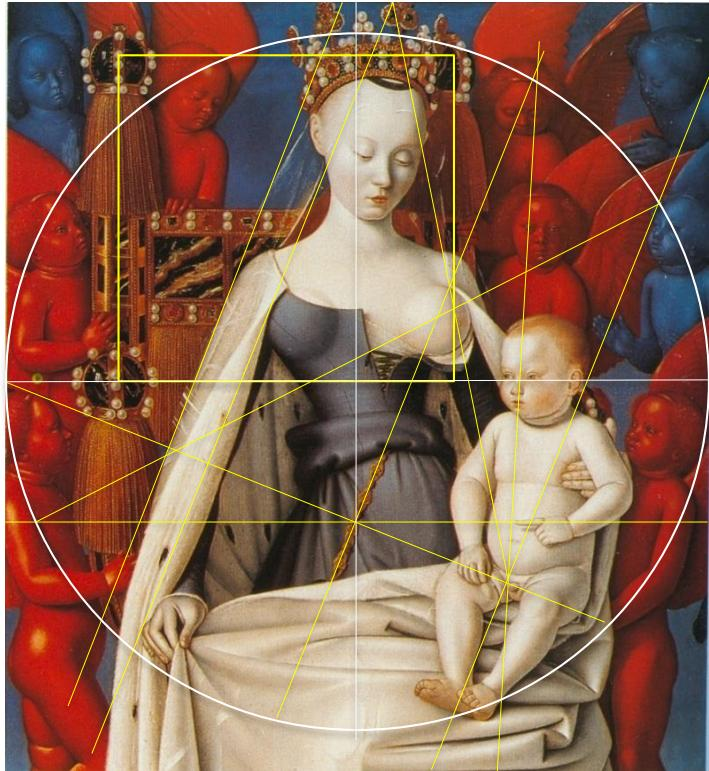

Le geste de la main droite de la vierge tenant un pli de son manteau entre le pouce et l’index, engendrant l’une des images vaginales, rappelle la position de la main correspondante de l’enfant, posée sur sa cuisse. A cet endroit, on peut voir comme deux replis de la chair potelée : l’un, en relief, semble tenu par l’enfant entre le pouce et l’index ; l’autre, juste à côté, en creux. L’ensemble finit cependant par évoquer un phallus jouxtant un sexe féminin virginal. La mère tiendrait une image de la féminité, le garçon, une image de la virilité juste à côté de la menace de castration.

Ce déplacement du sexe de l’enfant sur sa cuisse gauche peut nous évoquer la même sorte de déplacement sur le corps maternel : au milieu de la tresse, au point de rencontre de 4 droites remarquables.

Regardons à présent les regards. Deux anges rouges et un bleu considèrent la vierge. Un rouge, en haut à droite guette dans sa direction, mais il pourrait tout aussi bien observer l’enfant. Le bleu juste à sa droite regarde en l’air, on ne sait quoi et c’est assez étrange vu son air un peu dégouté. Serait-ce celui qui a compris l’aspect sexuel de la scène et qui s’en détourne ? Nous avions déjà repéré l’étrange regard de l’ange rouge placé derrière le Christ. Au-dessus, un ange baisse la tête : est-ce par contrition, pour voir l’enfant Jésus, la scène qui se passe, où pour regarder le seul ange qui nous regarde, d’un air particulièrement ahuri, et qui par conséquent interroge notre propre regard ?

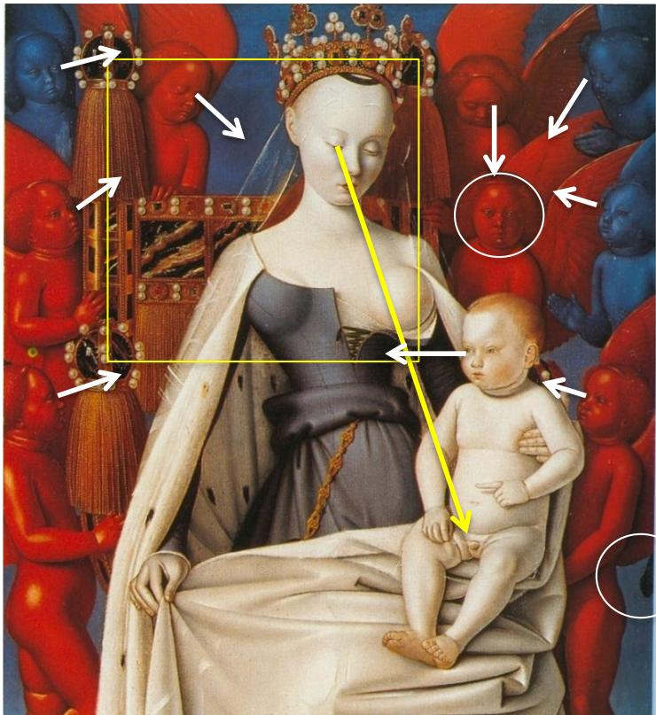

Ce questionnement nous renvoie à tout ce que je viens de dévoiler. Acceptonsnous de le voir ou pas ? Sommes-nous choqués ou pas ? Et donc : qui sommes-nous ? Quel est ton désir ? semble-t-il nous dire.

Une petite mise en forme topologique peut nous fournir un modèle universel de ce qui est écrit là, qui a pour nom : le processus du refoulement.

## Surface d’empan du nœud borroméen

Ceci est une tentative de trouver une correspondance entre la théorie des surfaces, notamment la bande de Moebius, et celle des nœuds par le biais de la surface d’empan.

Voici le croisement obtenu par la torsion d’une bande de papier, c'est-à-dire l’inversion de la dimension y en – y, et l’inversion de la dimension z en – z (troisième dimension, le dessus-dessous) :

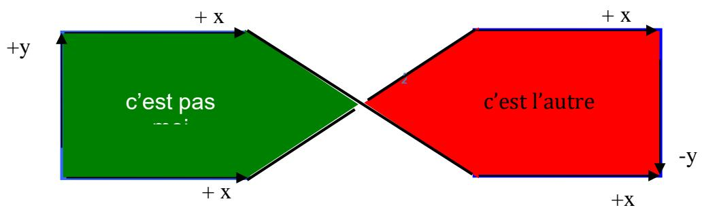

On constate que le bord du haut passe en bas tandis que le bord du bas passe en haut, tout en passant dessous le précédent, exactement comme s’il s’agissait d’un croisement de ficelles. Dans le même temps, l’opération de torsion a fait apparaître le dessous de la feuille de papier. C’est l’autre face, celle dont, habituellement, je ne veux rien savoir, l’attribuant éventuellement à l’autre. C’est le lapsus, le symptôme, le rêve, l’hallucination : bref une formation de l’inconscient se manifestant sous cette forme de retour du refoulé. Car le sujet, bien sûr, se trouve toujours dans cette position de lecteur, toujours lisant une seule face, l’autre devant être retournée pour lui apparaître, d’abord sous cette forme manifeste, puis moyennant une autre torsion, sous sa forme latente par le biais de l’interprétation.

Nous pouvons aussitôt en présenter une version schématisant notre attitude devant le diptyque de Melun. La contemplation du tableau nous offre en même temps son aspect manifeste et ce sentiment de malaise diffus qui pousse à l’interprétation. Cette dernière, on le voit s’avère incompatible dans son aspect devenu explicite, avec l’aspect manifeste éprouvé de prime abord. Il faudrait rabouter le dernier « dessus » avec le premier, mais un dessus ne peut être l’autre face de quelque chose qui est déjà dessus. La force refoulante trouve là sa raison : il faudrait conserver dessous l’interprétation sexuelle, mais l’interprétation vient la remettre dessus. Comme sur la bande de Moebius, nous devons donc conserver une zone d’indécision où les contraires cohabitent, après avoir fait glisser les significations des surfaces :

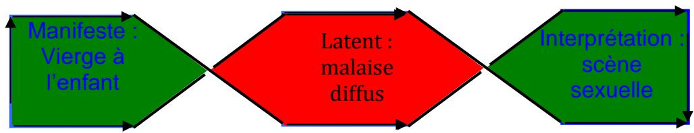

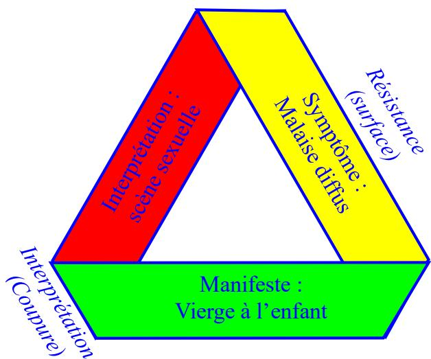

Ceci est donc une reconstruction après coup, écrivant l’analyse du refoulement et de son interprétation. Par l’interprétation, nous avons compris que le malaise diffus était dû à cette cohabitation d’une image sainte et respectable avec une exhibition sexuelle, aussi incompatibles entre elles que le dessus et le dessous d’une surface. C’est leur contradiction qui est perçue comme un léger malaise, car l’une et l’autre sont perçues en même temps, même si la deuxième est refoulée. La bande de Moebius apparaît ici dans son double aspect structural, à la fois coupure, à gauche entre dessus et dessous, et surface à droite où la coupure reste inefficiente (dessus et dessous ne sont pas séparés).

Ce qui permet les passages d’une face à l’autre, ces inversions, c’est le trou de la troisième dimension, celui qui est autour de la feuille de papier. Ce dernier n’est pas dans l’écriture. Il est néanmoins symbolisé par un vide dans l’écriture, par un blanc à l’extérieur des bords, et par la torsion, lieux où les bords, se croisant, laissent lire d’un côté, le dessus, de l’autre le dessous. Voilà qui autorise de lire cette figure comme une métaphore de la castration : le trou est à l’extérieur de l’écriture, réel ; il ex-siste, mais il n’est pas comme tel dans l’écriture, où il apparaît cependant à l’état symbolisé. L’interruption du trait passant dessous, au centre, en est la plus lisible « écriture », justement parce qu’à cet endroit, l’écriture s’interrompt d’un vide : on ne peut pas écrire ce qui ex-siste à l’écriture, le réel du trou. Là, ça cesse de s’écrire, ce qui, paradoxalement, permet que ça cesse de ne pas s’écrire. Voilà pourquoi ce qui est impossible, la présence réelle du trou dans l’écriture, fait retour par une interruption de cette dernière : un inter-dit.

## Appliquons cela à l’écriture du nœud borroméen.

On pose l’axiome suivant : les zones délimitées par le contour des traits représentant les ficelles seront systématiquement alternées en surfaces et trous. Ainsi, on tient compte des dernières définitions de Lacan faisant du trou le symbolique et de la surface, l’imaginaire, le réel étant ce qui ex-siste à la représentation, et qui n’est donc pas représenté dans le dessin. Les croisements de ficelles seront considérés comme des torsions de la surface, c'est-à-dire, le lieu où nous passons de dessus à dessous, opération autorisée par le trou.

Nous faisons alterner surface et trou :

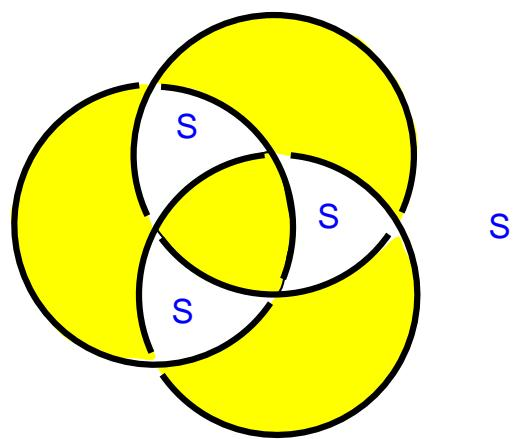

Jusque-là pas de problème. Considérons alors les croisements comme des torsions ce qui nous oblige à orienter les surfaces ; de part et d’autre d’une torsion nous devrons trouver ici, un dessus (vert) et là, un dessous (rouge). On voit tout de suite qu’on ne peut pas aller bien loin dans l’orientation, car des conflits logiques se présentent aussitôt, quel que soit l’ordre dans lequel on chemine :

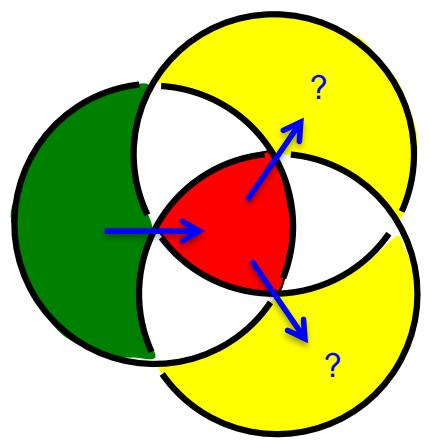

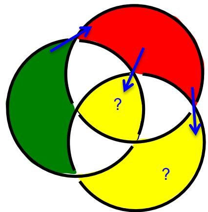

Partant de la zone de gauche, que l’on va décider « dessus », donc verte, et franchissant une première torsion vers le centre, nous devons donc nommer la zone suivante « dessous » et la colorier en rouge. Deux possibilités se présentent alors : continuer vers le haut, ou vers le bas. Dans ces deux cas, et dans le sens de notre cheminement, nous devrions noter à nouveau « dessus », et colorier ces deux zones en vert. Or, c’est interdit, car alors nous aurions une zone verte en haut et en bas s’opposant à la zone verte de gauche d’où nous étions partis : du point de vue de cette zone, et si nous étions partis vers le haut et vers le bas au lieu de partir vers le centre, ces deux zones devraient être « dessous » et donc rouge :

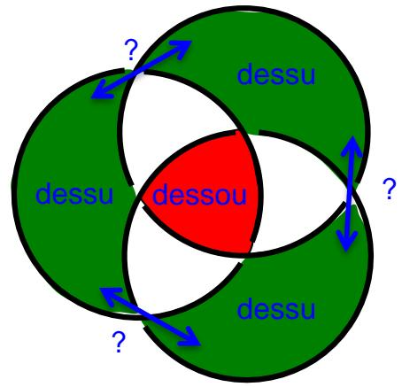

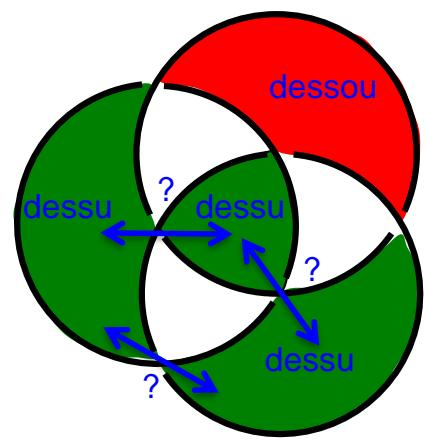

Étant à la fois rouge et verte, à la fois dessus et dessous, nous sommes contraints de ne pas choisir et de laisser ces zones dans leur couleur d’origine « jaune » :

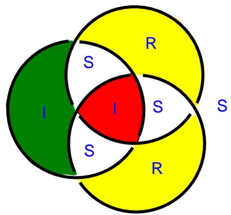

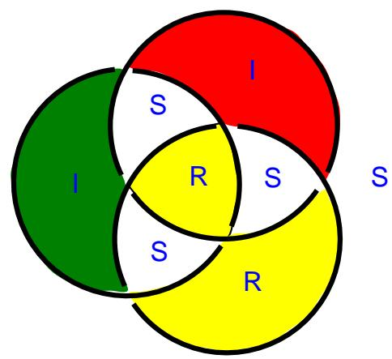

Voilà une excellente image de la logique de l’appareil psychique : rencontrant une contradiction (dessus = dessous), le jugement conscient s’arrête et laisse subsister les deux options dans l’inconscient. L’indéfini de ces deux zones rejoint alors l’indéfini originaire, celui où toutes les zones étaient jaunes. C’est ainsi que nous pouvons appeler cette indétermination originaire, avec Freud, le refoulement originaire, et avec Lacan, le Réel. C’est donc bien après-coup, après fonctionnement du symbolique (le trou) et de l’imaginaire (la surface), que nous pouvons dire : il reste des zones désorientées, dont nous ne pouvons rien dire, que nous nommons par défaut « le Réel », étendant par conséquence logique cette nomination à l’indétermination antérieure. Dans le fonctionnement de l’inconscient, le refoulement originaire attire à lui le refoulement proprement dit ; il fait partie des forces qui nourrissent le refoulement. Dans notre modèle, nous voyons en effet comment deux des zones colorées originairement en jaune par leur indétermination en reviennent au jaune après notre tentative d’orientation. Nous reconnaissons une remarquable homologie de fonctionnement qui fait se confondre, d’un côté, refoulement proprement dit et refoulement originaire, de l’autre des zones qui admettent la contradiction dessus-dessous et des zones pour lesquelles il n’y avait ni dessus ni dessous. Nous ne pouvons donc faire la différence entre les deux parties du théorème de Gödel, l’indécidable (ni…ni…, refoulement originaire) et la contradiction (et…et…, refoulement proprement dit).

Considérons encore une fois ceci comme une théorisation de notre attitude devant le diptyque de Melun. Nous voyons au prime abord une représentation de la vierge à l’enfant : voilà une écriture manifeste, verte. Mais nous ne pouvons nous déprendre d’un certain malaise : il y a donc du latent, rouge. Ce latent suppose une interprétation, qui devrait ramener dessus la signification sexuelle entrevue. C’est là qu’elle se heurte à une contradiction : une exhibition sexuelle ne saurait être compatible ni avec l’icône religieuse de la vierge, ni avec la figure universelle de la mère, qui étaient notre vision de départ.

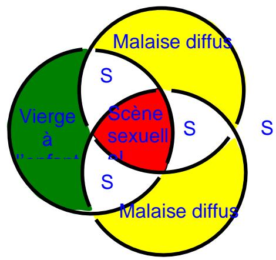

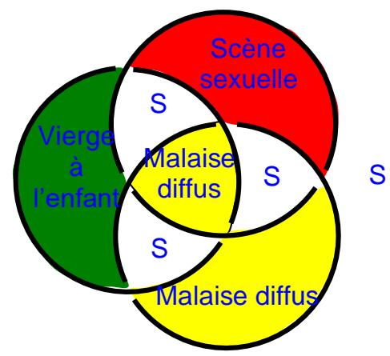

Nous nous retrouvons devant la même structure que celle de la bande de Moebius apportée plus haut, sauf que cette fois nous constatons la présence de deux zones d’indétermination.

Voyons à présent si nous pouvons prendre référence aux concepts de Lacan. Voici la façon dont se dernier organise ses concepts sur la figure du nœud borroméen :

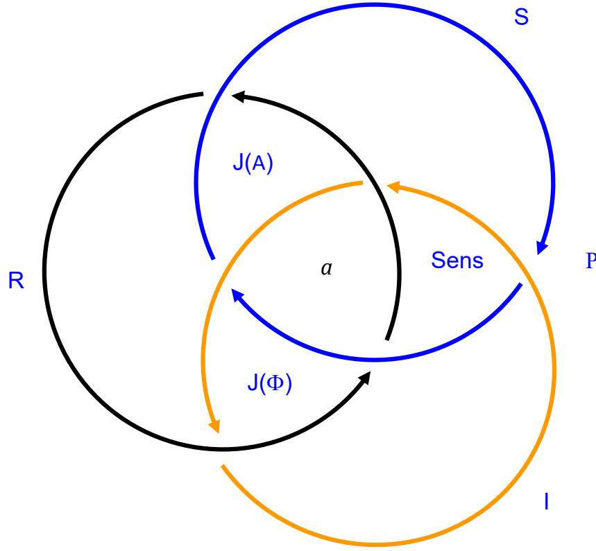

J’ai ajouté P, le Nom-du-Père, dans le trou extérieur. Lacan ne le fait pas, mais cela m’a semblé approprié. Lacan n’a pas organisé son écriture en surfaces et trous. Il met simplement ses concepts en place dans les espaces proposés. Il dispose l’objet a au centre parce que ce concept est central dans sa théorie. Le sens et les deux jouissances, la jouissance phallique J() et la jouissance de l’Autre J(A) tournent autour, comme les planètes autour du soleil.

Établissons le rapport avec notre expérimentation topologique. Dans la théorie de Lacan, le concept d’objet a représente ce qui reste inorientable dans la pratique, c'està-dire impossible à représenter. C’est en cela que cet objet est cause du désir : parce qu’on ne peut l’atteindre en aucune façon. Il manquera toujours dans le champ de la représentation. Il cause le désir de s’orienter, c'est-à-dire de rentrer en possession de ces zones dans lesquelles toute possession s’avère impossible. De ce fait, tout en restant inorientable, il oriente. Plus exactement, c’était impossible au départ, avant qu’on ait fait fonctionner la machine symbolique. Ensuite, ça devient interdit, car la machine symbolique a posé des conventions qu’on ne peut plus rejeter. Ainsi l’interdit se projette-t-il après-coup sur l’impossible des origines, tout comme dans l’Œdipe qui, de sa loi interdictrice sur la mère, projette sur l’« avant », la perte première impossible à récupérer, de la Chose, au moment de l’entrée dans la loi du langage. Dans mes écritures, on ne peut donc situer l’objet a que dans ces zones jaunes qui restent désorientées.

Nous pouvons alors remarquer que, topologiquement, nos trois ronds sont strictement identiques, en consistance, en place et en fonction. Ils ne sauraient donc représenter le réel, l’imaginaire, et le symbolique, car cela voudrait dire que le réel n’aurait aucune différence d’avec le symbolique, ni d’avec l’imaginaire.

A mon sens, c’est ce dont Lacan s’est confusément aperçu en proposant, dans Le Sinthome, sa nouvelle définition : le symbolique c’est le trou, l‘imaginaire c’est la surface, le réel c’est ce qui ex-siste. Je crois qu’il n’a pas eu le temps de se rendre compte de la portée de ses nouvelles définitions qui remettent en question toutes ses écritures précédentes. En effet, jusqu’à présent il ne faisait que plaquer des concepts sur des dessins, ce qui donne ce que j’appellerai des schémas. Avec cette prise en compte de la dialectique des surfaces et des trous, nous sortons des schémas pour passer à une écriture des concepts, dans laquelle la structure même de l’écriture, topologique, écrit ce que le concept décrit. Ainsi, comme nous venons de le voir, je ne mets pas l’objet a forcément au centre parce qu’il est central dans la théorie, mais parce que sa place topologique (topos-logos : discours sur les lieux) se déduit de notre effort d’orientation de la figure, le confinant aux zones impossibles à orienter. Ainsi l’écriture topologique se rapproche-t-elle de l’écriture chinoise, qui décrit plus ou moins le concept qu’elle représente (représentation de chose) et non le son avec lequel on le parle (représentation de mot). C’est une lettre et non l’écriture d’un signifiant.

Nous venons de rencontrer à peu près la même problématique entre l’interprétation «pentagonale » du diptyque de Melun et celle que j’ai proposée ensuite. La première est pétrie de références à une symbolique antique, les rapports du pentagone avec le nombre d’or, c'est-à-dire un savoir, tandis que la seconde part de l’expérience du malaise vécu à la considération de l’œuvre, suivant un chemin interprétatif organisé à la fois par la mise à nu évidente et par des lignes de forces beaucoup plus cachées, mais lisibles. C’est toute la différence entre un discours interprétatif reposant sur un savoir antérieur, la symbolique, et une écriture qui, par sa contradiction interne (dessus = dessous), décrit le malaise éprouvé dans une expérience perceptive, soit l’effet du symbolique. Ramené au jeu topologique des surfaces et des trous, la symbolique étale une surface (signifié, signification) tandis que le symbolique ouvre des trous (sens). La symbolique est ici un équivalent de l’imaginaire, s’opposant à le symbolique comme surface et trou.

La jouissance étant la possession d’un objet, elle ne saurait s’inscrire dans un trou, qui est un manque de surface. Par contre, elle peut s’inscrire dans les zones désorientées, qui sont un manque de trou. Malheureusement nous ne disposons plus que d’une zone désorientée, l’autre étant déjà repérée comme place de l’objet a. Accordons lui le statut de J (A), jouissance de l’Autre. Il faut cependant remarquer que, d’un point de vue topologique, rien ne permet de distinguer ces deux zones inorientables. Nous sommes obligés de retomber dans l’arbitraire de la nomination, qui pourrait nous faire inverser tout aussi bien le nom d’une zone sur l’autre. D’un autre côté, que faire de la jouissance phallique ? Nous pourrions dire à partir de là que le modèle ne convient pas, et qu’il faut donc en trouver un autre. Ou alors, qu’il fait interroger le concept. C’est cette dernière option que j’ai choisie.

Le phallus se définit de son absence : il ne prend sens qu’au moment où l’enfant, ayant perçu la différence des sexes, lui attribue une cause : la castration. Le phallus n’existe pas auparavant, ni en deçà. En ce sens le concept de jouissance phallique me paraît auto-contradictoire : on ne jouit jamais du phallus, toujours absent quelque part, de même qu’on ne jouit jamais de l’objet, toujours déjà perdu, ce qui tombe toujours sous le sens de la jouissance de l’Autre, qui est celle dont on imagine que l’Autre jouit. Mais s’il y avait jouissance, il n’y aurait plus de manque, donc plus de désir. La jouissance est une position fantasmatique, car la réalité psychique se fonde sur le manque2. Dans notre modèle ce manque est représenté par les trous et se trouve triple :

-le phallus, car il ne saurait se poser comme tel que par le biais de la castration. C’est ainsi que Lacan conçoit le phallus symbolique que l’on pourrait appeler castration avec plus de justesse, il me semble. Mais contentons-nous de la lettre .

-le Nom-du-Père, car il conceptualise l’absence du père comme tel. Porteur du phallus ou agent de la castration, il n’est pas le père de la réalité, mais la fonction introduisant la séparation entre mère et enfant, entre chose et représentation.

\- le sens qui ne veut rien dire mais se constitue du « je dis » comme tel, l’acte de parler, ce qui oriente le sujet dans son rapport à l’autre, quels que soient les signifiés et les significations dévoilées. Il dépend aussi du trou entre la chose et sa représentation.

La jouissance reste un mythe, ce que retranscrit fidèlement notre modèle : une zone désorientée, inorientable, reste d’un paradis perdu. Le phallus en donne la raison, toute perte étant, dès lors, ramenée à l’aune de la castration. C’est ce que Freud disait déjà des objets partiels, l’oral et l’anal : ils ne sont constitués comme perdus que dans l’après-coup de la castration. Dans notre écriture, un trou semble le plus approprié à rendre compte de cette perte au titre d’une fonction, la fonction symbolique, autrement nommée fonction phallique. Mais il faut l’écrire simplement , et non plus J(). Y a-t-il par ailleurs une jouissance phallique ? Cette discussion pouvant se poursuivre au niveau du concept, je ne trancherai pas ici (sic). Mais au niveau de notre écriture topologique, la question est tranchée : s’il y a une jouissance, il faut la ranger dans les zones inorientables, même s’il nous en manque une.

Maintenant, entendons qu’il y a une autre façon de comprendre la jouissance de l’Autre en la prononçant jouissance Autre, celle de la femme, celle qui n’existe pas. En acceptant un corollaire au concept de jouissance, dans lequel nous joignons le rien à la liste des objets, nous obtenons une jouissance paradoxale, celle de la possession d’une absence. Je la retrouve en effet dans la pratique auprès de ces femmes qui trouvent leur plaisir (mais est-ce vraiment une jouissance ?) Dans la castration de leur partenaire. C’est même assez universel, dans l’ordre d’une vengeance contre les supposés possesseurs de phallus. Pour elle, la jouissance de l’Autre, c’est celle de celui qui jouit du phallus et c’est cela qu’il s’agit de couper. A l’extrême, ça devient une adoration du rien comme tel. J’ai connu une analysante qui me disait apprécier particulièrement se trouver sur une grande esplanade vide, où elle allait régulièrement se ressourcer. Une autre appréciait dans la peinture moderne, les œuvres de tel artiste présentant des toiles presque absolument blanches. On retrouve cette passion chez le personnage de la galeriste interprétée par Isabelle Huppert dans « Mon pire cauchemar », le film d’Anne Fontaine3. Son pire cauchemar, c’est en effet le phallus, présenté par cet homme joué par Benoit Poelvoorde, un jouisseur qui aime boire, manger et baiser. A l’inverse, elle aime les œuvres où il n’y a rien à voir, elle ne mange presque pas, ne boit pas et ne baise pas. Enfin, nous avons le modèle de Sainte Thérèse d’Avila, dont le souci phallique représenté par la flèche de l’ange ne fonctionne que dans la mesure où il reste purement fantasmatique, placé sous l’égide de cette pure absence qu’est Dieu.

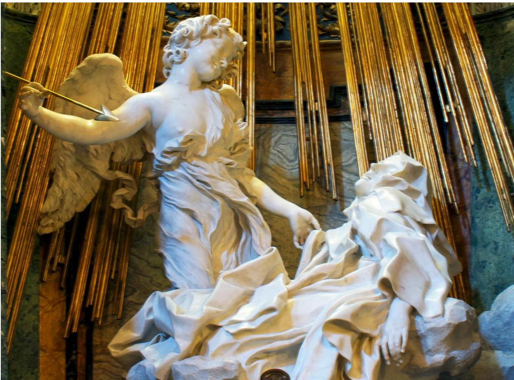

Ce vide, dit « jouissance Autre », pourrait être placé dans un trou de notre écriture topologique, au même titre que le phallus, car il ne prend sens que de l’éviction du représentant de l’organe et, à ce titre, s’apparente tout à fait au concept du phallus comme tel. Mais on pourrait le dire aussi surface où ce qui fait vide, c’est l’absence d’orientation. Il ne fait pas grand-chose pour franchir le pas entre une acception et l’autre. Je ne trancherai pas non plus, estimant ces bases suffisantes quant à notre orientation conceptuelle. L’essentiel étant d’avoir montré comment le support de la topologie peut permettre d’interroger les concepts. Seule une analyse de la pratique de la psychanalyse pourrait nous donner quelques éléments autres afin d’avancer dans ce débat.

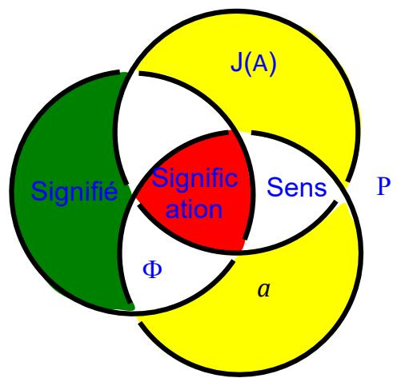

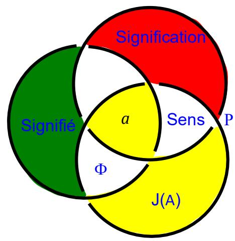

On peut alors développer le modèle avec un algorithme complémentaire qui va permettre de montrer comment le sujet se divise, acceptant le compromis d’une double possibilité pour venir à bout des contradictions. Chaque torsion qui nous met devant une contradiction va nous entrainer à tenter de couper la zone litigieuse en deux : l’une des parties va rester conforme à la logique des dessus-dessous, au prix du refoulement de l’autre partie.

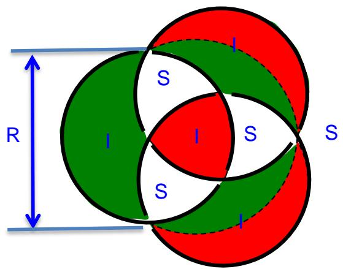

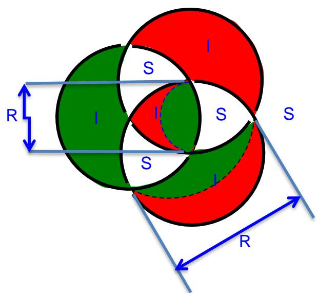

Ce compromis est-il acceptable ? D’un côté il le faut bien, de l’autre, nous voyons se dessiner, dans l’écriture de gauche, l’amorce en pointillés d’un nouveau cercle, celui de la coupure, qui ne se referme pas. Nous rencontrons ici la théorie freudienne de la pulsion de mort, lacanienne du symbolique, dans sa traduction topologique : ce cercle appelle sa fermeture, la coupure appelle sa recoupe, afin de construire un trou. Cette ouverture est la trace dans l’écriture du refoulement originaire. Plus aucune surface n’en témoigne, mais cette absence de fermeture, oui. Il ne s’agit plus d’un trou symbolique, conforme à la définition que nous avons adoptée à la base, mais d’une coupure qui ne se referme pas, l’acoupure. Cette absence de recoupe empêche de faire trou. Nous ne pouvons donc l’appeler trou, comme l’avait fait Lacan en présentant son schéma I comme l’effet d’un trou dans le symbolique secondé d’un trou dans l’imaginaire, mais nous pouvons l’appeler la trace du Réel dans l’écriture. La définition ultérieure, par Lacan, du symbolique comme trou, que je promeus ici, est évidemment en contradiction avec celle-là. Nous pourrions réconcilier ses deux définitions en distinguant le trou Réel du trou symbolique : le premier représenterait l’incomplétude de la coupure inachevée, l’acoupure, tandis que le second accepte la perte de surface que représente la coupure qui, se recoupant, fait trou.

Dans l’écriture de droite, c’est un peu plus compliqué : nous avons deux amorces de cercles de coupure qui ne se recoupent pas. Pouvons-nous inventer un algorithme qui nous permettrait à la fois de faire se rejoindre ces deux cas de figure, et de boucler le cercle de la coupure ? Oui, en imaginant de retourner chaque rond autour des deux autres formant axe de rotation. J’ai déjà développé cet algorithme en de nombreux articles, dont le plus clair est sans doute « Structure du nœud borroméen4 ». Je propose de considérer ces déplacements nécessitant le passage dans la troisième dimension comme une métaphore du passage de l’écriture (mémoire) à la parole, ce qui fait trou dans la surface, puis de la parole à l’écriture, qui oriente la surface. Seule la parole, en effet, se situe dans la troisième dimension, en tant que Une dimension temporelle du processus énonciatif. En appliquant cet algorithme six fois, c'est-à-dire en retournant chaque rond successivement dans leur ordre, deux fois, on parvient à faire se recouper la coupure entre vert et rouge, dans chaque zone. Par contre, il apparaît à nouveau deux zones dans lesquelles la coupure ne passe pas ; nous devons les laisser dans le jaune de l’indétermination, qui écrit la présence du refoulement originaire dans la structure. Cela donne ceci :

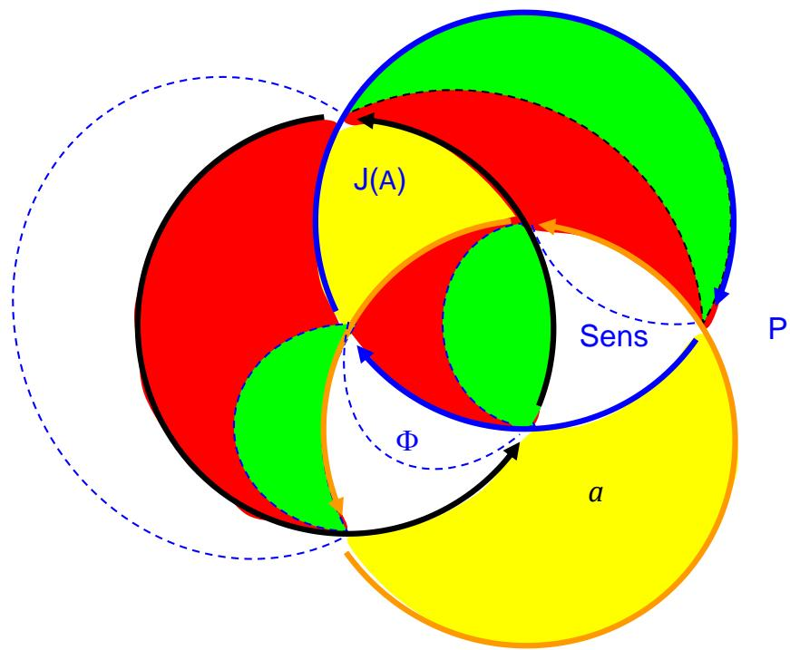

Cela peut aussi se lire comme une dialectique entre perception et représentation, « réalité » (c'est-à-dire Réel) et mémoire de la réalité. En effet, l’algorithme joue sur cette ambiguïté entre un nœud réel dont on retourne les ronds, mouvement qui ne peut être représenté, et l’écriture des étapes, imaginaire (surface orientée) et symbolique (trou). Les zones jaunes représentent ainsi, par leur désorientation, (« impossible à orienter ») l’impossible de la restitution du réel dans sa représentation.

Comme dans les étapes préliminaires, on remarque que l’algorithme proposé se démarque du choix de Lacan de poser son objet a dans une seule zone au centre. La pratique topologique de l’écriture du nœud nous oblige à cette démarche aboutissant encore une fois à deux zones inorientables.

03/02/2013