## Du sujet psychanalyste

Canoniquement, en fin de cure, l’analyste doit être identifié à l’objet a. C’est d’avoir effectué cette opération pour lui-même qu’un sujet peut s’autoriser analyste. Ça ne veut pas dire que c’est fait une fois pour toute. Car le sujet ne se laisse pas si facilement que ça réduire à la position d’objet : c’est ce qu’on appelle les résistances de l’analyste.

Sans la pratique de la psychanalyse, il n’y aurait pas de psychanalyse. Donc il faut discourir sur la pratique de la psychanalyse, et pas seulement de la théorie, et pas seulement de la topologie.

Se contenter de faire de simples récits cliniques ne suffit pas non plus.

La théorie analytique, telle que Freud et Lacan l’ont établie, nous fournit un moyen d’en parler. Elle nous fournit le point fixe autour de quoi tourner, à condition de se donner aussi les moyens de renvoyer ce point fixe dans le mouvement de la parole en se donnant un nouveau point fixe. La topologie, peut-être l’aspect le plus abstrait de la théorie analytique, ou discipline extérieure à l’analyse, nous fournit cet autre point fixe. Il n’a d’intérêt que s’il nous permet d’avancer une parole clinique qui nous permette de progresser dans l’articulation de la théorie.

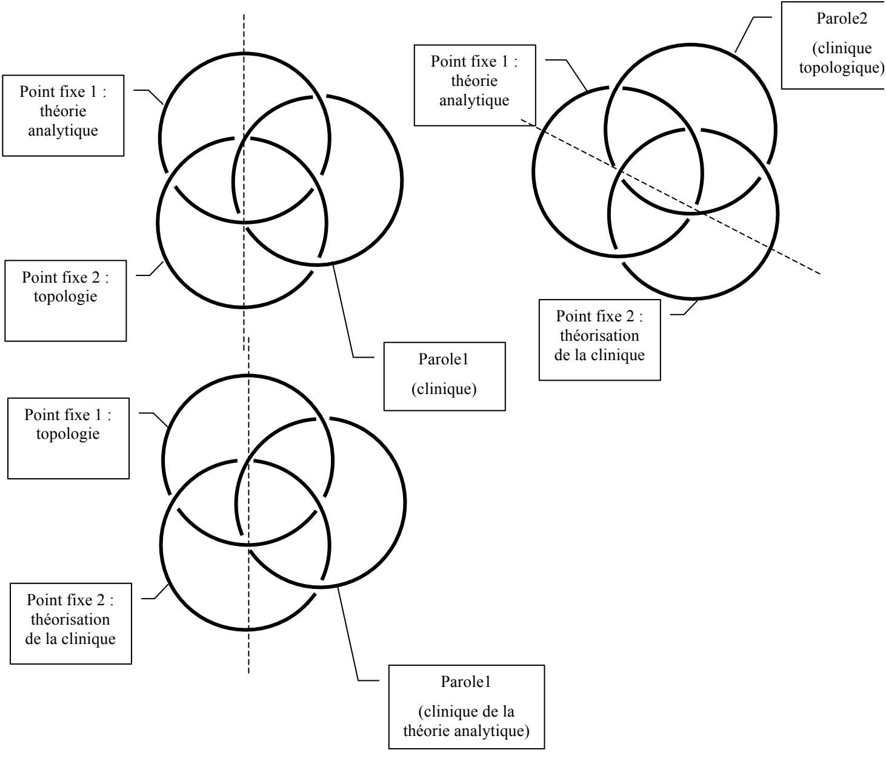

Le point où j’en suis de cette articulation me permet de poser qu’il n’est pas possible de parler à coté de ses pompes, c'est-à-dire de parler de l’analysant comme s’il s’agissait d’un objet… un objet d’études. Le seul analysant, c’est celui qui parle, produisant du sujet. L’analyste est celui qui écoute, et celui qui se donne les moyens d’analyser ce rapport de transfert qu’il entretient avec son analysant. Ces moyens, ce sont ceux de tout analysant, ceux que fournit la parole, produisant du sujet, en l’occurrence, du sujet psychanalyste.

Freud a montré la voie, dans la Traumdeutung, en analysant essentiellement ses propres rêves. C’est donc cette voie que je vais emprunter.

J’ai fait le rêve suivant :

La robe de communion de Nathalie doit être verte et blanche, c’est le vœu de son père qui est anglais. Ça fait conflit. Le conflit se développe dans la maison d’Espaly. Enfin elle obtient sa robe translucide et blanche, mais avec un écusson à carré verts et blancs sur le cœur. C’est une grand pièce de tissu ronde avec un rabat asymétrique (c'est-à-dire plus court) dans le dos, et un trou pour la tête ; elle est heureuse, elle tourne avec sa robe dans le jardin. Elle en fait un paquet avec des ronces du jardin (comme Chloé déchirée par les ronces, mais « Nathalie » n’est pas déchirée). « elle a tissé sa robe avec les ronces du jardin ». elle rencontre l’évêque qui passe par là dans sa robe violette. C’est un petit homme rondouillard et souriant. Elle lui montre sa robe. Il lui sourit, c’est très bien.

Le bassin du prince, dans le jardin impérial. On vient de lui offrir une otarie. Celle-ci, paraît-il, se promène dans tout le jardin, ne revenant que de temps en temps au bassin. Elle y est très heureuse, elle rit, et frappe ses nageoires entre elles.

J’avais vu la veille au soir au cinéma « Les diables » de Christophe Ruggia. « Nathalie » est visiblement inspirée du personnage de l’autiste Chloé. Elle en a l’aspect. Mais je resitue le personnage du film dans une banlieue du Puy, ville de mon enfance. La piscine du Puy était à Espaly, mais je n’ai jamais habité là. Chloé, dans ce film, se débattait dans un rideau de voile blanc qu’elle avait arraché d’une fenêtre. Ce n’était pas heureux, elle en était prisonnière. A l’inverse, dans mon rêve, elle est heureuse de trouver un voile qui lui convient.

Mais pourquoi « communion » ? Que vient faire ce père anglais ?

Le vert me fait penser à la couleur d’un rideau vert dont Hélène m’a parlé au téléphone, en rapport à son analysante psychotique. Dans le cadre d’un récent groupe de travail, ma collègue Hélène Petitpierre m’avait raconté ses difficultés avec cette analysante. Après nous en avoir parlé dans le groupe, elle m’avait téléphoné pour me faire savoir qu’elle en avait rêvé… et la seule chose dont elle se souvienne c’est qu’il ne s’agissait que de ratages et enfin, d’une couleur verte. Cette couleur, elle ne peut la rattacher qu’à une chose, la couleur verte des carrés de tissus qui, sur ses rideaux, lui permettent de repérer à quelle fenêtre ils appartiennent, car elle vient de les décrocher pour en faire la lessive.

La question qu’elle nous avait apportée concernait le fait de croire ou de ne pas croire son analysante. Celle-ci voulait qu’Hélène vérifie chez le pharmacien que ce qu’elle avait fait analyser d’un liquide noir issu de la lessive d’un vêtement blanc, c’était bien du poison. Preuve serait ainsi faite des persécutions dont elle se dit la victime. Hélène nous rapportait aussi qu’elle disait cracher des substances noires ou blanches, ou noires et blanches, qu’elle pensait qu’on lui avait coupé le nez pendant son sommeil, et qu’on lui avait mis un nouveau nez à sa place. On peut raisonnablement faire l’hypothèse que ce qu’elle lui demande de vérifier chez le pharmacien, c’est cet incroyable de la castration qui lui empoisonne la vie, puisqu’elle n’a pas pu avoir d’enfant en compensation. Elle lui demande de vérifier l’analyse du pharmacien, alors qu’elle est en analyse chez Hélène. Elle lui demande un Autre de l’Autre. C’est en cela que cette demande est, pour nous, ambiguë : nous aimerions la prendre pour une demande de vérification – elle demande à ce qu’on lui dise qu’elle dit vrai – alors qu’elle le présente plutôt (à ce que disait Hélène) comme l’assertion d’un fait Réel. Voilà qui rejoint la métaphore que Lacan proposant dans « L’Etourdit » : « je métaphoriserai de l’inceste les rapports que la vérité entretient avec le Réel ». Qu’elle en demande une vérification, voilà qui est néanmoins de bonne augure, malgré cette affirmation d’un Réel qui semble bloquer l’analyse en ce point d’objectivité. S’il y a à la fois assertion d’un fait comme Réel et en même temps demande de vérification c’est qu’en fin de compte il y a bien un doute.

Hélène nous avait dit, lors de notre réunion, qu’elle faisait l’association entre son impuissance face cette analysante, et son impuissance face à sa propre mère, qu’elle n’avait pas pu soulager avant sa mort, de même que je n’avais pu soulager les souffrances de la mienne dans les même circonstances.

Les carrés verts servent à l’orientation de ses rideaux, tandis que « Nathalie-Chloé », dans le film, se perd en se roulant dans un rideau qu’elle a arraché d’une fenêtre ; un rideau, c’est à lire comme la surface de voile qui obture un trou. C’est comme si « Nathalie-Chloé » était l’autisme de son analysante, et du coup, l’«autisme » d’Hélène, désorientée par le désarroi de son analysante. Hélène m’avait dit aussi que son cabinet était tendu d’un tissu violet, qu’on retrouve dans la robe de l’évêque.

Quant à «Nathalie », c’est une collègue psychomotricienne, qui m’a beaucoup parlé de la désorientation dont souffrent les patients dont elle s’occupe, atteints de la maladie d’Alzheimer. J’avais été frappé, en l’entendant , de retrouver des descriptions correspondant à ce que je pouvais moi-même observer auprès des dits-autistes.

L’écusson à carrés verts me rappelle l’écusson à carrés bleus-blancs-rouges de la Croatie. « Tu croasses ?», mot d’esprit que je tentais pour « tu crois ? », était la dernière chose que j’avais dite à mon amie Anna la veille au soir, quand elle me conseillait d’aller au cinéma plutôt qu’au séminaire.

Bref, j’étais désorienté moi-même quant à l’usage de ma soirée. Une trace en reste au niveau du conflit évoqué au début de mon rêve avec ce père anglais, comme l’est le père de mon amie Anna, laquelle, au téléphone, me suggérait une orientation. Mais le rêve propose très vite un bonheur à la place d’une difficulté, et une orientation parfaite là où le film présentait une désorientation maximum, là où Chloé se roulait par terre dans son rideau comme un papillon pris au piège d’une toile d’araignée.

Le rêve a joué sur l’identification, la « communion » au niveau de ces trois personnes :

ma collègue Hélène Petitpierre, désorientée dans la cure de son analysante psychotique

Chloé désorientée dans le film dans le rapport à son corps et à l’espace, au trou et à ce qui le voile,

Moi-même ne sachant trop la veille au soir si j’allais me détendre au cinéma ou aller encore entendre parler de psychanalyse dans un séminaire.

Cette désorientation a pour base la négation forclusive qui frappe le discours de l’analysante : un vêtement blanc ne peut pas engendrer un liquide noir. Ce noir est une représentation incompatible (pour parler freudien) avec le blanc : c’est ou noir, ou blanc, exclusivement. Autrement dit, c’est aussi la question de l’engendrement qui se trouve bloquée dans cette incompatibilité. L’engendrement du noir par le blanc est donc appréhendé comme un Réel, impossible à saisir comme tel. Ce passage d’une couleur à l’autre peut bien se métaphoriser d’une torsion : celle qu’on fait parfois subir au linge qu’on essore au sortir de la lessive. Mais c’est du coup tout aussi bien la torsion sur une Bande de Mœbius : passage d’une face à l’autre l’une de couleur blanche, l’autre de couleur noire.

C’est par ce biais qu’une identification se produit avec la problématique d’impuissance d’Hélène avec sa mère, la mienne avec ma propre mère (impossible), ce que je traduis en termes phalliques voilés sous les deux robes en présence.

Mais ce n’est plus en termes de forclusion, bien au contraire : sous une robe, il peut y en avoir et ne pas y en avoir. Il y a échange entre les deux : Chloé offre sa robe à l’évêque. On passe du forclusif au discordentiel. Cet échange peut bien lui aussi se métaphoriser d’une torsion ça passe d’une personne à l’autre comme d’une face à l’autre. Mais ce n’est pas le même sens de torsion que la première celle que j’ai attribuée à la lessive. Celle-ci était de l’ordre de l’impossible tandis que celle-là, don d’une robe tissée de ronces, se range dans l’ordre des possibles.

Le rêve propose une écriture de la réorientation de ce sens des torsions, par une mise en scène de la coupure, qui, bien que voilée, remet en route l’engendrement, d’abord des signifiés (les représentations de choses du rêve, spécialement le mouvement de l’échange), puis des signifiants dans la mesure où j’en parle :

Hélène trouve une orientation par l’organisation en damier des carrés vertset-blancs (un jeu de dames ?), en rapport à l’évêque, dans une harmonieuse structure d’échange des robes. Le blanc reste, le vert de l’orientation des rideaux se substitue au noir du poison. Ce qui était incroyable, ce pourquoi l’analysante lui demandait de le prendre pour un Réel, devient le blason de la question humoristique : « tu croasses ? »

Chloé-Nathalie trouve dans le voile une réassurance d’elle-même : c’était son désir d’avoir une telle robe, elle l’obtient, et pourtant, elle s’en sépare sans drame.

Je trouve une orientation voilée au niveau de la sexuation, puisque cet échange, mettant en valeur deux robes, celle de Chloé et celle de l’évêque, ne peut pas empêcher la comparaison de ce qui se trouve sous la robe : en avoir ou pas, là est la question. Je ne suis pas sans savoir que la robe de l’abbé de Choisy voile le fait que, dessous il ne saurait n’y avoir pas de phallus. Comme la bande de Mœbius, qui a deux faces, mais c’est le même, il y a une robe, et dessous, il y a deux possibilités.

Dans le film, j’ai été très ému de voir Chloé toute nue. Elle doit avoir 14 ou 16 ans, pas plus. C’est à la fois très beau et très gênant. Elle est encore une enfant. La communion est peut-être ce qui reste chez nous des rites de passage à l’adolescence ou à l’âge adulte, donc d’un statut d’enfant censé asexué, ou sans usage du sexe, à un statut d’adulte sexué. C’est l’un des thèmes du film, pendant lequel les deux enfants vont se découvrir comme sexués, amoureux l’un de l’autre (avec une suspicion d’inceste frère-sœur, qui restera dans l’ambiguïté) et retrouvant une orientation, au moins corporelle, dans la réalisation d’un acte sexuel.

En m’interrogant sur la gêne que j’avais éprouvée, il m’est venu de dire que le sexe de Chloé n’était enrobé d’aucun érotisme. La jeune actrice, fort bien dirigée, montrait qu’elle ne savait pas qu’elle montrait. Du coup, ce sexe représente la castration sans le voile habituel de l’érotisme : c’est de la castration à l’état brut.

Donc, le bonheur exprimé par Chloé-Nathalie, c’est le voile mis sur la douleur infinie dont m’avait fait part Hélène.. La douleur de son analysante, la douleur d’Hélène, celle de Chloé, et la mienne sont les mêmes. Au-delà de la question des torsions de passage d’une face à l’autre, nous rencontrons l’identification par la torsion comme telle c'est-à-dire, par l’affect. Il y a deux faces, mais c’est la même, écrit la Bande de Mœbius. Il y en a ici au moins 4 mais c’est la même.

Le Violet de la robe de l’évêque ne peut m’empêcher de me faire penser à violer. J’y avais pensé consciemment quand Hélène nous avait parlé. Dans le film de C. Ruggia il y a une scène dans laquelle Chloé, s’enfuyant, s’enfonce dans un buisson de ronces. Elle est égratignée de partout, du sang coule, mais elle n’a pas l’air de souffrir le moins du monde. Dans mon rêve « Nathalie » arrange tranquillement un petit paquet dans lequel les ronces viennent se tisser à l’étoffe même de la robe : comme dans le film, cela vient démentir qu’elle puisse être blessée ; le voile de la robe protège contre la blessure des ronces. La castration ne l’atteint pas.

Les exigences du père « anglais » de la « Nathalie » de mon rêve me font penser aussi au film de Ken Loach sur cet anglais chômeur qui, obligés de vivre d’expédients, se ruine malgré tout pour payer la robe de communion de sa fille. Notamment voler un mouton. Enfin, pour payer cette fameuse robe, il se trouve entraîné dans des actes illégaux pour respecter la normalité de la tradition.

Le bassin dans le jardin me fait penser à la cité interdite, à Pékin, que j’ai visitée au printemps. L’otarie, j’en avais vu une comme ça en amenant ma fille voir le spectacle des dauphins et des otaries au Marineland d’Antibes, quand elle était petite. Dans ce morceau de rêve curieusement, je ne vois personne, pas même l’otarie. J’ai l’impression de tout voir presque à ras de terre : bref, c’est le point de vue d’un tout petit garçon. Donc ça me renvoie au jardin du Puy, à Chadrac, où mes parents ont habité en 1952, quand j’avais deux ans. Ce que je dis de l’otarie est comme un discours que j’entends de grandes personnes qui parlent entre elles. « A ces mots, l’autre a rit » est un des jeux de mots coutumiers de mon père. La cité interdite est bien sûr le sexe maternel, dans lequel il y a quoi ? un jeu de mots de mon père. C’est son bassin. Ça lui est réservé. C’est ça, la castration. C’est lui qui en jouit, comme en témoigne la gaieté affirmée de l’otarie. L’Autre, c’est lui. Et il n’y a pas d’Autre de l’Autre.

A partir de cette analyse de mon rêve, que je peux me permettre puisque c’est le mien, puis-je m’autoriser à affirmer que ce que demande l’analysante d’Hélène, c’est l’impossible : elle lui demande un père qui fasse fonction de père. Un père qui vérifie la castration de la mère. (« l’analyse du pharmacien »). Puis-je dire, à partir de cette négation forclusive qui grève son discours, qu’il s’agit d’une forclusion du Nom-du-Père, dans la mesure où c’est ce que la transmission de ce discours engendre de représentation de chose chez moi ?

Comment théoriser cette expérience clinique, qui est exemplaire de ce que j’appelle la clinique de l’analyste ? – c’est la seule qui puisse se tenir, car c’est là où l’analyste devient analysant de son rapport à son analysant – ce que fait Hélène en en parlant à ses collègues, qui se font, à leur tour, analysants de leur rapport à Hélène parlant de son analysante. C’est là que peuvent s’analyser les résistances de l’analyste, ce sur quoi Lacan a assez insisté :

RSI 11/6/74: « il y a une personne…(…) c’est que tout est centré autour de ceci qu’il voit se reproduire dans un de ses rêves une note, à proprement parler une note sémantique – à savoir que ça n’est que vraiment là comme noté, articulé, écrit – il voit se reproduire dans un de ses rêves une note sémantique du rêve d’un de ses patients. Il a bien raison de foutre « connaissance » dans son titre. Cette espèce de mise en covibration, covibration sémiotique, en fin de compte, c’est pas étonnant qu’on appelle ça comme ça, pudiquement, le transfert. Et on a bien raison de ne l’appeler que comme ça. Ça, je suis pour. »

Le moment de conclure :15/11/77 : « …on ne demande jamais que parce qu’on désire, et ce qu’on désire, on ne le sait pas, c’est bien pour ça que j’ai mis l’accent sur le désir de l’analyste ; le sujet supposé savoir, d’où j’ai supporté, défini, le transfert, supposé savoir quoi ? comment opérer ; mais ce serait tout à fait excessif de dire que l’analyste sait comment opérer. »

Comment nouer trois écritures : l’écriture du rêve des analystes, l’écriture théorique de Freud et celle de Lacan –les concepts de la psychanalyse – et l’écriture topologique ?

Essayons de lire ce que nous avons entendu du discours d’Hélène Petitpierre en le nouant à l’écriture de la bande de Mœbius. Nous avons déjà repéré dans cette histoire de noir et blanc une question grammaticale, celle de la négation forclusive. Il s’agit d’un vêtement blanc, dont la lessive a engendré un liquide noir. Prenons le vêtement pour ce qu’il est une surface chargée de voiler le corps.

Sur une surface de Moebius homogène (aux trois torsions de même sens), inscrivons ces prédicat : « blanc » et « noir ». Mais comment les inscrire ? la lessive a opéré une coupure entre le vêtement et ce qu’il a engendré : le liquide noir . Ce qui nous fait deux faces. Nous pourrions les écrire sur une rondelle, avec une face noire et une face blanche : c’est tout à fait possible. Mais cela ne traduirait pas le sentiment qui s’est transmis à moi depuis cette analysante, à travers Hélène Petitpierre : le sentiment d’impuissance devant l’impossible… cela ne traduirait pas non plus le doute que nous avons pu repérer dans le fait même qu’elle demande une vérification : cette demande vient démentir le caractère totalitaire du forclusif. Ça ne peut pas être à la fois noir et blanc, et pourtant, c’est bien du blanc que ce noir a été engendré (tordu).

La Bande de Mœbius à trois torsions homogènes rend compte de cette ambiguïté. Elle est bine unilatère : il n’y a globalement qu’une face, et donc le noir, c’est le blanc, puisque le dessus, c’est le dessous. Cependant, son écriture distingue trois localités dans laquelle chacune des zones ainsi engendrées est à la fois sous celle qui précède, et sur celle qui suit.

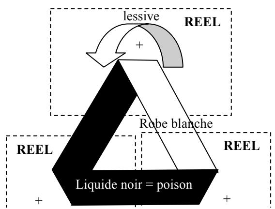

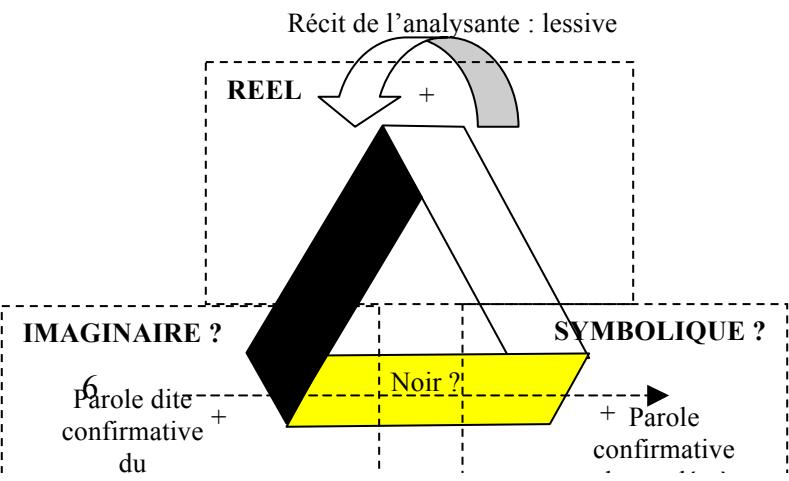

Dans l’écriture de gauche, j’ai tenté de figurer ce qui se passerait si les deux demandes de confirmation « se recoupaient » : la bande a été transformée en une rondelle a deux faces, une noire, une blanche, conformément au caractère forclusif de la négation : si c’est blanc ça ne peut pas engendrer autre chose que du noir. Noir et blanc sont clairement séparés par deux torsions, tandis que la troisième, entre noir et noir, semble perdre sa fonction. Le bord de la bande, figuré par une ligne noire, se confond avec la surface, et la torsion n’est plus lisible. Nous avons donc une bonne écriture du « prendre les mots (les bords) pour des choses (les surfaces) » que Freud mettait au principe de la schizophrénie. La surface tend dès lors à se réduire à sa plus simple expression, celle menaçante d’une coupure omniprésente et Réelle : si sur chaque zone d’écriture on se trouve à la fois dessus et dessous, c’est qu’on est partout sur le bord, ce qui fait coupure entre le dessus et le dessous, sans avoir la possibilité de protection de cet imaginaire, ce voile qu’est une surface. Tout est finalement vu en noir, et ce noir n’est même plus enrobé, il n’a plus de support autre que celui du bord, de la représentation de mot ramenée à une consistance de chose.

Le bord n’a pas de dimension. Tout n’est donc que torsion ; il n’y a pas cette ambiguïté que représente la Bande de Mœbius, de l’effectué au non-effectué de l’équation :

$$
\mathbf {x} - \mathbf {x} (\text { non - effectué }) = \mathbf {0} (\text { effectué }).
$$

L’opposition brutale – forclusive- entre noir et blanc n’engendre pas de bord. Tout n’est que bord, sans surface.

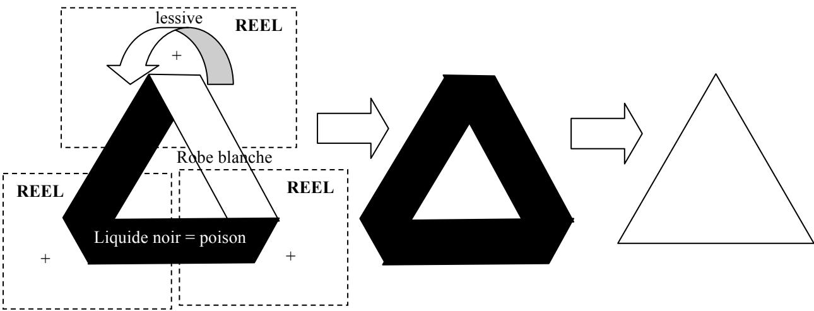

Cependant, l’angoisse dont il est fait état demeure écrite par deux contradictions, deux représentations incompatibles, subsistant après cette opération :

la face noire se situe à la fois au-dessus et au-dessous de la blanche… ce qui laisserait supposer que le noir était là avant la lessive, pas seulement après : un poison déposé par des mains malveillantes. Il se trouve que l’analysante d’Hélène raconte qu’elle est persécutée par ses voisins du dessus comme par ceux du dessous. Elle n’a de place que dans le café d’en face, délogée de sa position de sujet. Elle est l’objet des persécutions

si deux torsions font passer du noir au blanc, c’est qu’il y a deux faces distinctes ; comment expliquer, alors, que le troisième torsion fasse passer du noir au noir ? c’est ce qui engendre tout de même le questionnement à l’analyste, par où elle réintègre a minima une position de sujet.

Bref, nous sommes à nouveau devant un impossible, et ce dernier se trouve confirmé comme Réel.

La prise en compte de l’énonciation change les modalités de l’écriture : c’est l’écriture de droite. Au lieu de prendre les faces et leur couleur pour l’impossible du Réel, on inscrit qu’il s’agit de la contingence des paroles, puisque ce n’est connu de moi que par les paroles d’Hélène, qui ne sait ce dont il s’agit que par les paroles de son analysante, donc par des représentations de mots. Cette façon d’écrire laisse subsister un doute sur la troisième face, ce qui introduit la coupure d’une torsion supplémentaire. Plus exactement, ça réintroduit la 3ème torsion dans sa fonctionnalité. Tout se passe comme si une hétérogénéité avait été introduite dans le sens des torsions .

Bien entendu, Hélène Petitpierre n’a rien confirmé du tout. Elle n’a pas appelé le pharmacien ainsi que son analysante le lui demandait. Mais l’insistance de celle-ci la laisse dans une profonde insatisfaction devant son impuissance. Ce qui l’amène à nous en parler, donc à remettre l’accent sur la parole et non sur le Réel des choses.

Ma première réaction à son récit a été de lui répondre : « mais pourquoi ne pas lui avoir dit : je vous crois ? je crois, non pas à la noirceur du liquide, mais à ce que vous me dites. Ce que vous m’avez dit, il est vrai que vous me l’avez dit et – facultativement – j’en suis touchée. » Autrement dit : une parole, la votre, peut avoir de l’effet, plus d’effet que n’importe quel Réel.

« Avoir de l’effet » : l’effet d’une coupure avec changement de sens de la torsion comme cela commence à s’inscrire dans l’écriture de gauche, ci-dessous : SYMBO

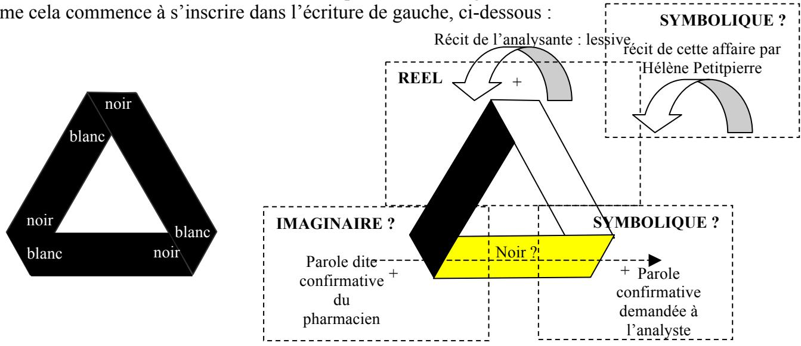

….puis se poursuit avec l écriture de droite, dans laquelle mon écoute d’Hélène, en tierce personne, produit l’équivalent d’un deuxième tour sur la Bande de Mœbius .

Ici, l’écriture de gauche rend compte de cette parole : elle déjà n’est plus le noir absolu du « vécu » telle que l’analysante raconte qu’elle le vit, elle dissocie les représentations de choses (le noir de la surface) d’avec les représentations de mots (inscrits en blanc, comme sonorités signifiantes encadrant la surface). Par l’écoute d’Hélène, l’accent est mis non pas sur la chose, mais sur le « vérifier », autrement dit, sur la vérité. Il lui faut une parole et c’est ce qu’elle réclame. Aux objections du réel qui la confinent dans l’abjection, elle demande à l’Autre une subjection, une parole qui lui confirmerait la vérité de sa parole… pas de l’objet dans l’éprouvette.

Ma réaction au récit d’Hélène renforce cet accent mis sur la question de la croyance.

Elle va dans le sens d’une coupure supplémentaire, mais apparemment, ça ne me suffit pas. J’ai été touché plus que je ne le pensais par son récit, et quelque chose est resté pour moi aussi dans le Réel.

C’est pourquoi j’en rêve. Je m’étais bien rendu compte, au moment du récit, que je me m’étais identifié à Hélène au niveau du rapport à nos mères respectives : impuissance commune. Hélène, elle, se trouve identifiée à son analysante qu’elle identifie à sa mère. A son analysante parce qu’elle est écrasée aussi par la demande de l’Autre, qui lui demande de vérifier, qui, se faisant, lui demande un bord qu’elle n’arrive pas à donner ; ça m’a ramené à cette identification qui est l’identification oedipienne : on est toujours impuissant face à la mère, d’où le fort-da. On la jette au loin réellement pour en ramener, en manière de consolation, d’une part une écriture, l’opposition de jeter et du ramener, d’autre part une parole, la différence phonématique « O-A ».

Ça m’a fait remonter mon impuissance face aux dits-autistes que j’ai pu côtoyer. Face à cette impuissance Chloé n’a que la force de l’écriture, premier encodage des signes de perception. La passion pour les objets durs, qui est la sienne, vient de ce qu’ils ont des bords, qui coupent. C’est ça qui est demandé par l’analysante d’Hélène : une parole qui trancherait, en confirmant que « noir c’est noir », et donc que l’impossible est possible, laissant copuler le Réel et la vérité.

Sous cette condensation d’impuissances couve l’angoisse de castration : voilà le Réel auquel j’ai été renvoyé par le récit d’Hélène Petitpierre. Chloé trimballe en permanence un sac plastique contenant son trésor : des bouts de verres cassés jaunes et bleus, puzzle de la maison de ses rêves, jaune aux volets bleus, qu’elle reconstitue avec une rapidité surprenante.

Ce n’est pourtant pas en se servant de ces couleurs que mon rêve me renvoie, moi aussi, à la maison de mon enfance. Celle-ci n’a rien à voir avec celle de mes souvenirs conscients ; c’est une reconstruction qui tient en un mot : Espaly. Pourquoi cette banlieue du Puy ? je ne vois qu’une réponse : parce que c’est le lieu où est édifié une statue monumentale de St Joseph qui, de son bras levé, salue l’autre statue monumentale installée au centre même de la ville, représentant la vierge à l’enfant.

C’est lors d’un pèlerinage dans la ville de mon enfance que j’avais pu noter, ce qui m’avait échappé autrefois, le serpent sortant sous la robe de la madone. Elle est censée, cette bonne mère, écraser le démon sous son pied. Ce n’est pas sans lui conférer ce caractère phallique d’aiguillon du désir que l’évêque commanditaire de l’ouvrage adore à genoux, statufié à ses pieds. Le dialogue des robes de bronze dénie doublement la castration.

C’est cette confrontation que mon rêve duplique, mettant une jeune fille à la place de la mère.

Espaly s’avère donc le lieu du père. Non pas le père Réel, pas plus qu’il ne s’agit de ma maison réelle, mais le père symbolique, celui auquel on ne peut que croire (« tu croasses ? »). En y installant l’Autre scène, mon rêve demande une autre écriture, qui, au lieu de l’éloignement conféré par les autorités religieuses, redonne au Nom-du-Père toute sa place, ici, la place de surface sur laquelle de nouvelles lettres peuvent trouver inscription.

Dans le film de Christophe Ruggia, le « frère » de Chloé s’appelle : Joseph !

Au dénouement, c’est son nom que prononce la jeune fille en guise de première parole, s’envolant sur une balançoire au moment où il meurt.

Comme tout rêve, mon rêve écrit ce que je ne pouvais dire. Il se pro-pose à la parole. Cette question des couleurs, noir et blancs, j’en rêve en termes de verts et blancs, puis de blanc et violet, laissant de côté les jaunes et bleus qui appartiennent à Chloé. Il se propose comme coupure qui va changer le sens d’une torsion.

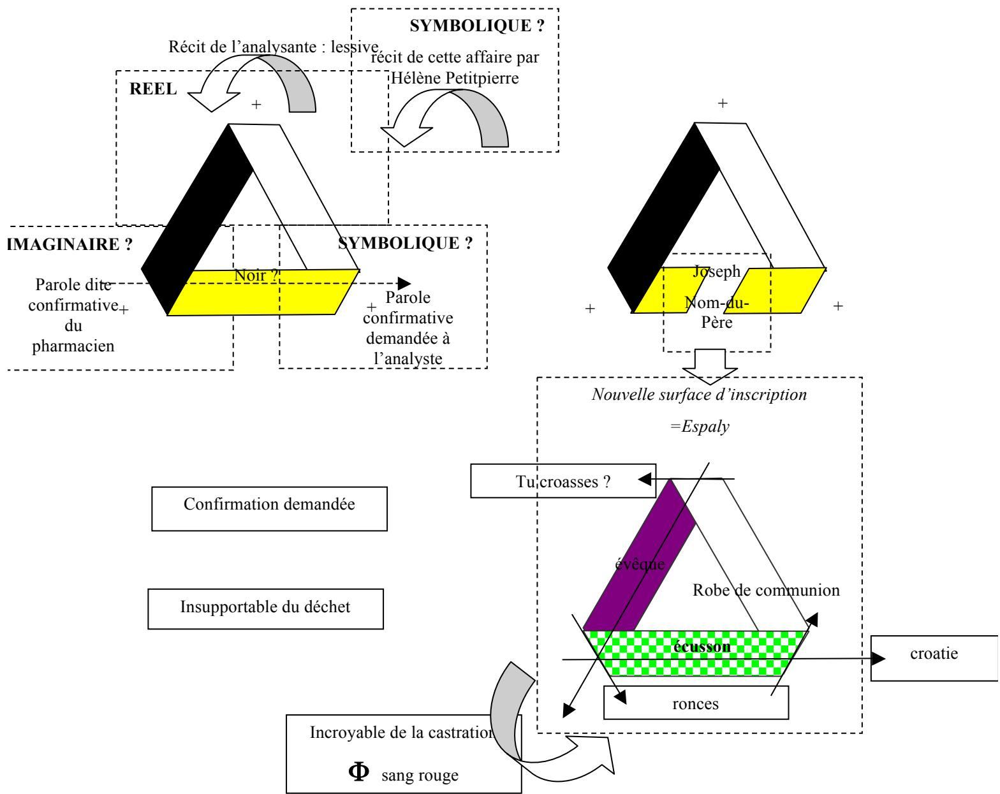

Ni « Espaly », ni « Joseph » n’est explicitement présent dans le rêve. Mais c’est en ce lieu que ça s’inscrit : c’est comme si le rêve tournait la page, ce qui est l’équivalent d’une torsion (passer du recto au verso, d’une face à l’autre), offrant le trou d’une page vierge à l’inscription. La zone jaune le permettait, puisqu’elle s’inscrivait à la fois sous la précédente et sur la suivante, témoignant d’une réintroduction du discorentiel dans

Le noir a été « analysé » c'est-à-dire encodé en robe d’évêque et robe de communion. La question de la castration, qui n’est pas posée, forclose, l’est au moins par ceux qui l’écoutent. Ayant reconnu l’identification, ils peuvent dès lors faire la différence, la coupure à deux tours, là où il n’y avait que coupure à un tour. Le corps déchet « les culs sont pas propres » peu reprendre une part érotique dans la position de la question de la castration.

Hélène me dit en retour de mon dire de mon rêve : « ça alors, figures-toi que quand j’ai fait ma confirmation, je suis passé devant l’évêque vite fait, et qu’il a du me rappeler – Helena, retro … ». Quelque part, elle refusait de confirmer cette parole qui avait été dite pour elle à sa naissance.

Et du coup sans que rien de tout cela n’est été retransmis à l’analysante, elle dit qu’ elle trouve un peu de réconfort, la nuit, à présent, en se blotissant contre son mari, en faisant en sorte qu’il y ait le plus de surface possible commune… y’a une quête d’érotisme qui semble se mettre en place. Là, dans cet endroit commun, les persécutions cessent. Ça cesse de s’écrire.

Dans mon rêve , ça se passe à Espaly, c'est-à-dire à côté de Joseph ; à côté du père. Ce n’est pas imagé, c’est signifié dans le rêve par le nom « Espaly ». C’est la trace de la fonction d’encodage, imaginarisée par la fonction paternelle. Le nom ne retentit pas, pas plus que le lieu n’est figuré. « je le sais » c’est tout. C’est un savoir inconscient .

Noir qui n’arrive pas à se distinguer du blanc : +1, -1

vert –blanc , blanc-violet : encodage du blanc comme coupure entre les bords violets et verts ; le blanc , repéré comme communion, peut, du coup faire séparation.

nomination des six bords : Hélène, l’analysante, Richard, Chloé, l’évêque, Joseph, nom prononcé à la fin du film par Chloé. La question de la parole vraie comme telle. Autour de la question de la foi. De l’autorisation. De la communion, de la confirmation.

Citations annexes :

## Lacan

## L’objet de la psychanalyse

8/6/66 : un mathématicien : « dans la mathématique, on ne dit pas de quoi on parle ». s’il ne dit pas de quoi il parle, c’est qu’il y a de l’inconscient, de l’inconscient irréductible, de l’ürverdrängung. (…) est-ce qu’il est vraiment nécessaire d’apprendre la topologie pour être psychanalyste ? (…) la t. c’est pas quelque chose qu’il doit apprendre en plus, en quelque sorte, comme si la formation du psychanalyste à savoir de quel pot de couleur ion allait se peindre ; (…) la t ; c’est l’étoffe même dans laquelle il taille, qu’il le sache ou qu’il ne le sache pas, peu m’importe qu’il ouvre ou non un bouquin de t ; du moment qu’il fait de la psychanalyse, c’est l’étoffe dans laquelle il taille dans laquelle il taille le sujet de l’opération analytique . patron, robe, modèle, et que ce qui peut être en cause, dans ce qu’il a à découdre et à recoudre si sa t est faite en se trompant, c’est au dépend de son patient (…) cette t, si je n’en avais pas eu un petit quelque chose déjà, comme un petit vent, mais les malades me l’auraient fait réinventer.

…(à propos des souvenirs écrans) . la nécessité que le sujet s’inscrive dans un tableau.

…cette loi qui lie ce par quoi Le sujet est accroché au lieu de l’Autre rend nécessaire ce certain ordre construit autour de l’objet du regard ce qui fait que quand cet objet de l’Autre vient ce dresser sur quelque chose que nous appellerons le tableau, la scène ou l’écran, ce qui est l’accrochage, justement…

RA : c’est des lois de plongement d’un objet (le sujet) dans un espace d’écriture (l’analyste, surface de projection) dont il s’agit.

## XXI

Ce n’est pas l’amour, mais c’est l’amour au sens ordinaire, c’est l’amour tel qu’on se l’imagine. L’amour, c’est évidemment autre chose. Mais pour ce qui est de l’idée, si je puis dire, qu’on se fait de l’amour, on ne fait pas mieux dans cette sorte de connaissance analytique. (…)

c’est pas fréquent, même chez les gens qui s’aiment, qu’ils fassent le même rêve. C’est même très remarquable ; c’est bien ce qui prouve la solitude de chacun avec ce qui sort de la jouissance phallique.

: 11/6/74, p. 185 : la relation, si vous l’écrivez x R y dans cet ordre, en résulte-t-il que x est relaté à y ? pouvons nous de la relation supporter ce qui s’exprime dans la voie active ou passive du verbe ? mais ça ne va pas de soi. C’est pas parce que j’ai dit que les sentiments sont toujours réciproques – car c’est ainsi que je me suis exprimé dans le temps devant des gens qui n’entendent rien à ce que je dis –c’est pas parce qu’on aime qu’on est aimé. Je n’ai jamais osé dire une chose pareille. L’essence de la relation, si en effet quelqu’effet en revient au point de départ, ça veut simplement dire que quand on aime on est fait énamoré. Et quand le premier terme, c’est le savoir ? là nous avons une surprise, c’est que le savoir, c’est parfaitement identique, au niveau du savoir inconscient, au fait que le sujet est su. Au niveau du sens, en tout cas, c’est absolument clair : le savoir, c’est ce qui est su.

21/01/75 p.63 : il n’y a rien dans l’inconscient qui au corps, fasse accord : l’inconscient est discordant. L’inconscient est ce qui de parler détermine le sujet en tant qu’être, mais être à rayer de cette métonymie dont « je » supporte le désir en tant qu’à tout jamais impossible à dire comme tel. Si je dis que le petit a est ce qui cause le désir, ça veut dire qu’il n’en est pas l’objet, il n’en est pas le complément direct, ni indirect, mais seulement cette cause qui, pour jouer du mot comme je l’ai fait dans mon premier discours de Rome, cette cause qui cause toujours ; le sujet est causé d’un objet qui n’est notable que d’une écriture, et c’est bien en cela qu’un pas est fait dans la théorie. L’irréductible de ceci, qui n’est pas effet de langage car l’effet du langage c’est le pathein, c’est la passion du corps. Mais du langage est inscriptible, est notable en tant que le langage n’a pas d’effet, cette abstraction radicale qui est l’objet, l’objet que je désigne, que j’écris de la figure d’écriture a, et dont rien n’est pensable à ceci près que pour tout ce qui est sujet, sujet de pensée qu’on imagine être Être, en est déterminé.

RA Donc l’inconscient et l’objet a sont ici la même chose. Ça détermine le sujet ; ce n’est pas l’effet du langage mais de ce qui est inscriptible du langage, c'est-à-dire une écriture. Moi j’aurais dit que l’écriture fait partie du langage. C’est de la parole qu’il y a effet, effet de cette passion du corps. Mais là je suis pas d’accord, parce que justement, cette passion sur le corps, ça s’écrit, et le corps lui-même écrit. Ça s’écrit justement de ce que la parole n’a pas d’effet, à entendre : la parole n’est pas achevée. L’écriture : « ce qui du langage est inscriptible » « en tant que la parole n’a pas d’effet »

Dans « La lettre volée » Lacan part d’une série de hasard de + et de -. Notons par ces lettres, + et – les différences qui se lisent dans les écritures de la bande de Mœbius. C’est la qu’on constate qu’il y a deux écritures distinctes de celle-ci selon le sens des torsions. Nous adoptons pour cette notation un sens de lecture extrinsèque, comme un lecteur est extrinsèque à la page qu’il lit. Il ne voit que des « dessus », mais les recouvrement de surface lui permettent de lire qu’il y a aussi des « dessous », à condition de choisir un sens de parcours. Comme toute écriture, elle est temporelle, et se doit d’adopter un sens qui distingue ce qui doit être lu avant de ce qui doit être lu après.

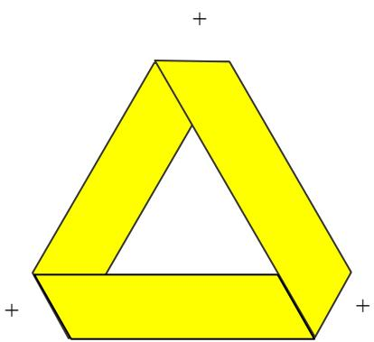

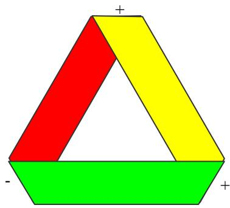

On part en jaune, de + . Au premier tour, + - +. On se retrouve à nouveau sur la surface jaune en +, « dessous », sur une face qu’on avait repérée « dessus », congruement au même signe + auquel on est parvenu. On se trouve bloqué dans le mouvement par cette contradiction : la face jaune est à la fois dessus et dessous. C’est donc qu’entre les deux bords de la face, on a effectué par ce tour une torsion. Cette torsion est écrite par le mouvement de passage Φ entre rouge et vert, sachant que les torsions jaune-rouge et vert-jaune ont participé de ce mouvement. La face jaune reliant les deux extrémités du mouvement, on doit donc la considérer comme l’arrêt du mouvement, le blocage de la fonction sur l’objet a. Le mouvement n’est pas lisible sur la face jaune : ça ne cesse pas de ne pas s’écrire. Pourtant, entre ses deux bords, ça passe d’une face à l’autre. Elle est la torsion, représentée par une surface. Ou encore, elle est le bord auquel cette écriture confère la consistance d’une surface. Indifférenciée en elle-même, elle est ce qui cause la différence entre les deux faces, ce qui cause le désir, là on se trouve contraint de choisir entre une face et l’autre.

De là, on peut choisir (le choix, c’est le désir) un trajet régrédient qui respecte la convention d’écriture précédente : de jaune à vert, de vert à rouge, de rouge à jaune (- + -). Ceci ne transgresse rien : on reproduit la coupure à un tour. Mais on doit changer le signe + et – rattaché à chaque torsion. On a donc un $2 ^ { \mathrm { \dot { e } m \dot { e } } }$ tour, inverse quant aux signes du précédent. Le 2ème tour restitue une cohérence interne à lui même : (- + -) s’opposant à la cohérence interne du 1 tour (+ - +).

On a donc construit deux faces distinctes, l’une dessus, l’autre dessous. Nous avons effectué l’équivalent écrit d’une coupure réelle à deux tours sur la bande de Mœbius. Comme dans cette dernière, il en tombe la surface jaune que nous n’avons pas incluse dans le parcours : une bande de Mœbius identique à la torsion (à la coupure). D’un autre point de vue, ce choix d’effectuer un parcours régrédient et une reculade devant l’objet cause du désir. Il a fait choisir une fuite dans l’inverse, se situant dans un espace sphérique à deux dimensions et deux faces bien séparées, qui ne prend pas en compte ce qui sépare : l’objet cause du désir. Il continue à opérer sa fonction, mais celle-ci n’a pas d’autre consistance que l’inscription du pli ( fonction Φ) qui lui fait face. On passe brutalement d’une couleur à l’autre ; c’est un univers forclusif, comparable à celui de la science ou de la psychose. Ce qui est vert n’est pas rouge.

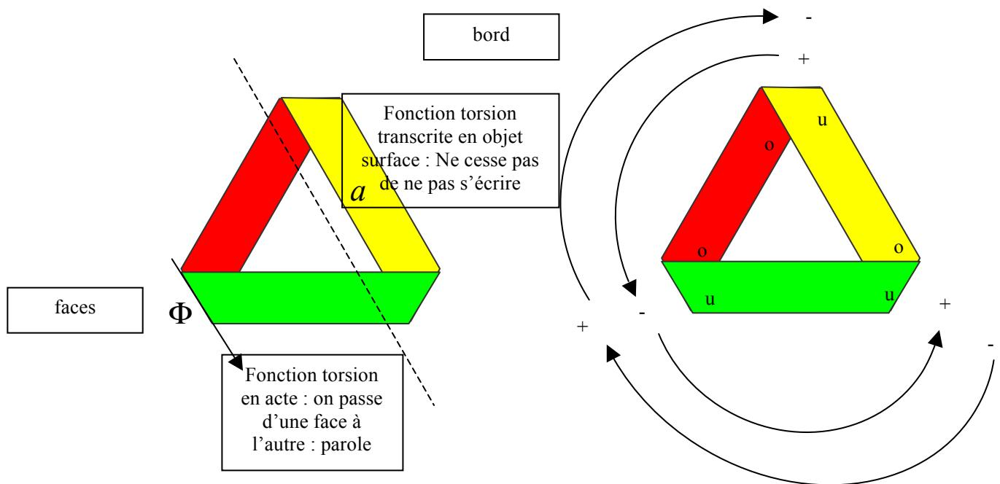  
Ci-dessus, à gauche, c’est l’écriture d’un cross-cap : rondelle rouge et verte , + bande de Mœbius jaune. Le cross-cap, c’est le retour de l’objet sur la fonction (le bord se réduisant à zéro, la surface se retrouve équivalente à la place du trou).

On peut faire un autre choix, qui consiste à rejoindre le bas de la surface jaune à son haut (dimension y) en effectuant de manière symbolique la torsion. On est conduit ainsi à adopter une nouvelle notation, celle des u pour dessus et des o pour dessous, et écrire en haut de la face jaune, (mise en jeu de la dimension y) o à côté de u. On passe de o à u, de dessous à dessus. ( -, + ) est une notation basée sur ce qu’on voit de cette écriture de la bande de Mœbius, c'est-à-dire, ce qu’on y lit . Le code O-U se base non pas sur ce qu’on lit – tout en y faisant référence – mais sur ce qu’on dit de ce qu’on lit. C’est la même face, mais on peut dire tantôt que c’est celle du dessus, tantôt que c’est celle du dessous. Ce qui suppose deux temps et un mouvement, le temps de changer de mot ou d’effectuer symboliquement le mouvement.

Dessus et dessous sont des mots ; il s’entendent, et je choisis de les représenter dans ce modèle par des lettres, c'est-à-dire par une différence phonématique, O- U. Du coup, nous avons un encodage non plus visuel mais sonore, même si, dans la théorie, ces lettres sont visuelles puisqu’elles se lisent.

La représentation de chose ne subit aucun changement, mais les représentations de mots conquièrent ici leur indépendance par rapport aux représentations de choses. Pour chaque face, on peut faire la même opération et se permettre de dire que, symboliquement elle sont dessus ou dessous. L’une des lettres, O, connote ce qu’on ne voit pas localement, mais qu’on peut dire. Le disant, par le biais de la torsion Φ qui représente l’énonciation comme telle, on la fait apparaître comme chose, mais du coup, on refoule la face précédente, qui devient invisible, mais qu’on peut dire… etc.

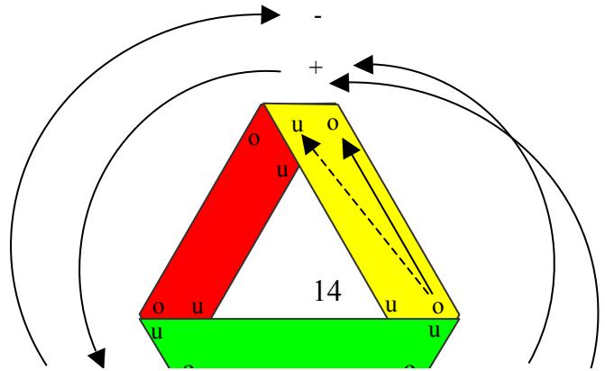

Cette fois après ces deux tours, nous avons un point de vue global sur la structure, un écriture dans laquelle, à la différence des torsions s’est ajouté une différence des bords : les couples de o se retrouvent à l’extérieurs les couples de u à l’intérieur. Des o et des u, pris individuellement, à chaque pli, il y en a un externe et un interne. Donc on est passé d’une notation à un élément différent de l’élément voisin (représentation de chose ou, dans le fortda : loin-près, -1,+1 ) à une notation dans laquelle c’est une couple d’éléments semblables qui a été différencié d’un couple voisin d’éléments semblables (représentation de mot ou, dans le fort-da : O-A).

o-o signifie à présent non plus dessous mais « externe »

u-u signifie à présent non plus dessus mais « interne ».

nous avons un modèle de ce que Freud appelait la double inscription

-1,+1 est l’inscription en termes de représentations de choses (loin-près)

(o-o) (u-u) est l’inscription en termes de représentations de mots (O-A)

mais ce +1, -1, nous n’en avons connaissance que par la parole : nous ne voyons ce que nous « voyons » que dans la mesure où un autre le voit aussi ou si nous croyons qu’un autre a vu : ce qui compte c’est notre accord sur ce que nous avons vu, et cet accord passe par les mots. Ainsi, la première inscription s’avère dans un après-coup une modalité de la deuxième.

Du même coup, de ce point de vue global, nous constatons que le choix de changement de bord peut être fait sur n’importe quelle face. Chaque face peut être lue soit comme bord, soit comme torsion. D’où il vient : le bord représente la torsion, le passage d’une face à l’autre ou, dans l’écriture, le passage de l‘intérieur à l’extérieur. La bande de Mœbius jaune qui est tombée de la coupure à deux tours peut en effet glisser à n’importe quel endroit de la bande rouge et verte.

Ce qui était signifié, c'est-à-dire surface, image, on ne peut rendre compte que par le signifiant , c'est-à-dire, le bord, la torsion.

Par le changement de codage, nous avons engendré des bords consistants entre les faces. Nous avons engendré un « entre », une médiation, un médiateur, une modalité. A partir des signes de perception, nous avons engendré l’inconscient comme surface, conformément au schéma de la lettre 52 :

<table><tr><td rowspan="2">Percp</td><td>I</td><td>II</td><td>III</td><td>Cs</td></tr><tr><td>SP</td><td>Incs</td><td>Pcs</td><td>-</td></tr><tr><td>x x</td><td>x x</td><td>x x</td><td>x x</td><td>x x</td></tr><tr><td></td><td>x x</td><td>x</td><td>x</td><td>x</td></tr></table>

<table><tr><td>écoute0 dimension</td><td>coupure1 dimension</td><td>Surface2 (ou 4) dimensions</td><td>Bord1 dimension</td><td>parole0 dimension</td></tr><tr><td colspan="2"></td><td>Représentations</td><td>Représentations</td><td></td></tr></table>

Les bords sont des écritures du signifiant, ce qui s’écrit de ce qui s’entend. Le passage d’un bord à l’autre, la torsion, c’est l’énonciation. Les surfaces (à deux dimensions) sont les signifiés conscients (rouge et vert), ou encore la signification inconsciente (jaune).

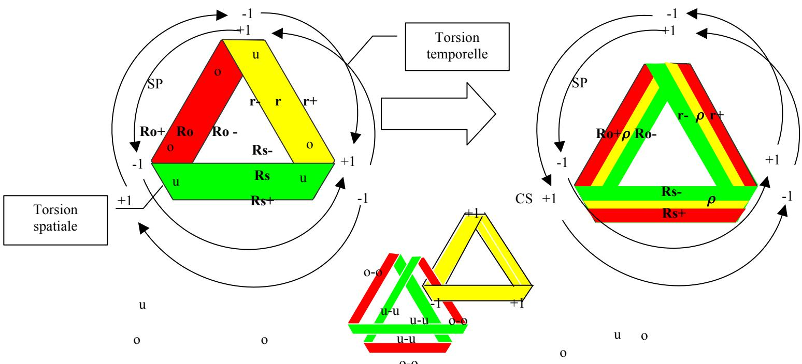

Si on prend encore plus de hauteur et qu’on englobe dans notre point de vue la coupure à un tour et la coupure à deux tours, on est obligé de passer à un troisième encodage :

o-o qui est (+1 à -1) Ro+

o-o qui est (–1 à +1) Rs-

$$
\text { o - o   qui   est } (+ 1 \rightarrow + 1) \quad r +
$$

u-u qui est (+1 à -1 ) Ro-

u-u qui est ( –1 à +1) Rs+

u-u qui est (+1 à +1) r-

ce qui nous donne un encodage à six écritures, six-gnifiant : ce sont les six bords du nœud borroméen. Le premier couplage O-O et U-U n’aurait pas pu se faire sur deux faces. Il en fallait trois, et c’est le double parcours sur les trois qui est le parcours de la structure.

3 x 2 = 6. Le premier encodage est celui des signes de perception (+ ; -) à l’inconscient. Mais Le second est en fait un déchiffrage de la structure, le passage au préconscient. Ro +, etc.. sont les représentations de mots qui viennent dire les représentation de choses.

L’encodage u-u, o-o donne une consistance aux bords, soit, en même temps à la surface qui s’étend entre les bords. Le décodage Ro+ etc… donne un ex-sistance à la structure. Ça dit la fonction et l’objet, l’inorientable et l’orientable, l’orientable orienté et l’orientable inorienté ;