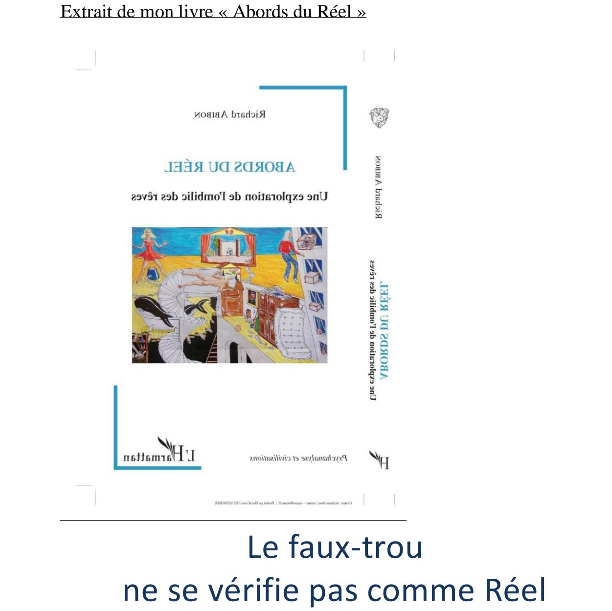
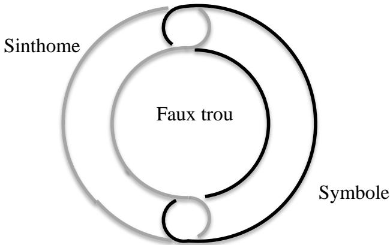
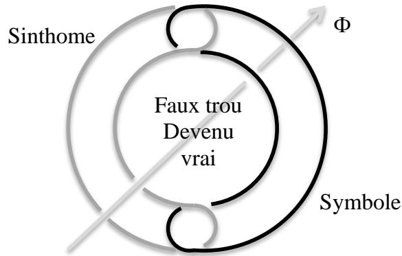
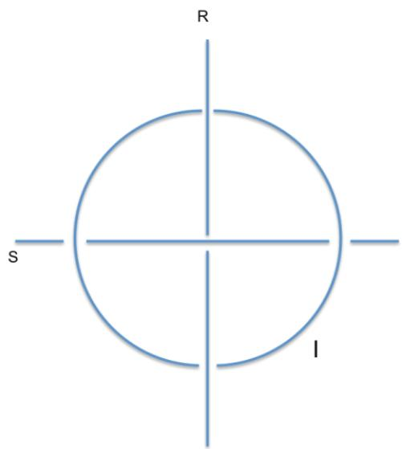

# Le faux-trou ne se vérifie pas comme Réel

Tout cela va dans le sens de mon interprétation du travail de Lacan autour du fauxtrou1. J’ai déjà indiqué en quoi la simple position d’un jugement, qu’il soit vrai ou faux, supposait une proposition, donc une représentation imaginaire parfaitement symbolisée, qui ne permettait pas l’emploi du terme « Réel » défini comme « ce qui résiste à la symbolisation ». Le Réel ainsi défini suppose la forclusion du jugement, ce qui n’est pas le cas lorsqu’on juge que la figure est fausse. A propos de la droite infinie (ou du troisième rond) qui vient faire tenir le faux-trou, Lacan énonce qu’elle vient « vérifier que le trou est réel ». C’est quand même un problème, lorsqu’on se rappelle qu’il venait de définir le symbolique comme trou2. En apposant ainsi le vrai et le réel, il déplace la signification du mot du côté de

2 Le 9/12/75 : « …que ce soit le trou que je fasse l’essentiel de ce qu’il en est du Symbolique… »

la réalité, en contradiction de ce qu’il avait dit le 09/12/75, où il oppose au contraire la vérité et le Réel : « il n’y a de vérité - comme telle - possible que d’évider ce Réel ».

On peut aller un peu plus loin. Que sont ces deux ronds en souffrance de « vérification » ? Le symbolique (ou parfois le symbole), dit Lacan, et le sinthome. Le symbolique perd à nouveau sa définition de « trou » pour redevenir une consistance, qui ellemême était définie comme imaginaire au début de ce séminaire. Quant au sinthome, anciennement symptôme, nous savons depuis Freud qu’il symbolise un conflit entre deux représentations contradictoires, ou éventuellement faire inscription d’une trace Réelle. Il peut donc aussi représenter le travail du symbolique s’attaquant à un morceau de Réel incrusté quelque part dans le corps, à moins que ce travail ne soit justement ce qui provoque cette incrustation.

Nous avons vu, par l’exploration des rêves, comment le phallus se profile au bord du Réel en tant que l’une des représentations de la machine à représenter, lorsque celle-ci se trouve mise en échec. Dans l’allégorie du faux-trou, la droite infinie vient bien compléter le dispositif afin qu’il tienne. On pourrait donc dire que la configuration précédente, à deux ronds (ci-dessus), était une représentation théorique du trou qui ne tient pas, donc Réel, en contradiction avec ma première interprétations, qui faisait de cette écriture un symbolique, du seul fait que c’est une écriture. Le phallus, sous la forme de la droite infinie, vient à cette place, non pas vérifier, mais transformer la configuration en une représentation qui tienne… dans la réalité, en vérifiant l’imaginaire du rapport sexuel. Après coup, nous pouvons encore affirmer que cette présentation du trou qui ne tenait pas correspond à l’absence de représentation du féminin dans l’inconscient. Le phallus la représente comme un effet de la castration : là où il devrait y avoir, il n’y a pas. Tels sont les termes insoutenables de la contradiction. On en retrouve trace dans ma double interprétation de ce qui est toujours une écriture, même si on feint de l’abstraire pour croire à la réalité des ronds de ficelle qu’elle représente.

Nous pourrions dire aussi : ces deux ronds accouplaient deux représentations contradictoires, ce symbole faisant symptôme, ou le contraire si on préfère (le symptôme faisant symbole). Mais le phallus vient toujours faire représentation de ce qui les fait se

symboliser l’un l’autre, ce qui élève le symptôme à sa fonction de symbole. Il fait aussi symbole de ce qui vient symboliser le travail du symbolique tel que mis en échec par le Réel. En effet, la figure percée de la droite infinie est une nouvelle écriture qui, pour tenir comme représentation, n’est pas pour cela une représentation de celle d’avant, mais sa complète transformation.

Ces deux interprétations me semblent cohérentes avec la pratique de l’analyse des rêves et des symptômes. Mais dans tous les cas, on ne saurait dire que le trou obtenu est Réel : il est une écriture symbolique imaginant le trou, vérifié comme vrai. C’est dans l’après coup de ce nouage que l’on peut dire quelque chose des deux ronds : par exemple que le symptôme était le symbole de deux représentations contradictoires, ou que l’écriture précédente écrivait théoriquement l’impossibilité pratique d’écrire le féminin dans la psyché. Mais le symbolique, à nous en tenir à la définition choisie de « trou », ce n’est pas le symbole, qui est ici une consistance, c'est-à-dire un rond de ficelle, c'est-à-dire un imaginaire. Le symbolique, c’est le trou une fois vérifié par la droite phallique, vérifié comme vrai et non comme Réel.

Quoiqu’il en soit, d’un simple point de vue de clarté sémantique, si nous avons choisi de définir le symbolique comme trou, alors aucun trou ne saurait être Réel.

Une dernière remarque sur ces élaborations de Lacan, cette fois à partir de La troisième. A propos du dessin suivant :

de figure, est la seule à ne pas se refermer, donc à ne pas faire bord. Mais ça entre en contradiction avec sa nomination comme « phallus », qui est justement la seule représentation finie qui peut se tenir sur le bord du réel. Par contre, ça va dans le sens du schéma I et de ses hyperboles.
