# Richard Abibon L’Afrique de JosÅphine

Lacan : Ä les non dupes errent Å, 11 juin 1974 :

Il y a une personne (…) c’est que tout est centrÇ autour de ceci qu’il voit se reproduire dans un de ses rÉves une note Ñ proprement parler sÇmantique – Ñ savoir que ce n’est pas vraiment lÑ comme notÇ, articulÇ, Çcrit - qu’il voit se reproduire dans un de ses rÉves une note sÇmantique du rÉve d’un de ses patients. Il a bien raison de foutre Ü connaissance á dans son titre.

Cette espàce de mise en covibration, en covibration sÇmiotique, en fin de compte, c'est pas Çtonnant qu'on appelle âa comme âa pudiquement le transfert. Et on a bien raison aussi de ne l'appeler que comme âa. Ca, je suis pour. Ce n'est pas l'amour, mais c'est l'amour au sens ordinaire, c'est l'amour tel qu'on se l'imagine.

J’ai rÅvÇ ceci :

Je suis agent des services secrets d’un pays africain. (Mauritanie ?) . Mon chef, un bÇdouin, me demande de signer un rapport sur le dÇsert. Mais on n’a pas explorÇ le dÇsert ! J’ai quelques rÇticences Ñ signer, nÇanmoins avec le sourire. ÜMais si tu signeras á. Oui, bien sär, dis-je mais on aurait quand mÉme pu explorer un peu avant. Et on va faire âa un petit peu quand mÉme, avant la remise du rapport, mÉme s’il est dÇjÑ singÇ.

Je vais Ñ la cantine ; une serveuse est en train de remplir un quand plat en zinc. Des sortes de hachis de viande prÇsentÇ en pain puis dÇcoupÇs en tranches. Pas terrible, mais pas mal. ãa baigne dans une sauce brune mais assez lÇgàre, claire.

A cåtÇ, deux jumelles mauritaniennes mangent. Elles ont une excroissance verticale sur le front, sur la droite (je le vois Ñ ma gauche) comme une antenne de chair. Mais c’est un long grain de beautÇ ou quelque chose comme âa.

A l’infirmerie on me dit que j’ai propagÇ le sida dans le pays (ou la shoah). Mais finalement non. C’est parce que je suis un tel habituÇ de ce laboratoire, que les instruments sont imprÇgnÇs de mes donnÇes biologiques ; ce n’est donc pas moi.

A l’Çpoque oÉ j’ai fait ce rÅve, je rentrais de Chine, oÉ j’avais fait une excursion Ñ dos de chameau dans le dÇsert du nord de ce pays, dans le Ganzhou. Au dispensaire oÉ je travaille, je reÖois aussi pas mal de kabyles, mais ce ne sont pas forcÇment des habitants du dÇsert. De mon excursion chinoise, j’ai ramenÇs quelques photos de moi sur un chameau, attifÇ comme un bÇdouin : il fallait bien se protÇger du soleil et du vent de sable.

Donc, s’il y a dÇsert et bÇdouins, c’est bien de moi et de Chine dont il s’agit. Alors que vient faire lÑ l’Afrique ? Je n’ai aucune accointance avec ce continent. Je suis allÇ au Maroc voir mon frÜre quand j’avais 15 ans, c’est bien loin. Et c’est tout. Je n’ai pas d’amis africain, je ne travaille pas avec des africains (sauf les kabyles, mais ce ne sont pas des africains, ce sont des kabyles), encore moins mauritaniens.

Une question de fric, comme le laisserait supposer l’usage lacanien du signifiant ? Je ne vois pas. Ou plutát je ne l’entends pas de cette oreille. MÅme les bons jeux de mots, Öa ne marche pas Ñ tous les coups.

Par contre il est un ÇlÇment imagÇ du rÅve qui m’adresse tout de suite une association : les jumelles. Deux jours auparavant, JosÇphine, une de mes analysantes m’avait racontÇ le rÅve suivant :

Il y a un matelas par terre chez vous, je suis sur ce lit avec une femme. On a une couette sur nous. Vous Ätes allongÅ par terre pas loin ; Ç un moment deux jumelles arrivent, avec des cheveux gris et frisÅs. On se moque d’elles.

Le rÇcit d’un autre rÑve accompagnait celui-ci :

Je me suisfait enlever par des jeunes gens qui me violent.

…et Üa lui rappelle un rÑve qu’elle a fait il y a un moment, dans lequel je cherchais á pÇnÇtrer chez elle.

Elle associe : j’ai peur que vous pÇnÇtriez mon esprit…

Je dis : seulement l’esprit ?

Puis plus tard comme elle s’interroge sur ces jumelles : peut-Ñtre ma màre…

Elle a les cheveux blancs ?

Non gris et frisÇs.

Alors apràs un silence je dis : les jumelles ?

Petit silence, puis elle complàte: ah, les jumelles pour voir !

J’ai proposÇ aussi une possible inversion : qui se moque de qui ?

Comme d’habitude je ne mets pas de guillemets, puisque ce que j’Çcris lá, c’est ce que j’ai retenu de ce que j’ai cru entendre de nos Çchanges ; Üa ne prÇtend á nulle objectivitÇ. Au contraire, Üa se veut assumer la subjectivitÇ de l’Çcoute, qu’il s’agit justement d’interroger ici. L’objet de ce travail, c’est l’objet de la psychanalyse, c'est-á-dire le transfert, et non la personnalitÇ de celui-ci (l’analyste) ou de celle-lá (l’analysante).

Lacan a dit quelque part que l’objet de la psychanalyse, c’est l’objet a. Qu'est-ce que c’est ? C’est l’objet cause de dÇsir, et comme tel, c’est un objet absent. Dans les Çlaborations de Lacan sur le miroir, cet objet n’a pas d’image. Il est donc dÇsorientÇ. Par contre il oriente le reste de ce qui se reflàte dans le miroir, c'est-á-dire l’ensemble de nos reprÇsentations, qui sont en effet tournÇes vers ce qui mobilise le dÇsir, les substituts de cet objet a qui viennent recouvrir le trou de son absence dans l’image.

L’objet a est cause du dÇsir et le dÇsir – autre dÇfinition de Lacan – c’est le dÇsir du dÇsir de l’Autre. Autrement dit il est vain d’essayer d’isoler le dÇsir de celui-ci du dÇsir de celle-lá. Le dÇsir de chacun Çtant le dÇsir de l’Autre, il s’Çtablit entre les deux une sorte de circuit dans lequel chacun dÇsire Ñtre l’objet du dÇsir de l’Autre, cet Autre intrinsàque Çtant, pour chacun Çgalement, confondu avec l’autre que chaque Un devient pour son interlocuteur. Ce circuit, forcÇment, ne doit pas tourner tràs rond. Il doit y avoir du reste, et ce reste doit bien Ñtre cet objet absent autour duquel chacun des deux tourne.

Lacan a dit par ailleurs que la place de l’analyste Çtait celle de l’objet a. C’est ce que nous allons dÇcouvrir peu á peu, non pas thÇoriquement, mais cliniquement.

Le rÑve que j’ai racontÇ au dÇbut de cet article, je l’ai fait la veille du jour oä JosÇphine devait avoir sa sÇance, la sÇance suivant celle oä elle m’avait racontÇ son propre rÑve. Les jumelles, voilá donc le signifiant qui fait pont entre son rÑve et le mien. Je dis signifiant, parce que je vous en parle, et vous en parlant, je fais fonctionner le systàme des signifiants. Mais dans mon rÑve, ce n’Çtait nullement un signifiant, puisque, un signifiant, Üa s’entend, et que dans mon rÑve je n’ai rien entendu du tout, j’ai vu ces jumelles. C’est ainsi qu’au rÇveil, ce voir c’est transformÇ en lire, et j’ai lu le signifiant que j’avais entendu deux jours auparavant de la bouche de mon analysante, et qui s’Çtait Çcrit ainsi dans ma mÇmoire.

Les jumelles vues en rÑve, je leur accorde le statut de lettre. La lire et en parler, voilá qui fait passer cette lettre au statut de signifiant.

Elle-mÑme avait employÇ ce signifiant, mais dans son rÑve elle n’avait entendu, disaitelle que les moqueries qu’elle et sa compagne de lit adressaient aux jumelles. Je suppose qu’elle avait donc vu, puis, tout comme moi, lu, une lettre semblable : Ä des jumelles Å.

Avant de m’interroger sur ses jumelles, je me questionne sur les miennes, puisque dans une premiàre tentative interprÇtative je lui avais posÇ la question : des jumelles ? Avec cette arriàre pensÇe qui m’avait fait entendre le petit appareil d’optique qui sert á rapprocher l’image de ce qui est loin. C’Çtait ma faÜon de l’entendre, enfin, au moins une autre faÜon de l’entendre. Je ne lui avais donc pas proposÇ cette signification, puisque c’Çtait la mienne. Je m’Çtais contentÇ de faire retentir ce signifiant de maniàre interrogative : des jumelles ? Elle l’avait donc entendu á ce moment lá avec la mÑme signification que celle que j’avais en tÑte : des jumelles ?...ah, pour voir ! La suite de mon idÇe, c’Çtait qu’il s’agissait de la surveillance qu’avec des jumelles on peut exercer á distance. C’est pourquoi j’avais aussi proposÇ : et si c’Çtait l’inverse ?... á propos du sens dans lequel circulaient les moqueries entendues. Et si ces jumelles reprÇsentaient la surveillance morale qui vient dÇranger une scàne d’intimitÇ amoureuse ? Les Ä moqueries Å sont souvent la faÜon dont se traduit la surveillance : c’est ainsi qu’on mesure la distance par rapport á une norme morale ; on se moque de qui on s’imagine ne pas Ñtre comme il devrait.

Pour l’instant je ne fais que mettre á plat mes propres prÇjugÇs, c'est-á-dire la faÜon dont j’ai entendu ce qui m’Çtait dit. Autrement dit encore : par rapport á quelle norme, á travers quelles dÇformations, aussi bien morales que thÇoriques, j’ai cru comprendre ce que j’ai pris en moi.

Nul doute que c’Çtait donc ce rÑve de mon analysante qui m’avait touchÇ au point de me faire reprendre l’Çcriture d’un de ses signifiants sous forme de lettre (l’image des jumelles) dans un de mes propres rÑves. J’en restais tout perplexe de ce continent noir, l’Afrique qui venait servir de toile de fond á mon rÑve. J’attendais donc sa sÇance suivante avec une grande curiositÇ.

Lorsqu’elle arrive, le lendemain, j’ai la surprise de la trouver plus mignonne qu’á l’accoutumÇe. Je me dis qu’elle a quelque chose de transformÇ. C’est possible, mais c’est surtout moi qui suis transformÇ par l’intÇrÑt, c'est-á-dire la libido. Elle s’allonge. J’attends, me disant que l’importance de son rÑve ne peut que l’amener á parler encore… eh bien, non, silence. Et donc au bout de quelques minutes d’impatience (sic…), j’en viens á lui dire : Çcoutez, si vous n’avez rien en tÑte, il serait bien de revenir á votre rÑve de l’autre jour. Oui, mais quoi en dire ? RÇpond-elle, j’ai tout dit. Sãrement pas !

Mais comme rien ne vient, je me remets á poser des questions. Qui Çtait cette femme avec laquelle vous vous retrouvez au lit ? Je ne sais pas. Elle vous fait penser á qui ? Eh bien…la derniàre fois quand je suis sortie de votre bureau, il y avait une femme dans la salle d’attente…je l’ai trouvÇe tràs jolie ; je suppose que Üa peut Ñtre cette femme. Alors, vous aviez dit que j’Çtais allongÇ aussi dans ce bureau. Plus prÇcisÇment, oä ? Ben, á cåtÇ de notre lit. Et puis vous savez, ajoute-t-elle, je crois que c’est un petit dÇplacement : en fait c’est dans le lit que vous auriez pu Ñtre, á la place de cette femme. Ah !? Et vous traduisez Üa comment, en dÇfinitive ?- eh bien, j’ai envie de coucher avec vous !

Voilá qui a le mÇrite d’Ñtre clair : mon rÑve, l’attention nouvelle que je porte á sa personne ne vient pas lá par hasard. Comme le disait Lacan l’amour est toujours rÇciproque. Je n’en savais rien, elle non plus : nos rÑves respectifs nous tiennent au courant.

Mais Üa ne me suffit pas. Et l’Afrique ? Continent noir ! Le mystàre reste entier. Je poursuis donc mon questionnement.

Tràs bien, peut-Ñtre bien que vous souhaitez me mettre dans votre lit, mais, prÇcisÇment, dans le rÑve, vous ne m’avez toujours pas dit comment j’Çtais positionnÇ ? Eh bien, dit-elle, voilá : vous Ñtes, comment dire, (elle hÇsite), lá-bas (elle indique ses pieds), comme si vous aviez la tÑte au niveau de mes pieds, et allongÇ comme moi, dans le mÑme sens - ah ! Dans le prolongement de votre corps alors !

Je vais de surprises en surprises, mais je reste taraudÇ par une question interne : et mon Afrique ? Je ne vais pas en parler Çvidemment, ce serait induire une rÇponse. Je questionne encore : et ces jumelles, vous ne m’en avez pas dit grand-chose. Connaissez-vous des jumelles ? Non. Cela vous fait-il penser á quelqu'un ? Non. Comment sont-elles arrivÇes prÇcisÇment ? Eh bien, par la gauche , et elles se sont arrÑtÇes devant un fauteuil qui est á vos pieds. De lá, elles nous regardent. Comment sont-elles habillÇes ? Un costume gris… des cheveux gris… c’est assez flou, c’est surtout leurs cheveux gris qui se dÇtachent de l’ensemble. Ah bon ? Ils sont comment ces cheveux ? DÇcrivez les moi prÇcisÇment. Ils sont gris, frisÇs, tràs frisÇs… vous savez Üa fait une boule autour de la tÑte, comme les africaines…

Ah ! Voilá mon Afrique, á l’endroit oä je m’y attendais le moins.

Mais ce n’est pas tout, car elle enchaçne aussitåt, comme illuminÇe de sa dÇcouverte : ah oui, ces deux boules, Üa fait comme des testicules, et votre corps, un pÇnis !

Ma surprise est á son comble : je m’attendais vraiment pas á une chose pareille ! Je demande : alors finalement vous traduisez comment cet aspect de votre rÑve ? La rÇponse vient d’un trait : j’ai envie d’un pÇnis !

Bien sãr, j’ai aussitåt demandÇ si cette lumineuse rÇplique n’avait pas ÇtÇ un peu trouvÇe dans les livres de psychanalyse. Oui, elle avait lu des choses dans ce sens. Mais lá, l’Çvidence la frappe trop clairement : dans son rÑve, l’association des deux chevelures africaines et de mon corps lui fait indubitablement penser á un pÇnis dans le prolongement de son corps. Audible dans le ton de sa voix, sa surprise Çtait telle, á l’aune de la mienne, qu’on ne peut, je crois, mettre en doute cette bonne foi.

Voilá en tout cas une explication á l’Afrique de mon rÑve. Et pourtant, Üa reste insatisfaisant. Comment expliquer le fait que j’ai pris cette Afrique comme scàne de mon rÑve, alors qu’elle n’en avait pas encore parlÇ ? Il est vrai que dans mon rÑve, le mot Afrique n’est pas prononcÇ non plus. Je me vois comme un agent secret des films d’espionnage que j’ai pu voir Çtant jeune. Je me donne le profil de Lino Ventura. Je ne suis donc pas noir. Par contre je suis environnÇ de gens plutåt cafÇ au lait, comme mes jumelles. Elles n’ont pas, chez moi, la coiffure afro, ni grise, mais une excroissance de chair qui semble Çcrire la mÑme chose que son interprÇtation parlÇe du lendemain : j’ai envie d’un pÇnis.

A priori, je ne suis pas dans la croyance á la tÇlÇpathie. Par consÇquent, je dois trouver une autre explication.

Tentons de formaliser le rÑve de JosÇphine en une sorte de topologie ÇlÇmentaire. Essayons de le lire á la lettre. Le scàne, schÇmatisÇe et vue du dessus, donnerait ceci :

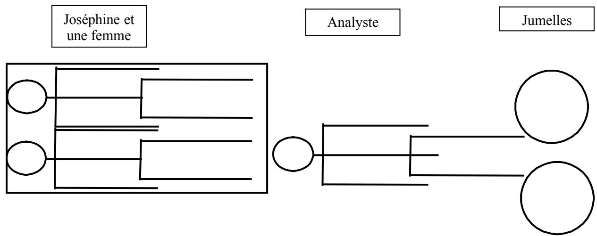  
Quant á mon rÑve personnel, on pourrait l’Çcrire ainsi :

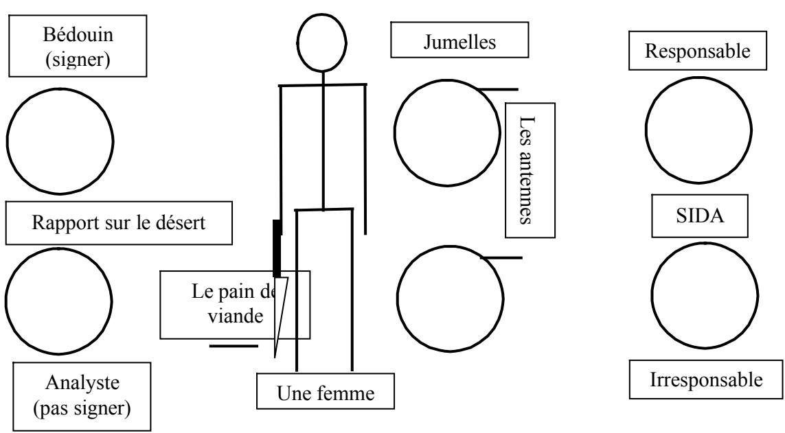

Et nous ne pouvons pas ne pas Ñtre frappÇ de la similitude du travail du rÑve, qui, chez l’analysante comme chez moi, semble Ñtre la division. Celle-ci se subdivise en deux grandes catÇgories :

l’une, synchronique, renvoie á l’expression de la mÇtaphore : une femme pour JosÇphine, un bÇdouin pour mon surmoi, deux qualificatifs pour l’ÇpidÇmie de sida : responsable et irresponsable.

l’autre, diachronique, renvoie á l’aspect successif de la mÇtonymie : la doublure JosÇphine-une femme se difracte dans les jumelles ; le couple bÇdouin-moi-mÑme se poursuit dans mes jumelles á moi, puis dans la division responsable-irresponsable de l’ÇpidÇmie de Sida.

Ce qui fait que dans leurs divisions croisÇes, horizontale (mÇtonymie) et verticale, (mÇtaphore), les deux rÑves prÇsentent une singuliàre congruence de structure :

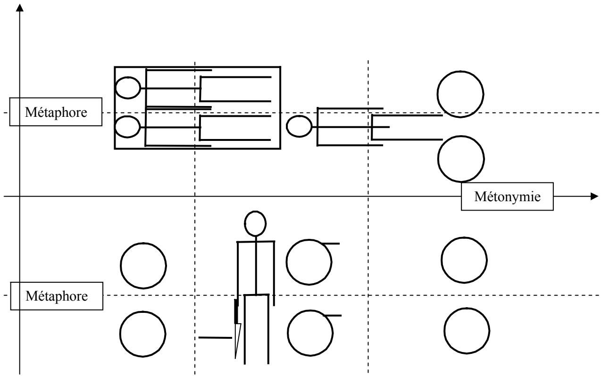

Cette simple mise en place graphique fait apparaçtre une identitÇ lá oä on n’aurait pu la soupÜonner. Dans mon rÑve d’homme, l’opÇrateur de la coupure est une femme, ce qui amàne á lire dans le rÑve prÇcÇdent l’analyste comme assurant cette mÑme fonction, homme dans un rÑve de femme. Dans les deux cas, cet opÇrateur se situe au centre mÇtaphoro-mÇtonymique des deux rÑves et donc du transfert.

Mais comme on le voit il y a aussi identitÇ de structure entre le travail de la mÇtaphore et celui de la mÇtonymie : toutes deux divisent. On peut donc supposer que, au-delá de la diffÇrence temporelle, la mÇtonymie n’est qu’une mÇtaphore qui se dÇploie dans le temps. Or, comme pour faire une phrase il faut bien que l’aspect diachronique se referme en revenant sur son point dÇpart – car pour comprendre la phrase, il faut bien en avoir retenu synchroniquement tous les ÇlÇments exposÇs diachroniquement – il apparaçt que la bande de Mœbius est une bonne Çcriture du phÇnomàne :

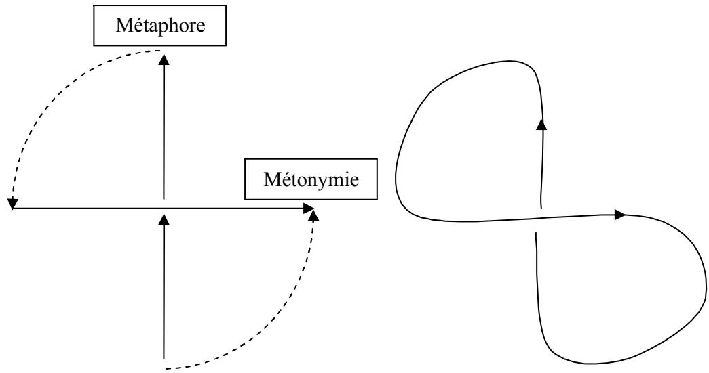

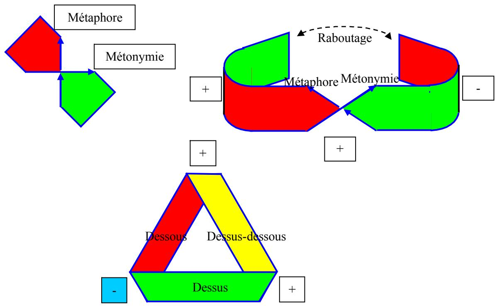

A partir du croisement initial qui se referme sur lui-mÑme, on lit la torsion de la bande de Mœbius, dont j’ai dÇmontrÇ par ailleurs2 qu’elle Çtait non pas une, mais triple. En effet, pour refermer la bande de papier ainsi formÇe Ñ partir du croisement initial, lu cette fois comme une torsion permettant de passer d’une face Ñ l’autre3, je suis obligÇ d’en passer par deux torsions supplÇmentaires. Le collage d’une face avec l’autre face me contraint par ailleurs Ñ inaugurer une nouvelle couleur, jaune, car cette face raboutÇe est, de mon point de vue, Ñ la fois verte et rouge. Je prÇcise bien : de mon point de vue, car il n’y a pas d’objet sans sujet, ce dernier se situant forcÇment dans un point de vue par rapport Ñ l’objet. Donc, de mon point de vue de sujet construisant une bande de Mœbius, je vois au moment du raboutage que, puisque je mets en contact la face dessus (verte) avec la face dessous (initialement rouge), qui de mon point de vue deviennent alors toutes deux â dessus ä, je ne peux me dÇcider pour l’une ou l’autre de ces couleurs : il faut bien en choisir une troisiÜme. C’est lÑ oÉ nous retrouvons l’indÇcidable du thÇorÜme de Gãdel4. Cette troisiàme zone, donc jaune, de la mise á plat de la bande de Mœbius, reprÇsente dans sa localitÇ la caractÇristique de la globalitÇ de la bande (partout dessus-dessous), par opposition á ses caractÇristiques locales (une zone verte, dessus, une zone rouge, dessous).

Nous avons obtenu l’Çcriture de la mise á plat de la bande de Mœbius, qui peut se lire comme le passage d’une face á l’autre par le moyen d’une face commune, jaune : c’est l’Çcriture du transfert, c'est-á-dire de ce qui passe entre l’analysant et l’analyste, non pas pont entre deux structures, mais structure commune. Elle reprÇsente donc ce qui s’est transfÇrÇ d’un rÑve á l’autre, par le biais du signifiant– c'est-á-dire par le propos qui a ÇtÇ ÇchangÇ, dit et entendu, car sinon, on peut rien savoir du rÑve comme tel.

Par contre, pour rendre compte thÇoriquement de ce qui se passe dans un rÑve je dois effectuer le collage par une torsion de sens inverse. C’est Çvidemment une reconstruction thÇorique effectuÇe apràs-coup. Mais celle-ci rend compte de l’assertion de Freud : Ä l’inconscient ignore le temps et la contradiction Å, puisque dans la figure obtenue, il n’est plus possible de faire la diffÇrence entre le dessus et le dessous, qui entrent en contradiction partout.

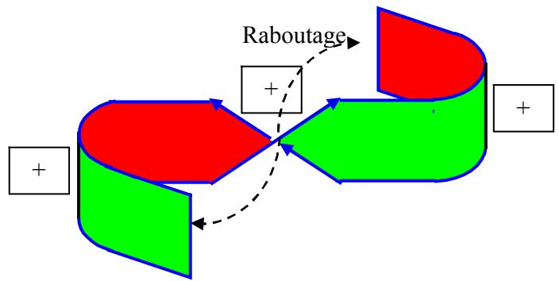

En raboutant ainsi, je m’aperÜois, á la mise á plat, que toutes ses torsions sont de mÑme sens (notÇe ici d’un +), et que toutes ses zones sont semblables. Elles sont toutes dessus-dessous. Je suis obligÇ de toutes les colorier en jaune :

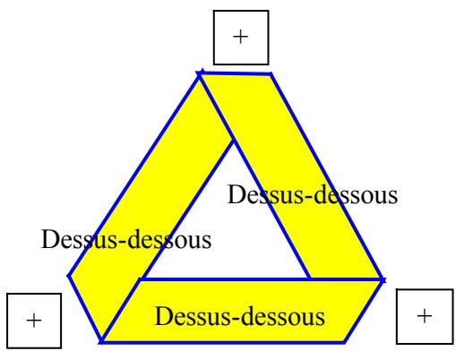

Comme la bande prÇcÇdente, c’est une bande de Mœbius, parce qu’elle n’a qu’un bord (mÇtaphoro-mÇtonymique), qu’une face, et trois torsions. Mais elle est homogàne, car ses trois torsions sont de mÑme sens (notÇe +), tandis que l’autre, hÇtÇrogàne, prÇsentait une torsion de sens contraire (notÇe -). Cette derniàre occurrence permet de prÇsenter la mise á plat comme l’analogue d’une coupure, c'est-á-dire encore comme l’analogue de la parole. Dans le rÑve, on ne parle á personne, il n’y a pas d’autre. Les diffÇrents personnages sont en fait des Ä zones distinctes Å du moi du rÑveur, comme le sont ces trois zones, en rÇalitÇ structuralement semblable, de la bande de Mœbius homogàne.

C’est cela l’Çcriture topologique de la psychanalyse : trouver une Çcriture qui prÇsente les mÑmes caractÇristiques que ce qu’elle Çcrit ; il ne s’agit pas d’un placage de significations sur un schÇma, il s’agit d’une Çcriture qui a ses propriÇtÇ intrinsàques, et celles-ci sont les mÑmes que celles du fragment de moment analytique considÇrÇ. En fin de compte ce qui se dÇgage de l’exercice ce sont le lois de l’Çcriture, c'est-á-dire de la mise en mÇmoire consciente et inconsciente, dans son articulation á la parole qui, elle, ne cesse pas de ne pas s’Çcrire.

Dans le rÇcit de l’analysante, l’analyste n’est pas apparu comme Çtant un dÇdoublement de qui que ce soit. C’est pourquoi je le situe un niveau d’une torsion, c'est-á- dire de ce qui met en rapport. Il semble que la femme qui coupe un pain de viande, dans le rÑve du dit analyste, soit aussi de cet ordre lá : elle n’est pas dÇdoublÇe, c’est elle qui dÇdouble. De mÑme que l’analyste dans le rÑve de l’analysante, elle prÇsentifie la fonction (coupure) et non l’objet (coupÇ).

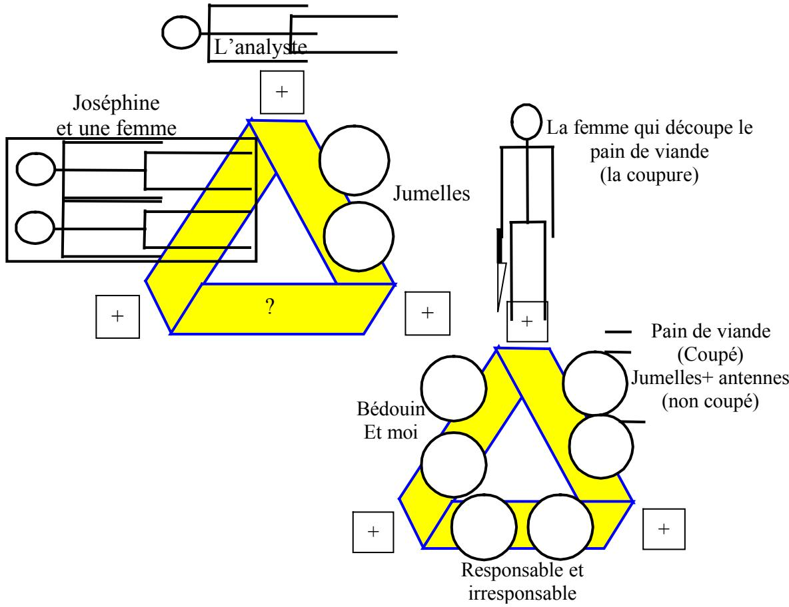

Sur chaque face de la bande de Mœbius homogàne, il est impossible de distinguer le dessus du dessous. Si on dit que c’est dessus parce que c’est sur la face qui suit, c’est dÇmenti par le fait que cette mÅme zone (qui ne possÜde pas de coupure interne) est sous la face qui prÇcàde. De mÑme, il n’est pas possible de distinguer une jumelle de l’autre, et si l’on peut faire une diffÇrence entre le bÇdouin et moi, il s’est avÇrÇ á l’analyse qu’il s’agissait de deux parties de moi-mÑme, ainsi que le dÇmontrent les deux qualitÇs, responsable et irresponsable, attribuÇes á une mÑme personne.

De mÑme encore, pouvons-nous comprendre que la signature du rapport sur le dÇsert a cette mÑme position fonctionnelle : elle est lá ou elle n’est pas lá, j’accepte ou je refuse de signer. C’est la question qui met en rapport le bÇdouin et moi. Il se trouve que je refuse pour finalement accepter.

Enfin, le coupure centrale effectuÇe par une femme dans mon rÑve, par l’analyste dans celui de JosÇphine, cette coupure s’avàre aussi dÇmentie dans les deux rÑves : l’excroissance de chair de mes jumelles vient contredire l’action de la coupeuse de viande – elles ne sont pas castrÇes - mon corps comme pÇnis vient boucher la Ä castration Å de JosÇphine. Disons que la bande de Mœbius homogàne reprÇsente cette derniàre contradiction dans sa globalitÇ : il n’est pas possible de trancher entre les deux sexes.

La coupure sÇpare deux faces. N’ayant globalement qu’une seule face, la bande de Mœbius homogàne ne devrait Ñtre que bord, seulement coupure. Or, cette coupure ne produit pas de diffÇrence, pas de deuxiàme face : elle est inefficiente, c’est l’acoupure. Ni la coupure, ni le bord ne peuvent se distinguer de la surface. Et donc la fonction (coupure) ne se distingue pas de l’objet (coupÇ). Dans la mis á plat, la torsion reprÇsente la fonction de coupure, c'est-á- dire le passage d’une face á l’autre. Sur la bande de Mœbius homogàne, ce passage semble s’accomplir mais il ne s’accomplit pas : nous somme toujours sur la mÑme face, aux caractÇristiques semblables á toutes les autres.

Le bÇdouin semble quelqu'un d’autre et pourtant c’est moi. Je voudrais ne pas signer et finalement je signe. La femme a l’air de couper et pourtant les jumelles ne sont pas sÇparÇes de leur excroissance de chair. Je suis responsable de l’ÇpidÇmie de Sida, et en fin de compte, je ne le suis pas. Je serais donc moi-mÑme (responsable) et en mÑme temps quelqu'un d’autre (irresponsable). Tout cela rend compte d’une tentative de coupure qui Çchoue. Tout cela renvoie á l’Çcriture d’un dÇsir qui ne trouve pas d’autre expression.

En consÇquence l’image, la lettre que j’ai placÇe plus haut en position fonctionnelle, sur une torsion, je peux tout aussi bien la mettre en place d’objet, sur l’une des faces.

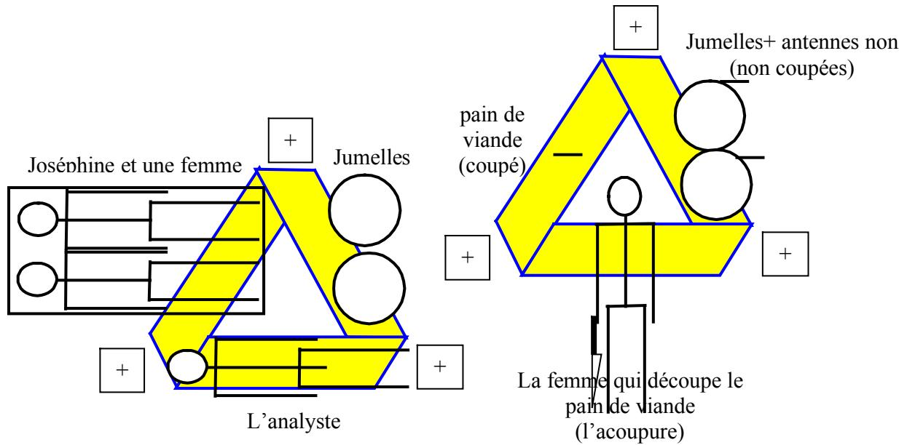

Puisque Üa se discute, ai-je dit, il est possible d’affiner encore le trait en remarquant que l’impossibilitÇ de faire diffÇrence entre deux scànes de rÑve est encore accrue par le redoublement á l’intÇrieur de chaque sÇquence. Ainsi pourrait-on Çcrire le rapport entre les jumelles, la femme inconnue comme premiàre tentative de dÇdoublement de JosÇphine, puis le couple de jumelles comme un dÇdoublement de cette premiàre unitÇ scÇnique :

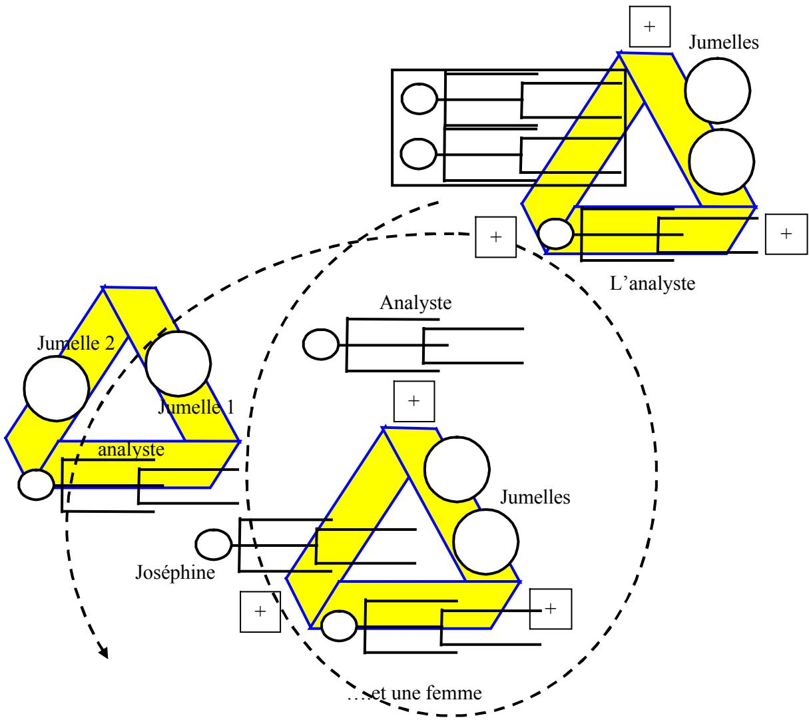

C’est un circuit qui pourrait se poursuivre sans fin, tant que le rÑve ne se termine pas.

Mais la torsion ne fait pas plus coupure entre les femmes qu’entre les unitÇs scÇniques, qui restent des divisions internes á l’unitÇ du rÑve et de la personne qui rÑve. Comme dirait Lacan, Ä Üa ne cesse pas de s’Çcrire Å, parce qu’en mÑme temps Ä Üa ne cesse pas de ne pas s’Çcrire Å, Üa ne trouve pas une Çcriture satisfaisante. Ecriture de quoi ? De soi-mÑme comme sujet dÇsirant un autre comme objet, et pris dans les rets du dÇsir de cet autre comme l’objet du dÇsir de cet autre que l’on souhaite Ñtre aussi.

C’est tout simplement aussi l’Çchec du travail de reprÇsentation comme tel. La reprÇsentation, telle qu’on se la reprÇsente idÇalement, ne devrait Ñtre que re-prÇsentation, c'est-á-dire nouvelle prÇsentation de la Chose, c'est-á-dire en fin de compte un dÇdoublement de cette derniàre. Or ce n’est pas le cas. Du dÇboublement il y a, mais la division laisse toujours en plan un reste qui rend insatisfaisant le rÇsultat. D’oä la rÇpÇtition, et dans le rÑve et dans le symptåme lorsqu’il y en a.

Le fait d’Çcrire ces portions de rÑve, ces reprÇsentations de choses, sur une bande de Mœbius homogàne plutåt qu’hÇtÇrogàne se discute. Comme on l’entend dans le rÇcit que j’en fais, la diffÇrence (hÇtÇro) est tout autant prÇsente que l’in-diffÇrence (homo). Si je choisis en dÇfinitive l’homo, c’est parce que la rÇpÇtition de la mÑme structure au sein mÑme du rÑve m’apparaçt comme un Çchec de la coupure. Chaque sÇquence serait une tentative pour faire la part entre le signÇ et le non signÇ, le responsable et l’irresponsable, le masculin et le fÇminin, mais la nÇcessitÇ mÑme de la rÇpÇtition indiquerait que la coupure Çchoue. Ainsi sur une face de la bande de Mœbius homo, on peut faire une distinction momentanÇe entre le dessus (en prenant comme repàre la face suivante) et le dessous (en se repÇrant á la face prÇcÇdente), mais c’est une coupure dont on voit á l’apprÇciation globale de la zone considÇrÇe, qu’elle ne tient pas : rien dans l’Çcriture ne la justifie.

Par contre le rÇcit, fait uniquement de signifiants, fait apparaçtre d’abord les diffÇrences. C’est toute la diffÇrence qu’on peut faire entre le rÇcit, qui, de son acte mÑme, analyse, c'est-á-dire distingue des ÇlÇments, et la reconstitution imaginable du rÑve. C’est que, tout simplement, le rÇcit s’adresse á un autre. Cette adresse constitue l’hÇtÇrogàne comme tel, tandis que le rÑve comme tel entÇrine l’absence de tout autre, soit l’homogÇnÇitÇ du narcissisme.

Attardons-nous á prÇsent sur ce qui fait diffÇrence entre la lettre de mon analysante (son rÑve) et la mienne (mon rÑve), pour autant que je puisse en juger grêce au signifiant. JosÇphine a dÇcrit ses jumelles comme ayant des cheveux gris. Je les vois africaines. Pas noires noires, relativement claires en fait, mais africaines. Comme la sauce dans laquelle baignent les pains de viande. Et puis cette curieuse excroissance de chair sur leur front me fait penser á l’antenne d’un tÇlÇphone portable. Le premier mot qui m’Çtait venu Çtait extraterrestre, mais je l’ai vite abandonnÇ, au profit du portable qui est quand mÑme chargÇ de transmettre la parole. C’est sãr, ces jumelles, á la lettre, transportaient la parole de JosÇphine dans mon rÑve. Les jumelles, parole portable, donc.

Le fait que l’antenne soit de chair contredit un peu le propos du tÇlÇphone. Par contre, il vient en rajouter un peu du cåtÇ de ce que j’ai entendu de nombreuses fois de la part des femmes en analyse, l’envie de pÇnis, qu’on a si souvent attribuÇe aux prÇjugÇs de Freud. Le fait que je l’ai entendu de nombreuses fois, et non par Freud, mais par des analysantes, finit par constituer pour moi un prÇjugÇ. Je me conforme donc á cet autre prÇjugÇ de Freud, qu’il faut laisser tomber tout prÇjugÇ, et recommencer chaque analyse comme si c’Çtait la premiàre, afin de ne pas induire l’analysant á se conformer á ce qu’il sait de la thÇorie, et de ne pas laisser aller l’analyste aux rails qu’il a pu prendre de son expÇrience.

Bref, si envie de pÇnis il y a, c’est dans la tÑte, comme l’antenne de ces jumelles, et c’est moi qui rÑve : donc, pour l’instant, c’est dans ma tÑte. JosÇphine ne m’a nullement parlÇ de Üa au moment oä je produis ce rÑve. Par contre elle affirmera son envie de pÇnis d’une maniàre toute diffÇrente puisque c’est mon corps, dans son rÑve, qu’elle charge de complÇter le sien, tandis que c’est une femme qui dans le mien, semble dÇcomplÇter (quoi ? sinon les jumelles ?) en taillant dans la viande. Ce qui Çtait dans ma tÑte lors de mon rÑve Çtait-il le condensÇ de mes prÇjugÇs, de mes lectures, de mon expÇrience, ou Çtait-il l’expression Çcrite de ce que je n’avais pas entendu, mais perÜu d’une maniàre ou d’une autre dans le discours de JosÇphine ? Je rÇpondrais comme Freud á la fin de sa quÑte de la scàne primitive chez l’homme aux loups : non licet. Quoiqu’il en soit, une chose est sãre : ma surprise d’entendre que mon corps pouvait avoir fait fonction de phallus d’une analysante ! Une surprise, c’est la garantie qu’au moins Üa ne vient pas confirmer quelque prÇjugÇ.

Voilá pour la diffÇrence. L’identitÇ reste dans ce signifiant Ä jumelles Å : il fait bord commun entre nous. Le bord est en effet ce qui, sur une feuille de papier, ou sur n’importe quelle surface, appartient á la fois aux deux faces, au recto et au verso. Mais sur une face, les jumelles ont des cheveux gris et sont moquÇes, sur l’autre face, elles sont africaines, plutåt claires pour des africaines, et munies d’une excroissance de chair sur le front.

Ceci peut nous donner une premiàre Çcriture du transfert sur une bande de Mœbius hÇtÇrogàne (dont toutes les torsions ne sont pas dans le mÑme sens), puisque ce qui apparaçt aussitåt au-delá de l’identitÇ Ä jumelles ä, c’est la diffÇrence :

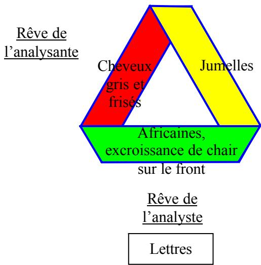

J’Çcris jumelles sur la zone jaune, qui est la zone proprement moebienne sur cette Çcriture de la bande de Mœbius, la zone qui est á la fois dessus (par rapport á la zone rouge) et dessous (par rapport á la zone verte). La zone rouge reprÇsente la face JosÇphine, la zone verte la face de votre serviteur. La zone jaune est une surface, et pourtant, Çtant á la fois dessus et dessous, elle reprÇsente le bord, ce qui est commun aux deux faces, l’identitÇ entre elle et moi. C’est la particularitÇ de la bande de Mœbius : globalement elle n’est qu’un bord puisqu’elle n’est qu’une face. Il y a une face dessus (l’analyste) et une face dessous (l’analysante), mais cette zone est á la fois dessus et dessous, comme le signifiant jumelles qui se trouve á la fois chez l’analyste et chez l’analysante.

Dans les rÑves respectifs de chacun, il se prÇsente sous la forme vue d’une reprÇsentation de chose, mais il passe de l’un á l’autre par ce bord d’une reprÇsentation de mot, le signifiant jumelles. Ce que j’ai inscrit dans les zones vertes et rouges sont des reprÇsentations de mots, qui, mÑme s’ils sont ici Çcrits sous formes de lettres, renvoient lorsqu’ils sont prononcÇs á des signifiants. Or, le signifiant, si l’on en croit la dÇfinition de Saussure est linÇaire : il n’a qu’une dimension. Si je voulais respecter cette forme, qui fait que rien de ce qui se communique entre les humains ne le peut sans le passage par les signifiants, je devrais rÇduire l’Çcriture de la bande de Mœbius á ses bords :

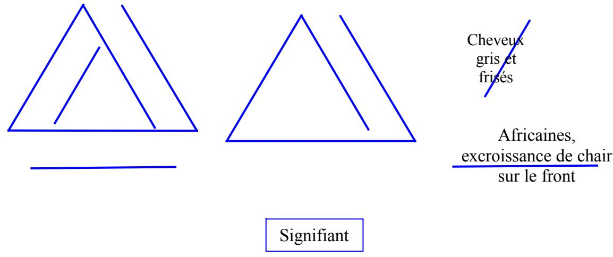  
A gauche, l’ensemble de l’Çcriture. Je vais donc me fier au rÇel de cette Çcriture, et non au rÇel de l’objet, qui, comme tout rÇel, est impossible. Paradoxalement, le rÇel de l’Çcriture

rend impossible le fait de l’Çcrire autrement5. Cette impossibilitÇ rend possible la seule lecture suivante : en allant vers la droite, sa dÇcomposition entre un bord continu et un bord discontinu. Jumelles est ce bord continu qui fait le tour de la structure, comme le bord entoure la totalitÇ de la feuille de papier. Il fait le tour des trois zones et revient sur celle dont il est parti, qu’il a donc parcourue deux fois, une fois sur chacun des bords de cette zone locale. Les habituÇs de la topologie lacanienne y reconnaçtront une Çcriture du huit intÇrieur. Cette zone doublement parcourue Çtait coloriÇe en jaune dans la prÇcÇdente Çcriture et j’avais dit qu’elle Çtait á la fois dessus et dessous. De mÑme, le bord qui la limite est á la fois d’un cåtÇ et de l’autre. Il y a en a deux (dans cette localitÇ) mais c’est le mÑme (ce qu’on dÇcouvre dans la globalitÇ en le suivant dans son parcours). Cette limite se divise donc localement en deux limites jumelles, dont on peut dire á la limite (c'est-á-dire en les suivant d’un bout á l’autre) que c’est la mÑme.

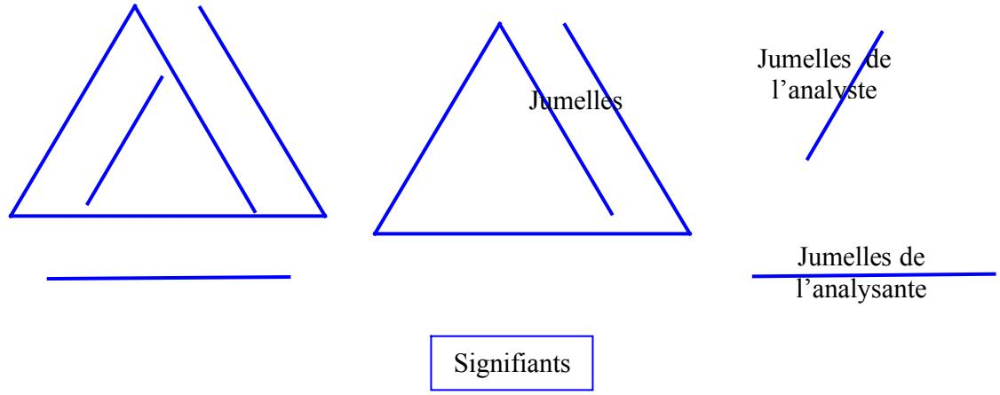

Ce qu’on entend est la seule chose qui peut circuler d’un sujet á un autre, faisant á la fois la limite entre eux et le bord commun, en faisant cette hypothàse : ce que j’ai entendu est la mÑme chose (c'est-á-dire le mÑme signifiant ) que ce qui a ÇtÇ dit. Mais ce que j’ai entendu de ce qu’elle a dit, voilá que je le transforme dans ce transfert, lui confÇrant des attributs (africaines, claires, avec une excroissance de chair sur le front) qui ne sont pas du tout dans ce qu’elle m’avait dit (cheveux gris, et si on veut, moquÇes). Ces attributs sont apparus dans mon rÑve comme reprÇsentations de choses (lettres), c'est-á-dire des surfaces accrochant le regard, mais je ne peux vous en faire part qu’en passant par des reprÇsentations de mots (signifiants). C’est pourquoi les couleurs vertes et rouges de la premiàre Çcriture tÇmoignaient de ces reprÇsentations de choses (lettres) reconstruites apràs-coup, tandis que les traits bleus discrets de la deuxiàme Çcrivent ce qu’elles sont devenues en reprÇsentations de mots (signifiants) dans le rÇcit.

Il s’en impose ceci, que les reprÇsentations de choses (les lettres) s’Çcrivent á deux dimensions tandis que les reprÇsentations de mots (les signifiants) s’Çcrivent á une seule dimension. Je peux á prÇsent faire l’hypothàse suivante : ce que j’ai entendu dans Ä jumelles Å c’est justement la coupure en ce qu’elle Çchoue dans sa fonction de produire du deux distincts á partir du un. Autrement dit dans l’hÇtÇrogÇnÇitÇ de l’Çchange, au moment de la sÇance, j’ai entendu ce Ä jumelles Å comme un Ä un Å, c'est-á-dire comme le segment á trois coudes du graphe des bords de la bande de Mœbius hÇtÇrogàne, c'est-á-dire encore comme les trois segments á un coude du graphe des bords de la bande de Mœbius homogàne :

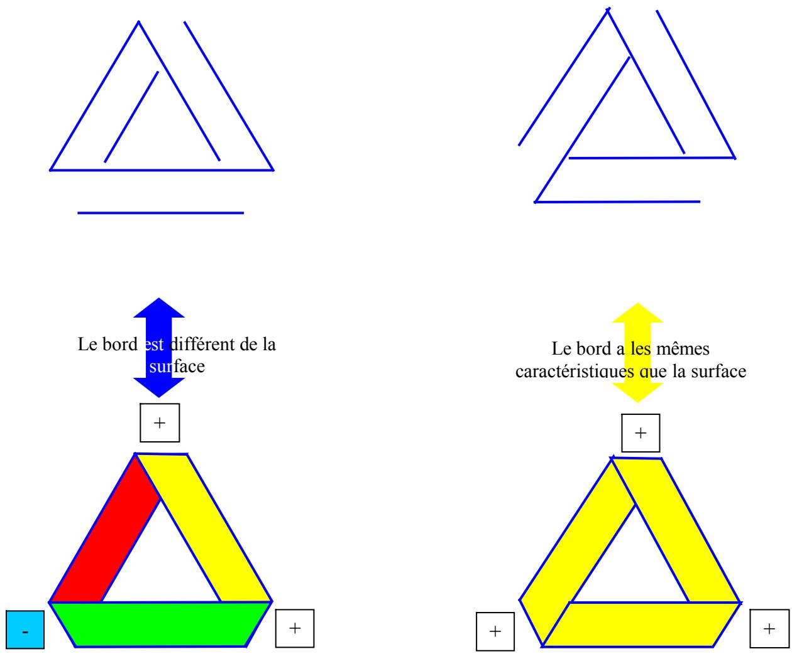

C’est ainsi qu’il apparaçt sous forme de reprÇsentation de chose dans mon rÑve : une tentative de coupure trois fois rÇpÇtÇe. Et c’est logique : dans un rÑve personne ne parle vraiment. Il n’y a pas d’interlocuteur, si ce n’est l’Autre de Lacan du point de vue de sa dÇfinition : Ä l’inconscient c’est le discours de l’Autre Å. Mais tout ceci ne se passe que parce qu’il y a interlocution dans l’analyse, rÇpondant cette fois á la dÇfinition de Lacan : l’Autre, c’est Ä le trÇsor des signifiants Å. Dans le rÑve il n’y a de signifiant que ceux qui ont ÇtÇ entendus un jour et qui ont laissÇs des traces sous forme de lettre, et pas forcÇment de lettre alphabÇtique. Il s’agit plutåt de ces lettres imagÇes que l’on peut comparer, comme l’avait fait Freud, aux hiÇroglyphes et aux caractàres chinois.

Dans le rÑve, parce que personne ne parle, il n’y a que des lettres et pas de signifiants, c'est-á-dire pas de coupure efficiente. Dans la bande de Mœbius homo, toutes les faces sont á la fois dessus et dessous. Or qu'est-ce qui est á la fois dessus et dessous, par exemple sur une simple feuille de papier, ou encore sur une rondelle dÇcoupÇe dans cette feuille ? Ce qui est á la fois dessus et dessous, c’est le bord. La bande de Mœbius homogàne prÇsente donc le paradoxe d’Ñtre une surface dont les trois zones identiques prÇsentent une structure de bord, ou inversement que les bords n’y sont pas distincts de la surface. Autrement dit encore, les reprÇsentations de mots n’y sont pas distinctes des reprÇsentations de choses : nous avons donc lá une Çcriture qui prÇsente la mÑme structure que la dÇfinition donnÇe par Freud des formations de l’inconscient : c’est le lieu des reprÇsentations de choses seules. La bande de Mœbius homo n’est pas une coupure efficiente. Les reprÇsentations de mots entendues dans les restes diurnes y sont transformÇes en reprÇsentations de choses. Ou, en vocabulaire lacanien : les signifiants sont transformÇes en lettres.

J’aurais aussi bien pu Çcrire tout cela comme les deux faces d’une rondelle, une rouge (l’analysante) une verte (l’analyste), avec un bord Çvidemment commun qu’on aurait pu Çcrire deux fois, une fois du point de vue de l’analyste, en considÇrant le bord comme appartenant á la face verte, une fois du point de vue de l’analysante, en le considÇrant comme appartenant á la face rouge.

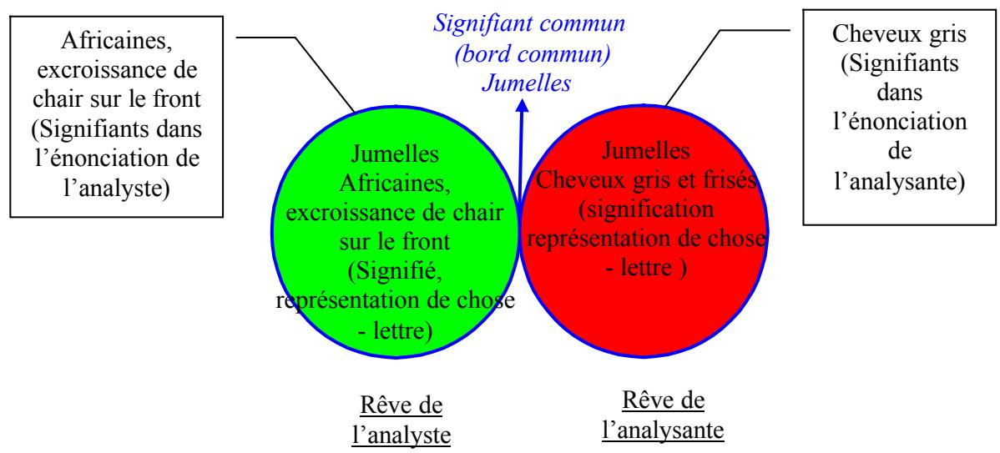

Cette Çcriture se laisserait volontiers lire comme le phallus de JosÇphine.

Mais elle prÇsente une difficultÇ : elle ne permet pas d’Çcrire la reprÇsentation de chose commune aux deux faces. Une face n’est pas l’autre, tandis que sur la bande de Mœbius, une face, c’est l’autre face (dans l’Çcriture de la zone jaune), mais leur articulation permet d’isoler localement deux faces distinctes (une verte et une rouge). En termes grammaticaux, la rondelle est forclusive, le discordantiel s’y exprimant seulement par le bord á une seule dimension, tandis que le discordantiel global de la bande de Mœbius, tout en Çtant reprÇsentÇ par la zone jaune d’une part, et le bord bleu d’autre part, est dialectisÇ par le forclusif qui sÇpare les zones rouge et verte6.

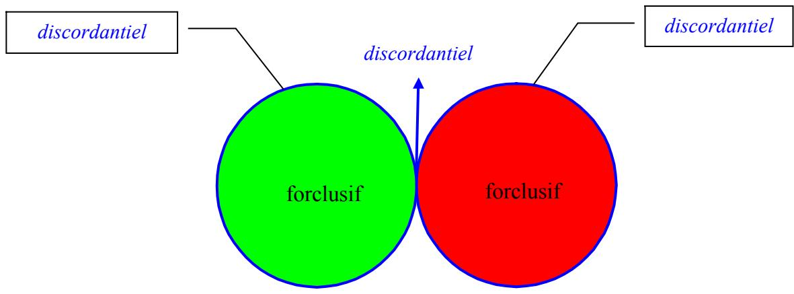

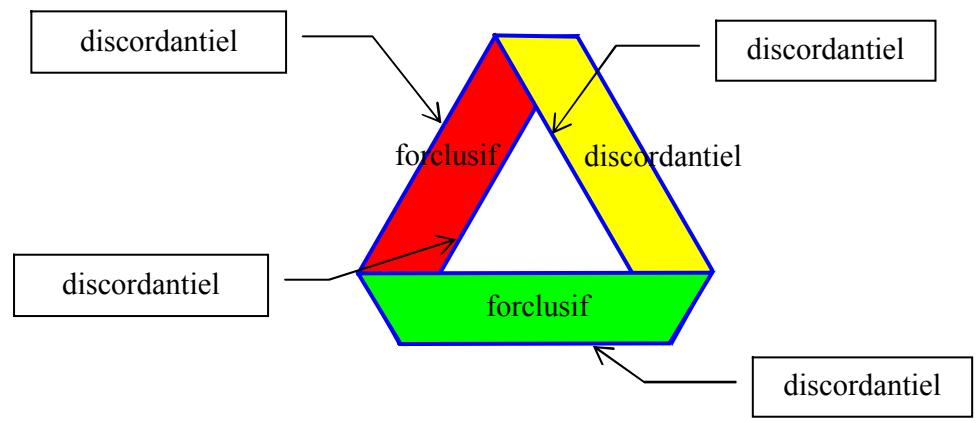

S’il est de la nature du signifiant d’Ñtre discordantiel, puisqu’il n’est que bord, il est par contre moins Çvident de lire la lettre comme telle : et pourtant c’est ainsi dans la zone jaune.

Bref, si la rondelle permet d’Çcrire le passage du signifiant Ä jumelles Å d’une face á l’autre, de l’analysante á l’analyste, elle ne permet pas d’Çcrire la reprÇsentation de chose Ä jumelles Ñ avec sa caractÇristique de bord devenu surface, de reprÇsentation de mot transformÇe en reprÇsentation de chose prÇsentant les mÑme particularitÇs qu’une reprÇsentation de mot. D’oä la nÇcessitÇ d’en passer par l’Çcriture de la bande de Mœbius, qui, par sa zone jaune, le peut. Prendre les mots pour des choses, c’est la caractÇristique que Freud avait repÇrÇe dans la psychose et qu’il retrouvait dans le rÑve. Ce qu’Çcrit la bande de Mœbius, c’est le passage de la Une dimension du signifiant aux deux dimensions de la lettre (transformation du signifiant que j’ai entendu en image dans le rÑve, par rÇgression dirait Freud : rÇgression de l’entendu au vu) et des deux dimensions de la lettre, á la Une dimension du signifiant (transformation de la lettre en parole, par lecture á haute voix du rÑve á quelqu'un qui entend, par progression, aurait dit Freud).

Si j’avais voulu reprÇsenter le rÑve comme tel, j’aurais dã en passer par l’Çcriture d’une autre forme de bande de Mœbius, l’homogàne. Comme le rÑve est un message que le rÑveur s’adresse á lui-mÑme, il ne devrait pas y avoir d’hÇtÇrogàne dans son Çcriture : il n’y a pas d’autre comme interlocuteur, ni d’Autre comme signifiant prononcÇ effectivement. Au fond c’est ce que dit Freud lorsqu’il nous affirme que l’inconscient ne connaçt pas la contradiction. Ne serait-ce qu’en ceci : dans un rÑve, on voit plusieurs personnages qui interagissent les uns avec les autres ; mais tous sont des crÇations d’un seul, le rÑveur. La bande de Mœbius homogàne, avec ses trois torsions de mÑme sens, ne permet pas de crÇer du forclusif : toutes les zones sont á la fois dessus et dessous, elles sont donc toutes discordantielles. La bande de Mœbius homogàne est forclusivement (c'est-á-dire exclusivement) discordantielle. Elle n’est pas dialectisÇe par un forclusif qui permettrait de distinguer deux zones diffÇrentes, ce que fait par contre la bande de Mœbius hÇtÇrogàne.

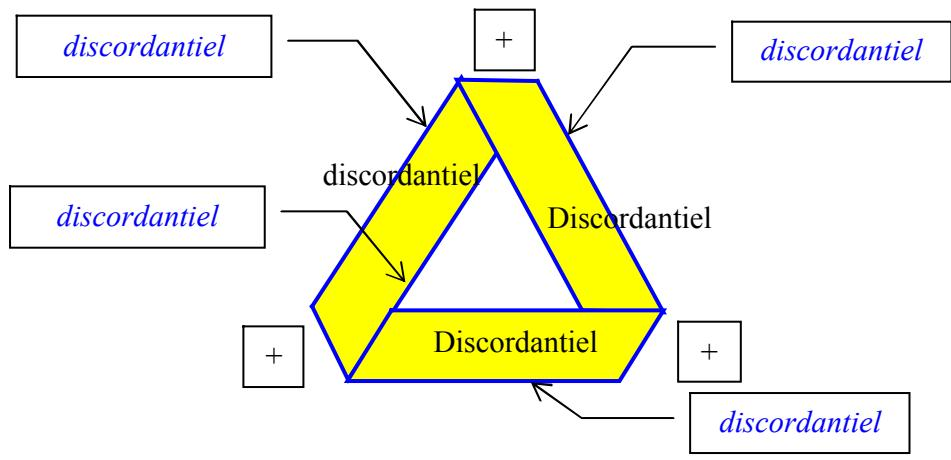

Chaque rÑve est intrinsàquement homogàne, mais il y a deux rÑveurs. L’hÇtÇrogÇnÇitÇ des deux rÑves, celui de l’analysante et celui de l’analyste, doit donc s’Çcrire sur deux Çcritures diffÇrentes. Je choisis pour cela de les Çcrire l’un et l’autre sur des bandes de Mœbius homogànes, mais tournant en sens inverse. Evidemment il s’agit d’une reconstitution apràs-coup, basÇe nÇanmoins sur l’entendu.

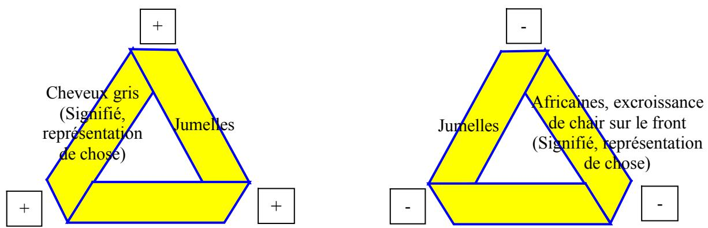

Ces deux bandes sont l’une l’image en miroir de l’autre. Il s’agit d’une position au miroir que j’ai nommÇ dans mes Çtudes prÇcÇdentes le miroir objectif postÇrieur (Mop). PlacÇ derriàre l’objet, cet objet qui est, par exemple la bande ci-dessus á gauche, la bande de droite en est l’image que l’on verrait dans un miroir placÇ au-delá.

Mais il suffirait d’Çcrire les bandes ainsi :

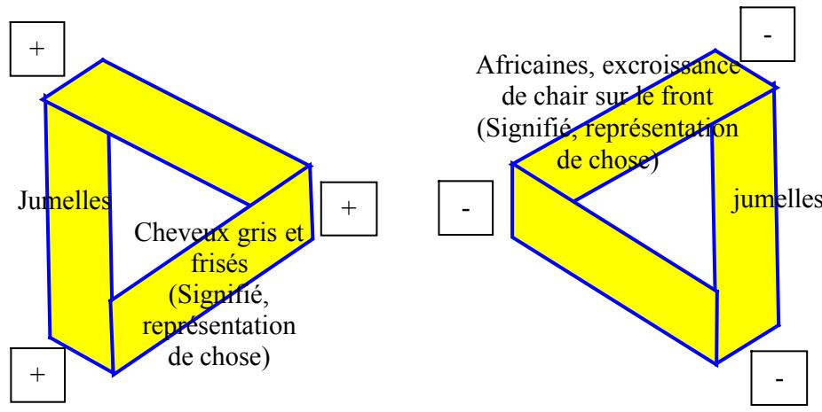

… ce qui leur confàre une asymÇtrie droite-gauche7, pour que le rapport d’image soit celui du miroir objectif antÇrieur (Moa), c'est-á-dire celui oä l’observateur est placÇ entre le miroir et l’objet. Il doit se retourner s’il veut voir en deux temps forcÇment sÇparÇs, l’objet et son image. Dans le premier cas (Mop) le sujet Çtait passif : le miroir faisait l’action pour lui. Dans le second (Moa) le sujet est actif, il doit se retourner pour voir apparaçtre l’image. Correspondant aux trois temps de la pulsion (passif, actif, rÇflexif), il y a trois possibilitÇs (+ une, que nous verrons plus tard) de combiner les positions d’un sujet et d’un objet au miroir :

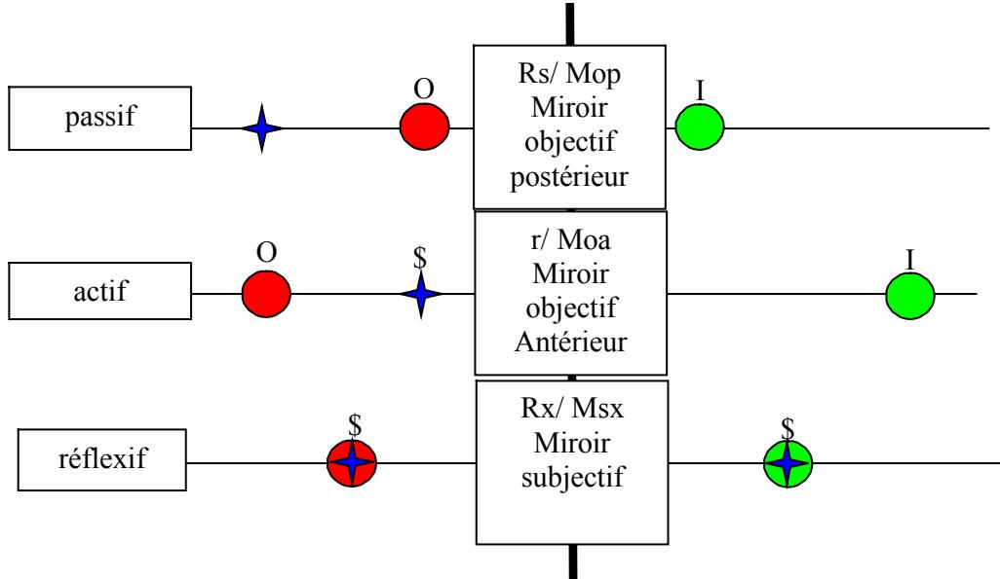

Il n’est donc pas encore question de miroir subjectif, c'est-á-dire le miroir correspondant au mode rÇflexif du verbe, dans lequel le sujet s’identifie á l’objet dont il voit l’image (en terme pulsionnels, il se fait faire, $3 ^ { \mathrm { ^ { \mathrm { { t } } m e } } }$ temps de la pulsion selon Freud – les pulsions et leurs destins8, 1915. Ici : il se fait voir par lui-mÄme). Sujet et objet sont encore dissociÇs.

Mais pourquoi en passer par une bande de Mœbius, fãt-elle homogàne ? Pourquoi ne pas Çcrire le rÑve sur une seule face qui ne supposerait pas une autre face, puisque c’est une lettre dans laquelle l’Çcrivain est aussi le lecteur ? Nous avons ici trois zones identiques, mais alors pourquoi ce trois ? Pourquoi poser dans une zone un objet du rÑve, et dans les deux autres ses attributs ? Ne faudrait-il pas Çcrire un objet dans chaque zone ? Mais que faire alors des attributs de chaque objet ?

Vous voyez, la topologie que je suis en train d’essayer de construire m’amàne á analyser finement tous les ÇlÇments des rÑves ; qu’on aboutisse á la bonne Çcriture n’est pas le plus important. Mais que Üa m’ait contraint á pousser plus loin l’analyse, voilá son apport le plus fÇcond.

Que faire de la troisiàme zone dans les Çcritures pour lesquelles je n’ai rien trouvÇ á y mettre ? Tout ce que je peux dire, c’est que je n’ai pas forcÇ : ce n’est pas parce qu’il y a trois zones que je me sens obligÇ de trouver une nomination pour les trois. Et j’y ai finalement mis l’imagerie de la fonction, puisque de toutes faÜons, elle est, dans cette configuration homogàne, identique á ‘objet. Il se trouve que dans les rÑves que j’analyse ici, le trois s’offre á la perception de maniàre Çvidente. Il n’est pas certain que dans tout rÑve, Üa se passe de cette faÜon. La bande hÇtÇrogàne prÇsente une autre logique, celle de l’analyse, qui á partir d’un ÇlÇment homogàne, en passe par l’hÇtÇrogÇnÇitÇ du signifiant qui distingue un signifiÇ (dessus), une signification (dessous), et un reste dÇsorientÇ (dessus-dessous). Mais dans l’Çcriture homogàne, si le trois semble un nombre de base, l’essentiel est que l’homogàne ne se soucie guàre de quantitÇ, puisque c’est homogàne. Et comme la logique de la thÇorisation est rÇgrÇdiente, je n’ai fait que transposer sur l’Çcriture homogàne ce que j’avais Çcrit sur l’Çcriture hÇtÇrogàne, en suivant en quelque sorte de maniàre progrÇdiente le mouvement rÇgrÇdient qui avait ramenÇ les reprÇsentations de mots aux reprÇsentations de choses.

ReprÇsentations de mots, reprÇsentations de choses, c’est hÇtÇrogàne, et Freud nous dit que le domaine de l’inconscient est celui des reprÇsentations de choses seules (Ä L’inconscientÅ 19159), donc homogàne.

Les reprÇsentations de mots, je considàre qu’il est logique de les reprÇsenter par les bords. Comme l’avait remarquÇ Saussure10, le signifiant suppose un dÇveloppement linÇaire : les mots sont dits forcÇment les uns apràs les autres et non les uns á cåtÇ des autres. Dans cette mÑme veine, il est aussi logique de considÇrer les reprÇsentations de choses comme des surfaces. Celles-ci ne tombent pas du ciel, mais de la combinatoire d’au moins trois signifiants, en fonction de la fameuse dÇfinition de Lacan : un signifiant reprÇsente un sujet pour une autre signifiant. J’ai dit que les signifiants ne pouvaient que s’Çnoncer cåtÇ á cåte, dans le fil de l’Çnonciation. Cependant ce fil suppose le refoulement : dire quelque chose c’est toujours refouler autre chose, et le signifiant non dit s’avàre d’un autre sens (au sens du sens de l’orientation) que la linÇaritÇ qui se dÇroule dans l’Çnonciation.

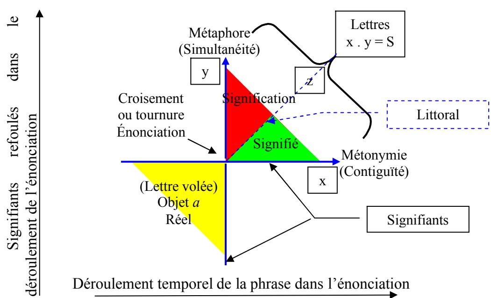

Ce qui n’est pas dit de faÖon explicite peut cependant avoir ÇtÇ parfaitement entendu par l’attention flottante de l’analyste, au point de lui faire Çlaborer les lettres qui rendent compte de cette Çcoute. En effet, si l’attention flottante a permis d’entendre non seulement le signifiant produisant le signifiÇ le long de l’axe des x, elle a permis aussi l’Çcoute des signifiants de l’axe y. Le produit des deux, au sens gÇomÇtrique du terme, c’est la surface qu’ils dÇlimitent : x.y = S, autrement dit : une reprÇsentation de chose.

Cependant ce n’est qu’Ñ l’analyse qu’il sera possible de s’en rendre compte, en produisant dans une nouvelle Çnonciation le signifiant (triple) permettant le retour sur le signifiant non-dit. La signification latente de la premiÜre Çnonciation devient ainsi manifeste. La parole analytique inaugure ainsi un troisiÜme axe, celui de la troisiÜme dimension telle qu’on peut la reprÇsenter dans un plan, ci-dessus par une diagonale, z. La troisiÜme dimension serait ce qui n’est justement pas dans le plan : elle le troue, elle le divise en deux faces, une rouge et une verte.

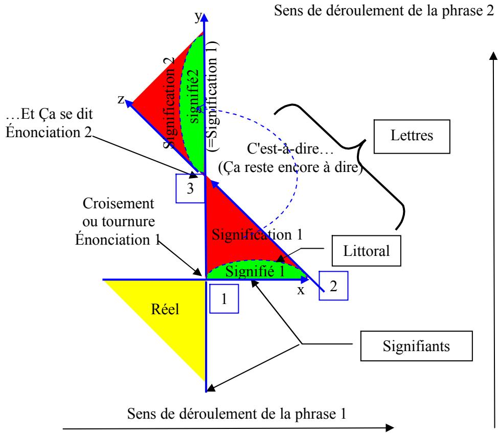

Ce diagramme est une reprÇsentation bidimensionnelle de la bande de Mœbius. J’entends bien la bande de Mœbius comme concept, comme fonction, et non comme objet.

La contrainte des trois zones de la bande de Mœbius homogàne m’oblige á formuler ceci, qui ne m’Çtait pas apparu de prime abord : au fond, ce que j’ai formulÇ en termes d’appartenance continentale, Ä africaines Å, c’Çtait aussi une maniàre de parler de la couleur de ces femmes. Il se trouve qu’en face, dans le rÑve de mon analysante, j’ai entendu aussi une notation de couleur, concernant cette fois les cheveux. Et tout d’un coup, le parallàle se poursuit malgrÇ moi dans mes associations : le cafÇ au lait de mes africaines pourrait Ñtre l’autre faÜon de parler du gris des jumelles de JosÇphine. Au fond, ce sont deux faÜons de mÑler le noir et le blanc, d’autant qu’il insiste au niveau de la sauce. Ce qui est identique dans les deux rÑves, ce serait donc la matiàre premiàre : noir et blanc, dont l’opposition est forclusive. Gris et cafÇ au lait ne seraient que deux modalitÇs moebiennes, c'est-á-dire discordantielles, de prÇsenter ce mÑme mÇlange. Deux modalitÇs de l’impossibilitÇ de trancher entre le noir et le blanc. Ainsi la sauce brune qui est, en cuisine, une liaison, est une autre faÜon de dÇnier la castration : Üa coupe, Üa tranche dans la viande, mais fort heureusement, Üa baigne dans une liaison qui rÇunit le noir et le blanc, le corps et le phallus. Ceci d’autant plus que l’agent de la castration, une femme, est Çgalement de cette couleur.

Ainsi serait expliquÇ la prÇsence de la lettre africaine qui fait le support des autres lettres de mon rÑve. Je n’ai pas entendu Ä Afrique Å, mais l’insistance sur le gris des cheveux. Je la pensais adressÇe á mes cheveux gris. AdressÇe á moi, elle l’Çtait, cette insistance, mais d’une maniàre toute autre que celle que je prÇvoyais. Mon cafÇ au lait en a sans doute ÇtÇ la transformation par l’inconscient.

Voilá un exemple frappant de transformation du signifiant, reprÇsentation de mot, en reprÇsentation de chose. C’est la combinatoire des deux mÑmes mots qui ne produisent pas la mÑme chose :

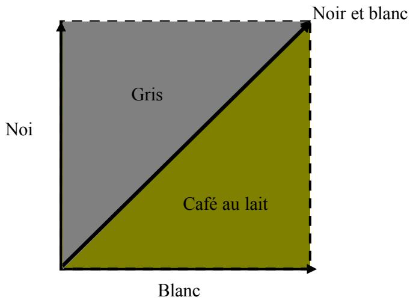

Et, en osant avancer un peu plus loin, s’il y a identitÇ dans l’attribut, il y a peut-Ñtre aussi identitÇ au niveau de l’excroissance. Dans mon rÑve, je n’ai aucun souvenir des cheveux de mes jumelles. C’est peut-Ñtre bien qu’elles n’en avaient pas. Et si ces excroissances reprÇsentaient dans leur unicitÇ bizarre, la multiplicitÇ innombrable des cheveux ? Au fond, les cheveux sont aussi des excroissances qui partent du front ! Ce qui m’amànerait alors á l’Çcriture suivante :

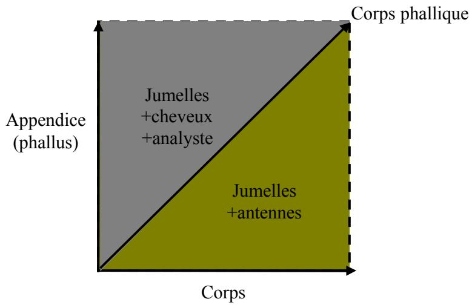  
Voilá donc deux exemples de la faÜon dont la linÇaritÇ signifiant de deux attributs produisent de la surface dans une formation de l’inconscient.  
En revenant á l’Çcriture plus finement thÇorisÇe de la bande de Mœbius :

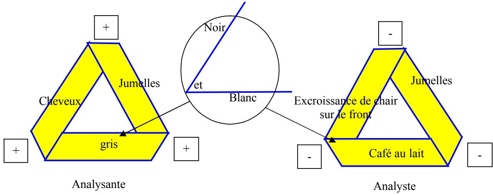

Mon dÇsir a poussÇ á cette reconstruction. Sa reprÇsentation-but a ÇtÇ l’identification. Il n’y a toujours aucun souci de reprÇsentation objective de quoi que ce soit. Il y a une Çcriture qui s’est prÇsentÇe, avec sa logique, issue de la rencontre entre la logique de mes associations et la logique de la topologie. Ce n’est pas la seule logique possible.

En voici une autre, qui semble couler de la source qui vient d’Ñtre mise en perce.

En effet, ces trois torsions... au fond, pourquoi trois ? Parce qu’il n’y a pas de bande de Mœbius prÇsentant moins de trois torsions, ainsi que je l’ai dÇmontrÇ dans mon article Ä les trois torsions de la bande de Mœbius11 Å. Il pourrait y en avoir plus, il suffirait qu’elles soient en nombre impair. Mais á ce moment lá, il n’y pas de limite. Pourquoi pas 5, 7, 13, 27 torsions entre lesquelles je pourrais marquer tout ce que je veux ? C’est sans doute ainsi que procàde le rÑve. Alors quel besoin le rÑve aurait-il d’Ñtre Çcrit ainsi sur une bande moebienne ? Ce que je ne peux pas dire, je l’Çcris : telle est la formule que j’ai proposÇe pour rendre compte des formations de l’inconscient. Il faut la confronter ici aux dÇfinitions de Lacan relative á l’imaginaire, qui con-siste (et donc c’est une surface orientÇe), au symbolique qui in-siste (et donc c’est la trouure), et au rÇel qui ex-siste (et donc c’est une surface dÇsorientÇe : si c’est dÇsorientÇ, c’est impossible á saisir, Üa se tient hors de (ex) toute saisie)12.

Si j’ai rencontrÇ dans la journÇe un rÇel, un ÇvÇnement, un objet, sur lequel je n’ai rien pu dire ni Çcrire, le rÑve, c'est-á-dire le symbolique, se charge de le faire dans la nuit. Il tente de trouer cette surface dÇsorientÇe du rÇel, á la fois dessus et dessous pour lui donner une orientation : une face dessus et une face dessous, bien sÇparÇe par un bord et communiquant l’une vers l’autre par le trou qui est autour (la troisiàme dimension). Soit : quelque chose d’imaginable. Et tant qu’il n’y parvient pas, le symbolique, á trouer le rÇel pour faire de l’imaginaire, eh bien, il insiste.

Voyons cela dans mon rÑve.

Des jumelles : en considÇrant cet objet au-delá du signifiant qui a fait pont entre JosÇphine et moi, en considÇrant la lettre telle qu’elle s’est Çcrite dans nos rÑve respectifs, c’est une division pouvant s’Çcrire dans les termes mÑmes de la bande de Mœbius. Il y en a deux, mais c’est les mÑmes. Mais, si le signifiant jumelles qui a voyagÇ d’un sujet á l’autre est, comme sonoritÇ, exactement identique, ce pourquoi il fait le bord des deux faces, la lettre qui l’Çcrit sur chacune des faces prÇsente un reste qui fait de la division un impossible.

Ainsi, cet impossible rÇpàte le rÇel qui ne cesse pas de ne pas s’Çcrire, insistant á provoquer de nouvelles divisions. Dans mon rÑve, mon chef le bÇdouin est un avatar surmoëque de moi-mÑme, puisque j’ai dans mon stock mnÇsique cette photo de moi en Ä bÇdouin Å.

L’un veut me faire signer, l’autre ne le veut pas, puis finit par bien vouloir. Il y en a deux, mais c’est le mÑme. A la fin de mon rÑve, la mÑme division se reproduit : on me dÇclare responsable de l’ÇpidÇmie de Sida, puis finalement pas responsable : il y a deux attributs contradictoires, mais c’est pour le mÑme personnage, á propos de la mÑme chose. Celui qui signe endosse la responsabilitÇ du rapport : la sÇquence finale semble bien une duplication de la sÇquence initiale. La sÇquence centrale elle, reprÇsente la coupure comme telle : l’action d’un couteau, et des jumelles, les deux bords sÇparÇs par l’effet de la coupure.

Le surmoi est á la source de cette division du sujet. Freud nous dit qu’il s’agit de la conscience morale, qui surveille le sujet comme Jimmy le criquet surveillait Pinocchio. Elle s’autonomise parfois, prÇcisait-il dans les cas de psychose. Alors le sujet entend des voix lui recommandant de faire tout ce qui est interdit : le message a subit une double inversion : il ne vient pas du sujet, mais de l’extÇrieur, et il ne rÇfràne pas la pulsion, mais la promeut. Parfois les voix, comme dans le rÑve de JosÇphine, ne font que se moquer du sujet, lui rappelant á quel point il est indigne de vivre. Bien d’autres possibilitÇs d’inversions dÇclinent les diverses apparences de la psychose, mais ce n’est pas le lieu de les dÇvelopper ici. Le rÑve est une psychose locale : en effet dans mon rÑve, ma conscience morale est devenue un autre personnage (á comparer avec les jumelles qui apparemment subissent les moqueries, dans le rÑve de JosÇphine), et dans la derniàre partie, elle est devenue un tiers qui dÇcide de l’extÇrieur si je suis responsable ou non. Responsable d’un rapport dit la premiàre partie, un rapport sur le dÇsert. Responsable du Sida, dit la troisiàme partie, dont chacun sait que c’est une maladie sexuellement transmissible. Ce qui amàne á repenser le rapport initial en rapport sexuel. Il n’y a d’ailleurs pas loin du dÇsert au dÇsir, d’autant que JosÇphine m’avait habituÇ depuis 4 ans qu’elle vient, au relatif dÇsert de sa parole, et, quand elle arrivait á parler, au relatif dÇsert de sa vie. Je rappelle au passage – je me le rappelle á moi-mÑme, c’est toujours nÇcessaire – qu’il ne s’agit pas de sa vie comme telle, objectivement observÇe – cette formule n’aurait aucun sens – mais de ce que ses rÇcits ont provoquÇs sur moi comme mise en image au niveau de ce rÑve.

Entre autres, j’y lis á prÇsent que, face á l’Çnonciation du dÇsir de JosÇphine á mon Çgard, je souhaite que tout cela ne soit que dÇsert, qu’il n’y ait rien…rien á signer, rien á cirer, rien á assumer de cette trop lourde charge d’Ñtre l’objet du dÇsir de l’autre, d’Ñtre en place d’objet a.

Ce continuel dÇrapage du symbolique montre qu’á chaque fois qu’il essaie de proposer une Çcriture, celle-ci Çchoue, entraçnant la suite du rÑve. DÇsir et censure ne cessent d’essayer d’occuper le devant de la scàne, sans que l’un prenne le pas sur l’autre.

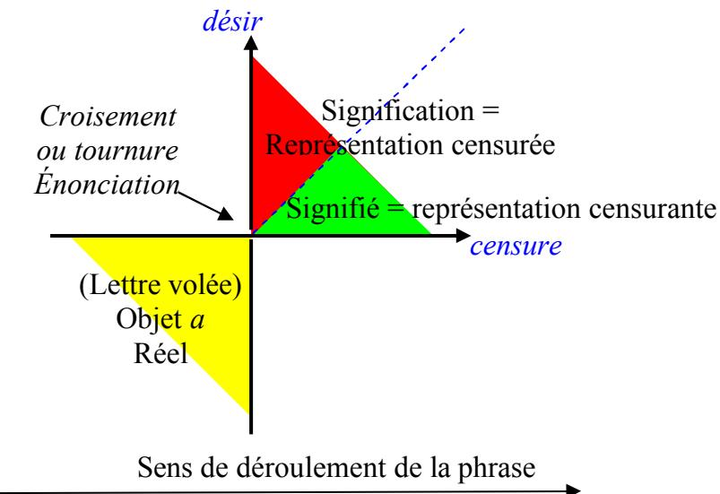

Il faudra attendre la parole pour que cesse cette poursuite sans fin. Et quand je dis parole, je ne veux pas dire une seule parole donnant le fin du fin de la signification du rÑve, mais tout un Çchange entre JosÇphine et moi, se prolongeant sur plusieurs sÇances et entraçnant encore deux rÑves supplÇmentaires de ma part, et deux de la sienne…et se poursuivant encore.

Revenons á l’analogie du fonctionnement de l’appareil psychique comme miroir. Nous ne disposons que d’une face : la face consciente. Tout ce qui est de l’ordre de l’inconscient, eh bien… c’est inconscient ! Pour indiquer le rapport que nous entretenons avec le miroir, je me sers donc de cette mise á plat de la bande de Mœbius qui fonctionne comme Çcriture :

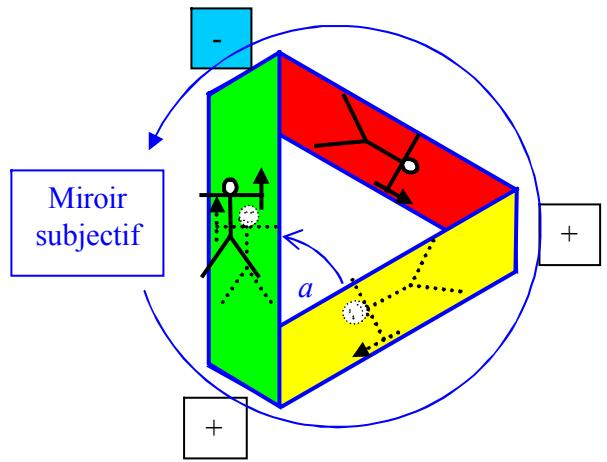

J’Çcris un bonhomme dans la zone verte, celle de la conscience : ${ \mathrm { { c } } } ^ { \prime } { \mathrm { { e s t } } } ,$ grosso modo l’image que nous avons de nous-mÑme, notre moi, quoi. Je m’identifie á ce bonhomme, de dos, comme si j’Çtais devant un miroir. Je tiens une flàche dans la main droite comme point de repàre de la droite et de la gauche. Je glisse le long de la surface dans le sens anti-horaire, en prenant soin de me tenir aux bords comme des deux mains á une double rampe d’escalier, toujours par souci de repÇrage. Je franchis une torsion : je me retrouve donc sur l’autre face, invisible au lecteur que je suis pourtant : Üa c’est l’inconscient ! Poursuivant le glissement, je franchis une nouvelle torsion, et je me retrouve donc á nouveau lisible, mais de dos. Voilá une mÇtaphore de ce qui pourrait apparaçtre dans le conscience, mais auquel je persiste á tourner le dos : un symptåme, un rÑve, un lapsus, un acte manquÇ. C’est lisible, mais je ne veux pas lire.

Enfin je franchis la troisiàme torsion, je me retrouve á…á mon point de dÇpart ? Pas du tout : je suis sur l’autre face. Je me retrouve face á mon image. Le miroir, comme la bande de Mœbius a inversÇ devant et derriàre (je suis sur les deux faces á la fois) et la gauche et la droite (voyez le repàre de la flàche).

Les deux images intermÇdiaires, l’illisible, et la lisible que je ne veux pas lire, ce sont elles qui maintiennent l’Çcart entre les deux faces de l’image dÇfinitive. Cet Çcart est mesurÇ par l’angle a trois fois rÇpÇtÇ qui reprÇsente l’objet du mÅme nom, l’objet a, toujours dÇjá absent (c’est le trou central qui est aussi le trou entre les deux faces) qui maintient l’insatisfaction jusque dans le narcissisme : mon image ne me satisfera jamais. Il y aura toujours un Çcart entre ce que je crois Ñtre et ce que je veux Ñtre, l’idÇal.

Ceci est, bien entendu, un certain point de vue sur le miroir, le point de vue subjectif : je m’identifie á cette image, puisque j’ai fait le parcours, mÑme si une partie ce parcours est inconsciente et l’autre composÇe de manifestations de l’inconscient, que je ne veux pas lire.

Du point de vue objectif je pourrais dire : le miroir inverse bien le devant et le derriàre mais pas la gauche et la droite. Il y a mÑme un autre point de vue objectif sur moi-mÑme : je peux me retourner sans l’aide d’un miroir. C’est le mÑme type de torsion qui va apparaçtre : du point de vue du mouvement achevÇ, ma droite est restÇe á ma droite, mais du point de vue du dÇpart du mouvement, je viens d’inverser ma droite et ma gauche, le devant et le derriàre, comme le ferait le miroir subjectif. Mais c’est une autre histoire.

Revenons á notre parcours sur la bande de Mœbius. Et si j’Çtais parti dans l’autre sens, le sens horaire ? ïa donnerait Üa :

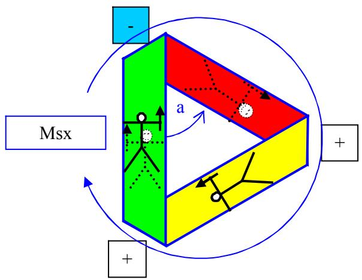

Le rÇsultat est le mÑme mais les inscriptions intermÇdiaires diffÇrent. C’est ce qui donne raison á Freud sur les deux types de refoulement. Il y en a un, le refoulement proprement dit, qui dispose de reprÇsentations de choses qui ont un jour ÇtÇ conscientes, et qui peuvent le redevenir, il n’y a qu’á les lire dans les formations de l’inconscient sur la face rouge. C’est ce que nous aurions pu faire dans le premier tour. Dans ce second tour, un autre refoulement apparaçt, c’est le refoulement originaire. Mais celui-lá, il peut bien apparaçtre, j’y tournerai toujours le dos. Il restera toujours dÇsorientÇ, comme cette zone jaune qui ici le manifeste. Tout au plus pourrai-je en repÇrer la prÇsence en fin d’analyse, c'est-á-dire lors d’un second tour, comme ici.

A ce moment lá je pourrai m’apercevoir que je peux combiner les deux tours : alors l’image du miroir subjectif apparaçt sur chaque zone.

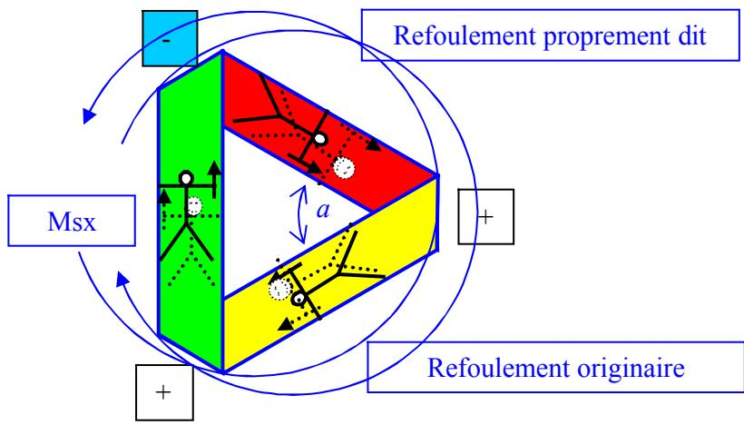

ïa ne dissout ni la dÇsorientation, c'est-á-dire l’illisibilitÇ de la zone jaune, ni la possibilitÇ que laisse la zone rouge de n’Ñtre pas lue. Simplement, le double parcours a ÇtÇ intÇgrÇ au moi. Nous savons qu’il s’agit d’une illusion, ce moi, ne serait-ce que parce qu’il se propose maintenant avec trois occurrences qui ne font que manifester la maintien de l’Çcart entre moi et mon image, l’Çcart du dÇsir, a, toujours insatisfait.

C’est bien pourquoi, si l’on veut, on peut tripler á des fins thÇoriques, les positions au miroir, comme je l’ai esquissÇ plus haut : miroir objectif, retournement objectif.

Une autre faÜon de raisonner consiste á partir d’un supposÇ corps rÇel, semblable au vase cachÇ du schÇma optique de Lacan. Ce dernier l’Çcrivait comme ci-dessous á l’envers, comme le vase suspendu sous un cache dans ce schÇma dit optique.

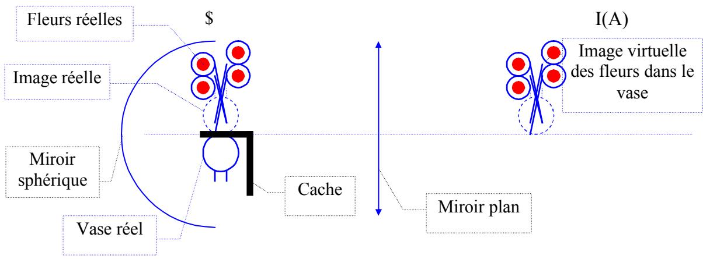

Entre le schÇma optique ci-dessus et l’Çcriture du croisement ci-dessous, je vais Çchanger les conventions d’Çcritures : si les pointillÇs ci-dessus sont lá pour indiquer la virtualitÅ des images qu’ils dessinent par opposition Ñ la rÅalitÅ du vase cachÇ, dans le schÇmas ci-dessous, ils exprimeront au contraire l’impossible de la saisie du rÇel du corps. Le pointillÇ exprime son illisibilitÇ. Il est de dos, comme dans les dessins prÇcÇdents. Il est comme Çcrit sur une face invisible et dÇsorientÇe. Une torsion, reprÇsentÇe ici par deux axes, va lui faire produire deux images, selon que l’on fait glisser ce corps le long de l‘axe des x ou le long de l’axe des y.

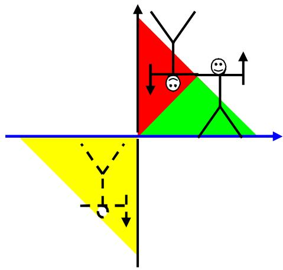

C’est un peu plus simple. ïa indique le fonctionnement d’une simple torsion, et se lit comme les bandes de Mœbius prÇcÇdentes, ou comme le fonctionnement d’un miroir subjectif. En rÇalitÇ, ce n’est que par apràs-coup qu’on peut dÇduire de l’image du corps, dans la zone verte, du fait de sa dissociation avec les reprÇsentation refoulÇes, dans la zone rouge qu’il y a sans doute á l’origine (d’oä l’idÇe de Ä refoulement originaire Å) un corps rÇel qui se comporte comme une coupure entre rouge et vert empÑchant l’unitÇ du moi. Cette coupure, nous l’imaginons en retour comme la surface qui se trouve de l’autre cåtÇ de la torsion, c'está-dire l’acoupure ;

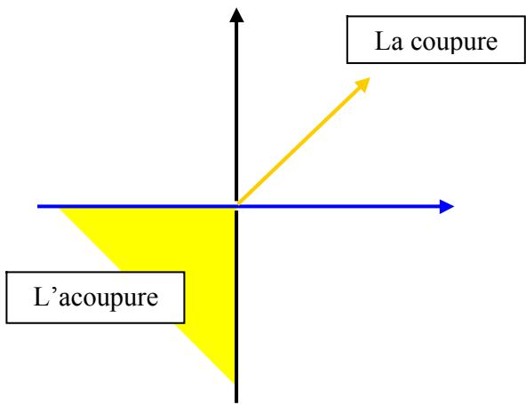  
Ce qui signifie que, mÑme lorsque nous tentons de reprÇsenter une seule torsion, nous sommes obligÇ de reprÇsenter trois bords. Les deux axes qui se croisent et la coupure qui naçt de la torsion ainsi dÇfinie. Un bord, c’est une torsion en soi, puisque sur un bord, nous passons d’une face á l’autre face. Dans ces bords, il faut lire le signifiant : ce que nous disons est toujours double. $\mathrm { C a }$ se voudrait produire le moi unique que $\Gamma _ { } _ { 0 \mathrm { n } }$ voit sourire dans la zone verte. ïa, c’est ne tenir compte que du signifiÇ qui serait lu comme univoque, Çquivalent au signifiant (l’axe des x). En fait ce que je dis est toujours tordu par un autre signifiant (l’axe des y) qui produit une Autre image de moi, celle des reprÇsentations refoulÇes.

Ce qui me donne au final cette figure de carte á jouer, que les indiens caduveos13 du BrÇsil se peignent volontiers sur le corps.

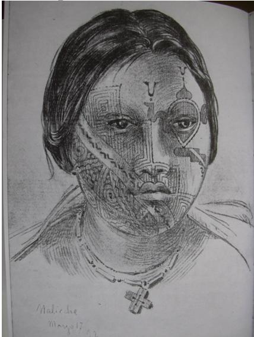

En fait, tant que l’analyse n’est pas terminÇe, globalement, tout se passe comme si nous restions sur une bande de Mœbius homogàne. L’analyse d’une rÑve ou d’un symptåme dans le dÇcours d’une analyse peut s’inscrire sur une bande de Mœbius hÇtÇrogàne dans un contexte qui reste globalement homogàne, jusqu’á la fin de l’analyse, coupure finale. Telle est le sens qu’on peut donner á cette parole de Lacan, posant l’analyse comme une paranoëa dirigÇe, puis comme une autisme á deux.

Topologiquement, la bande de Mœbius homogàne Çcrit tràs exactement cela : comme dans le dessin d’Escher, oä l’on voit des personnages monter un escalier pour finalement se retrouver en bas, tandis que de l’autre cåtÇ des personnages semblables ne cessent de descendre le mÑme escalier, pour finalement se retrouver en haut.

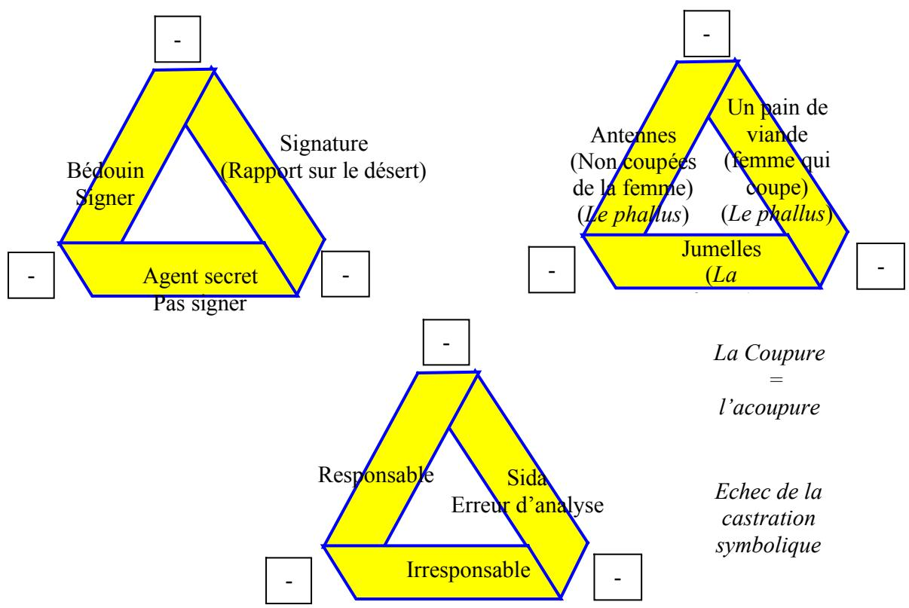

Au centre de mon rÑve, la femme qui coupe un pain de viande s’essaie á la castration. Le rÇsultat en est les deux jumelles, mais chacune, bien que femme porte une excroissance de chair…. Certes sur le front, mais nous appellerons Üa, avec Freud, un dÇplacement vers le haut. Sa coupure ne fonctionne donc pas ; c’est pourquoi je l’appelle l’acoupure comme ce que reprÇsente la bande de Mœbius homogàne : impossible de trancher entre dessus et dessous, entre noir et blanc, entre masculin et fÇminin. Impossible distinguer entre les deux jumelles : j’aurais pu tout aussi bien Çcrire Ä jumelles Å au pluriel sur chacune des zones, ou tout simplement Ä la femme Å, ou encore la question Ä qu'est-ce que une femme ? Å.

Mon avancÇe thÇorique permet á prÇsent d’en donner interprÇtation. Comme la petite sœur de Hans, qui, aperÜue au bain, donne au petit garÜon une Çcriture de ce qu’il considàre comme la rÇalitÇ de la castration, cette femme servant des tranches de pain de viande a une fonction essentielle : couper. Qu’elle se situe au voisinage des jumelles munies d’un morceau de chair lá oä les femmes n’en ont habituellement pas ne permet plus de doute quant á la lecture de ce qui est lá Çcrit : elle opàre la castration, elle est le reprÇsentant du symbolique á l’œuvre dans son in-sistance á trancher, mais elle Çchoue aupràs de la rÇ-sistance des jumelles reprÇsentant JosÇphine.

Dans le rÑve de cette derniàre je peux á prÇsent lire les moqueries comme Çtant celle que les femmes ne manquent pas d’affubler les organes mêles en vengeance de ce qu’elles s’en sentent dÇpourvues.

Aussi bien, il s’agit de la rÇsistance de l’analyste : ce n’est pas par hasard si c’est le signifiant Ä jumelles Å qui a ÇtÇ choisit par l’inconscient pour voyager de l’un á l’autre. Mes deux grands fràres Çtant jumeaux, Üa ne pouvait que me rappeler cette question de la coupure : est-ce Un, est-ce deux (S1 S2)? Glissant le long des signifiants, cette question devient : le corps et le phallus, est-ce un, est-ce deux ? Ce qui revient á : garÜon ou fille ?

Ainsi s’Çcrit le mouvement d’Çchec du symbolique, autrement dit l’Çchec de la coupure á trancher entre le dessus et le dessous, entre un et deux, entre masculin et fÇminin, la coupure qui, assurant l’espace du manque, laisserait sa place au dÇsir. Je ne signe pas ma responsabilitÇ, et en mÑme temps je la signe á propos de ce rapport qui, au fait, n’est pas un rapport puisqu’il n’y a rien dedans, et qui, au fait, se devait d’Ñtre un rapport sur le dÇsert, et á une lettre pràs, sur le dÇsir. Cette lettre peut bien á prÇsent recevoir son qualificatif de lettre volÇe. Les jumelles au centre de mon rÑve redoublent ce dÇdoublement. Elles sont l’indice de mon identification á ses jumelles á elle, et rÇpàtent les divisions du dÇbut et de la fin de rÑve. Assumer le dÇsir comme tel, voilá qui serait une acceptation du fait de la castration, c'est-á- dire de la diffÇrence entre le masculin et le fÇminin, une diffÇrence qui s’inscrirait d’un Ä - Å tranchant entre la continuelle insistance des $\langle \langle { \bf \Psi } \rangle \rangle$

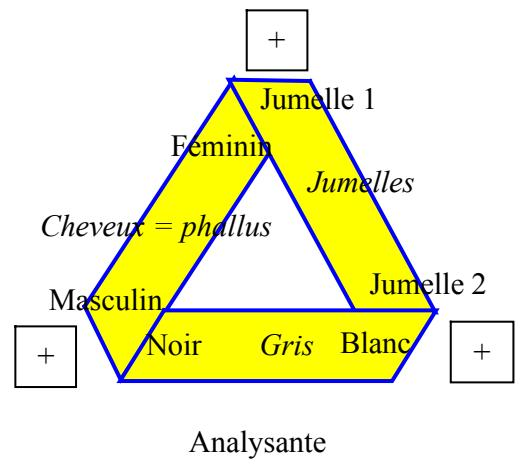

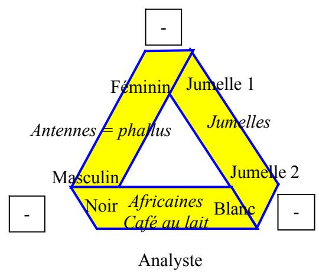

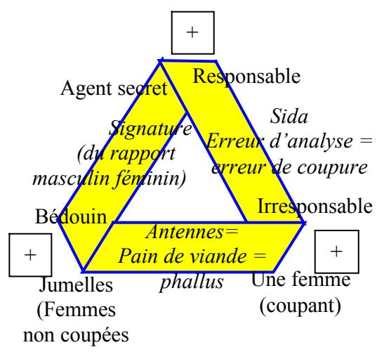  
Ce qui donne le schÇma gÇnÇral :

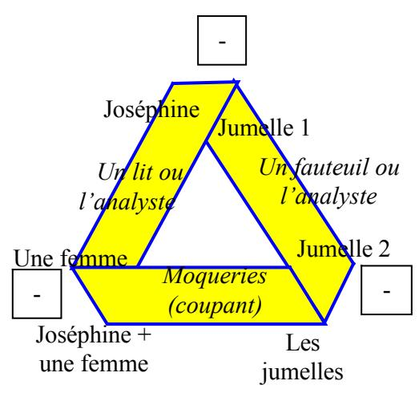

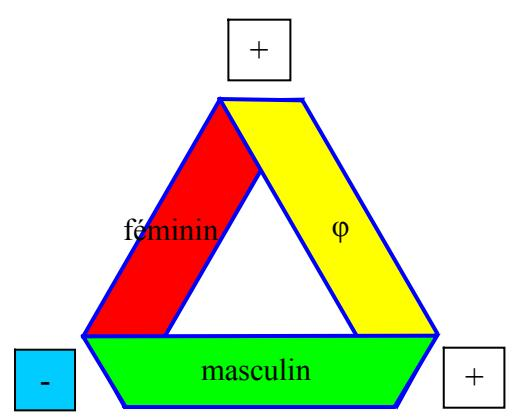

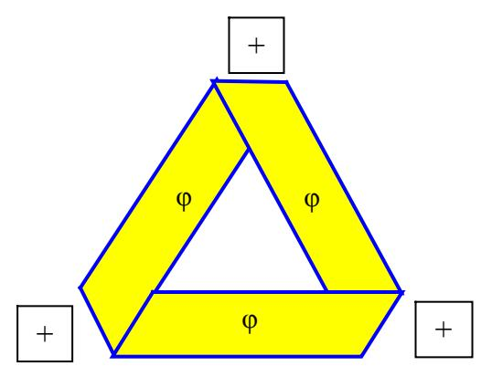

Sur chaque zone jaune dÇsorientÇe, l’interprÇtation a opÇrÇ la coupure qui oriente á la maniàre d’un changement de sens d’une des torsions :

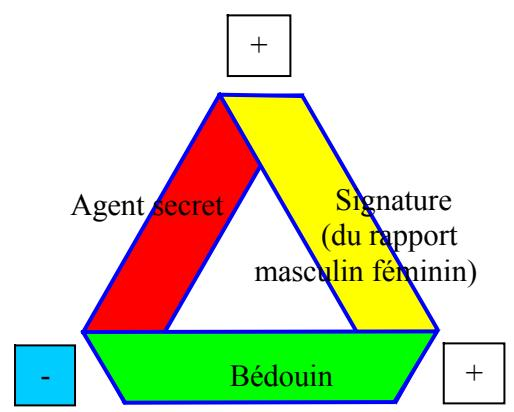

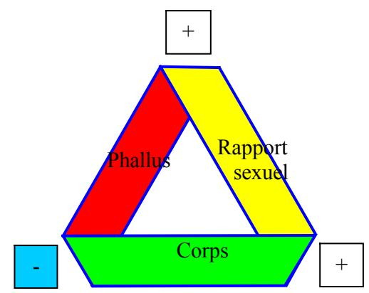

La mÑme course poursuite divisionnelle se lit dans le rÑve de JosÇphine. Elle est dans le lit avec une femme. Cette femme peut Ñtre lue aussi bien comme un objet homosexuel que comme un double narcissique, qui se redouble par l’arrivÇe des jumelles. Comme dans mon rÑve, il y a un reste : le corps de l’analyste lui-mÑme.

Qu’en est-il de cette femme qui redouble JosÇphine au lit chez son analyste ? Je le lui ai demandÇ. Ä En sortant de chez vous apràs la derniàre sÇance, j’ai croisÇ une jeune femme dans la salle d’attente. Je l’ai trouvÇ tràs belle. Je crois que c’est elle Å. J’entends : nous sommes toutes les deux chez le mÑme analyste, soit, sur le mÑme divan, soit dans le mÑme lit. Nous sommes toutes deux des objets de dÇsir de l’analyste. Je pourrais tout aussi bien comprendre : elle est jolie, cette femme rencontrÇe dans la salle d’attente, et je la dÇsire, c’est l’objet de mon dÇsir. Il n’empÑche, cette femme ne se trouve pas n’importe oä. Il se pourrait bien qu’on puisse comprendre encore : si cette femme dÇsire l’analyste comme objet, moi aussi.

Comme tout cela n’est que spÇculations de ma part – force est de reconnaçtre que je ne saurais choisir entre ces trois signifiÇs – je ne peux que m’en tenir á ce que j’ai entendu, et laisser tomber ce que je crois comprendre. Il y a JosÇphine et une autre femme dans un lit. Je me contente de lire le lit comme ce qui les rÇunit. L’autre femme Çtant cependant une autre, c’est qu’il y a une sÇparation entre les deux. Bref, un point de vue les rÇunit, un autre les sÇpare, mais c’est de la mÑme Çcriture dont il est question. C’est pourquoi je fais appel á l’Çcriture de la bande de Mœbius homogàne (á trois torsions de mÑme sens) pour en supporter ce double rapport, qui est aussi unique.

Mais ce n’est pas la seule raison. Car si ce lit prÇsente un dÇdoublement fÇminin, l’arrivÇe des jumelles dÇdouble ce dÇdoublement. C’est pourquoi j’en arrive á formuler l’hypothàse suivante, non sur la structure psychique de JosÇphine, bien sãr, mais sur le fonctionnement le plus gÇnÇral du rÑve. Un sujet a beaucoup de mal á se dÇ-finir. Surtout lorsqu’il parle peu, ce qui est la cas de JosÇphine, qui jusqu’á prÇsent, ne m’a pas dit grandchose, et surtout, pas grand-chose de spontanÇ. Ce qu’elle m’a dit jusqu’á prÇsent, j’ai dã le lui arracher á forces de questions.

C’est en parlant á un autre qu’on se dÇ-finit, c'est-á-dire qu’á partir d’une dÇsorientation initiale, on retrouve á s’orienter. Se dÇ-finir, c’est savoir ce qu’on veut. Beaucoup d’analysants arrivent chez l’analyste en posant cette plainte : en fait, je ne sais pas ce que je veux. Ils sont dÇsorientÇs quant á leur dÇsir. JosÇphine m’avait dit il y a peu : je vois de moins en moins mes amies, je n’ai pas de travail ou peu, quelques heures de vacations, je suis de plus en plus seule, je ne sors plus, rien ne m’intÇresse, je ne sais pas ce que je veux…Je pose donc l’hypothàse suivante : n’arrivant pas á s’orienter, JosÇphine produit dans un rÑve un reproduction d’elle-mÑme, puis une nouvelle reproduction de cette reproduction, tant ce qu’elle n’arrive pas á se formuler confond narcissisme (amour de soi) et libido sexuelle (amour de l’autre) en une double duplication qui ne laisse que peu de place á la diffÇrence. Cependant, si, dans le rÑve la diffÇrence est essentiellement reprÇsentÇe par l’analyste ; le lit est ce qui rÇunit JosÇphine et la femme, les moqueries rÇunissent ces deux derniàres avec les jumelles. Elles reprÇsentent, chez elle, ce surmoi dont j’ai parlÇ plus haut me concernant. Lorsqu’on se moque de quelqu'un, c’est qu’on fait valoir qu’il n’est pas á la hauteur de l’idÇal qu’on se croit soi-mÑme en mesure d’incarner. ïa dÇnote en gÇnÇral un dÇplacement sur l’autre de sa propre dÇfaillance.

Et pourquoi fais-je cette hypothàse ? Non pas parce que j’ai lu cela dans les livres de Freud – oä il se trouve que Üa se trouve aussi- mais parce que mon propre rÑve m’en donne une transcription dans les termes qui sont les miens. Entre le bÇdouin et moi, entre le responsable et l’irresponsable, se pose la question de ma culpabilitÇ en rapport á une chose sexuelle, le dÇsir (le dÇsert) et le sida. C’est par identification que je pose cette hypothàse sur le rÑve de JosÇphine. La question n’est donc pas de savoir si cette hypothàse est juste ou non quant á son contenu, elle est de trouver une thÇorie du transfert permettant d’Çcrire comment il se fait qu’une structure se reproduise á l’identique entre les deux personnes en prÇsence.

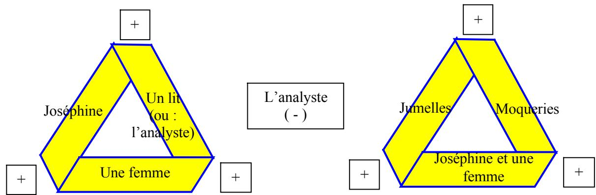

L’analyste est ce reste dont la seule place possible s’insàre dans ce qui met en rapport le premier et le deuxiàme dÇdoublement. Que m’avait-elle dit á ce propos ? Je lui avais demandÇ : mais alors qu'est-ce que je fais lá moi, allongÇ á cåtÇ de votre lit ? Elle avait rÇpondu : oh, vous savez je crois en fait que cette fille dans le lit est une faÜon voilÇe de vous mettre, vous, dans mon lit - Ce que vous formulez comment alors, en dÇfinitive ? – j’ai envie de coucher avec vous !

Et voilá pourquoi dans mon rÑve, j’ai tant d’hÇsitation á signer ce rapport (sexuel), á accepter cette responsabilitÇ qui s’exagàre au point de me rendre responsable puis irresponsable de rien moins qu’une ÇpidÇmie de Sida. C’est lá oä, selon la formule de Lacan, le psychanalyste a horreur de son acte. J’ai bien du mal á admettre cette Çvidence qu’elle venait de dire, d’avoir fait de moi l’objet responsable de son dÇsir, l’objet a. Mon rÑve l’exagàre au point de me faire responsable de toute une ÇpidÇmie de Sida…et m’en dÇculpabilise aussitåt, comme la premiàre partie me faisait hÇsiter á endosser la paternitÇ du rapport (sexuel).

Mon rÑve est donc une Çcriture de cette formule de Lacan, si mystÇrieuse qu’elle n’a ÇtÇ que peu reprise ou commentÇe : il n’y a de rÇsistance que de l’analyste.

Le premier rÑve apportÇ par Freud dans la Traumdeutung, l’injection faite Ñ Irma, ne fait pas autre chose : Irma est une de ses analysantes, et il ne cesse de chercher le moyen de dÇtourner la culpabilitÇ qu’il Çprouve de n’avoir pas su la soigner. Le dÇboublement dont j’ai rendu compte ici se produit chez Freud sous la forme d’une multiplication des responsables extÇrieurs Ñ lui-mÅme : c’est la faute d’Irma elle-mÅme, qui n’a pas suivi ses conseils, puis celle de son ami Otto qui lui a fait une injection avec une seringue pas propre…

Le travail du symbolique tentÇ par le rÅve reste de trouver une Çcriture qui pourrait trouer le rÇel de ce sentiment de culpabilitÇ. Mais visiblement ce dernier est le plus fort, puisque le rÅve, qui devrait avoir tous les droits que s’octroie l’imaginaire, se heurte Ñ ce rÇel au point de ne pas cesser de chercher une autre Çcriture. C’est bien l’indice que l’Çcriture trouvÇe Ñ un moment ne suffit pas. Ainsi pouvons-nous comprendre la dÇfinition lacanienne du symbolique : si l’imaginaire consiste, faisant surface, le symbolique insiste á faire trou dans le rÇel qui ne cesse de rester hors de sa portÇe, car il ex-siste. Le symbolique in-siste á mettre dedans ce qui ex-siste en se maintenant dehors, tandis que la surface de l’imaginaire consiste á faire Çcran entre intÇrieur et extÇrieur.

## Ecriture nodale

Avant de passer á la suite, peut-Ñtre pouvons-nous transformer l’Çcriture de la bande de Mœbius homogàne en tràfle muni de sa surface d’empan, ce qui est exactement la mÑme chose. Regardez bien ces tràfles : ils ont trois croisements de mÑme sens, comme la bande homo a trois torsions de mÑme sens, et ses trois morceaux de brins de ficelle, diffÇrenciÇs par la recoupe sont identiques exactement comme sont identiques les trois segments de bord de la bande Homo.

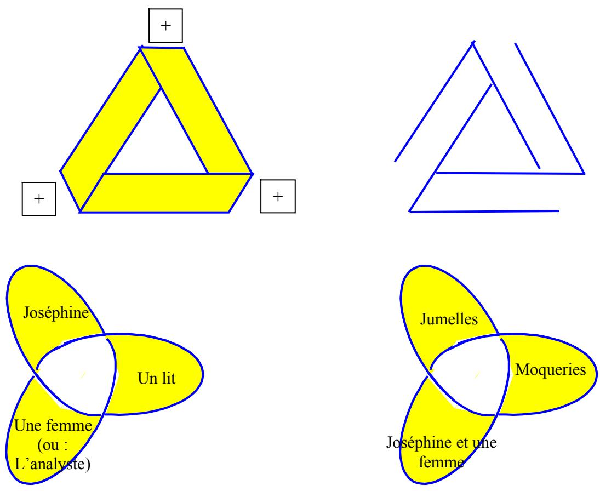

Le rÑve tente une mise en rapport de ces deux Çcritures, ne serait-ce que dans la mÇtonymie de son discours. Cette opÇration fait acquÇrir á l’Çcriture la souplesse nodale nÇcessaire á la mise en rapport au sein d’une seule Çcriture, qui montre l’effort du symbolique pour ouvrir un trou.

Qu'est-ce que j’entends par ce mythique Ä effort du symbolique Å ? Peut-Ñtre quelque chose de l’ordre de la tentative de trouver un interlocuteur pour dire, trouver les mots, c'est-á- dire couper ce fil qui pour l’instant se borne á Ñtre unique. Dans le rÑve, personne ne parle. Ce n’est qu’un message que le rÑveur s’envoie á lui-mÑme. C’est ainsi que j’explique la rÇcurrence ou le dÇdoublement des situations : puisque personne ne rÇpond, puisque personne n’a entendu, il faut rÇpÇter le message. Ce rÑve est double, mais j’en ai entendu des bien plus longs, dans lesquels on peut parfaitement repÇrer sous des avatars divers la rÇpÇtition du toujours mÑme message. C’est le cas de mon rÑve personnel á trois sÇquences, tel qu’analysÇ plus haut.

Voici donc comment je reprÇsente le travail du symbolique dans le rÑve :

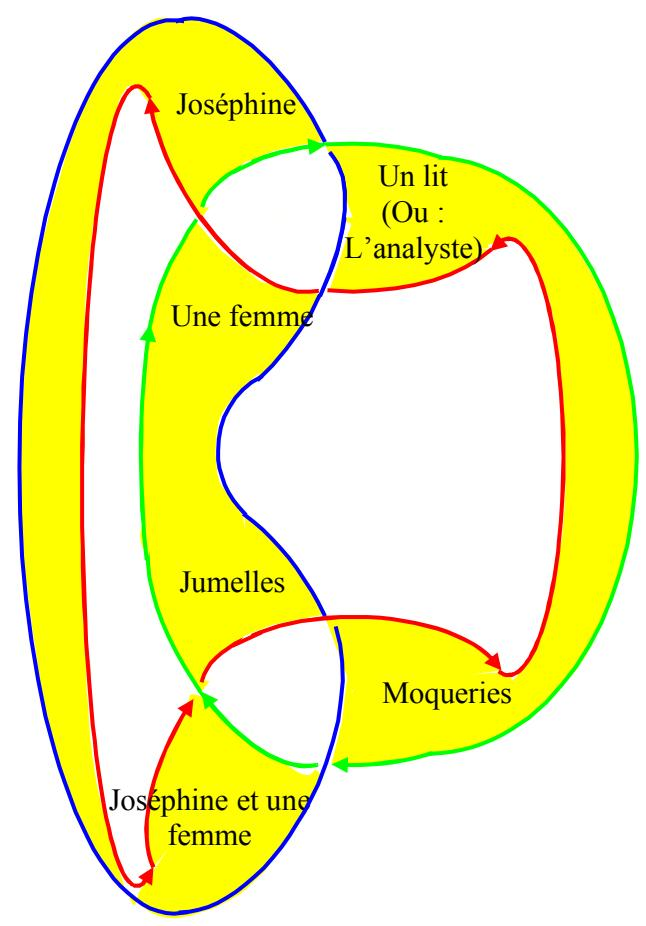

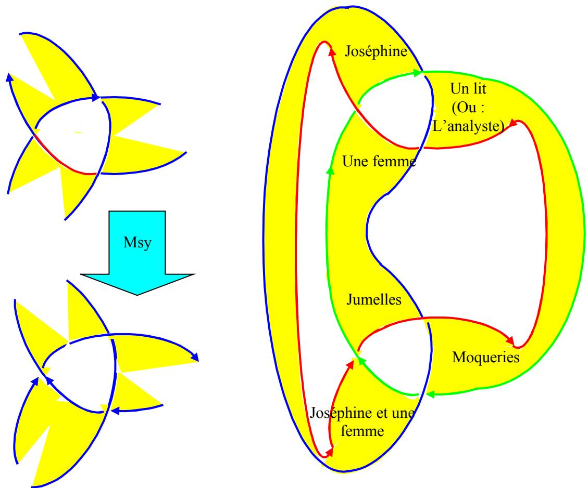

Nous verrons un peu plus loin ce que c’est que cette transformation Msy qui dÇsigne la relation entre ces deux tràfles apparemment identiques.

Un trou s’est ouvert dans chacune des feuilles de chaque tràfle. Tout indique, dans ce rÑve, que la deuxiàme sÇquence est un redoublement et un prolongement de la seconde, tout comme l’analyste semble Ñtre un prolongement du corps de l’analysante, tout comme les paroles prononcÇes en forme de moqueries semblent la seule possibilitÇ d’ouvrir un trou. Ces paroles ne son Çvidemment pas prononcÇes, puisqu’il s’agit d’un rÑve dont je ne peux tÇmoigner que comme auditeur du rÇcit qui m’en est fait. JosÇphine ne pouvait pas prÇciser de quelles paroles il s’agissait, elle pouvait seulement les qualifier : des moqueries. Ceci tÇmoigne, á mon sens de l’Çchec du symbolique. Ce que le rÑve dÇroule ainsi, c’est une Åcriture qui tente de mimer ce qu’il en serait d’une parole souhaitÇe en mÅme temps que redoutÇe. La parole souhaitÇe, elle est advenue par l’interprÇtation de JosÇphine lorsqu’elle a pu passer au-delÑ de la sanction redoutÇe : des boules afros aux testicules….

Cette interprÇtation est l’Çquivalent d’une orientation par une coupure. Comme on le voit dans l’Çcriture topologique du rÅve, la mise en rapport des surfaces ne suscite pas d’orientation. Chaque oreille de trÜfle se dÇdouble et pourtant, Öa reste une seule face. D’un cátÇ JosÇphine, de l’autre JosÇphine et une femme. Il n’y en a qu’une et pourtant elle est double. Cette zone redouble donc la caractÇristique de la bande de Mœbius : il n’y a qu’une face et pourtant il y en a deux. Il se passe la mÅme chose pour les jumelles dans leur rapport Ñ une femme. C’est la femme inconnue, double de JosÇphine, qui le plus logiquement semble se dÇdoubler encore une fois.

Enfin la troisiÜme zone affiche les mises en rapport, c'est-Ñ-dire ce qui fait lien. Sur le plan scopique le corps de l’analyste semble faire le lien entre les deux moments du rÅve. Ce corps rÇside au mÅme lieu que les moqueries : c’est sur le divan que se disent les paroles qui, passant de l’analysante á l’analyste, font nœud. Elles prennent la forme des moqueries entendues dans le rÑve, ce qui pourrait contribuer á l’explication de la faible loquacitÇ de JosÇphine. Lorsqu’on se sent sans cesse en bute aux moqueries, il y a de quoi chercher á se taire.

Du point de vue nodal, le rÇsultat est un triple enlacement. Il peut s’Çcrire un peu plus lisiblement comme ceci :

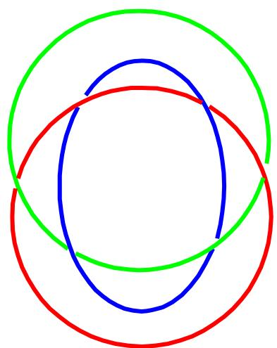

Chaque rond pÇnàtre dans le trou des deux autres, contrairement au nœud borromÇen :  
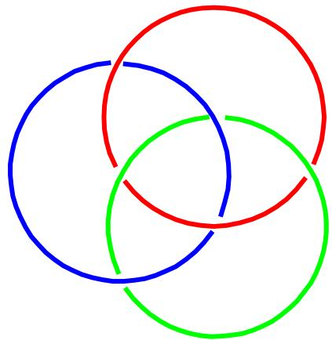

…dans lequel aucun rond ne pÇnàtre dans le trou d’un autre. L’enlacement n’est pas un nœud, et surtout pas un nœud borromÇen.

Comment interprÇter cette diffÇrence ? Le nœud borromÇen Çcrit la troisiàme ditmention, c'est-á-dire le dit-mention de la parole : chaque rond et clairement dessous ou dessous un autre rond. Le trou de chaque rond est efficient, car rien ne vient le boucher. Dans l’enlacement, la troisiàme dimension ne cesse pas de ne pas s’Çcrire. Les bords ne se distinguent pas vraiment des trous, puisque les trous sont tous bouchÇs par la surface d’un autre rond qui le traverse. L’enlacement ne sort pas de l’inceste, compris á la maniàre de Lacan dans Ä l’Etourdit Å : Ä je mÇtaphoriserai de l’inceste les rapports qu’entretient la vÇritÇ avec le rÇel Å. Autrement dit dans le rÑve, la vÇritÇ est comprise comme le rÇel. Ou, pour employer le vocabulaire freudien : les mots y sont pris pour des choses. Dans le rÑve, nous croyons á la rÇalitÇ de ce que nous voyons, et d’autant plus qu’il s’agit de la rÇalisation d’un dÇsir. Tout se passe avec ce triple enlacement comme dans l’enlacement simple que Lacan dÇcrivait dans son sÇminaire sur l’Identification :

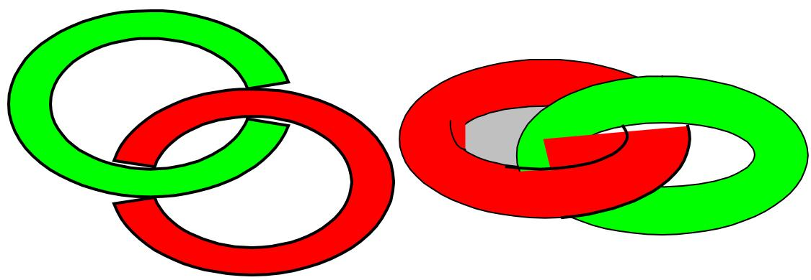

MalgrÇ le vide laissÇ entre la surface et les trous, la structure se laisse lire comme le comblement du trou de l’un par le corps de l’autre. Lacan disait qu’il s’agissait du dÇsir de l’un qui rÇpondait exactement á la demande de l’Autre. C’est ce qui se passe dans un rÑve, dont la mise en scàne vient apporter l’objet qui manque á l’Autre intrinsàque. C’est ce qui s’appelle prendre ses dÇsirs pour des rÇalitÇs. LÇgàrement voilÇ par la censure, le dÇsir de JosÇphine s’avàre, dans son rÑve, comblÇ : elle dÇsire coucher avec son analyste, et elle possàde un pÇnis sous la forme du corps de celui-ci. Non seulement ces deux dÇsirs sont contradictoires, mais son dÇsir est aussi de respecter la censure rappelÇe par les jumelles sous la forme des moqueries. Dans cette derniàre configuration, l’Çcriture de cette parole moqueuse condense la surface et le trou : le trou que serait une parole, parce qu’elle tranche entre deux options du dÇsir, dans le rÑve s’avàre la mÑme chose qu’une surface, d’une part parce qu’on ne peut vraiment lire ce que ces Ä paroles Å disent, d’autre part parce qu’elles reprÇsentent la menace du trou comme tel, c'est-á-dire de l’aveu par la parole, se rÇvÇlant ici l’exacte mÇtaphore de la castration.

Son dÇsir se rÇvàle triple et triplement contradictoire, et c’est pourquoi le rÑve prÇsente aussi cette succession de dÇdoublements qui s’Çcrit finalement comme un triple enlacement.

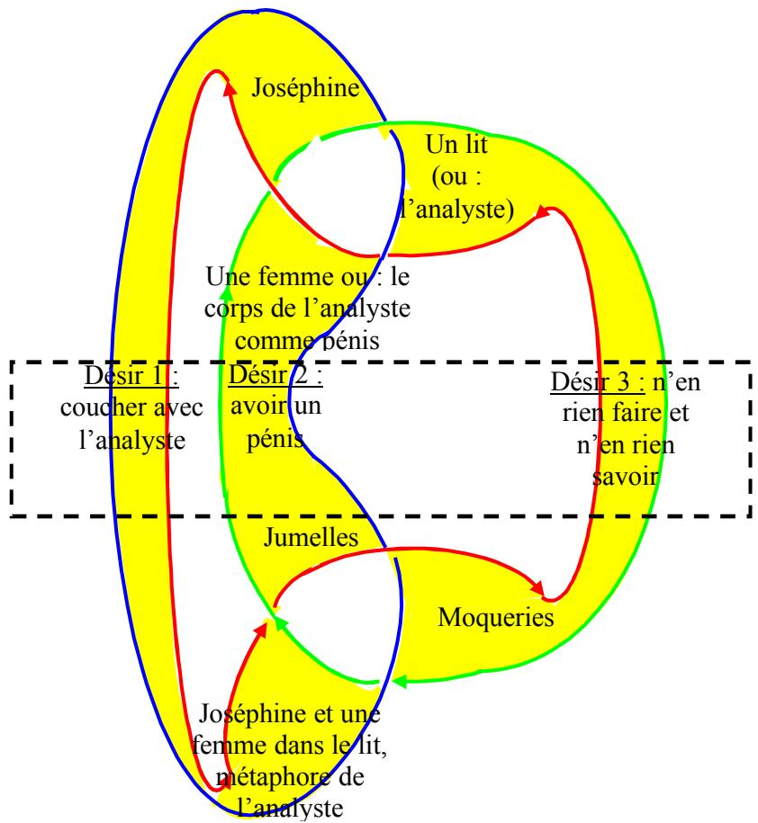  
L’intÇrÑt de la topologie rÇside en ceci : la configuration ci-dessus est une proposition, et non une Çcriture dÇfinitive. J’en ai Çcrit plusieurs dizaines d’autres avant de parvenir á celle-ci, qui m’apparaçt pertinente au stade oä j’en suis de ma rÇflexion. Les prÇcÇdentes Çcritures auraient toutes pu susciter leur justification. Mais, comme dans l’exercice de l’analyse, les exercices topologiques ne sont lá que pour relancer la dynamique du processus. Aussi ai-je justifiÇ mes choix pour la figure retenue, fruit de ces exercices et des propositions rejetÇes, sans Ñtre dupe de leur caractàre tout provisoirement dÇfinitif.

Passons á l’Çcriture nodale de mon propre rÑve. Donc, j’ai entendu le rÑve de JosÇphine sans savoir que je l’avais entendue au-delá de ce qu’elle m’en avait dit dans la sÇance oä elle le raconte. Telle est du moins l’hypothàse. Mon rÑve, comme tous les rÑves, au fond, reprend le dÇsir de respecter la censure comme fondamental, puisqu’il se poursuit dans les trois sÇquences, qui prÇsentent chacune un dÇdoublement : celui qui veut respecter la censure, la hiÇrarchie, l’honnÑtetÇ, la santÇ publique, et celui qui passerait bien outre pour satisfaire á ses dÇsirs.

Mais comme cette fois il y a trois sÇquences, j’effectue les liaisons de trois tràfles selon le mÑme principe que prÇcÇdemment, celui des ouvertures qui se produisent dans chaque feuille de chaque tràfle et qui identifient les brins semblables.

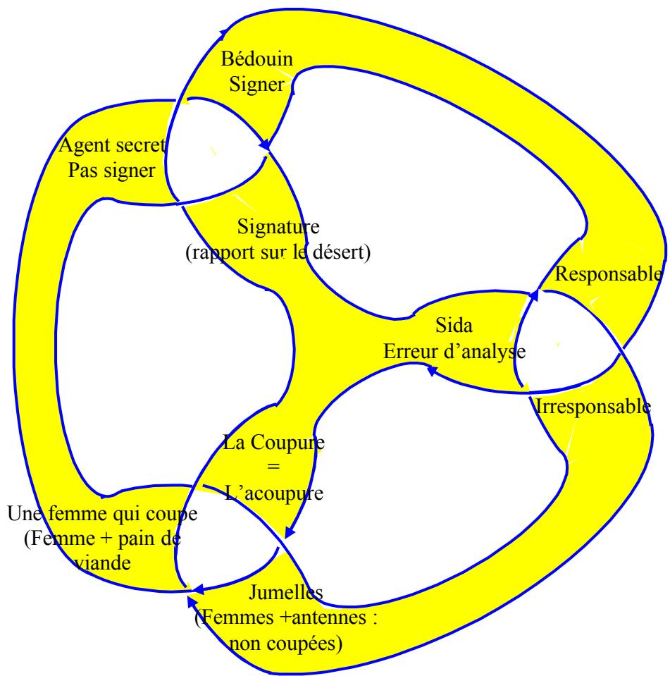

Le rÇsultat n’est pas un triple enlacement, cette fois-ci, mais un triple tràfle. La liaison ne prÇsente pas un dÇcoupage en trois ronds enlacÇs, mais un seul brin de ficelle qui se croise neuf fois lui-mÑme. Je n’ai pas cherchÇ á obtenir cette Çcriture, je me suis bornÇ á appliquer les ràgles que je me suis donnÇes. Ces ràgles imposent ce rÇsultat. Doit-on y voir une structure fondamentalement diffÇrente du rÑve prÇcÇdent ? A priori je dis non, parce qu’ici, le trou est bouchÇ, non par la pÇnÇtration d’un autre rond, mais par le fait qu’il s’agit toujours du mÑme rond, du mÑme brin de ficelle dont il est impossible de dÇterminer globalement s’il est dessus ou dessous, puisqu’il est toujours, localement, soit dessus, soit dessous. Comme dans un tràfle simple, la surface comprise entre les brins n’est pas plus orientable : pour un croisement, elle est dessus, tandis qu’au croisement opposÇ, elle est dessous. L’Çcriture du trou, c'est-á-dire de la troisiàme dimension, Çchoue. Ce n’est pas autre chose qu’une manifestation de ce que Lacan appelait le rÇel l’Çcriture : rien ne peut faire que l’Çcriture ne soit pas á deux dimensions, excluant rÇellement la troisiàme, de mÑme qu’un rÑve (et toute manifestation de l’inconscient) se prÇsente comme une Çcriture parce que le refoulement en a exclu la parole.

NÇanmoins puisqu’il y a deux Çcriture diffÇrentes, tràfle et enlacement, il faudra bien qu’un jour je trouve une explication á cette diffÇrence : d’un cåtÇ trois ronds enlacÇs (c'est-á- dire : qui se pÇnàtrent l’un l’autre, et non pas nouÇs), de l’autre un seul rond (qui se pÇnàtre lui-mÑme). De plus, nous pourrions parfaitement rencontrer des rÑve á 4, 5…n sÇquences.

Quoiqu’il en soit, nous avons d’un cåtÇ une formule gÇnÇrale du rÑve qui, au-delá des formes diffÇrentes, rend compte de ses caractÇristiques : la pÇnÇtration du ou des trous disponibles, c'est-á-dire leur effacement comme trou. Ceci se distingue de maniàre structurale du nœud borromÇen, qui reprÇsente la parole, c'est-á-dire l’Çchange avec un autre, formant du trou sans qu’il y ait pÇnÇtration. C’est le meurtre de la Chose au sens oä elle est exclue du trou. C’est la forme la plus efficiente de l’Çcriture du symbolique, c'est-á-dire de l’Çchange verbal avec un autre qui entend. Dans un rÑve, il $\boldsymbol { \mathrm { n ^ { \prime } y } }$ a pas d’Çchanges avec un autre, c'est-á- dire un interlocuteur qui entend et qui rÇpond. C’est ce que reprÇsente le tràfle ci-dessus : il n’y a pas d’autre brin. Par contre il peut y avoir dialogue avec l’Autre intrinsàque celui qui reprÇsente l’inconscient, dÇdoublant le sujet de maniàre fictive : c’est ce que reprÇsentait le triple enlacement.

N’y a-t-il donc pas dialogue avec l’Autre dans mon rÑve ? Si, bien sãr. L’Çcriture ne diffàre pas de ce fait, mais seulement du nombre de sÇquences. C’est l’Çtude de ce problàme qui m’a amenÇ á trouver une formule du nœud borromÇen gÇnÇralisÇ.

## IntermÇde technique : construction du nœud borromÅen gÅnÅralisÅ

En effet, j’Çtais d’abord obnubilÇ par la structure du nœud borromÇen Ñ trois ronds, ce qui est le minimum en deÖÑ duquel il n’y a pas de nœud borromÇen. Pourquoi ? é cause de la structure particuliÜre de ce nœud, qu’on trouvera dÇtaillÇe dans ma â ThÇorie du nœud borromÇen en relation avec la thÇorie des 4 discours ä lisible sur mon site. Elle est particuliÜre en ce qu’elle permet de dÇcrire prÇcisÇment le mouvement de la parole dans son articulation Ñ l’Çcriture qui fait rÇsistance Ñ son avancÇe.

Puis je me suis aperÖu, aprÜs de multiples essais, qu’il Çtait possible de construire un nœud borromÇen Ñ trois ronds Ñ partir de quatre trÜfles, dont un seul doit tourner en sens inverse des trois autres, celui placÇ ici au centre :

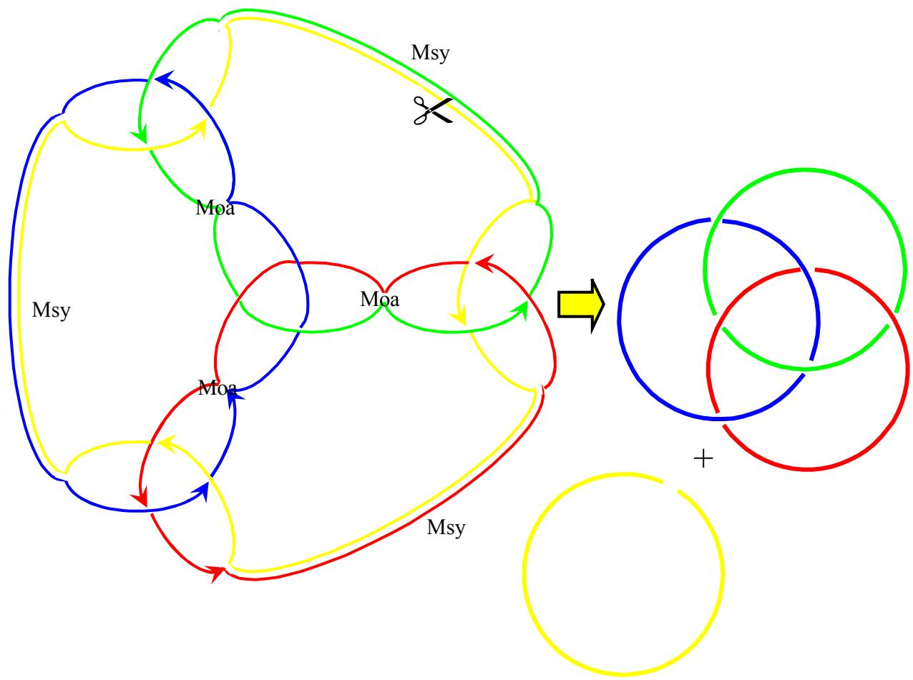

Les notations Msy et Moa indiquent les relations de miroir qui nouent les Çcritures deux par deux. Moa : miroir objectif antÇrieur, Msy, miroir subjectif, ou retournement selon l’axe des y. Je m’expliquerai sur ce dernier un peu plus loin.

La connexion se fait entre les quatre tràfles selon le mÑme procÇdÇ utilisÇ plus haut, reprÇsentant, je le rappelle, l’ouverture de la parole. On obtient un nœud á quatre ronds, mais il suffit de couper le rond interne (jaune) pour se retrouver avec un nœud borromÇen á trois ronds parfaitement formÇ. Qu'est-ce que ce rond jaune qu’il faut Çliminer, alors ? Eh bien c’est l’objet a, de Lacan tel qu’il est censÇ s’Çliminer en fin de cure.

Il se trouve que, en Çtudiant la structure de la surface d’empan de ce nœud borromÇen, comme modÇlisation de la parole dans son rapport Ñ la mise en mÇmoire (l’Çcriture) j’ai dÇmontrÇ qu’on pouvait orienter trois zones pleines et trois zones vides et repÇrer l’impossibilitÇ d’orienter une zone pleine et une zone vide, qui se constituent donc intrinsÜquement, comme objet petit a et jouissance de l’Autre (J(A)) au sein mÑme du nœud. Cette opÇration s’effectue par six retournements d’un rond, en se servant des deux autres comme axe de rotation. Voici l’ÇlÇment final de ce modàle, dans lequel le rond orange change de place entre les deux Çcritures du nœud, entraçnant dans son retournement une inversion des places entre les surfaces pleines, qui viennent de terminer leur orientation (chaque zone est divisÇe en vert et rouges, vert dessus et rouge dessous, si on veut faire la comparaison avec une rondelle de papier, qui, tout en Çtant la mÑme feuille, prÇsente deux faces) et les surfaces vides qui reprÇsentent l’Çnonciation. L’Çcriture ci-dessous serait donc l’Çcriture thÇorique d’une Çnonciation, á partir des Çcritures (reprÇsentations de choses) contenues dans le rond de gauche (ce que je veux dire) jusqu’á la mise en mÇmoire de la modification provoquÇe par l’Çnonciation (le mouvement de passage lui-mÑme) dans le rond de droite (ce que je me souviens de ce que j’ai entendu de ce qui a ÇtÇ dit) :

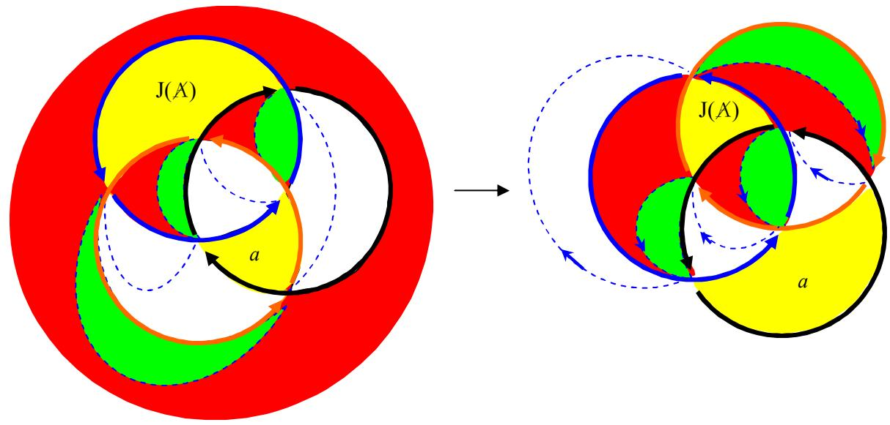

Quand je parle d’Çchange entre les pleins et les vides, je parle d’un Çchange virtuel, dans l’apparence de l’Çcriture. En fait, si vous imaginez le mouvement du rond cheminant de en bas á gauche (dans le rond de gauche) á en haut á droite, (dans le rond de droite), vous constaterez que chaque zone reste á sa place mais change d’aspect14.

Par ailleurs, la coupure bleue pointillÇe qui sÇpare les zones rouge des zones vertes et se referme sur elle mÑme au bout de six retournements, cette coupure zigzague en changeant de sens á chaque retournement de rond, c'est-á-dire á chaque changement de lieu, comme on peut le lire grêce aux flàches que j’ai rajoutÇes dans la figure de droite. Ce changement de sens reprÇsente chaque passage de la parole á l’Çcriture, c'est-á-dire de l’Çnonciation á la mise en mÇmoire (le travail de la censure), et inversement, l’interprÇtation de la mise en mÇmoire (le travail du rÑve) par la prise de parole. L’Çcriture de rÑve et de son interprÇtation concrÇtise exactement ce que ces deux figures thÇorisent. Dans un premier temps du rÇcit, la coupure semble sÇparer nettement l’analyste du lit oä sont rassemblÇs JosÇphine et une femme, tandis que, plus loin, elle coupe l’analyste des jumelles :

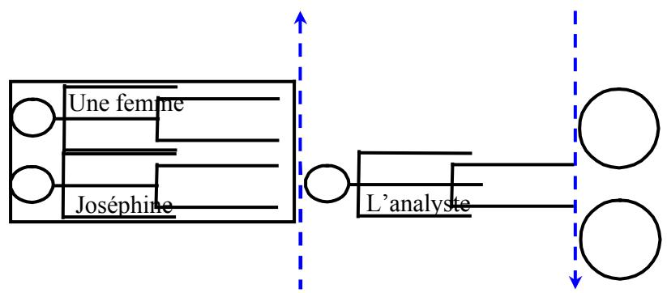

Il s’agit bien d’une coupure signifiante au sens oä il s’agit du premier temps d’un rÇcit, et les images que j’y ajoute ne sont que reconstitution apràs-coup. Ce premier temps du rÇcit n’est pas le rÑve comme tel, mais un premier temps de l’interprÇtation par la parole.

L’interprÇtation seconde, un deuxiàme tour de la parole lors d’une deuxiàme sÇance, sÇparÇe de la premiàre par une coupure, fait changer le sens et le lieu de la coupure. Elle passe de la verticale á l’horizontale (dans cette Çcriture-lá, bien sãr) et sÇpare ce qu’elle avait assemblÇ, tout en assemblant ce qu’elle avait sÇparÇ :

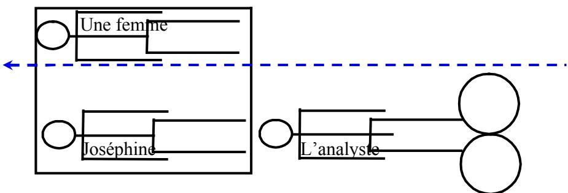

La progression de l’interprÇtation Çclaire le rapport de JosÇphine Ñ un homme et au phallus, mais cette avancÇe se fait au prix d’une rÅgression qui refoule le rapport de JosÇphine á une femme15. De plus cette progression de l’interprÇtation est Ñ lire comme un dÇvoilement de la rÅgression Ñ une reprÇsentation infantile dans laquelle la femme se trouve pourvue d’un phallus. La combinaison des deux Çcritures, qui serait une lecture globale du rÅve encore Ñ venir, montre, comme sur la surface d’empan du nœud borromÇen, le trajet de la coupure en tant qu’elle se recoupe, tout en restituant le continuum que tisse la linÇaritÇ du discours :

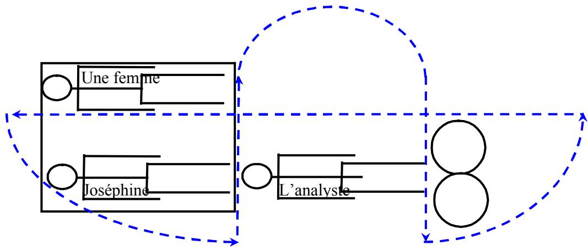

Cette continuitÇ de la coupure, je l’ai dÇjÑ ÇvoquÇe plus haut (p.7) dans le passage de cette esquisse au graphe d’une bande de Mœbius. Mais ici, son trajet continu restitue le fait qu’il n’est de mÇtaphore consciente que via son expression mÇtonymique, puisqu’il faut redire ce qu’on a dit dans un autre contexte pour en faire valoir l’aspect mÇtaphorique. Ici, le changement de sens de la coupure doit se lire comme un deuxiÜme tour sur le bord d’une rondelle (faisant valoir l’Autre face), ce qui revient Ñ l’Çcriture du huit intÇrieur, qui est aussi le bord d’une bande de Mœbius.

Bien sãr l’aspect imaginaire de la configuration du trajet de cette coupure diffàre sensiblement de celui de la coupure de la surface d’empan du nœud borromÇen. Mais en termes de structure, nous avons bien affaire á la mÑme.

Voici la mÑme opÇration sur mon propre rÑve, le premier rÇcit, puis la rÇorganisation du passage de la coupure dans le rÇcit suivant :

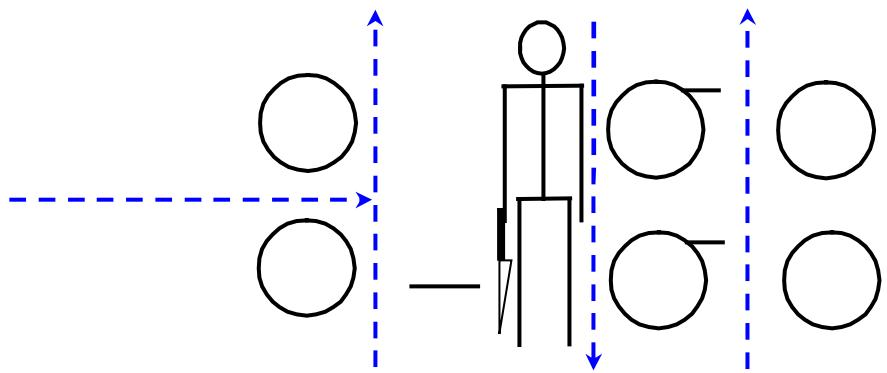

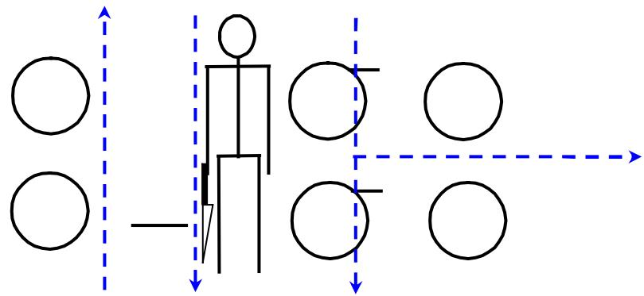

Il semble qu’il y ait une similaritÇ de structure entre cette Çcriture, et celle que je viens d’exposer concernant la construction du nœud borromÇen á partir de 4 tràfles. Dans les deux cas, le rÇsultat est un nœud borromÇen dont une partie reste exclue : le rond jaune dans un cas, les deux zones jaunes dans le second la deuxiàme, (J(A)) est, en fait, thÇoriquement un vide). Je rappelle par ailleurs que tout ce travail est motivÇ par le souci d’Çcrire la clinique, á partir de cette question : pourquoi un nombre prÇcis de sÇquences, et pourquoi ce nombre serait-il restreint ? Ici, nous avons 4 tràfles d’un cåtÇ, six retournements de l’autre.

Or les 4 tràfles en question, qui ne sont que de deux sortes, nous renvoient aux possibilitÇs d’Çcritures diffÇrentes du tràfle, en fonction des miroirs qui les reflàtent. Il y en a 4 :

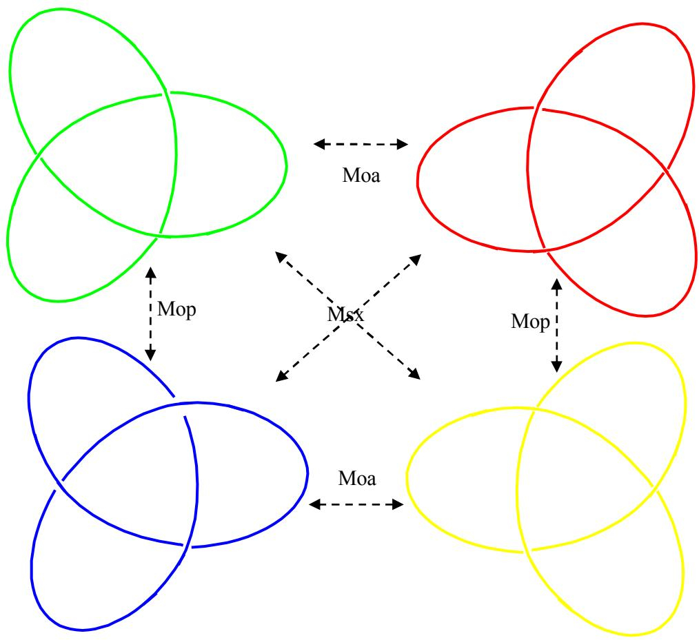

On pourrait tout aussi bien considÇrer l’Çcriture d’un rÑve, du moins d’un rÑve du type de ceux dont il est question ici (rien ne dit qu’ils soient tous sur ce modàle), comme la duplication successive d’une premiàre Çcriture á travers diffÇrents miroirs. Il ne serait nullement utile de mettre les branches en relation. Souvent en effet, dans les rÑves, des sÇquences successives se prÇsentent sans rapport apparent les unes avec les autres. Ce seraient autant de tentatives du symbolique pour tenter de faire trou, c'est-á-dire de faire parler un rÇel inscrit de la veille, inscrit mais non Çcrit, donc encore illisible. Par contre l’Çnonciation du rÑve, ne serait-ce que par la mise en rapport des sÇquences, fait interprÇtation. Elle impose donc ce raboutage des diverses branches de chacun des tràfles.

Vous constaterez que pour, pour cela, c'est-á-dire construire le nœud borromÇen, je me suis servi de trois Çditions du tràfle rouge, (dextro gauche) et d’un seul du tràfle vert (lÇvo droit). J’aurais pu remplacer l’un des trois rouges par le dextro droit (bleu), le rÇsultat aurait ÇtÇ le mÑme, l’important Çtant seulement que les trois tràfles externes soient de gyrie inverse au tràfle central. Mais dans tous les cas j’aurais dã laisser de cåtÇ le dextro droit, que du coup je ne peux que vous prÇsenter en jaune. Vous connaissez á prÇsent le symbolisme que j’attribue á cette couleur.

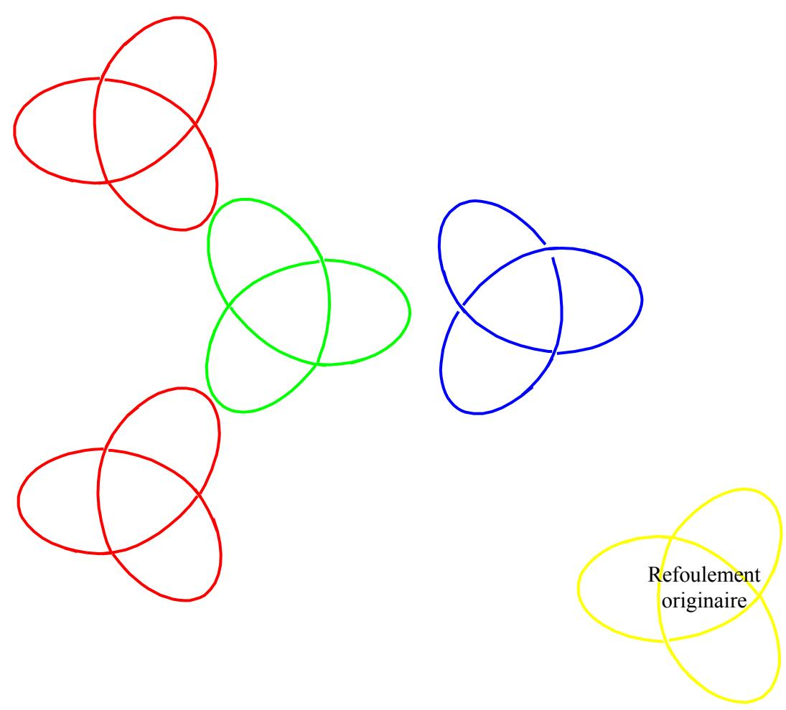

Refoulement originaire

Ce qui donne, une fois les raboutages effectuÇs :

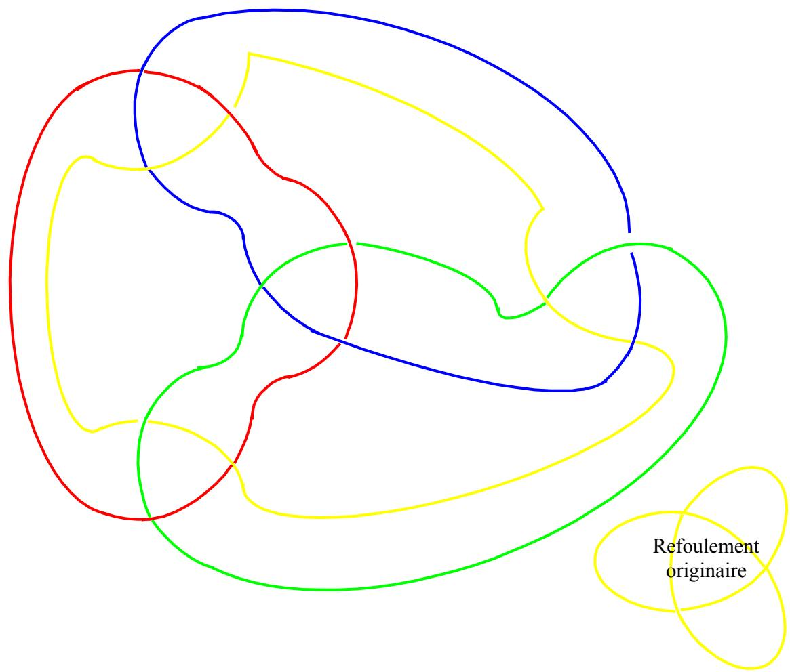

Pour construire le nœud borromÇen de cette faÜon, il a donc bien fallu laisser de cåtÇ, d’une part l’une des Çcritures du tràfle telle que l’impose les lois de la mise á plat, d’autre part, le rond surnumÇraire que nous avons coupÇ en fin d’opÇration. Donc, nous nous retrouvons dans le mÑme cas de figure que la structure intrinsàque du nœud borromÇen comme telle qui laisse hors orientation deux zones.

Cependant, que se passe-t-il si, selon le mÑme principe, je raboute les quatre Çcritures du tràfle sans en laisser une de cåtÇ ? Il se passe ceci :

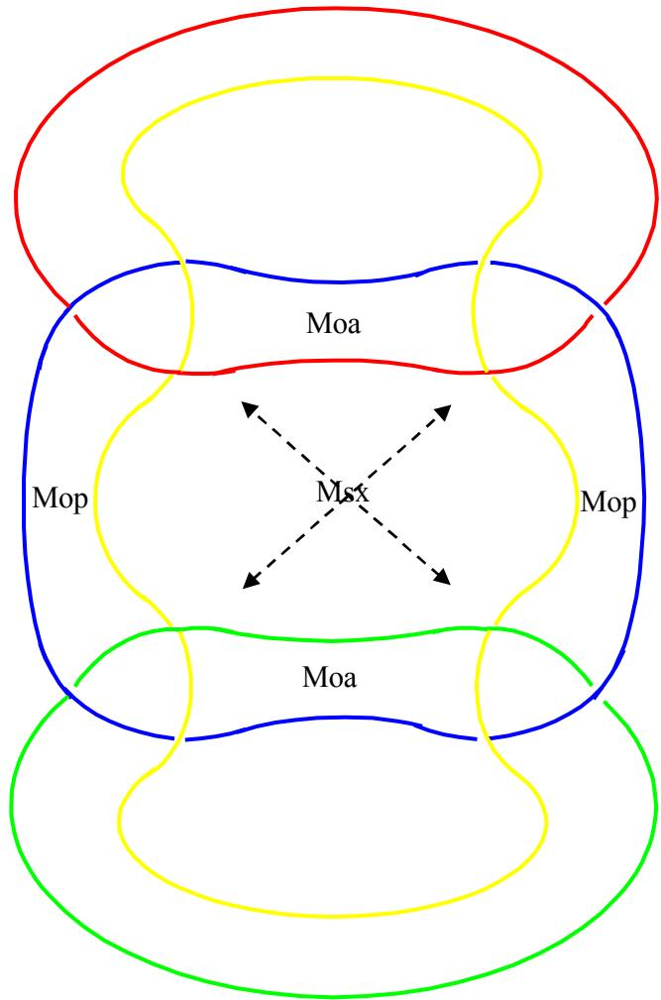

J’ai apposÇ dans les ouvertures qui permettent le raboutage, les rapports de miroir16 dans lesquels se trouvent ces Çcritures les unes par rapport aux autres. Le nœud obtenu ne prÇsente pas l’alternance dessus-dessous d’un nœud borromÇen, ou mÑme d’un tràfle. Vous constaterez en plus que rien n’empÑche qu’on retire le rond jaune central, ce qui provoque le dÇnouage de l’ensemble. La symÇtrie gÇnÇrale de la figure fait que, si on avait provoquÇ un raboutage latÇral, au lieu de en haut et en bas, nous aurions obtenu exactement la mÑme chose :

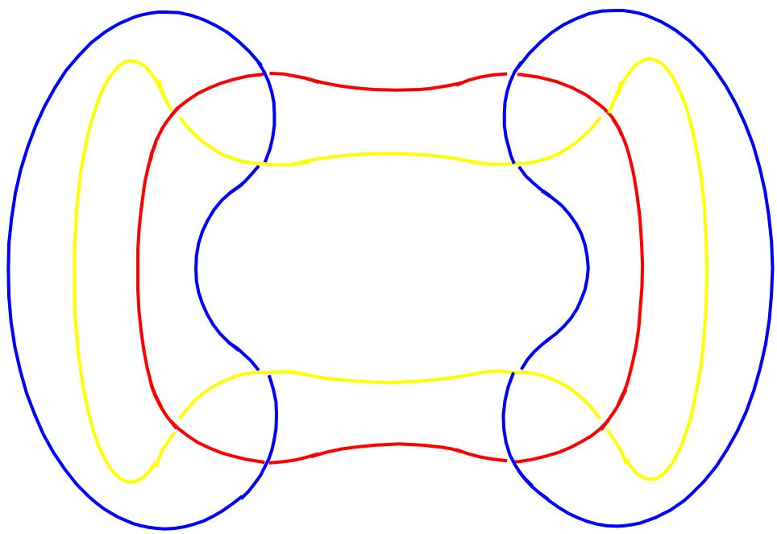

Autrement dit, le tour des points de vue au miroir ne nous permet pas de construire quoi que ce soit. Le rÇsultat est assez analogue á ce que nous prÇsente en premiàre aperception une formation de l’inconscient : des sÇquences apparemment sans rapport les unes avec le autres, des personnages qui se rencontrent alors que nous savons qu’ils ne se sont jamais rencontrÇs, des Ñtres chers vivants alors qu’ils sont morts (l’image du personnage est dÇnouÇe de son attribut : la mort), etc.… rien qui ne nous permette de construire un signifiÇ et une signification. De mÑme un symptåme nous apparaçt totalement incongru, dÇpourvu de contexte. Ce peut Ñtre le symptåme hystÇrique qui pose en un lieu prÇcis du corps une douleur ou un disfonctionnement que la mÇdecine ne parvient pas á intÇgrer á son contexte, ni le sujet au sien propre. Il peut s’agir d’un symptåme obsessionnel dans lequel une pensÇe s’impose dans laquelle le sujet ne se reconnaçt pas. Dans tous ces cas, tout se passe comme s’il n’y avait pas de nouage avec autre chose. Or, le signifiÇ, le sens, ne se construit que du nouage d’un signifiant avec un autre signifiant, d’oä se produit du sujet.

Mais avons-nous vÇritablement fait le tour des points de vue ?

Lorsque j’ai abordÇ les diffÇrents points de vue au miroir, je n’ai envisagÇ que le cas du miroir vertical (Msx). Que se passerait-il si nous avions á faire á un miroir horizontal (Msy) ? Le physicien rÇpondrait : la mÑme chose. La loi du miroir est la mÑme quelle que soit la position du miroir. Sauf que pour le point de vue subjectif d’un humain, Üa change tout. Et, nous l’allons voir, si l’objet considÇrÇ est un nœud, Üa change tout aussi.

Il nous faudrait donc ajouter au montage ci-dessus la relation du tràfle á son image dans un miroir horizontal. Il n’est pas facile de concevoir ce que serait l’image d’un tràfle dans un tel miroir. N’y verrait-on pas seulement l’Çpaisseur de la ficelle, voilant toute la configuration ? D’autant qu’il s’agit d’expÇriences subjectives : il s’agit de trouver une Çcriture de l’expÇrience d’un sujet se contemplant lui-mÑme, ce que fait dÇjá le tràfle d’une certaine faÜon puisque sa ficelle ne fait que se croiser elle-mÑme. ïa, c’est le sujet qui rÇflÇchit : sa pensÇe ne se dÇroule pas dans la confrontation á un autre, elle ne se confronte qu’á elle-mÑme, ce qui se retrouve frÇquemment dans la vie de tous les jours, mÑme si les dits sujets parlent. Au moins, parfois, le dit sujet reÜoit de l’autre son propre message sous une forme inversÇe : grêce au miroir vertical, l’autre lui rÇpond quelque chose dans laquelle il se reconnaçt, mÑme si Üa lui vient de l’autre, car il sait que Üa lui vient d’un autre.

Remarquons que le miroir vertical donne du tràfle une image qui est semblable á celle d’un retournement :

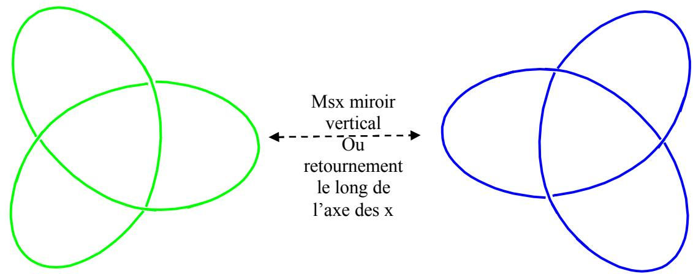

Si le miroir est horizontal, il peut bien s’agir d’un retournement le long de l’axe de y. et lá surprise, le rÇsultat n’est pas du tout le mÑme que ci-dessus : l’image est exactement semblable á l’objet :

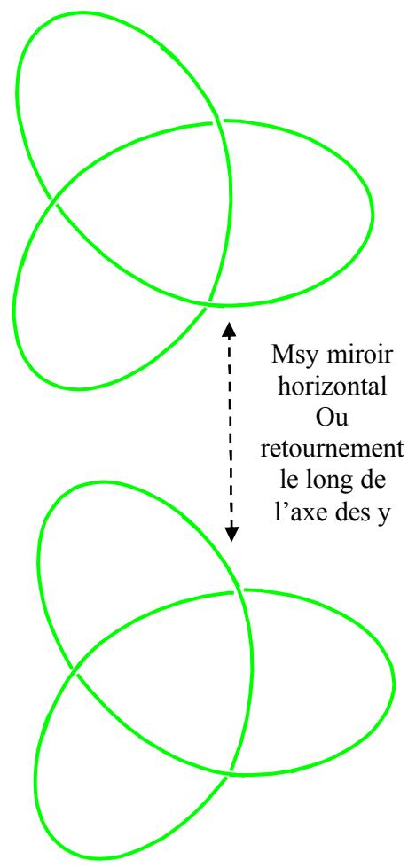

J’avais dÇjá proposÇ cette transformation dans la mise en forme du dÇdoublement dans le rÑve. Je propose d’y retrouver ce qu’on appelle communÇment le symptåme, qui, comme le rÇel, revient toujours á la mÑme place. Le rÑve est une tentative de transformation de cette donnÇe, tentative qui ne parvient pas á faire trou tant qu’on n’a pas mis en rapport au moins 4 points de vue, dans la mesure oä, dans l’ensemble des 4 possibles, au moins un est exclu. On peut en exclure deux (c’est le cas p. 39, oä le nœud borromÇen est construit á partir de seulement deux Çcritures diffÇrentes du tràfle, tournant en sens inverse). Mais l’exclusion d’au moins une est nÇcessaire á la construction du nœud borromÇen. Dans les deux cas ce sont donc bien deux ronds de ficelles qui sont appelÇs á Ñtre refoulÇs hors de cette construction, l’un Ä á l’origine Å, l’autre apràs la construction proprement dite. Cette construction est celle qu’on obtient par l’analyse et qu’on Çlimine par la coupure de la fin de cure. Comme on le voit, Üa n’Çlimine pas l’exclusion d’origine, le refoulement originaire dont nous avons ÇtÇ obligÇ, comme Freud, de faire l’hypothàse. Sauf que nous avons lá une Çcriture topologique qui reflàte exactement la thÇorie analytique, pour des raisons logiques a priori extÇrieures á l’analyse. La question se pose de l’identitÇ de ce thÇoràme mathÇmatique avec la thÇorie et la pratique de l’analyse.

Par contre si on veut absolument utiliser tous les points de vue, alors il est nÇcessaire de rajouter une ligne aux 4 points de vue fondamentaux, une ligne de miroir Ä au lait Å qui ajoute, par rapport á la premiàre ligne, le miroir horizontal Msy qui n’avait pas encore ÇtÇ utilisÇ dans la construction.

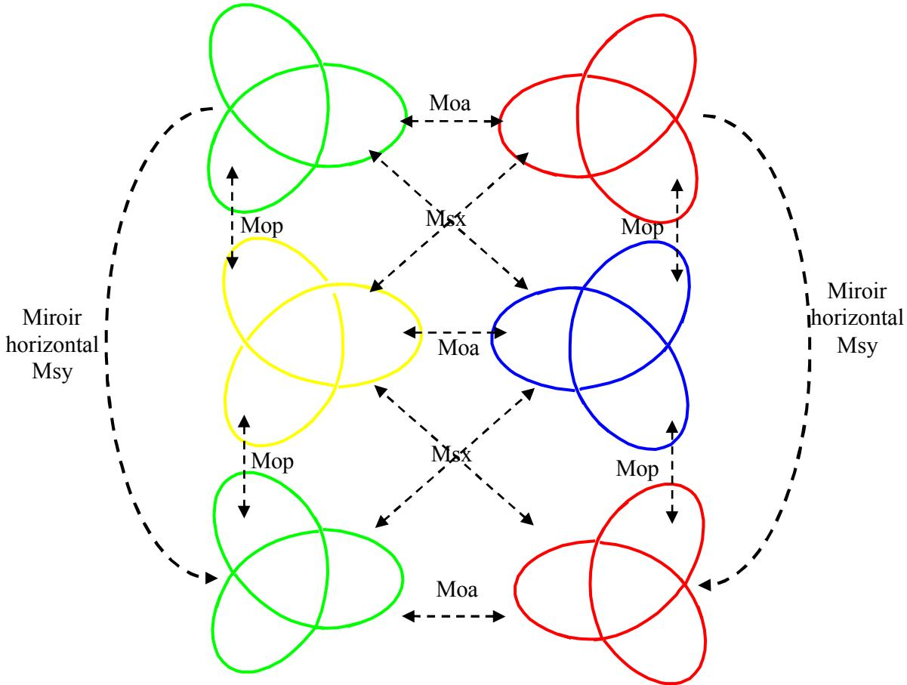

Alors on obtient un nœud borromÇen, mais á 4 ronds, et toujours muni de ce $5 ^ { \mathrm { e m e } }$ rond surnumÇraire qui enlace chacun des autres ronds, et dont il faut se dÇbarrasser par une coupure. Remarquez en effet que ce rond jaune, s’il est borromÇen avec le rouge et le vert (il ne pÇnàtre pas leurs trous respectifs) il est enlacÇ avec chacun des ronds bleus latÇraux (il pÇnàtre dans leurs trous respectifs). Moyennant donc une coupure de ce rond jaune, on obtient ce nœud borromÇen á 4 ronds. Et donc, comme dans le cas prÇcÇdent on se retrouve avec deux ronds en trop. Cependant, si le $5 ^ { \mathrm { { \dot { e } m e } } }$ est á exclure de toute faÜon pour Çliminer l’enlacement, le $4 ^ { \mathrm { { \dot { e } m e } } }$ est nouÇ de faÖon borromÇenne. Sur les 4, aucun rond n’emprunte le trou d’un autre rond.

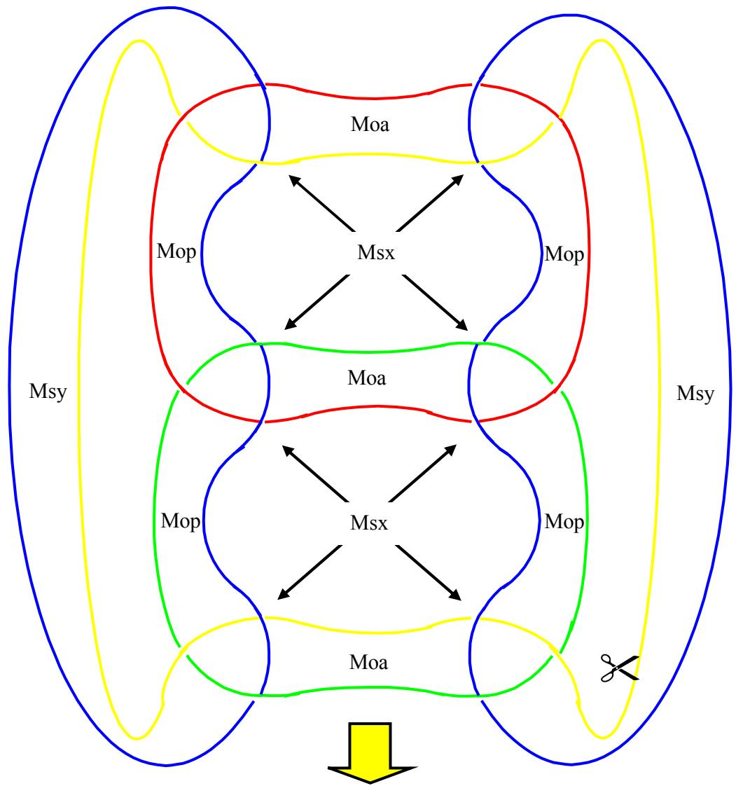

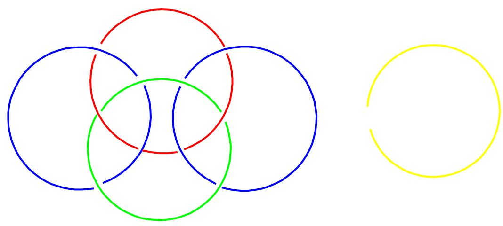

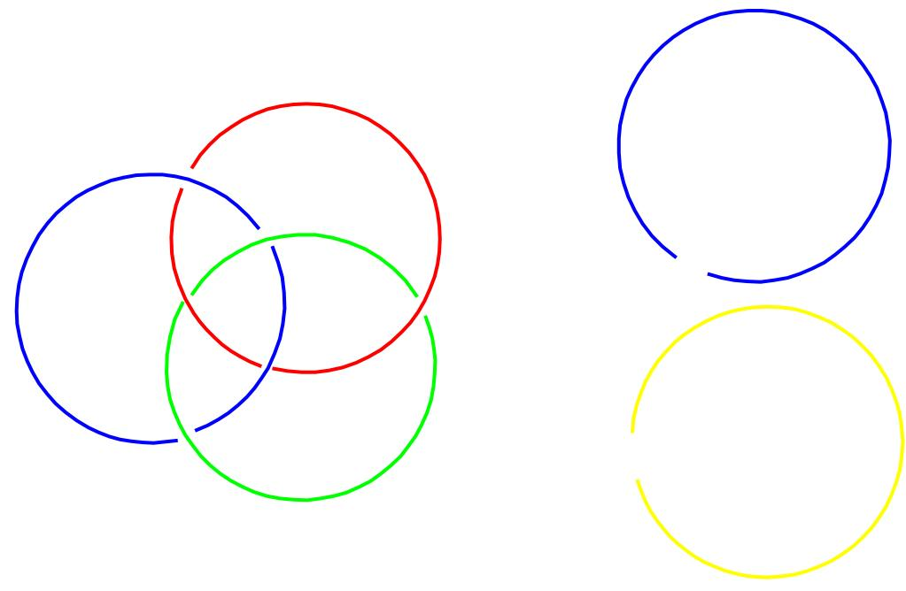

Pour Lacan, la qualitÇ borromÇenne se rÇduisait á cette ràgle : si on coupe un rond, tous sont libres. Or jusqu’á prÇsent, j’ai insistÇ sur cette autre ràgle á laquelle Lacan ne fait jamais allusion (sauf dans sa formule de Ä l’Etourdit Å Ä je mÇtaphoriserai de l’inceste les rapports que la vÇritÇ entretient avec le rÇel Å.) : aucun rond ne pÇnàtre dans le trou des autres (pas d’inceste topologique !). C’est ce qui diffÇrencie aussi le nœud borromÇen des enlacements et des tràfles. Cette ràgle nous donne un critàre de passage á la troisiàme ditmention, c'est-á-dire á une Çcriture de la troisiàme dit-mention, que je considàre comme une Çcriture thÇorique de la parole.

Le nœud obtenu ici prÇsente cette qualitÇ borromÇenne qu’aucun rond ne pÇnàtre dans le trou d’aucun autre. Par contre, l’autre qualitÇ Ä si on en coupe un, tous sont libres Å ne s’obtient que si l‘on coupe l’un des deux ronds centraux, le rouge ou le vert. La coupure des ronds latÇraux ne fait que sÇparer ce rond, mais de l’autre cåtÇ on obtient cette fois un nœud borromÇen á trois ronds des plus classique, prÇsentant les deux qualitÇs sans restriction.

Donc, si, en Çcartant une des Çcritures du tràfle, on obtient avec 4 Çcritures, dont trois sont diffÇrentes, un nœud auquel il suffit d’enlever un rond pour obtenir un nœud borromÇen, ici, sans Çcarter aucune des 6 Çcritures du tràfle, nous obtenons un nœud auquel il faut enlever deux ronds pour obtenir un nœud borromÇen. Dans les deux cas, nous devons Çcarter deux ronds, ce qui semble similaire au fait que de sa structure intrinsàque, l’Çcriture du nœud borromÇen dynamique Çcarte deux zones hors du passage de la coupure (cf. p.40).

Quoiqu’il en soit, si nous nous en tenons á l’Çcriture du nœud telle qu’elle est obtenue du raboutage de six tràfles par la mÇthode indiquÇe, nous avons obtenu le prototype d’un nœud borromÇen gÇnÇralisÇ auquel on peut ajouter ensuite autant de ligne Ä Moa Å qu’on veut, en respectant l’alternance, on obtiendra toujours un nœud borromÇen vÇrifiant la premiàre condition (toujours moyennant le retrait du rond jaune) : aucun rond ne pÇnàtre dans le trou d’aucun autre, ce qui Çcrit la troisiàme dit-mention. Nous avons une Çcriture gÇnÇralisÇe de la parole, telle qu’elle poursuit son avancÇe mÇtonymique dans un rapport constant avec la mÇtaphore, le dernier lien permettant toujours le raccord au premier (ce sont les deux ronds bleus latÇraux). En quelque sorte, c’est une autre Çcriture du graphe de Lacan, tel qu’il le prÇsente dans Ä subversion du sujet et dialectique du dÇsir Å. Tel que je l’ai prÇsentÇ ci-dessus, cette avancÇe mÇtonymique construite d’une succession de Ä briques Å reproduisant le premier carrÇ des 4 tràfles fondamentaux, cette avancÇe s’Çcrit dans la verticalitÇ. Il suffirait de la basculer d’un quart de tour pour voir s’Çcrire les lettres á la mode de chez nous c'est-á-dire de gauche á droite. Alors on peut ajouter autant de ligne Ä Mop Å qu’on veut, au lieu des lignes Ä Moa Å de l’Çcriture verticale. Le passage de Ä Mop Å á Ä Moa Å, c'est-á-dire d’un miroir objectif á l’autre, n’est autre chose que le passage de la mÇtaphore á la mÇtonymie tel que j’ai pu l’Çcrire dÇjá par le biais de la bande de Mœbius. Le miroir subjectif Msx opàre une articulation de l’un par l’autre, c'est-á-dire l’usage de la parole tel qu’il produit du subjectif. L’acte de parler en effet produit le sujet : dans sa parole, en tant qu’elle a ÇtÇ entendue et validÇe par un autre, le sujet, comme dans un miroir, se reconnaçt. Cette rÇponse de l’autre

Tout cela n’est qu’une question de convention. En Çcrivant mon nœud borromÇen gÇnÇralisÇ ainsi Çcrit á l’horizontale, on n’aurait plus de peine á y reconnaçtre le deux lignes du graphe lacanien, ou encore les deux espaces de Saussure, celui du signifiant en bas, celui du signifiÇ en haut. Mais dans mon Çcriture plutåt conforme á celle de Lacan, il n’y a que du signifiant : nous avons laissÇ tombÇ le signifiÇ, c'est-á-dire la surface, en ouvrant les tràfles et en les mettant en rapport les uns avec les autres, ce qui reprÇsente le passage de l’inconscient au conscient, ou encore, la traversÇe du fantasme par le biais de l’usage de la parole, ou encore par le recours á un autre auquel on s’adresse et qui rÇpond.

Cette rÇponse qui valide mon propos, elle s’Çcrit dans le miroir horizontal, occurrence qu’on ne trouve vÇritablement que dans la pratique de l’analyse. Ce qui n’est habituellement pas entendu, ici, l’est : c’est l’ajout d’un miroir Msy en ligne supplÇmentaire qui renvoie toujours á l’initiale du propos :

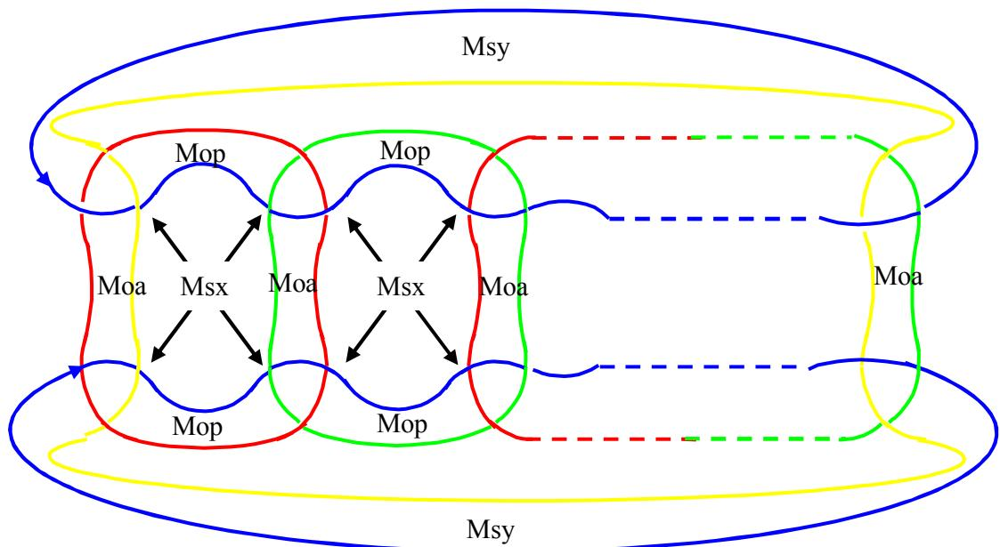  
Cette ligne bleue qui assure le caractàre borromÇen de l’ensemble peut se lire : je vous ai entendu(e). Je peux Ñtre d’accord ou non avec le contenu de votre propos, mais il est un fait indÇniable c’est que vous l’avez dit. Ainsi le discours courant, celui de la vie quotidienne estil construit á partir de l’apparence des deux miroirs objectifs. On y confond allÇgrement vÇritÇ et rÇalitÇ, au non du critàre gÇnÇral de l’objectivitÇ. ïa n’empÑche pas que Üa construit un sujet par l’articulation Msx (miroir subjectif), un sujet par toujours conscient de ce qu’il dit. Ce peut Ñtre le sujet du fantasme, en tant qu’il reste inconscient. Ainsi je peux dire Ä il pleut Å alors qu’il fait beau. L’interlocuteur de la vie quotidienne me rÇpliquera que je me trompe, au nom de l’objectivitÇ : il me renvoie une image par l’un des miroirs objectifs. Il me soutiendra

que je ne dis pas la vÇritÇ, au sens d’une confusion de celle-ci avec la rÇalitÇ. Quelque part, Üa valide quand mÑme mon discours, et donc Üa noue un nœud quelconque, car Üa montre nÇanmoins que j’ai entendu : il y a une rÇponse, fãt-elle contradictoire. La structure de la rÇponse de l’analyste validera le sujet un poil plus loin, en lui tendant un miroir subjectif Msy, celui de la verticalitÇ de la parole, en tant que, qu’elle soit profÇrÇe á l’horizontale (sur le divan) ou á la verticale (dans les Çchanges quotidiens), elle reprÇsente toujours la troisiàme dit-mention : quoique vous ayez dit, il est vrai que vous l’avez dit. Cette dit-mention est celle du trou, s’opposant á la surface. C’est le dÇcentrement structural de la position de l’analyste par rapport á l’interlocuteur quotidien. A la maniàre du miroir Msy, cette rÇponse ne modifie pas le propos initial, elle se contente de le retourner (le long de l’axe des y) comme tel, sans changement, contrairement aux autres miroirs qui inversent tous deux dimensions sur trois, permettant d’introduire dans la rÇponse la modulation particuliÜre de l’autre. Cette rÇponse mettra l’accent sur l’aspect mÇtaphorique du discours (le long de l’axe y de Jakobson), non par une interprÇtation sur le contenu mais par une attention attirÇe sur la richesse de l’Çnonciation, c'est-Ñ-dire le trÇsor des signifiants.

Par cette validation, je pourrai pousser un peu plus loin ma rÇponse Ñ la rÇponse de l’analyste. J’ai alors la possibilitÇ de faire un retour mÇtonymique sur la mÇtaphore latente que j’avais ainsi profÇrÇe sans m’en rendre compte. Je pourrais par exemple me rendre compte de ce qui m’a poussÇ Ñ contredire une mÇtÇo manifeste par un bulletin latent qui reprendrait l’antienne du chanteur de blues : â sun is shinning… but it’s raining in my heart Å. Par oä se dÇvoilera la diffÇrence entre la vÇritÇ et l’objectivitÇ.

Dans cette gÇnÇralisation, la coupure d’un rond central rouge ou vert ne libàre pas l’ensemble. Toute coupure qui laisse intacte d’un cåtÇ ou d’un autre la structure minimale á quatre ronds (ou un de ses multiples) ne retire que le rond coupÇ. Nous sommes en prÇsence d’une structure extrÑmement solide qui reprÇsente bien la structure du langage tel qu’il se parle dans la nÇvrose commune.

On peut y lire, si on veut, un dÇpliement de la structure du tore avec les tours de la demande, reprÇsentÇs par les cercles centraux, tournant autour des objets du monde, dont on voudrait bien qu’ils soient ceux du fantasme, contribuant á asseoir le moi, mais fondamentalement insatisfaisants, et le tour supplÇmentaire du dÇsir qui se lit dans les ronds bleus.

Je rappelle ici que, debout sur un miroir horizontal (Msy), on ne voit pas son image. C’est une jolie mÇtaphore de l’inconscient.

On peut aussi y lire une autre Çcriture du graphe :

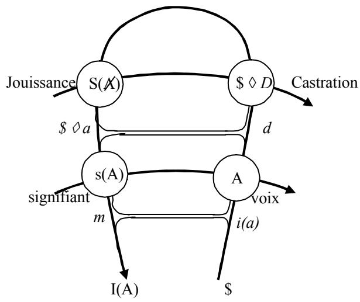

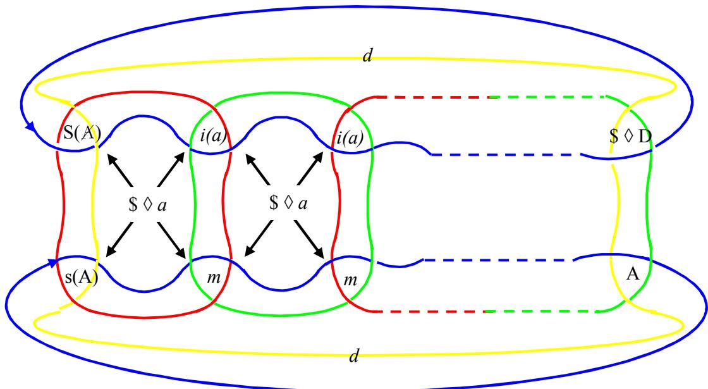  
Jouissance castration $\mathrm { s } ^ { \prime } \mathrm { y }$ lit : la structure munie de son rond jaune la structure amputÇe de son rond jaune. Alors la deuxiàme ligne du graphe, signifiant voix se lit dans l’opposition entre les traits (qui reprÇsentent tous des signifiants) et le vide laissÇ entre ces traits par la coupure du rond jaune. D’un autre cåtÇ, il faut lire aussi chaque double trait comme les deux flàches horizontales du graphe lacanien, mÑme celles qui ici sont verticales. $\mathrm { C } '$ est pourquoi la rÇpartition des 4 points principaux du graphe peut aussi se lire dans une rotation de $9 0 ^ { \circ }$ de la structure. Il ne faut donc pas voir la place de A, \$ ◊ D, S(A), s(A) comme fixÇe dans les localitÇs indiquÇes ci-dessus. $\mathrm { C } '$ est une bonne occasion de sortir de l’impression imaginaire que produit toute lecture de graphe, pour ne plus le prendre que comme l’une des possibilitÇs d’Çcriture du concept.

De plus, ce n’est qu’une possibilitÇ d’interprÇtation du graphe. Je laisse á chacun la possibilitÇ d’y exercer sa sagacitÇ…

## Revenons Ñ prÅsent Ñ la scÇne de la pratique analytique.

Je repose ma question fondamentale : qu'est-ce qui a produit l’Afrique de mon rÑve ? Sachant que je n’ai su qu’apràs coup qu’il s’agissait de l’Afrique de JosÇphine. Et je reviens á ma rÇponse premiàre, celle qui m’a permis de donner la premiàre interprÇtation de mon rÑve : le signifiant Ä jumelles Å, car c’est bien en le prononÜant que je me suis rendu compte que Üa n’avait rapport qu’aux jumelles dont JosÇphine m’avait parlÇ peu auparavant.

Il est intÇressant de noter d’abord ceci : en tant que reprÇsentation de mot, Ä jumelles Å, c’est un seul mot. Et pourtant, il traduisait, dans la bouche de JosÇphine, une image double, c'est-á-dire deux reprÇsentations de choses… á moins de considÇrer la vue de deux femmes semblables cåte á cåte comme une seule reprÇsentation de chose. Toujours est-il que cette opposition entre une unitÇ d’un cåtÇ (le signifiant), donnant l’illusion d’une dualitÇ et de l’autre, une dualitÇ s’interprÇtant spontanÇment comme une unitÇ, cette opposition se laisse volontiers lire comme celle du bord et de la surface, de l’une dimension aux deux dimensions. C’est le genre de choses apparemment sans grande portÇe qu’il faut cependant avoir prÇsente á l’esprit lors de la thÇorisation.

Ä Jumelles Å comme signifiant sera reprÇsentÇ par un bord unique dÇlimitant une surface ayant forcÇment deux dimensions, et accueillant l’image de deux personnes, dont on pourra dire que l’une est sur une face, l’autre, sur l’autre face. Mais on pourrait aussi bien dire que Ä jumelles Å est un bord dÇlimitant une seule surface : l’image des deux jumelles. Les deux sont vrais, et c’est d’ailleurs pour cela que mon rÑve dÇroule en plusieurs sÇquences, comme pour dÇvelopper dans le temps ces deux possibilitÇs. En effet dans la premiàre sÇquence, il y a clairement deux faces, puisque je discute avec mon Ä chef Å le bÇdouin. Lui et moi, nous nous distinguons clairement quant á notre opinion sur le rapport litigieux, mÑme si dans un deuxiàme temps je me rends á ses raisons. Dans la seconde sÇquence au contraire, les deux jumelles sont lá en mÑme temps, font la mÑme chose, prÇsentent le mÑme attribut frontal bizarre. Visiblement, ce n’est que le dÇveloppement imagÇ de l’entendu Ä jumelles Å. C’est d’ailleurs ce qui m’a fait interprÇter mon rÑve dans le sens de mon transfert á JosÇphine, et, par voie de consÇquence, qui m’a fait comprendre que les deux personnages sÇparÇs, l’agent secret moi-mÑme et le bÇdouin, pouvaient bien Ñtre qu’une seule et mÑme personne, moi dialoguant avec mon surmoi. Enfin la derniàre sÇquence participe des deux options : je suis aussi en dialogue avec mon surmoi, mais celui-ci n’apparaçt pas sÇparÇ. La responsabilitÇ ou l’irresponsabilitÇ dans l’ÇpidÇmie de Sida incombe á la mÑme personne. Cependant ce n’est pas moi qui en dÇcide, mais l’objectivitÇ biologique et l’erreur commise par d’autres dans sa recherche. La coupure a changÇ de lieu, mais elle semble ne pas choisir entre l’option de la premiàre et celle de la deuxiàme sÇquence : les attributs sont á la fois bien sÇparÇs et portant sur la mÑme personne. En somme il y a deux faces, mais c’est la mÑme.

Mon rÑve dÇveloppe donc trois options quant á la mise en images du signifiant Ä jumelles Å, dont on voit qu’il est finalement le porteur d’une problÇmatique non explicitement ÇnoncÇe : celle de la coupure. Sans Ñtre ÇnoncÇe, elle s’affiche clairement dans la deuxiàme sÇquence, aux cåtÇs de l’option Ä non coupure Å (les jumelles á antennes), ceci expliquant vraisemblablement cela. Au fond, le signifiant Ä jumelles Å, ce n’est pas autre chose que la bande de Mœbius : á partir de ce signifiant, on peut dÇvelopper au moins trois points de vue, á une ou deux dimensions.

Bref, apràs ces rappels un peu fastidieux, je fais remarquer que le dÇbut de ce que j’ai prÇsentÇ de l’Çcriture nodale n’Çcrivait qu’une reconstitution du travail du rÑve. Il s’agit á prÇsent de trouver une Çcriture du travail de l’interprÇtation. J’en ai ÇvoquÇ une initiale par l’Çcriture de la coupure qui, changeant de sens et de lieu, se recoupe, en correspondance avec ma thÇorie du nœud borromÇen á trois. Voyons á prÇsent ce que Üa donne avec le nœud borromÇen gÇnÇralisÇ.

Le travail du rÑve, je l’ai prÇsentÇ comme une ouverture des tràfles qui, en se mettant en rapport les uns avec les autres, tentaient de crÇer du trou. Nous avons l’Çchec auquel Üa pouvait aboutir, dans le cas d’oubli du $4 ^ { \mathrm { { \dot { e } m e } } }$ point de vue, celui du miroir horizontal. Le nœud borromÇen gÇnÇralisÇ crÇe donc du trou. En fait, c’est ainsi que je pourrais prÇsenter toute cette histoire car, en deÜá des multiples reconstitutions hypothÇtiques des rÑves, il faut bien se rendre compte que tout cela n’est que rÇcit, et rÇcit de rÇcit, c'est-á-dire, du signifiant. Autrement dit, nous n’avons que faire de la surface. Nous pouvons nous contenter des bords et de leur traduction en termes de ficelles, c'est-á-dire en dÇfinitive, de traits qui font coupure. Ils font coupure mais cette coupure qui ne cesse de se recouper engendre du nœud, c'est-á-dire une surface due aux croisements.

Mais de cette surface, nous ne savons rien, bien qu’elle soit nÇcessairement engendrÇe par les croisements des coupures, c'est-á-dire par le nœud. Je propose de considÇrer que la parole a ouvert les diffÇrents tràfles des rÑves pour Çtablir des liens entre eux, á conditions de faire le tour de tous les points de vue, c'est-á-dire á partir d’un minimum de trois lignes de deux tràfles. Le nœud borromÇen gÇnÇralisÇ qui s’en construit Çcrit le rÇcit du rÑve de JosÇphine non tel qu’elle l’a ÇnoncÇ (c’est impossible) mais tel que je l’ai entendu á mon propre insu… ce dont je ne suis averti que par mon propre rÑve, qui n’est lui-mÑme connu que par le rÇcit que j’en fais, qui est dÇjá une interprÇtation. S’ensuit un deuxiàme tour d’interprÇtation par JosÇphine qui me fourni l’interprÇtation (insue par elle) de mon rÑve. Ce en quoi il est impossible de penser tous ces ÇlÇments comme s’ils Çtaient sÇparÇs. Il est clair que tout cela se noue en un seul nœud, auquel je peux ajouter, si je veux, les interprÇtations qui me sont venues á la suite de celles de JosÇphine. Je pourrais y ajouter aussi les rÑves suivants qui nous ont nouÇs de semblable faÜon, leurs interprÇtations etc.… bref il y a un moment oä il faut choisir et trancher.

Un fois la structure Çtablie dans son registre mathÇmatique, il faut choisir comment nommer chaque brin, en fonction de la faÜon dont il s’articule avec ses voisins et finalement, tous les autres. L’Çnorme travail prÇparatoire que j’ai exposÇ á partir de bande de Mœbius va y servir, en tenant la bande de Mœbius homogàne pour une Çcriture du tràfle. Mais la complexitÇ de l’affaire, malgrÇ la prÇcision de la structure topologique, ne permet pas d’Çviter un saut par lequel il faut s’autoriser quelque arbitraire.

On y lira les diffÇrentes mÇtaphores, y incluses les interprÇtations, sur toutes les lignes parallàles, qu’elles soient horizontales ou verticales ; on y lira aussi comment ces mÇtaphores se dÇvoilent dans une succession mÇtonymique, le long des fils coupures se refermant sur euxmÑmes afin de produire des signifiÇs qui ne sont pas inscrits ici. Seuls comptent les signifiants.

On y lira comment le signifiant Ä grises et frisÇes Å s’inscrit au niveau du rond jaune qui va circuler jusqu’á l’analyste, de concert avec le rond bleu portant le signifiant Ä jumelles Å (toutes ces localisations se discutent): c’est ce qui va provoquer mon rÑve. Ä Jumelles Å Çtait l’Çvidence qui m’avait permis d’interprÇter mon rÑve, c’est pourquoi j’ai choisi le rond bleu plutåt que le rond jaune. Sur ce dernier, j’ai placÇ l’attribut Ä grises et frisÇes Å du fait de sa transformation en Ä cafÇ au lait Å : il a fallu beaucoup de travail pour parvenir á ce dÇchiffrement. La cause du dÇsir qui est toujours inconsciente, l’objet a, supporte plus volontiers cette nomination qui tombera au bout de l’interprÇtation : elle n’a plus de nÇcessitÇ.

J’ai placÇ deux traits bleus pointillÇs qui sÇparent les rÇcits de rÅve de leurs interprÇtations. Dans cette disposition, ce sont les interprÇtations qui ont permis de transformer les lettres des rÅves en signifiants sur l’ensemble la structure. En vocabulaire topologique, ce sont les ouvertures pratiquÇes dans les trÜfles et leurs mises en continuitÇ, d’un trÜfle Ñ l’autre, de faÖon mÇtaphorique et mÇtonymique, crÇant un nœud borromÇen. Autrement dit, il s’agit du passage de l’homogÜne Ñ l’hÇtÇrogÜne.

Bien entendu, ces interprÇtations sont venues dans le discours de JosÇphine de maniÜre tout Ñ fait spontanÇes. On pourrait donc dire qu’elles sont apparues d’emblÇe sous forme de signifiant. Je reconstitue nÇanmoins leur positionnement en tràfle pour qu’on puisse saisir le passage du tràfle au nœud borromÇen dans son ensemble. Que ces formules aient ÇtÇ lá prÇsentes, comme interprÇtations latentes, ou qu’elles aient ÇtÇ crÇes au moment mÑme de l’Çnonciation n’a que peu d’importance. Seul compte le rÇsultat d’ouverture et de liaison que cette Çnonciation a permise.

La mise en forme topologique amàne parfois des rÇsultats surprenants. C’est bien lá son intÇrÑt. Ainsi voit-on se dessiner, par les mise en continuitÇ, un rond rouge qui dÇcline le dÇsir de JosÇphine, tandis qu’un autre rond rouge en fait le pendant, rendant compte du dÇsir de l’analyste, se manifestant sous le forme du dÇsert d’Afrique. Un rond vert, cåtÇ JosÇphine, se ferme sur la signification du phallus, mettant en continuitÇ les signifiants qui en ont progressivement dÇvoilÇs le signifiÇ. Un autre rond vert, cåtÇ analyste, dÇcline de mÑme son dÇsir mêtinÇ de rÇsistances quant á ce dÇsir doublement dÇclinÇ á la faÜon de JosÇphine ellemÑme : á son dÇsir d’avoir l’analyste comme objet de son dÇsir, rÇpond l’hÇsitation á signer le rapport, l’erreur d’analyse quant á la responsabilitÇ. A son dÇsir d’avoir son corps pour phallus rÇpond la problÇmatique de la castration sous la forme du clivage entre une femme qui coupe (et donc serait coupÇe : en coupant, elle prÇsentifie la castration, le fait qu’une femme est toujours coupÇe) et des jumelles arborant manifestement leur dÇni de castration.

Plus tard, c’est le retour du signifiant Ä jumelles Å qui va provoquer l’interprÇtation dÇcisive : Ä boules afro Å devenant aussitåt Ä testicules Å et Ä phallus Å par accolement mÇtonymique avec le corps de l’analyste. Voilá donc l’esquisse du rond vert, via le rond rouge du dÇsir de JosÇphine, qui va aller se nouer avec celui de la rÇsistance de l’analyste. Ce dernier, l’ayant entendu inconsciemment, rÇsiste autant á se trouver l’appendice d’une femme (Ñtre le phallus) qu’á Ñtre l’objet de son investissement libidinal (l’avoir pour elle).

Le rond bleu du dessus, vÇhicule du signifiant Ä jumelles Å sera dÇclinÇ selon les diverses modalitÇs du surmoi : moqueries, menaces sur la sexualitÇ (Sida), mais aussi corps interdit á dÇsirer (l’analyste). Il vÇhicule ainsi le signifiant de la coupure comme telle : celle entre une jumelle et l’autre, qui n’est que voile sur la coupure fondamentale de la castration, entraçnant le clivage du sujet. Parce qu’il y a de la menace, il y a protection, refoulement et donc coupure du sujet en deux entre la moitiÇ qui dÇsire et celle qui condamne. Le rond bleu du dessous, mÇtaphore Ä cafÇ au lait Å de l’initiale Ä grises et frisÇes Å transformÇe inconsciemment en Ä noir et blanc Å reprÇsente au contraire ce qui serait un unitÇ mythique du sujet : plus de coupure entre le noir et le blanc, plus de clivage, plus de castration. Ainsi ce rond dÇcline-t-il les diverses acceptions du phallus, sous forme de pain de viande, de corps de l’analyste qui Ä est Å le phallus, non sans inclure au passage un Ä je n’en veux rien savoir Å qu’il n’est jamais possible d’Çliminer complàtement.

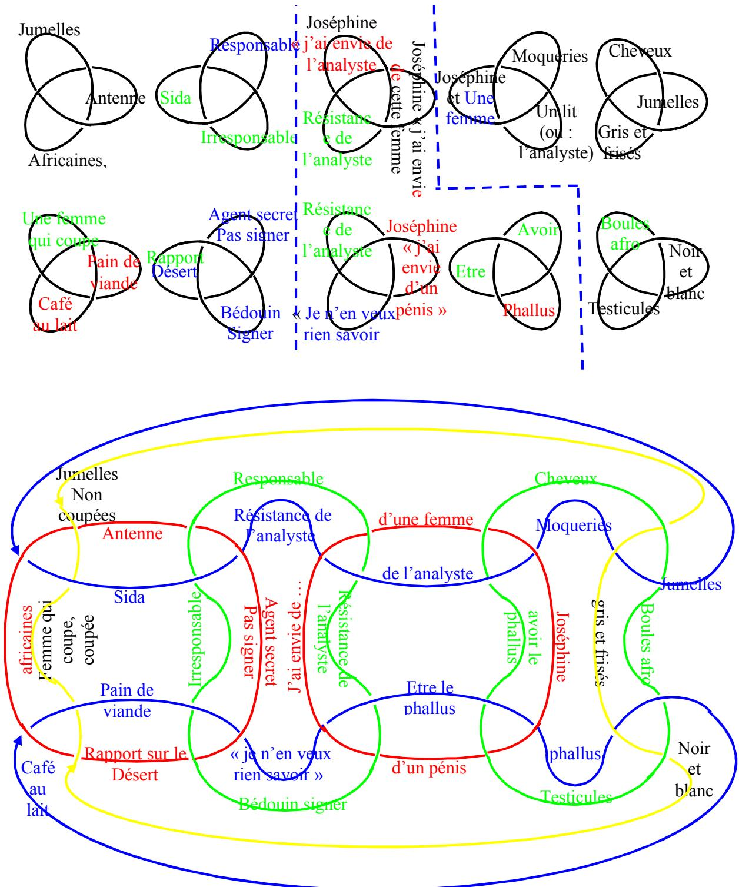

J’ai donc soumis ce texte á JosÇphine. C’est la moindre des choses. Je rÇpàte qu’il ne s’agit pas d’elle puisque ce n’est que ce que j’en ai entendu, tel que mon inconscient l’a transformÇ. Et pourtant il s’agit de ma relation transfÇrentielle á elle. Elle y est donc quand mÑme, quelque peu, malgrÇ elle, et malgrÇ moi. Je ne saurais nÇanmoins publier sans la permission qu’elle m’a accordÇe sans problàme. Je passe pour l’instant sous silence les effets que ce texte a pu avoir dans le cure. Sans doute devrais-je en faire un texte ultÇrieurement.

Je le soumets á prÇsent á votre apprÇciation, lecteur, dans l’espoir que ceci ne reste pas lettre morte dans le domaine public, c'est-á-dire que j’en ai quelque retour.

Paris, dimanche 11 septembre 2005 (aprÜs un an et demi de travail sur ce texte)