Marie Laure, merci pour ce travail de compilation de diverses représentations de la bande de Moebius.

J’ai l’impression que tu as l’impression que je milite pour un seul type de représentation. Que nenni. Le problème n’est pas celui des modalités de représentation, ou d’écritures, celles-ci sont infinies au point que je dis et que je démontre : un tableau est une bande de Moebius. Un rêve aussi de même un symptôme. Ça fait beaucoup de diversité. Le problème est celui de la structure ; quel est le meilleur moyen, le plus simple et le plus complet, d’écrire la structure ? L’enjeu n’est donc pas seulement esthétique (au sens de l’esthétique de Kant, pas le sens du beau).

C’est très bien ta compil, ça va me permettre un commentaire point par point de chacune des écritures que tu proposes. Cependant ma question portait sur les propriétés… il me semble que tu n’en as pas beaucoup dégagées, de ces écritures. Et surtout tu n’en a indiqué aucune quant au rapport à la psychanalyse ; or c’est ça qui m’intéresse : en quoi la topologie nous propose-t-elle une écriture pour la psychanalyse ? paske la topo pour la topo, perso ça m’intéresse pas. Mais au-delà, je crois que l’exigence de trouver une écriture mathématique pour la psychanalyse est extraordinairement stimulante et donne une orientation à la recherche comme je vais tenter de le montrer.

## MLC : Quelques différentes représentations de la bande de Möbius

## et leurs propriétés

A la René Lew :

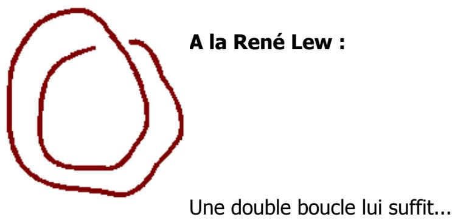  
Une double boucle lui suffit...

==> Il représente la bande de Möbius uniquement par son bord (plus proche du nœud que d'une surface), qui peut se lire comme un 8 intérieur. La propriété mise en avant est la mise en continuité globale, alors que localement apparaît un écart entre 2 brins.

RA il n’y a pas d’écart entre deux brins. C’est bien un seul et même brin, qu’on peut tracer en une seule fois, sans lever le crayon. Localement apparaît un écart entre deux parties de ce brin. D’accord pour la continuité. Cependant mon écriture permet de lire aussi la continuité :

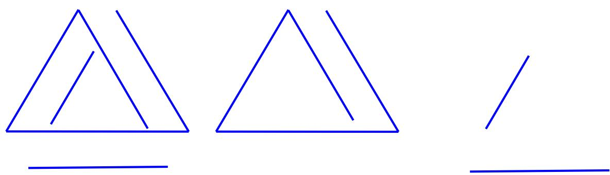

Lorsqu’on lit le bord (et je me suis souvent servi dans mes écrit de cette écriture de bord) on peut lire cette double propriété de la bande de Moebius : la continuité du bord, globale, telle que dans l’écriture du milieu, ci-dessus, qui n’est que l’isolation d’un morceau de mon écriture globale. Elle est équivalente au huit intérieur. On y lit aussi la discontinuité locale, dans l’écriture de droite. Les deux sont réunies dans l’écriture globale, à gauche.

Intérêt pour la psychanalyse : ceci écrit la continuité du signifiant : un signifiant représente un sujet pour un autre signifiant, les signifiants s’enchaînent donc les uns derrière les autres, et construisent ainsi la continuité syntagmatique du discours ; mais celle-ci ne pourrait fabriquer du sens sans la discontinuité paradigmatique écrite par les deux traits discontinus à droite. Dans cette écriture on peut lire le sujet dans le trait continu (représente un sujet), les signifiants dans les deux traits discontinus (un signifiant…. Pour un autre signifiant). La seule continuité du huit intérieur est donc un peu pauvre par rapport à cette représentation.

D’un autre côté et malgré René Lew, l’écriture en huit intérieur présente néanmoins une propriété remarquable qu’il n’a jamais énoncée, je crois : en s’en tenant à la réalité de ce que cette écriture développe, comme fonction, elle opère quoi ? De son trait continu, elle divise la surface en trois zones :

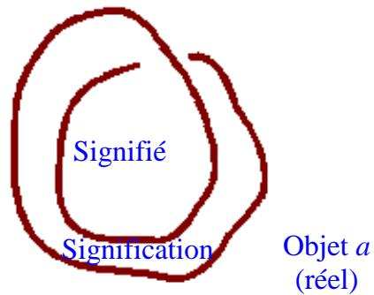

C’est indubitable. Ce trait comme coupure divise la feuille en trois, mettant en lumière les effets de la continuité signifiante lorsqu’elle se recoupe comme c’est le cas ici. Le dire fait un premier tour, ce qui délimite un signifié, ce qu’on comprend dans le discours courant. Un second tour, d’interprétation permet de mettre à jour ce qu’il y avait en dessous, comme signification. S1  S2. Il s’en produit un reste, a, qui engendre de la pulsion relançant le

processus signifiant : la surface restant autour qui n’étant pas coupée, restant infinie, appelle la coupure de ses vœux ( de son désir).

Cette structure à trois, que ne laissait pas soupçonner la présentation habituelle de cette écriture, c’est la structure qui en jeu, une structure à trois qui est plus évidente dans l’écriture que je propose, immédiatement lisible ne plus de ce qu’on a pu lire du bord :

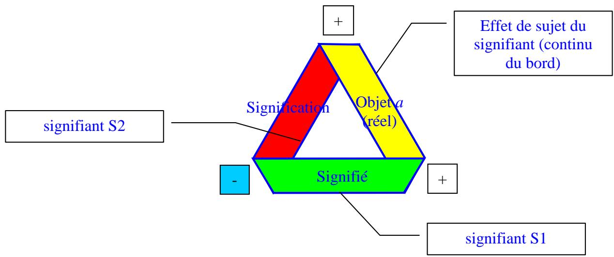

MLC : ==> Problème d'écriture, problème de lecture du trait : il apparaît à un endroit comme discontinu, coupé, cet endroit coupé n'est pas à lire comme coupé mais comme une continuité du « trait passant dessous celui qui est au dessus ».

RA pourtant cette discontinuité, si on veut bien la lire, a toute son importance : c’est le discontinu du signifiant, qui s’oppose à son aspect continu. Aussi bien : le forclusif du conscient tel qu’il s’oppose au discordantiel de l’inconscient.

Mon écriture est à lire dans la réalité de ce qu’elle écrit, évidemment pas dans ce qu’on infère de l’objet bande de Moebius. Mais lorsqu’on veut le lire en référence à l’objet bande de Moebius mis à plat, l’écriture est exacte aussi : effet d’écriture de l’objet pour le sujet qui le lit.

## MLC : A la manière dessin standard

RA : Ce dessin n’est pas autre chose que le huit intérieur muni d’un trait supplémentaire (le trait pointillé est subsidiaire, on peut parfaitement s’en passer)

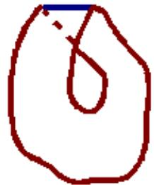

(je confirme que le trait rouge irrégulier est non standard, simplement issu de ma maladresse à faire un dessin à la souris)

RA : Marie Laure, dans Word, on trouve cet outil : l’arc de cercle qui se présente sous l’icône :

…qui permet de faire de jolies choses comme ça :

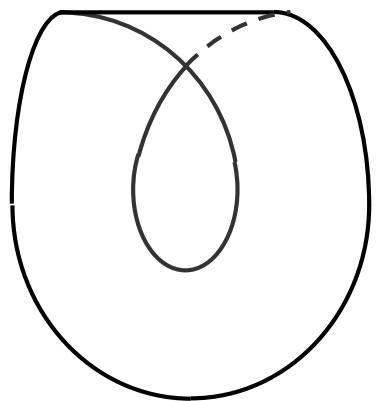

==> j'ai distingué en bleu un trait qui n'est pas à lire de la même manière que le trait rouge : celui-ci n'est pas un bord mais un trait artefact, qui ne consiste pas comme bord mais fait consister l'endroit de la pliure. Une astuce d'écriture, souvent l'on rajoute quelque chose pour faire consister quelque chose qui ne serait pas là.

RA ce n’est pas un artéfact le moins du monde : c’est un effet de mise à plat. Ou alors on considère que la mise à plat est un artéfact ; pourquoi pas, puisque toute considération d’un objet est un artéfact, un effet de l’art. C’est le problème de ce genre d’écriture : on est obligé d’ajouter un commentaire, genre : attention, voilà ce qui est à lire, voilà ce qui n’est pas à lire. Mais ici je ne vois pas la logique : ou on est dans la logique du huit intérieur c'est-à-dire de l’écriture continue, et on n’écrit aucun pli, ou on procède à une mise à plat et alors celle-ci fait apparaître trois torsions ; ici tout se passe comme si on avait fait une mise à plat dans un coin et pas dans les deux autres. C’est donc source d’erreur pour le lecteur, auquel il est donné à voir un point de vue bâtard qui est, d’un côté une vue soi-disant « dans l’espace » avec une « continuité » du côté de la courbure, d’un autre côté un point de vue dans le plan du côté du pli rendu visible.

Si on se situe sur le pan fonctionnel et non esthétique avec la définition que je propose : une torsion est ce qui fait passer d’une face à l’autre, ce trait est donc une écriture parfaitement légitime : il écrit la torsion comme telle ; c’est au niveau de ce trait qu’on passe d’une face à l’autre.

Et l’autre trait, celui qui fait le double bord courbe de cette écriture ? eh bien lui aussi il fait passer d’une face à l’autre, d’une zone découpée par le dessin à une autre zone ; il fait passer de la surface au trou. Et, si on imagine l’autre face de la bande, localement il fait passer aussi sur l’autre face.

Par conséquent le trait dit « artéfact » n’est pas autre chose qu’une autre forme que prend le double trait de bord de la bande de Moebius, une écriture de la fonction . À lire donc à la fois de la même manière (c’est la même fonction qui est représentée) et d’une manière différente car il s’agit d’une autre modalité de l’écriture de la même fonction.

Néanmoins, sauf à revenir à la découpe selon laquelle j’ai lu le huit intérieur, cette écriture est à la fois bâtarde et pauvre.

L’écriture que je propose écrit ces différentes modalités mais dans la réalité de la mise à plat de toutes les parties de la bande :

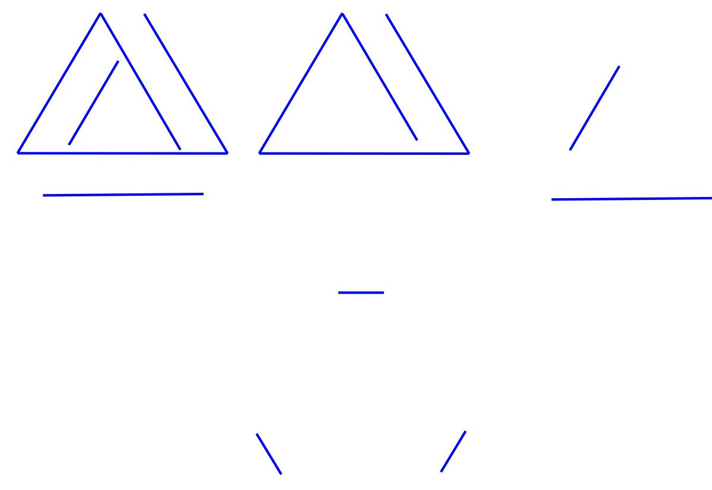

La torsion est écrite ainsi dans ses trois modalités différentes :

\- du côté du signifiant pris comme objet : continue, discontinue, les trois écritures du haut

\- du côté du signifiant pris comme fonction : les trois traits du dessous qui n’écrivent que la fonction le passage d’une face à l’autre.

==> une autre astuce d'écriture : le trait rouge en pointillé signifie qu'à cet endroit là, le bord se situe derrière, ou dessous. ==> ces deux traits supplémentaires sont là pour suggérer « la surface » de la bande, l'endroit de pliure et la 3ème dimension par l'astuce du pointillé comme dessous.

RA : Cette écriture présente en effet l’inconvénient de ne poser qu’un tout petit bout de face cachée. On ne voit en gros, qu’une face, et ça met en relief cette fois l’unité des faces de la bande comme le huit intérieur écrivait l’unité du bord. L’artéfact (pour le coup, c’en est un) du pointillé, fait voir qu’il y a une face cachée, mais juste sur un petit triangle. La mise à plat correcte fait voir clairement les deux faces cachées, car il y a deux modalités de cette face cachée.

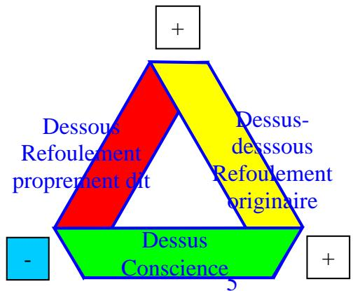

Intérêt pour la psychanalyse : nous avons une écriture mathématique du schéma de la lettre 52, qui n’était qu’un schéma. Cette écriture révèle le vœu de Freud de voir se raccorder les deux bouts de son schéma, la perception et la conscience, en refermant le parcours à travers les représentations, représentation de chose (inconscient, signification) : la surface, représentation de mot (conscience, signifié ): le bord.

J’avais déjà décrit dans mon article initial les contradictions dans lesquelles s’enferrait Lacan en essayant de trouver les différences entre bande dite « à une torsion » et la bande dite « à trois torsions » (selon lui). C’est à lire ici :

<http://pagesperso-orange.fr/topologie/3>\_torsions\_moebius.html

sous le titre :

Lacan et la bande de Mœbius : dernières paroles.

J’en rappelle juste ceci :

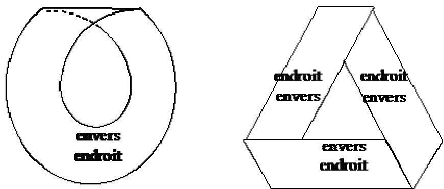

L’insuffisance de cette écriture éclate ici : il doit écrire dessus le concept, qui n’est pas directement lisible dans l’écriture. De plus, on ne voit pas bien ce qui distingue « envers endroit » de « endroit-envers », ce qui témoigne de l’embarras de Lacan. En écrivant des textes dissemblables sur des écritures topologiquement semblables, il induit en erreur.

Et donc la suite de la lecture du séminaire le montre, il ne sait pas quoi faire de cette différence entre les deux bandes. Il passe ainsi à côté d’une écriture différenciée de la psychose et de la névrose. L’écriture de gauche à une seule torsion ne lui a pas permis de repérer l’inversion de sens d’une des torsions qui m’a amené, perso, à établir la différence entre bande de Moebius homogène et hétérogène.

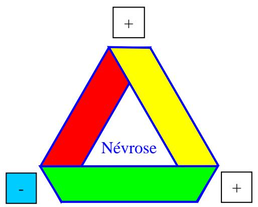

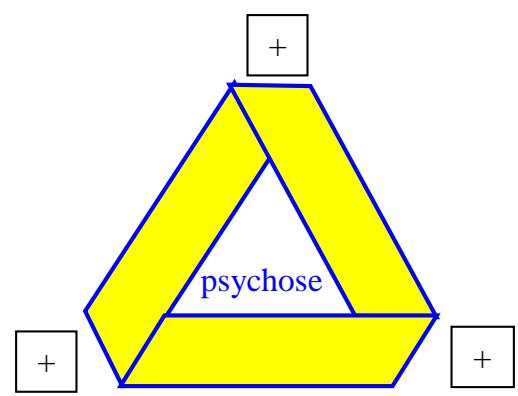

A la mathcurve (<http://www.mathcurve.com/surfaces/mobius/mobius.shtml> )

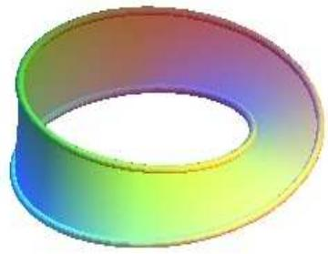

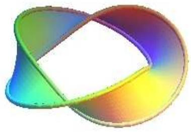

A gauche le ruban de Möbius dit « dextre à ½ torsion », à droite le ruban de Möbius dit « dextre à 3/2 torsions ».

==> Nous passons donc du dessin à une illustration de la bande de Möbius (dont Mathcurv. préfère le mot ruban de toute évidence). La surface est dessinée. Rendant plein ce qui était juste suggéré auparavant.

==> la différence du bord des deux bandes se fait lisible, à droite nous pouvons lire, en suivant le bord, le nœud de trèfle.

==> Mathcurv. Nous rappelle qu'il y a 2 bandes de Möbius, qu'il nomme dextre et senestre. Cette propriété, dont l'une est une image énanthiomorphe de l'autre (une certaine image miroir, tout comme notre main droite et notre main gauche), est une propriété fondamentale de certains objets dans notre espace 3, pas assez étudiée à mon avis.

RA si, par moi. Mais faut se donner un peu la peine de lire. En particulier je récuse les dénominations dextre et sénestre qui, outre qu’elles sont absconses, font référence à des orientations non explicitées, à une position dans le miroir non explicitée, à une théorie du miroir non explicitée : est-ce le miroir objectif de Vappereau qui n’inverse pas la droite et la gauche (alors dans ce cas pourquoi dextre et senestre si ça n’inverse pas droite et gauche ?), ou est-ce le miroir intuitif populaire qui lui inverse la droite la gauche (mais si c’est seulement intuitif, il faut en faire la théorie ; moi, je l’ai fait. Et j’en conclus que, certes, il y a deux bandes mais elles ne sont ni gauche, ni droite, il y en a une tournant dans un sens et une qui tourne dans l’autre sens : il convenait de distinguer deux dimensions généralement confondues : la chiralité (droite- gauche) et la gyrie (un sens - l’autre sens ). Ce qu’il faut saisir c’est ce que l’espace combiné miroir-bande de Moebius détermine comme dimensions pertinentes. Je ne reprendrai pas ici cette étude, ça nous entrainerait trop loin. Mais je peux le faire plus tard pour qui le souhaite. Mathcurve… je veux bien pour curve, mais pour math, c’est à revoir…

Il ne suffit pas d’employer des grands mots… l’énantiomorphie est particulièrement mal définie, par des gens qui ont insuffisamment étudié le miroir et ses propriétés. Je n’ai pas besoin de faire appel à des mots qui font savant pour parler des fonctions de ce petit objet miroir.

Il ne suffit pas non plus de savoir faire de jolis dessins, il faut aussi pouvoir nommer la théorie implicite qui les soutient. Ce que, par contre, fait mon écriture :

D’abord repérage des positions respectives du sujet S de l’objet O et de l’image I par rapport au miroir (au passage, intérêt pour la psychanalyse ; ce sont les trois temps de la pulsion selon Freud):

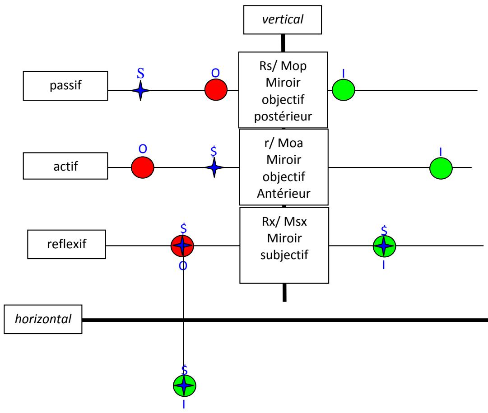  
Ce qui donne, avec en objet O une bande de Moebius :

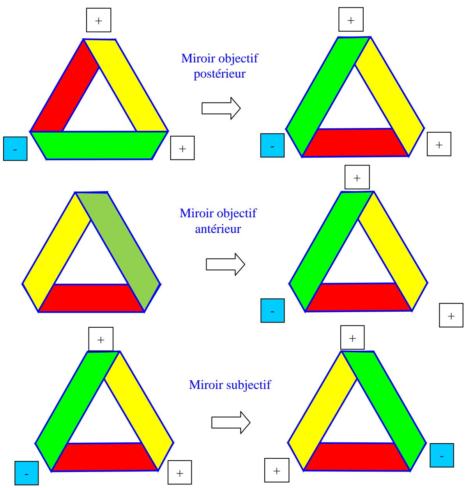  
MLC : L'existence de ces objets droits et gauches pourraient faire apparaître une dimension supplémentaire. (affaire à suivre... plus tard...

RA un objet n’est jamais ni droit, ni gauche : ça dépend de l’observateur et de sa situation par rapport à l’objet, car seul le sujet a une droite et une gauche par rapport auxquelles il se repère. C’est à partir de là qu’il va dire ( c’est une parole), pour un temps : cet objet tourne dans un sens, ou cet objet tourne dans l’autre sens (gyrie) ; ou : cet objet présente une dissymétrie sur ma droite ou sur ma gauche (chiralité : de χηιροσ, la main : seul la sujet a une main, pas l’objet).

Autre illustration à la mathcurv. : une sphère (ou bonnet) pincé percée... est une immersion d'un ruban de Möbius

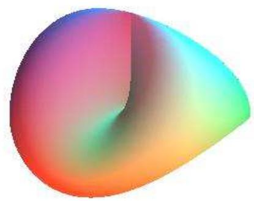

==> pas tout à fait maniable, il est quand même intéressant de pouvoir y lire qu'il s'agit aussi d'une bande de Möbius, qu'elle peut apparaître dans différente surfaces (tout comme dans une bouteille de Klein par exemple).

RA ce qui fait de cet objet un objet inutile pour la psychanalyse, ou alors il faut trouver en quoi il présente une différence d’avec la bande de Moebius, et en quoi ça nous intéresse. Moi, je n’ai pas pu trouver autre chose que ceci : il montre comment un sujet ne cesse pas de se situer entre son dedans-dehors discordantiel (partie supérieure du cross cap, pincée, asphérique) et son dedans-dehors forclusif (partie inférieure sphérique). On peut y lire toute la gamme des identifications à l’objet : je suis l’objet, je ne suis pas l’objet, je ne suis pas l’objet (forclusif) mais je le suis quand même (discordantiel) : S◊a.

==> l'aspect immergé de la bande serait à creuser à mon avis... plus tard... (x2)

## A la Vappereau

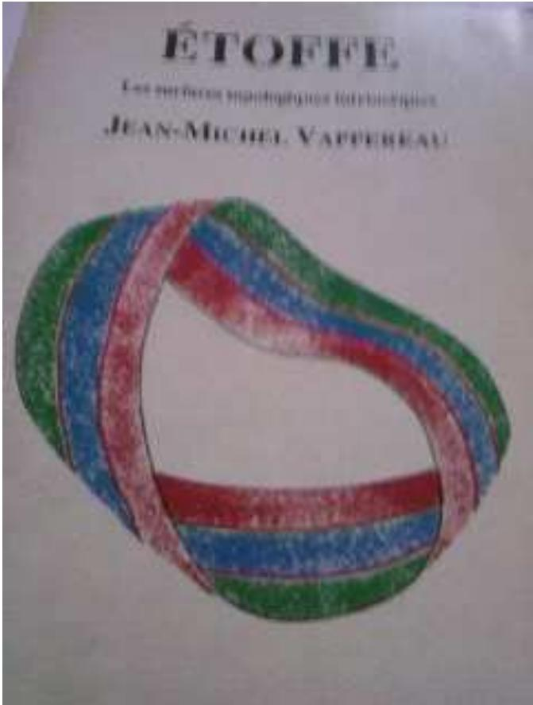

==> Jean-Michel nous complique la tâche de lecture. Le fait qu'y ait différentié trois couleurs, et qu'un trait rouge apparaît à l'intérieur veut signifier plusieurs choses à la fois :

• en vert et rouge, sur le bord de la bande (dite à ½ torsion) vous pouvez y lire la propriété bilatère (2 faces distinguées par vert et rouge) de la bande de Möbius.

• Au centre, le bleu, signifie le caractère unilatère de la bande.

Le trait rouge, vient rappeler qu'en faisant 2 tours de coupes, vous allez séparer mais attention enlacer, les parties bilatère et unilatère de la bande

• si vous coupez dans le bleu, au centre, un seul tour de coupe suffit à rendre la bande bilatère. Le tour de coupe représentant lui le caractère unilatère.

RA : oui tout à fait. On remarquera que sur la couverture du livre la bande de Moebius est à trois torsions, propriété qui est complètement passée sous silence dans le contenu du livre. On remarquera aussi que dans mon écriture, ces propriétés sont inscrites dans la structure même de la mise à plat qui est équivalente à une coupure à deux tours, alors que les couleurs de Vappereau sont un artéfact ajouté sur la mise à plat (car le dessin montré cidessus est une mise à plat malgré son aspect souple qui donne l’illusion d’une vue dans l’espace : c’est une écriture ; la couverture, c’est un plan en deux dimensions). Trois couleurs, disposées autrement, écrivent ces propriétés de coupure d’une manière plus mathématiquement exacte, car ce ne sont pas des ajouts de couleurs sur un dessin, ce sont les effets réels de la mise à plat (j’ajoute de la couleur par simple souci pédagogique : même sans les couleurs, l’écriture écrit ces différences d’elle-même) :

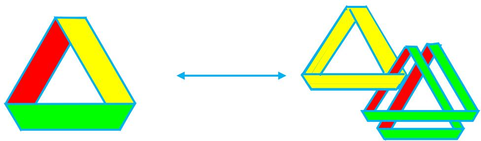

L’écriture de Vappereau ne permet pas de distinguer le bord (ou coupure) de la surface en tant qu’unilatère. C’est ce qui m’a amené à introduire une quatrième couleur : le bleu reste la coupure comme chez Vappereau, mais le jaune que j’ajoute représente la surface en tant que coupure, la surface unilatère : ce n’est pas la même chose.

Intérêt pour la psychanalyse : la coupure en bleu représente la parole, notamment en tant qu’elle interprète. Elle fait passer d’une face à l’autre. C’est une fonction, c’est la torsion. Tout trait en bleu représente ainsi : coupure, bord et torsion, et donc : la parole en tant qu’elle est entendue (elle fait passer d’une face à l’autre, d’un sujet à un autre). Seuls les bords sont donc en bleu. La surface unilatère, en jaune, opère au contraire la confusion entre le dessus et le dessous. Elle écrit la formation de compromis qu’est le symptôme, compromis entre deux pulsions contradictoires. Ça ne passe pas à l’autre, puisque c’est l’Autre qui se confond avec le Sujet. Mon écriture montre comment il est possible de passer du symptôme à sa lecture, du blocage à la fluidité, en produisant simplement une mise à plat qui permet la lecture du symptôme pour un autre. Cette écriture indique ce qu’il en est vraiment de cette opération dans l’analyse : oui, ça met à plat, (c'est-à-dire : ça coupe, ça interprète) mais il y aura toujours nécessité d’un symptôme, il y aura toujours un reste, jaune, cause du désir (encore heureux !). En remettant à plat la bande de Moebius jaune obtenue, on obtient encore la même découpe et ainsi de suite.

Ce qu’on ne peut pas lire dans l’écriture de Vappereau.

==> L'avantage de cette représentation, c'est que nous pouvons voir que le bas de la bande peut être déformée continument, sans déchirure, pour obtenir la forme qu'il a dans le 1er dessin à la mathcurv. En effet, si l'on considère que cet objet est souple, comme l'admet la topologie alors ce double plis peut tout à fait se défaire et donner ce qui nommé bande de Möbius à ½ torsion.

RA il ne se défait que lorsque la surface est souple. Il faut donc faire cette hypothèse d’un objet abstrait, où l’on fait disparaître les deux torsions supplémentaires par cette opération du saint Esprit. Oui, si l’objet est souple, ça marche. Mais ce n’est pas un hasard si Vappereau a mis cet objet sur sa couverture, merveilleux acte manqué : il a suffisamment observé des bandes de Moebius pour se rendre compte qu’elles sont comme ça. D’ailleurs il montre dans les premières pages de l’ouvrage, comment une courbe est équivalente à deux torsions. Le problème est que du coup, il n’étudie que la bande avec une torsion, ce qui le fait passer à côté de toutes les propriétés que je viens de dire. Ce qui lui fait manquer la distinction : coupure ≠ surface unilatère, ce qui revient à manquer, sur le plan des concepts analytiques la distinction : Φ, objet a. Autrement dit, pour faire référence à Frege, la différence de la fonction et de l’objet. Pour quel gain ? Je ne sais toujours pas.

J’attends toujours qu’on me dise.
