# RICHARD ABIBON PSYCHOSE ENLACEMENTS, ET NOEUDS

Nous l’appellerons Omar.

Des voix lui disent : « le voilà ! C’est lui ! On va te prendre ta fille, on va tuer tes frères, ton père, et ta mère. »

Il sait que ces voix viennent de lui, mais il les entend quand même comme venant de l’extérieur. Il a convenu au bout de quelques entretiens qu’il avait une mauvaise opinion de lui-même et que c’est sans doute ça qui revient ainsi dans le réel.

J’ai investigué un peu partout à partir de ces voix. Je tenais surtout à lui faire redire ce qu’elles disent, même si c’est toujours la même chose : l’important, c’est qu’il puisse en prononçant à son tour ce qu’« elles » disent, remettre à sa place le sujet de l’énonciation.

Il a un jour été témoin de ceci : son beau frère qui est venu chez lui pour tuer son père (à lui, Omar) avec une hache. Il n’a tué personne, mais Omar a eu très peur. Il lui semble que c’est à peu près à cette époque que ça a commencé, les voix. Son père est quelqu'un qui ne parle pas et à qui on ne peut pas parler. Il est froid et distant. Je peux faire l’hypothèse qu’il a eu très envie de le tuer, et que cet épisode du beau frère lui a montré quelqu'un d’autre agissant ses propres sentiments dans le réel. Maintenant, ce sont des voix qui lui disent son envie de tuer son père (et toute la famille, sauf sa fille à laquelle il est très attaché).

Sa mère est quelqu'un qui ne cesse de le dénigrer, lui et aussi ses frères ; il s’est rendu compte en en parlant que, en effet, elle fait toujours la comparaison avec les autres, en la défaveur des ses enfants. Ses frères ne vont pas forcément mieux que lui. L’un est alcoolo, l’autre a aussi fait des séjours en psychiatrie…

Enfin, il m’a dit qu’il se sentait coupable de n’être pas allé en Algérie quand son père est mort. Il n’a pu ni le revoir une dernière fois, ni aller à son enterrement ; par contre il y est allé beaucoup plus tard. Alors il est allé sur la tombe avec des cousins qui lui ont parlé de son père : il était dans le FLN, il a connu la faim, il a eu une vie très dure …mais il n’en avait jamais parlé. Omar ignorait complètement tout cela. Je lui ai demandé ce qu’il avait éprouvé sur cette tombe. De la culpabilité, bien sûr.

A la séance suivante il me dit que ça va mieux et que les voix chuchotent au lieu de le menacer. Il me dit ça comme une remarque sans plus de valeur, mais je lui demande s’il ne se sent pas mieux du fait de ne pas se sentir menacé. Il en convient volontiers ; alors je lui demande si ce n’est pas du fait qu’il a pu parler de sa culpabilité par rapport à son père, c'està-dire de sa « mauvaise opinion de lui », celle qui s’exprimait par les voix ; il en convient également.

## Omar et Joyce

A ce stade il est possible d’introduire une comparaison avec le nœud dit « de Joyce », que Lacan amène dans « le Sinthome ».

Un croisement est raté au niveau du Nom du Père :

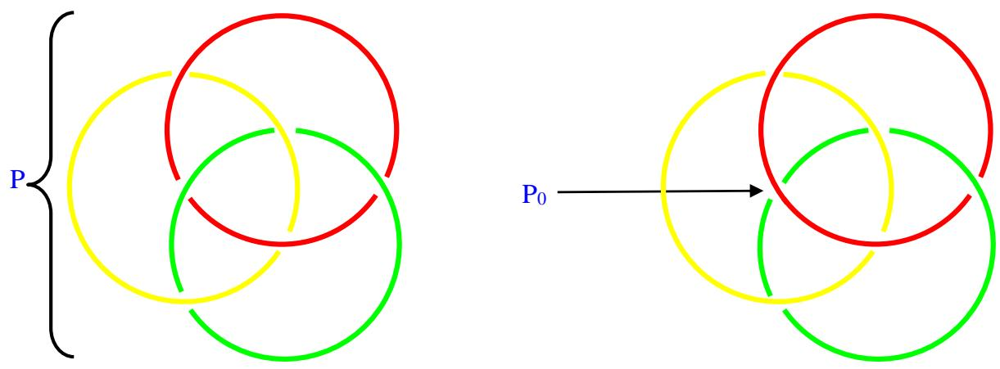

Ça ne veut pas dire que « ce » croisement là est le Nom-du-Père : le ratage de n’importe quel croisement aurait le même effet. Non, ce qu’on peut dire après-coup, c’est que le Nom-du-Père, P, c’est l’ensemble du nouage comme tel. Il suffit qu’un croisement rate, et ce croisement se désigne après-coup comme P0.

C’est là que nous retrouvons la question du critère de borroméénité : ici, le critère dont il est question, c’est de pénétrer ou non le trou d’un autre, ce n’est pas : on en coupe un et tous sont libres. Ceci c’est ce qui arriverait si tout d’un coup plus aucun mot n’avait de sens, et c’est ce qui arrive en effet dans ce qu’on appelle la schizophrénie. Ce n’est pas le cas ici : seuls un groupe de mots se détache, un groupe bien précis, toujours le même ; en ce sens, on peut parler de paranoïa. Que ce critère soit la question de la borroméénité du nœud ou non, c’est finalement secondaire. L’important, c’est plutôt de rattacher un phénomène clinique à son écriture topologique.

Le rond jaune reste correctement positionné, c'est-à-dire de manière borroméenne, par rapport aux deux autres. Il est sous le rouge et sur le vert, mais il ne fait plus partie du nœud. Par contre, ce ratage provoque l’enlacement du vert et du rouge, c'est-à-dire que chacun d’eux emprunte le trou de l’autre. Voilà ce qui s’oppose au nœud : l’enlacement. On pourrait appeler ça une interpénétration, comme ça se dit des familles « tuyau de poêle » : c’est d’inceste qu’il s’agit, imaginairement du fait de s’interpénétrer, symboliquement au sens de la définition de Lacan : « je métaphoriserai de l’inceste les rapports que le symbolique entretient avec le réel 1[1]». Car chaque trait de la figure représente un signifiant, sachant qu’un signifiant représente un sujet pour un autre signifiant. Le nouage écrit cette définition : un signifiant ne vaut que lorsqu’il est noué à au moins un autre signifiant, ce qui n’est possible que grâce à un troisième. Lorsqu’un croisement rate, ce rond troisième s’en va, et les deux ronds qui restent ne sont plus noués, ils sont enlacés. Le trou du symbolique était écrit par le fait qu’aucun rond n’empruntait le trou d’un autre : chaque trou restait fonctionnel, il n’était pas « bouché » par un autre rond. De plus la troisième dimension était écrite de ce fait : chaque rond pouvait être lu comme sur un deuxième et sous le troisième, ce qui permettait de se repérer dans la troisième dimension. Il y avait un dessus et un dessous.

L’enlacement indique donc le rapport incestueux du mot et de la chose, sachant que de chose il n’y a pas, il n’y a que du signifiant réduit à l’état de chose du fait du remplacement du nouage par l’enlacement. Il n‘y a plus d’ambiguïté possible : dans le nœud borroméen chaque trait représentant un rond pouvait être lu doublement car il était coupé en deux par l’écriture des deux autres ; dans l’enlacement chaque trait est devenu univoque.

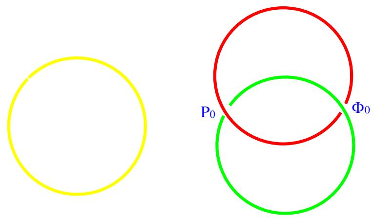

Ce qui se lit : un signifiant, s’il a un sens, en a forcément un $2 ^ { \mathrm { e m e } }$ . Cette coupure en deux disparaît dans l’enlacement où chaque rond s’écrit d’un seul trait, univoque :

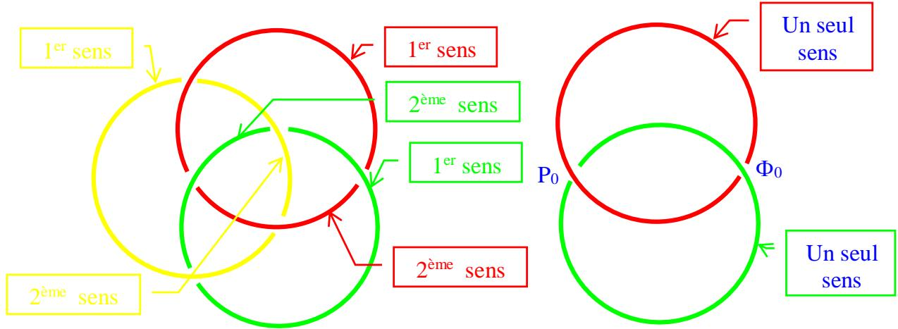

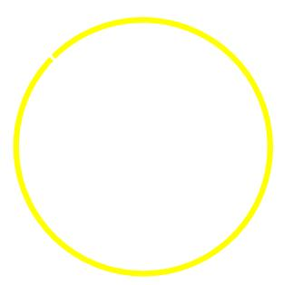

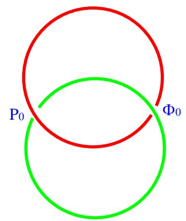

On peut donc lire le ratage du croisement comme forclusion du Nom du Père (P0). Il entraîne aussitôt l’enlacement, c'est-à-dire l’interpénétration qu’on peut figurer par la forclusion du phallus (0). Là, je propose une autre écriture des deux « trous » du schéma I de Lacan2[2] :

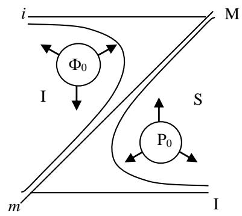

Ce ne sont donc plus des « trous » au sens symbolique du terme, ce qu’écrit le nœud borroméen (un rond dessus un rond dessous) ce sont des trous de désorientation dans un univers qui reste orienté. C’est dans ce sens qu’il faut entendre le mot « trou » employé par Lacan en commentaire de son schéma I. Le ratage de l’enlacement c’est le ratage de l’orientation : on ne peut plus s’y orienter quant à un dessus et un dessous. Ce ratage se poursuit aussi bien sur le rond jaune qui n’a plus, une fois détaché, de possibilité comparative.

Revenant à Omar, les désirs de mort à l’égard du père et des frères ne sont plus admis dans le nouage, ils restent à distance, forclos, tournant en rond dans la répétition d’une énonciation fictive : les voix (le rond jaune). Ils incluent la sanction de tels désirs, c'est-à-dire le rapt de l’être qui lui est le plus cher, sa fille. Par conséquent le rond jaune externe présente une condensation forclose de ça et de surmoi, dans la mesure où cela s’exprime par un signifiant tournant en rond, un signifiant univoque, c'est-à-dire qu’il n’est pas recoupé par d’autres signifiants. C’est devenu une lettre, et c’est en ce sens que personne d’autre ne peut entendre les voix : seul le sujet les « lit », ne sachant pas qu’il lit.

Toujours un signifiant, ce rond qui s’en va ? Dans « Le Sinthome », Lacan apporte ce ratage du nœud en rapport avec la raclée reçue par Stephen dans « Portrait de l'artiste en jeune homme »:

"Stephen se demande pourquoi il ne portait pas malice maintenant à ceux qui l'avaient tourmenté (...) Il n'avait pas oublié un seul détail de leur lâcheté mauvaise, mais leur souvenir n'éveillait en lui aucune colère. Toutes les descriptions d'amour et de haine farouche qu'il avait rencontrées dans les livres lui paraissaient de ce fait dépourvues de réalité. Et même, cette nuit-là, alors qu'il s'en retournait en titubant par la Joyce Road, il avait senti qu'une certaine puissance le dépouillait de cette colère subitement tissée, aussi aisément qu'un fruit se dépouille de sa peau tendre et mûre"3[3]

Où l’on peut lire qu’il s’agit d’une métaphore d’excellente facture. Ce n’est pas présenté comme un réel, et assez bien amené comme l’histoire d’un refoulement. Il y a bien eu une colère « subitement tissée » (on notera la métaphore topologique, qu’il faudrait vérifier au texte anglais que je n’ai malheureusement pas), et puis cette colère est tombée, et je dis : a été refoulée. Elle n’est pas partie tel le rond qui s’éloigne, tel une image du corps qui se sépare. La trace du refoulement en est ce sentiment de puissance : la puissance du refoulement lui-même. Par ailleurs il est un point qui serait vraiment à discuter c’est cette façon qu’à Lacan de traiter ce qui est dit « une colère » comme « une image du corps ». Visiblement il prend la métaphore au pied de la lettre : la peau de l’orange peut bien en effet être considérée comme « l’image du corps » de l’orange, ce qui lui donne son unité et son apparence. La métaphore se confirme un peu plus loin dans l’ouvrage de Joyce :

De brèves colères s’étaient souvent emparées de lui, mais jamais il n’avait pu en faire une passion durable, et chaque fois il avait eu l’impression d’en sortir, comme si son corps même se fût dépouillé avec aisance de quelque peau ou de quelque écorce superficielle4[4]

Mais Joyce ne l’emploie qu’à titre d’une métaphore de la colère qui tombe. Il y a donc un saut, de la part de Lacan, à ne vouloir considérer que les termes de la métaphore comme tels, coupés du contexte qui l’a formé. Autrement dit, c’est Lacan qui effectue la coupure qu’il impute à Joyce.

Par contre, voici une histoire dans laquelle le détachement de l’image du corps n’est pas présenté comme une métaphore, mais comme un fait réel.

## Estelle et son double.

Une dame vient me voir, envoyée par un collègue psychiatre. Elle est désolée parce qu’une autre femme vit à la maison, chez elle. Cette intruse fait tout dans la maison, la cuisine, la vaisselle, les courses, le ménage… elle-même ne fait rien. Vous vous rendez compte me dit-elle, scandalisée, l’autre jour elle a même inscrit mon fils à la bibliothèque ! Elle ne sait pas trop si cette dame est une sœur, ou sa maman, ou encore quelqu'un d’autre…

D’ailleurs elle-même n’est pas vivante, sa maman l’a construite ou modelée dans la terre (donc hors sexe, en l’absence de tout rapport sexuel) comme une marionnette il y a seulement 4 ans. La preuve, elle n’a pas de corps. Quand je me douche, dit-elle, je me frotte et à l’endroit où je frotte, il n’y a rien. Quand je regarde dans le miroir, je peux voir la chaise sur laquelle je suis assise, mais sur la chaise, il n’y a rien.

Ce n’est donc pas un « comme si » tel celui du récit de Joyce. C’est un réel.

Elle lâche un jour que sa mère la battait beaucoup, lorsqu’elle était petite. Mais c’est impossible : sa mère ne pouvait être que gentille. Par conséquent, elle a dû dissocier la mère méchante, qui se confond avec la fille méchante, battue par la mère, à l’extérieur : l’intruse, dont elle dit en effet que c’est tantôt maman, tantôt une sœur, tantôt elle-même, tandis que la fille gentille reste en dialogue avec la maman gentille, mais c’est une fille qui n’a pas de corps. Et pour cause, puisque le corps est celui qui a été battu par la méchante maman.

Elle vient très régulièrement à ses séances. Voilà qu’elle tombe enceinte. Le psychiatre arrête aussitôt son traitement neuroleptique. Pendant quelques mois, je ne constate aucun changement : toujours la même plainte à propos de l’intruse. Elle signale néanmoins que la personne en général ne l’accompagne pas à ses séances ; quoique, parfois, elle se demande, puisqu’il y a un siège vide à côté d’elle … mais elle se demande aussi si, par hasard, je ne serais pas « maman », avec laquelle elle est en dialogue permanent… un dialogue qui a l’air intérieur cependant. Rien à voir avec les « voix » d’Omar.

Un jour elle me dit que « maman » lui a dit de regarder dans le miroir, qu’elle va enfin savoir qui est l’intruse. Alors, dit-elle, j’ai regardé et je me suis v…euh, je l’ai vue. Vous vous êtes vue, soulignais-je ! Oui, confirme-t-elle, enfin, je l’ai d’abord vue et puis je me suis vue ! – l’essentiel, c’est que vous vous soyez vue, enfonceleclou-je.

Le temps passe encore un peu, et voilà qu’elle me dit un jour : maman m’a dit : « tu sais, l’intruse, et bien c’est toi » (elle dit ici son prénom, Estelle, qui jusqu’à présent était le prénom de l’intruse, puisque elle-même n’était personne). Eh bien en voilà une bonne nouvelle, dis-je, et je clos la séance là-dessus. Elle part dans une grande émotion, me disant sur le seuil : j’ai enfin trouvé la vérité.

Et là, problème : elle rate une ou deux séances et m’explique a son retour qu’on a fait venir l’exorciste pour faire sortir le démon qui est en elle, et qui par sa bouche criait qu’il ne voulait plus sortir. Il faut préciser ici que cette dame est africaine, et qu’on a fait venir un pasteur sénégalais ne parlant pas l’ingala, sa langue native, en laquelle le démon s’exprime. Sa sœur traduisait les propos du démon pour le pasteur. Lors d’une séance suivante, elle me reparle de ce démon et je lui dis que, sans doute, il a beaucoup de choses à dire, ce démon. Elle me répond que oui, bien sûr ; alors je lui dis qu’elle peut le laisser parler, ici. Et la voilà qui se met à sortir une longue tirade en ingala, à laquelle je ne comprends rien, bien sûr. Ça ne m’empêche pas d’écouter attentivement. A la fin, elle pleure en parlant et termine en français : est-ce que je peux partir, maintenant ? J’insiste quand même pour qu’elle me traduise ce que le démon a dit. Eh bien le démon a dit que tout ça est de la faute de son père qui l‘a attachée quand elle était petite, et qui, une nuit, l’a mariée à son frère.

A la suite de quoi j’apprends qu’elle est hospitalisée sur la demande d’un tiers, à savoir son mari.

Je comprends ceci (c’est une hypothèse) : le travail de parole fait en analyse a produit du sujet, ce qui a eu pour effet subsidiaire de permettre la construction d’un moi, c'est-à-dire

Les Voix d’Omar Ça, surmoi

d’une image du corps. Celle-ci, qui se tenait à distance et en tout cas pas dans le miroir, est d’abord apparue dans le miroir, puis a reçu de « maman » une nomination dans la réalité (à peu près comme Lacan décrit le stade du miroir). Mais du coup ce sujet, le sujet de l’inconscient, se met à parler et se souvient. C’est sans doute ce qui n’a pas été supporté par l’entourage, qui y a vu l’effet d’une possession. En effet elle est rentrée en « possession » de sa mémoire. Et il y a apparemment des souvenirs très gênants qui ne mériteraient pas d’être dévoilés familialement. C’était mieux quand elle se contentait de n’être personne, pendant que « l’autre » entretenait correctement le ménage. D’où l’intervention du pasteur pour faire sortir ce qui était rentré. Et d’où, finalement, l’hospitalisation, réclamée par l’entourage.

## Estelle, Omar, et Joyce

Dans le cas d’Estelle, c’est l’image du corps détachée du corps réel qui prend sa place, il y a un phénomène de miroir réel. Omar s’identifie à l’enlacement et entend les voix à l’extérieur ; Estelle dit : je n’ai pas de corps, je suis un pur esprit, je suis une voix. Elle s’identifie donc au rond exclu (un corps, mort, jeté, invisible : un pur signifiant, et en effet le signifiant ne se voit pas : il s’entend), tandis que l’enlacement lui apparaît comme une autre qui a pris sa place. Omar se plaint des douleurs physiques que lui causent l’interpénétration signifiante : il est bien, lui, à la place de l’enlacement. Il va vomir tous les matins tellement il est tordu par l’angoisse qui le prend au corps. A l’extérieur, c’est une condensation de ça (pulsions meurtrières) et de surmoi (punition des pulsions : l’enlèvement de sa fille)) qui le menacent et causent son angoisse. Estelle au contraire est plutôt scandalisée de ce que cette autre prenne sa place. Elle n’est pas angoissée, seulement révoltée d’être exclue.

Lettre du Corps réel d’Estelle : pure voix. Le sujet qui parle, moi en souffrance

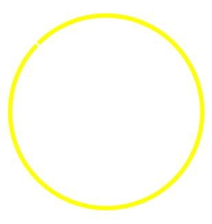

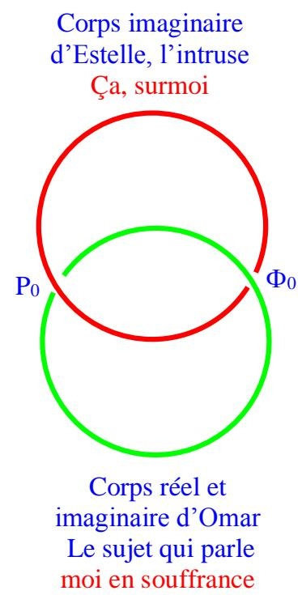  
Corps réel et imaginaire d’Omar Le sujet qui parle moi en souffrance

Dans cette perspective, ce n’est pas le rond imaginaire qui s’en va, ainsi que Lacan le décrit dans le cas de Joyce. C’est le signifiant de l’image du corps, ou plutôt sa lettre puisqu’elle est lue par le sujet dans le monde réel. Dans les deux cas l’image du corps ne peut se construire car on ne peut pas écrire de dessus-dessous ; ce n’est pas orienté. L’image du corps, c’est une lettre. Le rond jaune, de par sa solitude n’est ni dessous ni dessus, il n’a plus de point de comparaison. Le vert, dans son rapport au rouge, est dessus puis dessous, sans qu’on puisse fixer l’un de ces attributs. Autrement dit, cette écriture fait métaphore de ce que le corps ne peut se construire une image isolant clairement un dedans d’un dehors, une bouche dessus et un anus dessous, une parole qui sort (de la bouche) et une parole qui rentre (dans l’oreille).

On peut y lire également la perte de l’équivocité borroméenne : chaque rond est devenu univoque, au lieu d’être coupé en deux par l’écriture des deux autres.

On peut supposer après coup que le ratage du nœud d’Omar était en effet dans le Nom du Père puisque c’est en parlant de sa mort, de sa tombe et de ce qu’il a appris sur sa vie et de la culpabilité qu’il a éprouvée sur sa tombe que peut-être une réparation du nœud s’est mise en place, réduisant les voix à un chuchotement. Il resterait à parler un peu de sexualité pour travailler le croisement 0.

Ainsi le rond bleu ci-dessous représenterait le discours qu’il m’a tenu, faisant récit de son voyage en Algérie vers le Nom du Père.

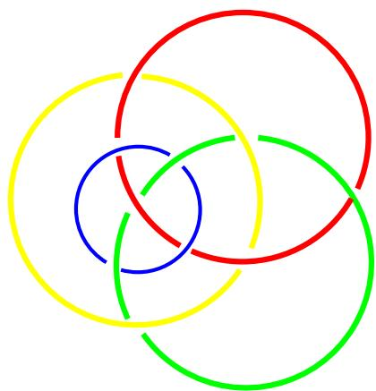

Après cet épisode en effet, les voix se sont tues, du moins quant à leurs menaces. Elles sont passées au chuchotement puis, suite à des résultats d’analyses médicales un peu alarmantes pour son foie et son pancréas, elle sont revenues, l’appelant par son nom, ou plus exactement par le surnom dont il a toujours été usage dans sa famille. Ceci dit, ce n’est pas ce qui a diminué son angoisse, celle qui lui tord les tripes tous les matins au point de la faire vomir.

Quant à Estelle, ce serait la réintégration de l’image du corps sous la forme du démon. En effet, ce démon parle comme toutes les pulsions meurtrières condensées avec, là aussi, toutes les punitions que le sujet s’inflige en conséquence des dites pulsions. Ce démon parle aussi du père et du rôle qu’il a joué dans un inceste perpétré avec le frère. C’est la version personnifiée de l’inconscient qu’elle a replacé à l’intérieur de son image du corps, c'est-à-dire dans un certain nouage conforme aux idéaux de sa culture.

On fait passer le rond jaune de gauche à droite :

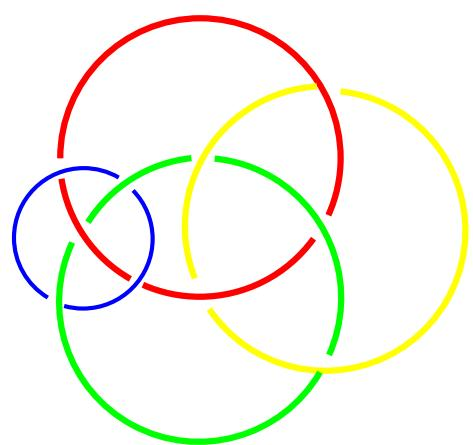

On restitue au rond bleu une taille comparable à celle des autres ronds :

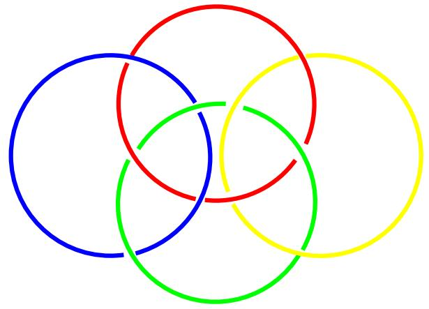

Et on obtient un nœud borroméen à quatre. Il est parfaitement borroméen avec le critère « si on en coupe un, tous sont libres », sauf que ce critère n’est valable que pour les deux ronds centraux (le rouge et le vert). La coupure d’un des ronds latéraux restitue la configuration : un rond + un enlacement, contrairement à ce que j’avais dit dans une récente étude (décidément, je passe mon temps à me tromper ! mais je reviendrais là-dessus). En effet la réparation par le rond bleu permet d’éviter la fuite du rond jaune mais ça ne modifie pas l’enlacement. Ensuite, la coupure du rond bleu entraîne la libération du jaune et inversement. Dans les deux cas, il y a conservation de l’enlacement central.

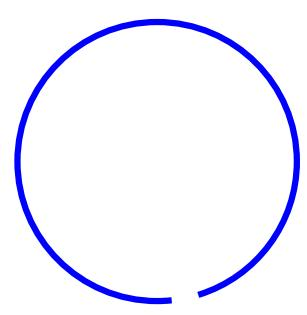

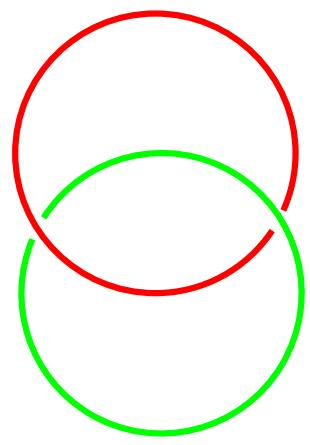

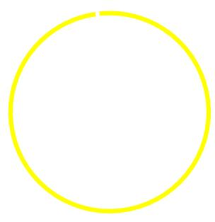

Il n’est donc pas borroméen avec le critère : aucun rond n’emprunte le trou de l’autre : l‘enlacement central reste, sauf si on le coupe. Un enlacement, je le rappelle, se définit de ce que chaque rond emprunte le trou de l’autre.

Examinons à présent l’image spéculaire de ce nœud selon la dialectique des miroirs que je schématise ainsi en fonction des positions respectives du sujet S et de l’objet O :

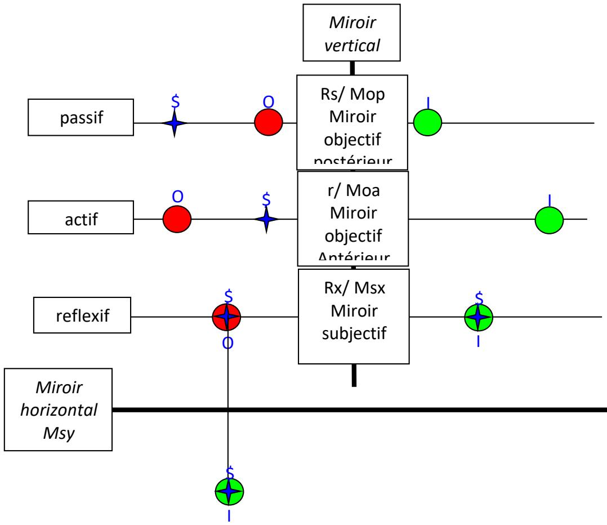

Cette dialectique correspond aux trois temps de la pulsion chez Freud : passif, actif, réflexif (« les pulsions et leurs destins », 1915), montrant bien le caractère grammatical de la pulsion.

Le plus étonnant de l’affaire c’est que le nœud dit « de Joyce », amené plus haut, est aspéculaire dans le miroir subjectif : son image lui est identique. Evidemment il ne faut pas tenir compte des couleurs des ronds, que je n’ai conservées que pour vous permettre de vous repérer : la couleur est un élément d’écriture surajouté qui n’entre pas dans la structure du nœud. Donc au niveau de la position respective des ronds et des dessus dessous, ce nœud n’a pas d’image dans le miroir subjectif, c'est-à-dire pas d’image qui lui soit différente.

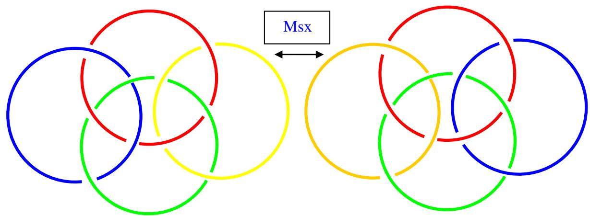

Il semblerait donc que l’équivocité signifiante, récupérée au niveau de chaque rond soit démentie par un point de vue global : cette image, c’est absolument moi, il n’y a pas de manque dans l’image entre le reflet et son origine.

Toutefois il y a encore une particularité intéressante. Le miroir subjectif vertical (Msx) est équivalent à un retournement le long de l’axe des x, tandis que le miroir horizontal a les mêmes propriétés qu’un retournement le long de l’axe des y (Msy). Ce nœud est aspéculaire selon Msx et il l’est aussi selon Msy, ce qui n’est pas le cas pour le nœud borroméen à trois et pour le trèfle : tous deux son spéculaire selon Msx et aspéculaire selon Msy.

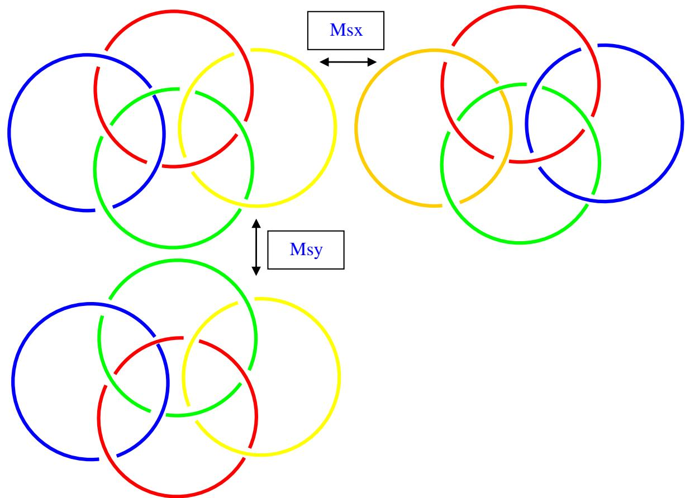

Donc, selon les deux dimensions de l’écriture, ce nœud n’a pas d’image. Bien qu’il écrive la troisième dimension dans sa structure propre locale (on peut lire des ronds dessus et des ronds dessous) il cesse de l’écrire dès qu’il s’agit de le comparer globalement à ses transformations selon les deux miroirs subjectifs.

Au contraire, le nœud à 4 issu de la réunion de six trèfles (voir mon travail précédent sur la construction du nœud à 4) a une image dans le miroir subjectif vertical :

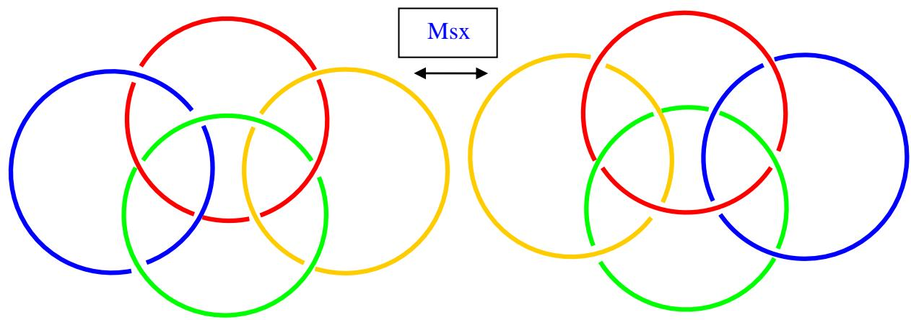

Ici l’équivocité demeure. Cette image, c’est moi et ce n’est pas moi. Il y a un manque dans le reflet, qui n’est pas absolument fidèle à son origine. J’avais montré dans la construction à partir de six trèfles qu’il fallait couper un rond surnuméraire pour parvenir à cette configuration, opération comparable à celle de la perte de l’objet a en fin d’analyse. A l’inverse, la réparation qui produit ce nœud ne suppose aucune perte : elle nécessite un ajout.

Toutefois cette spécularité disparaît au miroir subjectif horizontal (Msy). Ce nœud est spéculaire selon Msx aspéculaire selon Msy, ce qui est le cas pour le nœud borroméen à trois et pour le trèfle.

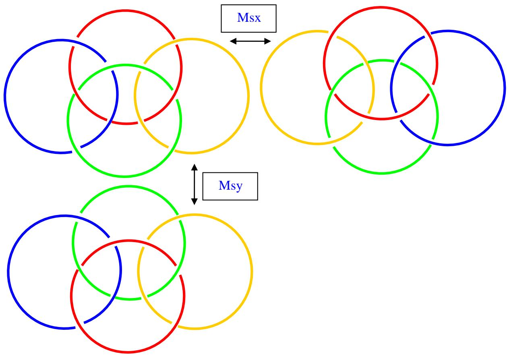

Nous avons donc deux possibilités (de théorisation) de réparation de la forclusion du Nom-du-Père, (le trèfle étant une autre version, disons rapidement : la version schizophrénique, par opposition à celle étudiée ci-dessus dans les deux cas présentés, paranoïaque) :

l’une en réunissant six trèfles et aboutissant à un nœud à 4 garantissant l’équivoque signifiante, localement et globalement au moins pour l’un des miroirs subjectifs (voir « l’Afrique de Joséphine », sur mon site).

\- l’autre réparant un enlacement à l’aide d’un 4ème rond, qui produit un nœud borroméen globalement univoque au point de vue des deux miroirs subjectifs.

Eh ben, de cette question de spécularité, je ne sais pas quoi faire de ça.

Mais c’est l’un des avantages de la topologie : elle pose des questions inattendues, qu’il ne sert à rien de résoudre au sein même de la topologie. Par contre, ces questions peuvent être créatrices d’hypothèses par rapport à la pratique.

Reste donc pas mal de travail à faire dans un rapport à la pratique.

# LE TRANSFERT DANS LA PSYCHOSE

## Pas d’autre transfert que le transfert de l’analyste

## P23

P. Fédida, préface à « L'effort pour rendre l'autre fou »de R.. Searles.

"Problématique est certainement toute parole qui cherche à identifier ou à nommer des contenus d'expérience interne survenant au contact du malade, surtout lorsque ceux-ci semblent mettre "hors de soi", nous faire vaciller, nous attaquer corporellement et nous ôter les représentations psychologiques afférentes au rôle de psychothérapeute auquel nous nous identifions. Que dire d'autre alors que ces mots qui s'énoncent comme de simple interjections physiques : rage, fureur, dégoût ; ou encore ces métaphores corporelles de la "tétanisation" interne, de l'"asphyxie" psychique, de la "suffocation", de la "mise en pièces" et du "délabrement", etc. — Rester à l'écoute de ces mots et de ce qu'ils signifient chez l'analyste d'un revivre amnésique indique que le psychotique occupe la place de l'analyse dans l'analyste."

A relire le contexte écrit par Fédida, certes la formule à laquelle il aboutit n'est pas très heureuse (la formule : le psychotique occupe la place de l'analyse dans l'analyste.), mais il me semble qu’il essaye de parler du contre transfert quand on se trouve face à la psychose. Et ça, au-delà de la formule de fin, c’est la bonne question.

Maintenant il est facile de dire la chose et son contraire si on se cantonne à la théorie. Dans le chapitre précédent, j’ai œuvré comme ce qui se fait le plus traditionnellement : j’ai parlé de « cas ». A la lecture des réactions que ça a suscitées, ça a beaucoup plu. Dieu merci, je ne parlais plus de moi, comme dans nombre de travaux précédents. Et pourtant, au contraire de toutes les autres disciplines, l’analyse se caractérise de la découverte par Freud du transfert et à sa réactualisation inverse par Lacan : « il n’est de transfert que de l’analyste ». C’est une formule qu’on a peu commentée, mais qui ne m’en apparaît pas moins essentielle quant à se situer au sein du champ analytique.

Je rappelle ici ma façon de la lire : le transfert n’est pas un sentiment erroné attribuable à l’analysant, il est le moteur essentiel de la cure comme lien, nœud entre les deux protagonistes. Il est ce qui se passe entre les deux. Mais l’avancée de Lacan, c’est aussi d’avoir mis en valeur l’instance essentielle du sujet de l’énonciation. Si l’analyste parle, et s’il parle à ses collègues, le sujet de l’énonciation, c’est lui. Et s’il parle d’une relation qu’il a eue avec un tiers, un analysant, celui-ci n’est pas là comme sujet de l’énonciation. Il n’y a donc aucune raison de prendre sa place. Au contraire, il s’agit pour moi de prendre en compte cette donnée essentielle, de ne pas se tromper de sujet de l’énonciation, et de parler du bout de transfert qui est le mien. Comme l’a souligné Lacan a maintes reprises, la notion de contre transfert, le transfert du côté de l’analyste n’a pas lieu d’être : le transfert c’est ça, c’est le contre transfert.

Alors je vais essayer de me mouiller un peu.

Je rêve que je suis traqué par la police. Il y a en a partout. C’est infernal. Et puis brusquement un type tire sur un autre une balle en plein front, l’autre tombe raide mort. Je constate alors que ça pue la merde.

Au réveil je pense aussitôt à l’un de mes analysants dont c’est le problème, exactement. Il n’y a presque pas de séances où il ne me parle pas de son sentiment qu’il y a de la police partout, et qu’il est recherché. Depuis les années qu’il vient me voir, il a réussi à se rendre compte que c’était en rapport avec un pseudo viol qu’il a failli commettre sur un bébé. Il n’a fait que sortir son sexe et le lui mettre dans la main, puis effrayé par on acte il a aussitôt cessé.

Et depuis il a l’impression que la police le cherche. Il lui a fallu du temps ne serait-ce que pour mettre en relation les deux choses. Il m’avait signalé aussi qu’il avait lui-même été abusé par son cousin plus âgé, mais, là, il n’était pas bébé, seulement préadolescent, et ça s’est reproduit pendant des années. Actuellement il semble que le travail s’oriente sur la culpabilité liée à cet acte-là, dont l’autre n’était peut-être que l’inversion, la reproduction inversée, mais inhibée au dernier moment.

Au début lorsque je le recevais, c’était pour moi un calvaire. Il parlait très peu, d’un ton monocorde, ne me disait presque rien, toujours la même chose. Et puis avec le temps, il a, nous avons, longuement exploré ces deux souvenirs, (je dis nous avons parce que j’ai dû pas mal poser de questions, vu sa difficulté à parler). Il m’est progressivement devenu sympathique. Au point, comme on le voit, de m’identifier inconsciemment à lui. Et ça, c’est pas très différent de ce qui se passe pour mes autres analysants, sauf que, là, j’ai mis du temps à surmonter ma résistance.

Au réveil, j’étais vraiment très étonné. Que se passe-t-il dans le transfert pour que je m’identifie à une situation aussi difficile ? Tout le temps traqué par la police, c’est pénible. Je sais que j’ai moi aussi un surmoi, et même un anus, mais enfin, il ne m’emmerde (sic !) pas comme ça. Le coup de pistolet de la fin est évidemment un « tirer un coup » quasi anonyme, je ne sais pas qui tire sur qui, mais si ça pue la merde, c’est que c’est bien du trou de balle dont il s’agit.

« Je ne sais pas qui tire sur qui, » : c’est peut-être l’indice de la désorientation de mon analysant, qui ne sait plus trop qui il est, sauf « celui qu’on cherche, celui qu’on persécute », sachant qu’on l’a cherché, lui et qu’on l’a persécuté sexuellement, réellement.

Il y a eu un moment cet automne, où il m’a dit que ça allait mieux, il sentait, dans la rue, qu’on ne le recherchait plus. Mais ça a aussitôt été remplacé par de propos haineux contre son patron, qui le méprise, qui ne l’augmente pas, etc.… je me suis dit, zut ça n’a fait que se déplacer.

Je me heurte donc à un réel, car dans cette histoire je me sens impuissant, bloqué. Nulle réalisation d’un désir dans mon rêve, mais, comme dans le jeu des enfants (fort-da), la répétition d’une situation qui ne sait pas faire autre chose que se répéter.

Ça, c’est quand ça ne répète pas :

JE ramène!

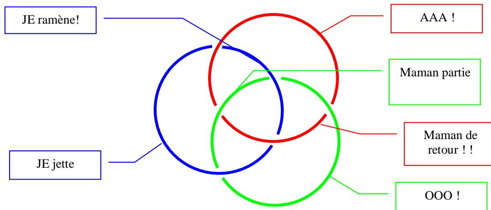

AAA !

Maman partie

JE jette

Maman de retour ! !

OOO !

Là, c’est quand ça répète :

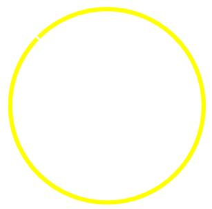

AAA !

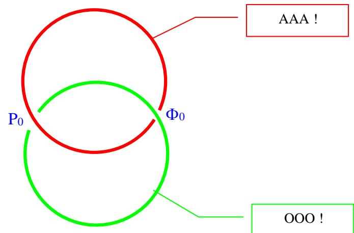

OOO !

Il n’y a plus que des cris coupés de leur contexte signifiant. Il n’y a plus de double signification possible : les ronds sont écrits d’un seul trait et non plus par deux traits, trognon de l’ambivalence.

Là aussi :

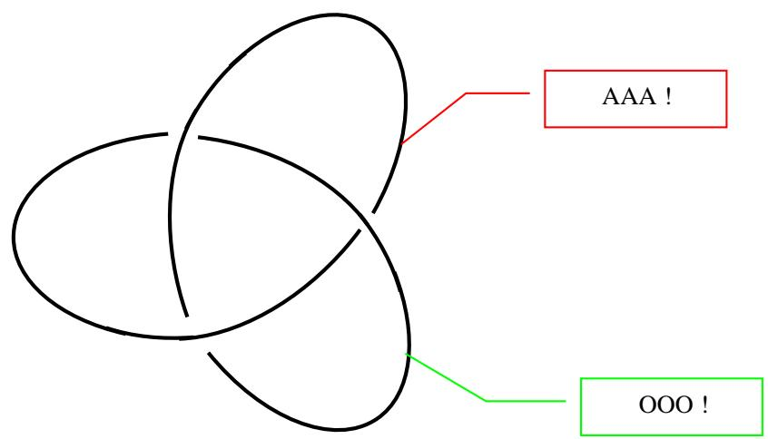

AAA !

OOO !

Il n’y a plus de signification possible car il n’y a plus qu’un rond, et O, c’est aussi bien A.

Topologiquement, dans mon rêve il y a quand même la tentative de faire un trou, ce qui serait une issue, mais c’est une issue fatale. Faire un trou c’est tenter d’écrire un nœud borroméen à la place d’un enlacement ou d’un trèfle où les trous sont bouchés par la consistance de la corde. Le transfert répète vraisemblablement la situation de viol répété qu’il a connue avec son cousin. Et la victimisation qui s’en est suivie.

Evidemment si ce rêve représente ce qu’il est pour moi, un réel, alors il est du côté de l’objet a, cause de mon désir, mon désir de trouver une issue pour lui, une issue à cette répétition infernale. Je ne saurai dire, si, à l’inverse, je représente aussi pour lui un réel, un objet a cause de son désir : il ne me l’a pas dit, je constate seulement qu’il n’a jamais loupé une séance. Je ne vais donc pas spéculer là-dessus.

## Estelle, Joyce et Abibon : Les présomptions de l’ego de l’analyste

A l’inverse la dame africaine, que j’ai appelée Estelle, cette dame, je ne suis pas pour elle un réel, je suis un idéal. Je ne peux parler à personne, il n’y a que vous qui me comprenez, il faut m’aider, M. Abibon5[5]. Cet idéal a pris nom maman à un moment de la cure, sans qu’il y ait vraiment confusion. Pour moi elle est devenue, par ricochet (ou devraisje dire « en miroir » ?) quelqu'un de très important. Autant l’autre me confine à l’impuissance, autant celle-ci me donne l’impression d’être utile à quelque chose. J’ai raconté comment elle a pu réintégrer son image du corps, qui c’est avérée porteuse d’un message incestueux, sous la forme d’un démon. Elle l’a précisé dans les séances qui ont suivi l’étude topologique que j’en faisais : mon père et mon frère ont couché avec moi depuis que j’ai 4 ans. Sa détresse était telle qu’à sa demande d’aide, de faire partir ce démon, je n’ai pu que répondre : acceptez que ce démon ne soit que le souvenir de ce qui vous est arrivé. Elle a répondu « j’accepte », et l’instant, d’après elle disait : ça y est, ils partent.

Bref ça me donne le sentiment d’être quelqu'un. C’est bêtement narcissique. Et ça m’a mis au travail quant à trouver comment théoriser ce qui se passe là, sous la forme d’un nœud borroméen raté réparé par un rond supplémentaire, semblable au nœud de Joyce.

Je me suis même fendu d’une interprétation. Je lui ai dit : puisque votre père et votre frère ont possédé votre corps, vous avez dû vous dire que vous n’aviez plus de corps. C’était la situation dans laquelle je l’avais trouvée (elle ne voyait pas son corps elle se disait « pur esprit », « pure voix »).

Eh bien, ce sentiment d’être quelqu'un ça n’est peut-être pas seulement bêtement narcissique : c’est peut-être, en miroir, ce qu’elle éprouve aussi à retrouver son corps, dans lequel elle peut réinvestir ses souvenirs, fussent-ils douloureux et incestueux. Rappelez-vous comment Lacan avait nommé le rond supplémentaire réparant le nœud de Joyce : l’ego. Et voilà, je ressens quelque chose comme de l’ego, moi ! La position dans laquelle elle me met flatte bêtement mon ego. Mais je me dis que ce que je ressens là, ça doit être aussi ce qu’elle ressent : c’est à deux que nous construisons de l’ego. Pas de sujet sans autre, c’est vrai pour elle et pour moi.

Le refoulement avait trouvé cette voie : ce corps-là, possédé par mon père, ça ne peut pas être moi. Ce n’est pas une représentation quelconque qui avait été refoulée, mais la totalité de ce qu’on l’on aurait pu appeler son moi. Ce qui autorise à parler de forclusion. Forclusion du Nom-du-Père, puisque ce père-là a cessé de se comporter en père. Comme je l’avais dit, l’image du corps c’est une lettre, et au travers du signifiant que cette lettre a pu s’écrire.

Donc, quelque part, mon acte l’engendre, ce qui permet d’entendre autrement la place de « maman » dans laquelle elle m’avait mis.

Problème : apparemment ce que je dis, ce que je donne de moi en réponse à sa demande, la soulage pour le temps de la séance et ce qui suit immédiatement, mais à la séance suivante il faut recommencer. Ainsi, après la séance racontée ci-dessus, elle se pointe à la suivante se plaignant, les yeux pleins de larmes : M. Abibon (c’est important qu’elle ponctue si souvent ses phrases d’une adresse à mon nom : voir la question de l’ego) j’ai encore ce démon en moi, si vous avez des adresses (sic) de prêtres qui pourraient m’enlever ce démon donnez les moi je vous en supplie. J’ai déjà des centaines d’adresses de prêtres, mais ça ne marche pas, il n’y a que vous qui pouvez, M. Abibon. Je ne peux pas fermer l’œil de la nuit je suis trop fatiguée, quand je m’endors c’est pour faire des cauchemars. . Ah bon, j’interromps, racontez moi… ah !? Ben le dernier c’était quoi déjà. Ah oui, on me volait mon portable et je me battais pour le reprendre… mais aidez moi M .Abibon, j’ai toujours ce démon (etc.…). Et puis elle prend des feuilles sur mon bureau, et se met à les lire. C’est à moi, ça? Demande-telle. Non ce n’est pas à vous c’est à moi, il va falloir me les rendre. Alors pourquoi maman vient-elle de me dire que c’était à moi ? Je ne sais pas, dis-je, mais il faut me les rendre. Alors répond-elle, il faut que je prenne autre chose.

Alors moi, désemparé, et affecté dans mon ego (eh oui, j’y avais cru, que j’étais capable de faire quelque chose !) (Et là je retrouve les formulations de Fédida concernant les attaques, les démembrements dont il se sent victime) j’hésite un moment à la laisser repartir comme ça (elle est quand même enceinte de six mois…), moi je me laisse faire un truc qui me vient de je ne sais d’où, un truc pas calculé du tout, je prends une feuille mémo et j’y dessine un téléphone portable, que je lui donne.

Je ne peux pas dire que je ne m’identifie pas à sa détresse même si je n’ai pas rêvé d’elle … mais en effet j’ai rêvé d’elle plus tard : dans une église – elle demandait des prêtres ! – au moment de la messe, les téléphones de plein de gens sonnent, surtout des enfants. Je comprends que c’est un jeu concours organisé par la paroisse. C’est un je qu’on court. Et c’est un enfant qui gagne ! Encore l’ego. Décidément elle ne cesse de me renvoyer à cette problématique.

Oui, après coup je peux dire qu’elle a besoin de me prendre quelque chose, et c’est ce qu’elle me demande. Ce quelque chose, je peux faire l’hypothèse qu’il s’agit d’un phallus, enfin, c’est le truc pour lequel elle se bat dans le rêve et qui, aussi et surtout, est un appareil à produire de la parole. C’est donc ça que j’ai choisi de lui donner, encore une fois sans calculer (j’avais bien sûr son rêve en tête, oui…). On peut dire que je ne lui donne ni un téléphone, ni un appareil à voix, ni un phallus bien sûr, mais quelque chose de la fonction phallique en exercice : une représentation, un semblant. Une lettre qui écrit : j’ai bien entendu votre demande, votre combat pour un producteur de parole, et ça, je l’ai pas entendu pour de semblant, mais je ne peux pas vous donner plus que de la représentation. Elle le prend, le met dans son sac et repart, soulagée… jusqu’à la prochaine fois !

Il y aura encore deux ou trois séances se reproduisant sur le même modèle : le démon est là, et elle me demande, elle me supplie de le faire partir. Mais lors des deux dernières, surprise : le démon s’exprime directement en français. Alors je lui réponds. Il dit, s’adressant directement à moi : laisse cette femme tranquille, c’est ma femme, c’est ma femme, c’est ma femme ! Qui êtes-vous pour dire cela ? Réponds-je. Là, il cite un prénom africain qui n’est pas celui de son mari. Alors je demande à Gisèle : qui est-ce ? C’est mon père, dit-elle… alors, me tournant (sic !) à nouveau vers le démon je lui dis : je vous demande respectueusement de laisser cette femme tranquille : ce n’est pas votre femme c’est votre fille. Acceptez de n’être que le souvenir qu’elle a de vous. Alors à la séance suivante, il ne sera plus question de démon. Je ne peux pas encore être sûr qu’il ne reviendra plus. Par contre, nous parlons encore du souvenir douloureux que lui a laissé l’abus paternel.

Alors ce qu’elle me demande, ce à quoi je réponds, est-ce cela le rond réparateur du nœud de Joyce ? Comme on le voit, ça oscille, alors entre la fabrication d’un ego (chez elle et chez moi : pas de sujet sans autre), et la répétition impuissante qu’on trouvait dans le cas précédent, qui, elle, tue l’ego). Peut-être ça oscille entre ce modèle et l’autre, celui que j’ai proposé, pour ma part d’une construction à partir de l’identification de six trèfles, dont il faut couper un rond surnuméraire (jaune) à la fin.

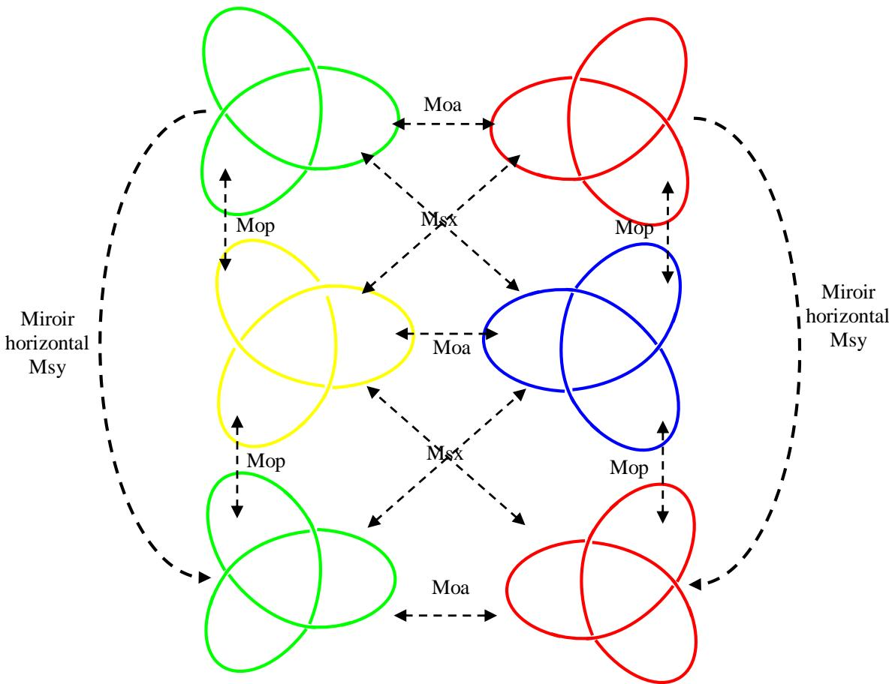

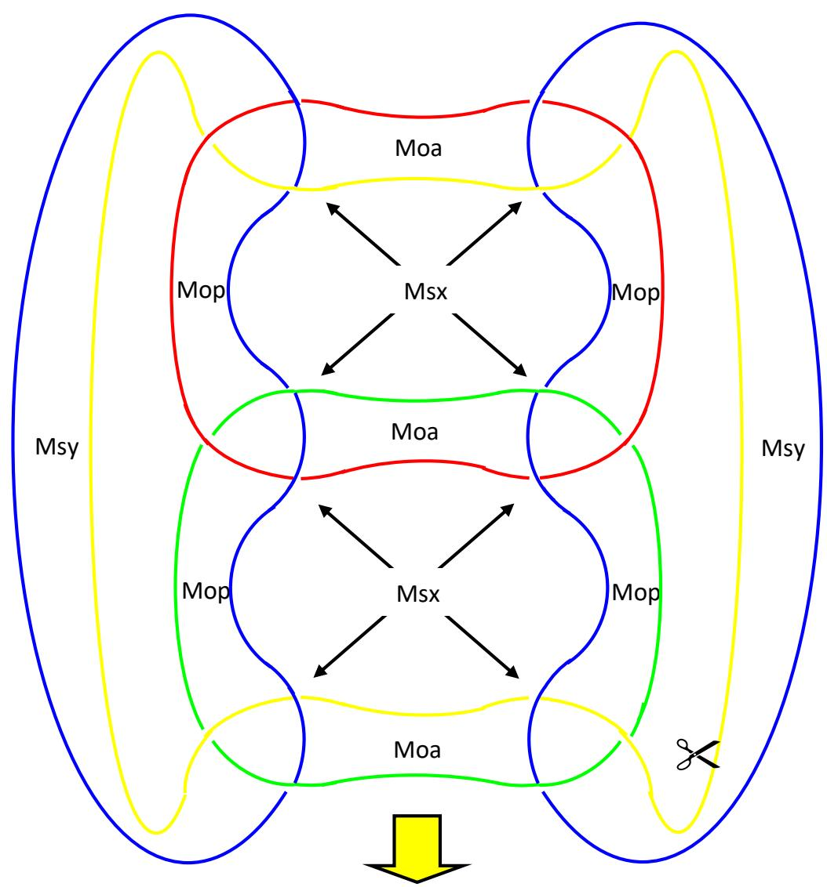

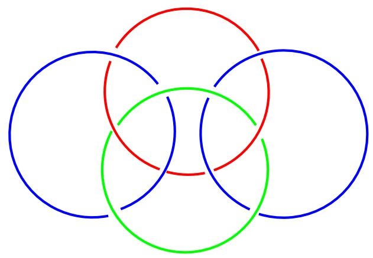

Le rond jaune enlevé correspond-il au démon – père ?

Comme je l’ai signalé précédemment, ce nœud partiellement borroméen selon le critère traditionnel, et complètement borroméen du fait qu’il ne présente pas d’enlacement, ce noeud présente une image dans le miroir subjectif, au contraire du nœud de Joyce, ainsi que je l’ai montré au chapitre précédent. Il est spéculaire c'est-à-dire que son image présente une différence d’avec l’original. L’aspécularité, c’est au contraire la similitude complète de l’image et de son modèle.

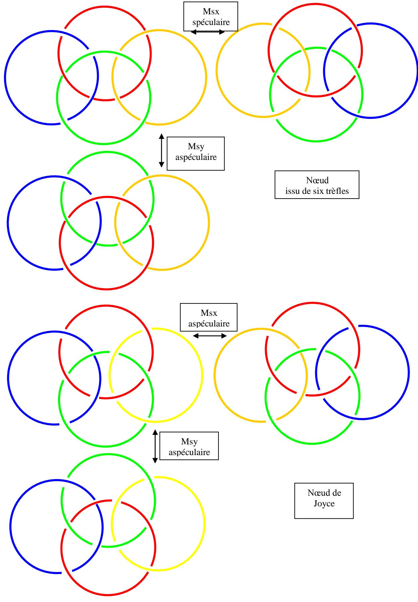

Rousseau disait que ce qui fait aller vers l’autre pour faire contrat social, la seule façon de sortir du narcissisme (lui, il disait : l’amour de soi), c’est la compassion. Chez Freud ça devient l’identification… au père mort. Au fait, c’est peut-être simplement le corps du père qu’elle vient de manger qu’elle cherche à compléter en elle ; voir le repas totémique, mode ultime de la compassion, et forme la plus élaborée de la tendresse selon Salvador Dali. On en vient encore à cet incontournable du transfert, subtile balance de l’amour de soi à l’amour de l’autre, de la libido du moi à la libido d’objet. La compassion, l’identification, est-ce un moyen pour faire le tour des miroirs possibles comme le montre les différentes transformations du trèfle, pour finalement, en faire la synthèse?

Alors, dire qu’elle me met en place d’objet a, … peut-être, mais cet objet, c’était l’image de son corps possédé par son père. Ce qu’elle me demande, c’est plutôt de s’en débarrasser, car, comme à chaque fois qu’il y a psychose, elle se ballade à présent avec l’objet a dans sa poche. C’est une jolie formule que j’emprunte à Lacan. Il fallait en passer par une réappropriation, par le fait de le mettre dans sa poche, car elle vaquait dans la vie à sa place. Maintenant, on peut parler d’objet partiel, de quelque chose qu’elle voudrait prendre à un homme, pour se débarrasser de la lourdeur de la jouissance restée accrochée au père, en elle.

Et moi, oui, je la mets en place d’objet a, au sens où lorsque mon ego est flatté, elle me complète. Et que j’aimerais bien réitérer cette expérience de complétude, malgré la destruction qu’elle m’impose à chaque fois.

Bien que mon message soit un peu long, je me rends compte que tout ça est encore dit bien trop rapidement. Tout ça n’est que tâtonnements que je soumets à votre appréciation.

## Omar, Estelle, Joyce, et Abibon

Quant à Omar, à ma grande surprise, il m’a donné aussi le sentiment d’être quelqu'un. C’est au sortir d’une de nos séances, dans laquelle il avait parlé de son père mort, que les voix se sont tues pour se mettre à chuchoter. Bon, 15 jours plus tard elles revenaient. Mais cet épisode m’avait rendu actif en me montrant que les voix pouvaient se taire. Que j’étais quelqu'un qui pouvait faire taire les voix (présomptueux, va !). Je lui ai donc demandé précisément quand elles étaient réapparues. En descendant les poubelles. Et quel sentiment vous aviez à ce moment-là ? Vous pensez, me dit-il, que je me suis senti humilié d’avoir à descendre les poubelles, et que c’est pour ça ? C’est vrai, ajoute-t-il, que ça m’a fait penser à mon ancien boulot, qui était de ramasser les poubelles, en effet, derrière le camion municipal. Je n’avais jamais osé dire à ma belle famille la nature de mon métier.

Et puis je lui rappelle que ça ne date pas d’hier, quand même, cette histoire d’humiliation. Oui répond-il. Pourtant mon père a eu la même attitude envers mes frères… ah tiens, mais pas de ma petite sœur. Elle, il l’emmenait en Algérie, nous, jamais. A elle il parlait, à nous, jamais. Je l’aimais bien cette petite sœur. Quand j’étais à l’école, si quelqu'un l’embêtait, j‘allais le trouver pour lui casser la gueule. J’avais le dessus parfois, parfois non, et là, en rentrant j’avais peur de la réaction de mes parents. Oui, dis-je, vous aviez peur, que… ? Il reste coi, et je me risque à compléter : vous aviez peur qu’ils vous accueillent d’un : ah, le voilà ! Il arrive ! Bon à rien ! (Je rappelle ici que c’est ce que disent les voix qui l’assaillent régulièrement).

Oui, normalement, en bon analyste, je n’aurais pas dû répondre à sa place. Oui, je ne suis pas sûr que je n’en ferais pas la remarque en ce sens à un collègue s’il me racontait une semblable intervention ; mais voilà, là, contre toute attente, ça m’est sorti comme ça, là aussi, pas calculé… après coup, je peux dire : le rond isolé de la voix, il ne va pas rentrer dans le nœud du sens comme ça, faut le pousser un peu. Faut faire des coupures et des raboutages, qui sont des opérations lourdes. Là aussi joue la compassion, l’identification, au sens où le sujet de l’énonciation énonce ce que prononcent les voix, mais cette fois en redonnant sens dans un transfert et dans une adresse, en nouant la phrase au contexte (S1 → S2) qu’il venait de me fournir. Ne pas oublier que les voix disent aussi : on va te prendre ta fille. Dans son récit, l’amour touchant qu’il portait à la petite sœur aimée du père me semble d’une part une tentative de suppléance au Nom-du-Père, d’autre part une tentative reportée à présent sur sa propre fille.

Alors là, si on dit que les voix, c’est l’objet a voix rejeté hors du nœud qui le constitue potentiellement comme sujet, je me suis identifié à cet objet en le faisant monter en position d’agent (soit : en position de signifiant) comme dans le discours de l’analyste, c'est-à-dire en lui supposant un savoir (un contexte historique qu’il venait de me fournir) subsumé sous le trait de fraction :

$$
\underline {{a}} \rightarrow \underline {{\S}} _ {\mathrm{S2} \quad \mathrm{S1}}
$$

A lui aussi je donne des signifiants, je dis quelque chose qui fait du lien, qui coupe et raboute. Ça peut aussi bien se traduire en terme de six trèfles avec rond excédentaire à couper que de rond supplémentaire à rajouter. Avant, j’ai pu écrire que la première opération représentait le travail dans la névrose et la seconde le travail dans la psychose. C’était d’avoir oublié que toute analyse est de toute façon une paranoïa dirigée, voire un autisme à deux.

Voilà, Omar, Estelle, je n’ai pas eu le sentiment de « faire » quelque chose, mais ils m’ont mis dans cette situation d’avoir à reconnaître qu’il y avait eu acte analytique, ce qui m’a mis en effet en position de « faire », de devenir beaucoup plus interventionniste, après coup, comme pour sauver de moi ce qui avait été déjeté, renvoyé aux poubelles de l’inutile. C’est donc comme si ce rond supplémentaire, cette suppléance, nous la construisions à deux. Ou : c’est comme si le tour des miroirs possibles, nous le faisions bien évidemment à deux. Sachant qu’à chaque désillusion, c’est moi qui me sens jeté aux poubelles de l’histoire analytique. Ce fil est tissé de nos échanges, dans lesquels il semble que l’écoute que je leur offre a porté reconnaissance, et donc positionnement d’un sujet de l’énonciation, fusse au travers d’un positionnement de l’ego ne cessant d’osciller entre complétude et décomplétude, fil supplémentaire à réparer l’erreur (nœud de Joyce), fil excédentaire à couper (nœud issu de six trèfles auquel, nom de dieu, il va bien falloir que je trouve un nom !).

Pour l’instant voyez, je ne sais pas faire plus que de superposer deux types de théorisation contradictoires. Ça ne m’embarrasse pas trop vu que Freud nous a appris que l’inconscient supportait parfaitement la contradiction et que c’est de ça dont je parle : de l’inconscient. Mais peut-être n’est-ce pas justifié, et que c’est alors une question épistémologique autant que méthodologique.

Qu’en pensez-vous ?

## Le forclusif et le discordantiel.

Ce que j‘en pense personnellement, c’est que je viens de tenir là un discours discordentiel, ce qui n’est pas sans rapport avec la psychose. Lacan a en effet posé la psychose comme l’effet de ce qu’il appelé la forclusion du Nom du Père. Ce terme de forclusion, il l’a emprunté à la célèbre grammaire de Damourette et Pichon, qui à ma connaissance furent les premiers à relever cette différence en français entre deux niveaux de négation, le forclusif et le discordantiel.

Le premier, le forclusif, correspond aussi à l’alternative exclusive « ou….ou… » (soit…soit…) la proposition A est soit vraie, soit fausse. Si elle est démontrée vraie, c’est qu’elle n’est pas fausse : ici la négation est forclusive, ce qui signifie l’absolu de son effet : elle forclos l’autre possibilité. Lacan a eu sa manière ironique de définir ainsi le vrai : c’est le contraire de ce qui est faux, disait-il dans, ce n’est sans doute pas un hasard, « les non dupes errent ».

Le deuxième niveau de négation, c’est le discordanciel. Elle est typique de l’inconscient, dont Freud nous dit qu’il ne connaît pas la négation, c'est-à-dire que les propositions contradictoires subsistent simultanément, et l’une, et l’autre. Le théorème de Gödel démontre que tout système formel contient dans son développement au moins une proposition contradictoire, dont on peut dire qu’elle est à la fois vraie et fausse, ou indécidable, dont on ne peut dire si elle est vraie ou fausse. L’exemple princeps est le fameux : je crains qu’il ne vienne. La négation est dite discordantielle, non parce qu’il manque le « pas », mais parce qu’il est impossible de savoir si ma crainte porte sur sa venue ou sur sa non venue. Ici, il est vrai que cet effet est rendu par l’absence du « pas » mais il est d’autres formes, qui selon les contextes, produisent aussi cet effet de discordanciel.

L’autre forme du discordanciel se trouve dans les formes du genre « ni…ni… » ce qui est ne choisir aucune option. C’est l’indécidable du théorème de Gödel. Lui, il le formulait ainsi : il est démontré qu’on ne peut pas démontrer si la proposition A est vraie ou fausse. La proposition est donc discordancielle car elle porte de la discorde en elle. Mais selon les contextes, cette impossibilité de conclure peut se dire : la proposition A est vraie et fausse (contradiction), ou : la proposition A n’est ni vraie ni fausse (indécidable). Par exemple le fameux « je mens » : si je dis vrai, c'est-à-dire qu’en effet je mens alors la proposition est fausse, puisque si je mens, c’est que je dis la vérité, donc que je ne mens pas : alors la proposition et vraie. Et s’il est faux que je mens, alors je dis la vérité, c'est-à-dire que je mens, et donc la proposition A est fausse, c'est-à-dire qu’elle est vraie.

Selon ce que j’ai cru comprendre de Lacan, la forclusion serait l’élision d’un signifiant princeps, le signifiant du Nom du Père. Lacan a eu plusieurs façons de concevoir la forclusion dite du Nom du Père. Car ce fameux « Nom du Père » a d’abord été pour lui ce qui désigne le père réel (avant 1950, période de son article « les complexes familiaux »), puis ce qui désigne une signification : ce qui donne une signification au désir de la mère, la mère désire ce qu’elle n’a pas que sous le nom de phallus elle croit trouver chez celui qui tient cette place de père. Ensuite, le Nom du Père devient, non plus une signification (c'est-à-dire en termes freudiens, une représentation de chose ) mais un signifiant (c'est-à-dire une représentation de mot). Le père, ce n’est plus le responsable biologique de l’enfantement, ce n’est plus ce que la mère désigne comme lieu de son manque, c’est tout simplement ce dont on parle comme tel.

Enfin, le Nom du Père devient une pure fonction, la fonction de la parole. Cette dernière conception est très proche de la précédente, celle du signifiant, car le signifiant est la parole en acte, c'est-à-dire telle qu’elle fonctionne. Ce serait l’extension du statut forclusif de la négation à toute négation.

## Lacan et ses différentes écritures de la psychose dans « le Sinthome »

1)Lacan posait le trèfle comme écriture de la paranoïa. En effet c’est ce que Lacan dit dans « Le Sinthome », le 16 décembre 75 :

Chacun sait que le noeud à trois, il y en a deux. Il y en a deux selon qu'il est dextrogyre ou lévogyre. C'est donc là un problème, un problème que je vous pose : quel est le lien entre ces deux espèces de noeuds borroméens et les deux espèces de noeuds à trois. Quoiqu'il en soit, si le noeud à trois est bien le support de toute espèce de sujet, comment l'interroger ? Comment l'interroger de telle sorte que ce soit bien d'un sujet dont il s'agisse.

Il fut un temps où j'avançais dans une certaine voie avant que je ne sois sur la voie de l'analyse, c'est celui de ma thèse : " De la psychose paranoïaque dans ses rapports, disais-je, avec la personnalité ". Si j'ai si longtemps résisté à la republication de ma thèse, c'est simplement pour ceci, c'est parce que c'est la même chose. En tant qu'un sujet noue à trois, l'Imaginaire, le Symbolique et le Réel, il n'est supporté que de leur continuité. L'Imaginaire, le Symbolique et le Réel sont une seule et même consistance. Et c'est en cela que consiste la psychose paranoïaque ».

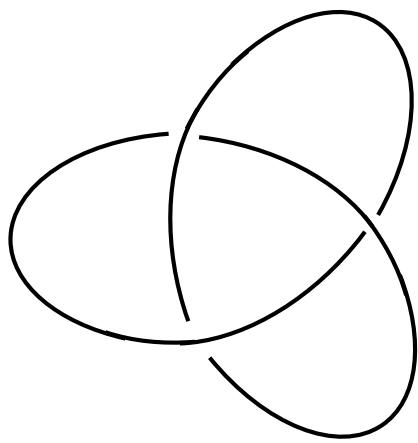

2) Comme rien n’est simple, le 17 février 76, il pose la psychose non plus comme « le nœud à trois » (expression par laquelle il désigne le trèfle), mais comme un ratage du nœud à trois :

je dirais que Joyce, que Joyce témoigne en ce point même (Fig.IIIa) qui est le point que j'ai désigné comme étant celui de la carence du père.

Ce que je voudrais marquer, c'est que ce que j'appelle, ce que je désigne, que je supporte du sinthôme qui est ici marqué d'un rond, d'un rond de ficelle (Fig.IIIa), ce est sensé par moi se produire à la place même où, disons, le tracé du noeud fait erreur. I1 nous est difficile de ne pas voir que le lapsus est ce sur quoi, en partie, se fonde la notion de l'Inconscient ; que le mot d'esprit en soit aussi, il n'est, est à verser au même compte, si je puis dire, car après tout le mot d'esprit, il n'est pas impensable qu'il résulte d'un lapsus.

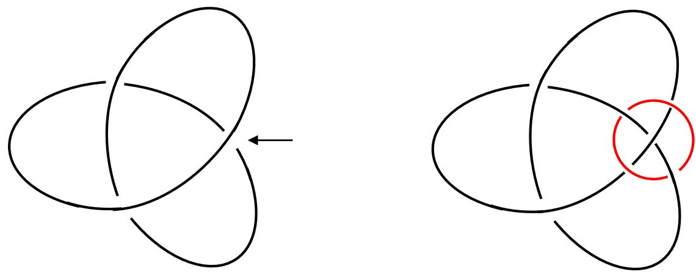

Evidemment, il n’emploie pas exactement les mêmes termes : ici, il ne parle pas exactement de psychose, mais de carence du père. Cependant chacun connaît sa théorie de la forclusion du Nom-du-Père comme corollaire de la psychose. Il avait établit cette équivalence en étudiant le texte de Freud sur Schreber, ainsi que le texte de Schreber lui-même. Freud l’avait classé « paranoïaque », mais avait souligné les très importants moments schizophrénique et autre. Il est donc clair que ce qu’il nous faut discuter, entre paranoïa et schizophrénie, c’est la modalité du discours et non la structure de la personnalité. D’autant que, dans l’extrait du 16 décembre 75, Lacan nous met à l’aise avec ça : la personnalité, c’est de toutes façons la paranoïa. Et c’est encore plus intéressant qu’il rapporte ça au lapsus, autrement dit à une formation de l’inconscient, telle qu’elle se retrouve chez n’importe quel névrosé, c'est-à-dire n’importe qui, en fin de compte. C’est la modalité d’écriture générale s’appliquant donc, en plus du lapsus – là, c’est moi qui fais l’extension, qui me semble tomber sous le sens – au mot d’esprit, au rêve, au symptôme.

Le point qu’il désigne comme carence du père est très exactement celui où le nœud a raté un croisement, point que je désigne d’une flèche. Dans l’autre figure, il montre comment peut s’effecteur une réparation grâce à un rond supplémentaire : c’est ça, le Sinthome. Il détaille ensuite comment ça fonctionne selon qu’on produit la réparation là où s’est produit le lapsus ou sur l’autre croisement devenu fautif de ce fait. Mais pour l’instant, ce n’est pas notre problème. L’important c’est de voir comment ici, il rapproche la dite « carence du père » d’un phénomène tout à fait commun et repérable chez tous. Ça relativise sérieusement la « forclusion du Nom-du-Père » comme catégorie bien à part.

3)Enfin, le 11 mai 76, Lacan attribue la psychose à un lapsus sur le nœud borroméen :

Supposez qu'il y ait quelque part, nommément là (Fig.I), supposez qu'il y ait là, quelque part, une erreur, à savoir que les coupures fassent ici une faute, qu'est-ce qu'il en résulte ? Le noeud borroméen a cet aspect, c'est-à-dire comme vous ne l'auriez certainement pas imaginé à prendre les choses, comme ça, de nature imaginaire, c'est-à- dire que, comme vous le voyez, grand I qui est là n'a plus qu'à foutre le camp ; il glisse, il glisse exactement (p11->) comme, comme ce que Joyce ressent après avoir reçu sa raclée - glisse, le rapport imaginaire, ben n'a pas lieu :

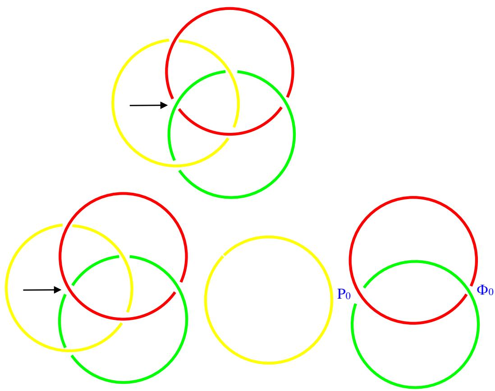

Bien entendu, Lacan venait de mettre ça en rapport avec le Nom-du-Père :

Le noeud bo, c’est ça, c'est la sanction du fait que Freud fait tout tenir sur la fonction du père. Le noeud bo, n'est que la traduction de ceci, c'est que, comme on me le rappelait hier soir, l'amour et, par dessus le marché, l'amour qu'on peut qualifier d'éternel, c'est ce qui se rapporte à la fonction du père, qui s'adresse à lui, et au nom de ceci que le père est porteur de la castration. C'est ce que Freud au moins avance dans Totem et Tabou à savoir dans la référence à la première horde ;

On voit donc que la question n’est pas simple, et que je me suis planté en faisant ma distinction entre le trèfle du point de vue de la surface et le trèfle du point de vue du trait. Je suis donc allé bien trop vite dans ma réponse à Carlos, auprès duquel je m’excuse ici.

Ce que je dirais aujourd’hui c’est que le trèfle représente à coup sûr l’indécidable : que ce soit du point de vue de la surface ou du point de vue du trait, on ne saurait en décider pour un dessus ou un dessous. Mais il n’y a qu’un rond de ficelle. Autrement dit il n’y a pas : un signifiant qui représente un sujet pour un autre signifiant : il n’y a pas d’autre signifiant ! Ça tourne en rond, comme dans une formation de l’inconscient, en effet. Ce serait donc plus proche de cette modalité de discours qu’on appelle schizophrénie ;

Par contre le ratage du nœud borroméen donne un enlacement : à question il y a réponse. Il y a au moins deux signifiants, certes identiques, et certes se pénétrant l’un dans le trou de l’autre. Ce pourrait être cette figure du paranoïaque face au monde : à question sans ambiguïté, réponse sans ambiguïté (le trait n’est pas coupé en deux comme dans l’écriture correcte du nœud borroméen). Le monde me menace, que ce soit par la voix ou le regard.

Voilà ce que je peux dire pour l’instant, et il va de soi qu’il faut poursuivre l’étude, ce que je ne manquerai pas de faire en rapport avec la pratique, sans quoi ça n’aurait pas de sens ;

## Psychose et nœuds, notules et réflexions en vrac.

Comme on le voit, Lacan ne s’embarrasse pas de constance dans l’écriture de la psychose. Une constante cependant, à travers toutes ces variations : le ratage du nœud, le lapsus. Ça vaut donc le coup de s’interroger sur ce qu’est un croisement. Mais à part insister sur cette identité avec le lapsus, Lacan ne nous en dit pas grand-chose.

Alors comment pouvons nous concevoir l’écriture d’un lapsus comme croisement ? il semble qu’on puisse le faire comme suit :

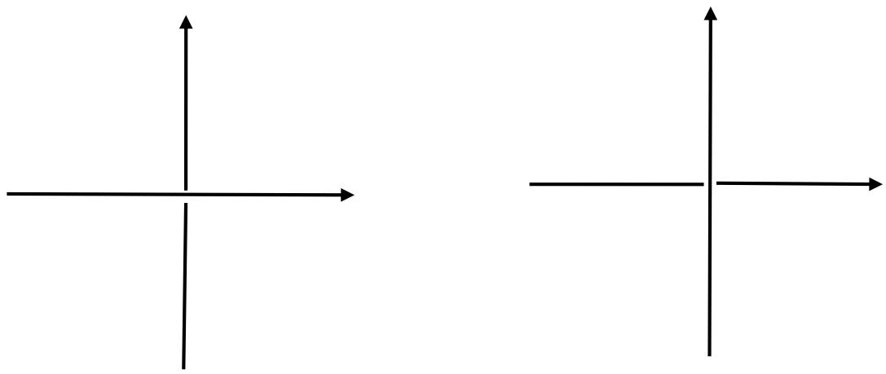

Soudainement ce qui était dessous passe dessus, et on entend un signifiant à la place d’un autre. Car il s’agit bien du croisement de deux signifiants, représentant la définition : un signifiant représente un sujet pour un autre signifiant. On peut supposer dans le cas le plus courant, le sujet rectifie aussitôt, soit en niant, soit en prenant en compte ce qu’il vient de dire. L’ouverture de l’inconscient qui vient de se produire se referme aussitôt, et le croisement reprend sa position initiale. Le lapsus était un échec du refoulement, et aussitôt après, il réussit, le croisement reprend sa configuration précédente. .

Mais il peut se produire que le lapsus dure, et c’est cela que nous appelons psychose. L’inconscient passe dessus et y reste, ce qui produit ce qu’on a appelé inconscient à ciel ouvert. Par exemple, cet analysant que j’ai appelé Pierre me parle des significations œdipiennes qu’il ne cesse de lire dans les comportements de son père et de sa mère. Son père le frôle en passant derrière lui, ça veut dire qu’il lui fait une proposition sexuelle. Sa mère exprime du liquide vaisselle en le faisant jaillir de la bouteille plastique, c’est une évocation à lui destinée de l’éjaculation.

Les conséquences ne sont pas les mêmes si le lapsus a lieu sur un trèfle ou sur un nœud borroméen. Sur un trèfle, ça produit un dénouage complet, équivalent à un rond trivial. Sur le nœud borroméen, ça produit aussi un rond trivial, mais parce qu’il se détache de l’ensemble, laissant de l’autre coté un enlacement.

Lacan rapproche la psychose du lapsus : un mot qui aurait dû rester silencieux (dessous) s’est brutalement imposé dessus, il s’est fait entendre. Et en effet ce mot, si on l’efface aussitôt d’un « ce n’est pas ce que je voulais dire, n’y faites pas attention », ce mot reste lettre morte, il n’attrape pas le statut de signifiant, exactement comme … tous les mots dans la schizophrénie.

Cette description ne convient –elle ? C’est un problème parce que Lacan renvoie la « folie » Joyce à trois écritures topologiques différentes, comme je l’ai expliqué plus haut. Ça voudrait dire que le ratage d’un croisement sur le nœud borroméen représenterait la. Schizophrénie ? Lacan a parlé de la schizophrénie de la fille de Joyce, mais il n’a jamais été aussi clair pour Joyce lui-même sauf le jour où il parle de la fille disant qu’elle manifeste ce qui était latent chez son père.

Alors on pourrait en rester à son affirmation de ce que le trèfle écrirait la paranoïa, et alors l’enlacement + un rond, la schizophrénie ; ça ne va pas non plus avec ses développements sur le ratage d’un croisement… sur le trèfle !

Ce dernier ne peut être que ce qui amène à l’autisme : un rond trivial, ça ne parle pas, si on s’en tient à ce postulat d’écriture qu’un croisement c’est ce qui fait le parole ;

Je guette le moment d’avoir le temps de reprendre me récit de mes aventures avec Estelle et Omar, afin de plonger ces questions dans le bain transférentiel qu’elles méritent.

Ne pas confondre : le nœud à 4 proposé par Lacan le 16 décembre 75, repris le 17 février 76 (peut-être était-il déjà là dans RSI j’ai la flemme de vérifier) et le noeud à 4 qui est réparation d’un ratage de croisement (11Mai 76). Le premier est obtenu ainsi : les trois ronds sont simplement empilés les uns sur les autres, le 4ème vient tricoter entre eux et les réunit de manière borroméenne ; le second est obtenu de la réparation d’un ratage de croisement sur un nœud borroméen déjà constitué. Ce dernier n’est borroméen (selon le critère « on en coupe un et tous sont libres ») que pour les deux ronds centraux.

Je dis ça paske souvent, quand on parle du « fameux 4ème rond » on pense à celui du premier nœud borroméen à 4 : ce rond représente le Nom-du-Père. C’est le cas en effet dans ce noeud là et plus dans le nœud de Joyce, où il représente l’ego.

C’est intéressant paske ça pose la question subsidiaire : l’ego fait-il fonction de Nomdu-Père, si ce dernier est forclos ? il semblerait que ce soit le cas pour Joyce puisque son souci de donner du travail aux critiques pour 300 ans, c’est bien un souci égotiste, mais ça rejoint sa préoccupation pour le nom : ainsi son nom ne sera pas oublié pendant 300 ans.

Mais ça nous éloigne de la question que je posais de l’ego que nous tissons à deux dans le transfert (Omar, Estelle et moi). Quoique peut-être pas, après tout.

J’ai déjà conçu mes propres façons de rater le nœud borroméen, qui ramènent ce dernier au trèfle. Nous en avions déjà parlé, c’est une écriture séduisante parce qu’elle permet de séparer en deux temps la forclusion de phallus et celle du Nom-du-Père. Il faut deux coupures et raboutages distincts pour obtenir le trèfle.

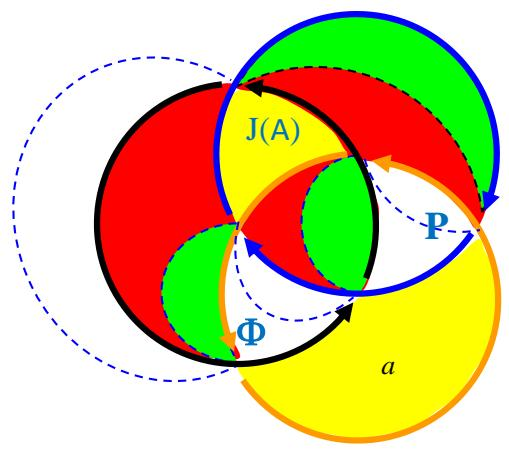

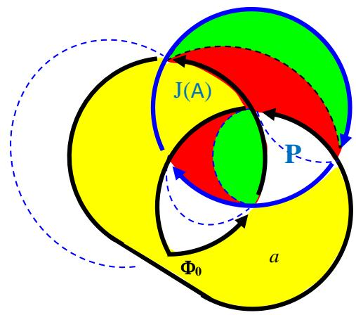

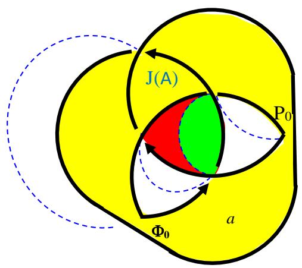

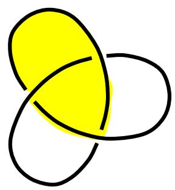

Voir le 21 janvier 75 (RSI) où Lacan raconte ce qu’il y a de plus proche de la démonstration ci-dessus.

Et puis dans les deux cas cliniques (Estelle et Omar) présentés dans ce texte le mécanisme topologique est le même, mais son interprétation va à l’inverse : pour l’un ça sépare la voix du corps, il est dans son corps et il entend des voix. Pour l’autre c’est l’inverse : elle se présente comme une pure voix sans corps, tandis qu’une autre usurpe sa place chez elle. Je trouvais la symétrie assez belle.

J’avais aussi trouvé aussi l’inversion d’une torsion sur la bande de Mœbius qui ramène le sens des torsions à l’homogène, c'est-à-dire au trèfle.

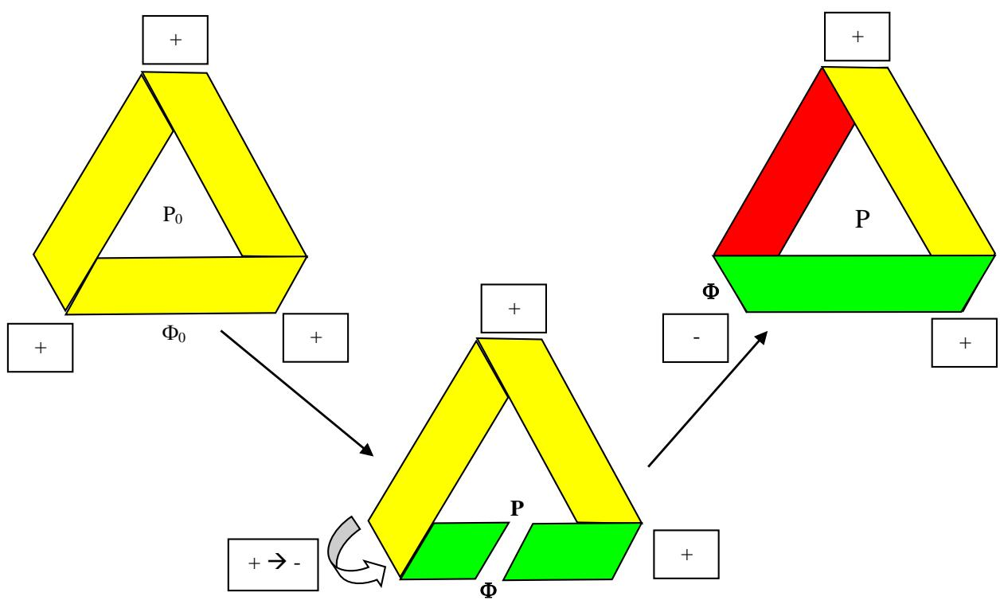  
Je rêve du jour où j’aurais le temps de tester ces diverses modalités avec la pratique. Peut-être je vais le faire en élargissant l’article que vous commentez.

Je cite Freud : ce qui est pris pour la maladie (le délire) est en fait une tentative de guérison. La même démarche soutient toute la démarche de Freud : le lapsus, qu’on tente d’effacer aussitôt produit, c’est une erreur mais il la prend comme une vérité. Le rêve, qui passait aux yeux des scientifiques pour un phénomène désordonné et sans importance, il le prend comme un phénomène dont il décrit rigoureusement les lois, et d’une importance cruciale. Le symptôme, pris par les psychiatres comme quelque chose à éradiquer au plus vite, il en fait au contraire le soutien du sujet, ce que Lacan reprendra à travers sa théorie du 4ème rond. Lacan appelle d’ailleurs lapsus le fameux ratage du nœud, ce qui est une bonne manière, à mon sens, de rapprocher la psychose – ou la folie, comme il dit souvent dans « le Sinthome » – de la normalité la plus banale. La différence serait juste entre un lapsus momentané sur lequel on revient très vite, et un « lapsus » qui dure… il est vrai qu’un lapsus révèle un vérité qu’on voulait tenir cachée, et c’est bien le cas de l’inconscient à ciel ouvert de la psychose.

Exemple classique :

lapsus : (je prends le premier qui me vient sans chercher) : « tu es mon frère, oups… euh non, ne va pas entendre « tuer mon frère ! », c’est pas ce que je voulais dire »

délire : j’entends des voix qui disent « on va tuer ton frère ! » c’est pas moi qui l’ai dit hein !

y’a juste un différence de modalité. Dans les deux cas, le sujet n’assume pas son désir de tuer son frère. Mais il le dit.

Donc ok pour l’erreur comme tentative de réparation. Je dirais : comme tentative d’écriture, puisque ce n’est pas assumé par le sujet comme sa parole propre. L’erreur en ce sens est bien de tenter de faire jouer le symbolique au niveau où le sujet l’autorise à jouer, c'est-à-dire dans une écriture qui se voile derrière une modalité faisant perdre à la parole son statu d’énonciation.

C’est pour ça que je tiens beaucoup à cette question du sujet de l’énonciation (dans un transfert), que je ramène à tout bout de champ, paske c’est crucial. Ce n’est pas subsidiaire, c’est LA question.

Je n’hésite pas à appeler le rêve une psychose locale, comme Freud. Et, suivant Lacan dans « Le sinthome », le lapsus comme une psychose locale. La différence est juste que ce qui se défait se refait au réveil ou à la reprise d’un discours policé. Attention ce genre de propos ferait hurler dans les écoles de psychanalyse.

Topologiquement, rien n’interdit que ça répare complètement. Evidemment avec le modèle de la réparation de Joyce, non, le rond jaune ne s’en va plus, mais l’enlacement demeure, ça ne restitue pas un nœud borroméen ad integrum. C’est peut-être ce qui se passe souvent. Mais il y a le modèle du nœud à 4 réparé, du nœud à 4 issu de six trèfles, le modèle du passage du trèfle au borroméen, qui restitue un nœud borroméen ad integrum, comme neuf.

Je pense à une jeune femme ramenée par la police à l’hôpital une nuit en urgence. Ils l’avaient trouvée errante sur le périph, persuadé que les extraterrestres allaient venir la chercher. Bon, c’était il y a cinq ans. Actuellement elle est sur mon divan. Son délire est tombé peu après son arrivée à l’hôpital pour être remplacé par une manie assez classique. Mais je l’ai prise tout de suite en analyse, elle a accroché et elle est actuellement toujours sur mon divan. Elle n’a plus jamais déliré, et la manie a cédé aussi. Je ne perçois pas de différence actuellement entre elle et mes autres analysants névrosés.

Tout ça n’est-il donc que roupie de sansonnet ? Ou bien chacune de ces écritures puisqu’elle existe comme écriture, écrit-elle des modalités différentes de se positionner dans la parole ?

C’est le travail qui nous reste à accomplir que de tester tout ça dans le rapport à la pratique.

On peut imaginer un nœud borroméen à n ronds, il suffit qu’un rond soit coupé pour que tout parte en quenouille. C’était l’idée de Lacan dans « Encore », je crois. Ça colle bien avec l’idée du Nom-du-Père, signifiant très spécial. Ça colle pas avec les déclinaisons : forclusion du phallus, ratage d’un croisement etc…

Il y aussi l’idée que j’ai proposé d’un autre critère de borroméénité, celui qu’aucun rond n’emprunte le trou d’un autre… c’est encore autre chose, en rapport avec l’inceste

Qu'est-ce qui fait nœud, point de capiton entre Estelle et moi ? le rêve en dit beaucoup plus long que n’importe quelle spéculation ; à condition de n‘interpréter ce qui n’est pas de la spéculation.

Le rêve montre que sont réactivées chez moi des angoisses de morcellement. Ce qui fait que ça tient, ce qui nous tient tous dans la boulangerie, c’est l’orage extérieur.