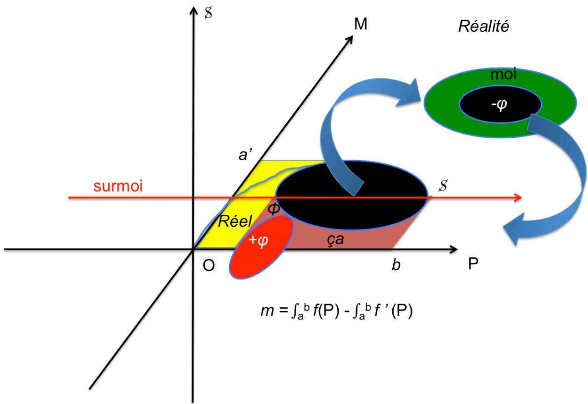
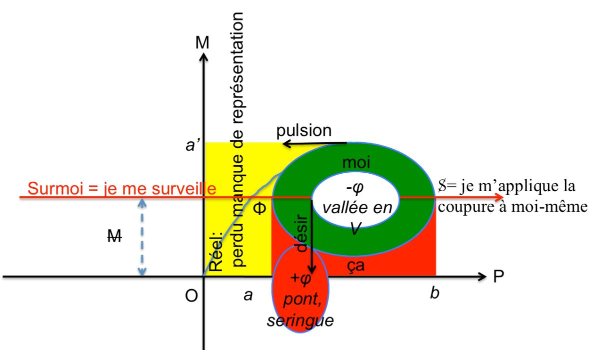

# 梦与数学

我曾承诺要将我那个关于心理装置的数学表征尝试与实践结合起来，该尝试已在以下文章中展开：  
<http://une-psychanalyse.com/calcul_integral_et_differentiel.pdf>。

现基于一个近期的梦，给出这一结合：

我在一条路上，寻找方向。我来到一个十字路口，那里有路牌，但不全。没有任何一个指向我感兴趣的方向。再往前，另一条路，另一个十字路口，也许那里会有更多路牌。

于是我去另一个十字路口，我选择了我的路。

我意识到我犯了个错误。我本该……这是关于药物的事，甚至是打针……给某个人打针。情况非常紧急。我必须回去；于是我立刻离开原路，掉头折返。我穿过一条很深的V形山谷，我不知道自己怎么做到的，我走过一座高架桥，跨越了这条很深的山谷。

我到了工作地点，我正在送快递。我是个快递员，Chronopost 或类似的公司。我和一个同事（男的或女的）在一起，我们很早就干完了，大约十一点半。我还有另一份工作。我想是医院的那份；我可以马上去，但还没到上班时间。同事说还有别的事要我做，但她说时间不够。也许我该在空闲时躲起来。但我回答说，我不必躲藏：如果我干完了我的活儿，那就是干完了，怎么着。如果是我自己做主的话，我早就去另一份工作了。

她带我去食堂。有一种链条式的东西升上去，带着金属面板；食物在那些小金属篮子里升上去，同时它也给我们当电梯用。人们站上去；人很多，像个大学食堂。

我一点都不饿，因为十一点半太早了。

一开始，我立刻认出了实在界——那个我注定迷失的地方，因为那里没有指路牌，也就是说没有表象。所以我必须返回，去那些标示更清楚的地方。和往常一样，正是在实在界的边缘，在从那里返回的路上，我发现了性。V形山谷是女性性器官。所以打针一定是插入。这就是阉割的药物。就是用菲勒斯堵住洞，这里用注射器来代表。高架桥是另一种方法：从上面跨过去是跳过它的一种方式。

在现实中，我正担心我的护照接收问题——一家签证公司应在办妥中国大使馆签证后把它寄回给我。他们应该通过 Chronopost 寄给我。但两天前我给大楼管理员打过电话：没问题，我的 Chronopost 包裹已经到了。我想这对我的无意识来说还不够，它决定我就是 Chronopost 的快递员：这样更稳妥，尽管意识完全知道没什么可担心的。这是一种在并没有缺失的地方处理缺失的方式。

我干完活儿的时间，恰好是我通常在诊所开始真正工作的时间。这里，是超我的介入，它在我睡着时也监视我。它接替了老板们的角色，检查我是否好好工作，是否无所事事。在诊所，当某个分析者连续几次爽约，而秘书处又没在我的格子里放新病人的档案时，我有时会感到内疚。这并没有什么可内疚的，因为我做了我的工作，病人不来我也没办法，同样，如果我在秘书处的格子里找不到新病人的卡片，我也没办法。超我就是这样：我自身的一部分，在内部接替了外部的监视，而外部监视本身又接替了父母。

这正是将心理装置切分为意识和无意识的东西：对于这些有关中国签证或我在诊所工作的忧虑，我是完全意识到的。而睡眠并不能使我摆脱它们。然而，任何忧虑，通过相似性，都会唤起基本的忧虑——阉割焦虑，它位于实在界的边缘，在那里我们会迷失。相反，这些焦虑则完全是无意识的。

对于主体来说，摆脱困境的好办法是想象自己是自身遭遇的负责人，而不是承受外在的命运。成为司机，或成为 Chronopost 的快递员，就是让外部进入内部的一种方式，换句话说，就是把现实转化为表象。这就是孩子在 *fort‑da* 游戏中所做的：把代表母亲的物体扔向远处，他便获得了一种满足感，即他自己引发了母亲的离开。这样，在无法保留其爱之对象的情况下，他通过自己主动把它扔掉，而将自己作为主体带到世界上。我想，在爱情故事里，人人都知道这个道理：当你觉得事情不对劲时，你先离开，以免被抛弃。即使这是想象性的，但出于自己主动做出的姿态——这个表达出现在这个梦里——象征着在现实中无法掌控的东西。我是切割 [coupure] 的驾驶者，这条切割通过自我交合 [se recoupant]，在现实的第三维度中释放出一块垫圈。正是在这里，我们可以理解“前‑切” [acoupure] 必须自我交合才能成为切割的必然性：这是应用于自身的法则。切割——即来自外部的监视——我现在把它应用于我自己。我在外部空间中赢得了自由，因为是我自己决定将法则应用于自身。我成为我自己，也就是说能够计算我的自我的表面积……通过对我的自我表面积加以限定，也就是对我的自由的一种模仿。这就是我在参考文章中提到的积分计算问题。  
<http://une-psychanalyse.com/calcul_integral_et_differentiel.pdf>

这正是我所阐述的：必须把主体功能一分为二，以便通过积分来计算自我垫圈的面积。

对于实在界，这行不通。即使在另一个十字路口，也缺少路牌，即表象。对于现实，它是可行的，但害怕失去护照的焦虑，却附带地引来了阉割焦虑（没有药物，没有注射剂来堵住女性性器官，来跨越那条山谷）——那种被剥夺一切与现实中的他者接触的手段的原始焦虑。但说到底，另一个十字路口的路牌是有的：只需解码隐喻即可。真正让人找到方向的，正是药物（注射剂），它修复了这个由阉割（V形山谷）清楚标示出来的缺失，并充当了十字路口缺失表象的替代物。梦在这方面说得很清楚：我忘记了药物，忘记了注射。也就是说：我压抑了它们。相反，缺失的路牌则没有被压抑，也没有理由被压抑：它们就是不在那里而已。这对应着弗洛伊德所称的“原初压抑”——这个说法并不太恰当，因为那里并没有压抑。正是为了找到这样的路牌，我突然记起了我的错误，也就是我的遗忘。但那些路牌却唤起了阉割，因此它们只以隐喻的伪装形式出现。然而，注射剂可以制造一个洞，从而避免必须去承受它本身。它要来表明：不，最初并没有洞，是我要去做这个洞，就在我填充它的同一时刻。同样，桥也让人能够跨越深渊。

  
从切割中掉下的是菲勒斯 =  
表象“阉割”将表象的缺失隐喻化

驱力和欲望之间的区别在这里表现得相当清楚。驱力把我推向实在界的领域，那里我在寻找并不存在的路牌。所以我掉头转向欲望的道路，欲望知道它的目标——失落的菲勒斯，即使是以编码的形式。在两种情况下，我们都看到了函数的导数被书写出来，因为驱力在那些对我毫无意义的路牌（我不感兴趣）和那些不存在路牌之间漂移，而欲望则从否认（除了我自己用注射器制造的那个洞之外，没有别的洞）漂移到不可或缺的解决方案（如果有一个洞，那么就一定有一座菲勒斯式的桥来跨越它）。也就是说，在这两种情况下，都是从 f(x₀) 到 f(x₀ + h)，当 h 趋近于 0 时——对于驱力，是表象缺失的零；对于欲望，是阉割的零。

那么梦的结尾——那个奇怪的食物电梯呢？既然它既能运食物也能运人，我推断人可能也是食物。退行到口欲期，吃就是把留在外部的东西——实在界——放进内部。因此，我们面对的是制造表象的机器，也就是象征功能的一个形象。它也同样站在实在界的边缘，就像菲勒斯一样，后者是另一个形象，因为它是生殖的工具。这台机器既能吞食人也能吞食食物，因此它既能制造人也能制造物。这让我不由想起 Janet Cardiff 作品中那台以猫和婴儿为食的机器。参见：<http://une-psychanalyse.com/inhotim.pdf>。

这台机器似乎是一所大学食堂的一部分：这相当于说，通过吞食我们所不知道的东西来生产知识。这再次是制造表象。

2015年5月2日
