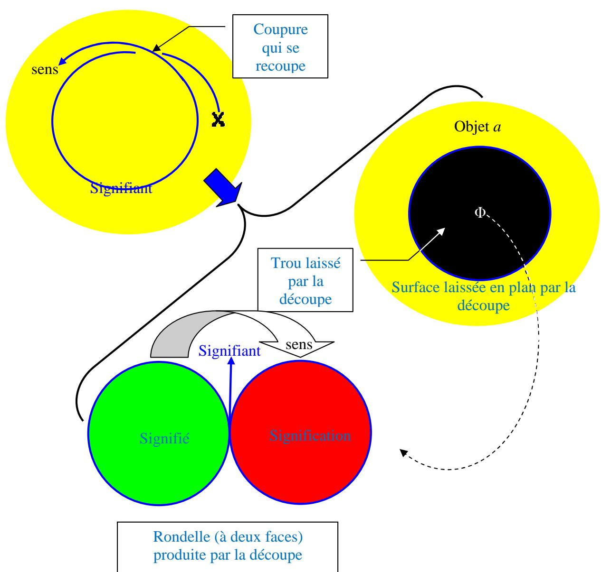
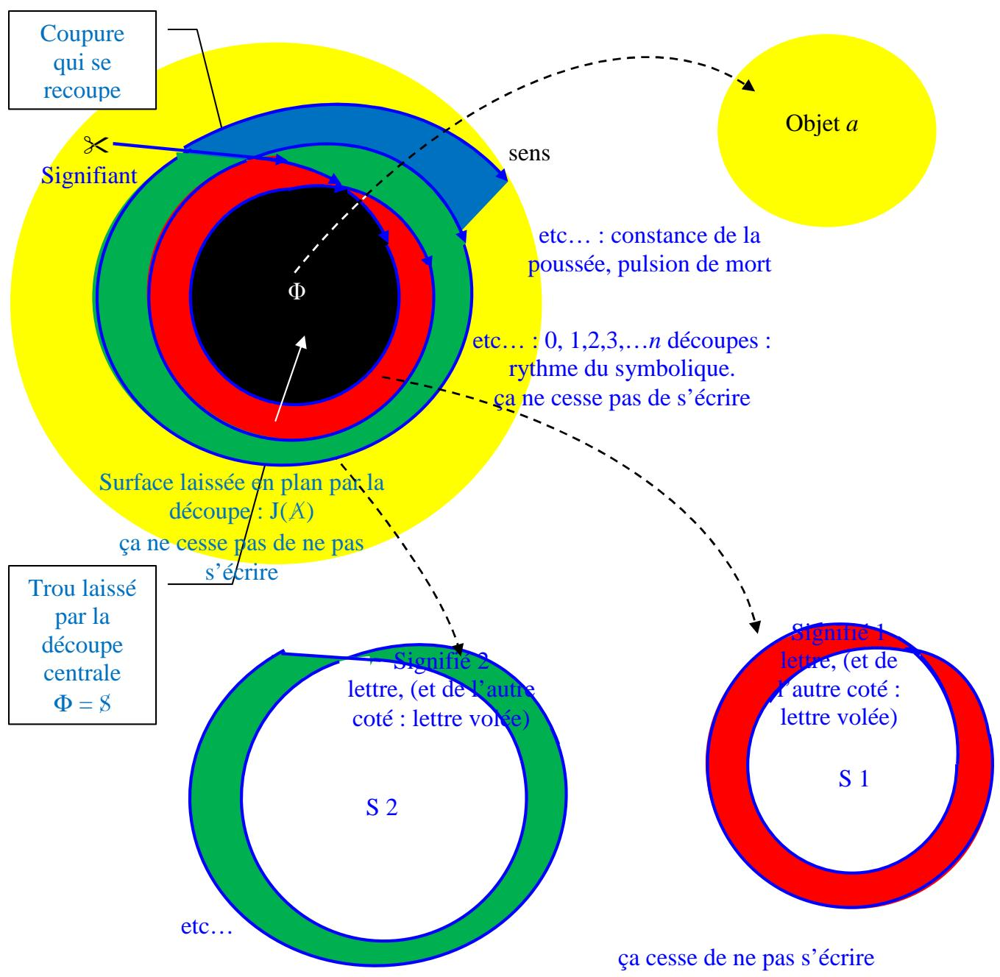
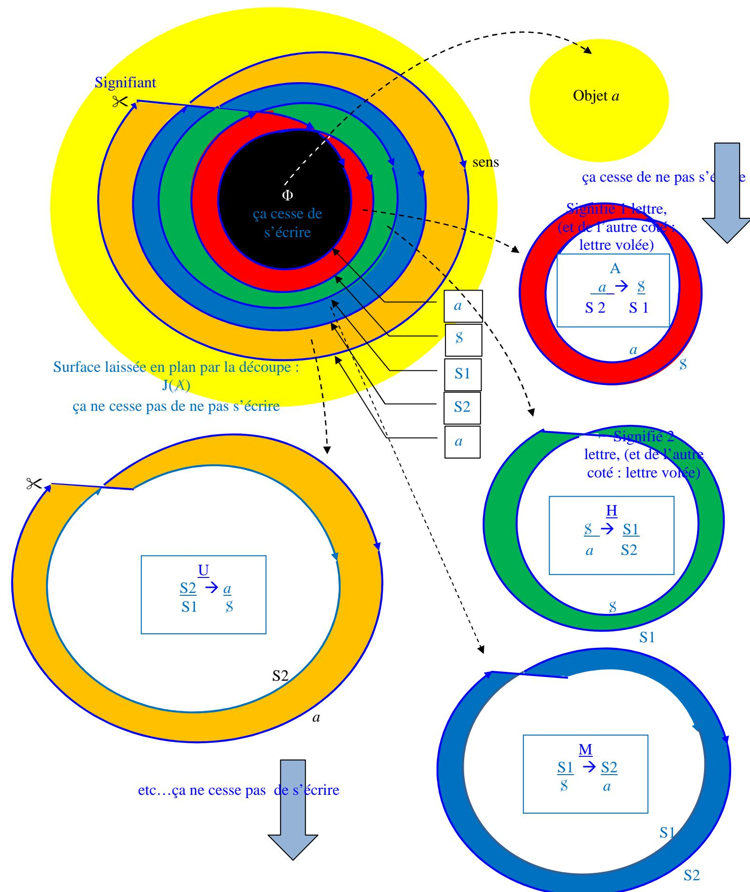
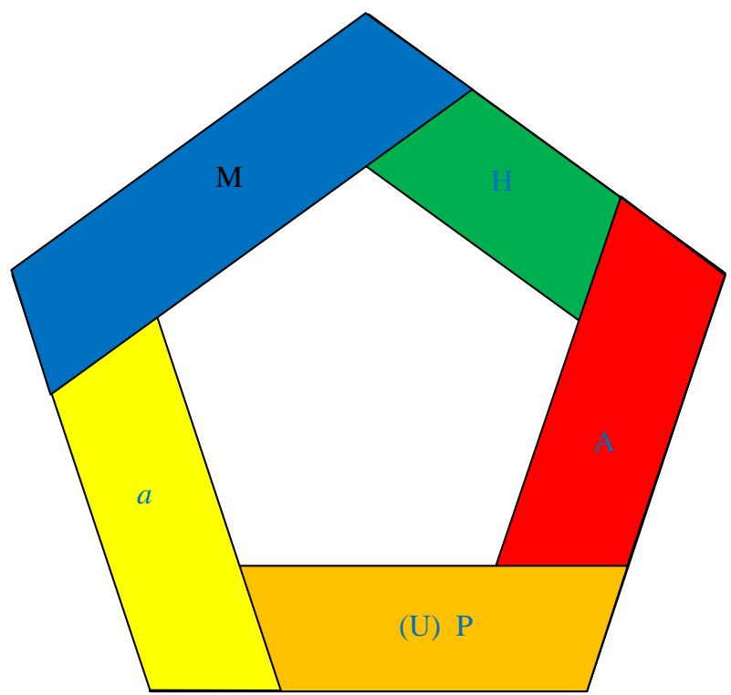
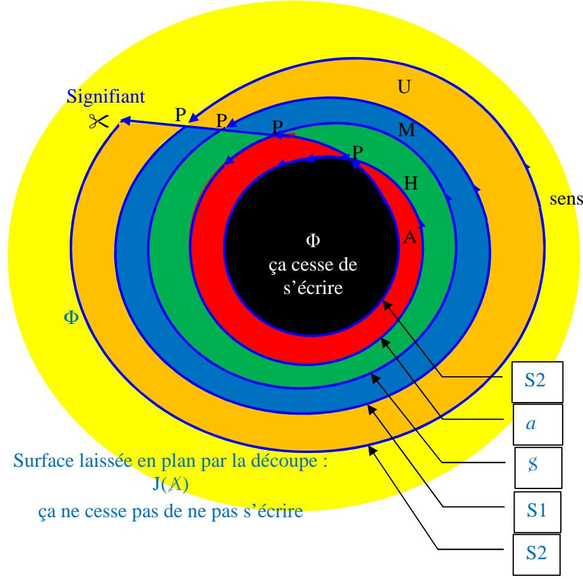
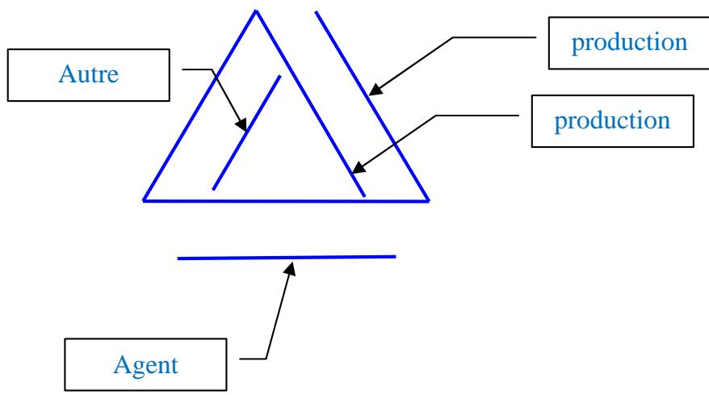
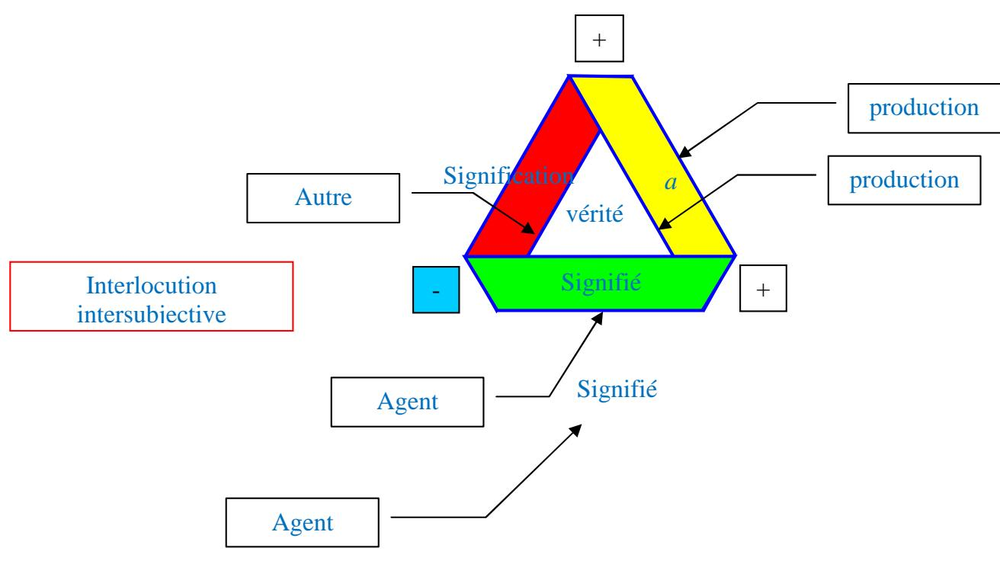

## 死亡驱力、象征界与四种话语

在不少文字中，我曾使用这一理论建构，并称之为“垫圈理论” *[théorie de la rondelle]*：

在“精神分析”论坛上与 Liliane Fainsilber 和 Jean‑Baptiste Beaufils 的一次关于死亡驱力的讨论，促使我参照拉康在研讨班 II 最末处的一段引文，来明确死亡驱力与象征界之间的关系。那段引文如下：

> “我们正是在这里触及象征秩序。象征秩序并非力比多秩序——自我以及所有驱力都铭写入后者之中。它趋向于超越快乐原则，超越生命的界限，因此弗洛伊德将它等同于死亡本能。请重读那段文字，看看它是否值得你赞同。象征秩序被排除在力比多秩序之外，后者囊括了整个想象域，包括自我的结构。而死亡本能只是象征秩序的面具，因为——弗洛伊德这样写道——它是沉默的，也就是说，它尚未实现。只要象征性的承认尚未确立，按定义而言，象征秩序便是沉默的。象征秩序既是不在场的，又是执着于存在的——这就是弗洛伊德在跟我们谈论死亡本能作为最根本之物时所指涉的东西：一个处于孕育之中的、正在到来的、执着于实现自身的象征秩序。”

为表明拉康所做的这种死亡驱力与象征界的等同，我觉得以如下方式呈现我的垫圈理论更为恰当：

  
在各圆环 *[couronnes]* 中，所指是表面，能指是边缘。

死亡驱力之推力 *[poussée]* 的恒常性：即能指围绕中央吸引性空洞——即欲望之因的对象 *a*——缠绕的切割 *[coupure]*，这个对象 *a* 由菲勒斯以空洞的形式代表（对象 *a* 总是已经失落的）。只要它尚未自我交合 *[se recoupe]* [^1]，它就仅仅是“前‑切” *[acoupure]* [^2]，因为它无法分离出一个碎片：它不能产生对象，也就是说它不产生所指。但是，一旦它自我交合，它便分离出一个碎片，我们称之为所指，并借此建构我们的“现实”——首先是从围绕身体各孔洞组织起来的身体形象。事实上，孔洞正是经由大他者（即语言）而与另一个相似者发生关系的场所：母亲将婴儿的啼哭解释为要求某个洞被填满（嘴巴）或被排空（肛门）；孩子要求其眼睛的洞被她的在场填满，或母亲要求它被清空……反之亦然，如此类推，带着人们想要的一切细微差别、反转和倒置。对于每一个这样的洞，孩子在其与另一个相似者的关系中，要体验的是 *fort‑da* 游戏：把物推到外面，再把一个替代品以表象的形式放回里面。这就是象征界的工作，也就是死亡驱力的工作。

而且，在自我交合时，最初的“前‑切”变成了切割 *[coupure]*，后者产生了一个对象和一个洞。于是，象征界的节奏性和不连续性（即“离散性”）便由此引入。这是同一种切割——它们听起来一样，“前‑切”和“切割”同音——但它们对立，正如连续与离散相对立。就像一条莫比乌斯带，它同时是从一面到另一面连续过渡的场所（因此它只是一条切割），又是将三个离散区域分开的三次扭转——这种书写是由任何主体与对象的关联所必需的摊平操作强加的（我从主体视角看莫比乌斯带这一对象：没有注视它的主体，就没有对象）。

在日常语言中，驱力 *[pulsion]* 与人性中动物性、野蛮的那部分联系在一起。嘿！管管你的冲动 *[pulsions]*！

然而，我们对它原初所是的东西再也无从知晓，除非像弗洛伊德那样以神话的方式重构它，比如在《图腾与禁忌》中。就连他的驱力理论，他也视之为一种神话学。确实，它只由后构 *[après-coup]* 的重建构成；此外，当弗洛伊德描述其运作时，他注意到它是符合语法的：主体和对象的倒转、转向自身、内容的转化（爱‑恨）。由于无法抵达起源，剩下的只是一个洞，这就是我书写中的中央空洞。

从根本上说，死亡驱力就是谋杀物：因为弗洛伊德正是将人性的开端置于此处，即他在《图腾与禁忌》中发展的神话。正是由于对支配雄性首领的谋杀，杀人兄弟们被迫达成协议，因此必须彼此交谈，以避免最强者的暴政卷土重来。这就是法律之必要性的起源，尤其是后来规定妇女交换的法律（这次是列维‑斯特劳斯的话）。简言之，乱伦禁忌的法律，根本上就是对作为物的母亲的禁止，也就是说，作为对物的禁止的隐喻：词语不再是物本身。图腾的竖立便是明证——图腾是死去父亲的菲勒斯象征，是这一法律和禁忌的保证者：它是作为能指本身的象征。这也是为了回到拉康关于语言起源的说法：那是第一座坟墓。父亲只有死后才成为父亲，也就是说，通过象征界的效果，也就是死亡驱力的效果：在此之前，他不过是最强者。正是这一谋杀使得分配妇女成为可能，也就是组织起与阉割的关系。因为，对死亡作出回应的正是性；死者的缺席在隐喻上被两性关系中菲勒斯的缺席所接替。

拉康由此推导出他的精神病理论，至少在这一方面，它与弗洛伊德的学说相去不远。弗洛伊德说：精神病患者把词语当作物。拉康补充道：这是父之名除权 *[forclusion du Nom-du-Père]* 的过错，也就是说图腾不运作，禁忌被违反。

最后，死亡驱力——他在晚年“发现”的那一个——到底是什么？它是支配驱力 *[pulsion d'emprise]*，换言之就是死亡驱力，亦即象征界试图在某个“实在”逃脱它的地方制造表象的努力。弗洛伊德指出的那种著名的好奇心——他总是说它是性化的——正是这个：去抓取那些逃脱之物，那些无法看见、无法听见、无法理解的东西，以便把它们纳入表象的库存。驱力中循环的实在，不如说是驱力所排除、绕开的实在部分，它试图让这部分进入它的环圈（参见研讨班 XI 中的驱力图式）；但这一尝试总是失败：每当有新东西被再现、被编录、被象征化，人们就会意识到，有另一些东西——实在——逃脱了。我用后构的方式将其表现为一片无限制的黄色表面，它支撑着我的整个书写。它被象征界的工作驱逐出去，这写在了中央空洞里——那个被假设为“对象 a”的垫圈正是从这里被弹出的。这是一种对假设起源的神话性重构，借助语言进行，因此遵循语言的规则，也就被这一语言格式化。

弗洛伊德就是这样展开他关于驱力理论的例子的：寻求看，寻求被看，寻求让自己被看。打，被打，让自己被打。主动、被动、自反：这是动词的运作方式。这也是象征界的运作方式。尤其是在这个击打、敲打或让自己被打的驱力中，那正是象征界试图掌控他者的痕迹。

诚然，文明也要求我们对这种无餍足的探索设立界限。象征界一方面趋向于为实在设限，另一方面趋向于为自身设限——即所谓的给边界设定界限。我们给孩子设立界限，体罚常常以这种文明化的必要性来辩护。但正是在这里，成年人不再知道自己的界限。正是在这里，他们表现得比孩子更不文明。正是在这里，他们不明白：那些不得不承认的界限，首先应当是自己给自己设立的。

我们可能以为是驱力所描述的那种“自然”，确实是一个失落的范式，正如埃德加·莫兰所说。驱力已经是文明，已经是象征界，已经是语言。力比多已经是一种秩序安排：有自我的力比多和对象的力比多，二者相互限制。如果我完全是自恋的（自我的力比多），我就会在孤独中枯萎：因此我会被推向他人。如果我过于关注他人（对象力比多），我的自恋又会不时地推动我隔离自己。

这就是为什么，关于实在，最好的定义仍然是拉康给出的那个：它是不可 能 *[l'impossible]*；这不是一个自然主义定义，它不赋予实在任何内容，这让我们省去了诸如“能量”这类神话概念。它只限于描述我们可以观察到的效果：每当我遭遇一个不可能，我就称之为实在。我无法穿过这堵墙。我无法飞翔。我不能一开口就说中文。实在抵抗象征界的掌控，因此不断推动象征界投入运作。但正因为象征界创造了实在——即象征界所遗漏的东西——才如此；没有象征界，就没有实在。

在算术中，人们发现了一些规则，使得别无他途：这就是象征界的实在，但这是就它排除了那些未经定理证明的其他道路而言的。正是这些其他道路构成了实在。

例如，不可能用圆的直径来和谐地分割圆周。因此这是一个实在，但可以称之为“象征界的”实在，因为它是象征界所设定的一套字母内部的一种限制；我们通过一个象征性的强力举措——即设定字母 π——来摆脱它。顺便说一句，这倒是精神分析的一个漂亮隐喻：与其无限重复对余数的分割（那便是重复），不如设定一个字母，比如说“我还是尿床，但我无所谓！”

最终变成：

我们注意到，中央空洞——对象 *a* 被挖掉后留下的洞——与结构的外部空洞连接起来。这个中央空洞代表着言说向菲勒斯功能的过渡，记作 Φ。为什么是菲勒斯？因为能指的表征——它是可听的——就是把某种完全短暂的东西放到不在场的物所在之处。而菲勒斯正是表征的这个概念，它把某种男性性的东西置于女性仅呈现为缺席的那个位置。换言之，菲勒斯代表着阉割——一个器官的丧失，它给出了一切言说所预设的物之丧失的形象。这不是自动发生的：这种痛苦的丧失以症状为标记，症状是一封代替不可言说之物的字母。

言说，相对于那个不停书写的症状，代表着使其停止书写的解释。言说本身，在陈述行为 *[énonciation]* 的共鸣中，确实是不被书写的。被铭写下来的，是对所听到内容的记忆。而这就是能指——因此它是一条边缘，一侧是一个“洞”：即处于行动中的陈述行为，另一侧是一个表面：即陈述 *[énoncé]*，即人们对所说内容保留下来之物。环绕这个洞的切割，也就是在话语中代表对象 *a* 的能指，不再是对象 *a* 本身，而是谈论它的一种方式，是谈论象征界不完整性的一种方式——这种不完整性另由阉割来代表。

（关于四种话语理论的回顾，可参见《波罗米结的一种理论》和《痛苦》。）

合乎逻辑的是，这条内部切割会与外部切割相接，贯穿整个结构。因此，每一种话语都确实是两个能指的最小联接，但我们还须加上产物：即从一个能指到另一个能指的穿越，它本身不产生任何价值，但我们可在其中定位欲望之因——即对象 *a* 在能指之间引发的切割。我们还须在由前一切割所镂空的洞中加上真理。

从中心出发，我们从分析家话语出发，因此这一呈现就是一次 *通过* *[passe]* [^3]，基于由分析揭示出的无意识知识：因而这是对治疗工作的逆向重构。精神分析确实是一门 *灾星学* *[désastrologie]* [^4]，因为这颗逆向的珍珠曾是一场灾难……是一次从理想星辰向大地的降落，在那里命运不再由星辰固定。

我曾把这个源自治疗的知识称为“U”——即大学话语，但按照 R 图式，它应该被命名为“P”，即通过，因为 R 图式在 A（大他者）之下放置了“P”（父之名）——此处大他者即分析家话语。

内外边缘的连续性迫使我们把这种重构视为一条五次扭转的莫比乌斯带：

这种作为莫比乌斯带的重构符合让内外边缘接合的概念。如果我选择符合前几幅图面向我们所呈现的直观表面，我本会生产出一条四次扭转的双侧 *[bilatère]* 带。但那无法说明分析结束时揭示出来的各种话语的不完整性。这种不完整性作为该莫比乌斯带的剩余而形成，它推动切割继续。它已在话语中找到位置，即通过承担死亡和阉割的形式。

我们还会注意到，只有主人话语和癔症话语，由于它们相互应答，在其邻近处是双侧的——一个在上，一个在下——而其他话语则保持模糊，既在上也在下。

*2008年4月20日，星期日*

我们同样可以反转箭头的方向来重新采用这个图式。这或许最终更符合分析的方向：

但是，在切割自我交合之处呢？它必须重新向外出发，以确认话语的持久性。这是莫比乌斯带的一个变体：当抵达内部时，人们发现自己到了外部。按照前文的第一个方向取算法，图式的逻辑迫使我们把代表 *a* 的能指同时写在外部和内部，如果我们希望每种话语都被动因和真理妥善框定的话。对象 *a* 因此确实是 *外密* *[extime]* [^5] 的，正如拉康所言。若如这里那样反转算法，那么我们就被迫将知识 S2 同时写在内部和外部。并且，从概念逻辑上讲，关于对象的知识无非是对象 *a* 的代表，即作为产生所指的能指联接。因此，无意识知识通过从内部到外部的通道与意识知识联接，而这正是 *通过*。在此，分析所揭示的无意识知识可以选择转化为大学话语或通过话语。这里的“通过”是什么？就是一旦到达那个允许对象 *a* 垫圈脱落的自我交合点，便穿越各个话语。换言之，与这一算法的初步思路（即从这种原初脱落的假设出发）相反，这里我们切割出话语的圆环，这些圆环只有在最后一个自我交合时，才真正成为圆环——它通过释放一个不再是圆环的垫圈，使其他三个也得以自我交合。这还允许我们把该算法视为一种分形。

概念的逻辑因而遭遇了我们图式的逻辑：有必要使该算法成为某种不同于螺旋的东西——螺旋只会代表一个精神分裂话语的无限滑动，即让“前‑切”自我穿越以回到其出发点。这也是一种必然，因为否则，若它是一个简单的螺旋，那就意味着没有任何话语、任何所指能闭合。为了让“前‑切”向外返回，它必须四次穿越自身轨迹，以便在四种情况下实现为真正的切割——即切割本身。

“前‑切”无非是能指的路径，亦即阉割（Φ）的路径，因为词语与事物分离。但能指只有与另一个能指联接时，才真正获得其能指地位——也就是说，每个话语都与下一个话语联接。这个“前‑切”应用于自身的地点可以命名为 P，即父之名。

$$
\begin{array}{c} \underline {{(\text { 动因 })}} \quad \text { S2 } \quad \xrightarrow {\underline {{\text { U }}} \quad} \underline {{a}} \quad (\text { 他者 }) \\ (\text { 真理 }) \quad \text { S1 } \quad \quad \quad \quad \quad \quad \quad \quad \quad \quad \quad \quad \quad \quad \quad \quad \quad \quad \quad \quad \quad \quad \text {(产物)} \end{array}
$$

如同能指本身一样，每种话语都是不完整的：它的运动是动因对他者的作用（考虑莫比乌斯带的局部组分：它在局部有两条边缘），并产生一个对象——一个所指——的掉落，位于右下角。像所有所指一样，它只能通过能指来认识，而能指不过是对莫比乌斯带边缘的整体把握，它把两条局部边缘组合起来。占据真理位置（左下角）的“能指”仍是一个潜在的虚空，只有在下一话语中才会被实现。因此，每个圆环在概念上等价于一条三次扭转的莫比乌斯带：

  
*2008年11月8日，星期六*

---

### 译注

[^1]: *se recouper*（“自我交合”或“再次切割自己”）在此指切割线自身相交或闭合，从而使一个连续轨迹转变为离散的环状脱落。英文译作“cross itself”以表示这种再交叉。

[^2]: **acoupure** 是作者基于 *coupure*（切割）创造的新词，可能带有否定前缀 *a‑*，或仅为同音变体。在本文中，它指能指尚未闭合以产生分离对象（所指）的*连续*前‑切割状态，与 *coupure* 构成“连续/离散”的对立。中文暂译为“前‑切”，以保留其与“切割”的谐音关联。

[^3]: **通过**（*la passe*）指拉康派精神分析学校（École de la Cause freudienne）中的一种制度性程序，即分析者就自己分析的结束作证，并被认可为分析家。作者在此借用该术语表示话语的穿越。

[^4]: **灾星学**（*désastrologie*）是 *désastre*（灾难）和 *astrologie*（占星术）的拼合词，隐喻一种从决定论式的星辰秩序向偶然性大地的坠落，揭示分析中对理想命运的消解。

[^5]: **外密**（*extime*）是拉康的术语，由“外部”（externe）和“亲密”（intime）组合而成，指对象 *a* 既完全外在于主体，又深植于主体内部，是既内在又陌生的东西。

[^6]: **双侧**（*bilatère*）指具有两个不同侧面的可定向曲面，与莫比乌斯带的单侧性相对。作者用此区分主人/癔症话语与其他话语。
