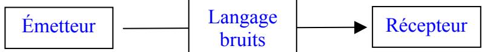
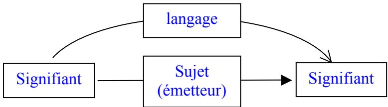
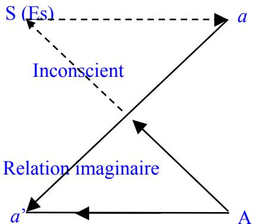
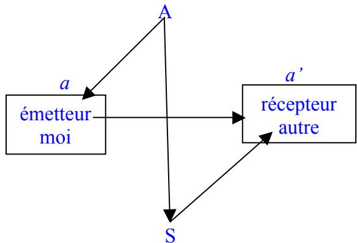
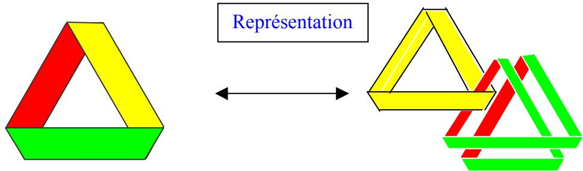
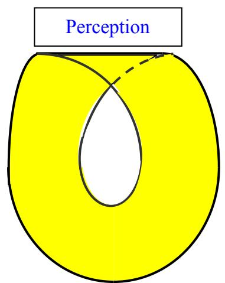
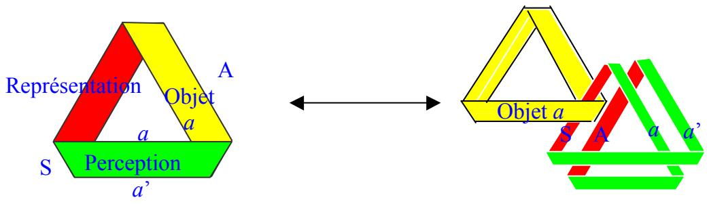

# Schéma	  L	  et	  théorie	  de	  la	  communication

Voici un extrait de mon livre Les Toiles des rêves, L’Harmattan 2009 :

Il ne s’agit peut-être pas de savoir si ce qui passe chez moi est ou non identique à ce qui se passe chez lui, mais de reconnaître qu’il n’y a pas de problématique individuelle. Le fait même de s’adresser à un autre suppose l’usage du langage et donc de la castration. Parler, c’est accepter de se séparer de l’objet comme tel pour se satisfaire tant bien que mal de sa représentation. Ce qui se dévoile ici ne serait pas une problématique individuelle, malgré la nécessité d’un sujet de l’énonciation, mais serait une problématique universelle. Non pas universelle au sens de tous les hommes mais universelle au sens de : ce n’est pas de lui ou de moi qu’il s’agit, il s’agit de ce qui court entre, du langage. Il s’agit du bord, du cadre.

L’observation commune, reprise par les théories de la communication, dit ceci :

Voilà un émetteur qui cause et un récepteur qui entend. Entre les deux, le langage, ce qui est bien embêtant. L’émetteur n’est pas cool, il déforme toujours un peu ce qu’il veut dire ; et le récepteur n’est pas forcément très attentif, il altère encore plus le message. En plus, des bruits extérieurs intempestifs viennent apporter leur contribution à la déformation. Tout l’art de la communication consisterait alors à réduire tous ces déformations et bruits.

Lacan prend le contre-pied exact de cela. Aux deux bouts de la chaîne, au lieu d’un émetteur et d’un récepteur, il place un signifiant et un autre signifiant. Autrement dit, ce qui était entre dans la théorie de la communication, il le met aux extrêmes, et ce qui était aux extrêmes (en gros, le sujet émetteur et le sujet récepteur), il les réduit à un seul qu’il place au milieu.

Il faut admettre que cela bouleverse sérieusement la perspective. Là où le sujet était producteur du message, Lacan théorise un sujet comme produit de la chaîne signifiante, celle-ci commune aux deux qui se parlent : ils disposent du même code pour leurs messages, et le message de celui qui parle est en partie façonné par celui qui écoute. Chacun, en tant que sujet, est appendu au langage, comme Lacan le dit parfois. Le moi croit parler, mais il dépend de la parole. Ce n’est pas lui le maître de ce qui se dit, c’est ce qui se dit qui le construit. Par référence à Hegel , il y a renversement des positions du maître et de l’esclave. Ce ne sont pas les bruits qui parasitent la communication, c’est l’homme qui est un parasite du langage.

Le schéma L présente une sorte de combinatoire des deux schémas précédents :

La dite « relation imaginaire » écrit la modalité consciente d’un moi face à un autre qui est aussi un moi, a et $a ^ { \prime } { \mathrm { . } }$ , chacun s’imaginant maîtriser le langage comme simple outil de leur rapport. Ils ne se rendent pas compte que cette relation se situe dans le continuum d’une relation symbolique inconsciente les traversant de part en part, entre les deux protagonistes, articulant cette fois le Sujet S (qui n’est pas le moi, a) et l’Autre, A (qui n’est donc pas non plus l’autre, a’). C’est ce qui fait dire que ça parle : $E s ,$ , le $\varsigma a$ en allemand, devient l’homonyme du Sujet S, en français. Ainsi « Wo Es war soll Ich werden », la maxime de Freud ne saurait se traduire par : le moi doit déloger le ça, comme on l’a trop souvent fait, mais par : « là où Ça était, Je dois advenir ». Il ne s’agit pas de remplacer l’un par l’autre, mais de faire en sorte que, laissant ça parler, ça engendre du je.

Comme on peut le lire dans ce schéma, le continuum entre les quatre points peut s’écrire sur une bande de Mœbius, surface à un seul bord continu distinguant localement deux faces se confondant globalement en une seule.

Il faut toutefois mettre une limite à cette conception. Si le renversement entre la théorie de la communication et la théorie lacanienne est radical, il ne saurait se concevoir comme le renversement des places du maître et de l’esclave chez Hegel. La limite, c’est que le sujet parle autant $\mathrm { \ q u ^ { \prime } i l }$ est parlé. Le sujet qui serait totalement l’esclave de la chaîne signifiante serait schizophrène. Au fond, c’est ce qu’on attend du sujet en analyse en lui offrant la possibilité de produire des associations libres ; or, justement, plus on le lui demande, moins il y arrive, limité $\mathrm { \ q u ^ { \prime } i l }$ est par une censure qui fait aussi partie de lui. C’est pourquoi je préfère cette formule dans laquelle une possibilité lui est offerte. A l’inverse, la paranoïa signe un sujet entièrement phagocyté par son moi, celui qui se croit le maître absolu de ce qu’il dit (folie des grandeurs) aussi bien que celui qui se croit le jouet absolu de l’autre (érotomanie, délire de jalousie, délire de persécution). Dans les deux cas, c’est le mot absolu qui pose problème. D’où mon idée que la formule de Lacan posant la psychanalyse comme une paranoïa dirigée n’est pas forcément la bonne. J’y verrais plus volontiers une schizophrénie proposée, un rêve éveillé.

Tout explique que je préfère écrire le schéma L ainsi, selon une rotation d’un quart de tour :

De cette façon il rappelle la théorie de la Communication, tout en montrant en quoi le langage vient s’immiscer entre les deux protagonistes à leur insu, qu’ils soient en analyse ou non. L’analyse ne fait que mettre en évidence ce qui vaut aussi pour la vie de tous les jours.

Ce qu’il « y » a à dire ne vient pas de moi ni de l’autre mais avant tout de l’Autre et du Sujet avant de transiter par le moi et l’autre.

je ne pense pas que ce schéma L soit applicable hors du cabinet de psychanalyste. Or je suis en train de me bricoler un schéma qui colle pour moi. Je suppose que le désir existe hors de chez le psychanalyste ? non ? si oui, j'écris Delta et on n'en parle plus pour passer à la suite.

RA remarqué, cher Jean François ce que vous écrivez :

\- d’un côté : je ne pense pas que ce schéma L soit applicable hors du cabinet de psychanalyste.

De l’autre : Je suppose que le désir existe hors de chez le psychanalyste.

Alors ? si le désir existe hors du cabinet de l’analyste, alors le schéma L s’y applique aussi.

Et la double-chaîne de Guy Rosolato ? ca vous défrise ?

Je n’ai pas lu Rosolato, mais la double chaîne correspond à ce que Freud nommait de son côté la double inscription en représentations de mots et représentations de choses. L’intérêt de la bande de Mœbius se retrouve ici : il y a deux faces, mais c’est la même, que l’on soit chez l’analyste ou ailleurs ; le travail de l’analyse n’est que celui qui consiste à opérer une coupure longitudinale dans la bande afin de se rendre compte qu’il y a une Autre scène, une Autre face, tandis que la vie quotidienne n’en faisait apparaître qu’une.

Comme le dessin ci-dessous le montre, la mise à pat sur le divan opère comme la mise à plat de l’écriture, c'est-à-dire le passage de la perception à la représentation :

Ni dans l’espace (dont la perception, encodée par la représentation, nous donne une vision qui reste toujours à plat) ni dans le plan, nous n’avons les moyens de nous rendre compte que la bande de Mœbius n’a qu’une seule face. L’écriture procède comme la psychanalyse : elle dédouble. Elle produit une double inscription : on peut lire qu’il y a deux faces, plus une troisième qui sert de bord entre les deux, ce qui permet par un effort de mémoire et d’intelligence, par compréhension de l’écriture de la torsion (passage d’une face à l’autre) de se rendre compte que les trois faces sont en continuité.

Dans la vie de tous les jours, c’est le contraire, nous n’avons aucun moyen de nous rendre compte de ce double discours surtout si nous ne prêtons aucune attention aux lapsus et actes manqués. Nous sommes dans l’écriture « traditionnelle » de la bande de Mœbius avec une seule torsion et une seule face, avec juste un petit slip en haut qui donne l’indice de quelque chose de dissimulé derrière.

  
Ce petit slip pourrait figurer les « bruits » de la théorie de la communication. La psychanalyse opère donc une mise à plat équivalente d’une coupure :

La torsion entre perception et représentation, entre ce qui est dehors et ce qui est dedans, donne le sentiment d’une identité. La barre jaune, de l’autre côté, que l’on repère en analyse, montre au contraire la différence.