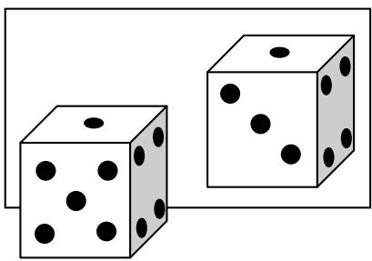
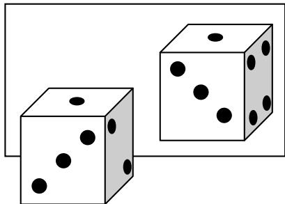
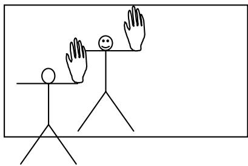
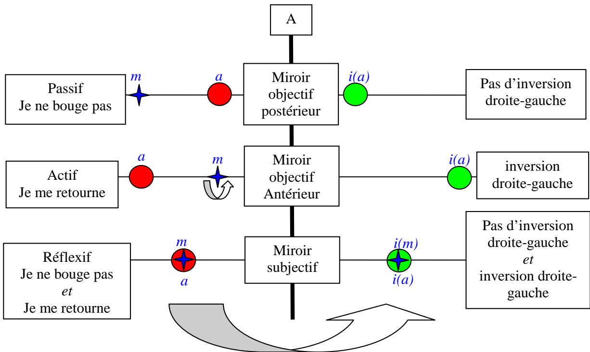
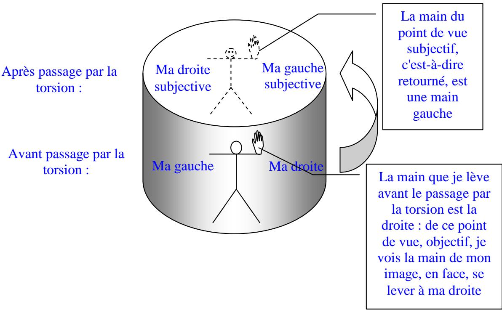
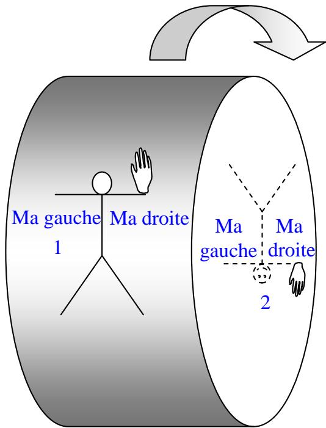
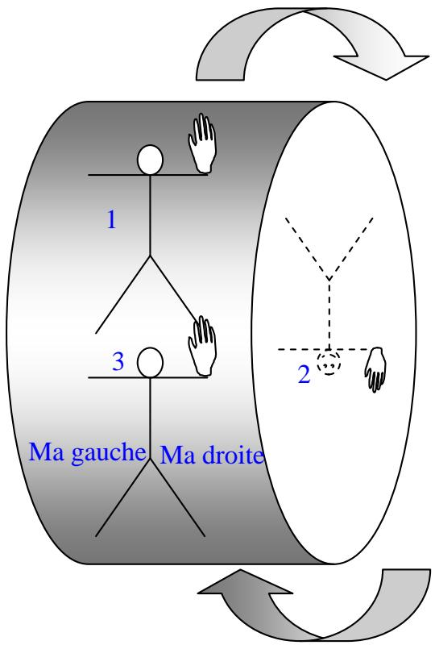
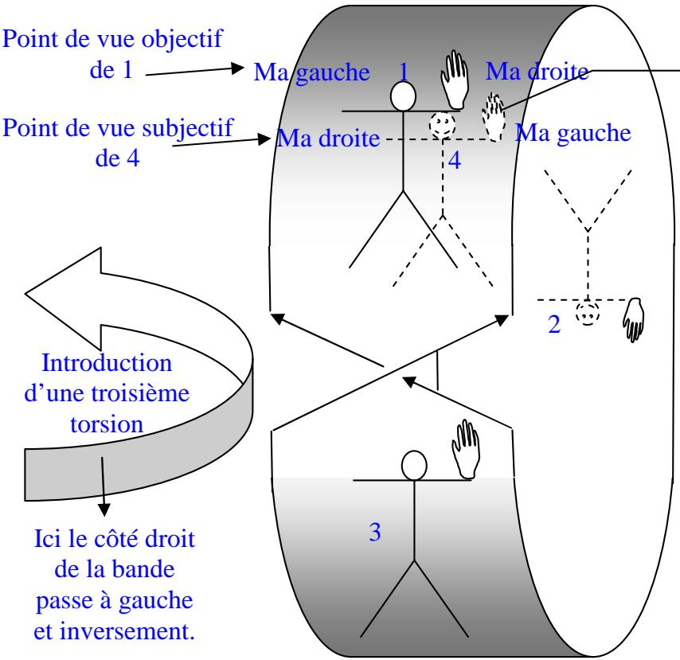
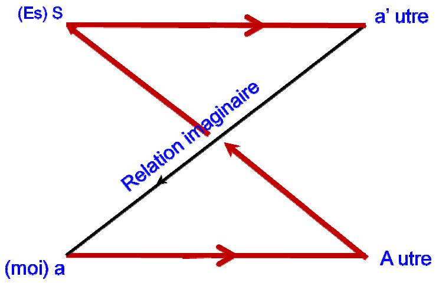

## Le sexe dans le miroir

Le côtoiement de mes petits-fils et le film Skizhein de Jérémy Clapin (<http://vimeo.com/6913172>) m’ont inspiré un retour sur la problématique du miroir en psychanalyse.

J’ai eu une fille, et maintenant, j’ai deux petits fils. Le contraste est saisissant. Mes petits fils dont l’un va vers ses 4 ans tandis que l’autre a eu ses 2 ans il y a peu, sont dans l’opposition systématique. Ils disent non à tout. J’ai eu à subir particulièrement la chose récemment, ayant dû garder l’ainé, Joachim, pendant deux jours. Juste un exemple : je l’ai amené aux jeux de la cité des enfants, au sein de la cité des sciences, à la Villette. Oh bien sûr, pour les jeux, tout va bien, puisque je suis là pour lui, à sa disposition pour l’aider si nécessaire, émerveillé lorsqu’il parvient à réaliser quelque exercice difficile. Mais lorsqu’il faut partir, c’est non. C’est compréhensible, il s’amusait bien. Néanmoins c’est comme ça, voilà, et son insistance est telle pour « ne pas » s’en aller, que je lui promets d’y retourner l’après midi. En effet, pourquoi pas, nous n’avions pas eu le temps d’épuiser toutes le ressources de ce parc étonnant. Pour en sortir il faut remettre le manteau : non, il ne veut pas. Je l’y contrains. En attendant que nous puissions retourner aux jeux, je propose que nous allions manger, puisque c’est midi. Non. Pendant tout le repas (où il touche à peine à ce qu’il a pourtant choisi), il ne cesse de me bassiner avec « je veux retourner aux jeux ». Enfin, quand vient l’heure d’y retourner, je m’attends à une explosion de joie. Que nenni : « non, je veux pas y aller ! ». Nous y sommes allés quand même, bien sûr, et sur place, il n’a plus dit non.

Néanmoins ce systématisme m’interroge, d’autant que je n’ai pas souvenir d’une chose pareille lorsque ma fille était petite, donnant raison aux remarques que faisaient Freud dans sa conférence de 1932 sur la féminité1. Défaillance de ma mémoire, qui embellirait le passé ? Pourtant, sa mère confirme : notre fille n’avait pas été comme ça. Alors ? Certes les parents ne sont pas les mêmes, les conditions ne sont pas les mêmes, notamment du fait qu’ils sont deux enfants à se partager une seule mère, ce qui les plonge dans les affres d’une jalousie meurtrière. Cela est connu. Mais ce qui est connu aussi et qui me revient en mémoire à l’occasion, c’est que les garçons sont toujours dits plus turbulents et opposants que les filles. Il faut entendre cela avec toute la prudence requise par chaque cas, qui est toujours éminemment particulier. Néanmoins mon expérience d’analysant et d’analyste ne cesse de me montrer l’importance fondamentale du sexe dans la vie des gens. Castration et envie du phallus ne cessent de hanter les rêves de tous. C’est vraisemblablement en rapport avec l’enfance et la façon dont a été vécue et mémorisé pour la première fois l’aperception de la différence des sexes. Y aurait-il un rapport avec le négativisme de mes petits fils, dont je ne suis pas sûr non plus qu’il soit universellement le fait des garçons ?

Le petit film Skizhein nous raconte l’histoire d’un type à côté de ses pompes. Suite à la chute d’une météorite, il se retrouve exactement à 91 cm de lui-même, ce qui n’est pas sans poser quelques problèmes de vie quotidienne. Pour saisir son téléphone par exemple, il doit faire le geste dans le vide à 91cm de l’endroit où il voit l’objet, et il s’allonge dans le vide à 91 cm du divan de son analyste. À 91cm, oui, mais dans quelle dimension ? Le film ne pose pas la question. On le voit à un moment actionner la poignée d’une porte alors qu’il est à 91 cm de celle-ci. Il serait donc à 91cm derrière lui-même. En revanche, on le voit s’allonger à gauche du divan de son psychanalyste, et à un autre moment, il conduit sa voiture à l’extérieur de celle-ci c'est-à-dire à gauche de la place du conducteur. Et puis à partir de quel référentiel peut-on dire cela ? Là où il se voit, c'est-à-dire où il croit se voir, il est à gauche de là où il serait réellement ; cela signifierait en retour qu’il repère son « moi réel » invisible, à sa droite. Il y a donc dans le film à la fois une certaine cohérence et une certaine incohérence : peut-il être à la fois à gauche de lui-même et derrière lui-même ? Lequel est « lui-même » ? Question oiseuse, me direz-vous : c’est un film ! Par licence poétique, on peut tout accepter d’une fiction. D’ailleurs, dans la suite, une deuxième météorite le déplace de 76 cm supplémentaires…vers le bas. N’empêche cette question : « lequel est lui-même ? », nous pouvons tous nous la poser !

Quel rapport avec la question du négativisme des enfants ? Eh bien, la négation justement : ce pauvre homme n’est pas à sa place. Lui, il le subit comme une malédiction, un effet désastreux des astres, tandis que mon petit fils, par ses non successifs, se déplace par rapport à la place où je voudrais qu’il soit. Il n’est pas « sage comme une image », il se refuse à être cette image que je construis pour lui, conforme à ce qui me semblent être les exigences de la réalité. La réalité n’est pas en jeu pour lui. Ce qui l’est, en jeu, c’est le pouvoir de refuser la place assignée par l’autre, par lequel, affirmant sa différence, il se fait naître comme sujet, parfois au mépris de son existence corporelle (refus de se conformer à l’injonction de ne pas traverser quand il y a des voitures). Pourquoi ma fille n’avait-elle pas usé de ce pouvoir ? Ou, tout au moins, pourquoi l’avait-elle fait de manière tellement plus atténuée que ça n’avait pas laissé trace dans ma mémoire ?

Il se trouve que la croyance en une place assignée par le destin est assez unanimement représentée dans tous les peuples, par quelque configuration des astres, bien pratique pour justifier tel ou tel désastre. Sans doute est-ce la raison pour laquelle notre personnage décalé s’insurge contre l’emploi, par son psychanalyste, du mot « astéroïde » : lui il tient à son mot, « météorite » ! En quoi la psychanalyse se présente, selon le néologisme de mon ami Pierre Boismenu, comme une désastrologie. Refuser la place assignée par l’autre, le parent ou l’adulte en général, pour tous les petits actes de la vie quotidienne, se retrouve plus tard lorsqu’il s’agit parfois de refuser un destin par trop déterminé par l’ascendance. C’est ainsi que, lorsqu’on n’a pas conscience du problème, on peut se retrouver à côté de ses pompes, voire avec un autre dans ses propres pompes, comme dans les cas de possession diabolique, nombreux autrefois chez nous, nombreux encore dans les pays du tiers monde. Au-delà de la problématique de la place assignée par l’autre se profile celle de la place assignée par la culture, la société, et finalement le langage, ce qu’on peut mettre au compte de ce que Lacan a appelé l’Autre.

A travers l’expression « sage comme une image », nous avons repéré l’analogie de la place et de l’image. Reprenons la question du miroir, puisque c’est lui qui nous fait naître à notre image de nous-mêmes. Essayons de nous y repérer d’abord en prenant des repères dimensionnels.

Puisqu’il s’agit de place assignée par le destin, imaginons que je regarde un dé dans un miroir.

Me situant derrière le dé, dans la situation où vous êtes, lecteur de ce dessin, je constate que l’image n’est pas conforme à ce que je vois. Sur l’objet je vois un 5, et son image me donne un 3. Bien sûr je comprends immédiatement que c’est parce que, de mon point de vue, je vois la face arrière du cube qui pour moi est devant tandis que le miroir me donne un point de vue sur la face avant, celle qui fait face au miroir et que je ne vois pas, car pour moi, elle est derrière. Manifestement c’est donc que le miroir a inversé le devant et le derrière, soit la dimension que nous nommerons troisième. D’un autre côté, c'est-à-dire sur le côté, je vois un 4 sur l’objet, et il est bien à la même place dans l’image, c'est-à-dire sur ma droite. Manifestement le miroir n’a donc pas inversé la gauche et la droite. Je vois aussi un 1 sur le dessus : le miroir n’a pas inversé non plus le haut et le bas.

Pour vérifier que le miroir reflète bien l’autre face de l’objet, celle que je ne vois pas et qui se reflète en 3, je peux passer derrière le dé et regarder cette face. Notez que, dans cette opération de retournement, j’ai inversé ma droite et ma gauche par rapport à ma position initiale. Je vois alors la face cachée du dé, mais je ne vois plus l’image du miroir puisque je lui tourne le dos. Dans le dessin ci-dessous, j’ai placé le dé réel tel que je le vois dans ce point de vue, et l’image telle que je la vois lorsque je me retourne ; c'est-à-dire que, vu les contraintes de la représentation plane, c’est le dé que j’ai retourné pour vous :

Cette image est évidemment la même que précedemment, mais mon référentiel corporel n’est plus le même. Je ne suis plus là où j’étais : peu importe si cétait à 91 cm ou non, mais je suis à côté de mes pompes par rapport à mon référentiel corporel précédent. Je vois bien le 3 auquel je m’attendais, mais il penche à gauche, tandis que dans l’image, il penche à doite. Quant au 4 attendu à ma droite, il est devenu un 2. Tout cela parce que je garde, de manière essentielle pour mon équilibre, mon référentiel corporel que j’entraîne avec moi dans tous les déplacements. Il est à la base de ma subjectivité, sans laquelle je ne saurais concevoir aucune objectivité. En effet, je peux reconstruire une objectivité à partir de ma mémoire en combinant les deux points de vue que je viens d’expérimenter. Je définis ainsi un objet cube-dé que je place dans la réalité, mais parce que je l’ai reconstruit dans ma tête. Je me définis aussi comme sujet, dans une opération qui n’est pas subsidiaire, même si elle est la plupart du temps insue : le sujet, c’est le point de vue comme tel, établi sur une base corporelle, c'est-à-dire sur la base de l’image du corps. Comme on le voit, il aurait été impossible d’établir ce qu’est l’objet sans cette référence au sujet, ni de se définir comme sujet si l’objet ne m’avait pas imposé de changer mon point de vue.

C’est la raison pour laquelle sur les bateaux, afin d’éviter tout malentendu dans les manœuvres, on remplace le référentiel corporel par une référence au corps du bateau luimême lorsqu’il avance, en référant babord et tribord à la poupe et à la proue. Tribord, c’est le côté droit du bateau lorsque je regarde la proue. On ne peut pas éliminer le référentiel corporel, c'est-à-dire le point de vue, mais on l’objective par le corps du bateau.

Après avoir définit par cette expérience l’objet et le sujet, il me reste à préciser la fonction qui opère les changements dimensionnels remarqués. Cette fonction, c’est le miroir, dont nous avons vu que, dans le premier cas, il inversait devant et derrière, mais pas droite et gauche, ni haut et bas, tandis que dans le second, il inverse la droite et la gauche parce que mon point de vue impose un retournement corporel. Celui-ci me confirme dans le fait que le miroir inverse là aussi le devant et le derrière, parce que je me rappelle avoir vu le derrière de l’objet dans le premier point de vue. Ici, c’est mon retournement corporel qui joue ce rôle, me faisant participer de la fonction du miroir : ce dernier ne peut donc être détaché comme ayant une fonction objective indépendante des points de vue. La fonction miroir ne peut être considérée comme rabatable sur un objet physique objectif, le miroir, que si on fait abstraction du sujet, ce qui est possible dans le premier cas, mais impossible dans le second, sachant que le second est pourtant nécessaire à l’établissement du premier : il a bien fallu passer de l’autre côté de l’objet et se retourner pour vérifier que le miroir ne se trompait pas dans sa reflexion.

La science est cette discipline qui justement élimine le sujet au profit de l’objet. La folie peut y être comparée, et je dis bien comparée et non pas assimilée. Cette folie serait de ne tenir compte que de l’un des points de vue, c'est-à-dire en oubliant que si on est ici, c’est qu’on a été là. Ceci vaut dans l’espace aussi bien que dans le temps. C’est dans le passé que j’étais ailleurs, mais dans la mémoire j’y suis toujours puisque j‘en garde les écritures. L’objet n’a pu être construit que de ce mouvement et de la synthèse que la mémoire des deux places a permise. En revanche, si j’oublie que j’ai été là, je suis en permanence à 91 cm de moi-même, c'est-à-dire que je ne cesse pas de me considérer objectivement, je m’observe comme si j’étais à côté de mes pompes. Ce que fait notre traumatisé météoritique en en rajoutant sur l’attitude scientifique : expériences, mesures précises, schémas, début de théorie. Il s’agit d’une folie de notre temps, baignée d’une culture scientifique qui nous rend accesssible les mystères de l’espace. La science lui donne sa modalité, rôle que la religion remplissait autrefois à merveille.

Les deux points de vue ont été rendu possible, ai-je dit, grâce à un référent corporel, c'est-à-dire à l’image du corps. Encore a-t-il fallu en disposer, de ce référentiel. Comme l’objet, il a fallu le construire en se regardant soi-même dans un miroir. Remplaçons donc le dé par le corps :

Je peux faire l’expérience des deux points de vue précédents :

Objectivement, si je lève ma main droite, je verrai mon image lever sa main à ma droite. Le miroir n’inverse pas la droite et la gauche, non. La droite est bien la droite, oui.

Mais je sais que je ne suis pas un objet, sauf l’objet du narcissisme, ce qui est le cas ici. Si les choses se passent bien, je m’identifie à mon image c'est-à-dire que pour me reconnaître avec cette main et ce visage, je dois me retourner pour entrer dans l’image et en faire le réceptacle de ce que j’appelle ma personne ou encore mon moi. Alors, de ce point de vue retourné, le miroir inverse la droite et la gauche, oui. La droite n’est plus la droite, non.

Combinés dans ce troisième point de vue, les deux points de vue au miroir se démentent l’un l’autre comme les deux modalités du verbe dans sa troisième2, le réflexif, ce qui permet d’introduire un non dans l’image du corps. Dès lors, on peut comprendre que l’enfant qui en est à la construction encore mal assurée de cette image ne cesse de jouer sur le non, afin de faire jouer le discordantiel de cette articulation de points de vue contradictoires. Notamment parce que l’enfant se voit d’abord comme image de l’autre : il a d’abord eu la perception de sa mère et des adultes en général avant de s’apercevoir lui-même au miroir. Il est d’abord l’autre avant d’être lui. Il suffit d’avoir joué un peu avec un bébé qui ne marche pas encore pour s’en rendre compte : les adultes s’émerveillent toujours de leur capacité imitative, qui commence par le sourire et diverses grimaces et se poursuit par le moindre geste de la main. Le transitivisme observé ensuite dans les pouponnières en prend le relais : un enfant tombe et c’est l’enfant témoin de la chute qui pleure. Si un frère ou une sœur cadette vient interrompre le duo amoureux maman-bébé, la jalousie témoigne de cette perpétuelle identification. Chacun veut l’objet de l’autre, veut faire la même activité que l’autre, veut la place auprès de maman. Sinon, la destruction sera la seule réponse possible.

Du fait de sa corrélation obligée au référentiel corporel, la fonction miroir ne peut être objectivée : elle se présente comme discordantielle. Mais cela va plus loin, car même si je veux éliminer le point de vue subjectif et rester dans l’objectif, de ce côté-ci du miroir, et si j’appose ma main sur la surface réfléchissante, je constate que les doigts se correspondent un à un, le pouce sur le pouce, l’index sur l’index etc…comme lorsque j’applique ma main droite sur ma main gauche, paume contre paume. Force est de constater que l’image de ma main droite est une main gauche. Ainsi donc, cette main droite qui se lève à droite dans le miroir quand je la lève à droite dans la réalité objective, se révèle être une main gauche. Du point de vue objectif, devant le miroir, le pouce de la main image est évidemment toujours à ma gauche, comme le pouce de la main objet. C’est par identification de la main dans le miroir que je peux affirmer subjectivement qu’il s’agit d’une main gauche, celle de l’image à laquelle je m’identifie. A la distinction des points de vue globaux, l’objectif et le subjectif, s’articule donc une distinction du point de vue global et du point de vue partiel. Cette distinction introduit une faille dans le point de vue global et, disons-le tout net, une coupure dans l’image du corps : une partie du corps, un membre, peut venir démentir l’unité qui venait d’être acquise. Je suis ici, avec ma droite à ma droite, mais je suis là-bas, avec ma main droite devenue gauche qui suppose que je me suis retourné derrière le miroir. Je suis moi, de ce côté du miroir, mais ma main semble obéir à une autre loi, elle est de l’autre côté du miroir.

Je ne suis pas un objet à part, je suis l’objet du narcissisme et... l’objet de l’amour de l’autre.

Or, si l’image me permet de me reconnaître comme semblable à moi-même, et si la discordance d’un membre me fait percevoir la coupure entre moi ici, globalement, et un morceau de moi là-bas, quelle est l’autre partie du corps qui peut être ici tout en n’étant pas là-bas ? En se reconnaissant dans l’autre et premièrement dans la mère, l’enfant va très vite trouver, par une confrontation de hasard ou par un bain pris en commun, une discordance dans l’image, non au niveau de la main, mais au niveau du sexe… s’il est un garçon. Une fille ne trouvera que confirmation de son image… jusqu’à ce qu’elle soit confrontée à la discordance par une rencontre avec le sexe masculin, mais un père ou un frère n’est pas une mère. C’est la plupart du temps la mère qui a assuré les premiers soins, engendrant un attachement à nul autre pareil. C’est toujours vers la mère qu’on va chercher refuge, vers elle qu’on se tourne en cas de malheur. Plus tard, le père pourra la remplacer comme objet d’amour, mais cela n’effacera pas la trace de cet amour premier. C’est donc plus tard que la petite fille devenue jeune fille se mettra à son tour dans la rébellion, notamment en jouissant de dire non aux nombreuses sollicitations dont elle fait l’objet.

Je crois qu’on peut accepter l’hypothèse de la différence sexuelle dans le rapport à l’image primordiale de la mère comme source du « non » des garçons comme de la docilité première des filles3. Dans les rêves, la fréquence de la coupure d’un membre ne peut qu’interpeller. C’est dans mes rêves, dans ceux de Freud, et dans ceux de mes analysants. L’interprétation qu’en font les analysants, soit directement, soit grâce à la survenue de rêves plus explicites mettant en général en scène, chez les hommes comme chez les femmes, une femme munie d’un phallus, indique que c’est bien de la castration et de son déni dont il est question. Ne peut-on voir alors, dans la discordance des points de vue entre droite et gauche, une métaphore de la différence sexuelle, toujours vécue comme castration ?

Dire non, pour le garçon qui a été beaucoup confronté à l’image de sa mère, c’est s’assurer une image intacte, mise à mal par la vue du manque féminin. Non, il n’est pas comme l’autre, car la relation à l’image maternelle se transfère sur tout autre, fut-il masculin. Non, il n’est pas à cette place assignée du « comme maman », sage comme une image. Dire oui, pour la fille c’est la conséquence naturelle d’une reconnaissance dans le semblable qui ne souffre d’aucune menace. Bien sûr, elle est comme maman. Plus tard, la confrontation au sexe masculin va tempérer cette docilité primordiale d’une sourde révolte contre une telle injustice.

Bien entendu, tout cela se transforme et se modèle selon des circonstances particulières. La complexité de l’humain mêle un nombre considérable de facteurs. Mais peutêtre y a-t-il là une base structurale de la différence des sexes.

Dans Skizhein, l’omniprésence de l’aspirateur me semble aller dans ce sens. C’est alors qu’il manipule son long tuyau phallique qu’Henri perçoit les prodromes de la météorite. Il fait une réapparition lors de l’impact de la seconde météorite. Alors qu’aucune destruction n’est visible après ces impacts, Henri constate cependant la brisure de l’antenne de télé sur l’immeuble en face de chez lui : castration ? On aperçoit aussi dans la suite ça et là, sur des papiers épars, d’improbables calculs sur le trou d’impact de la météorite, qui pourtant n’est visible nulle part dans la réalité. Bien qu’il ne soit que dépression dans une surface et non trou au sens topologique du terme, c'est-à-dire manque, on peut se demander s’il ne s’agit pas de la rencontre avec le sexe féminin qui le met à côté de la plaque. Si sa colère envers le psychanalyste qui a employé le mot astéroïde à la place de météorite peut trouver une explication dans la dissimulation du caractère fatal du destin, il peut s’en trouver une autre dans le fait que météorite est féminin.

Par ailleurs, les vibrations annonçant l’arrivée de la première météorite font bouger un cadre4 suspendu au mur. Il le remet en place, attirant notre attention sur son contenu : le mont Saint Michel. Or, c’est au Mont Saint Michel que se fera la rencontre avec la deuxième météorite. Le cadre signale une limite à la représentation : ici c’est une photo ou une peinture c'est-à-dire une représentation de la réalité, là c’est le mur, c'est-à-dire la réalité. Première rencontre : le cadre du Mont Saint Michel est déplacé, deuxième rencontre : il est au Mont Saint Michel. On peut se demander si cela, loin d’être fortuit, ne peut pas nous induire dans l’idée qu’il est entré dans la représentation et qu’il ne la distingue plus de la réalité. Le cadre a sauté. Ses repères ont disparus, comme la boussole qu’il avait dessinée sur son plancher après le premier impact et qui s’efface au deuxième impact.

D’autres cadres sont au mur : l’un d’eux le représente lui-même. D’autres, au moins deux, représentent des phares : point de repère pour les marins, certes, mais forme phallique évidente, d’autant que c’est au bord de sa mère au téléphone qu’il se voit dans le miroir. Il semble qu’Henri n’entretienne de rapports qu’avec sa mère, ce qui confine ses capacités phalliques à un espace spécialement bien cadré. Au deuxième impact, à son retour du Mont Saint Michel, il se présente enfoncé de 75 cm dans son plancher : tout ce qui se trouve en dessous de la ceinture a disparu. Autrement dit, tout repère sexuel.

Complément topologique.

En posant cette question des dimensions je faisais déjà de la topologie ; disons que je vais être un peu plus explicite en ce domaine.

La confrontation au miroir peut s’écrire aussi sur un cylindre :

  
En glissant le long de la surface de ce cylindre, le bonhomme que je suis se retrouve en face dans la même configuration que mon image au miroir. Convenons d’appeler torsion ce que nous appelions fonction miroir dans le développement précédent. La torsion, ici, devient passage d’une face à l’autre face. Entendons-nous bien : il s’agit de l’autre face d’un point de vue subjectif (je me vois « en face »), car objectivement, le bonhomme glisse sur la face externe du cylindre, sans accéder à sa face interne. Il a l’air sur l’autre face mais il est seulement de l’autre côté ; il est donc en fait invisible du point de vue premier, sauf si nous supposons la transparence de la surface. Mais ainsi, la torsion inverse la gauche et la droite et le devant et le derrière : c’est le point de vue subjectif du miroir. La double torsion c'est-à-dire le parcours du cylindre en entier, ramène le bonhomme à sa place : elle n’inverse rien du tout. Cependant, comme au miroir, considérant comme objet cette image de moi sur l’autre face, en face, je peux aussi, en levant la main droite, constater qu’elle se lève à ma droite sur l’autre face et qu’il s’agit d’une main gauche. Le dessin que j’ai fait ci-dessus représente cette phase finale du moment où ayant franchi la torsion je me retrouve confronté à mon image et, à ce moment-là, je lève la main droite pour la confronter à celle de l’image.

Imaginons une petite expérience supplémentaire. Et s’il nous prenait l’envie de faire pivoter ce cylindre d’un quart de tour, que se passerait-il ?

Le glissement de mon image sur la surface externe ne provoque plus du tout la même configuration ; ce n’est pas le miroir, car j’ai la tête en bas. Ce n’est même pas le miroir sphérique, qui inverserait en plus la gauche et la droite au point de vue objectif. La main qui se lève en face, bien que j’aie la tête en bas est aussi une main droite (si je la retourne haut et bas): elle a fidèlement suivit le bord droit du cylindre qui ne cesse pas d’être le bord droit.

Que faudrait-il faire subir à ce cylindre pour obtenir les mêmes conditions que le miroir ? Nous l’avons vu, si le bonhomme franchit les deux torsions il se retrouve à son point de départ sans changement.

Par contre si, après le parcours sur deux torsions, on introduit une coupure dans le cylindre puis une torsion supplémentaire, on peut alors recoller la bande de façon à obtenir la fonction miroir :

La 3ème torsion fait passer de 3 à 4. Subjectivement ma droite reste à ma droite, comme toujours. Après le mouvement, je lève la main droite en 1 : -du point de vue objectif de 1, la main qui se lève en face (4) le fait à ma droite, mais c’est une main gauche. -du point de vue subjectif de 4, il s’agit bien de ma main gauche

Le bonhomme se retrouve alors sur la face interne, interne du point de vue subjectif qui est celui de la position initiale sur la face externe, car il s’agit toujours de la même face. C’est la même face et, non, ce n’est pas la même face. C’est mon image, donc c’est moi et ce n’est pas moi, ce n’est que mon image. Avec ce ne…que, nous reconnaissons une des formules de la négation discordantielle de la langue française (cf. Damourette et Pichon). Par contre, cette fois, il est du même côté (contrairement à la position 2)

On a obtenu une bande de Mœbius qui, comme il se doit, possède trois torsions. On notera le parcours de la main levée avec son aboutissement discordantiel dans la troisième position : c’est là où elle fait discordance avec l’ensemble du corps, en métaphore du sexe. C’est une main qu’on lève après chaque opération, pour vérifier sa position. Elle représente le déni de la castration : non, je ne suis pas castré, non je ne suis pas à l’image de l’autre car l’autre, en face, il a sa main droite à ma gauche, tandis que je me maintiens artificiellement dans la position objective dans laquelle, non, le miroir n’inverse pas la droite et la gauche.

Les premières images de Skizhein montrent cette discordance des points de vue ; certes, d’une autre manière. Vu du dessus, c'est-à-dire de son point de vue subjectif, notre homme est bien allongé, suspendu en l’air, à 91 cm du divan. Mais vu de profil, il a l’air parfaitement « normal », comme il dit lui-même, allongé sur le divan. Cette image apparaît en même temps que celle du psychanalyste placé derrière lui : d’une manière générale, ce pourrait être le point de vue de l’autre, qui continue de voir le décalé subjectif à sa place objective.

Pourquoi avoir fait cette manœuvre supplémentaire de faire pivoter le cylindre d’un quart de tour, alors que nous disposions d’une figure géométrique simple, le cylindre, permettant de très bien rendre compte de la fonction miroir ? Parce que le cylindre est justement trop simple : la fonction miroir, sous le forme d’une torsion, se présente comme immédiate. Avec le modèle de la bande de Mœbius, elle s’offre au contraire comme médiatisée par le passage au travers de trois torsions. Cette médiatisation, c’est celle du langage. Pour qu’un enfant perçoive son image dans le miroir, il faut le lui dire, que c’est son image, sinon il ne voit rien : ce n’est pas immédiat ! C’est mon expérience avec les dits autistes qui m’a amené à cela. Ils ne se voient pas dans le miroir ! Combien de fois ai-je pu le constater, à mon plus grand étonnement. Il se trouve qu’Henri Debrus, le personnage de Skizhein, se voit parfaitement à sa place dans le miroir. Le montage nous fait entendre un « oui maman » à cet instant là, phrase issue d’une conversation avec sa mère qu’on nous montre juste après. Ce « oui » est en fait suivi immédiatement d’un « non » : « non, ce n’est pas une bonne idée que tu passes me voir, maman ». Où l’on voit se confirmer la discordance entre l’image du miroir (à laquelle il dit « oui ») et la place assignée par sa mère dans une conversation, c'est-à-dire dans le langage (à laquelle il dit « non »).

Il se trouve que ma fille me dit avoir observé une telle discordance dans l’attitude de son deuxième enfant, Gaëtan : elle lui demande de venir avec elle et il répond non tout en tendant les bras vers elle.

Par ailleurs, l’arrivée de chaque météorite se signale par un grésillement puis une disparition de l’image de la télé. C’est une autre sorte d’image, me direz-vous. Oui, mais c’est une image du monde, une représentation du monde, et, de deux choses l’une : ou c’est son image qui est altérée en se décalant, ou c’est le monde qui s’est déplacé sans lui. Rappelonsnous par ailleurs de la corrélation avec l’antenne brisée sur le toit de l’immeuble d’en face : de ce point de vue, la castration est bien en rapport avec l’existence, la netteté ou l’absence de l’image. L’antenne est en corrélation avec l’image de la télé tandis que les phares sont noués à la position des cadres et la position d’Henri, dans la représentation ou dans le réel.

Je me souviens plus particulièrement d’un de ces dits-autistes, un peu plus avancé que les autres, qui s’approchait tout près du bord du miroir, et offrait alors une main peureuse à la réflexion, regardant avec anxiété ce qui se passait là. Il la retirait alors très vite, comme si ça brûlait, puis recommençait l’expérience, encore et encore, comme le bonhomme qui, appliquant sa main sur la surface, constate la discordance et donc la coupure qui métaphorise la castration…je crois que ce qui le brûlait ainsi c’était l’immédiateté de l’image. Malgré mes commentaires, par lesquels je lui décrivais ce que je voyais et lui confirmait qu’il s’agissait bien de son image, il ne disposait pas du langage pour le protéger de cette brûlure. Plus exactement, le langage n’ayant pas fait son œuvre dans le temps requis, il restait dissocié de l’image.

Une brûlure : voilà en effet à quoi on peut comparer l’effet du symbolique, qui doit détruire l’objet pour le remplacer par sa représentation. C’est le cas de l’image au miroir : il faut cesser de se prendre pour un corps de pure chair brute pour accepter d’être l’objet d’amour de l’autre, ce qui permet aussi le narcissisme c'est-à-dire d’être l’objet d’amour de soi. C’est cela que nous voyions dans le miroir, et que nous revoyions tous les jours quand nous nous arrangeons pour nous présenter aux autres. Nous nous disons : comment vais-je être dans le regard de l’autre ?

J’avais dit plus haut que la destruction était la seule réponse lorsqu’un intrus vient prendre notre place, qui est fondamentalement cette place d’objet d’amour de la mère. Il s’agit de détruire cette image qui prend notre place, car en prenant notre place, elle nous détruit. Si ce n’est pas le frère ou la sœur qui la prend, cette place, c’est forcément le père. Voilà qui permet de comprendre pourquoi cette image peut être si redoutée par ceux-là qu’on appelle autistes, mais ils ne sont pas les seuls : cette crainte subsiste, profondément refoulée, même si nous avons pu la surmonter et entrer dans le miroir, c'est-à-dire dans le langage. Le héros du film Skizhein nous offre un exemple de cette peur de l’image : lui non plus, il ne la voit pas, et il ne s’y identifie pas. Nous avons surmonté cette peur moyennant une livre de chair : la castration. Car une partie du corps entrant en discordance dans l’image permet sa symbolisation et, partant, toutes les symbolisations, ce qui veut dire : accepter d’une part que la représentation ne soit pas l’objet, d’autre part que la représentation ne soit pas toute, car la part féminine de la sexuation ne peut trouver de représentation. C'est-à-dire que mon image, ce n’est pas moi, mais c’est moi quand même en tant que ça me représente, la discordance de cette négation étant elle-même représentée par ce qui ne peut rentrer dans l’image, tout en ayant donné naissance à cette image, lui donnant cadre et stabilité : la castration. C'est-à-dire que mon image, elle peut ne pas être là où je suis, elle peut être ailleurs : dans les bras de maman, dans les bras de n’importe qui, par exemple mon analyste, ce qui n’est jamais qu’une façon d’être à 91cm de moi-même.

Il me vient de penser que 91 cm (soyons large : à un ou deux cm près !) est la distance que peut prendre en général la relation de deux personnes qui se parlent, tout en étant la distance approximative qui nous sépare de notre image dans le miroir (il faut penser que l’image est située derrière le miroir, à distance égale de la distance de l’objet reflété au miroir : si je suis à 50cm du miroir, mon image sera à 50cm derrière la surface du miroir). Du coup me voilà en train de mesurer la distance exacte du sommet de ma tête à ma ceinture : 75 cm !

Dire non est la forme symbolique de la destruction occasionnée par l’intrus : non, je ne veux pas renter dans cette image que tu me transmets par la parole énonçant les divers impératifs de la vie quotidienne. Cette image me détruit donc je la détruis en disant non. Mais au lieu de frapper, au lieu de la destruction brute, celle-ci a pris une tournure langagière : non ! Ceci me rappelle aussi un jeu particulièrement apprécié de mon petit fils : il me flanque un grand coup en disant aussitôt avec un grand sourire : c’est pas moi ! Il tente ainsi de détruire l’image de celui qui l’assigne à une place, tout en se plaçant à 91cm de cette place de destructeur. En disant « c’est pas moi », il détruit en miroir, cette fois par le langage, son propre corps de chair pour le faire accéder à l’image symbolisée à sa façon.

Le schéma L de Lacan donne le squelette de cette structure articulant le langage et l’image :

La relation imaginaire $\mathrm a \vec { \Gamma } \vec { } \vec { \partial } a \vec { \Gamma } \vec { } \vec { } \vec { } \vec { } \vec { } \vec { } \vec { } \vec { } \vec { } \vec { } \vec { } \vec { } \vec { } \vec { } \vec { } \vec { } \vec { } \vec { } \vec { } \vec { } \vec { } \vec { } \vec { } \vec { } \vec { } \vec { } \vec { } \vec { } \vec { } \vec { } \vec { } \vec { } \vec { } \vec { } \vec { } \vec { } \vec { } \vec { } \vec { } \vec { } \vec { } \vec { } \vec { } \vec { } \vec { } \vec { } \vec { } \vec { } \vec { } \vec { } \vec { } \vec { } \vec { } \vec { } \vec { } \vec { } \vec { } \vec { } \vec { } \vec { } \vec { } \vec { } \vec { } \vec { } \vec { } \vec { } \vec { } \vec { } \vec { } \vec { } \vec { } \vec { } \vec \mathbf { } \vec { } \vec { } \vec \mathbf { } \vec { } \vec \mathbf { }$ signifie cette relation du moi à son image, que cette image soit celle du miroir ou de l’interlocuteur de la vie quotidienne, l’autre, mon semblable. Voyez que, pour aller du moi à l’autre, il faut franchir trois torsions. J’avais défini la torsion comme le passage d’une face à une autre. Eh bien, pour aller du moi à l’autre il faut franchir d’abord le passage de l’autre au grand Autre, A, (le langage, l’inconscient) puis le passage de cet Autre au sujet de l’inconscient, S (Es en allemand, le $\varsigma a )$ , et enfin le passage du sujet à l’autre, a’. Ces trois passages ou torsions représentent la médiatisation par le langage. Ce qui n’empêche nullement la relation directe à l’image et donc au semblable ; au contraire, ça la permet. Si c’est le moi de mon petit fils qui est en a et moi en $\mathbf { a } ^ { \prime }$ , son coup est entre a et $\mathbf { a } ^ { \prime }$ son $\ll { \mathrm { c } } ^ { \prime }$ est pas moi » se situe dans le dialogue entre A et S.

Revenons enfin à notre bande de Mœbius.

Que pouvons-nous tirer de plus comme enseignement de cette acrobatie ? Quelle est cette curieuse étape dans laquelle mon image se retrouve la tête en bas ? Simple manœuvre intermédiaire dont on pourrait se dispenser si on n’avait pas eu cette malencontreuse idée de faire tourner le cylindre d’un quart de tour ? Peut-être. Mais peut-être pas, si on songe à la façon dont nous naissons : par rapport à la mère, nous sommes alors dans cette situation de tête en bas puisque nous émergeons du trou, sauf accident, la tête la première.

La menace de castration, manifestée par la répétition du non qui s’y oppose, succombe vite au refoulement et il faut explorer les rêves de l’âge adulte pour la retrouver, comme matrice de nos actes manqués et symptômes divers. L’envie de phallus qui succède à la période d’enfant sage de la fille qui dit oui, est engloutie de la même façon, avec les mêmes nécessités d’exploration onirique. Ces deux représentations refoulées sont en rapport avec la découverte de la dissymétrie dans l’image entre l’homme et la femme. Ce sont des événements vécus inscrits dans la mémoire inconsciente.

Ce moment d’inversion tête bêche serait-il inscrit aussi ? Ce n’est pas parce que j’en trouve une occurrence théorique, allégorique de la naissance, que je vais me forcer à y croire. Certes, le quasi universalité des rêves de chute pourrait $\mathrm { s } ^ { \prime } \mathrm { y }$ rattacher. Je pense plutôt qu’il s’agit d’une reconstruction après-coup, lorsque nous avons appris la façon dont nous sommes nés, que nous la mettons aussitôt en rapport avec les fantasmes issus de la perception de la différence des sexes. Les rêves de chute peuvent alors s’interpréter comme castration de la mère, et ${ \mathrm { c } } '$ est notre corps comme phallus qui tombe. Cette représentation acquise, savoir qui est refoulé à son tour, peut donner appui à deux façons différentes de contrer les assignations de l’autre. Ce moment de la naissance est typiquement celui où une femme acquiert entre les jambes le phallus manquant sous la forme d’un corps inversé haut-et-bas. Peut -être est-ce la modalité féminine de dire non à la castration, sachant qu’en effet, ce sont les femmes qui, le plus souvent, ont envie d’enfant, tandis que la paternité effraie souvent les hommes. D’où l’attachement beaucoup plus important des femmes à leurs enfants, par lequel elles font d’eux des objets d’amour, place à laquelle ils souhaitent ardemment se mettre aux dépends du père tout en cherchant à s’en défendre, car la position d’objet tue le sujet. Cet objet d’amour, elles le reconnaissent volontiers en analyse comme une partie d’elles-mêmes, la fameuse partie manquante dont elles se sont plaint toute la vie. Cette partie n’était autre que celle qui, dans le miroir que tendait maman, manquait à être inversée. Toutes choses à prendre avec d’infinies prudences, les contre-exemples ne manquant pas non plus.

Trois positions au miroir, objective, subjective, narcissique, qui chaque fois donnent de l’objet une image différente, trois images possibles sur la bande de Mœbius, peuvent se lire comme les différentes modalités de se situer à une place dont on voit qu’elle ne saurait être simplement définie. Cette place suppose une subtile articulation du oui et du non, dialectisée par l’existence du non discordantiel, autant d’occasions de se sentir bien dans ses baskets ou à côté de ses pompes. Les astres n’expliquent pas tous les désastres, mais le repérage par rapport aux paroles parentales, voire ancestrales, aide quand même à se trouver une place, même si celle-ci ne sera jamais totalement confortable parce que jamais totalement « la notre ».

Nous avons là simplement une structure théorique qui peut nous aider à rendre compte d’une façon très modeste de la complexité qui caractérise chaque cas particulier, à l’écoute duquel il faut se soumettre en oubliant tout préjugé théorique.

dimanche 24 janvier 2010 revu et augmenté le
