# RICHARD ABIBON

## SPÉCULARITÉ 1

« Le langage est, pour celui qui sait en déchiffrer les images,

un merveilleux miroir des profondeurs de l’inconscient »

Damourette et Pichon

### 1) Négation forclusive et négation discordentielle

On doit cette distinction à Damourette et Pichon, dans leur « Essai de Grammaire de la langue française ».

La négation discordentielle, comme son nom l’indique, désigne une discordance, comme dans « je crains qu’il ne vienne », où l’on ne sait s’il s’agit d’un désir ou d’une crainte. Autre exemple, lorsqu’on dit : « ce n’est pas moi (négation forclusive), ce n’est que mon image (négation discordentielle). Dans le miroir, mon image, c’est à la fois moi et pas moi, il y en a deux, mais c’est le même. La négation discordentielle fait office de schifter, de représentant dans la phrase du sujet de l’énonciation, qui, par là, énonce son désir.

La négation forclusive s’emploie tout à fait normalement dans le français de tous les jours ; c’est ce qui permet de dire : « Je prends le métro sur ce quai-ci, je ne le prends pas sur le quai d’en face. » je ne suis pas sur les deux quais à la fois, je ne vais pas dans les deux sens à la fois. Je ne suis donc pas sur une bande de Mœbius (unilatère, une seule face) mais sur une surface bilatère (deux faces). La systématisation de cette forme de négation et l’impossibilité à revenir à de la négation discordentielle, avait été promu au rang de mécanisme de la psychose par Laforgue, sous le nom de scotomisation. Lacan l’a mis à son tour (sans référence à Laforgue) au principe de la forclusion. Donc, ne pas confondre :

\- La négation forclusive, processus normal et indispensable, fonctionnant dans une dialectique avec la discordentielle.

\- La forclusion, systématisation du processus forclusif par suppression de la dialectique avec le discordentiel.

Négation forclusive et discordentielle peuvent être représentées par les deux objets obtenus par une coupure à deux tours sur le cross cap :

La discordentielle par la bande de Mœbius : il y a deux faces (localement) mais c’est la même (globalement)

La forclusive par la rondelle bilatère : il y a deux faces, et elles ne peuvent se confondre. Elles sont séparées par un bord.

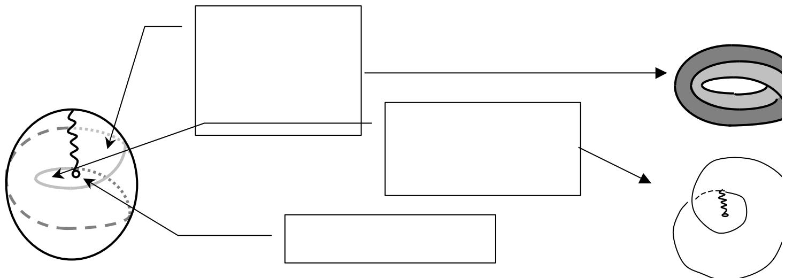

### NOTE DU 12/11/13

Cette façon de représenter le cross cap et sa découpe m’apparaît aujourd’hui fautive. La bande de Moebius que l’on croit lire en pointillé sur la figure censée représenter le cross cap n’est pas à la bonne place, même si elle donne l’impression de pouvoir en être extraite facilement comme représentée. En effet, la « torsion » de la bande de Moebius , si elle se situe quelque part c’est dans la ligne de croisement des surfaces dite « ligne de décussation » pour faire savant, que l’on peut lire dans le tortillon qui sinue sur le dessin de gauche. La « torsion » qui est représentée dans ce même dessin comme étant celle de la bande de Moebius extraite ensuite n’est qu’un artéfact du à l’aplatissement en 2 dimensions d’un objet censée être en trois dimensions. On aurait la même torsion sur un cylindre ou une sphère, ce que je prends en effet en considération, au contraire de mes collègues topologues qui déclarent ces deux derniers sans torsions. Or, il y a bien une torsion dans ces cas-là, au sens où, du point de vue d’un lecteur (et il n’y a pas d’objet sans lecteur pour le lire), on passeBande de Moebius bien d’une face à l’autre. Le comble du paradoxe, c’est que lorsque je dis que la bande deinitiale= ligne sans Moebius a trois torsions, on me rétorque que les deux « supplémentaires » sont des artéfacts dus au dessin… or c’est justement un tel artefact, absolument identique, qui est ici présenté comme étant « la » torsion unique de la bande de Moebius.

Rondelle, qu’on peut situer Donc si on veut être juste on doit lire dans ce dessin : oussi dens lc

aussi dans le une « torsion » qui est en fait une ligne de croisement des surfaces, c’est la ligne de décussation.

Deux « torsions » qui sont les lieux où, pour nous lecteur, la surface passe de devant à derrière l’objet : c’est aussi un croisement de surfaces, même s’il est dû à l’écriture. …point hors ligne

Il se trouve que ce qui nous intéresse en psychanalyse, c’est justement ce qui s’écrit et le fait qu’il faut un sujet à la fois pour l’écrire et pour le lire. Bref le cross cap, dans notre champ, reste une figure qui nous fait plus embrouiller les problèmes que les résoudre. La bande de Moebius est déjà suffisamment compliquée comme cela. La décrire correctement, voilà qui nous apporte quelques lumières sur la structure de l’inconscient : étant à une face et pourtant à deux faces, elle soutient en effet la contradiction, caractéristique essentielle de l’inconscient.

### 2) Spécularité : en rapport avec le miroir ? Cross-cap, bande de Moebius : spéculaire ou pas ?

Je me réfère essentiellement aux séances du 6 et 13 juin 62 de « l’Identification ». Nous allons examiner les problèmes posés par les définitions que Lacan donne de la spécularité.

Lacan donne de la spécularité la définition suivante : un objet est spéculaire lorsqu’il n’est pas possible de lui superposer en tout point son image. A l’inverse, un objet sera dit nonspéculaire si on peut lui superposer en tout point son image (6/6/62, p. 265 ). Sp

Non -Spéculaires

À partir de cette définition, il nous indique la différence des deux objets ci-dessus(superposables (6/6/62, p. 266 ; « L’Angoisse », 28/11/62, p.38) : en tout point)

la bande de Mœbius, en tant qu’objet unilatère, inorientable, est spécularisable (et aussi 13/6/62, p. 275)Spéculaires

la rondelle en tant qu’objet bilatère et orienté, n’est pas spécularisée. (6/6/62, p. 267).( non-

Il y a là usage de plusieurs attributs et fonctions, dont les définitions ne sont pas superposables en tout point) claires, ce qui amène Lacan à se contredire : unilatère, orientable, spéculaire, tout cela mérite d’être bien défini.

Le spéculaire, vu le terme, fait-il appel exclusivement à l’image dans le miroir? Pour montrer que le cross cap n’est pas spéculaire, Lacan se sert de l’image dans le miroir. Il dessine explicitement un cross cap devant un miroir, et dessine le même de l’autre côté : son image lui est semblable en tout point, donc il n’est pas spéculaire. De plus Lacan fait explicitement référence à l’image du corps, en indiquant que celle-ci, du fait de sa dissymlétrie droite-gauche, est spéculaire : la main droite se reflète en main gauche. Oui, donc, le spéculaire est en rapport avec la fonction du miroir.

Cependant si, reprenant le Lacan du schéma optique, nous faisons basculer le mioir de 90°, le positionnant à l’horizontale, le cross cap dans ce miroir sera parfaitement spéculaire : on observe clairement l’inversion de la dimension dite “haut-bas” dans ce point de vue. Evidemment, « yaka » renverser le cross cap et ce sera le même ; mais il y aura fallu cette opération de renversement.

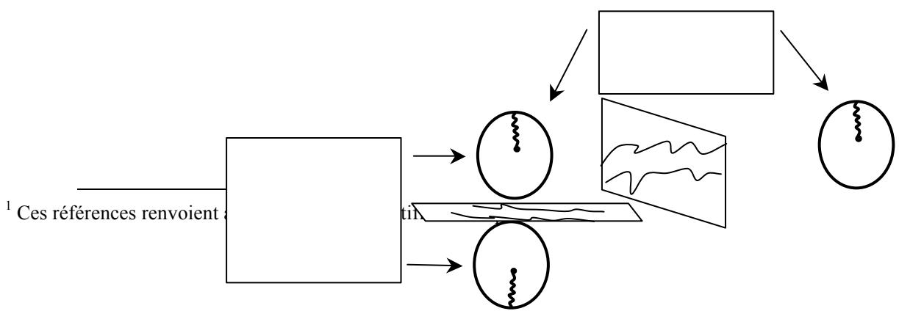

Cependant encore, l’année suivante, dans « L’Angoisse », (9/1/63, p.952), Lacan définit le spéculaire en se servant du retournement de la bande de Mœbius. Effectivement, quel que soit le mode de retournement, l’objet obtenu est superposable à l’objet initial : il tourne dans le même sens. Du point de vue de cette définition, qui est la même que celle de « l’Identification » (superposabilité), il n’y a plus, cette fois, nécessité du miroir. Par rapport à la spécularité, Lacan confond ici deux opérations : l’une des opérations effectuée par le miroir (car il y en a au moins trois3) et le retournement proprement dit (extrinsèque, car il y en a un autre4, dit retournement intrinsèque), qui peut parfaitement se passer du miroir.

### 3)La rondelle : spéculaire ou pas ?

Il nous indique, en effet, que la rondelle issue de la coupure à deux tours du cross cap est orientée, et il nous montre en quoi elle n’est pas spéculaire. Au début de la séance du 13 juin 62, il dessine la rondelle dans le miroir : bien entendu, comme elle est orientée (son bord en huit intérieur présente une dissymétrie), son image ne se superpose pas à l’objet :

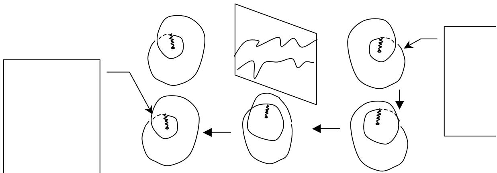

Lacan montre comment, en modifiant de façon continue le bord de l’image, en faisantdry passer le bord inférieur sur le bord supérieur, on retrouve le dessin de l’objet initial (13/6/62, g -x début de séance p.269 et 312). Il fait la même monstration pour le cross cap complet muni deg-z la coupure à deux tours ; il en déduit la non-spécularité du cross cap (6/6/62, p.265). Du point renversement de vue de la spécularité, l’objet entier serait donc semblable au reste issu de la coupure, soit : à la rondelle. Ici encore, Lacan confond deux opérations : celle du miroir, et celle de la déformation continue, fondamentale pour la topologie. En topologie, en effet, deux objets ne sont considérés différents que s’il n’est pas possible de passer de l’un à l’autre parx’ retournement déformation continue. dr z

De ce point de vue, les deux objets qui étaient différents – donc, spéculaires – sont devenus semblables – donc, non-spéculaires. Entre les deux, il y a quand même eu une opération, qui n’est pas rien. Ce qui pose la question : est-ce qu’on se situe du pur point de vue de la topologie mathématique, ou devons-nous construire une topologie qui rende comptey de notre pratique, la psychanalyse ?

Note du 12/11/13 : dans ces manipulations d’objets topologiques il faut bien se rendre compte que Lacan agit en physicien, prenant ces objets pour des objets de la réalité, alors que ce sont des objets théoriques. De plus il procède en scientifique c'est-à-dire en éliminant tout sujet de l’opération. Or, ce qui intéresse la psychanalyse, c’est bien le sujet, en quoi elle n’est pas scientifique, ce que le même Lacan démontre avec brio dans le dernier texte des « Ecrits ».

Du point de vue de l’image du corps, nous pouvons poser la même question : au fond, dans le miroir, mon image, c’est moi : c’est un jugement forclusif qui affirme l’identité. Et puis, du fait du souvenir que j’ai de mon image dans l’étang, qui était, d’évidence, inversée (pour être précis : renversée), je peux me dire : si le miroir est passé de l’horizontale à la verticale, il a bien dû conserver sa fonction d’inversion ; simplement, si le miroir horizontal inversait le haut et le bas - c'est-à-dire la dimension qui, traversant le miroir, rejoignait l’objet et l’image - le miroir vertical doit donc inverser le devant et le derrière – dimension qui, dans ce cas, traverse le miroir - ce qui fait que je me vois de face et non de dos. Donc mon image, présentant l’inversion d’au moins une dimension, n’est pas semblable.

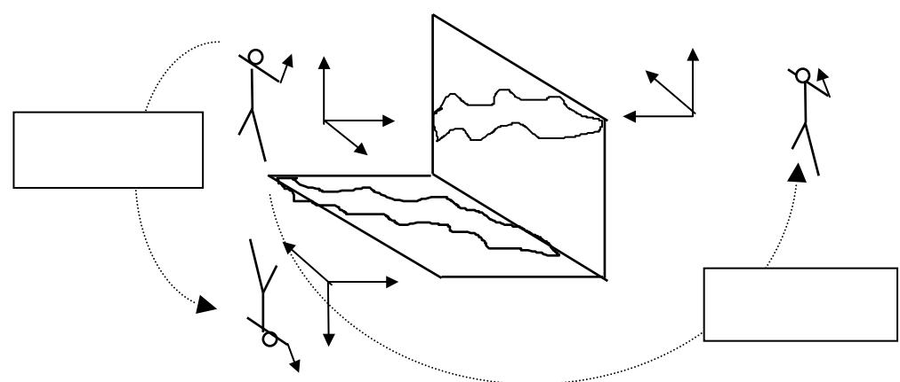

Je pourrais poursuivre le raisonnement en effectuant une identification à l’image, par un retournement derrière le miroir : je découvre alors une autre différence dans l’inversion de la droite et de la gauche. Donc mon image qui est pourtant moi-même (identité) est différente par l’inversion de deux dimensions sur trois (différence).

### 4) pour une topologie discordentielle

C’est ici qu’intervient la négation discordentielle, fondamentale pour la structure de la parole. Mon image était la même, mais par une opération de coupure, due au souvenir de ce qu’avait pu être mon image renversée dans un autre miroir, je l’ai rendue différente pour la dimension traversant le miroir ; puis j’ai accentué cette différence par une coupure supplémentaire entre ce que j’étais devant le miroir et ce que je deviens en m’identifiant à l’image par retournement derrière le miroir. A l’inverse, l’image du cross cap, qui était différente de l’objet, Lacan, par une opération de suture, en rétablit la similitude. Dans les deux cas, il ne s’agit pas de trancher définitivement, afin d’établir de façon objective (scientifique) si les deux objets sont semblables ou différents. Il faut bien admettre qu’ils sont à la fois semblables et différents : c’est cela qui constitue la spécularité, dans son rapport à la négation discordentielle. L’image n’est pas l’objet, ce n’est que son image.

Par ailleurs, si, du point de vue de la spécularité, le cross cap et la rondelle sont identiques, nous pouvons prendre cette identité comme modèle pour l’identification : le sujet (la bande de Mœbius ), à travers le fantasme, s’identifie à son objet (la rondelle) : \$ ◊ a. Il s’y identifie par le biais de la coupure (le poinçon : ◊), qui pourtant l’en sépare. C’est le même discordentiel qu’entre l’objet (cross cap ou rondelle,( i(a)) et son image dans le miroir ( i’(a)).

C’est en cela que l’opération du miroir ne peut être conçue comme différente de la structure du langage, qui noue le Réel, le Symbolique, et l’Imaginaire, dans une temporalité. En effet, l’opération qui rend semblable (suture), comme celle qui rend différent (coupure), supposent la comparaison de l’objet initial avec l’objet obtenu, moyennant d’éventuelles étapes. Ceci fait intervenir le temps et le souvenir, donc la trace de ce que l’objet était, avec ce que, par les différentes opérations, il devient. Wo es war, soll Ich werden. Tout cela suppose la manipulation par un sujet, qui, de ce fait, s’identifie, non plus à l’un des objets en jeu, mais au « je » qui tranche –et ne tranche pas – entre eux.

### 5) la distinction orientable-orienté règle le sort de la spécularité de la rondelle

Nous arrivons à la nécessité d’une autre précision dans les définitions : Lacan, et, à sa suite, Vappereau, considére qu’une surface bilatère est orientable, donc orientée. Or, il est fondamental de distinguer entre l’orientable (toute surface bilatère) et l’orienté : pour orienter un bilatère il est nécessaire de faire appel à l’écriture, c'est à dire de marquer une des faces (un seul trait suffit) afin de la repérer. La bilatéralité se repère avec un cardinal : il y a 2 faces. Il est possible de les orienter mais ce n’est pas nécessaire. Un objet unilatère tel la bande de Moebius, il est impossible de l’orienter. L’orientation suppose l’intervention contingente d’un ordinal : voici la première face, voilà la seconde. La lettre, comme simple trait peut s’y substituer (voici celle qui est marquée, voilà celle qui ne l’est pas : négation forclusive). Sans cette écriture, le bilatère se présente à la fois comme bilatère (il a bien deux faces) et comme unilatère (elles sont bien séparées par un bord, mais comme elles sont semblables, rien ne permet de les caractériser) : négation discordentielle. Dans ce raisonnement nous sommes passés d’un jugement portant sur l’objet comme tel (bilatère ou unilatère), à la nomination des parties de l’objet (cette face-ci, cette face-là), ce qui porte un jugement supplémentaire (orientation, soit : mise en ordre des faces par une lettre faisant ordinal).

Une rondelle orientée peut être spéculaire ou pas, c’est selon le point de vue. Prenons une rondelle orientée par un trait sur une face. D’un point de vue postérieur (le sujet derrière l’objet par rapport au miroir), le sujet ne verra, par exemple, aucun trait sur la face qu’il aperçoit, mais un trait sur la face reflétée : spécularité. D’un point de vue antérieur (le sujet entre l’objet et l’image, par rapport au miroir), le sujet aperçoit le même trait sur l’image : non-spécularité. Mais si, de ce même point de vue, le trait présente la moindre dissymétrie (en penchant à droite ou à gauche), celle-ci va rétablir la spécularité.

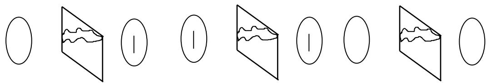

Par contre une rondelle, objet orientable, non orienté par un trait, sera toujours nonspéculaire, quel que soit le point de vue. Ce qui rejoint sans ambiguïté le propos de Lacan sur l’objet a que la rondelle représente.

Note du 12/11/13 : j’essayais encore à cette époque de valider quand même quelques assertions de Lacan, car on ne s’y oriente guère, dans le fouillis qu’il a laissé. Aujourd’hui je pense que l’objet a ne saurait être représenté par la rondelle, justement parce qu’elle est orientable et que l’objet a appartient au Réel, qui est impossible, donc impossible à orienter. Dans la dualité rondelle/ bande de Moebius qui compose le cross cap, si on veut être juste, il faut inverser exactement les propositions de Lacan : la rondelle, en tant qu’orientable, représente plutôt l’objet de la réalité, et la bande de Moebius, l’objet a, justement parce qu’elle est inorientable. Mais c’est un peu plus compliqué quand même : la bande de Moebius à elle seule représente parfaitement la dualité du sujet et de l’objet dans sa continuité ambiguë. Elle est coupure (une dimension globalement), donc fonction sujet et en même temps surface (deux dimensions localement), donc objet. La rondelle n’est que le représentant supplémentaire de ce fait, que toute surface est à deux faces, au moins localement, même si la bande de Moebius rend cette surface unilatère du fait de ses trois torsions.

Chapitre 2 : 6) le cross cap, surface, place du trou, ou surface trou ? Parallèle entre la construction du cross cap et le schéma optique.

### Spécularité 2

Lorsqu’il passe de la topologie à la psychanalyse, Lacan ne clarifie guère la situation. Il qualifie à plusieurs reprises le - ϕ d’opérateur. Il finit par le situer dans le petit trou qui fait la base de la ligne d’auto-pénétration de la surface du cross-cap. Ce petit trou se trouve entraîné au centre de la rondelle (qualifiée d’objet a) lorsque celle-ci est séparée de la bande de Mœbius par une coupure (à un ou à deux tours). Or, cette coupure, c’est ça, l’opérateur. En tout cas, ces coupures sont les seules opérations dont il est question. La question est complexe, et Lacan en convient explicitement. Comment l’opérateur peut-il se retrouver dans l’objet a, produit de l’opération ? Est-ce à dire que l’opération ne cesse pas d’être à refaire, et que, en tant que division, elle ne cesse pas de ne pas tomber juste ?

En effet, si cette opération est la spécularisation, il faut à nouveau effectuer une opération (qu’on pourrait dire de dé-spécularisation) pour montrer que la rondelle n’est pas spécularisable. Nous l’avons vu (cf. N° précédent), cette opération de retour est la même sur le cross-cap.

La difficulté réside aussi dans le fait que Lacan nous dit l’objet a inspécularisable, et le - ϕ, lui non plus n’apparaît pas dans l’image, sauf sous forme de trou : « le -ϕ n’est pas entré dans l’imaginaire » nous dit-il dans « L’Angoisse »(28/11/62, p.39). Au passage, nous pourrions nous demander si le spéculaire et l’imaginaire se recouvrent. Apparemment, Lacan emploie ici l’un pour l’autre, et je n’ai pu encore vérifier si c’était le cas dans l’ensemble des séminaires. Toujours est-il que Lacan nomme le point central du cross-cap «ϕ » et quelques secondes plus tard, «a» (27/6/62, p.291).

A s’en tenir aux formulations de « l’Identification » et de « L’Angoisse », on ne voit pas ce qui sépare le -ϕ de l’objet a : ni l’un ni l’autre ne sont spéculaires, et tous deux se retrouvent après coupure sur le même objet, la rondelle, dont Lacan dit qu’elle reprend, en effet, toutes les caractéristiques de l’objet complet, le cross cap. La division de l’objet a produit un objet encore à diviser. C’est là où le discordentiel s’articule avec le forclusif : au sein de la rondelle qui présente une séparation claire des deux faces, se situe un trou comme trace de l’unilatéralité de la surface d’origine. Par le trou, en effet, on peut passer d’une face à l’autre, à ceci près que cette fois il faut franchir un bord. Le trou lui-même peut être lu comme la place du trou, aussi unilatère que le cross-cap initial. Il devient donc urgent de préciser ce qu’est un trou.

Pour s’y retrouver, il est intéressant de faire un parallèle entre la construction du schéma optique des « Ecrits » (Remarque sur le rapport de Daniel Lagache) et celle du crosscap à partir du polygone fondamental. Entre les deux, un petit essai esthétique ne fera pas de mal.

### 1) Construction topologique

Les trois dimensions sont annulées successivement, moyennant deux scansions suspensives :

1) On crée le polygone fondamental, produit de deux dimensions x et y ; on oriente ses bords opposés en sens contraire.

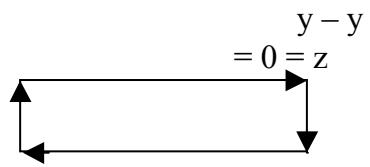

### - Scansion

2) On annule la dimension y, en raboutant deux bords du polygone fondamental, moyennant une torsion. Cette torsion crée la troisième dimension, z, qui n’était pas là dans le plan du polygone fondamental, produit des deux seules dimensions x et y. Mais elle la crée comme trou, c'est à dire comme zéro quant à une mesure quelconque : y - y ${ \bf \mu } = 0 = { \bf \mu } _ { Z }$ . Cette opération aboutit à la formation de la bande de Mœbius ; surface qu’on ne peut considérer comme telle qu’à condition de préciser : n’ayant qu’un bord, elle n’a aussi qu’une face, et par là, elle est identique à la coupure. C’est très différent de ce que nous appelons intuitivement et généralement « surface », objet doté éventuellement d’un seul bord, mais structuré en tous les cas par deux faces.

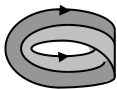

### Note du 12/11/13

Représentation fautive de la bande de Moebius, car il manque deux torsions.

\- Scansion

3) On annule la dimension x restante, en réduisant à zéro la dimension du bord unique de la bande de Moebius. Ceci contraint la « surface » dont elle était faite à s’autotraverser. En opérant cette annulation, on élimine le dernier reste de « substance » : que serait un « objet » de dimension zéro ? Et bien, ce serait le cross-cap, c'est-à-dire, comme le dit Lacan « la place du trou ». Nous obtenons une « surface » qu’il faut bien mettre entre guillemets, car, proprement, elle n’existe pas. Elle n’est qu’un pur vide. « Un point mathématique, dit Lacan (13/6/62, p. 272) un point abstrait. Nous ne pouvons donc lui donner aucune dimension ».y

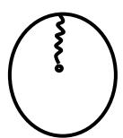

### 4) Construction esthétique

Partons à présent d’un polygone fondamental qui serait un tableau, comme celui de Van Eyck, « Portrait des époux Arnolfini ». Comme dans tout tableau « réaliste », la troisième dimension, z, absente du tableau, y est représentée par l’illusion de la perspective, qui consiste en ceci : les deux dimensions du plan de la réalité, x et y, sont représentées par les deux dimensions du plan du tableau ; la troisième dimension, « devant-derrière », ou z, est représentée par la dimension « haut-bas », ou y, du tableau. Cette dernière, y, représente donc à la fois elle-même et z. En fonction d’une diminution de z, qui tend vers zéro au dit « point de fuite », les deux autres dimensions du plan, x et y, suivent le mouvement et tendent, elles aussi, vers zéro au point de fuite. Ce dernier peut donc être considéré comme la place du trou, qui oriente le tableau dans l’espace de la représentation. Le tableau, sans perspective, est une rondelle sans orientation, aspéculaire. Muni du point de fuite, il se retrouve orienté, et spécularisable : on peut croire à cette réalité fictive tout en reconnaissant sa fallace.

Le génie de Van Eyck, en cette période de tâtonnements dans l’invention de la perspective, est d’avoir placé un miroir au lieu du point de fuite, soit : à la place du trou qui, inorientable comme le cross-cap, n’en soutient pas moins cette fonction d’orienter l’espace imaginaire ainsi créé. Deux personnages se distinguent dans le reflet, derrière celui du dos des époux Arnolfini. L’histoire de la peinture nous dit : « deux témoins ». Et pourquoi pas, parmi ces deux, le peintre, qui, en toute logique, se trouve là ? D’autant plus là qu’il persiste et signe juste au-dessus du miroir : « Johannes Van Eyck fuit hic ». Un point de fuit où l’emploi du passé grammatical rend présent dans la représentation ce qui ne peut y être d’aucune autre manière : le temps, accompagnant ainsi le presque imperceptible sujet qui a produit cette représentation, disparaissant (dans le temps –passé- et dans l’espace - en tant qu’il se réduit à rien-) dès qu’il apparaît. miroir Point de fuit

Ainsi la traversée du tableau (via la place du trou), comme la traversée du fantasme (lemiroir)Ecran de cross-cap) nous amène, au-delà de l’imaginaire, à poser de la lettre, représentantinorientable qui projection l’incommensurable du sujet et de l’objet. Le sujet se fait représenter par la représentance dansoriente le tableauvirtuel la représentation, comme objet absent. A travers ce trou, opérateur phallique (-ϕ), s’engendre une lettre (a), signature de l’indicible engendrement.

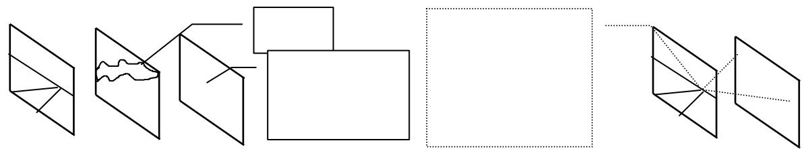

### 3)Construction optique

Reprenons à présent le schéma optique de Lacan5. Il peut se commenter en trois temps et deux scansions, comme la construction du cross-cap. Pour cela, il faut se situer dans l’après-coup du basculement du miroir ; rappelons que ce dernier s’accompagne, dans la monstration de Lacan, d’un autre mouvement, celui du sujet qui se déplace en I(A), là où il voyait son image auparavant.

Le dessin de la page 680 des Ecrits laisse planer une ambiguïté, puisqu’il représente les deux situations en même temps, avant et après ce double mouvement. Si l’on dissociait ces deux temps (coupure), il faudrait se rendre compte qu’au 2ème, le sujet se retrouve en un lieu où il n’y a nulle image : il observe d’où il n’est pas, ni réellement, ni imaginairement. C’est une position purement symbolique. Dans cette situation où il observe l’image inversée haut et bas, il se souvient de l’image précédente, qui a disparue et dont il a pris la place. Ainsi, il peut établir des comparaisons entre les images des deux temps, et, par un jugement (Verurteilung, ou Urteilsverwerfung) trancher entre ce qui est semblable et ce qui est différent. Ce jugement (qui rejette et choisit) peut se comparer au refoulement assumé comme coupure6, 3ème destin de la pulsion (ceci demanderait plus ample discussion), tandis les constats d’orientation obtenus reflètent les deux premiers (cf. le texte de Freud de 1915, « Les pulsions et leurs destins » GW X). Le sujet a alors pu se rendre compte :

1) De l’inversion (Verkehrung ins Gegenteil7): si, dans le premier temps, l’image était apparue en tout point identique à l’objet, cette illusion se dissipe par l’inversion évidente du miroir horizontal. Le miroir inverse donc la dimension qui le traverse, haut-bas à présent, (coupé de) devant-derrière précédemment. La fonction du miroir s’avère identique à cette inversion ; je m’identifie imaginairement à cette dimension qui peut s’inverser ou pas (identification z – z = 0 ou y – y = 0). Je me considère donc comme étant à une seule dimension, celle-ci qui s’inverse, trouant le miroir. Ce trou est imaginaire (occupé par une image à deux faces : S2) et je l’observe depuis le vide d’une place symbolique (S ). La dimension impossible à inverser, z au 2ème temps, y au 1er, s’avère un trou réel dans l’image : identique à ellemême, elle répond à la définition de l’aspéculaire. Ce trou correspond à celui du vase où viennent se loger les objets a. La dimension y reste passive par rapport à l’action de l’Autre, le miroir, par opposition à l’activité, identique à la dimension z, que j’ai mise en œuvre pour changer de position. C’est la définition du 1er destin de la pulsion.

## ↑

2) Du retournement (Wendung gegen die eigene Person): ici, il faut faire intervenir l’image du corps, et non un vase. Ce dernier, symétrique autour d’un axe haut-bas, ne nous permet pas de nous repérer plus avant. Le sujet s’est placé en I(A) : devant le miroir à présent Torsion = trou de l’acte de se posé à l’horizontale à ses pieds (virtuels !), mais derrière la position précédente du miroir. LaPlan parallèle au retourner : x – x = 0 comparaison de ma présence symbolique (aumiroir $2 ^ { \mathrm { { e m e } } }$ temps) à cette place où était mon image (au 1er temps) permet de juger de ceci : ma main droite symbolique, vient se placer là où était ma(plan objet) y y main gauche imaginaire (identification $x - x = 0 )$ . Je me suis retourné, ce qui a produit, en Plan perpendiculaire au- plus de l’inversion de la dimension z, l’inversion de la dimension x. Prenant la place de monmiroirxi(a) i’(a)1 image, au moment même où elle disparaît, j’ai effectué moi-même l’action de l’Autre, le miroir : ce qui est le $2 ^ { \mathrm { { \dot { e } m e } } }$ destin de la pulsion, le retournement sur la personne propre. C’estPlan parallèle au le destin proprement symbolique de la pulsion, la trouure, soit : le travail de la pulsion demiroir mort, se liant le plus souvent, comme l’indique Freud, à l’inversion passif-actif, ainsi qu’il le(plan image) a place du trou théorisera plus tard dans le fort-da.

La rotation par laquelle je suis passé symboliquement derrière le miroir s’est effectuée autour de l’axe y (et non autour de l’axe x comme le laisserait supposer le dessin des « Ecrits »), c'est-à-dire en passant par la dimension z, celle qui troue le miroir et les plans qui lui sont parallèles (plan de l’objet et plan de l’image).Le retournement concerne une dimension d’un plan parallèle au miroir et une dimension d’un plan perpendiculaire au miroir. Cette traversée d’un plan à un autre correspond bien à la Wendung gegen die eigene Person, passage de l’Autre au Sujet par le biais d’une torsion, autre nom de la trouure. Elle engendre bel et bien, conceptuellement, la place du trou, le cross-cap, puisque au $2 ^ { \mathrm { { \dot { e } m e } } }$ temps, il n’y a, en ce lieu, ni corps réel, ni image du corps. Il $\boldsymbol { \mathrm { n ^ { \prime } y } }$ a rien d’orientable, et même rien du tout, mais c’est de là que s’engendre l’orientation. Nous avons achevé l’annulation des trois dimensions, en deux temps. C’est bien ainsi que le cross-cap n’est pas spéculaire.

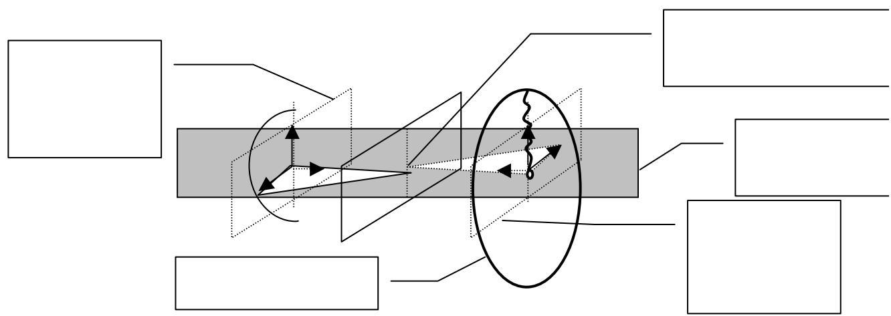

### - Scansion

5) Du renversement (inhaltiche Verkehrung ou Verwandlung des Liebens in ein Hassen8): Freud subdivise en deux la Verkehrung : l’inversion de la passivité à l’activité (que nous avons appelée inversion proprement dite), et l’inversion du contenu (que nous appellerons renversement pour plus de clarté, puisque Freud utilise aussi : Verwandlung de l’amour en haine). Une fois comprise la structure du retournement, il devient possible de se rendre compte que celui-ci n’a pas eu lieu dans le $2 ^ { \mathrm { { e m e } } }$ temps, dans le rapport de l’image réelle $i ( a )$ , à l’image virtuelle $i ^ { \prime } ( a ) _ { 2 }$ dans le miroir à présent horizontal. Si je me place symboliquement dans le point de vue où j’étais en $i ( a ) ,$ , la rotation, s’effectue autour de l’axe z, qui était la dimension du trou du miroir vertical. Mais au miroir horizontal, cette dimension du trou, $y , \mathrm { j ^ { \prime } y }$ suis déjà. Contrairement à la situation du miroir vertical, je ne sors pas d’un plan parallèle au miroir pour passer de l’autre côté. Je reste dans ce plan qui est le mien, perpendiculaire au miroir. Il ne s’agit pas de la trouure d’un plan (acte de trouer), mais de l’identification au trou comme tel, en tant qu’ici, il se fait plan : trou réel, rempli des deux faces $\Gamma \mathrm { u n }$ trou imaginaire $( \Phi _ { 0 }$ et $\mathrm { P _ { 0 } }$ dans le schéma I), et non-trou symbolique. Le renversement inverse les deux dimensions d’un même plan. Ce qui correspond bien à la transformation de l’amour en haine : il n’y a pas de changement d’objet (de plan), mais inversion de la valeur de l’objet pour le sujet.

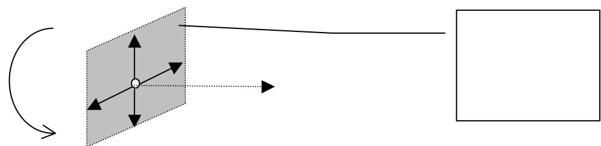

Néanmoins, ça parle, puisque ça tourne autour de l’axe $z ,$ non concerné par le renversement : le trou symbolique - $\cdot \ \varphi \ ( - x , \ - z )$ est devenu un trou imaginaire $\left( - x , \ - y \right)$ , orienté par la rotation autour d’un axe réel, petit a (z). Ça parle du passage de l’érotomanie à la persécution, ou de la manie à la mélancolie. Dans ces deux cas, il $\boldsymbol { \mathrm { n } } ^ { \prime } \boldsymbol { \mathrm { y } } \ \boldsymbol { \mathrm { a } }$ pas de changement d’objet (l’autre pour le premier, le moi pour le second), mais seulement changement de la cotePlan-trou du yi(a) - de valeur. Il reste une hétérogénéité de la structure : il manque toujours une dimension à êtremiroir(surface-trou)x inversée.

$$
i ^ {\prime} (a) _ {2}
$$

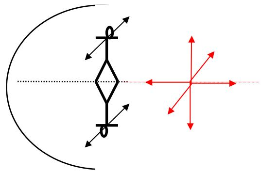

Cette hétérogénéité disparaît si l’on considère l’aspécularité du miroir sphérique qui fournit le socle du montage optique. L’inversion y est homogène selon les trois dimensions. Et là, ça ne parle plus : c’est l’autisme. L’image réelle devient à son tour objet pour le miroir sphérique, qui produit une 2ème image réelle, enchasublant en tous points l’objet réel initial, et ainsi de suite en un renvoi infini, au point qu’on ne peut distinguer ni image, ni objet mais un seul continuum. L’aspécularité est totale. Cet espace, où tout point est annulé par lui-même, trouve sa correspondance topologique dans la surface de Boy, qui ainsi s’oppose radicalement au cross-cap. De plus, la surface de Boy ne nécessite pas les deux scansions de la construction du cross-cap : l’annulation des trois dimensions se fait d’un seul coup. Néanmoins, tout en gardant ces caractéristiques fondamentales, des modalités apparaissent dans l’image, en modifiant la distance du sujet au miroir. De dimension nulle lorsque le sujet se place à l’infin (autisme absolu), elle se morcelle en trois à l’approche du centre (schizophrénie), tout en grandissant jusqu’à l’infini (délire des grandeurs), pour disparaître au foyer (fin du monde), avant de réapparaître comme image virtuelle lorsque le sujet est entre le foyer et la surface du miroir. Dans cette zone, elle retrouve alors les conditions du miroir plan9 . Comme quoi, de la psychose, on en sort. Il suffit de laisser le délire se dérouler dans son approche du miroir sphérique.

### UN ÉCHANGE AVEC CARLOS BERMEJO, DE BARCELONE

Cher Richard,

Au premier, je vous remercie par votre patience et encouragement.

J’essaie de vous répondre et je commence à nouveau pour que ma réponse ait de la consistance. Beaucoup de sujets que j’exprime dans la suite vous les connaissaient bien, mais une ligne d’argumentation m’aide et, en plus, elle peut aider à bien des collègues qui veulent réaliser le rapport entre sa practice et la rigueur soit logique, géométrique ou topologique. Je m’excuse si ça peut-être très longue.

La spécularisation, et ses corrélats dans la clinique, c’est un terme compliqué, nous essayons du voir claire et de bien repérer la l’interne.

A mon avis il faut différencier net le concept dans le narcissisme et dans le fantasme, et puis les articuler. Ça nous permettra différencier la clinique du psychotique du celui du névrosé.

### Eclairements

a) a) Tous les objets ont image dans le miroir (moins les vampires, je plaisante, mais j’ai beaucoup des rêves dans mes analysantes où ils viennent à figurer un tas de choses…en relation au phalus imaginaire et ses positivités)

b) b) Il y a des objets que son image en différentiable (imaginairement sans l’aide du signifiant) de son image miroir. Ces objets son spécularisés (s’il le faut, bien entendu)

c) c) Il y a des objets qui il n’y a pas façon de pouvoir les différencier de son image, donc non spécularisés.

RA là-dessus, Lacan a pu varier ; parfois il nous dit que l’objet n’a pas d’image dans le miroir, parfois il nous dit que, être inspécularisable, c’est avoir une image qu’on ne peut pas distinguer de la réalité.

Cette différence, d’être possible, de quoi devient-t-elle? Nous savons qui elle révèle de l’orientation. Mais, à mon avis, il faut bien différencier l’intrinsèque de l’extrinsèque à ce sujet.

Les objets qui ne sont pas orientables eux-mêmes, alors, toujours ils ne sont pas spécularisés (eje. bande du Möbius),

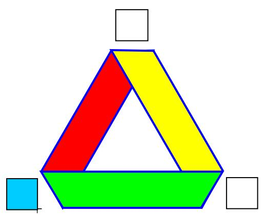

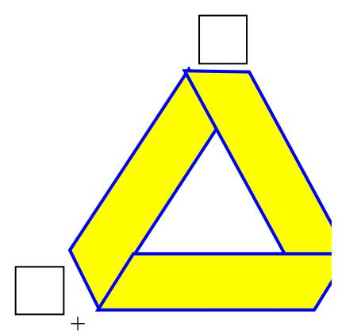

RA : tout dépend du référentiel, Carlos ! il y a trois points de vue possibles au miroir :

celui d’un observateur (crois bleue) placé derrière l’objet (point rouge) qu’il observe dans le miroir (image : point vert)

celui d’un observateur placé devant l’objet qu’il observe dans le miroir (et alors il doit se retourner il ne peut pas voir en même temps et l’objet et l’image)

celui d’un observateur identifié à l’objet qu’il observe : c’est le narcissisme

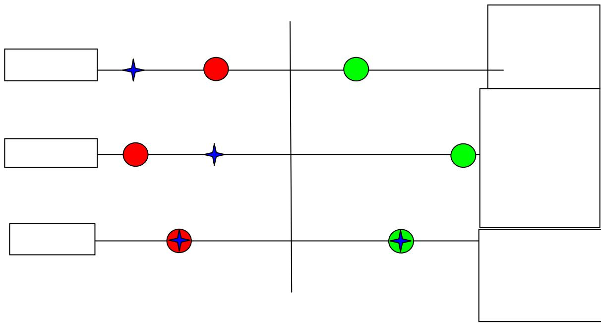

évidemment ce sont des subtilités que Lacan n’a pas étudiées, mais elles sont là. On ne peut pas parler du miroir sans préciser de quel point de vue ! … mais à mon avis il y a erreur de la part de Lacan sur toute la ligne concernant cette question.

En effet, soit l’écriture de la bande de Mœbius :

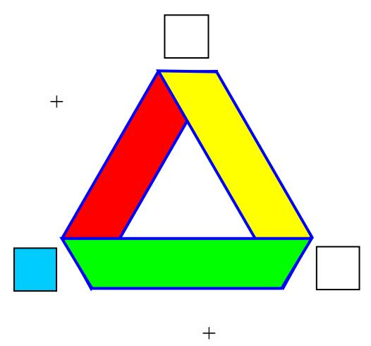

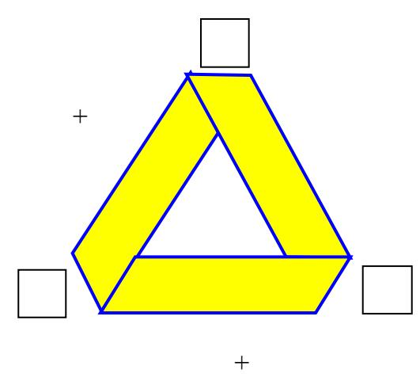

il y en a deux ! c’est comme le miroir : c’est plus complexe que ce que Lacan avait prévu. Il y a la bande hétérogène à gauche et l’homogène à droite. Hétéro ; une torsion est de sens contraire (« -», par opposition à « + »). Homo : toutes les torsions sont de même sens. Pour se débrouiller dans l’orientation, il est essentiel de repérer ça.

L’hétéro, dans le miroir, on voit bien qu’elle est spéculaire, quel que soit le point de vue : elle présente une hétérogénéité de structure qui la rend spéculaire à tout coup. Point de vue postérieur : ce qui est vu par l’observateur dessous sur l’objet est vu dessus sur l’image. Le sens de toutes les torsions est inversé :

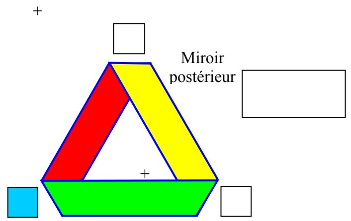

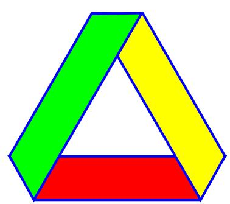

note : pour apprècier le sens d’une torsion, il faut se donner un sens de rotation arbitraire, puis noter si, en conservant ce sens de rotation, dans la figure de droite comme dans celle de gauche on passe de dessus à dessous (sens « + ) ou de dessous à dessus (sens « -»). Le sens de la torsion ne doit pas être repéré avec une dimension telle que « droite-gauche » qui ne peut pas être valide ici.

Au miroir antérieur :

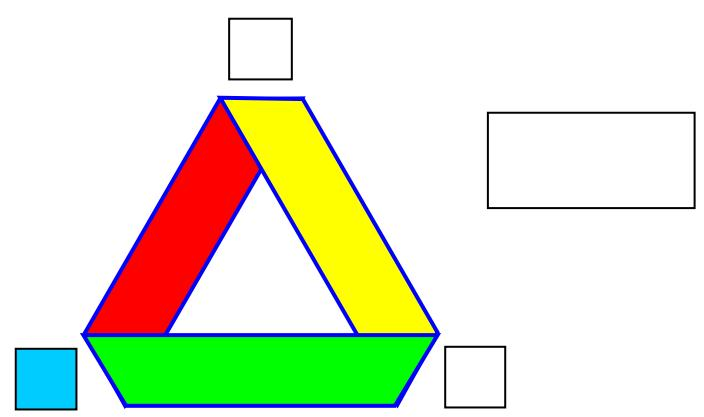

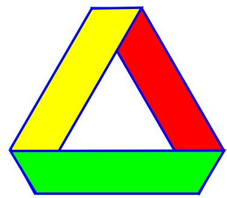

le sens de la torsion du haut est aussi changé (pas celui des torsions du bas…eh oui, c’est pas simple !), et la partie « unilatére » (jaune) est passé de droite à gauche.

Au miroir narcissique, ce serait la position « intrinsèque » par opposition aux deux précédentes qui développent un point de vue extrinsèque . Je m’identifie à une bande de Mœbius et je me regarde dans le miroir ; mais comme lorsque je m’identifie à mon corps propre, je fais inconsciemment un retournement pour m’identifier en fait à l’image du miroir qui inverse la droite et la gauche.

Ici il n’y a pas moyen de reconnaître l’objet de l’image. Se serait donc le cas de la non spécularité… sauf si j’écris la bande de Mœbius de cette façon –ci, qui distingue une droite et une gauche :

Miroir narcissique

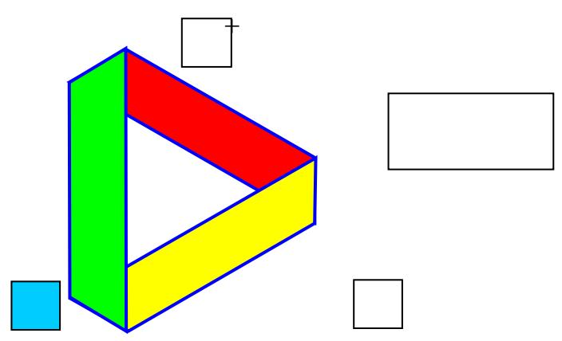

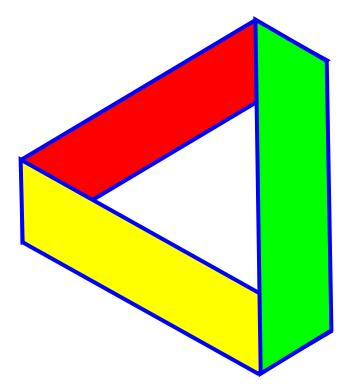

Et pourquoi ne l’écrirais-je pas ainsi ? Pourquoi ne tiendrais-je pas compte de cette dissymétrie, qui compte, comme pour notre corps, et de quelle façon! C’est ce qui nous permet de dire, en désignant notre image : ceci est moi, et ce n’est pas moi, ce n’est que mon image. Donc, le miroir narcissique permet de développer deux points de vue : Le point de vue précédent, purement subjectif : mon image, c’est moi, et celui-ci, objectif subjectif, c'est-à- dire discordantiel : ceci est moi, et ce n’est pas moi.

J’ajoute que si on n’écrit pas la bande de Mœbius avec ses trois torsions on reste dans le flou, le vague, et l’incertain, car on ne dispose pas des repères nécessaires. On ne sait pas avec quelle bande de Mœbius on travaille, ni de quel point de vue.

Et l’autre bande de Mœbius, l’homogène ?

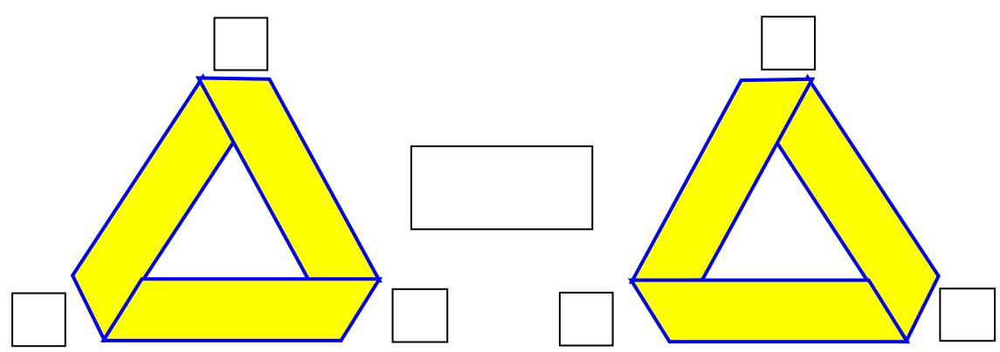

Le point de vue postérieur inverse le sens des torsions. C’est donc un point de vue spéculaire. Le point de vue antérieur présent exactement le même aspect :

Ce point de vue n’est pas spéculaire, comme le point de vue narcissique, sauf si je l’écris comme ceci :  
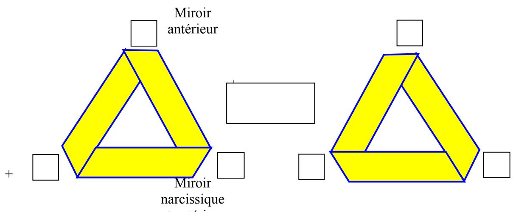

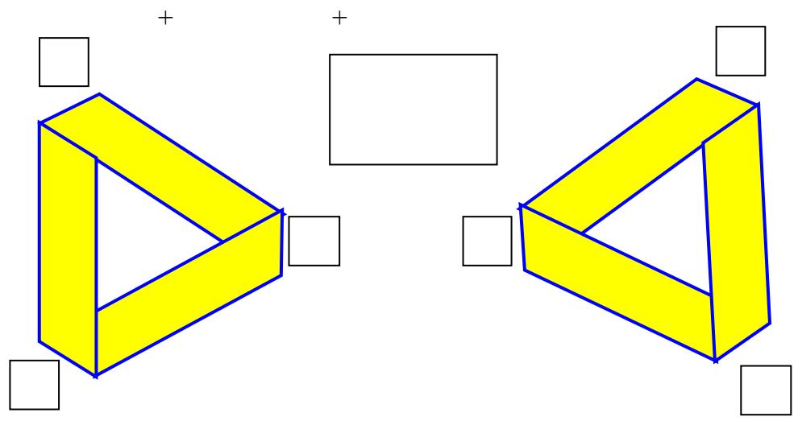

Qui restitue une hétérogénéité droite gauche, intrinsèque : car si je m’identifie à mon image, alors, l’intrinsèque inclus l’objet et l’image.

Mais ce qui est intéressant, c’est de constater qu‘au point de vue antérieur, c’est la même chose, sauf qu’on n’a aucun moyen de distinguer le point de vue extrinsèque du point de vue intrinsèque… sauf la conviction intrinsèque.

Mais dans tous les cas, je suis obligé de contredire Lacan : un unilatère, tel la bande de Mœbius est parfaitement spéculaire. Par contre si on retourne extrinsèquement la bande de Mœbius, eh bien ça ne change pas le sens de la torsion du haut, mais ça change celui des deux torsions du bas. Eh oui, le problème est beaucoup plus complexe que prévu !Mais quoi qu’il en soit du sens des torsions, ça inverse la gauche et la droite : c’est une spécularité.

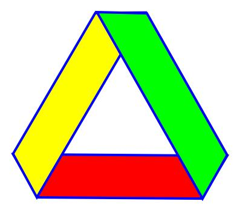

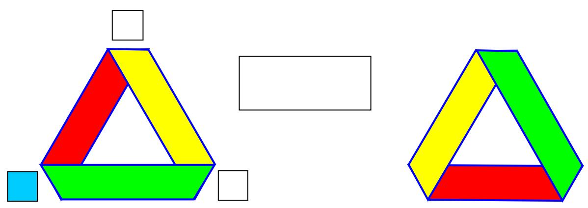

Mais si on retourne intrinsèquement la bande de Mœbius sur elle-même, c'est-à-dire si on retourne sa torsion par une manipulation, et là, ce ce point de vue là seulement, elle ne change pas, elle est non-spécularisable :

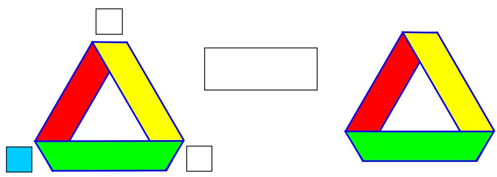

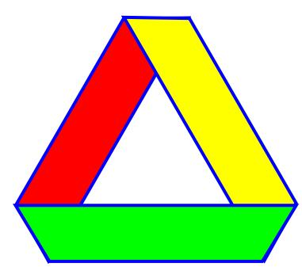

mais les objets qui sont orientables (bande bilatére) ils sont toujours spécularisés? PAS à mon avis. Retournement extrinsèque

RA en effet : là aussi ça dépend terriblement du point de vue !

La raison c’est que nous avons dans la topique de l’imaginaire deux espaces : le double du miroir (real et imaginaire) et l’espace de l’objet. Dans l’espace du miroir nous pouvons introduire en plus (ça c’est extrinsèque au miroir) la référence tridimensionnelle (trois axes+ cartesiénés) Et alors il faut rejoindre les deux propriétés: orientabilité ou pas de l’objet et l'inversion de la troisième dimension (axe) orthogonal à l’espace miroir.

RA : L’axe cartésien des trois dimensions fonctionne aussi bien dans l’espace objet que dans l’espace image, non ? mais il faut introduire une 4ème dimension, qui est celle du sens des torsions : sans quoi il nous manque un élément de repérage fondamental.

Il n’y a pas d’orientabilité intrinsèque d’un objet : l’orientation, c’est toujours ce qui introduit un rapport à … à un repère justement

Note. Nous avons dans le miroir, l’image réel de corps, i(a), l’image virtuelle i’(a), le phalus imaginaire, ϕ, et l’objet a. A ces deux dernières nous pouvons les ajouter ses deux images miroir, on a donc 6 objets dans la topique de l’imaginaire.

RA : je ne comprends pas : Lacan indique bien, dans « l’angoisse », le reprenant de l »identification » que l’objet a n’a pas d’image dans le miroir. Par contre, dans le miroir un manque vient parquer cette absence d’image et ce manque est noté ϕ.. Je suis désolé, mais je ne vois pas comment on pourrait avoir 6 objets. On a le corps, i(a) et son image i(a),, , le manque étant justement la troisième dimension qui s’inversant inaugure le trou, le trou symbolique par lequel l’image se structure, c'est-à-dire devient visible. Par contre, la dimension haut-bas ne s’inverse pas, elle est donc inspécularisable, quel que soit le point de vue (attention : haut-bas n’est pas dessus- dessous ). En ce sens, la dimension dessus-dessous ( devant-derrière) représente le phallus, le trou dans l’image en tant qu’il est fonctionnel, il produit littéralement l’image, tandis que la dimension haut-bas représente l’objet a, celle à laquelle on ne pense jamais parce qu’il est trop évident pour nous que nous avons les pieds sur terre et la tête dans les nuages.

C’est donc bien la lettre volée, cette dimension, aussi évidente que la lettre posée « entre les jambages de la cheminée » que personne ne remarque.

Voilà qui permet de se récupérer sur son Lacan. Il avait raison… moyennant quelques petits correctifs.

Rappelons-nous que dans un miroir la dimension inversée c’est la dimension orthogonale (perpendiculaire) à la surface du miroir. Un objet bidimensionnel et parallèle à la dite surface il est impossible de le différencier de son image, alors il est non spécularisable. .

RA : Mais non pourquoi ? Un objet bidimensionnel, c’est quoi ? c’est une lettre, une écriture puisque toute écriture est sur une surface plane. S’il a deux dimensions, alors il a haut-bas et droite gauche : dans les trois points de vue au miroir, seul le point de vue postérieur n’inverse pas la droite et la gauche. Les deux autres le font. Je crois reconnaître dans votre point de vue celui de Vappereau : selon lui, le miroir n’inverse qu’une dimension sur trois, ce qui est toujours faux . Il y a trois points de vue, donc les trois dimensions y passent (au statut non-spéculaire). Le miroir, selon les points de vue, inverse toujours deux dimensions sur trois, mais à chaque point de vue, c’est une dimension différente qui n’est pas inversée. Comme vous le voyez, il m’apparaît impossible d’adhérer à ce point de vue de Vappereau qui ne tient compte que d’un seul point de vue très partiel.

J’ai essayé d’en parler amicalement à Vappereau qui n’a jamais voulu rien entendre… et qui n’a jamais argumenté sur mes points de vue, se bornant à les balayer d’un revers de main (droite, je crois).

Maintenant, légère précision : l’objet bidimensionnel peut présenter une symétrie droite-gauche, et alors oui, il n’est pas spécularisable. Mais il faut préciser ça. Un cercle par exemple, s’il est sur un plan parallèle au miroir, n’est pas spécularisable. Mais un triangle, si. Faites l’expérience ! même un triangle équilatéral : il suffit de l’écrire avec une pointe à droite pour que, au miroir antérieur, et au miroir narcissique, elle soit reflétée à gauche.

Alors l’image i(a) et $\mathrm { i ^ { \circ } ( a ) }$ ne sont pas spécularisés (régression au stade de miroir) [en mat c’est la différence entre homéomorphisme qui conserve la orientabilité ou pas, en outre, semblant ou équivalence]

Mais s’il est une surface comme un verre (orientable), alors la troisième dimension (il n’a que deux en lui-même, mais il est plongé dans un espace à trois) elle ferait l’inversion qui permet l’spécularisation, mais comment? En Mat: Homéomorphisme entre les deux espaces (réel et virtuelle) qui ne conserve pas l’orientation du verre plongé. L’objet verre n’a pas en lui-même une référence tridimensionnelle, et en plus lui il est un objet isotopique. C’est ici où vient la fonction du phalus imaginaire.

RA comprends pas. Vous voulez bien dire un verre dans lequel on boit ? Certes intrinséquement, c’est une surface à deux dimensions. Mais, plongé dans l’espace trois du miroir, c'est-à-dire l’espace euclidien devant, et son reflet tout aussi euclidien (3 dims) derrière…..il est en effet inspécularisable mais uniquement du fait de sa symétrie par rapport à une axe central. Si vous le renversez… d’un point de vue « objectif » dans le miroir, vous verrez, s’il a un pied par exemple, le pied à gauche, et dans l’image, le pied à gauche aussi : il serait donc toujours inspécularisable. Par contre au point de vue subjectif, vous voyez le pied à gauche, et en vous retournant vous le verrez.. à votre droite !<le point de vue change le référentiel change et on ne peut plus s’en tenir à la même conclusion. De même au point de vue objectif-subjectif, si vous vous identifiez au verre (et c’est bien la question de l’identification que viennent nous poser les analysants : qui suis-je ? sous le couvert du Che vuoi ? qu'est-ce que je veux ?), vous avez votre pied à gauche, et dans ce référentiel mnésique (devant le miroir, j’avais le pied à gauche) je peux dire : maintenant que je m’identifie à mon image j’ai le pied à droite.

Pour le narcissisme, nous savons que chez le psychotique son narcissisme se soutienne du phalus imaginaire, pourquoi ? Il ajoute à son image moïque le phalus imaginaire en orthogonalité au miroir, c’est ça que lui permet maintenir la spécularité et non retourner dans le stade du miroir dans la quelle ses deux images, i’(a) et i’(a) ne son pas spécularisablés et nous avons le double. C’est à dire, i(a)+ϕ est spécularisable avec i’(a)+ ϕ. (Le phalus du mon semblant il a le sens contraire du mien) La leurre habituel c’est dire que le miroir fait l’inversion de droit et gauche, c’est pas ça….pas pas ça.

RA : alors c’est ça ou pas pas ça ? ce n’est pas un leurre de dire que le miroir fait l’inversion droite-gauche :c’est une façon d’accepter d’être dupe tout en ne l’étant pas, en disant de manière discordantielle : ce n’est que mon image, c'est-à-dire c’est moi et ce n’est pas moi. Celui qui est dans un moment psychotique ne peut plus faire ce discordantiel : il assimile en effet son moi et son image. Mais ce sont les points de vue que j’ai démontré plus haut, ceux (rares) où il y a forclusion du miroir, où l’image ne se distingue pas de l’objet. C’est beaucoup plus fréquemment le cas pour la bande de Mœbius homogène, qui en ellemême supprime toutes les différences lisibles sur la bande de Mœbius hétérogène. En ce cas, toutes les dimensions sont ramenées à la dimension qui ne s’inverse pas, à l’objet a. c'est-à- dire en effet que le manque phallique -ϕ est ramené à l’objet a dans sa présence qu’on peut effectivement noter + ϕ. l’ objet a est en effet toujours absent : sa présence serait une contre définition. On peut donc la noter +ϕ, c’est mieux.

Il faut seriner les collègues avec cet éclairement.

RA : ben… ça dépend lequel du coup…

Il y a une référence précieuse dans Freud, « La pulsion et ses destine », Il parle de la pulsion éscopique et il dit qui il y a une phase première dans la quel le sujet regarde son membre sexuel, phase qu’il rapproche de l’autoérotisme. F, .

RA : oui, ce texte est très précieux : on y trouve les trois temps de la pulsion : actif, passif, réflexif qui sont les trois temps du miroir tels que je les ai élaborés plus haut. Regarder son membre sexuel, c’est comme regarder aussi la troisième dimension, celle qui peut permettre le surgissement de l’image au miroir.

Cette référence je n’ai pu pas la comprendre sans ci-dessus. Il y a outre référence chez Lacan « Subversion d… » Page 822, … sa position « en pointe….. »

RA : oui, je reconnais bien là la théorie de Vappereau.

Note.- Il est vrai que Lacan nomine i’(a) image spéculaire, et il y a deux possibles réponses à cette erreur, ou bien Lacan nomine image spéculaire à i’(a)+ ϕ (triangle imaginaire du schème R, c’est á dire qu’il suppose toujours le triangle) ou bien il fait une erreur. Le quel ? Il n’a pas bien compris que la référence tridimensionnelle dans le miroir elle n’est pas immanente au miroir mais qu'elle est une référence ajoutée au miroir. Peut-être dans le séminaire 11 il a déjà compris et pour ça utilise le terme « miroiter » et pas spécularisable pour les images simples dans le miroir.

RA c’est vrai, il n’a pas compris un certain nombre de choses, Vappereau non plus. Par contre il a bien compris que le miroir est une métaphore du langage, fonctionnant sur la manque : le manque à être inversé d’UNE dimension sur trois. (et non de deux dimensions sur trois)

Cela nous exprime bien la clinique du psychotique, s’il perd son identification (de sujet) au phalus imaginaire, il tombe dans l’impossibilité de différencier lui et son semblable, il n’y a pas de spécularisation et il perd son identification imaginaire (du moi) et il souffre le phénomène du double. C’est important bien saisir que l’identification de i(a) à i’(a) exige qu’ils soient auparavant différentiables si non il n’y a pas d’identification imaginaire.

RA exactement : pas de similitude sans différence et vice-versa. Ceci dit tout le monde s’identifie au phallus imaginaire et dans ce cas, on s’imagine soi-même au manque de l’autre. A cela s’ajoute l’identification à celui qui a le phallus imaginaire.. ou pas, et à ce moment là, il s’agit du manque propre par rapport à l’autre. C’est la dialectique de l’être et de l’avoir, qui va décider de la sexuation.

Retournons aux névroses, ils font son rencontre avec la castration imaginaire, c’est à dire, ils non plus ne peuvent pas soutenir toujours le narcissisme du phalus imaginaire, alors pourquoi ne font la régression au stade de miroir? , Puis qu’il y a « a » en plus. L’objet qui dans la psychose parait dans la réalité et qui reste caché dans la névrose, cache dans l’image du moi (mais ça grâce au fantasme, qui ne tient pas chez le psychotique)

Si nous suivons mes raisons quand le névrosé rencontre le trou dans l’image spéculaire, et c’est ça à mon avis ce que travaille Lacan dans le séminaire de l’angoisse, il se soutienne du fantasme par conséquent soutienne son narcissisme adjoint au fantasma, moyennant le plongement dans l’espace du miroir de l’objet « a »

RA : Justement dans « l’angoisse » Lacan dit bien que l’objet a ne se reflète pas dans le miroir. Le fantasme, c’est s’imaginer en possession de ce qui de toute façon n’est pas possédable.

Nous avons tous dans notre cabinet de sujets névrosés qui ont eu l’expérience de ne pas se reconnaître dans le miroir chez lui, ils non pas faite une régression à l ‘stade du miroir, le problème vient à cause qu’ils ne peuvent pas se situer bien de l’objet à. Nous avons une autre façon d’exprimer ça, une chose est la relation de sujet a l’idéal qui structure son narcissisme et une autre le S1 en relation à S2 qui structure le fantasme en sa dimension imaginaire.

RA : comprends pas. Pourriez vous en dire plus là-dessus ?

Disons que le « a » est non spéculaire (en principe à cause de n’être pas orientable)

RA et là nous sommes parfaitement d’accord contre Lacan qui dit dans « l’identification » que l’objet a est « orientable, certes, et orienté ». . Mais ça ne tient pas face à son affirmation d’un objet a inspéculartisable. S’il est inspécularisable, c’est qu’il n’est pas orientable. .

et le i’(a) non plus.

RA du coup, si : i’(a) est justement l’image dans le miroir, elle peut pas être inspécularisable ! ou alors j’ai psychanalyse compris ?

S’ils se rejoignent, fournissent un plan projectif immergé, et cet dernière il est spéculaire, encore qu’il n’est pas orientable en lui-même.

RA comprends pas. Si a rejoint i’(a), alors, en effet, toutes les dimensions sont inversées et on ne peut pas distinguer l’objet et l’image. ça fait un cross cap, si on veut. Que voulez-vous dire par « inorientable en lui-même » ? puisqu’il est impossible de parler de quelque objet que ce soit « en lui-même » : tout est toujours dans un rapport à un référentiel, sans quoi on ne sait plus par rapport à quoi on s’oriente. C’est la question des points de vue qu’il est nécessaire de préciser. Lacan posait le cross cap comme non spéculaire, mais comme il ne dis pas non plus de quel point de vue…

Mais son immersion permet différencier une immersion dextrogyre et une lévogyre.

RA même question : par rapport à quoi ? où est placé l’observateur ? dextro et lévo font appel à l’image du corps, donc à l’image dans le miroir, donc à quel point de vue dans le miroir ? surtout que , comme je l’ai montré plus haut, il s’agit du sens de la torsion, il faut donc préciser par rapport à quel repère, en prenant en compte quelles dimensions ? j’ai montré que la dimension dextro-lévo ne vaut pas pour la torsion sur une bande quelconque. Ne sais pas si elle vaut pour le cross cap, ce dernier n’ayant pas de réalité l’espace euclidien à Trois dimensions , je ne vois pas à quoi on peut référer son plongement dans cet espace. Par contre elle vaut pour le nœud borroméen ou le trèfle, mais elle n’a rien à voir avec droite gauche, qui est une autre dimension ;

Nous pouvons donc nous en passer de la référence tridimensionnelle qu’introduit le phalus imaginaire pour soutenir le narcissisme (c’est à dire le narcissisme se soutienne du fantasme et de la réalité, c’est à dire du désir) C’est à dire que le sujet peut accepter la castration imaginaire sans détruire le narcissisme. La clinique lacanienne et tout à fait claire à ce sujet, la réalité ne se soutien pas du narcissisme mais du fantasme, et ils sont relies (schéma R)

RA : mais où Lacan a-t-il parlé de clinique ? à part discuter celle des autres (de Freud, de Margaret Little thomas Szaz, de Kriss, etc… ce qu’il fait d’ailleurs fort bien) . c’est bien notre problème avec Lacan !

je ne crois pas que nous puissions nous passer de la référence tridimensionnelle : la 3ème dimension vu qu’elle ne cesse pas de ne pas s’écrire (l’écriture n’a que deux dimensions), c’est celle du réel, et pas n’importe quel réel : celui de l’énonciation, qui est celui de la fonction de la parole en acte, la fonction symbolique par excellence. Celle qui troue la surface de l’imaginaire, permettant ainsi le mouvement de passage d’une face à l’autre, d’un côté à l’autre de la page bref : de tourner la page, comme nous disons en français, ce qui est une expression imagée pour dire : laisser tomber le passé et se tourner vers le futur, ce qui reste à désire, ce qui reste encore à écrire. Je ne parle donc plus là du phallus imaginaire, qui certes en prend le relais lorsque le $3 ^ { \mathrm { e m e } }$ dimension prend consistance, mais lorsqu’elle reste trou, trouure pour être plus précis, c'est-à-dire acte de trouer, la $3 ^ { \mathrm { e m e } }$ dimension devient le trou du phallus symbolique autrement dit, la fonction phallique. C’est le double trou P et Φ du schéma R. il se transforme en $\mathrm { P _ { 0 } }$ et $\Phi _ { 0 }$ dans le schéma I, c'est-à-dire que ce sont de trous dans la trouure, donc plutôt des bouche-trous. Dans le schéma R le trou entoure la surface du schéma, qui est bande de Mœbius hétéro c'est-à-dire passage d’une face à l’autre de la surface. : pour ça il y faut bien la troisième dimension du trou, pour ne pas rester fixer sur une face qui ferait alors symptôme. Dans le schéma I, ces trous étant bouchés c’est le contraire, il sont passés à l’intérieur de la surface. Mais celle-ci du coup devient indéfinie : elle n’a plus de bord qui se recoupent. Toute la structure ne peut alors faire la différence entre le bord et le trou voire entre le trou et la surface ; il n’y a donc plus de manque. Ou alors il n’y a que du manque. Ça c’est la bande de Mœbius homo.

C’est pourquoi je tiens la bande de Mœbius comme la 3ème dimension comme telle, celle de la coupure appelée encore fonction phallique. La réalité, selon moi, résulte du percement de la surface imaginaire par la trouure symbolique. Un certain narcissisme me semble indispensable à la soutenir, de même que le fantasme. Tous deux peuvent trouver représentation dans la zone jaune de la bande de Mœbius : le narcissisme parce qu’il est le lieu ou le sujet « prend son propre corps comme objet » (définition de Freud) : cette zone jaune est celle qui est proprement moebienne, confond en effet le dessus et le dessous comme le narcissisme confond le moi et l’objet. Cependant dans la névrose, à côté du narcissisme il y a un investissement d’objet, cet objet ayant deux face, la rouge et la verte , comme le montre la bande hétéro. La psychose au contraire ne propose pas autre chose que le narcissisme, comme l’écrit la bande homo, dans laquelle toutes les zones sont semblables…et qui a beaucoup plus de mal à trouver son image dans l’un des points de vue du miroir.

De même le fantasme trouve sa place en dans l’articulation les deux sortes de trou de la bande :

La trouure symbolique P, auquel s’identifie le sujet : c’est le mouvement de la torsion comme tel, \$

Le trou dans la trouure , ce qui bloque le mouvement , qui va faire « fixation » c'est-à- dire symptôme , et d’une manière plus générale, formation de l’inconscient, c'est-à- dire la zone désorientée jaune, l’objet a.

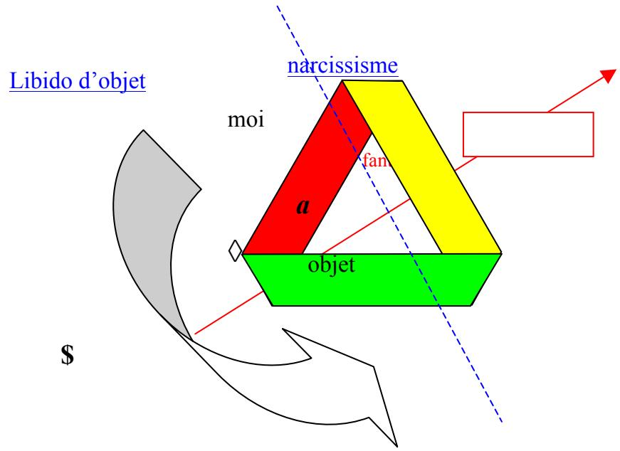

Le schéma suivant montre la passage théorique de la bande homo à la bande hétéro par coupure et changement de sens d’une torsion: « d’un préliminaire à tout traitement possible de la psychose » ! :

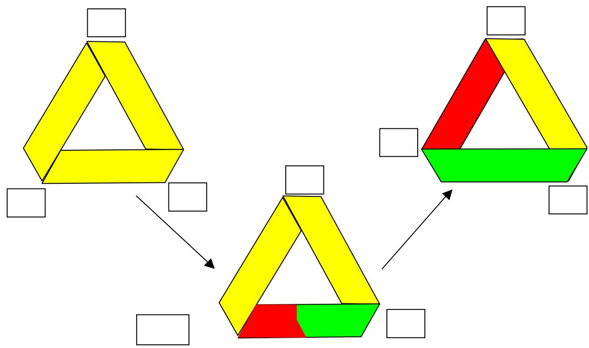

Je crois que c’est ça que Lacan tracasse dans « l’éprouve par l’objet "a" Un narcissisme pas seulement soutenu par le phalus. Bon c’est ma lecture. Rappelons qu’encore Lacan n’a fournit pas le corps comme un S1, mais il est presque. Il visualisait que l’imaginaire n’est pas une structure déjà là et il avance l’objet et pas le S1 encore.

RA . que voulez vous dire par S1, le corps ? pour moi le S1 est dans le trou ΦP, c’est l’agent au discours du maître, c'est-à-dire la fonction, la fonction de la parole en acte donc une autre appellation de cette trouure.

Cela implique que le narcissisme, moyennant le fantasme, il dépende du signifiant et de+ + l ‘Autre, et de la pulsion. Toute la doctrine Lacanienne…que nous connaissons….

Il reste alors la question: d’où vient-t-elle la possibilité de fournir une référence tridimensionnelle (dextro y levo) hors le phalus imaginaire? a

RA ben … le phallus symbolique. S1. Le trou ΦP.P

Alors il vient la topologie de surfaces et le concept d’aliénation (mon travail touche cela)Φ

Le problème vient quand, dans le séminaire 11 Lacan commence à n’être aussi dualiste qu’il+ + + était auparavant entre le registre narcissique et le registre de la parole. Il veut relier narcissisme et fantasme, de façon meilleure que dans le séminaire de l’angoisse. Il commence à penser les registres noués. Alors il fournit deux opérations de l’aliénation, une narcissique et l’autre pulsionnel. Une sans signifiantes et l’autre avec eux. Mais le narcissisme, et son aliénation, il n’est plus sans référence à l’objet a, c’est là qu’il vient la « preuve pour l’objet a »

RA oui, ça va assez bien, je trouve avec l’écriture de la bande de Mœbius que je proposais cidessus. Métaphore Lettres =

(simultanéité

savoir de l’Autre

Mais nous avons à ajouter deux tipes de signifiantes Le savoir de l’Autre et la structure )in-tension ex-tension pulsionnel (ou le langage comme vous voulez) structure du Signification

RA pourquoi deux types de signifiants ? je n’en vois qu’un mais, éclairez moi… si cepulsionnel : littoralP énonciation n’est que la savoir de l’Autre, c’est ma façon de le comprendre, c’est l’articulation d’unSignifié signifiant avec un signifiant en souffrance, non encore prononcé : l’écart entre ces deux Métonymie signifiants produit la surface d’une lettre. Nous aurions donc : structure du pulsionnel :(contiguité)(lettre volée) l’articulation des deux signifiants , savoir de l’Aute ; la surface engendrée. ce qu’on peut lireΦ objet a sur la tracé d’un simple croisement :Réel Frontières

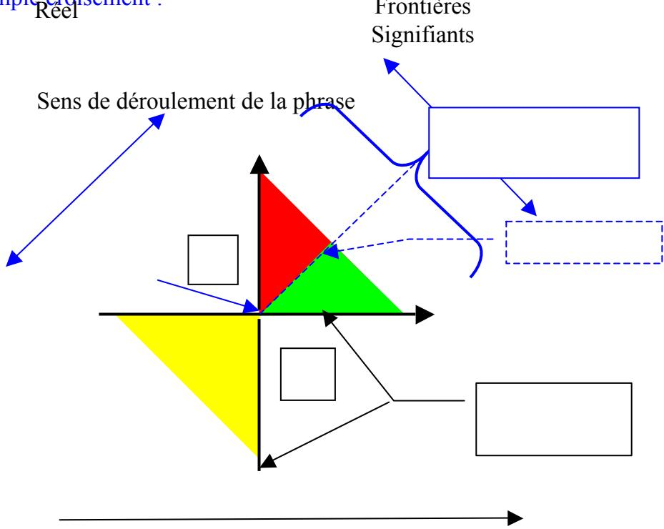

autrement dit la différence entre deux types de signifiants, je la vois, moi, comme la différence entre la lettre et le signifiant ; qu’en pensez-vous ? Dans la schéma ci-dessus on voit bien en effet la pulsion tourner autour de l’objet a : ce croisement n’est autre qu’une torsion empruntant les deux trous Φ et P et tordant la surface

Pour les deux opérations d’aliénation Lacan change d’outil, il n’utilise plus les cercles de Euler-Ven, mais des plans proyectives, Pourquoi ? A cause que les négations sont à l’intérieur des surfaces, et pas dehors. Mais il continue à les dessiner comme cercles d’Euler y ajoutant une lunule intérieure qui représente la négation. Voyez-vous pourquoi s’il y a deux cercles pour faire l’aliénation (soit dans le registre narcissique ou dans le pulsionnel) il faut penser en deux plans proyectives (troués si vous voulait) et les relier. Ça implique être dans une bouteille de Klein.

Lacan commence à l’utiliser dans le séminaire 12. « a tutti pleni » et dans les schémes de 13 14 15.

Cliniquement il est très significatif que l’objet « a » maîtrise l’aliénation narcissique, au contraire comment comprendre le moins du phénomène psychosomatique? . Le sujet qui pâtit des troubles psychosomatiques perd la tridimension du phalus imaginaire et il reste collé au corps narcissique, et c’est à cause de ça que Freud dit que une part du corps prend le roll des génitaux.

RA exact. J’appelle ça la fonction « gelée » en objet, comme dans la surface jaune de la bande de Mœbius. Il perd en effet la troisième dimension comme attribut, parce qu’il devient la troisième dimension comme telle : c’est le passage d’avoir le phallus à être le phallus. Par forcément dans l’ensemble du corps : dans le phénomène psychosomatique, la fonction phallique est genée en objet en un endroit prècis du corps où elle devient « être le phallus » seulement à cet endroit là/

Donc, la verbe miroiter n’est pas spéculariser. Lacan l’utilise pour définir l’opération narcissique qui introduit le non-lust dans le ich et c’est pour ça que j’ai, dans la premier part de mon travail, passé le lust de un plan sur l’outre et au revers. Ils sont miroités par l’objet « a »

Vous me posez une question, pourquoi passer une dans l’autre, donc c’est exprimé. L’autre question que vous me posez sur l’objet « a » qui pour vous il est la bande moebiéne et dans mon travail c’est la bande bilatére. J’ai une réponse : cet objet n’est plus l’objet « a » imaginaire mais l’objet « a » symbolique, l’imaginaire viendra au représenter.

RA : ah ! ça tombe mal je pensais l’objet a comme réel. Il ne cesse pas de ne pas s’écrire. Mais en effet il a une fonction symbolique : cause du désir, et ce qui cause le désir prend une coloration imaginaire dans notre monde, et ce sera les substituts de l’objet a. sein merde regard et voix.., et tout autre substitut imaginable. Mon écriture de la bande présente l’avantage d’écrire ces trois registres à la fois :

réel de la surface, représenté par la désorientation de la surface jaune.

Imaginaire des objets substitutifs dans les zones orientées verte et rouge.

Symbolique du trou.

Donc il n’est pas nécessaire qu'il soit orientable ou pas et quoi que se soit à cet endroit.

RA : comme réel il est inorientable. Comme imaginaire, il le devient du fait de l’action du symbolique

C’est le reste de une opération symbolique de double négation que ne donné pas comme résultat la proposition, c’est à dire, sa valeur que les mathématiciens intuitionnistes ne veulent rien savoir, et que moi suivant la logique de Vappereau j’ai appelé « paramétrique »

RA la négation dans la logique modifiée de Vappereau ne me semble pas de l’ordre de la double négation, dont l’une annule l’autre ; quoique, ça y ressemble. C’est plutôt l’impossibilité de la négation, comme dans l’inconscient. Ou comme dans mes surfaces jaunes : elles ne sont ni dessus , ni dessous, (indécidable) ou alors elles sont et dessus et dessous (contradiction), exprimant chacune de ces formules l’un des deux théorèmes de GÖdel. Si vous appelez « double négation » le « ni…ni » alors OK on est d’accord. Ou encore c’est le « ne » explétif, que je préfère appeler « discordantiel ».

Une référence à cette valeur: Pierre Ageron « Logique, ensembles. Catégories. Le point de vue constructive » Ed. Ellipses. París.

Alors pour la référence levo et dextro je crois que c’est le moins fi, -ϕ, qui fait au niveau du désir ce que faisait le phalus imaginaire pour le narcissisme (la fonction tridimensionnelle) C’est ma lecture de « Subversion… » Lacan dit que le –fi il est comme un nombre imaginaire qui permet à sujet et au a de imaginariser l’autre » Alors un troisième dimension d’une autre nature (cela ouvre la fantasme au real comme impossible) relation avec S(A/).

RA oui, le S(A/) est un trou : donc 3ème dimension. Mais pour lévo et dextro dans votre dire, là, je vois toujours pas.

Ma lecture emporte que des opérations du phalus symbolique permettent au plane proyective immergé se faire levo et dextro = fournir que la dualité de la quel je parlerais plus bas s’articule avec le miroir et la spécularisation.

RA pour moi, là, il est plus clair de se référer au Nœud borroméen : lui au moins, il a une existence dans notre monde à trois dimensions, et on n’est pas obligé de spéculer sur une représentation approximative. Le nœud borroméen, de toute nécessité s’écrit lévo et dextro , oui. il s’écrit aussi droite et gauche, c’est là que je démontre justement la différence entre ces deux dimensions, la gyrie d’une part (lévo-dextro), la chiralité de l’autre (droite-gauche). Ça nous introduit en effet aux 4 écritures du nœud (8 si on tient compte de la 4ème dimension, la dimension haut-bas, dont on ne peut pas tenir compte avec le cross cap.. ou alors j’ai pas su faire). Ces 4 écritures sont liées entre elles par, comme par hasard les trois opérations miroir que j’ai décrites plus haut. Voir mon texte « une théorie de la dimension » sur mon site si on veut en savoir plus. Les 4 dimensions de l’espace nœud sont : la gyrie, la chiralité, la centration (centrifuge-centripète = dessus-dessous, c’est la 3ème dimension), et enfin haut-bas.

L’avantage du nœud borroméen pour cette étude c’est qu’il est précis, on peut en donner une lecture parfaitement mathématique et exhaustive.

Vous trouverez alors que le nœud de Whitehead et sa réciprocité totale (je préfère dire dualité totale, et je pense que Lacan me l’accorderait) c’est tout à fait accordé avec le fait que l’objet « a » il est la bande Möbius ou la bande bilatére ça dépend ; et on voie ça dans les mouvements du fantasme dans la cure (tantôt le réel qui se représente occupe une place tantôt l’autre place)

### RA ah oui !!! c’est exactement ça ! d’accord

Donc, les deux bandes du bouteille de Klein (inconsciente et Ca) ne son pas dans le miroir, sont corrélats pour penser l’espace ou se déplient les opérations de la pulsion et l'inconscient.

RA : ah alors, ce « donc », je comprends pas du tout. Je saisis pas ce passage à la bouteille de Klein ; en quoi est-il nécessaire ? inconscient et ça, ça m’apparaît comme venant de deux moments de la pensée de Freud pour penser la même chose, donc difficilement représentable sur une même figure. L’inconscient s’oppose au préconscient et au conscient, le ça s’oppose au moi et au surmoi, et ces deux façons de découper ne se recoupent pas, il me semble : une partie du surmoi est inconscient, par exemple, et prend sa source dans le ça. L’inconscient est dépositaire d’un savoir : c’est une écriture, donc une surface. La pulsion tourne dans le trou autour de l’objet : elle est dans le trou. Alors comment ça peut se déplier avec la Bouteille de Klein, ça ?

Le problème qui reste encore c’est que j’utilise une bande pour le –fi et je vous l’accorde c’est un rafistolage. Mais je ne trouve pas (Lacan non plus) la figure topologique d’un manque. Un bord vient bien pour un objet trou joint dans une surface. Mais pour une magnitude négative ????

RA mais si c’est bien ça : la bande de Mœbius, c’est le bord comme tel. Réduit à une surface zéro, c’est un pur trou. La bande de Mœbius peut se lire comme le paradoxe d’une surface qui est un trou en même temps. Comme trou, c’est le manque. Dès que sa dimension « largeur » prend de l’ampleur, c’est le fi qui se met à la place du trou.

Si je suis bien orienté alors, il y a dans les opérations d’aliénation au moins trois négations, d’un cercle (bande) a l’autre, et la négation interne au psychanalyse = le signifiant c’est la négation de la chose. Un plus il faut ajouter que l’inconsciente ça se ferme et ça s’ouvre. La clinique nos apporte que l’objet n’est toujours envisageable, au contraire nous étions bien dans le calme s’il n’éclore pas.

RA je vois pas bien vos trois négations ; pour moi il y a la négation forclusive, celle des logiciens, et la négation discordantielle des grammairiens (Damourette et Pichon) qui correspond selon moi à la négation de la logique modifiée de Vappereau. Quelle correspondance feriez vous de vos trois négations avec les deux miennes ? ça me permettrait peut-être de voir cette troisième qui me manquerait.

Quelle opération vient de l’inconsciente, donc la répétition donc les huit intérieurs. Et c’est là que j’ai trouvé la négation paramétrique (modifié de Vappereau) qui me permet penser les signifiant et les objets « a » dans une surface.

RA ben non justement les signifiants, je ne peux les poser que comme bord : c’est le bord commun, ce qui passe entre l’analysant et l’analyste. Chacun développe à partir de ce bord sa face imaginaire, mais ce bord qui passe, il est symbolique ; ce qui est dit, c’est – théoriquement – ce qui est entendu : voilà l’identification des deux faces par le bord. Maintenant, l’objet a est justement une lettre volée, c'est-à-dire un bord qui a pris de la surface, mais une surface désorientée, assimilable à un bord. Le signifiant n’a qu’une dimension, conformément déjà à la définition de Saussure : « la linéarité du signifiant »…reprise par Lacan, qui en a modifié la portée, mais, à mon sens, pas la dimension. Mais on retrouve mon « ni…ni » si il vous agrée pour parler de cette négation discordantielle que je réfère plus à Damourette et Pichon qu’à Vappereau. Ni dessus, ni dessous..

Le rectangle, (bande bilatéré) Qui si l’inconsciente se ferme elle disparu. (Ligne sans points) et faire du même pour le –fi.

Vous avez raison, l’Hélix de Lacan est une bande Möbius et ne pas une bilatéré mais je parle du encontre Ça et Inc et non du miroir. Et le moins fi es un manque, mais de la manière que je le fais 4 négations son bien serrés :

a) a) la négation de l’être par le signifiante

b) b) la négation classique du signifiant,

c) c) la négation du je pense pour le fait de que c’est Ça qui pense,

d) d) Et la négation qui suppose la répétition qu’entraîne l’objet perdu.

RA ah voilà ! 4 négations maintenant ! bon, je vais méditer ça. Est-ce que ceci recueille votre accord :

a) le mot n’est pas la chose.(forclusion)

b) Le vert n’est pas le rouge. (forclusif)

c) Ce n’est pas ma mère. (discordantiel)

d) Le mot qui le désigne n’est pas l’objet perdu : mais c’est pareil que a).. alors ? y’a une différence ? je vois pas.

En plus nous voyons comme pas-je et recouvert pour je suis (= non « je ne suis pas »), le faux être qui dit Lacan, l’aliénation à tutti pleni. Et nous pouvons voir que sans la répétition il sort la formule de Descartes,

Retournant à notre problème avec la magnitude négative Lacan a le même problème et a mon avis il pose deux cercles et le –fi dans l’intersection et parfois le a. Il résout le problème en disant que la lúnule d'intersection c’est un trou dans un des cercles et un manque dans l’autre, et il l’écrit a/-ϕ..

RA oui, je crois qu’en étudiant les cercles d’Euler, Lacan tourne autour de la topologie sans encore y parvenir, d’autant qu’il ne dispose pas concept de surface désorientée par rapport à surface orientée (Vappereau non plus), il n’a que : orientable et inorientable (comme Vappereau). Une surface orientable peut être orientée ou pas orientée (désorientée). Une surface inorientable peu toutefois par une coupure, prendre de l’orientation ; ça nuance ! C’est pourquoi j’ai un peu laissé tomber l’écriture de ses cercles dans lesquelles il me semble se perdre un peu ; y’a qu’à voir les différences des nominations qu’il introduit dans les différents espaces des cercles qui se croisent. Bref, il cherche… au fond, c’est son rapport a/-ϕ qu’il a du mal à écrire. Sans la différence entre surface et trou, il peut pas y arriver non plus. Je propose :

a, surface désorientée : trou réel de désorientation au sein des surfaces orientées.

\- -ϕ trou de l’autre côté du miroir, à l’emplacement de a, trou symbolique, donc, qui sera recouvert par des + ϕ substitutifs : surfaces orientées, signifié et signification.

Signifiant : bords des trous. Ça permet d’en parler mais ça sera jamais ça : jamais un bord ne sera la surface ! sauf l’objet a, c'est-à-dire l’impossible.
