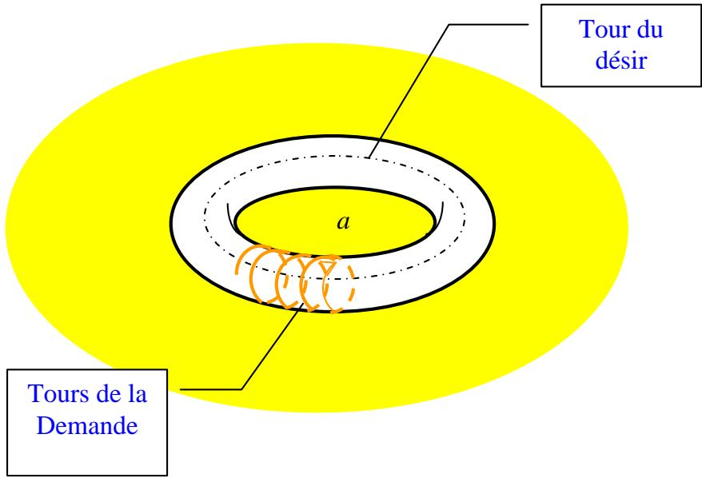
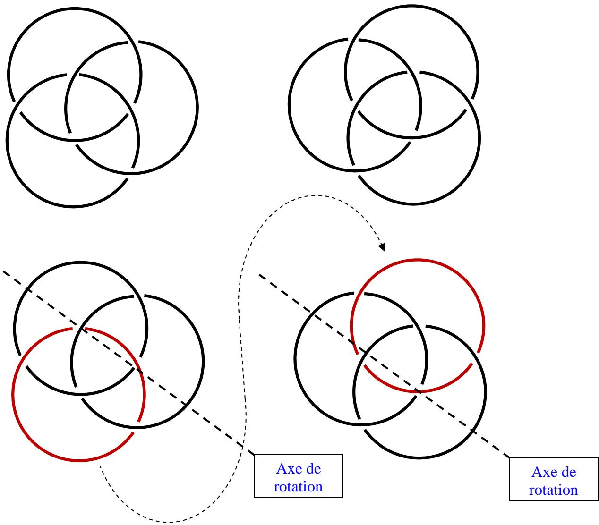
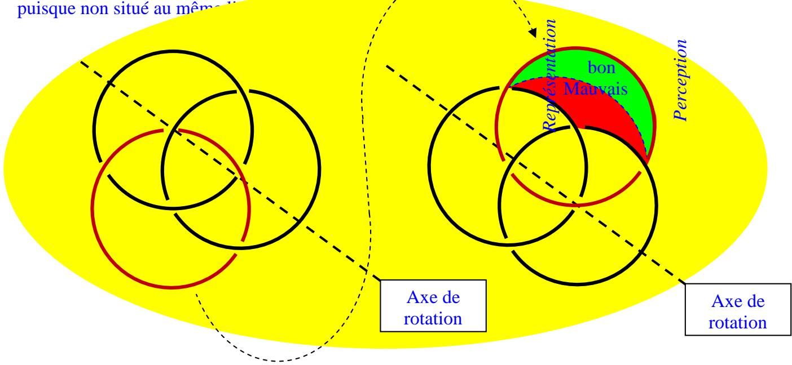
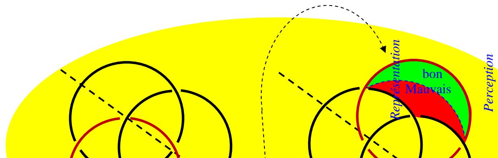
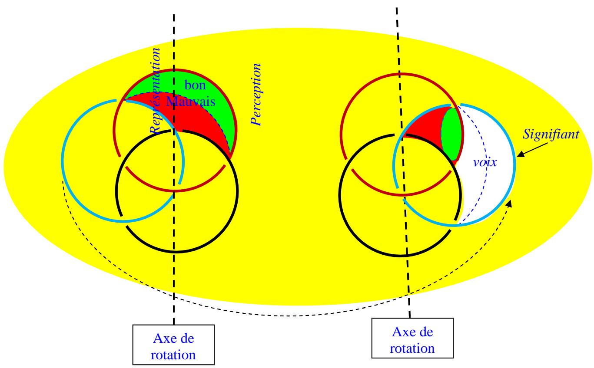
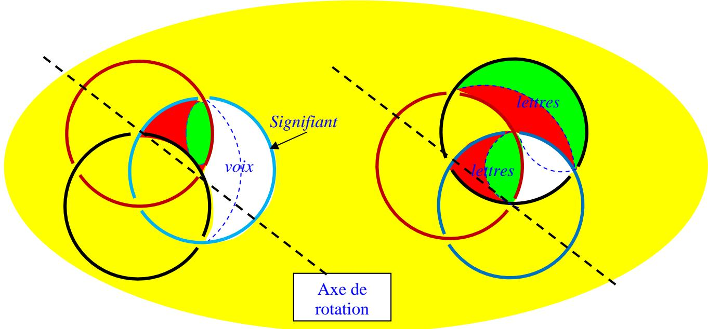
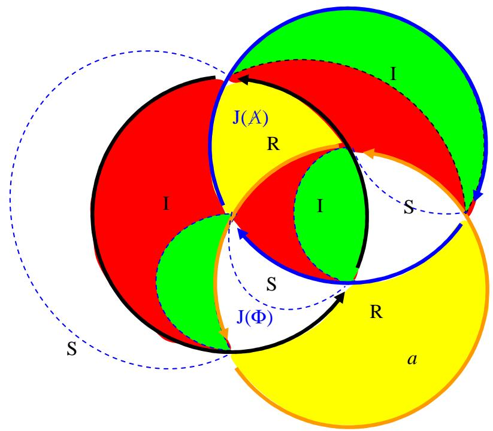

Hélàs, Richard, hélàs, je ne vois pas!, je sais que c'est un tort (!!!) - et puis-je, avec cette humilité sans tâche qui me caractérise, vous supplier, oui, vous avez bien lu!, vous demander une fois encore de remettre l'ouvrage sur le métier, voire de revêtir votre manteau de topologue, celui que vous avez rémisé sous votre tenue, autrement seyante, de critique d'art, et de reprendre vos pinceaux, pour démêler le mien du sien

RA c’est si joliment dit qu’il ne saurait être question de se dérober.

et jusqu'à démonstration du contraire je tiens que l'objet (petit) a est l'inter-sexion(!) des trois registres!

RA : cette démonstration, je vous l’ai proposée un nombre incalculable de fois. Je vais recommencer encore une fois. Comme d’hab ça me fera progresser !

Bon, alors le tore. Vous connaissez ça :

Vous pouvez donc saisir la différence entre le trou interne (tour de la demande) et le trou externe (tour du désir), où Lacan avait situé l’objet a. le trou interne : ça in-siste, ça se tient in, à l’intérieur. C’est le symbolique. L’autre trou est externe, il ex-siste, il se tient dehors, ex. c’est le réel, c'est-à-dire l’objet a en tant qu’impossible à saisir. C’est pourquoi on tourne autour. Entre les deux, ce qui fait la coupure entre les deux est une surface, celle en quoi le tore con-siste. C’est tout con. C’est l’imaginaire, c'est-à-dire ce avec quoi nous avons affaire dans la réalité de tous les jours : con, avec. Du latin cum.

Ceci est une certaine étape dans la théorie de Lacan.

On peut la questionner : entre le trou interne et le trou externe, la seule différence tient au lieu. Dans les deux cas c’est du trou, quand même. Peut-on soutenir avec une seule écriture, le trou deux concepts différents ? D’autant que ça se discute : le symbolique est quand même amené de l’extérieur à l’intérieur : nous apprenons à parler par les autres, quand même.

Il faut donc mettre ces trous en perspective. Dans la passé, lorsqu’il a parlé de tour dans le symbolique, à propos de la psychose. Dans le futur lorsqu’il a définit le symbolique comme le trou. On peut mettre en accord ces contradictions en comprenant que dans la première acception le trou lacanien signifie un défaut dans la symbolique. La seconde, la plus tardive, fonde bien le concept de trou sur le concept de manque qui lui était là dès le début, chez Lacan. Le manque n’est pas un défaut. C’est au contraire la qualité essentielle du symbolique.

Et pourtant, si le symbolique peut être définit comme le trou, c’est bien parce qu’y’a comme un défaut : c’est le symbolique s’appuie sur le réel, au sens où y’aurait pas de trou sans quelque chose à trouer. On peut donc reformuler le défaut du symbolique, c’est le réel mais d’un autre point de vue c’est sa qualité, parce que pas l’un sans l’autre.

Le réel s’avère donc comme ce qui fait obstacle au symbolique, ce qui ré-siste à la trouure. Ce pourquoi le symbolique in-siste. Entre les deux l’imaginaire fait surface. Mais pas n’importe quelle surface : une surface orientée, par opposition à la surface inorientée que représente le réel. seule une surface peut boucher un trou. Ce qui fait « trou » au sens de défaut au symbolique dans la psychose, c’est une surface désorientée. Ce qui permet de s’en sortir c’est l’orientation.

Rappelez-vous ma théorie du nœud borroméen. Elle se base sur le mouvement d’un seul rond autour de l’axe que forment les deux autres :

Vous pouvez concevoir que le morceau de surface qui était circonscrit dans le rond qu’on a mis en mouvement reste en place dans mouvement .par contre de dedans qu’il était il se retrouve dehors. De l’autre côté, le morceau de surface sur lequel nous reposons le rond était dehors, et le voilà pris dedans. Vous sentez la dialectique qui se met en place ? C’est celle du fort-da. Je jette au loin un objet (fort ; le morceau de surface qui était dedans et qui se retrouve dehors), et je ramène un morceau certes identique mais en même temps différent puisque non situé au mêm

Je colorie à présent en jaune le fond de surface, le « réel », car c’est une surface désorientée, car illimitée.

Posons que nous ne savons rien de ce morceau de surface qui était « dedans » au départ. Mais posons que de mettre dedans quelque chose qui était dehors nous apporte quelque chose, une information, une orientation. Nous savons au moins ceci, de manière irréfutable : c’était dehors et à présent c’est dedans. Nous avons donc dedans un bout dehors. Est-ce là l’essentiel ? Non. Ce que nous avons mis dedans, c’est avant tout la distinction dedans dehors, c'est-à-dire un critère de jugement. Un jugement au sens où Freud en parlait dans « la négation » c'est-à-dire quelque chose qui tranche entre dedans et dehors. Ce qui est bon, nous le mettons dedans ce qui est mauvais, nous le mettons dehors. C’est l’ébauche de la construction de l’inconscient par le refoulement. Vous voyez l’importance de la chose, car en plus, nous inaugurons la métaphore : bon/mauvais = dedans/dehors. Et de même, nous inaugurons l’espace, soit ; la topologie. Car cela (bon/mauvais = dedans/dehors), c’est ce que j’appelle la dimension. Ici, les vecteurs ne nous sont d’aucune utilité. Par contre, disposer d’un critère qui nous permette de préserver notre intégrité corporelle, et donc de nous construire une image du corps, s’avère de prime importance. Voilà ce qui construit l’espace : la construction du corps comme espace dedans se situant au sein d’un espace dehors. Entre les deux, des échanges écrit par le mouvement d’un rond autour d’un axe.

Je vais tenir compte de ce que nous avons mis dedans un critère de distinction dedansdehors, et je vais l’écrire par une limite, une coupure qui va séparer deux zones de la surface que je viens de mettre dedans : ce sera mon image directrice pour ma conduite future un truc que les anciens appelaient la Prudence, sachant que la Mémoire est une partie essentielle de la Prudence. Eh oui, se souvenir des expériences passées peut aider pour l’avenir. Il faut bien avoir dedans des représentations des trucs mauvais pour éviter d’avoir à nouveau à les mettre dedans, et les conserver dehors afin de conserver notre dedans intact. Paradoxe, hein ? Mais la représentation n’est pas la chose. C’est pourquoi l’enfant met dedans une représentation de « maman partie » ce qui est très mauvais, mais enfin ça permet d’attendre. Mieux, ça permet d’être créatif et d’inventer un jeu pour jouer seul en l’attendant. Cette représentation de l’absence c’est le « fort » : l’éloignement, la coupure entre l’objet et soi. Au moins si je ne peux rien à ses départs, je peux maîtriser la représentation en l’envoyant moi-même se balader sous forme de représentation.

Combien de couples ont-ils sombrés sous l’impérieuse nécessité de cette formule : je quitte avant d’être quitté !

Je divise donc la zone que je viens de mettre dedans en deux zones afin que ma mémoire se rappelle cette distinction fondamentale. J’écris en pointillés bleus la coupure entre une zone verte = bon, et une zone rouge = mauvais. En d’autres termes j’écris une ébauche de l’image du corps entre bouche et anus, entre ce qui doit entrer et ce qui doit sortir. J’écris une représentation du tore mais pas comme un tore, qu'est-ce que ça peut faire ? Il s’agit de métaphore. Ce qui est bon est en même temps très clair : c’est bon, j’ai envie de m’en rappeler ? C’est pourquoi c’est une zone de surface circonscrite par deux traits, deux arcs de cercles. L’un d’eux est la coupure que je viens d’inaugurer (en pointillés bleus) qui sépare les représentations entre elles les représentations du « bon » et les représentations du « mauvais ». la seconde, je viens juste d’en prendre conscience, c’est la limite du rond entre intérieur et extérieur, c'est-à-dire la limite entre représentation et perception, c'est-à-dire entre mon corps et la réalité. Ce qui est mauvais est moins clair, car il y a des mauvaises choses dont je n’ai pas envie de me souvenir. Parce qu’elles auraient pu être bonnes peut-être, bien ? Comme coucher avec maman par exemple, hein ? c’est pourquoi la zone « mauvais » reste ambigüe : elle est enserrée par trois traits. L’un est la coupure que nous venons d’inaugurer, très bien, elle fonctionne. Si c’est interdit, c’est interdit. Mais les deux autres côtés sont deux ronds différents.

Qu'est-ce qu’un rond ? C’est ici qu’il faut le dire : c’est un signifiant. C’est pas R, pas S pas I, c’est le signifiant, c'est-à-dire le symbolique en tant qu’il laisse des traces dans l’imaginaire, les lettres. La zone « bon » était circonscrite par un seul rond et une coupure : le rond « bon », le signifiant « bon ». Mais la zone « mauvais » dispose de deux signifiants, et s’ils sont deux c’est que c’est pas les mêmes ! y’a peut-être bien un signifiant « mauvais » mais et l’autre ? L’autre, on sait pas. C’est peut-être un avatar de « bon », quand même... Quoiqu’il en soit il faut faire avec les deux c'est-à-dire avec un symptôme ! Ou un rêve ! Enfin, une formation de l’inconscient, qui est toujours une formation de compromis entre deux représentations contradictoires, deux lettres contradictoires.

Comme on sait pas, ben, il s’agit de l’inconscient, autrement dit, l’insu. Vert, je passe, rouge, ça passe pas, je veux pas savoir. C’est insaisissable et donc impossible à saisir : assimilable au réel, du point de vue du sujet : un réel interne, à distinguer de ce que je ne peux saisir du dehors qui reste un réel externe. Par conséquent ça ne peut que pousser à retourner un autre rond pour tenter de résoudre la contradiction, faire la part enfin entre « bon » et mauvais ». Voilà la source pulsionnelle : ce qui pousse au mouvement, une contradiction linguistique.

Alors je vais retourner l’un des deux ronds concernés pour voir ce qu’il y a dessous !

Mais cette fois-ci je vais opérer une différenciation dans l’algorithme. Dans le premier cas, j’ai tenu compte de ce que je mettais dedans. Cette fois je vais marquer ce que je mets dehors, car maintenant je sais un peu ce qu’il y dedans. Je ne suis plus dans le même état par rapport à mon corps. Ce que je mets dehors c’est quoi, de la parole. Je parle à quelqu'un. Et je tiens compte, dans mon écriture, de ce que les représentations de mots ne sont pas des représentations de choses : si ces dernières peuvent être représentées comme des images, avec deux dimensions, la parole n’a qu’une dimension, le temps. Seul le rond se meut dans la distance qui me sépare de l’autre, le rond c'est-à-dire le signifiant. Les lettres restent dans ma mémoire. D’ailleurs, du fait de ce mouvement, les voilà un peu comprimées car la zone que j’avais marquée d’une différence dimensionnelle a changé de place. Mais ce que le rond va découper dans la surface de l’autre (que je peux saisir : de mon point de vue ça reste un réel), ce ne sera qu’un trou. Au mieux, c'est-à-dire si l’autre en question accepte d’être entamé. En gros, c’est l’analyste.

Je vais donc marquer ce mouvement de la parole, dans mon écriture théorique, par un pur blanc le trou du symbolique en acte en train de trouer l’autre mais aussi bine moi-même, car ce que je dis si j’accepte de m’entendre (en analyse), me remue, c'est-à-dire me troue. Le trou dont je l’écris représente aussi bien l’affect tel que je l’éprouve (et que je ne saurais décrire sur le moment où je l’éprouve) que la voix qui s’en fait le support. Bine entendu, il n’y a pas de signifiant seul : un signifiant représente un sujet pour un autre signifiant. Chaque signifiant reste solidaire dans son mouvement des signifiants qui le lient dans la mémoire non encore prononcés, ou… qui se prononcent à mon insu, dans un lapsus ou dans un double sens par exemple : ce dont rend compte le fait qu’il y a aussi deux zones dans ce trou : une zone où se dit ce que je crois dire, bien encadrée par deux traits, et une zone d’ambigüité encadrée par trois traits.

Ça me permet de faire un retour sur l’étape précédente : si celle-ci est l’étape de la parole, la précédente était celle de l’écriture, c'est-à-dire de la mise en mémoire, consciente et inconsciente. La parole ne concerne que le signifiant, le rond comme tel, mais toujours en lien bien sûr avec l’écriture, ce que j’ai mis en mémoire et que je cherche à dire, ce que je vais mettre en mémoire de m’être entendu, ou d’voir entendu l’a réponse qui m’est faite en retour qui me permet de m’entendre. L’écriture se pose en revanche sur les surfaces, progressant ainsi de pas en pas en orientant de plus en plus de zone. Voici la mise en mémoire c'est-à-dire l’écriture des bouleversements que le dire a créé :

Nous avons retourné les trois ronds, mais il reste des ambigüités, c'est-à-dire des formations de compromis, c'est-à-dire du symptôme. Ça nous pousse donc à continuer, en alternant ainsi moment de trouure (parole) et moment de coupure (écriture). Vous avez la méthode, vous pouvez continuer sans moi. Et vous apercevrez qu’au bout de trois nouveaux retournements, le trait pointillé bleu, la coupure, se retrouve à son point de départ : la coupure se recoupe. Autrement dit : l’analyse est achevée. L’analyse de cette écriture du nœud borroméen, comme métaphore du procès de la psychanalyse.

Vous verrez que ça donne ça :

Ou une légère variante, car je n’ai pas forcément commencé du même pied que dans ce qui permet d’obtenir la figure ci-dessus ; mais qu’importe : la structure en reste la même ; la coupure s’est achevée en trouure. Nous constatons dans tous les cas, que, bien sûr nous pouvons continuer de retourner des ronds (encore heureux !), mais que la coupure en pointillés bleus ne pourra que repasser là où elle était déjà passée. Rien de nouveau ne pourra plus se produire. Car nous avons mis à jour la structure et si celle-ci permet de retourner des ronds à l’infini (de continuer à vivre, c'est-à-dire à parler, quoi !) ; en tant que structure elle est immuable. C’est pourquoi on la retrouve partout.

Elle repassera là où elle était passée c'est-à-dire qu’elle ne passera jamais dans les deux zones laissés à l’écart, que j’ai laissées en jaune : des zones qui restent donc désorientées, toutes les autres étant orientées, sauf les zones de trou qui témoignent de la fonction orientante, l’énonciation. Ces deux zones, voilà ce qui reste de réel « dedans » c'està-dire au sein de la structure : l’objet a et la jouissance de l’Autre.

On le voit, Lacan avait eu la géniale intuition de la place de ces deux zones de désorientation a et J(A). Par contre il s’était planté en situant l’objet a au centre, c'est-à-dire à la croisée des trois registres, comme vous dites Jean Pierre ; ici, il n’y a de toute façon plus trois registres, sauf à les reconnaître comme trou pour le symbolique (lieu de sens et de la jouissance phallique ; blanc), surface orientée pour l’imaginaire (vert et rouge), surface désorientée pour le réel (jaune). Cette situation de l’objet a est dictée par la structure du nœud borroméen telle que cette opération la dévoile et non plus par l’idéologie qui le situait au centre de la théorie lacanienne. Ici, on en voit la production exactement comme dans le processus analytique.