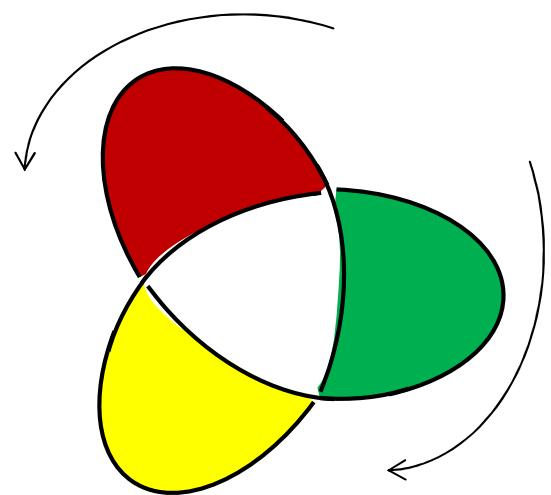
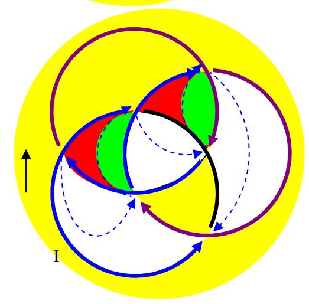
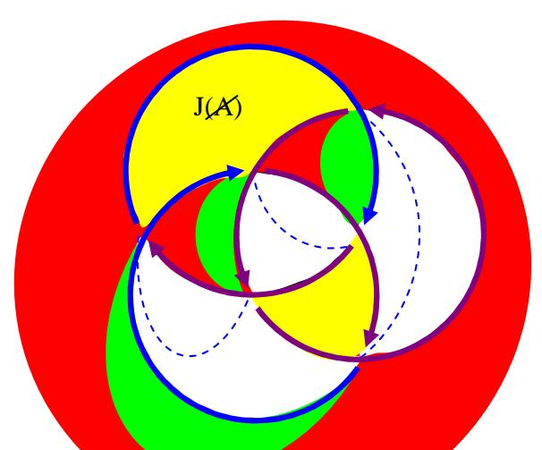
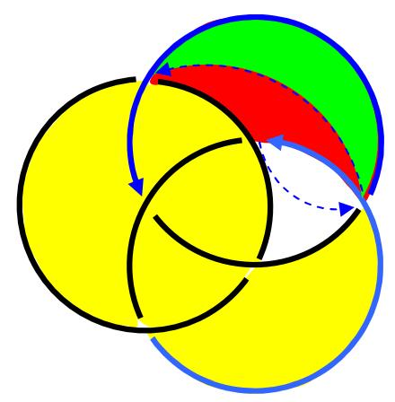
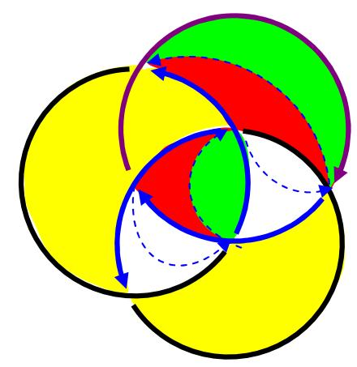
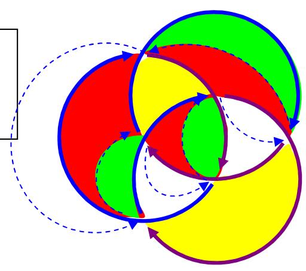
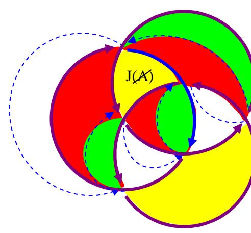

´il vous plait, voudrais-je quelqu'un m'offrir un éclaircissement sur les surfaces d´empan?

RA la surface d’empan d’un nœud est la surface circonscrite par le dessin du nœud. Pour Jean Michel Vappereau,, ces surfaces représentent la libido.

Cependant il faut faire des nuances. Il a été mis en place par le même JM Vappereau un modèle dans lequel on place en alternance des surfaces vides et des pleines, de façon à (mais ça c’est moi qui l’ajoute) donner une idée du tissage que les signifiants construisent avec les lettres, tissage assimilable en effet à un tissu.

En ce sens (c’est toujours moi qui précise), les traits représentant les ficelles sont les signifiants, les surfaces pleines sont les signifiés et significations, les surface vides la libido qui met en valeurs ces représentations que sont signifiés et significations. Une représentation n’est, en effet, mise en mémoire que lorsqu’elle est investie de libido : c’est ce qui lui donne sa valeur, comme un trou met en valeur une surface en l’entourant. Le trou isole une surface de l’environnement, et c’est ce qui constitue sa mise en valeur. Mais dans l’écriture du moindre nœud, bien sûr chaque zone de la surface d’empan découpée par les croisements des fils voisine avec une autre zone de surface, et donne une idée du tissage de la mémoire.

La théorie de Vappereau prévoit que chaque croisement fait alterner une zone dessus et une zone dessous, comme une torsion permet de passer d’une face à une autre de n’importe quelle surface. Si l’écriture du nœud présente une certaine configuration, l’alternance des dessus et dessous pourra être respectée. Sinon on va arriver fatalement à un moment ou, pour respecter la logique de l’alternance, telle zone devrait être dessus ; mais en prenant la suite des alternances d’un autre point de départ, cette même zone devrait être dessous. Ceci donne une idée de la contradiction qui peut se mettre en place dans notre mémoire (ça, c’est encore moi qui précise). Cette contradiction est résolue par l’invention de l’inconscient : l’une des représentations en contradiction va disparaître de la mémoire consciente. Et, en théorie on ne sait comment écrire cette zone.

Exemple tout simple sur un trèfle. Si on part du dessous en allant de la droite vers la gauche, la zone du bas devrait être verte. Si on part dans l’autre sens elle devrait être rouge :

Et l’on se retrouverait avec la contradiction de zones deux vertes contigües, ou deux zones rouges contigües.

C’est là que ma théorie se sépare de celle de JM Vappereau. Pour lui, il faut alors tout de suite faire jouer un algorithme de coupure qui va diviser chaque zone de la surface d’empan en deux, remettant de l’ordre et permettant ainsi de retrouver une alternance dessus dessous, au prix, donc, de la division de chaque zone. Ainsi, dans cette théorie, on n’écrit jamais la contradiction.

C’est en partant de cette question que j’ai construit un autre algorithme de coupure qui respecte l’écriture de la contradiction, comme dans notre mémoire. Je colorie en vert les zones dessus, en rouge les zones dessous (un point de départ arbitraire est choisi) et en jaune les zones litigieuses, contradictoires. C’est une écriture théorique des manifestations de l’inconscient : lapsus, mot d’esprit, acte manqué, symptôme, rêve. L’analyse consiste alors à retourner chaque rond un par un de façon à mettre à jour ce qu’il y a de l’autre côté de chaque zone contradictoire. Ça permet de diviser en deux chaque zone, jusqu’à un certain point, où il reste des zones indivisibles, ce qui correspond à ce qu’on constate en analyse : il y a toujours un reste, on ne parvient jamais à une analyse totale. L’analyse est interminable, autant celle d’un rêve que la cure. Par contre, il y a un moment où l’on sait qu’on ne pourra plus retourner de ronds, et on devra laisser l’écriture du nœud avec sa ou ses zones jaunes : il restera toujours de l’inconscient, et on peut dès lors nommer ses zones jaunes en fonction de la théorie de Lacan : objet a et jouissance de l’Autre, J(A).

On peut se référer à l’étude la structure du nœud borroméen, sur mon site :

http://pagesperso-orange.fr/topologie/theorie%20du%20noeud%20borrom%E9en.htm

mais surtout à ce texte :

http://pagesperso-orange.fr/topologie/la%20douleur%20borrom%E9en.htm

dans lequel je déplie pas à pas cette théorie à partir d’un fragment de ma pratique analytique. On en retrouve l’écriture en fonction des 4 discours de Lacan ; le passage de la lettre de gauche à la lettre de droite, comme dans une lecture, se fait en retournant le rond qui est en bas à gauche : on le fait passer en haut à droite, ce qui coupe la zone considérée en deux. Puis toujours comme dans une lecture, on passe de la lettre de droite à la lettre en dessous à gauche en retournant le rond de gauche pour le faire passer à droite. Chaque retournement laisse en place la surface jaune. Conçue au départ comme « insue », contradictoire : une formation de l’inconscient. Chaque retournement est donc une parole qui analyse cette formation de l’inconscient, induisant une coupure (pointillé bleu) dans la surface d’empan, séparant le signifié de ce qui vient d’être traduit de l’inconscient (vert) et la signification qui reste en souffrance (rouge). Ceci n’a rien de naturel, c’est un algorithme que j’ai conçu de façon à ce qu’il fonctionne et que sa logique reflète la logique de la psychanalyse.

Au bout de six retournements on s’aperçoit que le pointillé bleu a rejoint son point de départ. On a retourné deux fois chaque rond : il n’est pas utile d’aller plus loin, on a analysé ce qui pouvait l’être, et il y a un reste dont on peut rendre compte comme reste. C’est la fin de l’analyse. Il est possible d’ajouter encore une ligne à ce texte, dite par Lacan « discours de l’universitaire » que je préfère détourner en « discours de la Passe » : là où l’on rend compte à quelques autres du parcours qu’on vient d’effectuer :

M S1 S2 \$ a

H \$ → S1 a S2

A a → \$ S2 S1

U S2  a S1 \$

