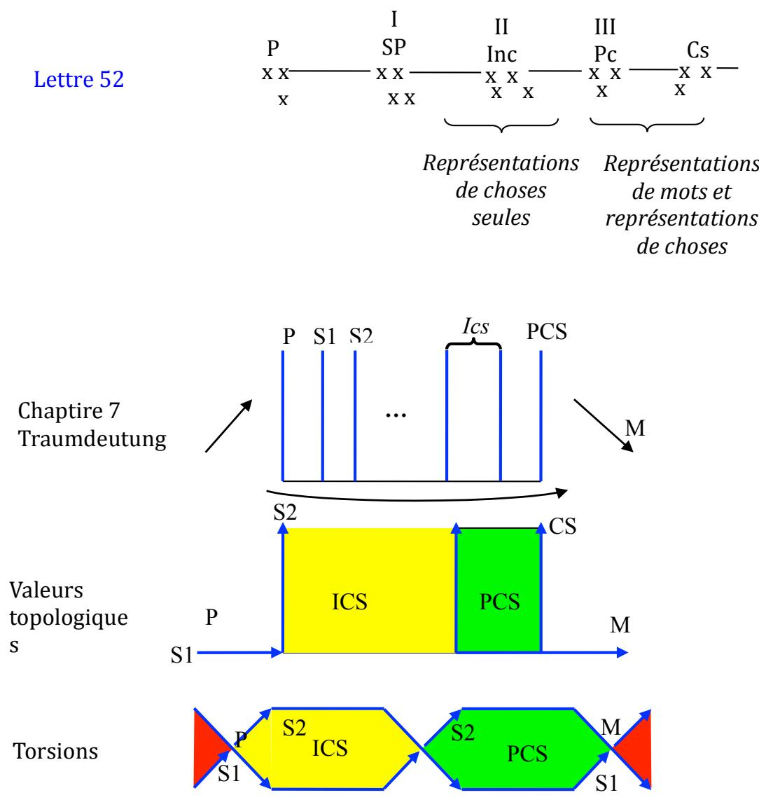

## Tentative  d’articulation  des  concepts de  Freud,  de  Lacan, avec  la  topologie

Dans   le   dessin   qui   fait   se   succéder   la   lettre   52   et   le   schéma   du   chapitre   7   de   la Traumdeutung,   la   troisième   ligne   accorde   les   schémas   précédents   avec   des   valeurs topologiques  :  le  schéma  de  la  lettre  52  est  linéaire,  celui  de  la  Traumdeutung  prend  de la  surface.  Comme  si  Freud  avait  eu  l'intuition  topologique  de  ce  qu'il  a  appelé  la  double inscription,  le  double  encodage.  j'en  prends  acte  en  donnant  la  valeur  "surface"  à  ce  que la   mémoire   retient   et   la   valeur   "bord"   à   ce   qui   ne   fait   que   traverser,   rejoignant   par   là l'autre   intuition   qu'il   avait   eue   dans   "l'Esquisse",   celle   des   neurones   ϕ,   qui   laissent passer  l'énergie  et  les  neurones  ψ,  qui  la  conservent.  Donc  très  logiquement  :

neurones   ψ :   c'est   la   mémoire,   c'est   la   surface   c'est   l'écriture,   c'est   la représentation   de   chose,   c'est   la   lettre,   dans   laquelle   on   peut   distinguer   celle   qui   est disponible   dans   la   surface   du   préconscient   (vert   immédiatement,   rouge,   via l'interprétation),  et  celle  qui  ne  l'est  pas,  dans  la  surface  de  l'inconscient.  Cette  dernière (jaune)   a   les   mêmes   caractéristiques   qu'un   bord,   à   la   fois   dessus   et   dessous   : l'inconscient  est  le  refuge  des  représentations  contradictoires.

Neurones  ϕ :  c'est  ce  qui  traverse,  c'est  la  perception,  ce  qui  cesse  de  s'écrire,  ce qui  parle,  la  représentation  de  mot,  le  signifiant.  C'est  aussi  la  conscience  (neurones  ω), qui,   elle   aussi,   se   présente   comme   un   flux   continu,   d'où   sa   congruence   avec   le   bord comme   le   bord   d'un   récipient   qui   est   là   pour   faciliter   le   flux   d'un   fluide,   tandis   que   sa surface  est  là  pour  le  retenir.

Et  puis,  reste ce  qui  ne  cesse  pas  de  ne  pas  s'écrire,  mais  qui  s'inscrit,  le  Das  Ding de   L'Esquisse,   le   Réel   de   Lacan,   ou   encore   la   lettre   volée.   Ce   qui   ne   cesse   pas   de   ne   pas s'écrire.   Ce   n'est   pas   le   bord   ce   n'est   pas   la   surface,   c'est   l'écriture   de   la   torsion.   La torsion  est  bord,  lieu  de  passage  aussi  entre  dessus  et  dessous,  écriture  du  passage  entre dedans  et  dehors.  Lorsqu’on  la  lit  comme  écriture  de  ce  mouvement,  c'est  un  paradoxe, car  l'écriture  est  statique.  C'est  pourquoi  j'ai  ajouté  les  flèches  courbes  qui  ne  sont  qu'un ajout   pédagogique,   car   l'écriture   écrit   très   bien   cela.   C'est   l'écriture   de   ces   deux mouvements  que  sont  perception  d'une  part,  conscience  d'autre  part.  Ce  qui  s'en  inscrit, mais   ne   s'écrit   pas,   ce   sont   les   signes   de   perception,   lisibles   dans   l'écriture   théorique dans   les   traits   marquant   le   passage,   c'est   à   dire   les   torsions.   Ici   il   ne   faut   plus   lire   le mouvement   comme   tels,   mais   ce   qui   s'en   inscrit   comme   trace.   Après   avoir   donné   les valeurs  topologiques  de  bord  et  de  surface,  je  n'ai  fait  que  suivre  le  conseil  que  donnait Freud  sous  le  schéma  de  la  Traumdeutung  :  considérant  que  la  perception  n'était  pas  la même   chose   que   la   conscience   mais   allait   de   pair   avec,   il   disait   qu'il   fallait   rabouter   les deux extrémités   de   son   schéma.   C'est   ce   que   j'ai   fait   en   notant   au   passage   que   le raboutage  en  bande  de  Moebius  et  non  en  cylindre  rend  compte  de  ce  paradoxe  :  c'est pareil,  mais  c'est  pas  la  même  chose.  La  bande  de  Moebius  a  deux  bords,  mais  elle  n'en  a qu'un.
