# Richard Abibon

## Nouveaux développements sur la théorie de la dimension

La théorie sans la pratique n’a pas de sens. Vouloir illustrer la théorie par une « vignette clinique » n’en a pas non plus car on va choisir bien évidemment ce qui va coller pour appuyer la démonstration. Une fois posée ces conditions draconiennes il ne reste plus grand-chose à faire. C’est la raison qu’invoquent certains pour se passer de toute référence à la pratique (par exemple, Guy le Gauffey dans « le pas-tout de Lacan »).

Je porte une grande attention à mes rêves : c’est le quotidien de l’expérience analytique. En rédigeant le récit du rêve suivant, il m’est venu en association le texte que j’étais en train d’écrire sur une nouvelle façon de concevoir la théorie de la dimension. Il s’agit donc d’une association au même titre que toutes celles survenues dans l’analyse du rêve. Il m’a semblé que le rêve lui-même était travaillé par les efforts que je faisais dans ma vie consciente pour élaborer cette théorie, autant que cette théorie ne cessait d’être pétrie de l’analyse de mes rêves que je pratique au quotidien. Bien que par ces lignes je sois en train de tenter de trouver le statut de cette association et de ce travail, je me rends compte de l’effort restant à faire dans la théorisation même du rapport de la théorie et de la pratique. Je ne voudrais pas en faire une application ni une illustration. Pour l’instant je ne peux parler que d’association suivie de confrontation.

Quoiqu’il en soit je me laisse orienter par cette conviction : une théorie de l’inconscient ne peut que se nourrir de cet inconscient, dont l’accès nous est ouvert par cette voie royale qu’est le rêve.

Dans sa lettre 52 à Fliess et dans le chapitre VII de « l’interprétation des rêves », Freud présente deux variantes d’un même schéma de l’appareil psychique (j’en ferai état au moment opportun). Dans les deux cas il suggère de faire se rejoindre les deux extrémités de ce dessin linéaire, et de les lire en boucle. Ainsi, on aura profit à lire ce texte deux fois, comme un huit intérieur ou une bande de Mœbius : une première fois sans trop chercher à comprendre, car même le récit du rêve et son analyse sont pétris de concepts qui ne seront présentés que dans la deuxième partie. La deuxième fois avec ces concepts en tête, qui n’auraient rien gagné à être présentés d’abord, puisqu’ils sont les produits de cette pratique.

## Voici d’abord le récit du rêve

J’arrive à Montbéliard par un chemin de sable en pente qui me permet de prendre de la vitesse sur mon vélo. Ça me permettra de rattraper les amis qui y arrivent aussi en faisant un détour par le bas, je les vois au pied de la falaise. Arrivé en haut de cette falaise, je longe son bord mais un tout petit peu en contre bas, comme s’il y avait une corniche à presque hauteur d’homme en dessous du sommet. Ma tête seule dépasse. Curieusement la falaise est faite de sable, comme la plage, et ce sable s’effrite ce qui rend le cheminement dangereux. J’arrive à un trou qui fait rejoindre le haut avec le bas, c'est-à-dire la plage, la mer. Je sais que ce trou est comme un trou dans la plage creusé pour jouer par des enfants et leur père. Au fond, je distingue en effet les pelles qui leur ont servi.

Je ne peux aller plus loin et je me hisse sur la falaise. Juste au coin, un journal à moitié déchiré est coincé ; on dirait un journal d’annonces.

Je rentre chez des gens au rez-de-chaussée d’une HLM. Je trouve l’appareil (je dirais, au réveil live box ou modem) dans un placard au niveau du sol. Il est composé de deux pièces l’une est comme la souris noire de mon ordi fixe et dessus il y a comme une timbale renversée de couleur métallique. Dès que je touche les deux pièces se séparent, comme la batterie de mon ordi. Je ne cesse de les remettre ensemble. j’entends un déclic, je le sens, mais ça ne tient pas ; je commence à flipper que j’ai cassé le matériel des gens, alors que j’étais venu que pour chercher les ondes. Et j’ai toujours pas les ondes ;

J’entends les gens arriver. Je me suis rendu chez eux pour avoir les ondes ils ne peuvent pas me prendre pour un voleur ; j’entends un jeune type à l’épaisse et longue tignasse (Charlebois) qu’il a les ondes, et qu’il sait que je suis là. Comment le sait-il ? Il ne m’a pas vu et lui, il est rentré par derrière. Il me répond qu’il l’a lu dans le journal d’annonces que j’avais vu au bord de la falaise. Il tripote à son tour l’objet avec ses deux parties, qui là me fait penser au moteur de l’aspirateur qui me faisait si peur. C’est la partie métallique du dessus qui m’y fait penser. Il constate comme moi que ça ne tient pas, il est étonné.

Il y a des années que le vélo ne fait plus mystère pour moi. En tant qu’instrument se plaçant entre les jambes et permettant les déplacements, il s’agit du phallus. D’ailleurs, ici, il me permet de descendre et de remonter, soit une métaphore de l’acte sexuel. Or, qu'est-ce que descendre et monter, sinon parcourir la troisième dimension, de dessus à dessous puis de dessous à dessus ? D’ailleurs en arrivant « dessus » je me stabilise sur le bord de la falaise, c'est-à-dire sur un bord ; c’est comme si, étant passé d’un face à l’autre, d’un pôle de la dimension à un autre, je décidais cette fois de longer le bord.

Il y a cependant un léger décalage. Je ne suis pas le bord même, mais une corniche en léger contrebas, un bord du bord en quelque sorte. Ça me fait penser à la coupure de la bande de Mœbius dite « le long du bord », celle qui permet d’obtenir un bilatère et un unilatère enlacés. J’aborderai ces notions précisément plus tard. Cette association là serait peut-être un peu téléphonée, fruit du désir de faire coller la pratique à la théorie. Aussi je m’en méfierais quelque peu pour l’instant.

Une notation apparemment anodine retient pourtant mon attention : cette falaise est de sable, comme la plage. Ce qui peut très bien se lire : la falaise, c’est la plage, avec deux interprétations possibles en termes de dimensions : le dessus, c’est le dessous, ou le plan vertical, c’est le plan horizontal. Et dit comme ça, on comprend tout d’un coup pourquoi je marche sans problème sur cette étroite corniche.

Ma rencontre avec le trou va permettre la poursuite de l’interprétation. Voilà un trou dans la verticalité de la falaise qui justement met en communication le dessus et le dessous. J’ai bien dit, dans mon récit, que c’était comme un trou dans la plage, mais c’est un trou dans la falaise. Il faut bien entendre un trou vertical, selon l’axe dessus dessous, et non un trou horizontal. Pourtant ce n’a pas l’air bien grave car, dans un rêve précédent, j’escaladais un mur, cette fois pour atteindre un trou horizontal. Je considère que, horizontal ou vertical, l’interprétation en est la même : il s’agit du sexe maternel. Une falaise, même si je la situe à Montbéliard, ça s situe essentiellement au bord de la mer(e). Ce trou, il faut donc plutôt le lire comme rupture de continuité, coupure du plan, que basculement de dimensions. Dans le précédent rêve, j’en extrayais une provision de poutres phalliques, ici, ce phallus se précise de ce qu’il se transforme en sa fonction de Nom-du-Père. Je sais que ce trou a été creusé par un père et ses fils, soit, mon père et mes frères. Ce phallus absent qui provoque le désir de la mère, il a bien pu être creusé par ceux-là, qui en sont porteurs : ils ont même laissé (en matière de poutres) leurs outils dans le fond.

Un journal, coincé au bord de la falaise s’agite un peu dans le vent. Il s’agit clairement d’écriture. Que ce soit un journal d’annonce, ce n’est pas très sûr mais enfin, puisque le mot m’est venu, c’est que tout cela doit bien être une annonce, un message.

Voilà qui ne peut que m’apparaître comme un nouveau point de vue sur ce point de vue lui-même nouveau à propos de la théorie de la dimension.

Si c’est un message, c’est une écriture. Si c’est une écriture ça n’a pas de relief, sauf de manière rhétorique, et en effet, on dirait que tout s’évertue à écrire du relief, dans ce rêve, tout en écrivant l’échec de cette tentative. Ça descend et ça monte, puis le dessus de la falaise, c’est le dessous. C’est ici qu’il faut revenir à l’ouverture du récit du rêve, que je n’ai pas encore examinée. Ça se passe à Montbéliard. Tiens, pourquoi donc ? si je me demande ce que représente Montbéliard pour moi, je réponds immédiatement: la saucisse… sans craindre la transparence de la métaphore. Alors pourquoi pas Morteau qui fait aussi, dans le jura, une excellente saucisse ? Ou Toulouse ? Parce que, la veille, je venais de m’acheter une bonne paire de montbéliards pour mon repas du lendemain. Le journal d’annonces me rappelle par ailleurs que mes seules incursions dans cette ville, quand j’habitais Besançon, étaient motivées par le besoin d’argent pour payer mes études : je distribuais des prospectus dans les boites aux lettres, notamment dans les cités HLM. Ce geste mille fois répété de glisser un papier dans une fente a dû prendre une signification érotique, le journal d’annonces de Montbéliard rivalisant avec la saucisse de même extraction. Mais l’un est à plat, l’autre supporte l’idée de relief. Je ne dis pas que c’est le relief, considérant le rêve en lui-même comme une écriture, et donc une mise à plat qui cependant s’évertue à rendre quelque chose du relief du réel. Il ne peut en produire qu’une représentation, ce qui se précise en termes freudiens de représentation de chose, en termes lacaniens de lettre. Ce relief est pourtant impossible à reproduire réellement dans une écriture, et il faut bien admettre cette castration. Si je cite la saucisse elle n’est en effet pas présente explicitement dans le rêve. Elle est revenue dans les associations, mais elle a été contrainte de s’effacer dans le paysage du rêve : elle en est devenu le cadre, la toile de fond, l’objet étalé sur lequel tout le reste peut s’écrire ; voilà qui donne raison à Lacan lorsqu’il parle du langage comme fonction phallique. J’ai pris suffisamment de distance avec le personnage et l’enseignement de Lacan pour pouvoir affirmer que je n’ai pas fait ce rêve pour faire plaisir au maître ni à ses successeurs. N’étant dans aucune école, je n’ai pas à faire preuve de l’orthodoxie de mon appartenance, ni même du relief de mes saillies théoriques.

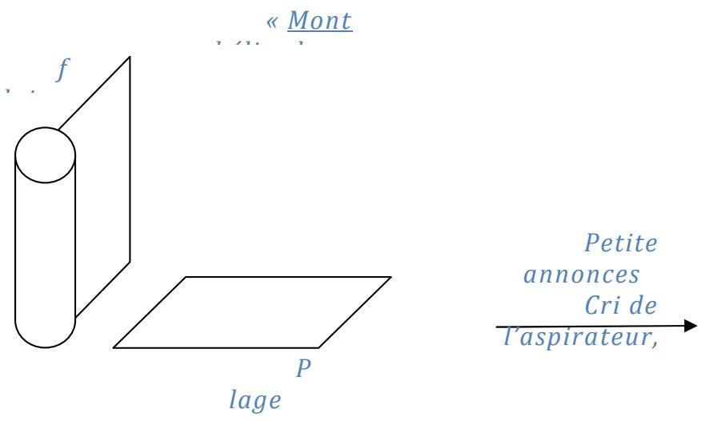  
En bref, la saucisse, métaphore du phallus, devenue Montbéliard par métonymie tisse entre ses deux axes, celui de la métaphore (disons, l’axe des y) et la métonymie (disons l’axe des x), la surface où peuvent se déployer, moyennant la perte d’une dit-mention (l’axe z, le relief) tous les objets produits par la fonction $\dot { \boldsymbol { f } } ^ { - I }$ , en représentation du relief perdu comme métaphore du phallus perdu : le vélo, mon corps comme phallus de la falaise, c'est-à-dire phallus de la mère, le journal en tant qu’il s’introduit dans la fente des boites aux lettres, les

pelles oubliées au fond du trou. Le trou, autre forme du relief, qui décrit en négatif les effets de la fonction du passage à l’écriture, métaphore de la falaise de sable, qui elle-même tentait de concilier relief et platitude autrement dit le phallus et son absence, le masculin et le féminin. La problématique du cadre, c'est-à-dire du contenant, est en continuité avec la problématique du contenu. Le rêve est donc un ensemble qui se contient lui-même, puisqu’il décrit dans son cursus en objet ce qu’il en est de son processus en fonction.

Si j’écris la troisième dimension comme dit-mention, c’est pour faire entendre dans la lecture de cette lettre la nature signifiante (c'est-à-dire sonore) de l’objet perdu. Il manque un signifiant du féminin, c'est-à-dire de la castration, c'est-à-dire de la fonction comme telle, cette fonction phallique qui fait passer à la représentation un réel impossible à saisir. Cependant, de cette perte, de cette impossibilité à dire, qui oblige à passer par l’écriture, il est possible d’en dire quelque chose en laissant tomber cette fois les deux dimensions de l’écriture pour passer à la troisième. Non pas en revenant à un réel à trois dimensions…trois supposées dimensions, car, que savons nous du réel ? Nous savons juste que nous avons dû y renoncer pour entrer dans le langage. La troisième dit-mention qui nous permet de parler de cette perte, c’est la parole, qui, en tant qu’espace à une seule dit-mention, troue le plan de l’écriture. La modalité de cette fonction trouure $\mathsf { \bar { \rho } } ( f ^ { - I } )$ peut s’appeler ici Nom-du-Père, conformément à la nomination qu’en a proposée Lacan, mais surtout conformément à ce que m’enseigne ici la pratique de l’interprétation du rêve : le père et ses enfants sont partis, laissant leurs outils sur place, au fond du trou. Ils sont aussi absents que le phallus lui-même sur le corps de la mère. En ce sens ils représentent cette absence d’une manière encore plus claire, n’étant pas là du tout, de la même façon qu’une interruption d’un trait dans l’écriture d’un nœud désigne le croisement, c'est-à-dire le passage en dessous du trait qui passe au-dessus. Aussi absents que la troisième dimension dans un dessin ou un écrit.

L’échec de la représentation du réel dans l’écriture, l’impossibilité de passer à la parole dans le rêve contraint l’écriture à se répéter. C’est ainsi que je pénètre semi clandestinement dans l’HLM, tel une lettre dans la fente de la boite. Je cherche l’appareil. Lequel ? Celui qui produit les ondes, un modem, une live box, ce qui est aujourd’hui métaphore de communication et de transmission de messages. Comme par hasard, celui-ci ressemble à une souris, sachant que je viens de m’acheter un nouvel ordinateur dont la souris est sans queue. Je la trouve dans un placard de cuisine au niveau du sol, c'est-à-dire dans le dessous, sachant que ceci me fait penser au placard qui, dans la cuisine de l’appartement de mon enfance, se situait juste sous l’évier, et donc sous les robinets. Donc, dessous, je cherche une métaphore de l’absence de ce qui est dessus, qui en effet n’est pas représenté dans mon rêve mais seulement dans les associations produites au réveil.

La souris est surmontée d’une pièce métallique cylindrique qui me fait penser au moteur de l’aspirateur qui me terrorisait à cette même époque archaïque. Chaque fois que ma mère l’allumait, j’avais l’impression qu’elle réveillait un monstre qui se mettait à hurler, un monstre dont la tête était cette partie cylindrique abritant le moteur tandis que gonflait la queue c'est-à-dire le sac destiné à recevoir la poussière, de forme majestueusement phallique, comme c’était le cas dans tous les aspirateurs balais de l’époque. D’une manière ou d’une autre j’avais dû être témoin de ce gonflement de l’organe paternel, ou encore fraternel, mes deux frères (présents par leur absence au fond du trou précédent) étant alors en pleine adolescence. Le gonflement de ce sac conférait à l’appareil une apparence de vie autonome bien plus efficace que la bête inertie de robinets du dessus. Et, pour moi, ce hurlement devait représenter le signifiant absent, trognon de parole signifiant l’impossibilité à parler de la castration qui, du coup faisait retour dans un réel terrifiant. Je n’en suis plus là à l’époque du rêve, ayant pas mal retourné le problème dans mes trois analyses et leur interminable suite. La lettre de la castration se contente de se répéter sans trop d’angoisse. Ici, elle revient dans cette notation à peine problématique : Dès que je touche, les deux pièces se séparent, comme la batterie de mon ordi. En effet la batterie de mon ordinateur portable a tendance à se détacher de manière intempestive, me faisant perdre tout le travail effectué dans les cinq dernières minutes. De plus cette batterie arbore une forme cylindrique phallique contrastant avec la platitude de celles de mes ordinateurs précédents.

A cela se mêle l’angoisse d’avoir pénétré par effraction chez les gens, ce qui peut être une inversion de l’idée que je m’étais faite à l’observation d’un coït. Agir au lieu de subir est toujours une forme du symbolique qui cherche à se saisir ainsi de ce qui est imposé par la perception visuelle et sonore, voire tactile en cas d’attouchement incestueux, d’un événement incompréhensible. Ce qui explique l’arrivée, (par derrière) du jeune homme aux longs cheveux, ne peut qu’être un dédoublement de moi-même, tel que j’étais à 18 ans. Cet avatar de moi-même est aussi étonné que moi par la castration qu’il découvre, avec sa conséquence : nous n’avons pas les ondes c'est-à-dire que nous avons perdu la capacité de communiquer sur ce sujet. La notation topologique « par derrière » est à prendre au sérieux. Elle indique vraisemblablement ce qu’il en a été d’un coït observé ou subit à un âge extrêmement précoce. Dans l’écriture du rêve, le remplacement de l’agresseur par un autre moi-même complète la tentative du symbolique de me replacer dans la situation tant qu’acteur. Il redonne une légitimité à l’acte en le (me) faisant pénétrer dans un lieu dont je l’ai institué propriétaire. Car ma présence passive sur les lieux du drame, il le sait déjà (je le sais déjà), c’était écrit dans le journal coincé sur le bord de la falaise.

Enfin il n’est pas sans intérêt de vous faire part de la chanson qui me revient sans cesse en arrière plan de ce travail d’association, une chanson interprété par Pauline Carton : « aimons-nous sous les papas, les palétuviers roses, aimons-nous sous les pa, aimons-nous sous les tu, aimons-nous sous les viers ! »

On peut lire ce rêve comme une bande de Mœbius ou une bouteille de Klein si on se focalise sur le trou de la falaise. Je parlerai de ces deux objets plus tard. L’un ou l’autre, ça ne m’apparaît pas de grande importance a priori. L’important, c’est de dégager le concept de cette pratique de l’analyse du rêve. Ce concept est celui de la cohabitation des contraires sous deux formes, telles que Freud nous le propose dans son analyse de « l’Homme aux loups » :

\- la castration est admise… (la falaise n’est pas la plage, il y a un trou, les pièces du modem ne tiennent pas ensemble)

\- …et elle ne l’est pas (la falaise et de sable donc c’est la plage, il y a des pelles au fond du trou, les pièces du modem tiennent quand même ensemble). Autrement dit, en des termes topologiques qui nous seront utiles plus tard : la castration, qui est une coupure, c'està-dire une dimension, est efficiente et en même temps elle ne l’est pas.

\- la question de la castration n’est même pas posée : tout se passe à Montbéliard, qui est le décor, sans que soit révélée l’association saucisse, tout se passe au bord de la mer sans que l’association mère soit questionnée. Si dans le texte du rêve, le dessus ne cesse de rencontrer le dessous, comme si je parcourais une bande de Mœbius sur son bord, ou le long de son bord, la surface que parcours cette coupure n’est aucunement coupée. Elle est maternelle (mer) et phallique (Montbéliard) sans coup férir. On peut la considérer comme la surface du grand Autre. Mais pour être en accord avec ce que j’ai dit dans les phrases précédentes il faudrait dire un grand Autre non barré. Du coup, ça remet en question ces phrases : il ne s’agit pas d’être en accord à tout prix avec ce que j’ai développé précédemment mais de se rendre compte que cette dernière assertion pourrait faire basculer le contenu des précédentes. Si cette surface qui permet de développement du rêve est le grand Autre, barré, c’est en effet la perte phallique d’une dimension, la troisième dimension qu’on peut attribuer après coup au réel, dont on voit ici que ce serait le « réel » de la sexuation, et non le réel de l’espace tel que nous sommes habitués à le nommer. En même temps, mais secondairement, c’est ce qui nous permet de nous repérer dans cet espace construit par nous à trois dimensions.

Donc, soit il s’agit bien de cette question de la perte d‘une dimension qui ne peut être posée… parce que nous naissons d’emblée dans un mode modelé par l’être parlant, et que le réel et toujours déjà perdu. Soit il s’agit d’une tentative de reprise de cette question en termes imaginables c'est-à-dire orientables pour tenter d’en poser une écriture, justement parce que cette écriture n’existe pas. Alors le rêve en trouve une écriture sous une forme approchée, l’écriture paradoxale. La topologie trouve la même chose ne se servant des surfaces paradoxales que sont les surfaces inorientables.

## Qu'est-ce qu’une coupure ?

Il y a quelques années j’avais produit une théorie de la dimension en examinant les conséquences de la mise à plat, spécialement à partir de l’écriture du nœud borroméen. Je voudrais y revenir en insistant seulement sur cette question de la mise à plat, autrement dit du plongement d’un espace dans un autre, autrement dit encore de la coupure. Je vais me référer essentiellement à la définition de la coupure par Poincaré : la coupure d’un espace à n dimensions sera un espace à n-1 dimensions. La coupure du volume c’est un plan. La coupure d’un plan c’est une droite, la coupure d’une droite c’est un point.

J’ajoute, parce que, en termes purement mathématiques, ça ne nous apporte rien, que ce n-1 correspond dans le domaine psychanalytique à la castration. C’est bien aussi ce qui fait coupure, à entendre dans plusieurs sens :

\- ce qui nous oriente quant à la sexuation : l'avoir ou pas, l'être ou ne pas l'être.

\- ce qui nous oriente dans la différence entre parole (n-1) et écriture (n), c'est-à-dire entre parole et mémoire, ce qui s'envole et ce qui reste. Dès l’origine de la psychanalyse Freud remarquait qu’il était nécessaire de faire l’hypothèse d’au moins deux types de neurones différents, les neurones de mémoire qui fixent la quantité, et les neurones de perception qui au contraire la laissent passer.

\- ce qui nous oriente entre l'orientable, orienté ou pas (ce sont les dimensions qui permettent l'orientation, haut bas, droite gauche, etc...) et l'inorientable (là où la coupure n'a pas fonctionné- là où la question de la castration n'a pas été posée)

## Une coupure doit se recouper

## Les coupures courbes d’un plan

Poincaré cependant n’a pas envisagé une chose, au moins à ma connaissance parce que je n’ai pas lu toute son œuvre, ni celle de ses successeurs. C’est que, pour qu’une coupure soit efficiente il faut qu’elle se recoupe elle-même. Sinon, elle est incapable de détacher un morceau. Une droite infinie de coupe rien dans un plan infini. C’est ce que j’ai appelé l’acoupure. Enfin, c’est exagéré de dire qu’elle ne coupe rien : elle permet quand même de repérer deux parties mais pas d’en détacher une de l’ensemble. Un plan infini de coupe rien dans un volume infini. La finitude, autrement dit, des limites fiables, ne s’instaurent que lorsque la coupure s’applique aussi à elle-même. De ce fait elle définit une coupure supplémentaire, celle que la recoupe instaure en définissant un dedans et un dehors. Le dedans correspond au morceau d’espace qu’on peut alors détacher, le dehors au reste d’espace laissé de côté par l’opération. Ce que j’ai maintes fois démontré dans l’écriture suivante :

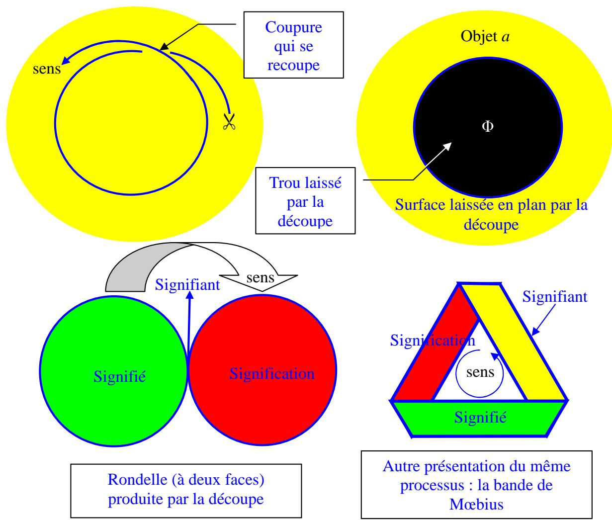

Cette écriture vaut pour une coupure de dimension 1 qui coupe une surface de dimension 2.

Le modèle des coniques, au niveau de la coupure d’un plan par une ligne, image fort bien le modèle des 4 fermetures d’un rectangle, au niveau de la coupure d’un volume par un plan. Dans les coniques (coupures d’un cône par un plan infini), seules le cercle et l’ellipse séparent un dedans et un dehors sur le plan. La parabole et l’hyperbole y échouent.

Les courbes dites coniques sont la rencontre d’un plan et d’un cône, sachant que le cône est toujours double, vu qu’il est engendré par le mouvement rotatif d’une droite autour d’un point fixe. Disons le tout de suite : c’est le mouvement de la parole, que je représente toujours par ailleurs par une linéarité et un mouvement. Dans la rencontre avec un autre à qui l’on s’adresse (le plan, celui qui écoute), ce mouvement permet de découper un morceau de surface c'est-à-dire un signifié, dont l’autre face est la signification, comme dans le modèle précédent… lorsque ce plan présente un certain écart par rapport à l’angle du cône :

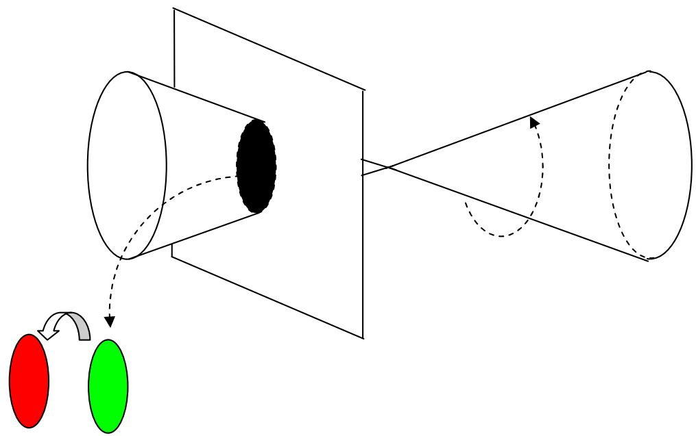

La découpe est alors circulaire ou elliptique peu importe : c’est une courbe fermée qui permet donc d’enlever un morceau.

Par contre, lorsque le plan de rencontre présente une inclinaison telle qu’il recoupe les deux cônes, il n’est pas possible d’obtenir une figure fermée :

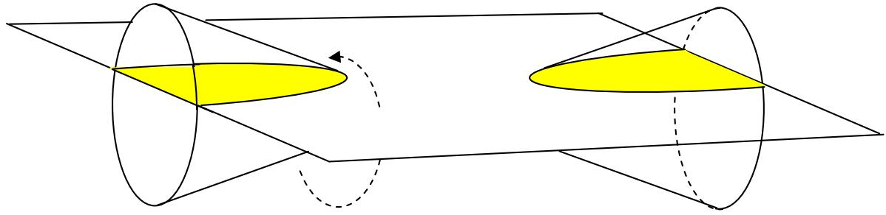

La coupure alors obtenue est très précisément l’hyperbole du schéma I1 que je commenterai plus tard : le signifiant ne permet plus de circonscrire un signifié. De plus nous avons là une belle écriture de ce qui se passe dans l’hallucination. Freud nous explique en effet dans son article sur la Verneinung que le travail de l’appareil psychique consiste à comparer ce qui est dedans, marqué du label « représentation », à ce qui est dehors, marqué du label « perception ». Si cela est possible lorsque nous avons affaire à une figure fermée, on voit ici en quoi cela devient impossible. Il y a bien deux courbes distinguent mais elles ne parviennent pas à couper l’espace entre un dedans et une dehors ; d’où les illusions du double, les hallucinations où ce qui est dedans est perçu comme venant du dehors, d’où les dialogues avec une entité soi-disant extérieure alors qu’il s’agit de deux moitiés de la personne, d’où les sentiments de déjà vu, de persécution d’érotomanie, de jalousie. On aura compris que nous retrouvons là les figures classiques de la paranoïa.

Lorsque le plan d’écoute se place dans cette position très particulière d’être parallèle à la droite directrice du cône, la découpe obtenue est une parabole.

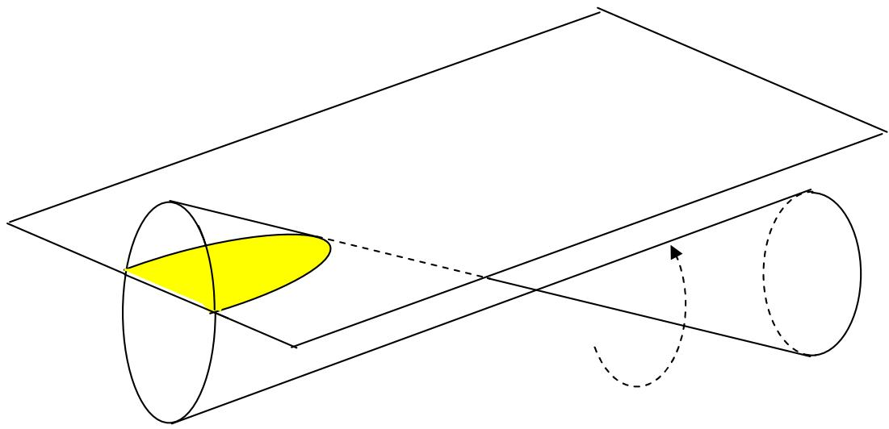

Plus question de double, ni de persécution, d’érotomanie de jalousie qui circonscrivent la relation avec un autre intérieur perçu comme extérieur, ici il y a juste un discours infini qui ne parvient pas à produire ni signifié ni signification. On aura deviné qu’il s’agit là de ce qu’on a traditionnellement nommé schizophrénie et autisme.

J’ajoute cependant contre ces traditions, que rien n’empêche le plan, que je rappelle avoir repéré pour être celui de l’écoutant, rien n’empêche ce plan de changer de position, ce qui permet de recevoir une toute autre modalité du discours. Evidemment cela vaut si le modèle est valide, et il faut rappeler que ce n’est qu’un modèle.

## Les coupures droites

Si on impose à la coupure d’être rectiligne, un nombre de trois est nécessaire à la recoupe et à l’ablation d’un morceau. Au niveau inférieur du nombre des dimensions, deux points (0 dimension) sont nécessaires pour détacher un segment (1 dimension). Au niveau supérieur, 4 plans (2 dimensions) au minimum sont mis à contribution pour détacher un morceau de volume (3 dimensions). Autrement dit, mais ce n’est ici qu’une conjecture, si la coupure d’un espace de n dimensions est bien un espace à n-1 dimensions, il faut aussi réunir n+1 de ces espaces pour obtenir une coupure efficiente, c'est-à-dire qui détache un morceau. Un espace perceptible c'est-à-dire limité, à n dimensions, c’est donc un espace compris entre les coupures opérées par n+1 espaces à n-1 dimensions. Ce n’est qu’à ces conditions qu’on peut repérer un dedans et un dehors, c'est-à-dire faire la différence entre représentation et perception, autrement dit encore, entre moi et le monde. Freud organisait la vie psychique selon trois polarités, disait-il : sujet-monde extérieur, plaisir-déplaisir, et actif-passif. On remarquera que les deux dernières polarités sont dans la dépendance de la première, avec la tendance à mettre dedans ce qui fait plaisir, dehors ce qui provoque le déplaisir, tandis que activité et passivité régissent les modalités du rapport que le sujet entretien avec le monde.

C’est ainsi que j’interprète les deux coupures du schéma R qui deviennent acoupures au schéma I.

## La limite d’une suite est une coupure

En ce sens la limite d’une suite arithmétique ou géométrique peut se lire comme recoupe et délimitation d’un espace. Dans une telle suite, chaque terme est défini par le terme précédent, comme par exemple la suite de Fibonacci : $\{ \mathrm { U _ { 0 } } { = } 0 \} , \{ \mathrm { ~ U _ { 1 } } { = } 1 \} , \{ \mathrm { U _ { n } } { = } \mathrm { U _ { n - 1 } } + \mathrm { U _ { n - 2 } } \}$

Cette définition n’est pas loin de celle que Lacan donne du signifiant : un signifiant représente un sujet pour un autre signifiant.

On sait si cette suite tend vers une limite ou pas en appliquant le critère de Cauchy, en : $\mathrm { U _ { n } - U _ { n - 1 } } \leq \dot { \varepsilon } ,$ ce qui revient à écrire l’équation : $\mathrm { U } _ { \mathrm { n } } { = } \mathrm { U } _ { \mathrm { n } - 1 }$ . Elle se présente comme une recoupe : le parcours de la suite repasse deux fois au même endroit.

Toutefois, cette équation a des solutions ou pas. Si elle a des solutions, celles-ci sont la limite de la suite : elle a un dedans et un dehors. Elle délimite un espace. Si elle n’en a pas, tout se passe comme lors de la rencontre du cône avec le plan dans les cas où la courbe ne se referme pas. L’espace décrit n’a pas de limite. Pour résoudre les problèmes posés par cette absence de solution, les mathématiciens inventent parfois un espace imaginaire qui permet de donner les solutions là où l’espace des nombres réels et rationnels n’en donne pas. Ainsi, si la limite se présente sous la forme d’une équation du second degré, il arrive que l’on se trouve en présence d’un nombre négatif, dont on ne peut évidemment extraire la racine carrée. Alors on a recours à l’institution d’une lettre i notant le nombre imaginaire qu’on pose telle que $i ^ { 2 } =$ -1. On invente ainsi l’espace des nombres complexes ouvrant un espace où les solutions sont possibles.

Ainsi faisons-nous tous devant des problèmes difficiles de notre existence. Si quelqu’un nous gêne, nous pouvons rêver de sa mort dans cet espace imaginaire. Si quelqu’un ne nous aime pas alors que nous souhaiterions être aimé, nous pouvons rêver qu’il nous aime. Le nombre, en l’occurrence se nécessite complexe, car ce qui fait l’impossible d’une solution à l’un de nos problèmes, c’est justement la contradiction des sentiments, par exemple aimer et haïr en même temps la même personne. Le rêve pose donc une représentation imaginaire aussi contradictoire que le $i ^ { 2 } = - 1$ des mathématiciens.

Parfois, le rêve ne suffit pas, et c’est un délire qui s’impose, selon les mêmes règles.

Ceci nous intéresse non seulement comme modèle possible pour la construction d’une représentation dans les cas où celle-ci ne s’impose pas d’évidence, mais encore pour questionner la fin de l’analyse c'est-à-dire la passe : moment où la suite des signifiants produits par le couple analysant–analyste pendant si longtemps trouve sa limite. La répétition cesse d’être l’ajout d’un signifiant à un autre signifiant, mais le constat de ce qu’il y a cette fois identification. De l’analysant à l’analyste ? Certainement pas ! Mais identification d’un signifiant commun produit par l’analyse et reconnu dans un dialogue par les deux protagonistes : non plus la suite comme telle, mais la solution de l’équation de sa limite. Cette identification a toutes les chances de se présenter, devant l’infinitude de la tâche comme l’invention d’un $i ^ { 2 } = - 1$ , qui va faire solution là où il n’y en a pas, là où l’analyse est reconnue comme devant être infinie, ce qui n’empêche pas la clôture de la cure.

## Rêve

Je suis en voiture avec un de mes analysants. Dans un virage, peut-être suis-je en train de doubler, il me dit d‘allumer les phares car il fait nuit ; j’avais oublié, mais je ne peux pas, je dois garder les deux mains sur le volant, et ça dure, ça dure…

Ce rêve montre que j’ai perçu un changement très net dans son analyse ; nous sommes à un tournant, comme on dit. Et ${ \mathrm { c } } '$ est bien mon désir qui pondère le sien, mon désir exprimé dans le rêve que son changement soit un véritable tournant vers une fin de l’analyse. Bien sûr, il me demande de nous éclairer, et apparemment j’ai un peu fait une bourde de ce côté-là en négligeant d’allumer les phares. Pourtant, consciemment, il revient de loin. Deux tentatives de suicide ont marqué la fin de son adolescence. Il est resté longtemps dans la misère sexuelle. Il était venu me trouver quelque huit ans plus tôt pour un problème d’éjaculation précoce. Et maintenant, j’ai le sentiment que tout s’éclaire. Maintenant, dit-il, il a trouvé une femme avec laquelle il s’entend très bien sexuellement. Il peut se donner le droit de lui faire l’amour même si parfois ça ne dure pas très longtemps : ils se rattrapent autrement. Je l’entends comme s’il avait posé là son $i ^ { 2 } = \bar { { - } } 1$

Quelques temps plus tard, je fais le rêve suivant :

J’allais être enrôlé dans l’armée, et j’étais devant un guichet pour ça. Or j’avais dû donner à un autre guichet la carte témoignant de mes diplômes de droit. J’espérais la récupérer pour la montrer à ce guichet là de façon à obtenir pour le moins un poste d’officier.

Si dans le rêve précédent, nous sommes deux et il me semble que je tiens à garder la direction des affaires, dans ce rêve là, nous sommes un : ici, je suis cet analysant du rêve précédent, qui exerce un métier dans le domaine juridique. Est-ce à dire que l’on peut interpréter cette différence comme une identification des deux termes de la suite $? \mathrm { U } _ { \mathrm { n } } \mathrm { = U } _ { \mathrm { n - 1 } } ?$ Mais que va-t-il faire à l’armée ? Je n’y suis pas allé, lui non plus. Dans ce rêve, je passe : je suis à un guichet, je vais être inscrit. Son truc à lui, c’est qu’il ne cesse de se demander s’il a le droit ou pas. C’est ce que mon rêve reproduit. S’autoriser à être officier c’est demander à être le maître. Il y a donc bien quelque chose qui est de l’ordre de la passe sans être la passe, ce qu’il me dit bien : la femme qu’il vient de se trouver a été un tournant dans sa vie, mais il n’envisage pas de la suivre dans son pays d’origine, où elle envisage de rentrer, parce qu’il ne me verra plus. Et parce qu’il est encore coincé dans le fait qu’il ne sait pas encore dire non lorsque quelque chose ne lui convient pas. Il est toujours dans cette interrogation : « avoir le droit ou pas », même si les chemins se sont éclairés dans le champ de la relation sexuelle.

Est-ce que l’éjaculation précoce n’était pas déjà une précipitation vers la limite ? Estce que ce n’est pas du même ordre que la mort perçue par l’entourage du mort ? Lorsque deux personnes sont dans une relation proche, leur débat s’inscrit comme une suite, les réponses de l’un s’additionnant aux questions de l’autre et réciproquement, comme autant de recoupes découpant des signifiés toujours nouveaux. Des deux partenaires du débat, s’il y en a un qui disparaît, atteignant la limite largement avant l’autre, ça fait forcément atteindre au premier la limite d’une manière prématurée. Ce dernier se retrouve dans l’obligation de poser pour lui une limite à élaborer grâce à un $i ^ { 2 } = - 1$ , le réel de la mort le mettant devant une impossibilité d’une solution qui aurait été élaborée par les deux.

La recoupe imaginaire que je constate dans mon rêve est peut-être tout simplement celle de mon désir avec le sien. Oui, j’avais le désir qu’un virage pris avec lui, parce qu’il me semblait qu’il le prenait, ce virage ; le désir était peut-être aussi que ce virage soit pris avec moi au volant, alors que d’une certaine façon, c’est lui qui est au volant : c’est lui qui est chargé de me rappeler qu’il faut que je l’éclaire. Sans cet éclairage, pas de conduite qui vaille. Or il m’éclaire déjà sur ce fait que j’ai besoin d’éclairage pour négocier avec lui ce virage. La contradiction des sentiments tient à ce que je souhaite continuer de conduire cette cure tout en me rendant compte que je ne conduis rien du tout s’il ne participe pas à cette conduite, et sur un point capital. Je souhaite donc son autonomie tout en désirant qu’il ait encore besoin de moi, d’un moi qui a besoin de lui.

La fin de l’analyse n’est pas encore là, mais tout se passe comme si se mettait en place une articulation de nos désirs en vue d’une élaboration commune en vue de cette fin. C’est dans la recoupe que nous cherchons, et la lumière, et cette « capacité en droit ». Nous cherchons une lettre, un espace n-1 qui puisse faire limite et coupure. Un espace trou qui permettrait la séparation de deux espaces comme bord, l’un dans lequel je pourrais continuer d’être l’analyste tandis qu’il cesserait d’être mon analysant en cessant de me prendre pour celui qui a la capacité. D’un côté, je n’ai pas ce document au guichet, tout en sachant que je l’ai ; de l’autre, il ne se préoccupe plus guère de son problème d’éjaculation précoce lorsqu’il se présente au guichet de sa nouvelle compagne. L’avoir ou pas (le phallus, la lettre solution) cesse de faire problème tout en sachant que le problème se présente comme là sans être là : la reconnaissance de la castration en quelque sorte.

Or, lui et moi sommes devenus capable d’attendre sans se précipiter vers la solution. C’est l’avantage des équations sans solution dans l’ensemble des nombres naturels et rationnels. Il faut prendre le temps d’inventer le nombre imaginaire qui va faire solution. C’est ce que je fais de mon côté avec mes rêves, lui laissant le loisir de trouver sa lettre originale de son côté, comme il vient de le faire dans le champ sexuel.

Or terminer son analyse, c’est peut-être bien accepter la mort de l’autre, sachant que celui qui reste (et chacun reste de son côté) se retrouve avec la mort pour seul silencieux partenaire, ultime limite assumée. Tout nouvel interlocuteur sera pris dedans cette dimension de l’ultime dehors. L’analysant passé pourra, comme le maître (ou l’officier), se montrer inventif parce qu’il aura su affronter la mort sous le sceau ultime d’une pure lettre sans signifié ni signification, car nous savons alors la relativité de chaque lettre et de chaque signifiant l’un par rapport à l’autre et la suite de tous les autres. Pas de signification absolue puisque chaque signifiant représente le sujet pour un autre signifiant.

C’est accepter aussi que, pour délimiter un espace, l’articulation signifiante dans sa structure, un signifiant pour un autre signifiant, ne permet pas de conclure en isolant un morceau de l’espace de l’écriture, c'est-à-dire de la mémoire. Il faudra toujours dire un mot de plus dans l’espoir de représenter ce sujet qui était représenté par un signifiant pour un autre signifiant. Il faudra trouver le n+1 de ces n-1. Tout ce qui s’inscrit en appelle en permanence à une inscription supplémentaire2.

## Les schémas R et I de Lacan lu du point de vue de la coupure

Le père symbolique c'est le père mort : c’est la présence symbolique d’une absence, et le phallus fonctionne sur le même registre, présence symbolique d’une absence puisqu’il y a un pénis sur la moitié de l’espèce humaine et qu’y en a pas sur l’autre moitié. Voilà ce qui fait trou et qui a amené Lacan à poser son équation de la métaphore paternelle comme fonction du phallus, $\mathbf { y } = f ( \mathbf { x } )$ , Nom-du-Père $= f ( \mathbf { A } / \Phi )$ . Cette dernière équation est une simplification de la formule se trouvant à la page 557 des Ecrits :

Nom-du-Père . désir de la mère - Nom-du-Père ( A )

Désir de la mère signifié au sujet Phallus

Dans le schéma R, extension du schéma L, le Nom-du-Père et le phallus, P et Φ, sont deux lettres externes à la surface du schéma : elles l’organisent en quelque sorte de l’extérieur, c'est-à-dire à partir du trou qui est autour, de la même façon que le corps s’organise autour de ses orifices via la dialectique de la demande à l’autre (j’examinerai cela un plus loin en détails).

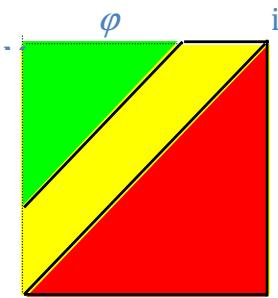

Pourquoi P et Φ , et pas M, I, m et i ? parce que, lors de la fermeture du schéma R en bande de Mœbius, selon les indications que Lacan apporte dans une note ajoutée à son texte en 66, M, I, m et i ont vocation à se fondre sur le bord unique de cette bande, tandis que P et Φ restent toujours à l’extérieur. Autrement dit, M, I, m et i marquent le bord de la surface qui fait limite, coupure par rapport au trou dans lequel se situent P et Φ.

A cette époque Lacan n’a pas encore clairement distingué le phallus imaginaire, du phallus symbolique Φ, et il n’est en effet pas facile de les distinguer. Pour être conforme à l’écriture du schéma R des « Ecrits » j’utiliserai le petit ϕ dans les lignes qui vont suivre sachant que je crois qu’il s’agit du grand Φ.

C’est justement l’étude de la psychose de Schreber qui va lui permettre de radicaliser le schéma R. Dans ce dernier, M et I occupent des places équivalentes à ϕ et P. ce sont des coins extérieurs au schéma. Mais le schéma I privilégie les points ϕ et P

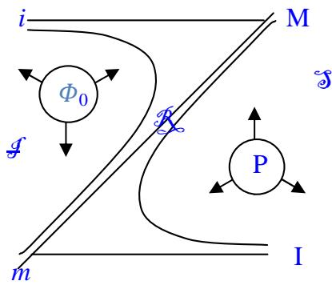

On voit que le petit ϕ du schéma R s’est transformé en grand Φ: c’est une indication que ${ \mathrm { c } } '$ est bien grand Φ qu’il fallait lire au schéma R. En tout cas ${ \mathrm { c } } '$ est ma lecture, sinon je n’y comprends plus rien ; car la transformation essentielle entre les deux schémas, c’est le passage à l’indice zéro, ${ \underline { { \mathcal { R } } } } _ { \mathrm { 0 } } ( \Phi , \mathrm { P } ) \to { \mathcal { I } } ( \Phi _ { 0 } , \mathrm { P } _ { 0 } )$ . Lacan appelle « trou » ces deux lieux : $\Phi _ { 0 }$ trou dans l’imaginaire, $\mathrm { { P _ { 0 } } }$ trou dans le symbolique. Dans le même temps il indique topologiquement ces trous par les deux branches d’une hyperbole.

C’est là que ça ne va pas, car une hyperbole est justement un courbe qui ne se referme pas sur elle même : elle ne fait pas trou, comme une ellipse, un cercle ou… un carré, comme le schéma R ! Bref, le passage essentiel entre les deux schémas ${ \mathrm { c } } '$ est celui d’une figure fermée $( \mathcal { R } )$ à une figure ouverte (I), soit le passage d’un trou (qui entoure une surface) à un non trou, où la surface ne parvient pas à se distinguer du trou, les asymptotes représentant la tentative de suture du trou qu’est le délire : ça s’en approche à l’infini, mais ça n’y arrive jamais.

Par conséquent ce n’est pas de trou qu’il aurait fallu parler afin de mettre en accord le schéma et le discours, mais soit de non-trou, soit de trou impossible, soit, ce que j’ai retenu, de parler d’un trou de désorientation au sein d’une surface orientée. C’est en accord avec les formulations tardives de Lacan sur le fait que le symbolique, c’est le trou3.

Fonctionnellement, le trou n’a pas de dimension, il n’est donc pas de la surface mais il occupe de la surface, au sens où il s’étend sur une certaine quantité de surface géométrique sans en avoir les propriétés dimensionnelles topologiques. Conformément aux définitions de Poincaré, tout cela est très logique : la surface présente deux dimensions, son bord, qui la coupe, fait une dimension. Cette dimension se recoupant elle-même, elle l’est par un point de recoupe qui est forcément un point double, faisant coïncider dans une troisième dimension un premier passage de la courbe dessous avec un deuxième passage dessus. Deux points (n+1) de zéro dimension (n-1) sont nécessaires à couper ce bord à une dimension. Autrement dit le point Φ doit s’articuler avec un point P. Et cette articulation produit un effet supplémentaire de détachement d’un morceau que je n’hésiterai pas à rapprocher de l’image du corps, conformément à l’équation de la métaphore paternelle, rappelée au début de mon propos. La recoupe permet la distinction du dedans et du dehors : il y un corps surface avec un trou autour.

Le trou cesse de fonctionner comme trou, c'est-à-dire que la fonction qui les relie ne fonctionne plus dans le cas de la forclusion du Nom-du-Père, et les deux dimensions, désarticulées, ne sont plus fonction l’une de l’autre, ce qui est représenté par l’incapacité de l’hyperbole et de la parabole à boucler un trou, une figure fermée, ce qu’écrivent les indices zéro accolées aux lettres qui les représentent.

L’autre façon de lire le schéma R, c’est la note rajoutée par Lacan en 66 qui le dévoile : c’est une bande de Mœbius c'est-à-dire quoi ? eh bien justement un coupure qui se referme sur elle même, produisant donc un trou, ce trou produisant à son tour une surface, la surface du signifié et de la signification.

Le schéma I nous permettait déjà de lire une différence entre des lettres qui, dans les schéma R semblaient avoir le même statut : M, et I , m et i. au schéma I, ces lettres se retrouvent en effet sur la bande centrale du réel (qui était la réalité au schéma R), dans un statut radicalement différent que les « trous » $\Phi _ { 0 }$ et $\mathrm { P _ { 0 } }$ . C’est ce qui permet rétrospectivement de considérer le schéma R comme « épinglé $\gg ,$ « tendu » entre ses deux agrafes symboliques Φ et P qui délimitent le trou extérieur à la surface. M, et I , m et i délimitent alors la surface, comme telle, c'est-à-dire l’imaginaire en opposition aux trous, c'est-à-dire le symbolique. Cette surface imaginaire, nous l’appelons la réalité, et face au « bouchage des trous » (à réinterpréter comme impossibilité à fermer un trou symbolique) dans la psychose, ça devient le réel.

Je développe donc une lecture qui différencie topologiquement surface et trou, alors que Lacan différenciait deux triangles, celui du dessus pour écrire l’imaginaire, celui du dessous pour parler du symbolique. Cette lecture n’est pas topologique, car dans le réel de l’écriture, ces deux triangles n’ont pas de différence de statut ; seules les lettres S et $\mathcal { I }$ d’un côté A et S de l’autre, rajout extérieur à l’écriture du schéma, permettent de distinguer ces deux zones. Dans ce sens, le schéma est un dessin théorique qui n’a pas les mêmes propriétés que ce qu’il décrit, ce n’est pas un dessin topologique. Mêmes remarques, déjà faites, pour les lettres M, et I, m et $i \mathrm { ~ d ~ }$ une part, Φ et P d’autre part.

Par conséquent au lieu de lire que $\Phi _ { 0 }$ est un « trou » dans l’imaginaire et $\mathrm { P _ { 0 } }$ un « trou » dans le symbolique, je propose de lire $\Phi _ { 0 }$ et $\mathrm { P _ { 0 } }$ comme des empêchements du symbolique qui empêchent la différenciation fondamentale entre surface et trou dans l’imaginaire. Il s’ensuit en effet une hyperbole, figure qui ne parvient pas à refermer un trou.

Les indications portées alors par Lacan sur les branches de l’hyperbole :

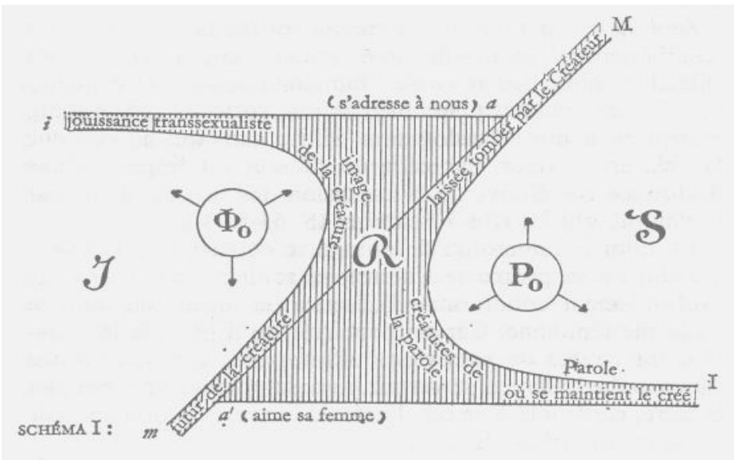

…indiquent la tentative que représente le délire pour s’approcher de la construction d’un trou, bref pour faire suppléance au symbolique. En faisant quoi ? En opérant une tentative délirante de remettre en rapport les deux dimensions de la surface, de façon à distinguer surface et trou. C’est une tentative pour faire intervenir imaginairement la troisième dimension, qui serait opérante si la découpe parvenait à se recouper.

On peut lire ainsi une tentative de reconstruire l’équation de la métaphore paternelle Nom-du-Père = f(A/Φ). Ce rapport c’est le rapport sexuel, le rapport d’engendrement, de la même façon qu’une courbe (une réalité) est engendrée par la fonction écrite par $y = f ( x )$ dans laquelle tout objet se définit du rapport entre y et x. Le Nom-du-Père est fonction du phallus, ce qui veut dire : le Nom-du-Père doit imposer sa recoupe au phallus pour produire un trou. Vous lisez sur le schéma I de Lacan les rapports du créateur $\mathrm { P _ { 0 } }$ à la créature $\Phi _ { 0 } .$ . Mais cette créature pourrait bien être ce qui a engendré le créateur, symétrie due à l’effacement de la différence entre surface et trou, c'est-à-dire à l’effacement des différences générationnelles (le père, c’est le fils) et sexuelles (via l’éviration, Schreber devient une femme). Dans l’équation de la métaphore paternelle, il y a au contraire une succession, c'est-à-dire un engendrement, et une différence entre le statut de P et celui de Φ, comme il y a une différence entre les statuts de y et x. Comme dans le schéma R, il y a une différence entre la surface, tendue aux coins de M, et I , m et i et le trou fonctionnel dans lequel la coupure de la castration Φ est reprise par P.

Assumer la différence des sexes, c’est assumer que le phallus est porté par un tiers, quelqu'un ou quelque chose qui n’est pas la mère et qui finalement n’est porté par aucune personne ni objet puisqu’il s’agit d’une fonction. Ce n’est ni, x, ni y, ni l’objet défini par les coordonnées x et y, c’est la fonction f en tant qu’elle opère la mise en rapport du phallus avec le Nom-du-Père.

Φ, le phallus, que Lacan affuble de l‘indice 0 dans le schéma I, comme « trou dans l’imaginaire », correspond à en effet à ce trou qui, lorsqu’il fonctionne, autorise la tenue des bords de ce qu’on appelle la réalité. Lorsqu’il ne fonctionne pas, $\Phi _ { 0 , }$ c'est-à-dire lorsque la castration n’est pas assumée, ça donne le fétichisme dans un premier temps, ou le délire de Schreber de transformation en femme, dans un second temps. A l’inverse, l’assomption de la castration serait écrit par la perte d’une dimension, le passage d’un espace 3 à un espace 2, l’espace des représentations de choses, donc de l’écriture.

P, le Nom-du-Père, devenue $\mathrm { P _ { 0 } }$ dans le schéma I comme « trou dans le symbolique », correspond à ce trou qui, lorsqu’il fonctionne, permet de parler, c'est-à-dire de se mettre d’accord ou pas avec les autres sur ce qu’il convient de reconnaître comme réalité. « Ce qu’il convient », c'est-à-dire encore : quelle convention va faire garantie de vérité quant à cette réalité. On peut situer cette garantie au niveau de dieu, comme l’avait fait Descartes ; on peut se contenter d’un mathème comme l’a proposé Lacan. En effet, je tiens ce « P » du schéma R comme un équivalent du S(A) du graphe. Lorsqu’il ne fonctionne pas, $\mathrm { { P _ { 0 } , } }$ ça donne le délire d’enfantement de l’humanité de Schreber. En revanche, l’assomption de cette fonction dite « du Nom-du-Père » serait écrite par cette nouvelle perte d’une dimension, le passage de l’écriture (c'est-à-dire de la mémoire) à la parole, d’un espace 2 à un espace à une seule ditmention : aucun écrit ne vient garantir la vérité de la parole. Ça laisse la place au lapsus et au mot d’esprit. Et ça montre pourquoi des tonnes d’écrits dans l’histoire de l’humanité, et spécialement les textes sacrés des religions, tentent de ressaisir cette perte de contrôle sur ce qui peut se dire ou pas.

Il y a donc une nuance entre cet espace à une seule dit-mention, et la troisième dimension de l’espace 3 d’où nous étions partis. Ce n’est qu’après coup que nous pouvons dire que cette troisième dit-mention peut se rattacher à la troisième dimension de l’espace trois précédemment abordé. Car c’est en définitive la parole comme telle qui troue la plan de l’écriture, qui, par ce trou donne un (pas de) garant de la vérité à ce que nous appelons « réalité » de l’espace à 3 dimensions. C’est plus une écriture de cet espace faisant retour sur l’espace de l’écriture par la découpe qu’il y occasionne. Ça donne : l’interruption d’un trait sur l’écriture d’un nœud pour indiquer que le brin passe dessous, mais aussi la perspective, et tous les autres artifices que nous avons trouvés pour écrire la troisième dimension, comme l’ensemble des écrits qui ont été produits pour tenter de décrire cette réalité, c'est-à-dire ce qu’il convient de penser comme étant la réalité, bref, comme substituts, dans la fonction P, à l’absence de garant de la vérité. Ceci correspond à l’absence d’une représentation du féminin au niveau de la fonction Φ.

Ainsi encadrée par un espace 3, décrit après coup comme étant à trois dimensions, et une espace 1, qui attribue sa dit-mention manquante à l’espace « initial » du réel pour en faire une réalité acceptable, l’espace 2 de l’écriture ouvre l’espace des représentations de choses, dans lequel on peut représenter des espaces au nombre de dimensions qu’on veut. C’est ce que nous allons voir plus loin par la création d’une espace à n dimensions virtuelles, suite à la perte d’une dimension dans la mise à plat du nœud borroméen.

Ainsi la bande de Mœbius « réelle » n’est pas saisissable dans l’espace 3. Toute représentation est fatalement dans l’espace 2 (même si, je le répète, cet espace permet l’écriture d’une infinité d’espaces à une infinité de dimensions). Dans la communauté actuelle des topologues, elle s’écrit avec une torsion, ce qui lui donne sa réalité dans le dialogue « bien entendu ». Ma proposition de prendre en compte les trois torsions occasionnées par la mise à plat4 ne peut valoir comme telle que si elle est acceptée dans un dialogue avec cette communauté. Car c’est bien le dialogue qui peut affirmer les qualités d’un objet par accord entre ceux qui en parlent. Sinon, c’est un délire.

Par une seule torsion (qui est partout, dit-on, mais on ne peut l’écrire) on veut écrire, je crois, ce fait du bord comme tel, qui est à la fois d’un côté et de l’autre, et, ni d’un côté, ni de l’autre. Mais justement, cette écriture ne correspond pas à ce qu’on en dit, à savoir que la torsion est partout, car cette omni localisation de la torsion (point de vue global) convient à l’énonciation, pas à son inscription qui impose une localisation, ne serait-ce que par ce que Freud – et Lacan le reprend – a nommé « la double inscription » en représentation de mot et représentation de chose. J’en tiens compte dans la mise à plat en remarquant que le dessin impose une surface (représentation de chose) et un bord (représentation de mot) dédoublant de fait cette double inscription en une inscription dessus (signifié, conscient) et une inscription dessous (signification, inconsciente), ce qui nécessite les trois torsions.

## La mise à plat est une coupure

La bande de Mœbius comme telle est une coupure. En référence à l’espace euclidien à trois dimensions, un bord, par exemple le bord d’une feuille de papier, peut se définir comme ce qui appartient aux deux faces. C’est la trace et le produit d’une coupure. Ce qui appartient aux deux faces n’aura donc qu’une dimension (il n’a pas de voisinage sur une surface) et sera à la fois dessus et dessous (il des voisinages à la fois dessus et dessous). Par rapport à l’espace n =2 de la surface, le bord, de dimension n =1 correspond bien à une coupure. La bande de Mœbius correspond à la fois à l’une des définitions de la coupure donnée ci-dessus : tout point à sa surface est situé à la fois dessus et dessous, donc sur une coupure, et en même temps il dénie l’autre définition, puisque son voisinage comprend des points situés localement sur la même face. Nous sommes devant le paradoxe d’un objet qui satisfait à la fois à la définition d’une coupure et à la définition d’une surface : $n = n + 1$ qui revient à 0 = 1. De plus, elle n’a qu’un bord continu : tout se passe comme si ce bord était la coupure, annulant globalement tous les points de la surface situés localement entre les deux passages opposés du bord unique.

Un bord fait à la fois limite et communication entre une face et une autre. Une torsion fait le même travail. Entre dessus et dessous, à la fois dessus et dessous, le bord, la torsion et la coupure sont trois expressions de la même fonction, celle de se situer dans une espace amputé d’une dimension par rapport à ce dessus et ce dessous. Cette dimension, nous pouvons dire que c’est la troisième, celle qui manque à l’espace plan : écrasée le long du bord, elle se manifeste comme lieu d’exercice de la torsion. On passe d’une face à l’autre en passant par la troisième dimension, soit en franchissant le bord, soit en épousant un mouvement de torsion.

J’avais déjà repéré depuis longtemps que la mise à plat d’une bande de Mœbius était l’équivalent d’une coupure :

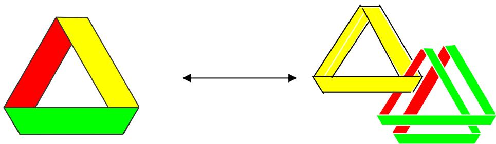

Une coupure le long du bord détache un bilatère (objet à deux faces : la coupure a été efficiente) enlacé à une bande de Mœbius (objet à une seule face : la coupure a échoué, l’objet produit est identique à l’objet coupé) identique à l’objet initial, moins la largeur de la découpe. L’écriture de la mise à plat de la bande de Mœbius permet de lire sa structure : un bilatère (vert dessus, rouge dessous) dans la continuité d’un unilatère (jaune, à la fois dessus et dessous). Il y a juste cette différence entre enlacement (coupure réelle) et la continuité (coupure de la mise à plat). Continuité n’est sans doute pas le bon mot, car la mise à plat fait apparaître trois torsions qui séparent trois zones de surface. Cette séparation vaut donc, au plan de l’écriture, comme une coupure. La torsion est effectivement ce qui fait passer d’une face à l’autre, mais en même temps c’est ce qui sépare une face de l’autre.

L’écriture de la bande de Mœbius proposée par Lacan en 66 devient alors :

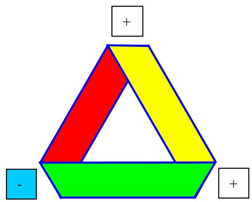

Les trous P et Φ, fonctionnels, sont l’intérieur et l’extérieur de l’écriture, dans un semblant qui les laisse en fait tous les deux à l’extérieur, conformément au schéma R. Le moi et son image se regardent en miroir comme les deux faces de la bande, ou comme le moi se regardant dans le miroir ; l’Idéal maternel se trouve clivé d’une face par la fonction paternelle qui fait trou au milieu. Toutes ces différences s’effacent au schéma I, c'est-à-dire sur la bande de Mœbius homogène :

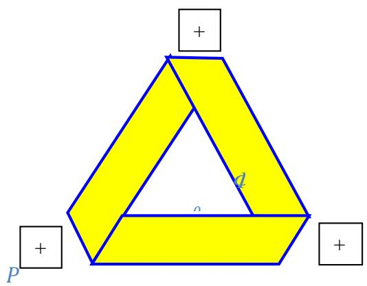

En quoi ces modèles sont-ils utiles à la psychanalyse ? En ce qu’ils écrivent comment s’opère la coupure entre un dedans et un dehors, coupure nécessaire à l’élaboration d’une image du corps et d’un moi. Ils montrent aussi que parfois cette coupure rate, laissant une béance par laquelle le sujet trouve quelque difficulté à s’orienter. Par exemple, des représentations incompatibles entre elles (en gros, les pulsions contre la morale) obligent certaines à se réfugier dans l’inconscient, c'est-à-dire dans un extérieur interne : c’est pas moi, c’est l’Autre. D’autres ne trouvent inscription nulle part, laissant cependant trace : l’acoupure comme telle lorsqu’elle ne se recoupe pas elle-même.

Nous ne pouvons inscrire la voix, support de la parole, mais nous pouvons mettre en mémoire ce que nous avons entendu. C’est ce qui fait du signifiant un bord, traçant des lettres lorsqu’il se recoupe c'est-à-dire lorsque produisant un dedans et un dehors, il isole un signifié et une signification. Le signifiant est un bord entre l’énonciation comme telle, ininscriptible, et la lettre qui restera en mémoire. Mémoire inconsciente si la liaison avec le signifiant se perd (surface sans bord, donc désorientée, type bande de Mœbius homogène- aux trois torsions de même sens - cross cap, bouteille de Klein, que nous étudierons plus loin), mémoire consciente si cette liaison perdure (surfaces avec bord type bilatère, anneau, sphère, tore). La liaison entre signifiant et lettre (c'est-à-dire entre représentation de mot et représentation de chose) peut se représenter dans ce modèle par ce qui se tisse de surface et qui fait bord, limite entre un intérieur et un extérieur : c’est bien ce qui a été discuté avec les autres, produisant en même temps la limite entre moi et les autres. Lorsque cette surface ne parvient pas à faire limite, on la dit unilatère, c'est-à-dire qu’elle présente un continuum entre le dedans et le dehors.

## Les coupures de l’espace à trois dimensions

En se basant sur ce modèle, comment une surface de dimension 2 va-t-elle couper un volume de dimension 3 ? De la même façon qu’une coupure rectiligne mais infinie ne coupe pas un plan infini (il faut qu’elle se recoupe), de même un plan infini ne coupe pas un volume infini. Par contre si le plan se referme sur lui même :

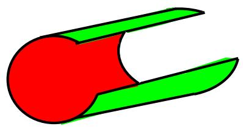

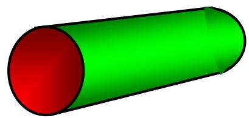

Il enserre un morceau d’espace sans toutefois le découper. Ça reste une sorte de tuyau infini dans un espace infini. Par contre, si le tuyau se referme sur lui-même :

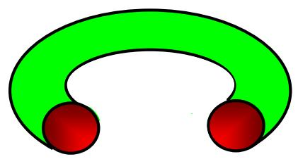

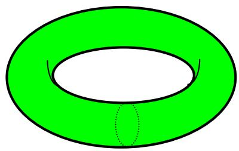

…il crée un tore, c'est-à-dire qu’il découpe un morceau de volume de l’espace environnant. Voilà en quoi le tore est une coupure. Il est au volume ce que la coupure à une dimension (qui se recoupe) est à la surface. Autrement dit la linéarité d’une chaîne signifiante se courbe sous l’influence des autres chaînes qui constituent autant de dit-mentions différentes qui ne vont pas forcément dans le même direction, ce qui tisse cette surface qui va faire lettre, inscription à la surface du corps… ou dans les entrailles, puisque aussi bien ces entrailles ne sont-elle que ce que le tissage de la lettre et du signifiant en a fait. C’est à partir d’une telle coupure que peut se construire l’image du corps, c'est-à-dire que peut se tenir l’articulation de jugement d’attribution et du jugement d’existence dont Freud parle dans « la dénégation », c'est-à-dire enfin, juger si une représentation appartient à l’intérieur ou à l’extérieur : bref faire la différence entre fantasme et réalité, entre représentation et perception.

C’est ainsi qu’en topologie on distingue classiquement les objets sphériques (ou bilatères), qui sont orientés c'est-à-dire qu’ils séparent clairement un dedans et un dehors, et des objets asphériques (ou unilatères), qui sont désorientés, ne pouvant accomplir cette coupure. En ce sens on peut dire aussi qu’ils sont désorientés parce qu’ils sont la coupure comme telle et non le produit d’une coupure. Ils sont saisis du point de vue de leur fonction et non en objets produits de la fonction. Cette façon de distinguer n’est pas une classification des objets selon qu’ils auraient des qualités différentes, c’est une séparation que le point de vue peut opérer sur chaque objet5.

Lacan démontre en quoi le tore est asphérique : il a raison, c’est aussi une coupure, donc un lieu de passage entre le dedans et le dehors. Il le démontre en s’appuyant sur le fait qu’on peut inscrire une bande de Mœbius sur le tore. Ce n’est pas une bonne démonstration : ça montre que la bande de Mœbius est inscriptible sur le tore… la bande de Mœbius hétérogène, mais la bande de Mœbius homogène aussi bien qui, elle, est le contraire d’une coupure6. Rien n’est simple. Il se base aussi sur un phénomène d’apparence qui fait que lorsqu’on écrase un tore, il se plie en prenant l’apparence d’une bande de Mœbius hétérogène. Ce n‘est que la continuité de la démonstration par l’inscriptibilité de la bande de Mœbius sur le tore.

Pourquoi le tore est-il néanmoins une coupure ? Tout simplement parce que le plan qu’il est se recoupe deux fois, séparant clairement un dedans et un dehors, ce que ne font pas cross cap et bouteille de Klein que nous allons examiner un peu plus loin. Il est coupure, donc asphérique, lorsqu’on le considère du point de vue de sa surface, qui est n-1 par rapport au volume qu’il détache de l’espace 3D, mais il est objet sphérique lorsqu’on considère ce volume détaché, à n dimensions.

Ainsi, du point de vue de la coupure, une sphère est aussi asphérique : comme fonction (n-1= 2, surface), elle sépare clairement un dedans et un dehors, ce qui permet les échanges avec ce dehors sous la forme de l’articulation de la demande et du désir. Du point de vue de l’objet, elle est bien sûr sphérique (n dimensions = 3, volume) et une coupure à une dimension qui se recoupe peut lui enlever un morceau.

Il faut donc absolument introduire ici la question des points de vue. Car ces « objets » ne sont pas des objets « en soi » mais des objets pour un sujet qui les lit ; en conséquence nous avons la possibilité de porter un point de vue sphérique sur les objets asphériques et un point de vue asphérique sur les objets sphériques. Ainsi, un sujet se baladant intrinsèquement à l’intérieur d’une sphère ne rencontre pas de bord : il a donc un point de vue asphérique sur la sphère, il ne peut savoir s’il y a une autre face. Pour lui, la sphère est unilatère. Et il peut s’accorder sur ceci comme réalité avec d’autres sujets partageant le même point de vue. De plus, en tournant en rond à l’intérieur il recoupe fatalement son propre point de vue, ce qui divise la sphère en deux moitiés, ce qui est un point de vue sphérique.

Par contre un sujet extérieur à la sphère pourra deviner qu’il y a une autre face, interne à la face externe qui lui est donné à voir. Il a globalement un point de vue sphérique sur la sphère et s’accorder avec d’autres pour cette réalité. Mais ce point de vue met en communication la face interne et la face externe : c’est bien la même face qui a deux visages, et c’est un point de vue externe globalement asphérique sur la même sphère.

Tout dépend en fait du niveau dimensionnel auquel on se place. Le même espace peut être lu comme étant à n dimensions par rapport à l’espace de niveau n-1 et alors, il est sphérique, ou on peut le lire comme étant la coupure de l’espace à n+1 dimensions et alors il est asphérique. On voit bien ici qu’un objet (appelé autrement espace) n’a pas de caractéristiques intrinsèques, et qu’il est vain de faire de catégories d’objets telles que « les objets sphériques » et « les objets apshériques ». Tout n’est qu’une question de rapport et cela dans le cadre d’un point de vue. C’est bien ainsi que ça se passe entre les êtres parlants. Ils n’ont de caractéristiques intrinsèques que via le rapport qu’ils entretiennent avec les petits autres (ligne a-a’ du schéma L), ses semblables, (ils sont n+1), et le grand Autre, c'est-à-dire la fonction du langage, qui est l’espace coupure n-1.

On peut faire ce genre de raisonnement pour chacun des objets dits « topologiques ». Ce qui est vraiment topologique, de mon point de vue, c’est le point de vue.

Et c’est ce qui fait que les humains ont parfois du mal, non seulement parce qu’entre eux, ils n’ont pas le même point de vue, mais en plus parce que, d’une manière, interne ils laissent cohabiter plusieurs points de vue dans l’inconscient.

Selon les orientations qu’on donne aux côtés d’un rectangle, on obtient les 4 surfaces volumiques possible7 : sphère, tore, cross cap et bouteille de Klein. Cependant, seules les deux premières font coupures en séparant nettement un dedans d’un dehors. Grâce à ces deux types de surfaces on peut enlever un morceau de volume fini à un volume infini.

La bouteille de Klein et le cross cap sont alors des ratages de la coupure, de la même façon qu’il y a des ratages du nœud borroméen :

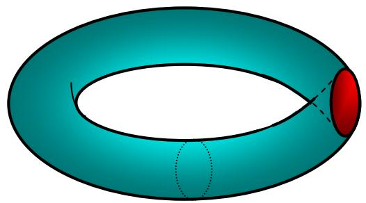

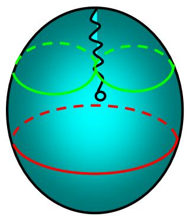

Ils ne séparent pas clairement un dedans et un dehors.

Ce sont donc, pour la bouteille de Klein, une figure du délire, et pour le cross cap, du fantasme. Dans le délire, on peut être persuadé de voir ou d’entendre dehors des représentations qui sont en fait dedans. Dans le rêve ou le fantasme, on se croit dans un espace virtuel (dedans) que l’on tient pour la réalité (dehors). Ceci dit, la folie peut aussi bien se situer dans une fixation sur un point de vue sphérique, ce qui serait une position paranoïaque (le dehors m’est hostile) que dans une fixation sur un point de vue asphérique, ce qui serait plutôt schizophrénique (pas de possibilité de fixer une signification, mais un discours sans limite). La névrose serait la capacité de passer d’un point de vue à l’autre, avec plus ou moins de raideur ici ou là. Le rêve se passe évidemment « dedans », dans une coupure absolue avec le dehors. Cependant, dans ce dedans, nous nous croyons dehors, et nous croyons à la réalité de ce dehors, ce qui peut ressembler, selon les points de vue, à de la paranoïa (les rêves où l’on est poursuivis, menacés, les rêves où l’on est amoureux d’un objet impossible, n’importe quel rêve qui ne cesse de revenir) ou à de la schizophrénie (une désorientation totale, un non sens absolu). Le récit du rêve, par contre, fait la balance entre ce dedans et ce dehors, puisque via les mots, nous faisons état du passage de ce dedans à ce dehors qu’est l’autre auquel nous adressons le récit. Il en serait de même pour toute manifestation de l’inconscient, notamment le symptôme. L’interprétation fait passer certaines éléments de la formation de l’inconscient dans le monde sphérique du signifié, tandis que le discours reprend son déroulement métonymique infini par lequel aucun signifié ne cesse de se tordre en un autre, de par la logique du signifiant.

C’est juste que ça donne une idée de la complexité de la réalité psychique : chaque dimension doit se recouper elle même et dans la combinatoire qu’elle forme avec toutes les autres. Donc, une analyse ça peut être que long, vu qu’il faut parcourir tous les points de vue afin d’assurer toutes les recoupes… pour parvenir à se détacher de l’espace analytique de la cure. Un morceau peut en tomber : l’analyste.

Dans ce registre intervient tout ce qui fait l’articulation de la demande et du désir. Le corps se construit autour de ses trous dans la mesure où ce sont les lieux de la coupure où la demande du sujet se recoupe (ou non) avec celle de l’autre. Là où je demande à l’autre (la bouche, lorsque j’ai faim ou besoin de tendresse) et là ou l’autre me demande (l’anus, lorsque l’autre veut que je devienne propre, ou qu’il a besoin de tendresse). Ceci construit le corps comme un tore, soit : une sphère avec un trou. Je parle de l’image du corps, bien entendu, ce qui n’est pas sans effet sur le corps physiologique.

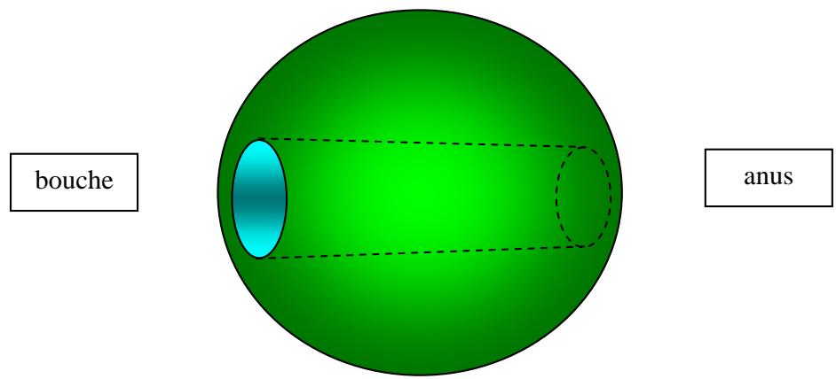

Ceci est la forme que Lacan appelle le tore trique qui est la bouée bien connue, mais retournée. Son retournement redonne donc un tore pas trique, c'est-à-dire une bouée :

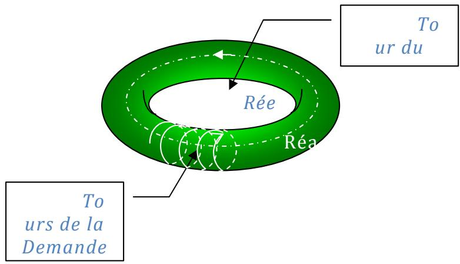  
La demande se fait par une énonciation qui se sert des signifiants. On demande un objet, mais ce dernier s’avère aussi insatisfaisant qu’un vide, puisque ce n’était pas la Chose en soi, mais seulement ce que désignait le signifiant. Or, ce que le signifiant désigne ne renvoie pas à autre chose qu’à un autre signifiant. On est alors contraint de passer à un autre objet, et ainsi de suite, ce qui s’écrit sous cette forme d’une hélice sans fin courant le long du

tore. Les signifiants tissent ainsi le bord du tore en circonscrivant une succession d’objets dans le trou interne du tore, ce qui construit ce trou interne comme réalité psychique. Courant après les objets de cette réalité, le sujet ne se rend pas compte que dans le même temps il parcourt un tour inconscient supplémentaire, celui qui entoure le trou central externe à sa conception de la réalité. C’est le tour du désir qui encercle ce qui ex-siste, ce qui se tient en dehors : le Réel, ou encore l’objet a, cause du désir, ou enfin la fameuse Chose en soi. Encore faut-il pour cela que le tore se referme sur lui-même, comme dans le modèle à deux dimensions de la rondelle. Alors seulement se produit cette différenciation de la demande (trou interne) et du désir (trou externe), qui rend vivable la recherche d’un objet de la demande. C’est la conscience de l’inadéquation de tout objet (du trou interne), du fait du signifiant, qui permet de se supporter, non comme éternel insatisfait, mais comme désirant permanent.

La surface du tore (n-1) se présente donc comme une coupure qui, se refermant sur elle-même, a permis d’isoler un morceau de volume (n) correspondant au corps. Cette surface n’est elle-même que le tissage élaboré par la demande et le désir, c'est-à-dire par les signifiants : la dimension x représente les cercles de la demande, dans leur articulation à la dimension y du désir. Dans une autre formulation, ce n’est pas autre chose que la dimension métonymique telle qu’elle s’articule à la dimension métaphorique.

Dans le trou central de ce tore on peut imaginer que passe le trou interne d’un autre tore enlacé.

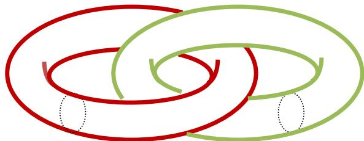

Cet autre tore est tissé de l’histoire d’un père ou d’une mère, telle qu’il la transmet à l’enfant à son insu, par la manière dont il se situe dans ces premiers échanges se faisant autour de la demande orale et anale. On peut imaginer aussi que trois tores de ce type, au lieu de s’enlacer, se nouent de manière borroméenne, c'est-à-dire sans qu’aucun d’eux ne pénètre le trou d’aucun autre. On s’en rend compte en les considérant deux à deux :

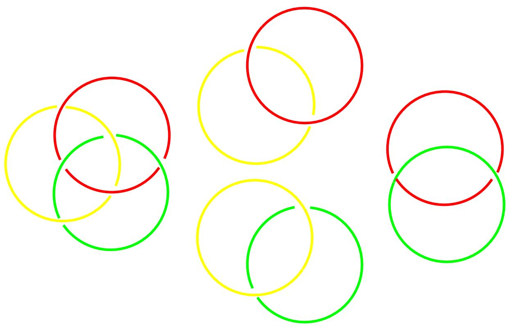

Nous aurions alors l’écriture, d’une part de l’inceste et du meurtre, lorsque les tores sont enlacés, du respect de la loi de l’interdit de l’inceste et de l’interdit du meurtre lorsque le nouage se fait de manière borroméenne : on ne rentre pas dans le trou de l’autre, et un Autre est nécessaire à l’autre. Ceci crée encore un autre espace qu’on peut dire fermé, puisque les trois ronds sont fermés et que le nœud tient, mais c’est un espace fondé sur un tout autre modèle que l’espace euclidien, c'est-à-dire l’espace tel que nous avons l’habitude de le concevoir comme notre habitat. Ce dernier se construit bien sûr avec la perception, mais aussi grâce à la distorsion qu’elle subit du fait des encodages des signes de perception par lettres et signifiants.

Une autre écriture de l’inceste et du meurtre se rencontre lorsque les trois tores se fondent en un seul noué en trèfle. Il se trouve que le trèfle est une autre écriture de la bouteille de Klein, en tant qu’il est le tracé d’une parcours complet qu’on peut faire de dedans à dehors, en empruntant le trou « interne » et le trou « externe », qui sont le même trou :

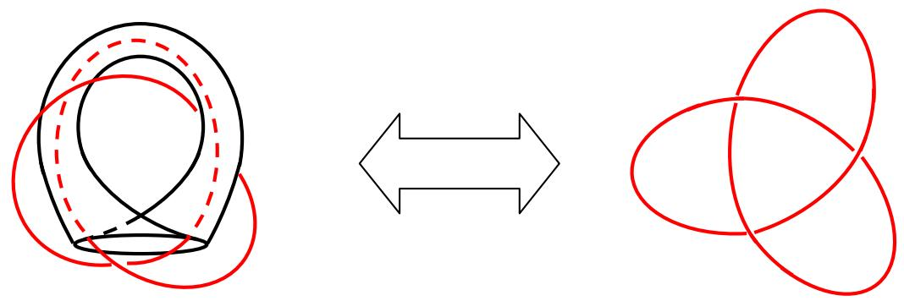  
Mais comment étudier l’espace du nœud borroméen autrement que par une mise à plat ?

## La mise à plat du nœud borroméen détermine un espace d’écriture à 4 dimensions

Qu'est-ce qu’une mise à plat ? C’est la perte d’une dimension, et c’est une écriture. Ce qui ne peut être saisi dans le réel le devient grâce à l’imaginaire (le plan) et sa limite, le symbolique (le trou qu’il y a autour) Une dimension est perdue dès l’origine, réceptacle de ce que Freud avait nommé le refoulement originaire. Mais en revanche cette mise à plat permet l’écriture de tous le fantasmes qu’on voudra, y compris et surtout les fantasmes de l’origine, dans des espaces virtuels au nombre de dimensions littérales qu’on voudra. Cette origine mettant en jeu la perte d’une dimension, ce perte se retrouvera imaginarisée de multiples façon différentes. La perspective est l’une d’entre elle en ce qui concerne les tableaux. Les rêves de chute, de poursuite, de vertige, les angoisses d’abandon et de castration en seront le pendant pour les manifestations de l’inconscient. Les mythes de l’origine du monde y correspondront dans le champ anthropologique. A cette dimension perdue s’assimile une autre, celle de l’impossibilité de la mise à plat (d’une écriture) d’un sexe féminin, puisqu’il est la platitude comme telle, la surface vierge sur laquelle s’écrit la protubérance phallique.

Du nœud borroméen dans l’espace à trois dimensions, on ne peut dire qu’une chose : si on coupe un rond, tous les autres sont libres. A bien y regarder, cette coupure ne permet l’orientation que dans une dimension, celle qui s’ouvre entre ces deux pôles : il y a un nœud borroméen, il n’y en a pas. On n’obtient pas un espace muni de dimensions, on obtient trois ronds (dont un qui n’est plus un rond, ayant été coupé) en vrac, c’est tout.

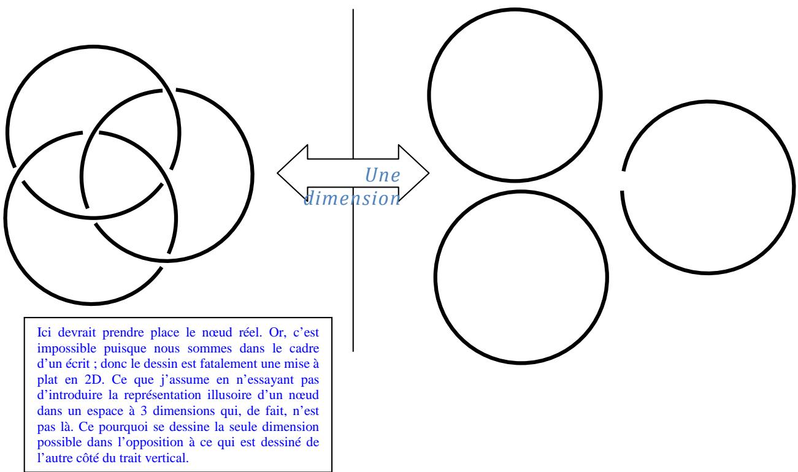  
Nous sortons d’une définition euclidienne ou sensible de la dimension. Nous en faisons un concept accordé à la définition de Poincaré : ici un espace de dimension 1 et coupé par une espace de dimension 0, ce qu’est exactement la coupure que nous avons fait subir à l’un des ronds. Nous ne savons pas ce que serait, dans cet espace, le prélèvement d’un

morceau par la fermeture que la coupure produirait en se recoupant d’une deuxième, car en passant à ce type de définition, nous nous privons des rails de l‘intuition sensible.

Or la mise à plat du nœud réel opère un certain nombre de coupures en mettant en évidence des dimensions de l’espace nœud ainsi créé. Si on prend soin d’écrire le nœud le long des deux dimensions du plan, x et y, on s’aperçoit qu’il y a un nœud droit (un rond à droite des deux autres disposés selon l’axe des y) et un nœud gauche (un rond à gauche des deux autres disposés selon l’axe des y), un nœud tournant dans un sens et un nœud tournant dans l’autre (les bien mal nommés lévogyre et dextrogyre, car ça ne tourne ni vers la droite ni vers la gauche, mais simplement dans deux sens différents). La perte de la dimension z, la troisième dimension de l’espace 3, introduit des coupures créant un espace virtuel, un espace d’écriture dont les dimensions n’existaient pas dans l’espace dit « de départ ». Il en est de même dans l’encodage des « +-» de « La Lettre Volée », qui créent un espace des « 123 » dans lequel se dégagent des lois qui n’étaient pas dans l’espace de départ.

Ainsi, l’espace du nœud borroméen s’avère, du fait de l’écriture, un espace à 4 dimensions : la chiralité (axe x, droite-gauche), la hauteur (axe y, haut-bas), le relief (axe z, dessus-dessous, dimension réellement perdue, mais symboliquement retrouvée par l’écriture de chaque croisement, au niveau duquel on peut lire un dessus et un dessous.), et la gyrie (ça tourne d’un côté ou de l’autre). Ça ne donne pas un espace 3 avec une dimension supérieure que la mystique dirait difficilement imaginable. C’est au contraire très simplement lisible dans l’espace 2 de l’écriture, parce que ce sont des effets de l’écriture, c'est-à-dire de la perte d’une dimension par rapport à l’espace supposé du réel. En rapport à l’espace sensible, on peut dire que cette dimension perdue était le troisième, mais elle n’est perdue que réellement puisqu’elle s’inscrit symboliquement dans les dessus-dessous. La dimension réellement perdue est celle de la coupure séparant le nœud réel comme tel du nœud dont un rond a été coupé. Dans la mise à plat, on ne se préoccupe plus de coupure des ronds qui sont devenus des traits d’écriture.

Le nœud réel ne tourne pas, ni d’un côté ni de l’autre. C’est la mise à plat qui contraint à cette tournure, qu’on peut aussitôt rapprocher de l’emploi de ce mot dans la stylistique. Une tournure de phrase c’est un effet de style, un effet d’écriture qui permet de mettre en relief tel aspect du propos. Freud emploie d’ailleurs le terme allemand « Wendung » pour parler du « retournement sur la personne propre », qui est une figure de rhétorique de la pulsion : je suis battu, au lieu de je bats.

Le nœud réel n’a ni dessus ni dessous, ni droite ni gauche : ceci n’est lisible qu’à partir d’un point de vue externe qui va, même dans l’espace 3, déterminer une mise à plat virtuelle décidant d’un dessus et d’un dessous… pour ce point de vue là. C’est une coupure, une perte de troisième dimension qu’il faut bien assumer et qu’on peut tenter de rattraper par l’écriture. De même ce ne sont pas les objets comme tels qui décident de leur nature, mais l’accord entre les hommes, s’appuyant sur une écriture de ces objets, c'est-à-dire un point de vue et une confrontation de points de vue, soit : le dialogue minimum entre deux, moyennant la parole qui décrit tant bien que mal l’expérience que chacun a pu faire de ces objets. La mise à plat explicite ce point de vue et il est possible d’en changer en retournant le nœud (tournure). Et, qu’on retourne un seul rond ou le nœud dans son entier, c’est parfaitement lisible dans l’écriture, même si le mouvement de passage dans la 3D reste ininscriptible.

Ces coupures dues à la mise à plat autorisent n = 4 écritures différentes du nœud borroméen. Elles permettent une orientation dans un nouvel espace à quatre dimensions, x, y, z, g. Cet espace est orienté par trois coupures (n -1 = 3) qui ne font intervenir en effet que trois dimensions ([x, -x], [z, -z], [g, -g]), la dimension y restant neutre dans chacune des opérations.

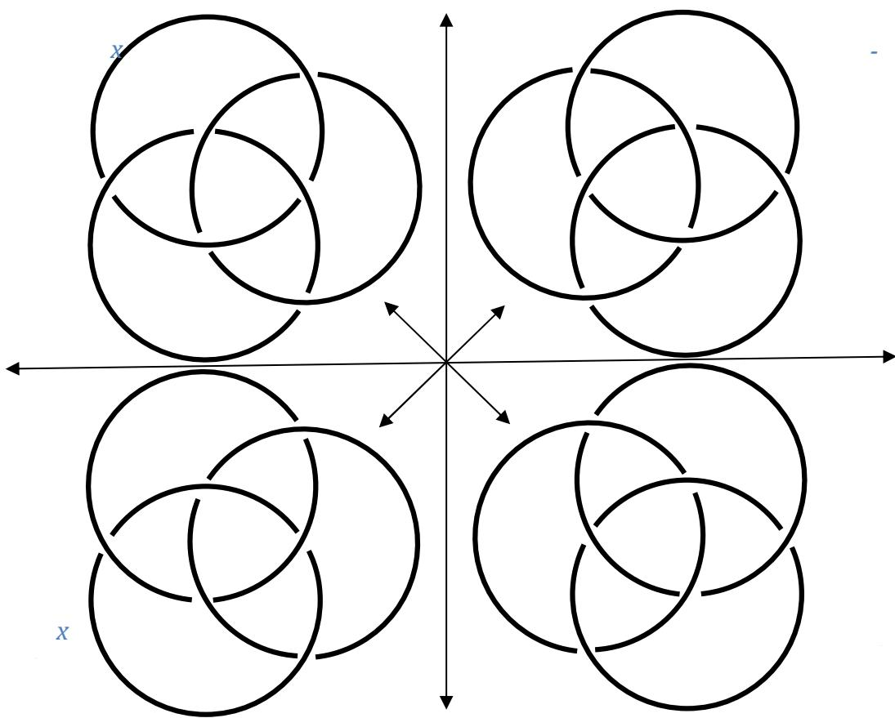

On vérifie qu’en faisant intervenir la dimension y, c'est-à-dire en retournant l’écriture du nœud du haut vers le bas ou inversement le long de cette dimension, on n’obtient pas de coupure : l’écriture d’arrivée est identique à celle de départ.

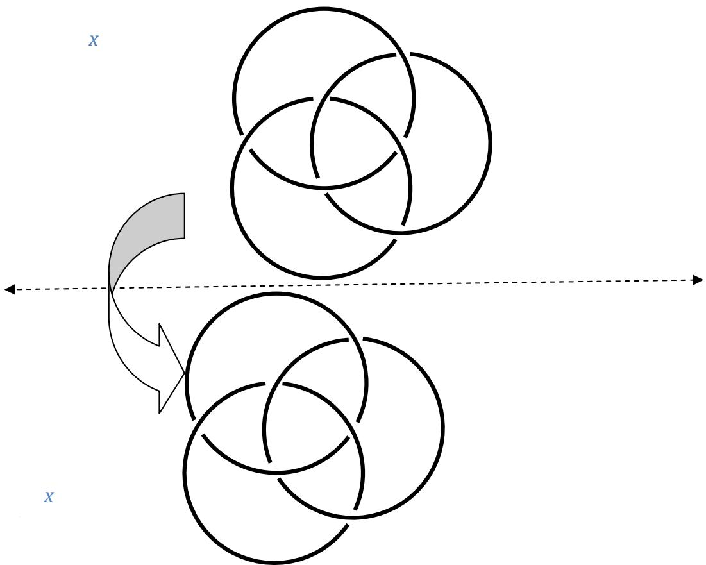

Ainsi dans notre espace virtuel à 4 dimensions engendré par la mise à plat du nœud borroméen, si un espace à 3 dimensions peut en enlever un morceau tout aussi virtuel, il produit une dimension supplémentaire, dedans-dehors représentée ici par la dimension y. Dedans ce jeu de la coupure qui opère les transformations d’une écriture en une autre, la dimension y reste dehors. On voit bien que nous travaillons là dans un espace qui n’a rien à voir avec les dimensions euclidienne de cet espace que nous appelons réalité. Nous travaillons dans un espace que j‘ai dit virtuel, mais qu’on peut tout aussi bien nommer littéral puisqu’il s’appuie sur des différenciations de lettres dans le cadre d’une écriture.

Cet espace là est plus proche de celui que nous travaillons en analyse, dans lequel la règle du jeu « dites ce qui vous passe par la tête » éloigne des contraintes de l’espace dit communément « réalité », corrélé avec les trois dimensions de l’espace euclidien. Cette consigne ordonne une mise à plat de la réalité (au sens plutôt d’une perte de réalité par la perte d’une dimension) qui autorise le repérage dans les mondes symboliques, dont les espaces, même s’ils présentent beaucoup plus de dimensions, sont cependant soumis à des lois, comme on vient de le voir pour l’espace nœud.

Bien entendu on ne travaille ici que sur l’écriture intrinsèque du nœud, sans apport extrinsèque d’une couleur ou d’une lettre (comme R, S, I par exemple) qui ajouterait des dimensions à l’espace de départ considéré. Le réel, le symbolique et l’imaginaire sont bien présents dans ces écritures sans qu’il soit besoin de les y faire venir par des lettres extrinsèques. Le réel est le nœud avant sa mise à plat, l’imaginaire est l’espace à 4 dimensions qui se constitue par la mise à plat, le symbolique est l’espace à trois dimensions qui coupe cet espace obtenu en permettant le repérage des 4 écritures par les coupures jouant sur les dimensions.

On pourrait en déduire après coup que l’espace réel du nœud avant sa mise à plat était un espace à 5 dimensions, car la mise à plat a bien opéré une coupure. Mais nous ne savons pas ce que sont ces 5 dimensions. Pour les connaître, il faudrait opérer une coupure à partir du plongement du nœud dans un espace à 6 dimensions.

## Schéma de la lettre 52, métapsychologie et lettre volée

Nous aurions ainsi une image un peu plus compliquée, mais généralisable de ce qui se passe dans les rapports du réel, de l’imaginaire et du symbolique, au niveau qui nous intéresse, celui des rapports de l‘écriture à la parole :

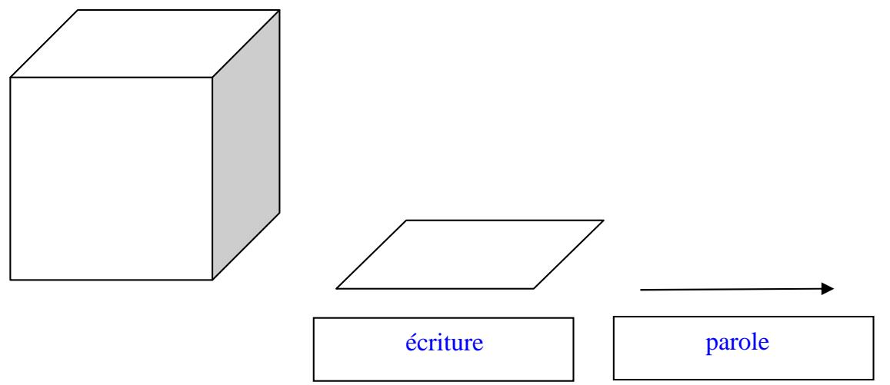

écriture

parole

I II III Percp SP Incs Pcs Csc x x x x x x x x x x x x x x x x

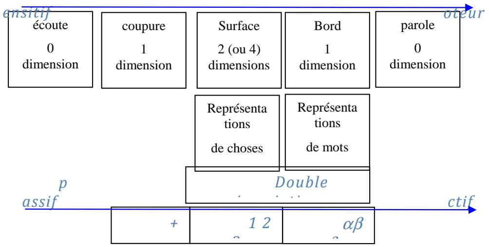

J’ai ajouté en dessous le schéma de la lettre 52 de Freud à Fliess, puis ce à quoi correspondait le schéma du dessus en termes de nombre de dimension. La ligne encore en dessous réfère aux textes de 1915 de Freud sur la métapsychologie : les représentations de choses correspondent à l’écriture, et donc à un espace à deux dimensions, les représentations de mots un espace à une seule dit-mention, ce que Freud avait nommé « la double inscription ». Le passage d’un côté à l‘autre du schéma représente le passage du passif à l’actif, soit la pulsion de mort du fort-da que Freud n’avait certes pas encore inventé à l’époque, mais dont on peut lire le germe par cette présentation. Ce qui explique que je mets la voix et la fonction dans le trou de la bande de Mœbius, c'est-à-dire dans un lieu qui n’a plus de dimension.

Enfin la dernière ligne renvoie à « La Lettre Volée » de Lacan. Je propose de lire les « +-» surgissant au hasard comme les signes de perception de Freud : il y a ou il n’y a pas un son, une lumière, un contact, autrement dit ce que Freud mettait sous le registre de la « quantité » dans « l’Esquisse». Cette quantité est encodée par l’imaginaire qui groupe ces occurrences par trois, ce qui nous donne des groupes de lettres nommées 1,2,3. Elles-mêmes à leur tour encodées par les systèmes des lettres αβγδ. Ceci donne une idée plus précise de ce que j’avais appelé plus haut le tissage d’une surface qui fait bord. Les encodages successifs travaillent comme une navette les fils mis à sa disposition créant par des passages dessus dessous une surface dans laquelle cette troisième dimension devient imperceptible. Elle est perdue au profit de la tapisserie qui, virtuellement, peut reproduire n’importe quel espace, notamment notre espace euclidien en se référant aux lois de la perspective.

Il arrive que certains de ces signes de perception ne soient pas encodés. Ils n’en sont pas moins inscrits dans la mémoire. Alors ils peuvent revenir « dans le réel » sous forme d’hallucination : quelque chose qui est reçu comme une perception parce que ça n’a pas subi l’encodage qui lui donne le label « représentation ». Ce dernier apparaît comme cadre dans un tableau, comme « Montbéliard » dans le rêve raconté en introduction, comme successivement « Argentine » puis « appartement inversé » dans les rêves que nous étudierons plus loin. C’est ce qui fait du rêve un rêve et non un délire. Au niveau de ce cadre ou label la représentation se recoupe elle-même, car elle est en quelque sorte représentation de la représentation, formule à entendre comme un signe indicateur de ce que nous sommes bien dans le cadre d’une représentation et non dans celui d’une perception de la « réalité ».

C’est là où le concept de coupure est fondamental pour la psychanalyse, car il est, dans le mesure où il inclut la question de la recoupe, au fondement du discret, au fondement du trou, au fondement du symbolique. Il s’agit donc de le préciser autant que faire se peut.

Bref tout tient dans ce -1, c'est-à-dire dans le trou, ou, si on en revient au langage, à la négation, dans la mesure où un +1 lui permet de se recouper.

En termes ensemblistes ça ressemble à la problématique de l’ensemble de tous ensembles qui se contiennent eux-mêmes. Le « se contenir soi-même » serait l’équivalent du « se recouper soi-même ». Mais ça reste à démontrer.

Freud avait repéré cette nécessité de la recoupe, non en topologue bien sûr, mais en physiologiste, en indiquant au lecteur qu’il fallait faire se rejoindre les deux extrémités de son schéma, rendant équivalentes la perception et la conscience. Il l’avait fait également lors de la reprise de ce schéma dans le chapitre 7 de « L’interprétation des rêves » Le dispositif analytique est particulièrement conçu pour cela, puisqu’il s’agit de permettre à l’analysant d’entendre (sensitif, passif) ce qu’il dit (moteur, actif). Ceci transforme le schéma linéaire en une bande de Mœbius. Car il faut tenir compte aussi de ceci que nous entrons dans ce domaine du langage par la porte de la castration qui est admise tout en étant dénié, ce qu’on représente par une coupure qui est aussi surface : n = n-1. L’entrée dans la parole se paye donc d’une écriture : le symptôme, et tous les ratages de la coupure que l’on peut écrire par les figures asphériques de la topologie et par le point de vue asphérique porté sur les figures sphériques.

La troisième dimension perdue dans l’opération de mise à plat peut être admise comme la représentation du phallus. L’opération elle-même peut se lire comme l’équivalent de la castration : par le langage, on perd la dimension du réel (3D) pour entrer dans le monde de la réalité, imaginaire et symbolique. On pourrait dire encore qu’on sort du monde de la castration réelle (la coupure d’un rond) pour entrer dans un mode de dénégation qui écrit l’imaginaire de cette opération par des conventions symboliques. Mais par la voix s’opère un retour à la 3D que l’on symbolise par la coupure que représente cette seule troisième ditmention, la perte d’une dimension supplémentaire. C’est l’usage de cette coupure qui va permettre les inscriptions de représentations de choses liées à des représentations de mots, ce que Freud a défini comme étant la conscience.

Perte d’une dimension une fois, de 3 à 2, puis perte d’une autre, de 2 à 1, c’est à la fois la mise en œuvre de la même fonction, qu‘on peut noter f , et pourtant ce n’est pas la même puisqu’elle se présente sous deux modalités qu’il me semble avoir été repérées par Lacan dans son schéma R sous la forme de Φ et P.

Au terme de ce parcours, nous aurions donc repéré trois définitions de l’articulation de Φ et P :

\- Recoupe de n+1(P) coupures à n-1(Φ) dimensions

\- pertes successives de deux dimensions, coupure Φ du réel à l’imaginaire de l’inconscient fait de représentations de choses seules, puis coupure P des représentations de choses aux représentations de mots.

\- Fonction de fonction : P -P (A/Φ), formule de la métaphore paternelle se présentant comme la reprise par la fonction P de la fonction Φ en tant qu’elle divise la fonction langagière A. Il est notable que, dans le graphe, les fonctions P et Φ ont disparu au profit respectivement de S(A) et A. Dans le mouvement du graphe, S(A) se présente bien comme la reprise à un niveau supérieur de ce qui a été opéré au niveau inférieur, permettant d’achever une coupure dont le produit est d’une part le signifié, s (A) et plus largement, le moi, m.

\- convergence d’une suite et invention d’un espace imaginaire.

Faisons à présent un retour à la pratique de la psychanalyse, pour voir si cette théorisation y trouvera à se faire contester.

## Rêves « topologiques » et représentant de la représentation

En Argentine, Renault ou Peugeot a construit tout un front de mer avec des studios à vendre ou à louer ; mais à présent c’est une ruine moderne. On peut faire tout le front de mer en passant de balcon à balcon, car à l’intérieur il y a trop d’effondrements ; ça devient un truc de touristes sportifs. Je commence par le 2 le 1 ayant le balcon détruit. Puis je m’enfonce à l’intérieur dans un dédale de pièces jonchées de détritus et débris. Un seul appart est intact. J’y entre. Il est déjà squatté, par plein de gens qui dorment. Je ne veux pas les réveiller. Je bats en retraite.

A ce moment, intervention de la marine qui en une seule sommation demande à tout le monde de quitter les lieux. Elle ponctue aussitôt d’un coup de canon qui détruit un premier balcon. Puis les soldats investissent les ruines ; je monte me réfugier dans les étages supérieurs, cherchant un endroit pour me cacher. J’en trouve pas. Chaque fois que je crois trouver une série de placards, il s’agit d’une série d’urinoirs. On ne peut pas refermer (comme si il manquait la porte). J’arrive à la dernière pièce, tout en haut près du plafond. J’entends les soldats tout près. Peut-être arriverais-je à me cacher en hauteur si je parviens à me hisser grâce à des éléments de charpente, poutrelles et tuyaux qui passent en hauteur sous le toit. Si j’arrive à me coincer dans cet au-dessus ils ne penseront peut-être pas à regarder en l’air. Réveil

Il y a des balcons cassés, la marine en casse un avec son gros canon phallique : c’est bien des sexes dont il est encore question. Et de l’angoisse de castration ; l’intérieur, c’est ma mémoire jonchée de vestiges du passé, donc de détritus et de gravas provenant d’aspects de mon moi effondrés. Je ne veux pas réveiller des gens qui dorment, autrement dit c’est moi que je ne veux pas réveiller avec ces vestiges. Le rêve tient bien son rôle de gardien du sommeil. Je cherche à me cacher des soldats c'est-à-dire de la castration qui menace (ils sont avec la marine qui a fait parler son canon en détruisant un balcon). Je ne trouve que des placards qui font penser à des rangées d’urinoirs : oui, je suis voué à cette condition masculine qui m’oblige à ne pas m’enfermer pour aller pisser et donc à exhiber mon organe au vu et à la menace des autres. A moins de se réfugier dans une sorte de position acrobatique, pendu au toit, en espérant ne pas être vu. Pendu au toi ? Appendu à l’autre, à la mère dans une position régressive fœtale, oui, sans doute. Ne pas être né en quelque sorte, meilleure des solutions pour échapper à la castration ; je sens bien que ça va pas marcher et le réveil est indispensable.

Je commence par le 2, le 1 étant détruit : c'est comme si j'arpentais une chaîne signifiante élémentaire faite de + (balcon) et de - (balcon détruit). Pour être correct, je devrais plutôt dire que j'arpente une chaîne de signes de perception (SP, voir lettre 52) dans l'espoir de l'encoder en représentations de choses. Il n'y a pas de signifiant dans un rêve, puisque personne ne parle. Il y a des lettres (représentations de choses) et des signes de perception (choses qui se refusent à la représentation). C'est tout à fait comme les traits sur l'os magdalénien, finalement, mais ça nous renvoie au fondement de la représentation qui est sexuel : il y a, il n'y a pas; alors que dans la suite des encoches c'est toujours : il y a, sachant que le "il n'y a pas" est quand même nécessaire pour distinguer un 1 d'un autre 1, soit une zéro inscription entre les inscriptions, soit l'inscription du support de la lettre comme lettre, ce qui renvoie au bord de la feuille de papier dont j'ai déjà parlé, et à mon départ qui tient compte de ce que le 1 est détruit. Ce 1 détruit renvoie en effet au zéro de Frege (dont je dirais un mot plus loin), qui, en tant que lettre, compte néanmoins pour un, même si ce 1 ne compte pas en tant que concept. Ce qui fait que, comme très bien dit dans mon rêve, le nombre 1 se trouve en fait le deuxième dans la suite des nombres. J’y reviendrai plus loin.

L’allusion à l’Argentine vient du film « XXY » vu il y a peu, où il est question d’un enfant né(e) avec les deux sexes. Ce pays tient ici le même rôle que « Montbéliard » dans le rêve qui ouvrait cet essai, celui ne toile de fond non dite, ni même représentée en image ou de quelque façon que ce soit, tel un savoir diffus imprégnant tout le rêve. J’ai beau savoir très raisonnablement que non, je ne suis pas menacé par la castration (dans le film, elle l’est réellement puisqu’il est question de l’opérer pour en faire définitivement une fille), le moindre élément de la vie quotidienne, un film, me le rappelle. L’idée de passer de balcon en balcon est une façon d’anticiper sur la « pendaison » finale, celle de se retrouver en position de phallus de la mère, appendice sur une surface verticale tenant comme un corps debout, ultime avatar de la crainte de tomber qui est la castration dans l’être, relayant à ce niveau la castration dans l’avoir.

Le canon est dans la mer, c'est-à-dire dans la mère : c’est la mère phallique qui est menaçante. Enfant, je la vivais comme toute puissante. Impossible d’échapper à son regard surtout à son regard sur mon sexe, ce qui devait renvoyer à mon regard sur le sien : la comparaison ne pouvait que me mettre en angoisse, d’où le déni de la castration et l’imaginaire d’une mère pourvue d’un canon menaçant. C’est à la fois une mesure de protection, un refoulement : non, elle n’est pas castrée, donc je ne peux pas l’être, et un retour du refoulé : c’est ce canon lui-même qui rappelle la menace.

Le film XXY me paraît une mise en scène du fantasme de la réalisatrice, de sa propre envie de phallus. Et elle m’a touchée autant qu’elle l’est, en ce lieu de l’angoisse de castration. A la fin du film, non, elle ne sera pas opérée, elle choisit d’être un garçon.

La linéarité du trajet des balcons, semblable à la suite des + et – de Lacan s’impose comme la dimension directrice de ce rêve. J’ai l’intention de la suivre sans m’en écarter pour éviter la surface, c'est-à-dire la mémoire, ou des vestiges de mémoire. Comme je l’ai déjà écrit, la mémoire suppose l’écriture, et donc les deux dimensions d’une surface. La menace de castration m’oblige donc de me confronter à cet encodage en deux dimensions. Apparemment la même problématique se développe là (du détruit au sein de l‘intact) avec pour seule différence cette prise d’une dimension supplémentaire. Pourtant je me refuse toujours à y lire quelque chose de plus puisque la menace me poursuit jusqu’au fin fond de cette surface, au point que je tente le salut dans une troisième dimension, jusqu’à me confondre avec elle. Le salut se trouverait en effet dans cette troisième dit-mention de la parole, dont on voit bien ici qu’elle se distingue de la dimension linéaire des signes de perception. Si cette dernière est x, la surface du bâtiment y ajoute un y, et c’est vers le z de l’énonciation que je souhaite me réfugier. C’est un échec car dans le rêve, toute énonciation est impossible. Comme tel, le rêve aboutit à une impasse que je lève ici en en parlant.

La notation « je ne peux pas fermer » à propos des urinoirs renvoie précisément à ma conjecture sur la coupure qui doit se recouper, c'est-à-dire se fermer afin de découper un morceau d’espace. En l’occurrence, pour couper une surface, il faut une ligne qui repasse sur elle-même, inaugurant en ce point de recoupe la troisième dimension : elle est passée là une première fois, donc à la seconde, elle repasse dessus. C’est peu avant de trouver ces placardsurinoirs impossible à fermer que j’ai commencé à chercher refuge dans les étages. Les gravats indices de destruction que je rencontre sont en cohérence avec cette logique : je ne parviens pas à fermer une représentation d cette menace de castration. Pourtant la marine avec son canon ? Les balcons détruits ? Oui, mais justement je fuis ces représentations, je pourrais même dire, je les détruis dans l’espace mémoire, puisque je reste quand même le metteur en scène et le décorateur de mon film, incapable cependant de détruire les signes de perception qui restent gravés en forme de + et de -, balcon et pas balcon, en reproduisant cette configuration dans l’espace mémoire, destructions et appartement intact. Seuls les urinoirs très rapidement entrevus pourraient parvenir à publier une représentation qui me mettrait sur la piste de ce dont il s’agit. Hélas, je ne peux les fermer, je ne peux recouper cette image de son environnement menaçant, ce qui m’aurait permis de la nouer, ou de la référencer à d’autres représentations moins menaçantes en établissant une signification.

Et c’est bien la troisième dit-mention en tant qu’énonciation de la parole qui va, seule, permettre cette recoupe.

Reste un mystère pour moi : l’allusion à « Renault ou Peugeot » qui auraient été les promoteurs de ce front de mer. En écrivant cela, je pense aux nombreux accidents qui me sont arrivés à l’époque de ma Peugeot 205… si l’idée m’est venue, c’est qu’elle est bonne. Va pour les accidents… tiens, oui, j’avais aussi réussi à mettre la Renault 16 de mon père sur le toit. Ces accidents sont donc des métaphores de la castration et comme tout traumatisme, ils cherchent à trouver une issue sous forme de représentation. Ils sont donc bien en tant que fonction de représentation, les promoteurs du rêve, absent du rêve comme toute fonction des objets qu’elle produit, une façon de nommer la fonction qui va encore échouer à produire ce pourquoi elle se met en mouvement. De là à dire que ces nombreux accidents, tous dus à mon imprudence, étaient peut-être déjà la mise en œuvre de la machine à représentation de la castration qui ne cesse pas d’échouer à se représenter elle-même…

C’est sûr, il vaut mieux rêver. Ça échoue pareil, mais c’est beaucoup moins dangereux.

Je suis au lit dans mon appart de Besançon, sauf que l’appart est celui de la porte en face. Et c’est comme ça que j’écoute Marianne qui est derrière moi. Elle est habillée d’une courte robe rouge portée sur des collants bleus épais. A un moment, exaspérée, elle se précipite vers la fenêtre et l’ouvre. Elle commence à lever un genou pour sauter dans le vide, mais je l’arrête avant ; je la prends par les épaules et je la ramène vers le lit avec des paroles de consolation. On a eu un échange verbal, mais je ne m’en souviens pas. Déjà, au réveil, je me rappelais des parole mais c’est comme si je me rappelais pas le sens ; oui, c’est parce que ça ne faisait pas sens que je les ai oubliées ; ça me paraissait des propos anodins.

Marianne n’est pas suicidaire. Pourtant, la veille au soir j’avais tenté de parler à un autre analysant, Laurent, que je n’avais pas vu depuis quelques temps. Il était à l’hôpital suite aux coups de couteaux qu’il s’était envoyés dans le ventre. Une infirmière m’avait annoncé l’événement en le présentant sous la forme d’une tentative de suicide. Elle avait ajouté que ce n’était pas grave, il devait sortir de l’hôpital sous une semaine. Je l’avais aussitôt interprété en moi même comme une castration avec déplacement et non comme une TS. J’avais en effet suffisamment entendu Laurent énoncer son souhait d’en arriver à se castrer, en raison de son incommensurable sentiment de culpabilité par rapport à ses idées sexuelles. Chaque pensée sexuelle, disait-il, était une offense à Jésus.

Le sexuel est loin d’être aussi banalisé qu’on le dit. Il y a des gens qui en parlent, d’autres pas. Lorsqu’on n’en parle pas, c’est en raison du sentiment de culpabilité qui opère son travail de censure. Lorsqu’on en parle, sauf à s’en dédouaner en parlant de la sexualité des autres ou de la sexualité en général, c’est rarement sans l’accompagner de quelque gène, Laurent présentant une extrémité de ce registre. A l’inverse, je me faisais cette réflexion il y a peu, que Marianne avait eu un mal fou à apporter la moindre référence sexuelle en 7 ans d’analyse.

Le rêve écrit donc dans son contenu latent la même lettre que ce que son support présente de si manifeste que c’en devient un pur élément de décor, apparemment sans grand intérêt, comme les balcons du rêve précédent ou la situation de Montbéliard au début de cet essai. Le lieu du rêve est un appartement inversé par rapport à celui que j‘occupais jadis. Précisons : les portes des appartements que j’occupais dans la réalité et dans le rêve se faisaient face. Donc pour entrer dans la chambre à partir de la porte du premier il fallait tourner à droite, tandis qu’à partir d celle du second il faut tourner à gauche. Par conséquent l’un est situé exactement en miroir de l’autre, car deux dimensions sur trois sont inversées, droite-gauche et devant-derrière.

Tout se passe comme si cette topologie inverse venait introduire l’inversion entre Marianne et Laurent, l’un qui parle de sexualité avec un sentiment de culpabilité maximum, l’autre dont le même sentiment, vraisemblablement, éteint toute parole à ce sujet. Marianne n’est pas suicidaire ai-je dit, et son geste vers la fenêtre serait donc encore une façon de condenser sur elle le geste de Laurent.

Cependant Marianne n’a cessé de revenir, durant toute son analyse sur un incident cuisant de sa petite enfance. En vacances en Italie avec ses parents, et alors que ceux-ci sont attablés à la terrasse d’un café, un jeu s’organise entre son frère et sa sœur. D’une rue fortement en pente qui débouche sur la terrasse du café, sa grande sœur se jette dans le vide, mais est rattrapée par les solides bras du grand frère. Ça rit beaucoup, et la sœur ne cesse de remonter pour se jeter à nouveau. Se sentant exclue, Marianne, au comble du dépit amoureux, monte aussi sur le parapet, et avertit le monde qu’elle va sauter aussi. Personne ne semble l’entendre. Pensant que son frère va quand même l’accueillir dans ses bras, elle saute quand même et se fracasse la tête sur le trottoir. Elle s’est profondément ouvert le cuir chevelu. Ça saigne beaucoup et sa mère, au lieu de compatir, l’engueule. Elle l’emmène néanmoins à l’hôpital, mais demande au médecin de la recoudre sans l’anesthésier, afin que ça lui serve de leçon.

Voilà une version du saut dans le vide nettement moins suicidaire, bien qu’imprudente au plan de la réalité. Elle rejoint quelque part l’hypothèse au sujet des coups de couteaux de Laurent. Puisqu’il y avait rires et plaisir partagé entre le frère et la sœur de Marianne, ce saut avait bien plutôt une coloration libidinale. J’ai donc pensé quelque chose de similaire à l’égard de Laurent. A sa castration déplacée vers le haut, castration au niveau d’avoir le phallus, répond dans mon idée une castration chez Marianne, au niveau de l’être.

Lorsque je la ramène au lit, il s’agit moins d’un désir de coucher avec elle que de retourner au divan et à ce qu’elle devrait parler, selon moi : qu’enfin elle accepte de mettre le sexuel en jeu dans le transfert. Elle est très affable, très contrôlée en séance et pourtant elle me parle des colères effroyables qu’elle pique à la maison contre son mari et ses enfants : j’ai l’impression qu’il y a en elle une violence inouïe, qui donc pourrait se retourner contre elle, comme chez Laurent, comme ça a pu lui arriver dans sa petite enfance, même si ça ne prend pas les formes d’une tentative de suicide.

Evidemment, ce n’est pas ce rêve qui va m’amener à lui dire : « attention aux fenêtres, on risque d’en enjamber le bord », injonction qui a été traduite en images dans mon rêve et dans laquelle on reconnaît sous forme de contenu ce que la forme disait en manière de cadre. En effet, en proposant un lieu en miroir inversant deux dimensions sur trois, le cadre met en évidence, mais par la négative, le fait que la troisième dimension n’est pas inversée. Le contenu, par la tentative de défénestration, indique ce qui risque de déborder du cadre en franchissant cette limite qui va abolir dans un réel imaginaire la troisième dimension que le rêve, comme toute écriture, avait déjà abolie pour se manifester.

Si l’inversion affecte deux dimensions de l’espace euclidien, nous avons vu déjà qu’elle concernait aussi l’attitude quant au sexuel, recouvrant les positions de Laurent et de Marianne. Elle atteint enfin les places de l’analysant et de l’analyste, puisque je me retrouve en position d’analysant, « au lit » et elle d’analyste derrière moi, bien que ce soit moi qui l’écoute. Si les choses sont relativement simples en ce qui concerne les inversions de dimensions dans l’espace euclidien, l’affaire est un peu plus compliquée dès qu’on aborde les autres types de dimension. Tout se passe comme si la mise à plat opérée par le rêve, comme celle du nœud borroméen, ouvrait un espace virtuel muni d’un certain nombre de dimensions supplémentaires. Outre la dimension x et y, il y a ici la dimension z avec le phallus, la dimension analysant-analyste, la dimension libidinale avec son inversion actif-passif qui est déjà représentée au sein la dimension analysant-analyste.

Une dimension, elle est ou elle n’est pas et ensuite elle a un sens ou l’autre sens. Cet autre sens peut être l’avoir ou pas. La condensation est un développement de la dimension z la métonymie un développement de la dimension x.

Je ne prétends pas du tout à l’exactitude de ces hypothèses, pour l’instant encore un peu embrouillées. Je tiens simplement à repérer que : il est vrai qu’elles se sont formulées chez moi. L’une, consciemment à propos de Laurent, l’autre, inconsciemment à l’égard de Marianne. Cette réserve me ramène à mon point de vue de rêveur, le seul à être valable en matière d’interprétation des rêves. Sachant que je suis le metteur en scène, tout se passe comme si je voulais jeter Marianne par la fenêtre et, par conséquent, Laurent avec. Mais, en même temps je ne le veux pas, puisque je l’en empêche. La seconde motion est plus proche de la conscience, puisque l’inconscient n’hésite pas à me l’attribuer. La première est au contraire très refoulée, puisque je la confie à une supposée volonté de destruction de l’autre. Cependant derrière cette agressivité personnelle camouflée en suicide de l’autre se cache aussi la véritable auto agression de Laurent. L’image de Marianne se jetant satisfait donc d’une part, à un désir ambigu de me débarrasser d’une analysante qui, selon moi, n’arrive pas à parler de sexualité, d’autre part à la pulsion de mort qui tente de trouver représentation pour un acte que j’ai du mal à me représenter.

Or cet acte est bien en rapport avec la sexualité, puisque la caractéristique de Laurent, c’est d’en parler beaucoup sous le mode de la culpabilité. Ayant finalement réussi à le joindre au téléphone à l’Hôpital psychiatrique où il a aboutit après l’hôpital général, je lui ai demandé les raisons de son acte. Il m’a répondu que c’était parce qu’il avait fait un enfant en 98, et qu’il n’avait pas voulu le reconnaître. Il n’aimait pas sa mère, disait-il. Dieu m’a puni, ajoutet-il, parce que je n’ai pas voulu reconnaître cet enfant. Il m’a donné ma maladie depuis ce jour. Quelle maladie ? La phobie des autres et du sexe. Pourquoi avoir choisi cette modalité des coups de couteau dans le ventre ? J’ai vu ça à la télé, les japonais qui se faisaient ça, je croyais que c’était radical. Mais vous avez sûrement vu bien d’autres modes de suicide à la télé, pourquoi avoir retenu celui-là particulièrement ? Là, il ne sait pas.

Je pense intérieurement, cette fois, non plus à une castration mais à une tentative d’avortement. Il est fort probable que ce ne soit pas ça. La représentation « castration » qui m’est venue, puis « avortement », ne sont, avec le rêve lui-même, que des moyens de tenter d’apprivoiser un irreprésentable. J’essaie de tirer la signification de ce geste du côté du sexuel, c'est-à-dire du côté de la vie, parce que la mort reste l’irreprésentable comme tel. Il est fort probable que ce ne soit que résistance de ma part à entendre quelque chose de l’ordre de la violence définitive.

Mais cela ramène notre perspective à celle des rêves précédents : ce qui en fait la toile de fond, c’est bien l’affaire de la castration, sur laquelle tout le reste s’inscrit. En l’occurrence, puisque deux dimensions sur trois sont déjà inversées, la Marianne que j’anime dans mon rêve est sur le point d’inverser la troisième dimension, celle qui prenait la forme de la saucisse de Montbéliard une fois et des balcons cassés l’autre fois. L’être et l’avoir, on l’a vu, sont présents dans chacun de ces rêves.

Cette notation de lieu inversé tient ici le même rôle que « Montbéliard » dans le premier rêve, et que « l’Argentine » dans le second. Dans ces trois rêves, il y a quelque chose de commun dans la mise en scène, c'est-à-dire la construction du cadre, de la toile de fond. Comme dans la rêve « Montbéliard », il y comme un « label », un indicateur dénotant le lieu, ce label mettant le lieu même en abîme en écrivant finalement la même chose que ce qui est écrit dans le contenu rêve.

Dans le rêve du littoral argentin, c’est le décor lui même en tant qu’il représente une chaîne littérale (en lacanien orthodoxe on dirait : une chaîne signifiante). Cette chaîne n’est pas autre chose que l’élémentaire de la perception dans la mesure où celle-ci laisse une trace : il y a ou il n’y a pas une trace, un effet durable de l’extérieur sur l’intérieur. Et tout ce passe comme si cet élémentaire de la perception et de la mise en mémoire ne pouvait fonctionner que dans un rapport à la castration. Il y a une logique à cela : la trace imposée par la perception de l’objet suppose néanmoins la perte de l’objet comme tel au profit de la trace, c'est-à-dire d’une représentation. Ou plus exactement, au profit d’une trace qui se laisse immédiatement encoder dans les termes de la castration.

Nous sommes en présence de trois façons de délimiter le lieu, le cadre du rêve, comme un cadre délimite un tableau tel un panneau indicateur signalant : attention, à partir de cette limite, nous sommes dans une représentation ! Dans le célèbre tableau de Magritte « Ceci n’est pas une pipe (ou une pomme) », ce panneau est explicite : en effet, ce n’est pas une pipe puisque ce n’en est que la représentation, ayant perdu sa troisième dimension. Et du coup, ce panneau étant fait seulement pour signaler la représentation, on en oublie qu’il peut aussi avoir une signification, celle que suppose la représentation comme telle, c'est-à-dire la castration. Cependant, on peut lire dans cette double fonction une évocation de la « trouvaille » que Lacan a pensé faire en lisant le mot « Vorstellungsrepräsentanz » dans Freud. Il nous dit y lire un « représentant de la représentation » correspondant à ce que je viens de décrire du cadre des rêves et des tableaux. A bien relire Freud dans le texte allemand, je ne crois pas qu’on puisse accorder à Lacan ce crédit là8. Le contexte du mot en effet est celui-ci : Freud explique qu’il y a deux représentants de la pulsion dans le psychique : l’affect et la représentation comme telle, qu’il précise entre parenthèse : représentant-représentation, sachant que l’autre est le représentant affect. Néanmoins ce que je découvre dans mes rêves en leur accordant la même confiance que Freud accordait aux siens, il me semble découvrir en effet ce « représentant de la représentation » qui peut se distinguer du représentantreprésentation que Freud évoquait par son « Vorstellungsrepräsentanz ».

## Le zéro comme représentant de la représentation

Dans ses « Fondements de l’arithmétique9 », Frege établit une correspondance biunivoque entre un ensemble F définit par un concept qualitatif et un ensemble f qui reprend les éléments du premier ensemble sous le mode quantitatif. Il donne l’exemple des lunes de Jupiter : en tant que concept « lune de Jupiter », elles appartiennent à cet ensemble F des corps célestes tournant autour de la planète géante. Il y en 4, ce qui suppose 4 « traces » c'està-dire, 4 « éléments un » dans l’ensemble f. Je considère ces 4 traces comme les « signes de perception » de Freud. En tant que traces et éléments de l’ensemble f, elles tombent sous le concept de « un », puis elles sont « encodées » à la manière des « 1,2,3 » de la lettre volée de Lacan, et ainsi tombent sous le concept de « lune de Jupiter ». Cet encodage suppose la liaison avec bien d’autres références que le concept de « un », qui, lui, n’a d’autre référence que ne de n’être pas le zéro. La référence du mot « lune » fait référence à la lune de la terre, et plus largement au concept d’objet en orbite autour d’un corps céleste plus vaste. Et Jupiter fait référence d’une part à la planète, mais aussi au dieu des dieux, à la puissance comme telle, bref, au maître du verbe, au forgeron de tous les concepts. Même si Frege ne fait pas allusion à ces significations connexes, elles nous sont indispensables pour comprendre ce qu’il dit dans son exemple. Un minimum de connaissances astronomiques nous est nécessaire, d’une part pour repérer Jupiter dans l’espace, et d’autre part en quoi le mot « lune » peut se référer à une telle planète. Si nous ne savions pas ce qu’il signifie, c'est-à-dire si nous n’apportions pas notre savoir comme contexte, son exemple ne porterait pas, car dépourvu de sens.

J’y ajoute les connaissances mythologiques par lesquelles le signifiant « Jupiter » se décolle de la planète pour retourner à son origine au Panthéon grec, et je les dévoie par une référence supplémentaire au champ lacanien. Ces multiples champs de références tissent un réseau assez semblable à celui « 123 » ainsi qu’à celui des « αβγδ», ce dernier étant un encodage de l’encodage précédent, un peu à la manière dont une référence supplémentaire, par exemple ici, mythologique, vient injecter une signification supplémentaire qui n’était pas dans le champ de départ.

D’un autre côté, les éléments « un » de l’ensemble f sont encodés dans le champ arithmétique sous un concept supplémentaire représenté par la lettre « 4 ». Je l’appelle lettre, car c’est une marque écrite conventionnelle se démarquant de la trace laissée par 4 « un ». L’ensemble « 4 » comme tel peut alors être encodé plus avant en de multiples opérations définies par l’arithmétique, sans plus de liens avec l’astronomie et le concept « lune de Jupiter ». C’est un autre réseau que celui constitué par le nouage des champs astronomiques, mythologiques, lacaniens, mais c’est un réseau également.

Frege posait aussi la question du concept de « zéro » ; aucun élément n’est censé tomber sous ce concept, qualifié dès lors de « non-identique à soi ». Or c’est bien le problème du féminin, chaque « balcon » tombant sous le concept de « un » en tant qu’ensemble f et sous le concept de phallus en tant qu’ensemble F. Mais chaque « balcon détruit », sous quel concept tombe-t-il ? L’inconscient est obligé d’inventer un concept de négation sous la forme de la destruction par le canon de la mer. Le balcon détruit, c’est ce qui n’est pas le balcon intact. Sous cette problématique encodée en termes de castration se joue celle de toute lettre, et, partant, de tout signifiant : dès qu’on compte, au niveau le plus élémentaire, entre 0 et 1, il y a disjonction entre les ensembles f et F. Le « un » du compte n’est pas le « un » du concept qualitatif, ni même celui de la lettre arithmétique « 4 », ou plus largement « n ». Ici il faut faire intervenir un ensemble supplémentaire que Frege n’a pas cru nécessaire d’instituer. Car si le nombre se distingue de l’objet compté, il peut s’écrire comme sur l’os magdalénien d’une succession de traits qui sont autant de « un ». Le nombre se décale de la Chose comptée, mais la lettre arithmétique « 4 » ou « n » se sépare du « un » gravé par un trait. Le trait opère bien une correspondance biunivoque entre les choses comptées et les uns du compte, mais il a fallu faire un saut supplémentaire, arbitraire, pour représenter encore un ensemble de traits par un seul nombre. il a fallu faire appel à un troisième ensemble que je n’hésiterai pas à nommer Φ, celui des entiers naturels en tant qu’ils ne représentent ni la chose comptée, ni les traits qui les comptent. la correspondance cesse d’être biunivoque : 4 choses (ensemble F, perception) deviennent 4 traits (ensemble f, signes de perception) mais un seul nombre, « 4 » (ensemble Φ, représentation, de chose lorsqu’on l’écrit « 4 », de mot lorsqu’on prononce « quatre »).

Il a fallu faire tonner le canon, cette autre sorte de « un » fonctionnel, qui, par la destruction, autorise le compte et sa prise en compte par les lettres de l’arithmétique. Il a fallu d’un autre côté le nouage de cet « un » avec de multiples références qualitatives pour faire disparaître l’irreprésentable de la négation sous les voiles de la connaissance.

Dans le genre humain le sexe se présente aussi comme un concept non identique à soi : le phallus n’est pas identique sur tous les corps qu’il est donné à voir. Sur la moitié d’entre eux il n’est pas là, ce qui compte fondamentalement pour son existence. Il n’acquiert une telle valeur que du fait de cette apparition-disparition et non d’une quelconque essence masculine.

## Topologie des pulsions

Il se trouve que Freud présentait la pulsion comme quelque chose de pas très éloigné de la dimension. Les avatars de la pulsion peuvent se lire comme autant de pôles ouvrant des dimensions différentes :

La Verkehrung ins Gegenteil, inversion dans le contraire ouvre la dimension comprise entre l’actif et le passif, le réflexif se posant comme une combinatoire des deux.

La Verwandlung, transformation du contenu, opère la coupure entre amour et haine.

Enfin la Wendung gegen due eigene Person, retournement sur la personne propre s’établit entre les pôles du sujet et de l’autre.

Puis, constatant que certaines de ces polarités se recoupent (sic !) Freud finit par proposer de nommer ainsi les trois grandes polarités de la vie psychique10 :

L’activité-passivité comme polarité biologique

Le moi-monde extérieur comme polarité réelle (reale)

Le plaisir-déplaisir comme polarité économique.

Bien entendu, même différenciée ainsi, elles se recoupent, découpant une espace psychique à trois dimensions, auxquelles nous pourrions bien ajouter la polarité amour-haine que Freud pensait éliminer de cette dernière présentation étant donné qu’elle pouvait se réduire à aimer-être aimé, ce qui revenait selon lui à l’activité-passivité. Ici les idéologies numériques de chacun peuvent jouer quant au choix à opérer. Le trois s’accorde à bien des questions posées au fondement des mathématiques et de certaines religions. Le quatre correspond exactement à l’espace ouvert par a mise à plat du nœud borroméen. Après tout peu importe ; il s’agit simplement de constater cette occurrence d’oppositions fonctionnant comme des dimensions qui se recoupent, isolant un morceau d’espace. On peut donc, si on en pince pour le trois, se référer au modèle des trois coupures nécessaires à enlever un morceau au plan, ou si on préfère le quatre, s’appuyer sur le modèle des quatre polarités du nœud borroméen.

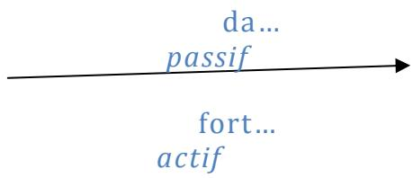

Il est intéressant de constater que chacune des polarités de Freud renvoie à la coupure moi-monde extérieur. Si je suis actif ou passif, c’est bien dans un rapport à l’autre : je regarde ou je suis regardé je bats ou je suis battu. La polarité plaisir-déplaisir me sert de guide par rapport à l’extérieur : je veux mettre dedans ce qui me fait plaisir rejeter dehors ce qui me procure du déplaisir. Enfin, si j’aime, j’ai envie d’absorber l’objet aimé parce qu’il me fait plaisir, si je le hais, je veux le rejeter pour éviter le déplaisir qu’il me cause.

On peut encore faire figurer ces polarités d’une manière plus abstraite par les 4 dimensions de l’espace nœud :

x, -x : activité-passivité

z, -z : plaisir-déplaisir

g, -g : amour-haine

\- y, -y : moi-monde extérieur

Les diverses modalités de retournement de l’écriture du nœud donnent alors une bonne écriture des avatars de la pulsion.

Comment pourrait-on figurer encore autrement cette topologie des pulsions ? Si je m’en tiens à la définition que j‘avais donnée d’une tension entre deux pôles, je constate que c’est justement ce retour aux concepts freudiens qui m’amène à utiliser ce terme de tension comme s’il s’agissait d’une différence de potentiel entre les pôles d’une batterie, ce qui nous ramène aussi aux + et – de la « Lettre Volée ». Il s’agit de la batterie signifiante, à n’en pas douter. Celle-ci s’organise autour de ce minimum dégagé par Freud dans le jeu des enfants : fort-da. Comment topologiquement l’écrire ? Le recours à la topologie semble ici particulièrement justifié puisqu’il s’agit de creuser l’écart entre deux lieux élémentaires, loin et près, dans lesquels je n’hésite pas à reconnaître l’opposition élaborée par Freud 10 ans plus tôt entre le moi et le monde extérieur. En jetant un objet au loin, l’enfant ne fait pas que jeter sa mère, il la renvoie afin de s’assurer de la maîtrise de son geste. Ce n’est pas lui qui est abandonné, c’est lui qui jette. Il devient quelqu’un en se séparant, et en choisissant de se séparer au lieu de subir : déjà, Wo Es war soll Ich werden, là où ça était je dois advenir. Sous le registre de la pulsion de mort se cache donc, non seulement l’avatar de la pulsion qui inverse le passif en actif, mais aussi le symbolique, c'est-à-dire la distinction élémentaire des deux phonèmes O pour fort et A pour da. Le Un s’engendre du deux dans la mesure où l’enfant institue en trois un vide entre les deux (on verra plus loin le rapport de ceci avec la théorie du zéro de Frege). Ceci se supporte parfaitement d’une inscription linéaire de la même façon que toute parole se laisse représenter sur la ligne du temps, ainsi que le proposait Saussure. Mais faut-il imaginer un espace à deux dimensions que cette ligne découperait en deux pôles ?

…ce qui nous donnerait ceci, comme élémentaire découpe d’un morceau :

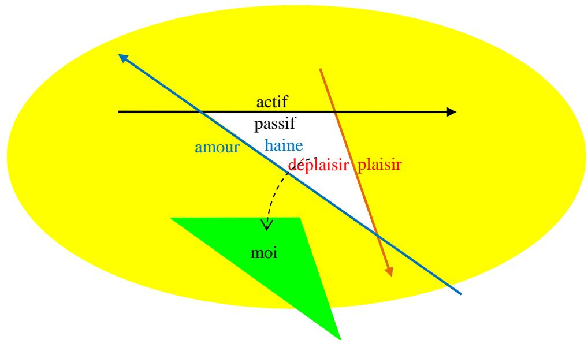

…définissant ce morceau comme un moi conforme au narcissisme (amour, plaisir, actif) opposé à un monde extérieur défini par le trou ainsi creusé par la haine, le déplaisir, et la passivité ? C’est pas mal, mais il me semble que ce serait prendre les mots « amour », « plaisir » etc. comme des signifiés. Or, ce qui fait coupure, c’est cette linéarité temporelle du signifiant tel qu’il s’énonce.

En intégrant à ces données les apports de Lacan, on peut affirmer que les trois dimensions de base sont les données du signifiant :

S1-, je parle, passant du passif (j’écoute) à l’actif, car

\- - S2, ça me procure du plaisir de parler et

Ça met en route le transfert, c'est-à-dire l’amour, achevant la découpe d’un moi qui ressent les contours de lui-même, c'est-à-dire son image d’autant mieux s’il se sent aimé.

La troisième coupure nécessaire à l’achèvement du trou (n+1) sera donc le sujet barré \$, le sujet de l’inconscient que Lacan fait assoner avec le « Es » freudien du ça. Ce serait la coupure entraînant la différenciation de la libido (amour-haine) en narcissisme et amour d’objet. Ainsi cette opération permettrait-elle de dégager le moi comme morceau de surface limité, basé sur l’image du corps, distinct du sujet qui reste une coupure, fondée sur la castration. Nous aurions réuni les 4 lettres de la théorie des 4 discours si nous y ajoutons le a comme la surface jaune de base dans laquelle s’opère la découpe, et qui est laissée pour compte en fin d’opération11. On lit dans cette topologie l’articulation signifiante comme telle : aucun signifiant ne fonctionne pour lui-même, il est défini par sa recoupe avec au moins un autre tandis que la vérité du sujet achève le trou en entamant un autre discours : la mise en activité du vecteur du sujet correspond au passage du discours du maître, dans lequel S1 était l’agent, au discours de l’hystérique, dans lequel c’est le sujet qui devient l’agent.

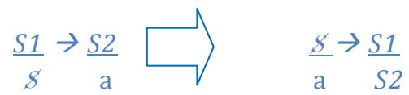

Le « monde extérieur » dont parle Freud inclut sans aucun doute le réel sensible, mais nous n’y avons accès qu’au travers des autres dans la mesure où ils nous parlent. Car les modalités de la pulsion sont en définitive des modalités syntaxiques : actif-passif d’évidence, mais l’opposition du moi et du monde extérieur se ramène à celle du sujet et du complément d’objet, objet d’amour ou de haine, sur lequel j’agis ou qui me fait subir, qui me procure plaisir ou déplaisir. Le monde extérieur de Freud se laisse donc décrire comme le grand Autre de Lacan, (A) non seulement trésor des signifiants sur son bord {S1- S2-(S)} mais fonction signifiante dans le trou qu’ils délimitent, c'est-à-dire l’articulation des signifiants entre eux, c'est-à-dire encore la reprise par le trou (ou Nom-du-Père, P) des n+1 coupures nécessaires (ou castration Φ, n-1).

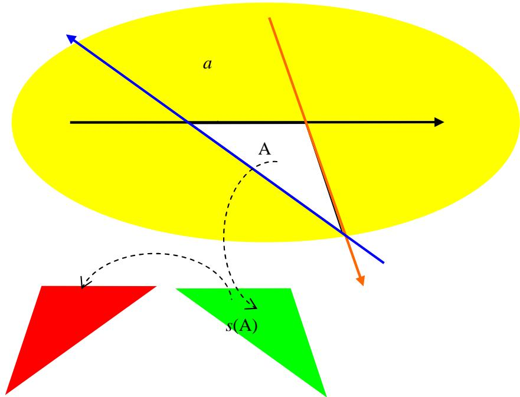

Le morceau enlevé définit toujours le moi formaté sur l’image inconsciente du corps qu’on peut mettre à jour si on se donne la peine de le retourner. Le moi est ici ce qui cherche à se signifier dans le discours : c’est le signifié s(A) global de tout ce que je dis, la somme des signifiés que je peux produire.

Il serait donc plus judicieux de poser le signifiant dans une écriture topologique conforme à sa définition conceptuelle, c'est-à-dire dans la coupure comme telle. Il faut alors le concevoir au stade antérieur de la coupure, c'est-à-dire non pas celle que l’espace à une dimension opère dans la surface à deux dimensions, mais celle que l’espace à zéro dimension, le point, opère dans l’espace à une dimension, la droite. On voit bien apparaître alors la nécessité du recoupement afin de produire ces points au lieu de la recoupe. Ainsi chaque signifiant comme coupure linéaire limitée apporte sa contribution à la limitation des autres signifiants, produisant comme signifié le morceau de surface enlevée (la signifié le plus global produit étant le moi). Ça n’empêche nullement chaque signifiant de poursuivre sa route au-delà de la recoupe, appelant ainsi à une nouvelle recoupe afin de représenter ce sujet en souffrance de représentation, tel que le définit Lacan : un signifiant représente un sujet pour un autre signifiant. Cette nouvelle recoupe serait celle qui ramène l’autre pôle inhérent à chaque signifiant, son minimum opposé :

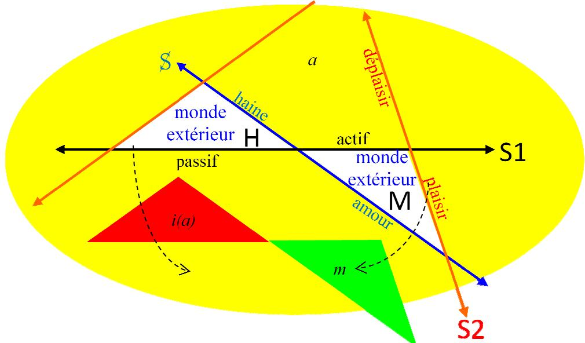

Comme pour le fort-da, chaque signifiant serait une coupure linéaire qui se parcourt deux fois, dans un sens, puis dans le sens contraire, ce sens contraire étant séparé du précédent par la recoupe que lui impose un autre signifiant. Ici le morceau enlevé sera l’interlocuteur du moi, un autre formaté aussi sur son image, un semblable. Comme dans le dialogue du maître et de l’hystérique, les positions peuvent s’échanger entre m et i(a). On voit clairement en quoi la fonction sujet diffère du moi : ce dernier est une surface, (2D) tandis que la fonction sujet, comme toute fonction est une coupure.

Ainsi, ayant parcouru deux fois le monde extérieur, une première fois sur le mode du discours du maître (M) une seconde fois sur le mode du discours de l’hystérique (H), il ne reste plus qu’à tracer une quatrième coupure pour achever le trou du discours de l’analyste (A), qui a permis une écriture du fantasme (S ◊ a) qui ouvre du même coup à la Passe (c’est ainsi que je préfère lire le discours de l’universitaire, mais c’est un choix à la fin de l’analyse : basculer dans le discours de l’universitaire –dans les écoles de psychanalyse ou à l’université - ou la passe). Cette écriture oblige à une modification de la nomination des coupures. Il semble plus logique de penser que le vecteur qui clôt le parcours des 4 discours en faisant monter le S2 en positon d’agent parcourt le trajet qui va de l’insu au savoir…

$$
\begin{array}{c}\underline {{S 2}}\\S 1\end{array}\rightarrow\begin{array}{c}\underline {{a}}\\S\end{array}
$$

…et réciproquement, car si la cure peut s’achever à ce point elle ne s’en poursuit pas moins par une série de nouveaux parcours des 4 discours. La dénomination de la dimension freudienne « déplaisir-plaisir » se retrouve alors très logiquement sur le vecteur « a » des 4 discours, puisque c’est l’objet a qui règle les avatars de la jouissance. Mais il faut préciser qu’en montant en position d’agent au discours de l’analyste, « a » cesse d’être l’objet a de la théorie, il devient un signifiant agent du discours. En analyse, on parle en effet de ce qui cause le désir, et donc de celui qui supporte cette cause dans le transfert, à savoir l’analyste.

$$
\begin{array}{c} \underline {{a}} \to \underline {{S}} \\ S 2 \quad S 1 \end{array}
$$

Tout aussi logiquement le savoir jusque là insu du fantasme inconscient trouve la raison de son refoulement : le déplaisir. Dans la passe, le « A » du discours de l’analyste prête sa lettre à ce qui s’en est dévoilé d’être la structure du grand Autre.

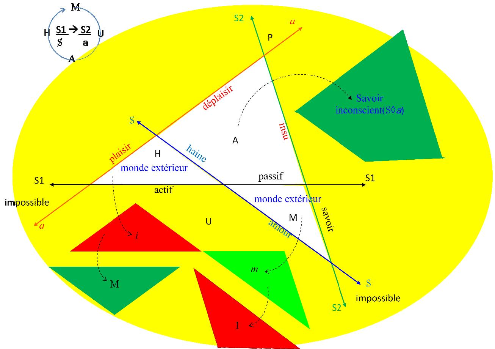

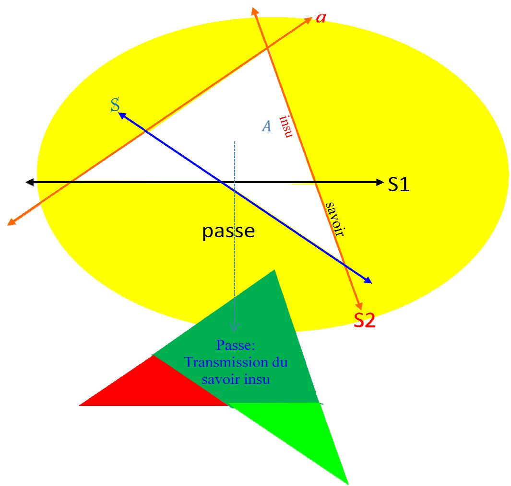  
Je devrais donc corriger mon énoncé précédent comme suit :

S1-, je parle, passant du passif (j’écoute) à l’actif, car

\- S2, ça produit un savoir à partir de l’insu, et

S, Ça (« Es ») met en route le transfert, c'est-à-dire l’amour, en tant qu’effet de la fonction sujet achevant la découpe d’un moi qui ressent les contours de lui-même, c'est-à-dire son image d’autant mieux s’il se sent aimé.

il tombe de cette opération un reste, un plus-de-jouir, l’objet a, comme surface ayant échappé à la découpe. Elle a été mise en jeu comme signifiant au discours de l’analyste, opérant la coupure entre ce qui peut s’en saisir, qui cesse de ce fait d’être objet a, sous le nom de fantasme, et ce qui reste insaisissable, continuant de fonctionner comme cause du désir.

## Mon rêve fonctionne

en passant de l’amour à la haine, puis à l’amour : je suis au lit et je l’écoute, puis elle va sauter par la fenêtre (c'est-à-dire : je la fais passer par la fenêtre), et là, je l’en empêche.

en passant du passif à l’actif : je subis ses paroles puis son acte, et alors j’interviens.

en passant du plaisir au déplaisir puis au plaisir : je suis d’abord tranquillement au lit, puis j’en sors pour éviter un « suicide » (ou un meurtre) qui me causerait un grand déplaisir, et nous retournons « ensemble » au lit.

en évitant la défénestration, le rêve joue son rôle de gardien du sommeil. Il permet de ne pas mettre en jeu la dimension moi-monde extérieur : nous restons à l’intérieur et au lit. Ce monde extérieur est évidemment l’Autre, qui me permet de parler de ce rêve une fois éveillé. L’Autre permet aussi la coupure entre le moi et l’autre, qui est dans le monde extérieur, c'est-à-dire la coupure entre mon analysante et moi. L’acteur n’est donc pas ici moi, qui dort (d’ailleurs il est au lit), mais Je, le sujet de l’inconscient, qui joue le conflit entre l’identification à l’analysante, nécessaire pour l’entendre (espace de la cure), et la distinction impossible pour l’instant (espace coupure de la passe, n-1 dimension défénestration). Le rêve serait donc aussi un gardien de la continuité de la cure, envisagée par Lacan comme « paranoïa dirigée » et« autisme à deux ». Ici, je l’envisage tout simplement comme un rêve à deux.

Dans le même temps, la structure spatiale « sensible » du rêve :

inverse les dimensions x et z (droite-gauche et devant-derrière) en changeant la disposition de l’appartement.

inverse les positions respectives de l’analysant et de l’analyste (cependant, bien qu’allongé l’analyste est d’abord passif, puis actif en reprenant une position debout), ce qui pourrait permettre de les confondre, évitant la mise en jeu de la dimension du réveil, moi-autre, sachant que cet autre condense aussi Laurent.

empêche l’inversion de la dimension y en évitant la défénestration de l’analysante.

On remarquera que les trois premières dimensions issues de la théorie des pulsions de Freud se recoupent au sens où elles sont métaphores l’une de l’autre. Les décrire m’a amené à refaire trois fois le récit du rêve en employant des mots différents. La structure spatiale sensible du rêve ne fait que poser le cadre en délivrant le code de lecture : il faut inverser n-1 dimensions mais pas répéter cela n+1 fois, car ce serait le réveil et la fin de l’identification, par la mise en jeu d’une 4ème dimension, c'est-à-dire la découpe d’un morceau de l’espace du sommeil, voire de l’espace de la cure, lui permettant ainsi de s’en aller trop tôt, fusse par la fenêtre et de mon fait. L’espace de la cure n’est pas celui où se distinguent les moi dans une opposition imaginaire a-a’. C’est celui où le sujet est engendré comme conséquence logique du signifiant : la coupure S est une conséquence nécessaire ouverte par la possibilité S1- S2, en tant que fermeture de la figure qui va achever le trou de la vérité. Ce sujet n’est pas un sujet personnel, ce qui le ravalerait au rang du moi. C’est une fonction tour à tour mise en jeu par l’analysant et l’analyste. Ici elle opère la fermeture du trou en le rendant fonctionnel, car c’est du trou que monte la pulsion, comme le décrivait Freud dans les premières pages de ses « Pulsions et leurs destins ».

Finalement cette inversion des positions de l’analysant et de l’analyste indique plutôt un écrasement de la dimension que son inversion. Lorsque je suis allongé dans mon lit, c’est elle qui est allongée sur mon divan. Lorsqu’elle tente de se jeter par la fenêtre, il est clair que sont mes motivations qui l’animent. L’identification n’est pas totale, puisqu’il y a deux personnages, mais dans le fond il n’y en a qu’un qui rêve et qui produit ces deux images distinctes. Il ne faut pas oublier le troisième personnage, Laurent, absent de la scène, mais présent sous la forme de la tentative de suicide. La disparition de son image est une tentative de refoulement, mais le refoulé réapparaît aussitôt.

Ceci permet de comprendre que la dimension y dont j’ai évité l’inversion donne la clé du rêve. D’une part elle se confond avec la dimension verticale de l’axe métaphorique, celui de la condensation, puisque dans la figure de Marianne se condensent Laurent et moi. Evitant l’inversion j’évite le réveil, et donc la séparation d’avec mes deux analysants, sachant que l’un d’eux, Laurent s’est déjà exclu de la cure par ses coups de couteaux. C’est ce que je ne veux pas voir. Ainsi, par la condensation, j’évite en fait le déploiement de cette dimension y.

Ce constat me fait revenir sur les autres inversions de dimensions. Je remarque que j’ai été obligé de nommer un aller et un retour d’un pôle à l’autre : je passe du passif à l’actif pour ramener Marianne dans le passif, de l’amour à la haine pour la ramener dans l’amour. Finalement j’ai l’impression que je m’intéresse surtout au maintien d’un statu quo. Les mouvements produits ressemblent aux hésitations en aller et retour d’une coupure, comme une scie qui ne parviendrait pas à bout de son œuvre. Tout se passe comme si, le signifiant ne devant son existence qu’à un autre signifiant, la lettre, ici, ne parvient pas à l’ouverture que lui offrirait le réveil, c'est-à-dire le signifiant en tant qu’il se recoupe.

Autrement dit l’écrasement de la dimension y sous la condensation ne s’articule guère avec un déplacement qui fait du surplace. L’inversion des dimensions x et z serait peut-être donc à lire aussi dans ce registre d’un écrasement plutôt que d’un développement.

Cette grille de lecture pourrait s’appliquer aux autres rêves cités ici. En Argentine, le canon est sur le point de faire sauter toute différence entre balcon et balcon détruit. Ensuite mon passage aux deux dimensions de la surface ne me laisse apercevoir que destruction sauf justement cet appartement où je ne veux pas réveiller les gens qui dorment, c'est-à-dire moimême. Je cherche à me réfugier dans un lieu clôt, tel un placard, mais ce qui se présente rappelle l’absence de fermeture des urinoirs, et donc toujours la crainte de la castration, c'està-dire l’achèvement du trou par une troisième coupure (+1) qui donnerait l’accès à un morceau d’espace à deux dimensions, celui d’une écriture de la castration qui tienne le coup. Enfin, ma fuite vers le haut semblerait mettre en jeu cette troisième dimension, y (haut-bas), mais c’est une régression à l’état de fœtus et de phallus de la mère. Là aussi, le rêve se présente comme une lutte entre la tendance au déploiement de la dimension et au réveil, contre un écrasement de l’espace et le repli sur soi dans le sommeil et l’espace le moins étendu possible, soit : le moins tendu possible par la différence de potentiel entre les pôles de chaque dimension.

A Montbéliard, le trou dans la falaise n’est finalement pas un trou, puisqu’il écrase la dimension y sur la dimension x, la falaise sur la plage, le trou sous l’évier avec le gonflement possible mais refoulé du sac phallique de l’aspirateur.

## Le rêve, comme la cure, serait la fermeture d’un bande de Mœbius homogène

En définitive je pourrais proposer l’écriture de tout rêve comme celle d’un bande de Moebius homogène, dans laquelle chaque tentative de se situer dessus ou dessous se trouve immédiatement démentie par le voisinage. La coupure entre dessus et dessous n’est donc pas efficiente : c’est une autre représentation de l’acoupure, celle qui, ouverte par deux signifiants S1 et S2, ne trouve pas de \$ pour achever le trou.

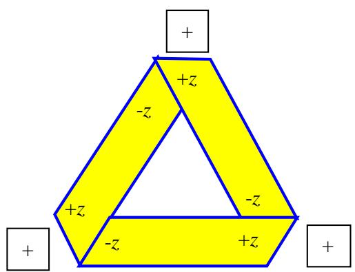

En ce sens, le bord qui est sensé effectuer l’opération de passage d’une face à l’autre, échoue : on est toujours à la fois sur les deux faces. Nous sommes en présence d’une coupure qui échoue à couper dans une surface sans dessus ni dessous, ce qui annule la différence entre surface et bord, rendant toute orientation impossible. Il faut évidemment dialectiser cette bande par la bande de Moebius hétérogène, représentant l’autre tendance du rêve, celle qui cherche à provoquer la coupure, l’orientation, le réveil, et la fin de la cure :

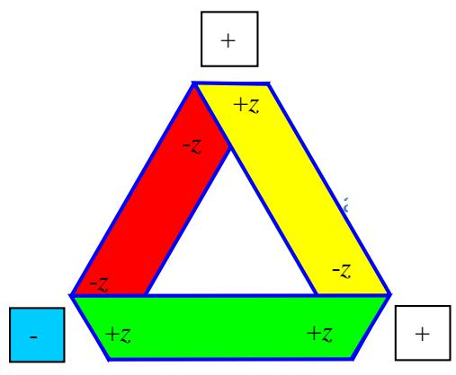

On se rend compte que l’orientation obtenue n’est que partielle : il y a toujours un reste inorientable (l’objet a) mais qui permet l’orientation. La cause du désir ne cesse pas de se manifester sous la forme de cette zone qui appelle l’orientation sans jamais pouvoir l’obtenir totalement (discordantiel). Mais elle n’est efficiente sous la forme de la fonction phallique Φ que lorsqu’elle parvient à produire un objet forclusif, avec un dessus et un dessous.

Reprenons les étapes de construction d’une bande de Moebius. Nous disposons d’une bande de papier à deux dimensions x et y. Leur raboutage moyennant trois torsions annule la dimension y (y-y) :

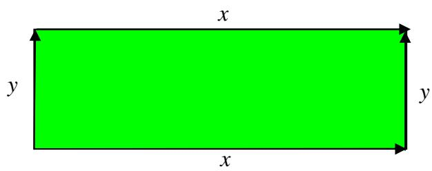

une torsion imprime un signe « - » à la dimension y, tout en créant une dimension z :  
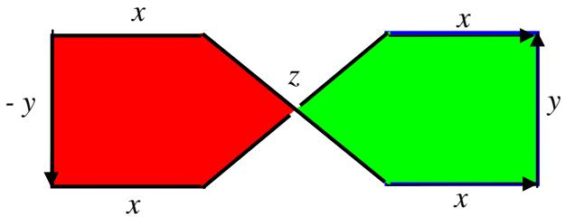

Le raboutage de la dimension y annule théoriquement celle-ci, $y - y = 0 ,$ , tandis qu’elle ajoute un signe $\ll - \ \gg$ à la dimension x et rajoute deux torsions c'est-à-dire deux dimensions z de même sens. Ce sens est apprécié en se donnant un sens de parcours de la bande selon la dimension x. Ici on passe de dessus à dessous à chaque torsion, en prenant également comme repère notre point de vue subjectif de lecteur. Est dessus, non pas une face arbitraire de la bande qui serait objectivement et tout le temps dessus, mais ce qui est pour nous dessus au moment de notre parcours. Les dimensions ne peuvent pas être appréciées en dehors du point de vue d’un observateur qui mesure les dimensions de l’objet à l’aune des siennes propres. Cidessous, il est clair que, en suivant le sens de la dimension x (qui reste objectivement la même, mais change de sens pour nous par moments), on passe de dessus (face verte) à dessous) face rouge. Puis nous sommes devant un problème, car la face rouge avait été révélée comme « dessous » dans notre opération antérieure. De ce point de vue, nous devrions noter que la torsion initialement effectuée passe à présent de dessous à dessus, et la suivante de dessus à dessous. Or, nous devons nous souvenir que la torsion initialement effectuée passait justement de dessus à dessous. Quelle orientation retenir pour cette torsion du milieu? Celle d’une objectivité des faces, déterminée par la couleur que j’ai choisi d’apposer sur chacune d’elle ? Alors ce serait –z. Ou devons nous tenir compte d’une mémoire subjective des mouvements que nous avons effectués ? Alors ce serait $+ \ z .$ C’est cette solution que je retiens, dans la mesure où elle est conforme à notre constat subjectif une fois le bande refermée de cette façon là : toutes les torsions ont le même sens.

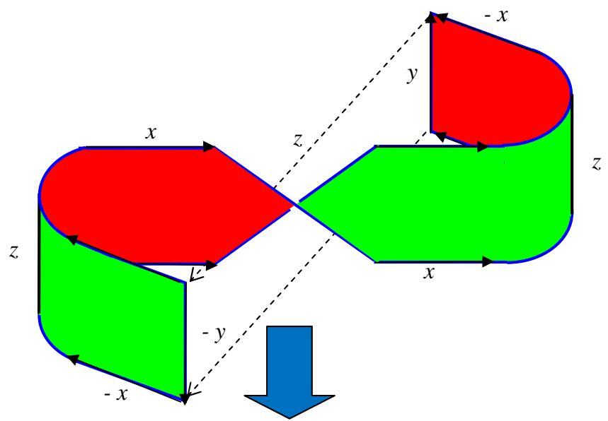

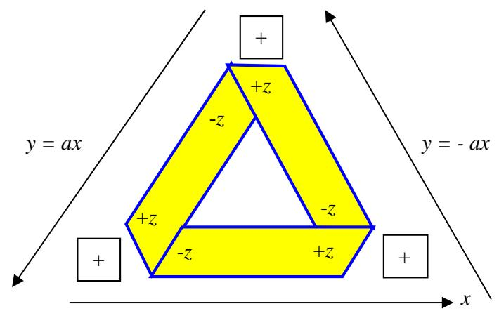

Cette incertitude due aux contradictions de la mémoire et du système de référence nous laisse cependant devant cette évidence d’un z – z qui traduit bien le mouvement de mise à plat qu’entraîne tout point de vue, c'est-à-dire toute subjectivité : la mémoire se fait écriture, c'est-à-dire suppression de la dimension z du réel, dont on peut dire qu’elle supporte le temps.

Le raboutage de la dimension x laisse planer une incertitude : les deux signes « -» s’accorent entre eux, mais s’annulent-ils par les deux « + x» restant en jeu ? Ne pourrionsnous pas accepter de faire preuve de la même prudence que Freud à la fin de son exploration de la scène primitive de l’homme aux loups ? non licet : il n’est pas permis de savoir. Car, que faisons nous d’autre, en explorant ce raboutage, si ce n’est observer la bande de Mœbius dans son état primitif, in statu nascendi ? Et ce que nous observons c’est la copulation des dimensions, x avec –x, z avec –z, y avec –y. Nous ne pouvons l’observer dans le réel car notre point de vue détermine à notre insu une mise à plat qui supprime objectivement la dimension z que nous venons de créer par le raboutage. Par contre nous ouvrons un espace de représentation, un espace d’écriture dans lequel la donne va être changée. Nous avons supprimé la dimension y, mais nous voyons ici que cette suppression n’avait rien d’objectif : elle ne tient qu’à cet artéfact d’écriture qui avait donné un sens aux bords du rectangle de papier initial. Nous avons supprimé la dimension y présente à l’origine, mais une autre dimension y est apportée par le support de l’écriture, autrement dit par l’encodage dû au point de vue, c'est-à-dire à l’Autre. L’écriture, c’est la rencontre de l’Autre, dont aucun sujet ne peut se passer : il naît de cette rencontre, et c’est justement ce qui lui confère un point de vue.

La dimension x d’origine est également partiellement bouleversée par la nouvelle donne. Elle se représente par la même dimension x de l’écriture, mais elle se continue dans une combinatoire oblique de x et de y. Cette oblique est déterminée par l’angle a qu’elle ouvre par rapport à l’horizontale dans l’équation y = ax, angle obtenu de la contrainte des trois torsions de raboutage. Cet angle représente donc l’irreprésentable de la torsion qui, d’une part était mouvement, effet du temps, d’autre part inaugurait une troisième dimension tout aussi irreprésentable que le temps. Ainsi en est-il de la mémoire par rapport à la perception : la mémoire est par définition ce qui reste, et qui donc ignore le temps, tandis que la perception se produit d’un mouvement s’évanouissant pour laisser la place à de nouvelles perceptions. Cet angle a représente donc bien l’objet a, toujours déjà perdu, comme la troisième dimension dans l’écriture. La dimension y de l’origine est également introuvable, sauf à l’état de combinatoire avec x et a c'est-à-dire avec z. Nous pourrions y lire la dimension phallique qui, par le biais de la castration, est la seule représentation possible de l’impossible troisième dimension. D’où la fréquence des chutes, abolition du haut et du bas, ou de l’angoisse de la chute, dans les rêves de tout un chacun.

Comme dans la démonstration de « La Lettre volée », il y a eu encodage, conférant aux dimensions de nouvelles propriétés qui n’étaient pas dans l’objet de départ. C’est à cet encodage qu’on a pu assister dans chacun des rêves dont j’ai fait état ici. Des dimensions se suppriment, s’inversent, d’autres cherchent une combinatoire afin de tenter une représentation de l’irreprésentable : la castration, les coups de couteau, le réveil, la fin de la cure.

En définitive, nous sommes en présence de l’écriture d’un objet paradoxal, sur lequel on lit une troisième dimension dans chaque torsion alors qu’il n’y a pas de troisième dimension, que nous appréhendons comme un morceau de surface alors que la dimension y est censée avoir été abolie. Seule la dimension x a partiellement échappé à l’encodage, permettant de dire que par rapport à l’espace de départ, à deux dimensions autant que par rapport à l’espace d’arrivée, à deux dimensions, la représentation obtenue est un espace coupure à une seule dimension. Toutefois, dans ce cas de figure où les torsions sont homogènes c'est-à-dire de même sens, l’efficience de la coupure ne se signe pas de l’enlèvement possible d’un morceau orienté qui nécessiterait le passage dans la troisième dimension : l’orientation dans la dimension z n’est pas possible.

Pour qu’elle devienne possible il faut modifier le sens de l‘une des torsion de raboutage :

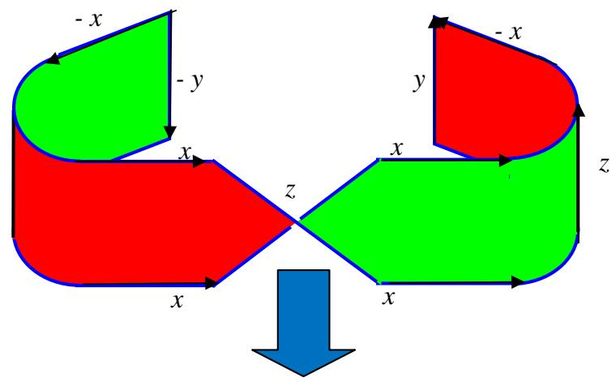

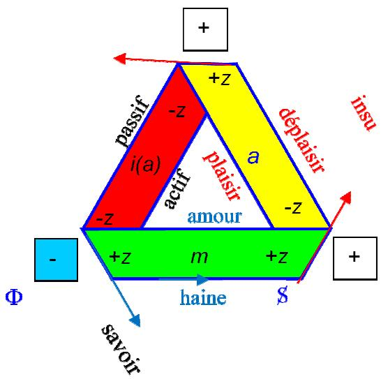

L’encodage des dimensions x et y reste le même, avec les ambigüités déjà signalées. Par contre nous obtenons là une représentation de la dimension z qui permet l’orientation. Ce raboutage particulier est équivalent à la troisième coupure qui, dans le modèle qui condense les dimensions freudiennes et les 4 discours lacaniens, permet d’achever un trou c'est-à-dire de faire passer un morceau de surface dans la troisième dimension. Cet achèvement, nous l’avons vu, nécessitait un double parcours de la dimension freudienne, assimilable aux doubles parcours que j’ai pu repérer dans le dernier rêve analysé. C’est seulement ainsi $\mathrm { \ q u ^ { \prime } i l }$ était possible de distinguer amour et haine, actif et passif, plaisir et déplaisir et donc en conséquence, un dedans et un dehors. De même ici, l’écriture de la bande de Mœbius détermine un dedans et un dehors, mais surtout un dessus et un dessous correspondant au moi et à l’image qu’il prend d’un autre, le sujet S restant écrit comme fonction coupure sur le bord.

L’insu $\mathrm { s } ^ { \prime } \mathrm { y }$ lit de ce qui reste soit dessous (rouge, refoulement proprement dit) soit désorienté (jaune, refoulement originaire) : c’est la fameuse troisième dimension dont nous avons obtenu une écriture par ce type de raboutage moyennant une torsion hétérogène. Elle est équivalente à la troisième torsion dont le signe s’oppose à celui des deux autres.

Nous avons ouvert cette fois ci un espace à 4 dimensions, x, y, z, et la torsion qui peut être + ou -. Nous pouvons la noter g comme l’équivalent de la gyrie dans l’écriture du nœud borroméen.

lundi 10 mars 2008
