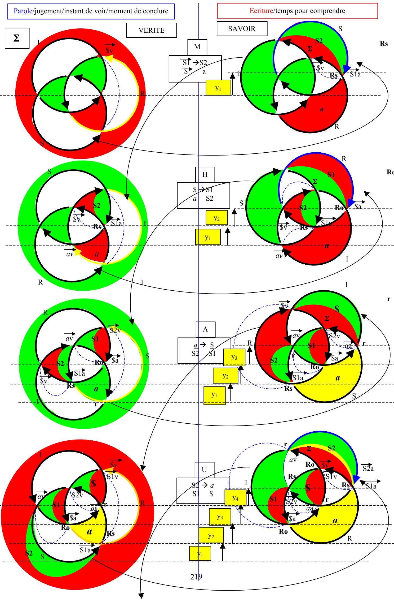
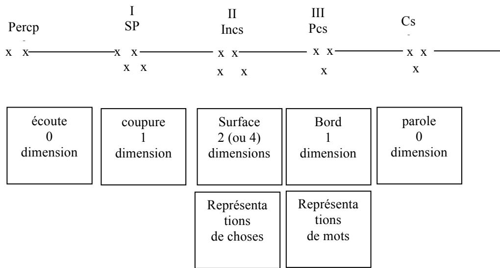
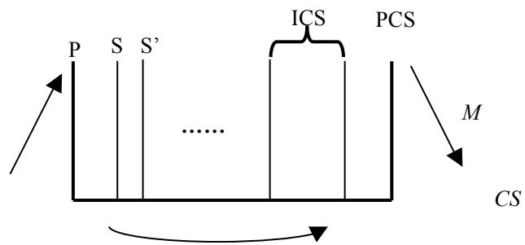
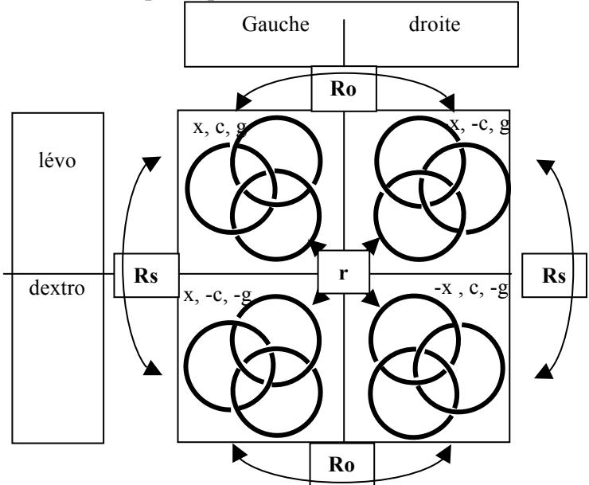
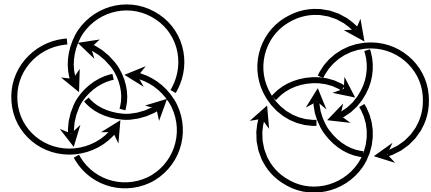
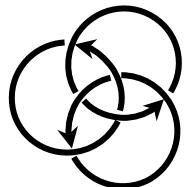
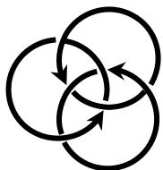
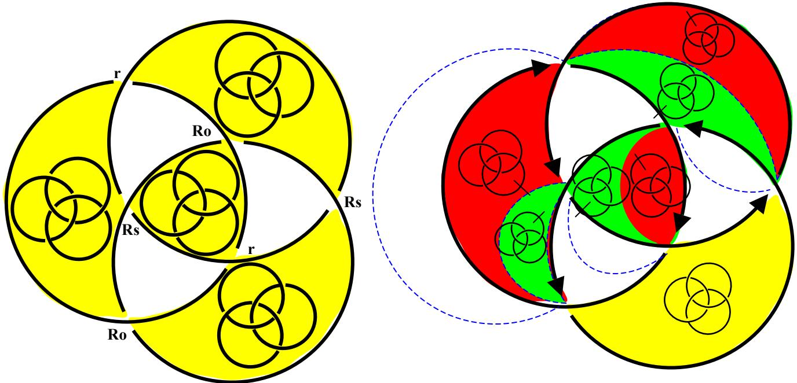
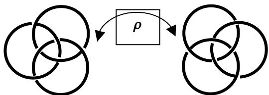
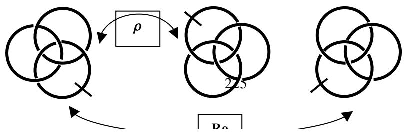

## UNE THÉORIE DU NŒUD BORROMÉEN

Modèle de la pratique analytique ? Schéma dynamique de l’appareil psychique ?

Nouvelle démonstration du théorème de Gödel ?

L’écriture ci-dessus se présente comme la succession de huit écritures du même nœud. A lire comme une phrase, comme un mouvement dynamique qui alterne parole (colonne de gauche) et écriture (colonne de droite) ; car lorsque je parle, ça laisse des traces mnésiques. Et, développant ma parole, je ne cesse de faire retour sur ce que je viens de dire, tandis que ce qui s’est inscrit de ce que j’ai dit ne cesse de moduler ce que je continue à dire. Ce que je dis s’inscrit de deux façons : d’une manière préconsciente, par liaison avec des représentations de mots, et d’une manière inconsciente par des représentations de choses seules (cf. « Das Unbewusste », 1915).

Partons du premier schéma de Freud, celui de la lettre 52 :

Ce schéma représente l’appareil psychique. Freud indique dans sa lettre que les enregistrements - ce que j’ai nommé « inscription » ci-dessus - sont « au moins trois » ; il les a notés en chiffre romains sur son schéma. Je les appelle écritures en référence à la distinction faite par Lacan entre le signifiant (représentation de mots) et la lettre (écriture – Représentation de choses) dans « Lituraterre ».

Quelle est la fonction de cet appareil ? produire des représentations qui permettent de se saisir de l’insaisissable, ce qui ne cesse pas de ne pas s’écrire, le Réel. Il s’ensuit, en conséquence, un sujet, qui se représente comme celui qui a engendré ces représentations. La référence du sujet, qui se représente donc désirant (désirant quoi ? se saisir de l’objet) reste l’objet a, qui ne cesse pas de ne pas s’écrire, et qui de ce fait, le pousse (c’est la pulsion) à écrire (représentation de chose), ce qui peut rester inconscient (les formations de l’inconscient sont des écritures), et qui pousse (c’est toujours la pulsion) à dire (par nouage avec des représentations de mot), ce qui fait devenir conscient et peut dès lors s’inscrire comme disponible dans le préconscient.

Conformément au schéma freudien, nous devons distinguer les représentations de mots de l’énonciation. Si le domaine des premières et clairement indiqué dans le préconscient, le lieu (dans le schéma) de la seconde est ce moment réflexif où le conscient rencontre la perception : je m’entends dire. Je dis, et c’est l’aspect moteur, je m’entends dire, et c’est l’aspect sensoriel. Cette précision est permise par le schéma présenté par Freud au chapitre 7 de la Traumdeutung ; j’y ai ajouté la conscience, conformément à la localisation de la lettre 52. :

Ma théorie du nœud borroméen se présente comme une théorie de la représentation. Elle poursuit et formalise les tentatives de Freud du chapitre 7 de « l’interprétation des rêves »(1900), de sa « Métapsychologie » (1915), « Au-delà du principe de plaisir » (1920) et des textes théoriques ultérieurs.

Comment s’engendre une représentation ? de nœud réel on ne peut rien dire… mais dès qu’on le pose à plat, il s’en impose quatre écritures :

Ce sont des représentations de choses, au sens freudien du terme. Elles vont nous pousser à dire quelque chose du nœud, à produire des représentations de mot. Elles sont le produit de la rencontre du nœud et du plan : soit le plongement d’un objet dont nous ignorons le nombre de dimensions (trois, peut-être…) dans un espace à deux dimensions (peut-être- c’est après-coup que nous saurons le nombre des dimensions mises en jeu ); soit encore, la rencontre d’un Sujet et d’un Autre.

Je choisis d’écrire le nœud dans cette configuration où deux ronds déterminent un axe, l’axe de y (haut-bas), autour duquel le troisième rond peut pivoter, mettant en jeu la dimension x (droite-gauche). Attention : haut-bas est la dimension y de la page, à distinguer du dessusdessous, dimension z perdue.

Avec Poincaré1, j’appelle dimension, ce qui fait continu (trou) entre deux extrémités (pôles, ou bords) qui inaugurent le discret. La dimension ainsi posée se trouve analogue à ce que Freud a appelé les Wahrnehmungzeichen, les signes de perception, première discrimination, premier encodage de la différence. Ainsi mes écritures en se préoccupent pas de la mesure, mais de l’orientation, qui se fait dans un rapport aux dimensions. Haut-bas se distingue de droite-gauche : telles sont les dimensions de l’espace de plongement.

## Les trois dimensions de l’espace-noeud

Au sein d’une même écriture, on lit le vide (à droite) laissé d’un côté par la position du rond de l’autre côté (à gauche); on la lit parce qu’on lit en regard l’autre écriture, dans laquelle le rond est de l’autre côté (à droite). La dimension droite-gauche (je l’appelle chiralité, x) n’es pas intrinsèque ni à l’objet nœud, ni à l’objet plan, elle est engendrée par leur rencontre, c'està-dire par la représentance : par la fonction de l’appareil psychique, qui produit des représentations, c'est-à-dire des moyens de s’orienter, de saisir un réel, non pas comme tel, mais par le biais de représentations.

Il y a ainsi engendrement d’un nœud droit et d’un nœud gauche, et c’est pour ça qu’il y a une dimension droite-gauche. C’est la représentation qui permet l’orientation, et non l’inverse. L’écriture engendre l’espace d’écriture, parce qu’elle en engendre les caractéristiques d’orientation.

Cependant, la rencontre du Sujet-nœud avec l’Autre-plan , si elle permet de distinguer aussitôt les écritures qui mettent un rond à gauche de l’axe, de celles qui le mettent à droite, n’autorise pas une telle distinction mettant en jeu haut-bas. Il n’y a aucun vide dans cette dimension là. Nous la découvrirons après-coup, après ce parcours des représentations qui nous aura conduit jusqu’à une représentation de la représentance, une représentation de l’acte de représenter. J’assimile donc cette dimension au refoulement originaire de Freud. Présente dès l’origine, non pas parce que déjà là, mais parce qu’engendrée par l’écriture d’une manière non explicite.

Par contre, nous constatons une différence dans la façon dont l’écriture inscrit comme un mouvement dans le nœud. Comme pour droite-gauche, nous le constatons par une différence entre deux types d’écriture. Ça ne tourne pas plus à droite qu’à gauche, mais ça tourne différemment. Cette différence, nous l’appelons lévogyre-dextrogyre, conformément à la tradition, bien que ces noms ne soient pas appropriés, puisqu’il y a un nœud-droit dextrogyre, et un nœud-droit lévogyre. Je l’appelle donc la gyrie, (g) pour simplement indiquer que ça tourne.

On constate que si l’on fait passer un seul rond de droite à gauche (en tenant fixe l’axe y des deux autres ronds), on passe de l’écriture lévo-gauche à l’écriture dextro-droite ( et de lévodroite à dextro-gauche). J’appelle r ce mouvement de retournement d’un seul rond, qui échange simultanément gyrie et chiralité, g et x, sans toucher à la centration (c, voir sa définition ci-dessous).

Enfin, toujours conformément aux traditions de l’écriture, nous avons laissé des blancs dans les traits qui représentent les ronds de ficelle. C’est un choix de la modalité d’écriture, choix de l’axiome qui dit : le morceau de ficelle qui passe dessous n’est pas représenté dans l’écriture, il est considéré comme caché par le brin du dessus. Il est néanmoins lisible du fait des coupures que nous introduisons dans le trait du dessous de part et d’autre du trait qui passe dessus. La représentation a coupé là où le réel ne présente aucune coupure2. Ces vides nous permettent, là encore, de constater qu’il y a eu engendrement d’une dimension nouvelle, qui représente la dimension perdue du fait de la rencontre Sujet-nœud/Autre-plan, la troisième dimension. Nous lisons ces vides « dessus-dessous ». Nous constatons grâce à eux que, par exemple dans le lévo-gauche, le rond du haut (dimension y) est en dessous (3ème dimension, z)

du rond du bas, tandis que dans le lévo-droite, il est au-dessus. Le lévo-droite est donc globalement le retourné du lévo-gauche, le retournement s’étant effectué selon l’axe des y. La dimension (y) est toujours absente de la représentation : par contre, elle y fonctionne. Elle joue le rôle de fonction dans les transformations de x (gauche-droite) et les transformations de z (dessus-dessous). On vérifiera de même que, si on retourne le dextro-gauche, on obtient le dextro droite. J’appelle Ro ce retournement.

La troisième dimension n’est donc pas absente, elle est représentée ; et, qui plus est, représentée justement par des absences : d’une part, ces ruptures dans la continuité des traits (application de notre axiome d’écriture), d’autre part la dissymétrie qui, entre deux écritures fait lire d’un côté, présence d’un rond par opposition à son absence de l’autre côté (conséquence de notre choix d’axiome d’écriture). Comme pour les autres dimensions, elle se lit en fait par différence entre deux écritures : si l’une représente l’autre retournée, c’est que l’une est dessus, l’autre dessous. Contrairement aux deux autres dimensions, sa lecture n’est pas évidente. Si, au niveau d’un seul croisement, on lit facilement quel est le brin qui est dessus par rapport à celui du dessous, il faut plusieurs opérations mentales avant de saisir qu’une écriture représente le retourné de l’autre. Il faut mentalement grouper les ronds deux par deux, pour voir lequel est sur l’autre, et comparer avec l’autre écriture par un semblable regroupement. Cette opération doit se faire trois fois.

On peut montrer qu’en orientant les brins par une flèche posée à l’endroit où l’écriture se coupe (dans un vide), on produit une écriture plus lisible de cette dimension. Le centrifuge devient le retourné du centripète. C’est pourquoi j’ai appelé cette dimension la centration ( c ). Ce nom n’est pas plus heureux que celui de gyrie, puisque selon le morceau de trait sur lequel on choisit d’apposer la flèche, la même écriture semblera centrifuge ou centripète

Il faut bien garder à l’esprit que ces flèches sont une écriture supplémentaire. Elles sont un artéfact non nécessaire, car c’est l’écriture du nœud comme telle – et non l’écriture des flèches - qui produit cette différence au même titre que les autres dimensions.

Le retournement Ro est ce mouvement qui inverse chiralité et centration , x et c, c représentant z, la troisième dimension. Il existe encore un mouvement Rs, dans lequel on inverse tous les croisements, mais pas la chiralité : ce n’est pas un retournement objectif (Ro) mais subjectif (Rs). Rs inverse la centration et la gyrie c et g, mais pas la chiralité, x.

La lecture de la gyrie et de la centration dépend de la répartition des vides à la surface. C’est une certaine organisation de ces vides, un certain nouage entre eux qui permet de lire ces deux dimensions ; l’écriture du nœud, c’est un nouage de ses dimensions, sachant à présent que l’espace nœud présente deux dimensions originales ( c et g) par rapport à l’espace euclidien à trois dimensions x, y, z. Ces deux dimensions originales ne valent que pour cette rencontre d’un sujet-nœud et d’un Autre-plan. Elle valent pour l’intrinsèque de cette rencontre, et pas ailleurs. Cette étude porte donc sur l’intrinsèque du plongement, c'est-à-dire l’écriture du nœud, et non sur l’intrinsèque du nœud.

Par contre, ce qui vaut pour tout fait d’écriture, c’est cet engendrement d’un espace nouveau. Autrement dit, la représentation par l’écriture n’est pas semblable au réel, elle engendre un autre réel, que nous appelons communément la réalité, celle où chacun parvient à s’orienter, du fait de sa lisibilité. Cette réalité est un fait d’écriture, c'est-à-dire un effet de ce langage que nous avons posé au départ sous forme d’une axiomatique. C’est pourquoi cette représentation du fait d’écrire peut se lire comme un modèle de l’appareil psychique.

Elle vaut pour tout fait d’écriture : car chaque fois qu’on pose une axiomatique, c'est-à-dire un ensemble d’éléments avec les lois de transformation de l’un en l’autre, il s’en déduit des théorèmes, c'est-à-dire un espace de langage qui se développe mécaniquement à partir des données de base.

Lacan en fait une autre démonstration dans « la lettre volée ». Soit une suite aléatoire d’occurrence de + et de - : discrimination minimum d’une dimension, qui représente les signes de perception freudiens. On code ces occurrences dans un parcours rétrogrédient : chaque nouvelle occurrence s’appellera 1, 2, ou 3 en fonction des deux occurrences précédentes, selon le caractère symétrique (-+-, +-+), dissymétrique $( \dots + , + \dots , + + - , \dots + )$ ou identitaire (+++, ---)de la suite de trois ainsi formée. Ceci engendre des lois de succession des 123 qui ne sont dues qu’à l’écriture. Elles s’appuient sur le réel des + et -, mais ce n’est pas les + et - , c’est un discours ordonné par ses propres lois. On a créé un espace d’écriture 123 à trois dimensions, dont l’une contient une dimension supplémentaire cachée (la dissymétrie, qui se dédouble). L’encodage des 123 en αβγδ produit ensuite un espace à quatre dimensions, muni d’autre lois qui, à leur tour, ne sont dues qu’à ce choix d’écriture.

Cet encodage représente le chiffrage des signes de perception par l’inconscient, qui, par des mises en rapport, engendre des représentations de choses. C’est là où mon espace-nœud permet de comprendre en quoi la perte d’une dimension de Réel engendre néanmoins un espace à trois dimensions, plus une, dans les « deux dimensions » du plan. C’est pourquoi, selon le point de vue, on peut lire l’inconscient comme ayant deux dimensions seulement, si on veut parler de la surface de l’Autre-plan (les deux dimensions cachées, gyrie et centration : le refoulé) ou quatre, si on veut parler de l’espace qui s’engendre du fait de la rencontre sujetnœud, Autre-plan (en y ajoutant la dimension x, chiralité, de l’énonciation – conscience - , et y , le refoulement originaire).

J’ai montré par ailleurs (« Une Théorie de la dimension ») comment l’espace-nœud pouvait se représenter à la manière de l’espace euclidien par un cube dont les arêtes sont les mouvements qui permettent de passer d’une écriture à l’autre, les sommets étant ces écritures (puisqu’il y en a quatre formant un tétraèdre inscrit dans le cube). Ce qui donne une idée de l’écriture de la façon dont l’appareil psychique organise l’espace que nous percevons. Mais, en tant que modèle de l’appareil psychique, il peut se représenter sous la forme de ce qu’il est lui-même : un nœud borroméen. Son écriture présente en effet une découpe de l’espace de plongement en huit zones. Ceci permet de considérer les croisements comme des torsions qui font passer d’une face à une autre, représentant les mouvements Ro, Rs, et r…

Le « grand nœud » représente la fonction, la torsion, ici représentée théoriquement telle qu’elle se donne une représentation d’elle-même, au centre (dessin de gauche). Ce grand nœud est une représentation de la torsion comme telle : le nœud borroméen représente le croisement, mais plus précisément, toutes les possibilités de croisement telles qu’elles s’articulent les unes aux autres du fait de l’écriture. Il définit ainsi des « pleins », zones occupées par les objets produits par la fonction, et des vides, représentant la fonction comme telle, au moment où elle fonctionne : aucune écriture ne peut écrire le mouvement comme tel, elle n’en écrit que l’état initial et l’état final (comme deux faces), avec entre les deux, les deux faces d’un vide qu’on peut lire comme la seule écriture possible de la fonction comme telle. Nous avons ainsi défini la surface d’empan du nœud. Elle n’est pas une surface sur laquelle on inscrit ces lettres que sont les écritures du nœud. Ce sont ces écritures qui déterminent ces zones comme surface : la surface est une écriture, objet produit par le fait d’écrire, mouvement qui n’est écrit que de son absence, dans les trous.

Autrement dit : le Sujet ne peut se représenter lui-même que dans sa division. Il ne lui est pas possible d’atteindre une écriture « une » de lui-même. S’écrivant, il s’écrit d’emblée quatre.

## Parole et écriture

Je n’ai évoqué jusqu’à présent que la fonction de l’écriture. Or, un sujet parle. Quelle est donc la place de la parole dans cette théorie de l’écriture ? faire de la théorie, c’est écrire. Pouvonsnous trouver un écriture de la parole qui s’insère dans cette théorie de l’écriture ?

Il existe justement une quatrième opération dont je n’ai encore pas parlé : le renversement, ρ. Je l’écris de la lettre grecque ρ parce que celle-ci se prononce en français exactement comme l’opération du retournement objectif : Ro. Nous sommes ainsi introduit à l’une des opérations fondamentales de l’interprétation analytique, portant sur l’homophonie. L’écriture distingue deux lettres, là où l’énonciation ne le permet pas. C’est le travail de l’analysant de se rendre compte qu’à un certain moment, un mot où une proposition plus complexe qu’il énonce peut s’entendre d’une autre façon. Son énonciation unique engendre au moins deux signifiés.

Le renversement est le mouvement de rotation d’une écriture du nœud sur elle-même. Il inverse la chiralité : le rond de droite passe à gauche, entraînant celui du bas à passer en haut et celui du haut à passer en bas. Il n’y a aucun changement dans les dessus-dessous. Et pourtant, nous obtenons une écriture qui est exactement la même que celle du retournement objectif, Ro :

L’énonciation unique, ρ comme Ro, n’entraîne ici qu’un seul signifié, qu’une seule représentation de chose ; j’ai inversé la dimension y, haut-bas, et pourtant, je ne le sais pas. Le mouvement est là, représentant le dire, mais il ne s’inscrit pas. C’est ce qui se passe lorsque je produis une des manifestations de l’inconscient, lapsus, rêve, acte manqué, ou symptôme. En analyse, la fonction de l’interprétation consiste à obtenir une inscription de ce dire qui révèle ainsi la dimension cachée y, la dimension inconsciente qui avait été mise ne jeu dans le mouvement. Un seul trait suffit (einziger Zug) pour distinguer les deux écritures, représentant la coupure interprétative.

Je peux opérer cette coupure sur chacune des écritures du nœud, étendant à 4 dimensions la structure de mon espace-nœud. A partir de l’une quelconque des écritures du nœud, on peut écrire trois autres doublés, représentant les trois éléments sur lesquels portent l’interprétation, selon Lacan (« L’étourdit ») : homophonie, grammaire, logique. La surface d’empan se divise en deux dans chacune des zones de plein. Les vides seront pareillement divisés, car si nous distinguons deux écritures, c’est parce qu’elles sont issues de deux mouvements distincts, Ro et ρ.

Je pourrais donc écrire tranquillement mes huit écritures du nœud dans les quatre zones déboulées de la surface d’empan. Mais ce serait ne pas tenir compte de la particularité de la parole, dont on peut rendre compte par une autre propriété de l’écriture du nœud.

Remarquons d’abord que les trois opérations ρ Ro, et Rs touchent l’écriture du nœud globalement : les six croisements sont affectés par la transformation. Le mouvement r, par contre, portant sur un seul rond, n’implique que quatre croisements sur six. C’est un mouvement local. Son caractère partiel nous introduit à la partialité de l’objet et à la castration. De ce fait, si les trois premières opérations donnent chacune une seule représentation, le mouvement r peut en donner trois, puisqu’il est possible de retourner chacun des trois ronds.

Convenons d’un prolongement de notre axiomatique afin d’étudier le phénomène. Je la choisis en fonction du discours psychanalytique. Dans la métapsychologie (Triebe und Triebschicksale), Freud indique ce que sont les trois polarités de la vie psychique : moi-objet, actif-passif, plaisir-déplaisir. Ce sont trois dimensions, que je ferais correspondre aux trois dimensions initiales de l’espace-nœud, avant la mise à jour de la dimension inconsciente : actif-passif = chiralité, x ; moi-objet = centration, c ; plaisir-déplaisir = gyrie, g. Ceci détermine une surface d’empan initiale à deux couleurs seulement : le sujet, celui qui s’identifie au mouvement, ne se repère qu’à travers deux opérations, Ro et Rs, celles qui font basculer globalement du moi à l’objet, et du plaisir au déplaisir. Ainsi, le moi et l’objet sont deux surfaces, deux représentations, mises en valeur par le plaisir et le déplaisir, qui sont les trous. Cette mise en valeur se repère par une mise en mouvement, une inversion de la dimension actif-passif, la chiralité ; ce sera le mouvement r qui inverse les dimensions x et g, de sorte qu’il n’est pas possible dire si c’est la recherche du plaisir qui pousse à l’action ou la fuite du déplaisir qui pousse à éviter l’activité. Dans ce mouvement, la dimension c moi-objet n’est pas affectée ; il s’agit de se procurer du plaisir en cherchant à se compléter par l’objet. Pourtant, la mise en jeu du mouvement va bousculer les règles du jeu, et le sujet va être amené à faire son deuil de l’objet, après s’être rendu compte des divisions dans lesquelles il se situe comme moi, et des divisions dans lesquelles se situe l’objet qui découvrira peu à peu son caractère partiel en dévoilant la castration.

Distinguons deux mouvements r :

\- la parole, qui met en jeu explicitement la dimension x (le rond de gauche passe à droite)., sans se rendre compte que cela affecte aussi la dimension g (plaisir-déplaisir).Le rond tourne autour de l’axe y formé par les deux ronds haut et bas, sans que ceux-ci bougent. C’est l’homophonie, la confusion grammaticale, ou l’identité logique.

\- L’écriture, qui met en jeu la dimension x et la dimension y : le rond en bas à gauche passe en haut à droite. C’est l’interprétation qui, à partir de la parole, ouvre l’homophonie, précise la grammaire, et introduit la différence logique, permettant d’inscrire deux écritures de la même énonciation. Ce mouvement fait « monter » la figure du nœud dans le plan, explicitant la mise en jeu de la dimension y.

## Temps logique

La parole, c’est l’instant de « voir », l’acte par lequel il est possible de poser un jugement : j’ai dit ceci, je n’ai pas dit cela. « Ce n’est pas ma mère ». L’écriture est le temps pour comprendre qu’en fait, ayant dit ceci, j’ai aussi dit cela : sous une forme négative, c’est quand même bien ma mère que je viens d’évoquer. Je peux distinguer entre deux écritures de l’objet, celles de la censure qui négative, celle de l’interprétation –ici, grammaticale, portant sur la négation - qui positive. Mon moi est divisé : par mon désir qui me porte vers cet objet, et par l’interdit de l’inceste que j’ai néanmoins intégré et que je respecte, ce dont témoigne la censure. C’est le moment de conclure et de dire ce que je viens de trouver, ce qui me précipite dans un nouvel instant de « voir », qui va aussitôt révéler une autre division, que je vais inscrire à son tour… etc…

Orientons les ronds par des flèches, de façon à inscrire ces moments de retour de l’écrit sur la parole, puis de la parole sur l’écrit. Le renversement d’un rond se lit alors comme le moment de conclure voulant faire état du savoir qui a été élaboré antérieurement ( flèche jaune à lire de manière régrédiente) dans le temps pour comprendre. Mais c’est aussi le temps de voir que ce qui est dit laisse échapper une vérité que ne prévoyait pas le savoir, entraînant une nouvelle inscription et un nouveau temps pour comprendre (flèche bleue, progrédiente). Viendra ensuite un temps pour lire la vérité dans la parole qui s’avance de manière progrédiente, tandis que l’écriture prend acte de cette vérité de manière régrédiente, constitutive du savoir inconscient.

La parole est ce moment même du plongement du Sujet-nœud dans l’Autre-plan. Le savoir élaboré dans le temps pour comprendre, c’est la liaison qui s’est faite entre les représentations de chose et les représentations de mot, que Freud avait mis au principe du devenir conscient. C’est cette écriture qui permet de distinguer entre haut et bas, entre Ro et ρ, explicitant la mise en jeu de la dimension inconsciente y. Je représente donc les signifiants, les représentations de mots, par ces ronds de ficelle qui font mouvement, un mouvement de retour progrédient ou régrédient, cernant une représentation de chose, un savoir, une surface. Ils ont la dimension unique (x) du caractère linéaire du discours, se mouvant cependant en courbure de retour dans une surface, de façon à se boucler autour du signifié qu’il s’agit de saisir (le moi et l’objet, surfaces à deux dimensions) ; cette courbure enserre aussi un vide qui témoigne de l’aspect plaisir-déplaisir (inversion de la gyrie) mis en jeu .

Il faut distinguer ici les signifiants de leur énonciation. Celle-ci se produit dans l’instantané de l’instant de « voir », s’évanouissant dès qu’elle se produit, exactement comme le sujet. Dans mon écriture théorique, l’énonciation est représentée par le point de croisement : ce qui justement ne cesse pas de ne pas s’écrire, « sous » le brin du « dessus ». On peut néanmoins en lire une représentation dans les trous entre les surfaces, représentation de la dimension perdue du fait de l’énonciation, la troisième dimension perdue du fait de l’écriture.

L’interprétation, écriture de la parole, divise la représentation de chose, la surface, permettant l’écriture de deux objets différenciés qui étaient jusqu’alors confondus. J’écris cette division par un tracé pointillé rejoignant les deux croisements externes mis en jeu dans le mouvement. De part et d’autre de ce trait s’écrivent, dans les zones de plein, les deux écritures différenciées, dans le zones de vides, les deux opérations Ro et ρ, qui ont chacune produit l’une de ces écritures (voir plus haut, écriture de droite).

Les zones de plein et de vide s’échangent lors de chaque mouvement. Parler, c’est ouvrir la bouche, ouvrir un trou par lequel se met « dehors » ce qui a été élaboré « dedans ». Je choisis de représenter l’instant de la parole par une écriture où l’une des surfaces se situe « endehors » des limites du nœud : parler, c’est se jeter dans ce vide, c’est accepter de mettre en jeu ce qu’on croit savoir, au risque de le voir invalidér par celui auquel on s’adresse – ou démenti par l’Autre intrinsèque. C’est accepter de mettre en jeu plus qu’on ne le croit. On croit savoir ce qu’on va dire, et on est surpris de s’entendre dire autre chose : conscience et perception se rejoignent dans l’instant de l’énonciation ; c’est pourquoi je leur ai attribué cette dimension zéro dans la schéma de la lettre 52. L’énonciation est représentée par le rond vidé de son savoir, sa surface ayant été jetée à l’extérieur. Ce faisant elle est devenue indéfinie : on ne sait plus si elle a des limites ou pas. Elle représente alors le savoir inconscient qui peut à cet instant faire déraper la parole en un lapsus, une inversion grammaticale, une contradiction logique.

Dans les conditions de l’analyse, l’analysant perçoit ce qui vient ainsi à la conscience, et il l’écrit, divisant la représentation de chose en deux partie inégales. L’une écrite comme une surface à deux angles, représente les représentations de chose circonscrites par des représentations de mot. L’autre, écrite comme une surface à trois angles, représente ce qui, dans le perçu, n’est pas venu à la conscience. Une partie de ce qui a été dit n’a pas été entendu, s’imposant comme chose réelle au sein des représentations de mots. C’est le refoulé, qui va pousser à une nouvelle prise de parole, divisant encore cette surface en deux partie inégales…

La répétition de cette enfilade de séquences pourrait se poursuivre à l’infini. En fait, au bout de trois opérations, si on a respecté l’axiome d’écriture posé au départ, on s’aperçoit – comme dans le temps logique - qu’on est revenu à la configuration de départ, ayant pu inscrire la coupure dans trois zones de plein et trois zones de vides. Toute opération supplémentaire ne ferait que redoubler les coupures aux endroits déjà marqués, sans jamais passer par la 4ème zone de plein, ni la 4ème zone de vide. La coupure s’est recoupé elle-même, achevant le trou. On ne peut donc pas diviser la quatrième écriture du nœud. Notre espace-nœud se réduit à sept écritures, au lieu des huit que prévoyait la théorie. Cette huitième écriture, c’est l’objet a, cause du désir… de continuer à tourner des ronds, tout en sachant à présent, maintenant que la cure est terminée – car c’est cela, la fin de l’analyse – qu’il est impossible de l’inscrire. Cette écriture impossible, c’est celle du rapport sexuel, rapport du Sujet-nœud avec l’Autre-plan, écrite théoriquement par le « grand nœud » nécessaire, contenant tous les écritures possibles, moyennant les contingences du fait d’écrire.

C’est pourquoi je considère ce théorème comme une autre démonstration du théorème de Gödel : tout système clos ne peut se construire sans aboutir à un indécidable ou une contradiction.

La rencontre du Sujet-nœud avec l’Autre-plan se produit avec une perte, celle de la troisième dimension. Sans cesser de ne pas s’écrire, elle trouve néanmoins à se faire représenter dans le psychique (comme la pulsion) par la centration (sur le moi ou sur l’objet, telle la libido du moi et la libido d’objet). D’un autre côté, cette rencontre, ce rapport sexuel, engendre un nouvel espace à quatre dimensions dont deux originales et une inconsciente. Cette dernière est révélée par six retournements de rond (trois de parole et trois d’écriture), car, non seulement ils ont mis à jour l’impossible de l’inscription d’une 8ème écriture, mais encore, ils ont fait « monter » l’écriture du nœud dans le plan, de trois unités y, qui donnent la « mesure » de l’objet a. Ces trois unités sont repérées par les positions de l’axe de la parole, x, que l’écriture fait monter d’une unité à chaque inscription, par mise en jeu de y.

Ce constat étant établi, il reste la tache d’en faire part à d’autres. C’est la passe, qui ajoute deux opérations supplémentaires, une parole et sa nécessaire inscription. Car il s’agit bien de continuer à tourner des ronds, avec ce soulagement de savoir à présent qu’il n’y a qu’à se laisser aller à la découverte de la vérité, cette vérité qu’il n’y a pas de vérité dernière. Il y manquera toujours quelque chose, et le savoir qu’on en déduit est cette vérité du manque. Par conséquent, la seule chose qu’on sait, c’est qu’on ne sait pas, et qu’il n’y a donc plus besoin d’un Sujet Supposé Savoir pour entendre la vérité. Les deux dernières opérations représentent le mouvement continué du retournement des ronds qui peut alors se produire avec un autre quelconque, et non plus seulement avec l’autre-plan unique qu’était l’analyste. J’ai alors écrit en 4 lignes le texte de mon analyse, chaque ligne représentant l’un des 4 discours de Lacan. Ce que j’expliquerai dans le prochain texte (voir « la bourse ou la vie »).

Richard Abibon, 5 août 2002.