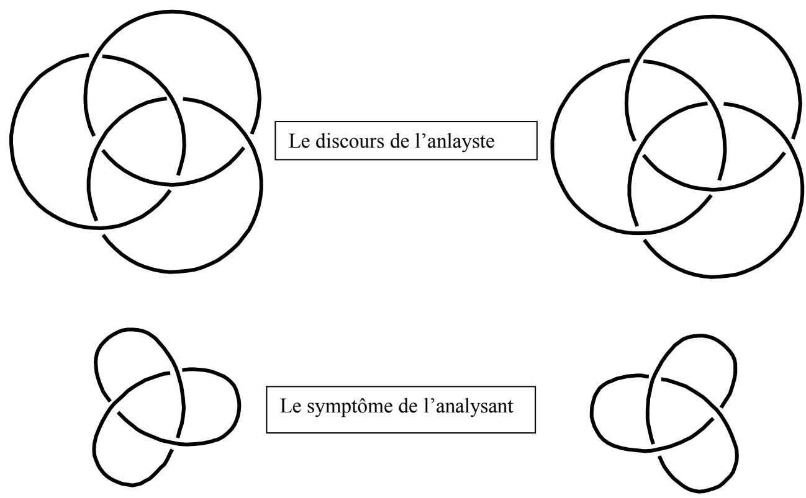
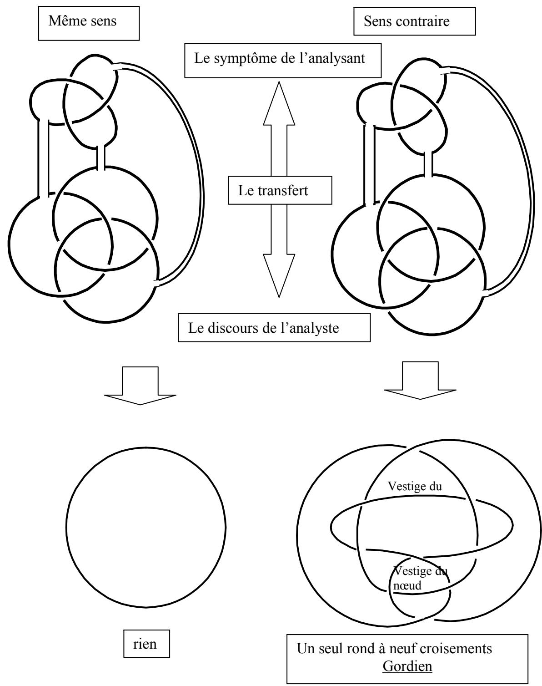
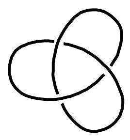
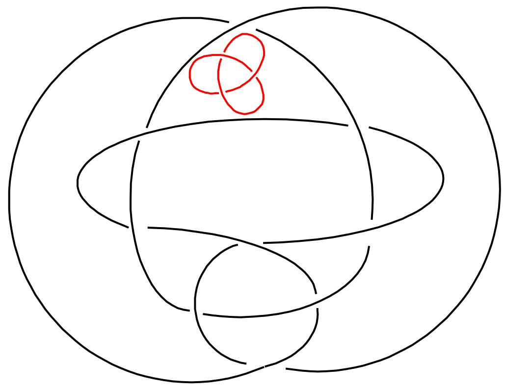
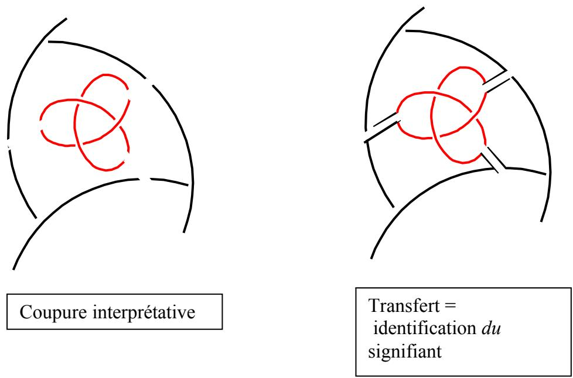
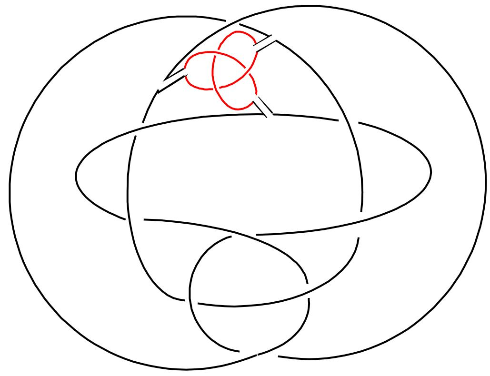
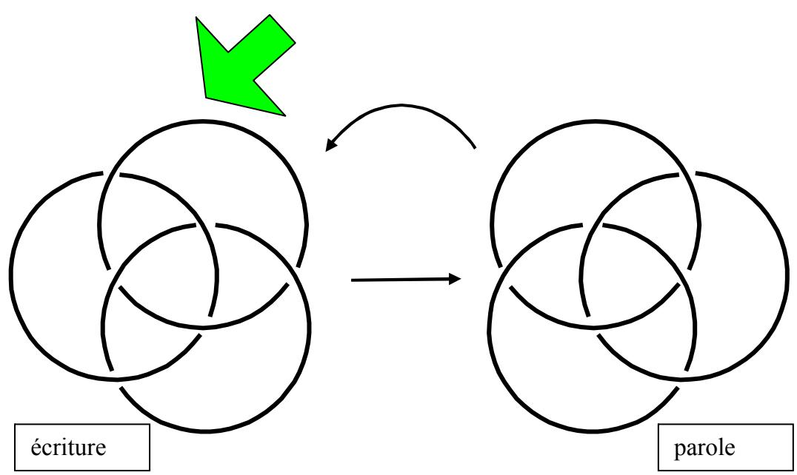
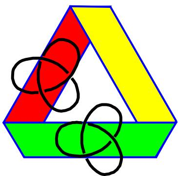
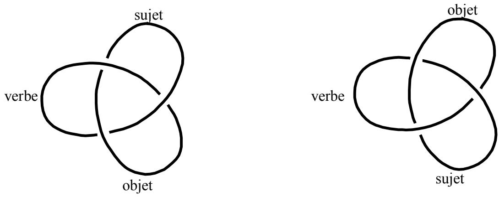

# Richard Abibon Topologie du transfert et de l’interprÅtation

La contradiction de sa fonction, qui le fait saisir comme le point d'impact de la portÄe interprÄtative en ceci mÅme que par rapport Ç l'inconscient, il est moment de la fermeture - voilÇ ce qui nÄcessite que nous le traitions comme ce qu'il est, Ç savoir un noeud. Nous le traiterons ou non comme un noeud gordien, c'est Ç voir. Il est un noeud et il nous incite Ç rendre compte de lui- ce que j'ai fait pendant plusieurs annÄes - par des considÄrations de topologie, qui, j'espÉre, ne paraÑtront pas superflues Ç rappeler"

JLacan, les quatre concepts, Le transfert et la pulsion, PrÄsence de l'analyste, page 148 de l'Ädition de Poche, Seuil, Point

"nous pouvons concevoir la fermeture de l'inconscient par l'incidence de quelque chose qui joue le rÖle d'obturateur - l'objet (petit) a sucÄ, inspirÄ, Ç l'orifice de la nasse"

opus citÄ, page 163, Analyse et vÄritÄ

Le Sinthomme, 16 dÄcembre 1975: "Quoiqu'il en soit, si le noeud Ç trois est bien le support de toute espÉce de sujet, comment l'interroger? comment l'interroger de telle sorte que ce soit bien d’un sujet qu’il s’agisse ? (…) la psychose paranoàaque et la personnalitÄ comme telle, n’ont pas de rapport ; simplement pour ceci que c’est la mÅme chose. En tant qu’un sujet noue Ç trois l’imaginaire, le symbolique et le rÄel, il n’est supportÄ que de leur continuitÄ. L’imaginaire, le symbolique et le rÄel sont une seule et mÅme consistance. Et c’est en cela que consiste la psychose paranoàaque â

Et, plus haut dans le texte (je cite aprÄs Å dessein) : â chacun sait que de nœud Ç trois, il y en a deux. Il y en a deux selon qu’il est dextrogyre ou lÄvogyre. C’est donc lÇ un des problÉmes que je vous pose : quel est le lien entre les deux espÉces de nœud borromÄens et les deux espÉces de nœuds Ç trois ? â

C’est ce problÄme que je me propose de traiter. Par É le nœud Å trois Ö il faut entendre le trÄfle, que personnellement je ne qualifie pas de É nœud Ö. Il faut prÜciser aussi que, un petit peu plus haut encore, Lacan indique qu’il n’y a qu’une sorte de É nœud Å trois Ö, alors que lÅ, il nous dit qu’il y en a deux. Il nous demande nÜanmoins de vÜrifier, posant la question : Öest-ce Å dire que ce soit vrai ? Ö.

Il y a bien en effet un trÄfle dextrogyre et un trÄfle lÜvogyre, et un droit et un gauche, ce qui fait quatre Ücritures et non deux, tout comme pour le nœud borromÜen dont il n’y a pas deux Ücritures, mais quatre.

Je propose la reprÜsentation suivante.

Le discours de l’analyste, du fait de son analyse, se prÜsente comme un nœud borromÜen susceptible de laisser tourner un rond autour des deux autres comme axe : c’est une certaine libertÜ de parole qui est reprÜsentÜe ici par l’ouverture graphique de la structure de cette Ücriture (voir É ThÜorie du nœud borromÜen Ö sur mon site).

En face de ce discours, l’analysant vient offrir sa demande sous forme de symptáme. Le symptáme est toujours prÜsentÜ comme un blocage, un impossible, un indÜpassable. Ceci est reprÜsentÜ par une figure dont la structure prÜsente un moins grand degrÜ de libertÜ. Un seul rond, àa n’autorise pas un rond Å tourner autour des deux autres. Lacan s’est servi du trÄfle pour parler Å la fois de la psychose et du sujet, en soutenant que la paranoâa, c’est la personnalitÜ.

Pas d’homme sans sinthome : c’est par cette maxime qu’il ouvrait le sÜminaire de cette annÜe lÅ. Je vais m’autoriser de ces diffÜrents moments du sÜminaire pour avancer que le symptáme du nÜvrosÜ est une psychose localisÜe, par laquelle il caractÜrise son caractÄre, c'est-Å-dire sa personnalitÜ dans ce qu’elle a de fixÜ. Le symptáme, Ücrivait Freud, est toujours une fixation. Un räve, disait-il, est aussi une psychose localisÜe. Par consÜquent je reprÜsente le symptáme par un trÄfle, comme je reprÜsenterais la psychose. On peut lire ce trÄfle-lÅ au centre de tout nœud borromÜen. Regardez bien : il y est !

La premiÄre phase de l’analyste consiste en une mise sous transfert. Aucune technique, ni aucun impÜratif Å cela : àa se fait ou non. J’en suggÄre l’Ücriture suivante.

Si les traits qui Ücrivent les ronds de ficelle sont les signifiants, alors par son Ücoute, l’analyste É ingÄre Ö les signifiants Ümis Å son Ügard par l’analysant. Il Ümet Å son insu un jugement d’attribution, et, les trouvant É bons Ö, il les accepte en lui, c'est-Å-dire qu’il accepte leur inscription dans sa mÜmoire, consciente et inconsciente. S’il les trouve É mauvais Ö - mais c’est toujours Å son insu que àa se passe – le transfert ne se produit pas : rÜsistance de l’analyste.

Lorsqu’on effectue une mise en continuitÜ d’un trÄfle et d’un nœud borromÜen, par des coupures suivies de raboutages appropriÜs, on constate ceci :

si le trÄfle est de mäme sens que le nœud borromÜen, tout se dÜfait. Il reste un seul rond, pas nouÜ, autrement dit un zÜro, rien.

si le trÄfle est de sens contraire, alors se noue un nœud complexe fait d’un seul brin et de neuf croisements : un transfert s’est effectuÜ, par lequel les deux discours, celui de l’analyste et la demande de l’analysant relative Å son symptáme se trouvent mis en continuitÜ.

La forme de se nouage, du fait du brin unique est de l’ordre du trÄfle : la psychanalyse est une paranoâa dirigÜe. Mais attention : l’analysant n’est pas le seul Å ätre paranoâaque. La paranoâa est un fait des deux, comme le dira Lacan dans le discours de GenÄve : É la psychanalyse est un autisme Å deux Ö. Ce n’est pas Untel qui est paranoâaque, c’est la psychanalyse : nuance de taille.

Au risque de choquer quelques puristes, nous obtenons un seul brin, une seule voix, un seul É dÜlire Ö Å forme paranoâaque, auquel l’analyste doit autant que l’analysant. Erotomanie, jalousie, persÜcution : dans le transfert, tout y passe. Freud disait que l’inconscient est le lieu des reprÜsentations de choses seules. Or celles-ci ne sont connues que si l’on en parle, par le biais du signifiant, donc. Mais dans cet engendrement particulier du signifiant, le psychanalyste y croit, Å ce qu’on lui dit. Il fait confiance aux formations de l’inconscient qui surgissent dans le discours (lapsus, rÜcit de räves, de symptámes, d’actes manquÜs) comme autant de lettres qui sont Å lire. C’est ainsi que l’analysant, qui tient ce qu’il dit pour vrai, et l’analyste, qui y croit, construisent ce dÜlire Å deux oå l’on prend les mots pour des choses ; le lapsus n’est pas tenu pour É du vent Ö, c’est bel et bien une chose, c'est-Å-dire une lettre volÜe, qui surgit. Elle parvient Å son destinataire si elle est lue.

Les lettres d’un räve sont prises au sÜrieux. Au sein du räve, elles se prÜsentent comme des choses auxquelles le räveur croit. Cette croyance rencontre celle de l’analyste. Le rÜcit du räve (le trÄfle, psychose locale) fait coupure dans la reprÜsentation de chose permettant des liens avec des reprÜsentations de mots. La rencontre avec la croyance de l’analyste conserve Å ces mots entendus leur caractÄre d’Ünonciation. Le dit se confond avec l’entendu, reprÜsentÜ par le mäme trait. Au rÜcit qui fait coupure rÜpond la croyance qui fait raboutage ; Å l’association libre correspond l’attention flottante, dans un mäme É lçcher prise Ö par rapport Å la rÜalitÜ, et surtout, par rapport Å la maétrise.

La 2Äme phase de l’analyse consiste Å interprÜter : inter-präter, c'est-Å-dire : je te präte, tu me prätes en retour. Non pas des significations, mais du sens. Le sens n’est rien d’autre que ce mouvement d’aller et retour. Je te präte mes mots… je te präte l’oreille.

A nouveau, le rÜcit coupe et la croyance – disons simplement l’Ücoute - raboute. Autrement dit : la parole coupe, la mise en mÜmoire Ücrit sur la surface ainsi dÜlimitÜe. Les reprÜsentations surgissant dans le retour du refoulÜ sont rÜintÜgrÜes dans É la personnalitÜ Ö.

Une rÜponse est forgÜe par les deux protagonistes Å cet exposÜ des formations de l’inconscient. Elle prend la forme d’une re-prÜsentation du trÄfle du symptáme, c'est-Å-dire un trÄfle de sens contraire Å celui qui a transformÜ le discours de l’analyse en dÜlire. Freud en aurait parlÜ en termes de É nÜvrose de transfert Ö. Lacan en parle en termes de paranoâa dirigÜe, ou d’autisme Å deux. Ce trÄfle est identique Å son image en miroir. PlacÜ au centre du triskel des vestiges de l’ancien trÄfle, il est mis en relation branche aprÄs branche par coupure et raboutage avec les traits de ce vestige ; il dissout ainsi l’excroissance symptomatique du discours, qui redevient borromÜen.

Si le nouveau trÄfle produit avait simplement reproduit le symptáme –un trÄfle de mäme sens -, la mise en relation n’aurait fait que complexifier la figure sans obtenir aucune dit-solution.

L’analyse ne fonctionne que s’il y a transfert c'est-Å-dire : l’analyste croit Å ce que dit l’analysant, l’analysant croit en l’analyse et en ce que dit l’analyste. Mais l’analyste ne fournit pas pour cela des significations. Il effectue les coupures qui orientent, qui permettent de É trouver l’orient Ö par opposition Å l’occident (mÜtaphore pour : dessus par opposition Å dessous, manifeste par opposition Å latent). Ces coupures font donc sens, sens de l’orientation. É L’interprÜtation est du sens et va contre la signification Ö(Lacan, L’Ütourdit, p.37 Scilicet 4 (1973- rÜdigÜ en 72)

Il faut bien distinguer ici :

l’identification que Lacan stigmatisait comme fin de l’analyse : c’est une identification au moi. Freud dÜfinissait le moi comme É une entitÜ toute en surface Ö : il s’agit donc une identification de surfaces entre elles.

L’identification du signifiant : contrairement Å la surface, le signifiant qui en fait le bord n’a qu’une dimension. L’identification du signifiant consiste en une identitÜ entre le dit et l’entendu. Elle s’obtient, cátÜ dire, par l’association libre, cátÜ entendre, par l’attention flottante. Dit-soudre l’excroissance symptomatique, c’est se tenir sur ce bord signifiant du cátÜ du mouvement de l’Ünonciation ;

26/08/2004

  
Le nœud borromÜen obtenu reprÜsente la parole fluidifiÜe, qui a redonnÜ Å chaque rond sa possibilitÜ de tourner (trouver des É tournures $ ,$ c'est-Å-dire des figures de rhÜtorique) autour des deux autres. Le rond qui tourne donne une mÜtaphore Ücrite (thÜorique) de la parole. Les ronds fixes reprÜsentent une Ücriture de l’Ücriture, c'est-Å-dire de la mise en mÜmoire, consciente et inconsciente. Chaque rond est Ücrit par deux arcs de cercle : ce sont les deux lignes parallÄles du graphe de É Subversion du sujet $\rangle \rangle ,$ , coupÜes par la troisiÄme qui

permet Å l’une et Å l’autre de tenir ensemble. Ici, cette troisiÄme ligne rÜtrogrÜdiente s’Ücrit par les deux autres ronds, eux-mämes coupÜs en deux. Ainsi, chaque arc de cercle occupe tout Å tour une place diffÜrente : signifiant  voix, puis Jouissance  castration, puis Sujet IdÜal du Moi. Chaque rond successivement perd sa fixitÜ en tournant autour des deux autres, puis, en lien avec un autre, retrouve une Ücriture en devenant axe de rotation pour le rond suivant.

C’est une autre faàon de reprÜsenter ce qui Ütait Ücrit plus haut sous forme de :

\- coupure dans les traits : Ünonciation, mouvement, voix.

raboutage : transfert, mÜmoire, Ücriture. J’aime qui j’ai en täte, quelqu'un dont je me remÜmore, quelqu'un dont je n’oublie pas les RV, quelqu'un qui donne valeur au propos que je tiens. Ce RV-lÅ, il tranche sur le quotidien. Il donne sens Å ma vie…

cette dichotomie revoie aux toutes premiÄres Ülaborations de Freud, qui remarquait l’incompatibilitÜ de la conscience (parole, Ücoute, coupure) et de la mÜmoire (Ücriture, double inscription, surface).

Qu'est-ce qui a tranchÜ dans le nœud gordien obtenu du raboutage du discours de l’analyste et de la demande de l’analysant relative Å son symptáme ? C’est la coupure et raboutage avec un autre trÄfle semblable Å l’image en miroir du premier. Dans ce dernier, on peut voir les productions de l’inconscient de l’analyste (räves, actes manquÜs, lapsus, rÜponses spontanÜes en sÜance…) au contact de celles ÜnoncÜes par l’analysant. Ce sont les mäme, mais inversÜes par le miroir. Il s’agit de l’autre face de l’Ücriture du trÄfle, comme s’il s’agissait de l’Autre face d’une bande de Mœbius.

Coupure et raboutage, ces deux mots associÜs peuvent ätre lus comme une description de la bande de Mœbius elle-mäme : elle est coupure, mais aussi surface, ce qui est logiquement contradictoire. Dans l’essai gordien qui prÜcÄde je ne me suis prÜoccupÜ que de traits, c'est-Å-dire des signifiants et non de la surface (signifiÜ et signification). Mais toute courbe fermÜe (comme une nasse…cf. la citation de Lacan relative Å cet accessoire de päche) engendre en son intÜrieur une surface qui ne peut pas ne pas ätre lue : son bord s’appelle lettre. Il en est de mäme pour les formations de l’inconscient, qui font fixations tant qu’on accorde l’importance Å cette surface imaginaire. Le travail de l’analyse a ÜtÜ de trancher dans cette surface en redonnant toute leur importance aux mots. Dans un premier temps, la croyance en ces mots comme Å des choses favorise le transfert dans la paranoâa dirigÜe. Le bord est confondu avec la surface. Dans un second temps, les mots eux-mämes apparaissent comme frontiÄres entre les surfaces et les vides des Ünonciations. L’accent n’est alors plus mis sur la surface (signifiÜ et signification : surfaces) mais sur l’Ünonciation (trous).

Le trou dans ces Ücritures est Å lire dans l’interruption de trait qui marque un passage É dessous Ö. Cette double inscription (double trou) donne un Ücriture substitutive de ce qui ne cesse pas de ne pas s’Ücrire : la troisiÄme dimension, qui jamais ne trouvera place dans les deux dimensions du support de l’Ücriture. Dans cette absence de trait, on peut lire la trace de la voix, du moment de l’Ünonciation, qui, comme la troisiÄme dimension, ne cesse pas de ne pas s’Ücrire.

Le cátÜ purement grammatical de le pulsion peut s’inscrire sur ces trÄfles. On se rappelle que j’ai diffÜrenciÜ la bande homogÄne de la bande hÜtÜrogÄne, et que le trÄfle Ücrit le bord d’une bande homo. C’est la raison pour laquelle trÄfle et bande homo dÜcrivent le discours psychotique. Ecrire cáte Å cáte un trÄfle et son image dans le miroir fait perdre Å cette lettre son caractÄre homogÄne. C’est une opÜration Üquivalente Å coupure et raboutage d’un trÄfle dans son image. Il s’agit de l’image au miroir dit postÜrieur : un sujet est placÜ derriÄre un objet (trÄfle) par rapport au miroir. Il voit donc le derriÄre de l’objet et son devant reflÜtÜ dans le miroir.

Le retour sur lui-mäme du trait unique du trÄfle impose une coupure en trois segments distincts. C’est un r ÖÜel de l’Ücriture. Il permet de sÜparer les constituants d’une phrase ÜlÜmentaire : nous pouvons alors inscrire la suite sujet-verbe-complÜment sur les trois pÜtales. Ceci Ücrit bien la difficultÜ d’un discours psychotique : il y a des sÜparations entre les ÜlÜments, mais finalement, c’est quand mäme le mäme trait. La parole psychotique peut aligner des mots, mais Å la fin de la phrase, le sujet se retrouve dans la continuitÜ de l’objet, enfermÜ dans le narcissisme…comme l’analysant et l’analyste dans le narcissisme de la cure. La distinction entre libido du moi et libido d’objet existe, mais c’est un semblant d’Ücriture. Le verbe qui est censÜ articuler la diffÜrence sujet-objet, se trouve lui aussi avoir la mäme Ücriture que ce dernier. Le verbe se fait chair, et les mots (le verbal) sont pris pour des choses (l’objectal).

Un retournement dans le miroir inverse le sens des traits, et permet de lire cette continuitÜ. Du coup, elle se pose comme diffÜrence. Il devient possible de jouer de cette diffÜrence pour parler.

C’est une autre faàon d’Ücrire les trois temps de la pulsion selon Freud :

passif : le sujet est objectalisÜ par le langage. Il se prÜsente comme Dora Å sa premiÄre consultation chez Freud : É, je n’y suis pour rien, je suis l’objet d’un Üchange entre mon pÄre et M. K Ö

Actif : au miroir analytique, il peut observer l’inversion de ce discours : É dans ce qui m’arrive, j’y suis pour quelque chose Ö. L’excÄs inverse consiste Å se prÜsenter sous le coup d’une culpabilitÜ exträmement handicapante : É je suis coupable de tout Ö

RÜflexif : la mise en rapport de l’une et de l’autre des positions, qui sont en effet les deux faàons les plus communes de se prÜsenter pour un nÜvrosÜ, amÄne le discours Å plus de nuance. É Je ne suis pas forcÜment coupable, mais je peux me considÜrer comme responsable, c'est-Å-dire : je peux rÜpondre Ö. L’une des Ücritures est dialectisÜe par l’autre. Le discours conscient, Ücrit d’un trÄfle É +1 Ö se noue souplement au discours de l’Autre, marquÜ du É made in Germany Ö comme disait Freud : le É -1 Ö d’une lettre nÜgativÜe, porteuse du sceau de la nÜgation, caractÜristique d’une reprÜsentation inconsciente.