# Richard Abibon

## Topologie du transfert 2

## Il n’est pas nécessaire de distinguer transfert et contre transfert

Daniel G : Le transfert est l'obtention entre deux bipèdes d'un affect dont la partie principale procède de l'inconscient et d'un archaïsme dont le Moi ne saurait avoir la moindre trace..le contre transfert serait plutôt la mise en surveillance par l'analyste de son propre émoi donc libido envers l'analysant et de ce mouvement du çà -là procède l'identification de ses propres résistances...Comme il est réputé analysé, l'analyste, ce contre transfert là ne va pas entrer dans l'inter relation à l'autre et donc va laisser le champ libre aux formations inconscientes de l'analysant, comme une table vide...

RA : je crois que distinguer transfert et contre transfert, ça serait comme essayer de définir une rivière par ses bords, l’un après l’autre. Il y en a deux, certes, mais une rivière sans l’autre rive est inconcevable. Le courant peut se comparer à la libido. Il coule, toujours le même fleuve, jamais la même eau. Les berges sont fixes : c’est l’illusion de fixité que nous donne notre moi, auquel nous tenons beaucoup, et l’autre aussi. Nous avons donc toujours tendance à penser avec notre moi, en fonction de ce moi. Nous oublions que nous sommes aussi versatiles que l’eau qui court, d’une humeur comme-ci le matin, d’une humeur comme ça le soir… en fonction de ce qui s’est passé, de nos rencontres de la journée, ou du rêve de la nuit.. Quand je pense à ce que j’étais il y a seulement 4 ans, je me dis que vraiment, j‘ai beaucoup changé. Bien sûr, il me reste la mémoire de ce parcours… enfin une certaine mémoire, qui a imprimé ce qu’elle a bien voulu, bien en dehors de ma volonté de retenir ceci ou cela. Et une mémoire qui s’est modifiée peu à peu au fur et à mesure des nouvelles inscriptions.

Je ne dirais pas : « le contre transfert serait plutôt la mise en surveillance par l'analyste de son propre émoi donc libido envers l'analysant ». Car la mise en surveillance évoque la position du surmoi, qui est aussi appelé par Freud la conscience morale. Ce serait se donner une morale pour faire de l’analyse. Et en effet, les positions morales chez les analystes, on en entend, hélas, souvent. Mais je me doute, Daniel, que vous avez voulu donner une autre coloration à cette surveillance : une surveillance éthique, alors, qui consiste justement à se déprendre de la morale, et donc des effets du surmoi, qui cherche à améliorer le moi.

Le problème est complexe. Lorsque vous écrivez : « ce contre transfert là ne va pas entrer dans l'interrelation à l'autre et donc va laisser le champ libre aux formations inconscientes de l'analysant, comme une table vide... », je me sens embarrassé. Je ne peux que vous répondre : oui et non. Non, ce n’est pas le contre transfert puisque c’est du transfert qu’il s’agit. Il s’agit justement de l’interrelation de l’analysant à l’analyste. Il n’y aurait pas ce dit « contre-transfert » s’il n’y avait ce transfert là de cet analysant là. Le transfert, c’est l’interrelation ;

Maintenant, oui l’analyste, puisqu’il est analysé et qu’il continue de son côté à être analysant, il peut analyser ce qu’il y a de résistances dans ce transfert, ces dernières étant aussi celles qui se mettent en place entre les deux. Pas plus celles de l’analysant que celles de l’analyste, donc. Mais ce dernier peut analyser « les résistances » depuis le bord d’où il peut en parler. Ainsi laisse-t-il le champ libre à la parole : la sienne lorsqu’il en parle à un autre choisit par lui, qui n’est pas l’analysant, et du coup la parole de l’analysant qui a le champ libre pour analyser son bord de transfert.

Libre est encore un bien grand mot, puisque les résistances, comme le symptôme, les actes manqués les lapsus, les rêves ils ne peuvent s’analyser qu’après-coup.

Une femme me raconte pendant des mois comment elle a été battue par sa mère, avec une violence inouïe. Je laisse parler. Je n’interviens pratiquement pas, sauf pour mettre fin à la séance. Inutile de dire que je suis touché par les scènes qu’elle me décrit.

Un jour elle me dit : je vais être obligée de retourner habiter chez ma mère. J’en ai presque le souffle coupé : intérieurement une petite voix me dit : comment peut-elle envisager retourner chez sa tortionnaire ? Le transfert, c’est l’amour. Et mon amour se manifeste dans cette petite voix, sous la forme du « je pense à son bien ». ça y est je fais de la morale. Mon amour me fait faire de la morale. Moi qui suis resté silencieux pendant des mois, j’interviens : comment se fait-il que vous preniez cette décision ? C’est que, j’ai perdu une partie de mes revenus, dit-elle, et je ne peux plus supporter de payer un loyer. J’interroge : mais que faites vous de votre argent, où passe-t-il ? Je précise que je la vois au dispensaire et que donc son analyse ne lui coûte rien. Eh bien dit-elle, j’aime bien faire des petits cadeaux aux gens pour leur faire plaisir et mériter leur amour. Elle m’avait dit en effet que compte tenu de l’enfance qu’elle me décrivait, elle passait son temps à tenter d’être agréable à tout le monde, en disant oui à tout et en achetant des petits cadeaux. Et aussi à se faire plaisir à elle-même en s’achetant ce qui lui plait de temps en temps. Elle en vient donc à me dire : en effet si je me privais de ces petits plaisir je n’aurais pas besoin de retourner chez ma mère. Mais je n’ai pas envie de me priver de ça.

Je lui dis donc en manière de clôture de séance : ce n’est donc pas une obligation, comme vous me le présentiez tout d’abord, c’est un choix.

Elle ne reviendra plus.

J’en suis encore à me mordre les doigts d’en avoir trop dit. Parce que je ne supporte pas l’idée d’une enfant martyr qui retourne sur les lieux de son martyre, le mot n’est pas trop fort, vu ce qu’elle m’a raconté. Je cru avoir produit une grande avancée par mon intervention, car elle mettait le doigt sur le désir (d), ce moment où dans le graphe de Lacan, (Ecrits : « Subversion du sujet et dialectique du désir »), le trait montant, de rencontrer le grand Autre, se fend en deux :

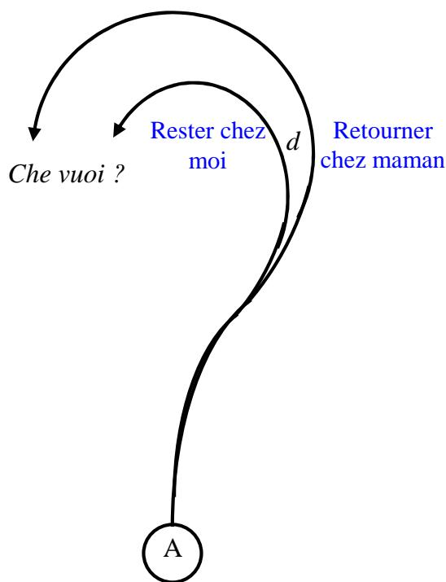

Au fond, je me suis fait le porte parole du diable de la pièce de Cazotte, qui a inspiré à Lacan cette formule en italien : « Che vuoi ? », que veux-tu ? un diable qu’un malheureux désirant appelle à la rescousse par magie, pour l’aider à accomplir son vœu.

Car, comme je le rappelais il y a peu, ce que je veux est toujours très complexe. C’est au minimum deux choses contradictoires, ce qui explique la refente de la ligne montante, la ligne du signifiant, la ligne de la parole qui dit toujours autre chose en plus de ce qu’elle dit.

Ceci s’écrit aussi bien avec une bande de Mœbius hétérogène:

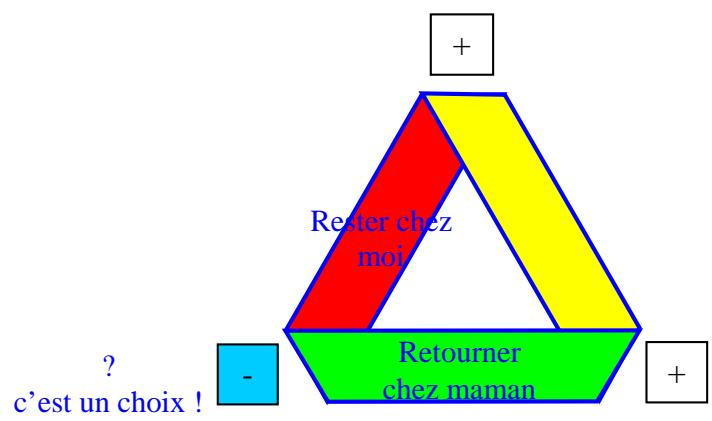

Ce que je veux, pour ma part, c’est « son bien », première formulation, qui, surveillée par l’éthique analytique, est devenue : je veux qu’elle se rende compte de son désir. Oui, moi, je voulais cela, qu’elle ne voulait vraisemblablement pas, sans quoi elle serait revenue.

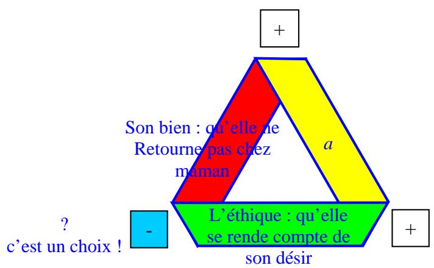

Ma résistance trouve ici sa formulation : c’est sous couvert de l’éthique du bien dire, qu’elle se rende compte de son désir, que se dissimule mon désir, qu’elle ne retourne pas chez sa mère. L’éthique de la psychanalyse est ici bien formulée : où l’on voit que la théorie se laisse largement subvertir par l’inconscient, aussi bien dite soit-elle ! Et l’analyste ne se laisse pas réduire comme ça à une position d’objet a. Cette dernière est celle de la zone jaune située en face de l’articulation parlée du désir, située pour sa part au niveau de la torsion « - ».

Théoriquement mon intervention se soutenait de la logique de l’éthique de la psychanalyse. Pratiquement, elle tombait à côté parce que vraisemblablement trop tôt, et parce que certainement, j’avais dû laisser entendre à mon insu le parti que je prenais. Nous pouvons écrire cette configuration comme deux bandes de Mœbius homogènes de sens inverse, l’une affirmant ce que l’autre nie :

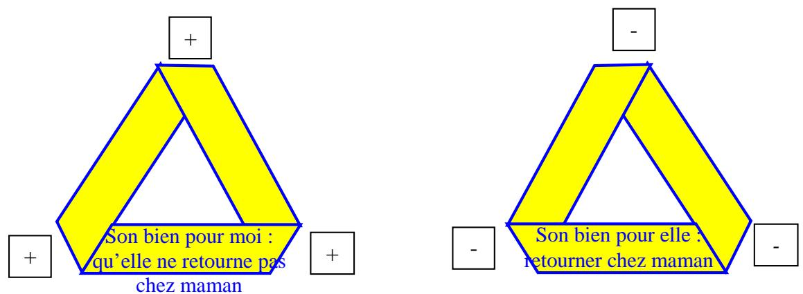

Elle ne se dialectisent pas l’une l’autre, chacune tournant en rond dans son coin, au contraire de la bande de Mœbius hétérogène qui admet une torsion « - » au sein des torsions « + ».

Vraisemblablement mon analysante avait de fortes raisons, un grand désir de retourner chez sa mère, et sans doute, les pas quelle avait fait en analyse n‘y étaient pas pour rien. Je pourrais continuer à faire des hypothèses du genre : elle avait besoin de « se faire ce petit plaisir » de tenter une nouvelle fois de séduire cette mère intraitable, de refaire son enfance ratée, de réparer les coups en essayant, adulte, une cohabitation moins violente…ou au contraire, elle n’a appris qu’une chose dans cette enfance, c’est à aimer les coups, et elle va en chercher encore. A quoi bon toutes ces hypothèses ? C’est moi qui les formule, et je ne lui ai pas laissé l’occasion de les élaborer.

Le désir, on peut ici toucher du doigt que ce n’est ni « le sien » ni « le mien », c’est : ce qui s’est mis en jeu entre nous dans cette cure. Le transfert, c’est bien ce qui se noue entre elle et moi. Or là, nous avons aboutit à un dénouage.

Les deux bandes de Mœbius homogènes peuvent s’écrire comme deux trèfles tournant en sens contraire, chaque proposition tournant sur elle-même, sans autre. Ça permet de détailler ce qui se passe au niveau de l’articulation signifiante, mot à mot:

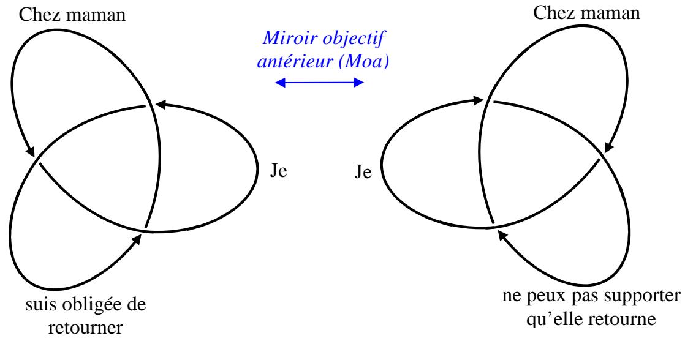

Le trèfle élémentaire, se construit du même rond se recoupant trois fois : une phrase élémentaire, sur le modèle : sujet verbe complément. Lorsqu’elle est entendue, elle s’inscrit d’une manière ou d’une autre chez l’autre, ce que j’écris par une mise en continuité, ou encore l’identification des brins semblables. Ici, ça cause le dénouage :

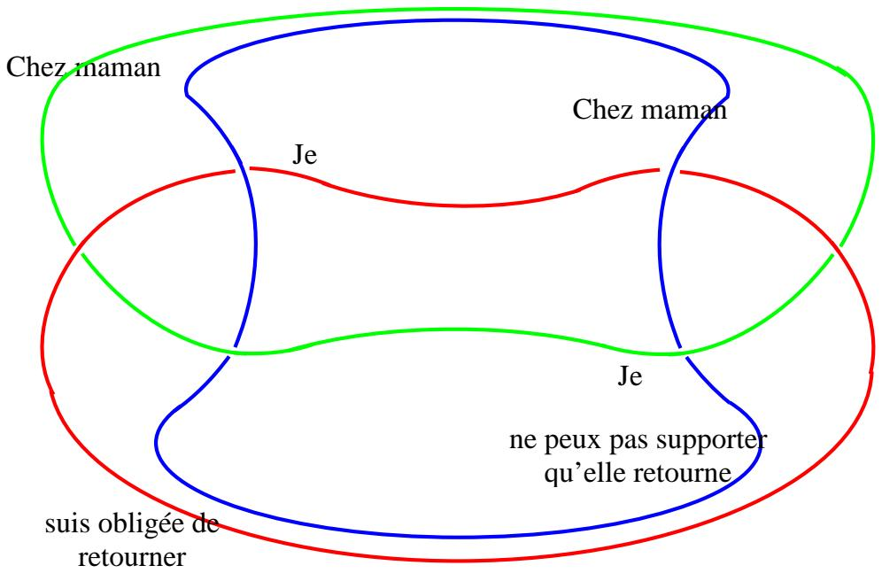

Par identification des brins j’entends : ouverture, ce qui est l’écriture de la parole, puis raboutage des brins identiques, le sujet avec le sujet le verbe avec le verbe l’objet avec l’objet. L’ouverture, c’est ce que j’écris ci-dessous, qui indique qu’un « cesse de s’écrire » vient s’intercaler dans l’écriture d’un brin qui, tournant sur lui-même, ne cessait pas de s’écrire.

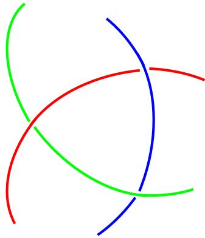

Cette parole qui ne cesse pas de ne pas s’écrire, vaut transmission (c'est-à-dire : transfert !), permettant l’identification, donc le raboutage des brins. Paradoxalement, l’identification produit de la différence : nous avions un seul brin, il y a en a trois. Mais dans cette configuration ils ne se nouent pas ensemble.

Cependant j’ai fait un rêve, le mercredi 20 octobre 2004, soit 7 jours exactement avant cette rupture. Ce rêve est le suivant :

On est une famille de saltimbanques. On marche avec beaucoup d’autres. On a une voiture à cheval. Mon père ( ?) est humilié gravement par un autre roulier. Cet autre lui prend quelque chose, puis encore son bonnet bleu. Mon père l’accompagne un temps, cet autre, pour essayer de le convaincre de rendre le bonnet. Il ne veut pas d’esclandre, il est conciliant, il admet qu’il pourra garder l’autre chose qu’il lui a prise. …il peut même donner quelque chose en échange du bonnet, le payer, quoi. Mais l’autre est inflexible. Il marche et entre dans une maison. L’humiliation est terrible.

La charrette est surchargée. Dessous, il y a un compartiment pour le foin, on le voit bourré du foin qui dépasse.

Au réveil, j’ai aussitôt pensé à l’humiliation de mon analysante à laquelle je vais à présent donner un pseudonyme : Amélia, parce que dans ce prénom, il y aussi un voisinage avec les sonorités contenues dans « humiliation », comme dans son nom. Ce sont ces sonorités qui m’ont d’abord fait penser à elle, avant le contenu. L’association qui me vient ensuite concerne un incident datant de la semaine précédente à notre dénouage. Elle qui était venue depuis trois ans ponctuellement à toutes ses séances, m’avait téléphoné pour s’excuser : elle devait aller chez son gynéco. A la séance suivante, elle avait débuté aussitôt par un : il faut que je vous fasse un aveu, je vous ai menti pour ne pas avoir à vous rendre des comptes. En fait, elle est allée rendre visite à une amie qui venait d’accoucher.

Après-coup je peux réinterpréter ce manquement comme un prodrome du dénouage, et pourtant il s’est produit bien avant mon intervention. Pour la première fois depuis le début de son analyse, un quelque chose lui est apparu plus important que sa séance : une amie, un nouveau né. Et, écrivant cette expression, je pense aussitôt à nouveau nez, donc au faux nez du clown, et au fait que dans mon rêve, ma famille est une famille de saltimbanques. Or elle m’a présenté une excuse qui était un faux. De plus, mon père cherche à récupérer son bonnet, autrement écrit : son beau nez, il voudrait donc ne pas perdre la face. Cette évocation me ramène aussitôt en mémoire la comptine enfantine « pirouette, cacahouète », dont un vers parle du facteur qui s’est cassé le nez…ce que j’avais interprété, des années plus tard, comme un récit de castration. Ne pas perdre la face, c’est toujours prouver qu’on en a ! et que personne ne vous l’a volé !

Ce n’est sûrement pas un hasard si le faux-nez dont elle avait affublé le nouveau-né a pris l’apparence du gynéco : nous sommes resté dans la sphère génitale.

Rien de risible cependant, dans mon rêve, la tonalité en est même plutôt dramatique. Un exode, ça nous renvoie au moins à celui de 1940 ! Et pourtant, je n’ai pas connu cet exode autrement que par les livres et le cinéma. Après-coup, je ne peux l’interpréter qu’ainsi ce qui m’a frappé tout d’un coup, en deçà de toute réflexion : c’était, avant-coup, l’annonce de son départ ! Elle s’enfuit, et mon rêve grossit l’événement aux dimensions de l’Histoire. Alors que pourrait-elle fuir ainsi ?

D’abord, l’humiliation. Je ne sais plus si elle a prononcé ce mot en avouant son mensonge, mais il y avait au moins celui de honte. C’est une des choses au monde les plus difficiles à avaler. Elle l’a interprété elle-même sans difficulté : elle venait de mettre en scène, dans le transfert, les humiliations subies dans l’enfance. En effet, pour faire plaisir autant que pour éviter les monstrueuses corrections, elle avait été contrainte de mentir très fréquemment, afin de se présenter conforme aux exigences excessives de sa mère. Et chaque mensonge découvert entraînait une nouvelle correction. Elle signalait que, du coup, toutes ses relations avec les autres fonctionnaient sur ce même mode.

Dois-je penser qu’elle a tenté de fuir l’humiliation subie dans le transfert pour se jeter dans les bras de l’humiliatrice de son enfance ? Ou s’agissait-il, tout d’un coup, de tenter de racheter une dignité volée, auprès de la seule qui à ses yeux aurait pu être capable de le faire ?

Cette dernière hypothèse a ma préférence, car c’est ce qu’écrit mon rêve. Non seulement il est explicite à ce propos, mais encore il me rappelle l’humiliation subie par le père de Freud : un bourgeois l’avait fait descendre du trottoir, puis lui avait fait tomber son chapeau dans le caniveau, en lui disant « juif, tu peux ramasser ton chapeau ». Freud raconte toute la colère que le récit de cet épisode, fait à lui par son père, avait fait naître en lui, avec la promesse intérieure qu’à lui rien de semblable ne lui arriverait jamais.

La veille au soir, ma compagne et moi avions eu une petite dispute. Rien de grave ; mais dans la soirée, alors que je travaillais à l’ordinateur, elle était venue me faire essayer son bonnet. Avec, j’étais ridicule ; ça nous a fait sourire, et c’était son but : détendre l’atmosphère, oublier la petite dispute, ce qui fut fort réussi. Elle m’avait fait faire le clown. Moyennant quoi, elle rachetait une humiliation, certes peu grave, celle que chacun de nous devait craindre en se laissant subvertir par le point de vue opposé.

Il ne s’agit pas d’expliquer à la place d’Amélia ce qu’elle n’a pas voulu elle-même expliquer. Il s’agit seulement d’analyser les résistances de l’analyste, en se rendant compte de ce à quoi est venu se nouer, dans cette écriture qu’est ma mémoire, le souvenir des séances comme nouvelle écriture. Les associations sont ce qu’elles sont : impossible de dire qu’elles ne me sont pas venues. Il y a là un réel de l’écriture.

Cependant, elle avait mis en scène, dans le transfert, le mensonge et la honte d’avoir menti. Rejouer cette configuration récurrente de son enfance était peut-être déjà une tentative de la saisir, c'est-à-dire de racheter quelque chose de perdu, volé. Mon père, dans mon rêve est prêt à accepter un trou symbolique dans sa bourse pour récupérer ce bonnet plus important à ses yeux. Le symbolique, c’est toujours ça : faire du trou afin de se saisir de l’insaisissable. Chercher à récupérer la lettre volée, c’est ce que nous faisons tous. Ramener la bobine du fortda mais sous la forme, non de la bobine réelle, mais de l’opposition phonématique, c'est-à- dire l’embryon du signifiant. C’est structural. Mais il y a des modalités. La modalité d’Amélia, c’est de rejouer le mensonge dans le transfert, et donc, se donner des bâtons pour se faire battre. Or je ne l’ai pas battue. Je n’ai pas réagit à l’aveu de son mensonge ; ma disposition d’esprit à ce moment-là était justement de ne pas tomber dans le panneau. D’ailleurs le statut de gratuité des consultations au dispensaire ne me permettait pas de lui faire payer la séance manquée.

Cependant, cette non réaction a dû entraîner la nécessité de mettre la barre plus haut. Puisqu’il n’était pas possible de se faire battre dans le cadre du transfert, alors il n’y avait plus qu’à retourner chez maman, comme en rêve je retourne chez papa dans le cadre d’un exode généralisé.

Nous aurions pu imaginer une configuration autre dans laquelle les brins tiennent ensemble assurant la continuité du transfert. Cette écriture aurait tenu compte de celle du rêve, dans laquelle se faisait une identification et non une opposition dictée par le bien. Elle désire revenir chez sa mère, essayant de racheter une enfance volée, ce qu’elle à mis en scène dans le transfert (le mensonge de la gynéco), et dans mon rêve je m’identifie à mon père en tant qu’il essaye lui aussi de racheter quelque chose de volé, permettant de restaurer sa dignité. En ce cas au lieu de tourner en sens inverse les trèfles tournent dans le même sens.

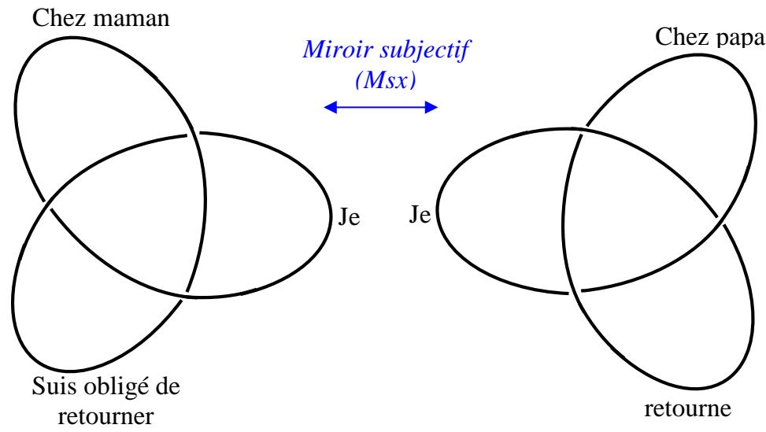

Je reconstruis après-coup les phrases en jeu dans la fiction théorique que je produis sur la base de mon rêve : « je désire racheter maman = mon père désire racheter le bonnet qu’on lui a volé ». Il y autant, dans ces deux phrases, une mise en jeu de la libido d’objet : racheter l’objet d’amour, maman ou bonnet, que de la libido du moi : se racheter une dignité.

Ce qui nous donne une mise en continuité qui tient, sous la forme d’un triple enlacement.

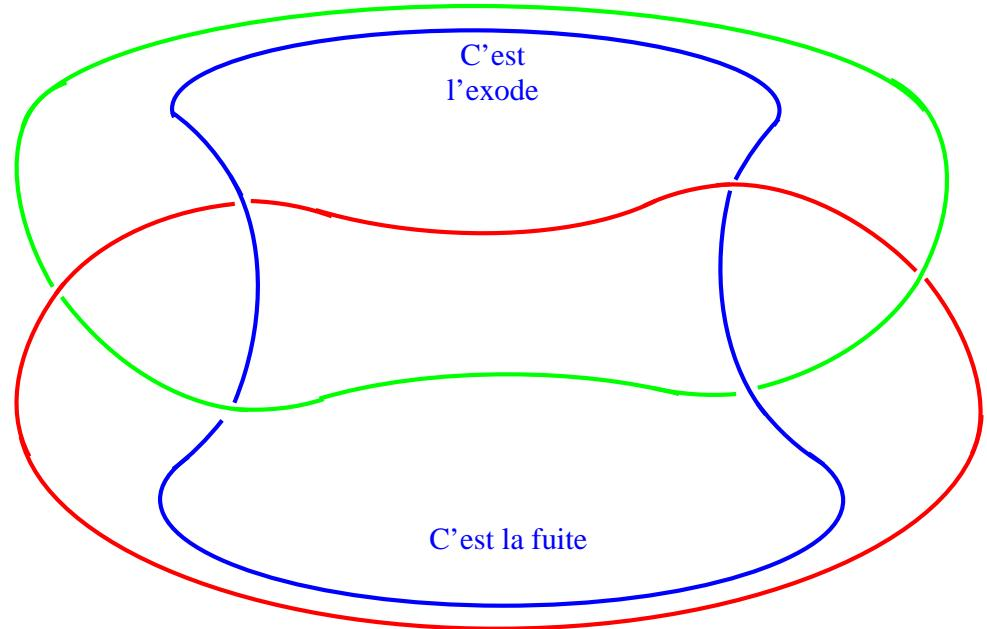

Un triple enlacement, c'est-à-dire, sur le modèle d’un enlacement simple, comme cidessous à gauche :

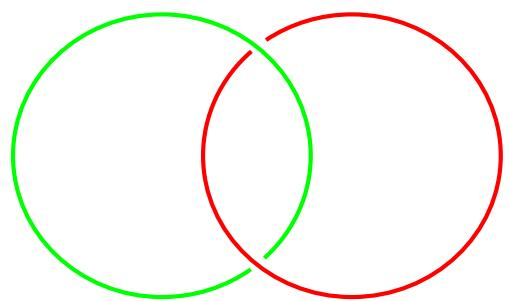

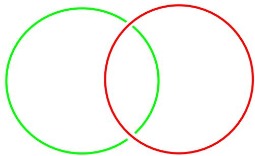

Dans lequel, comme on le voit, la solidarité se tient dans une sorte de copulation réelle : chaque rond pénètre le trou de l’autre. Un transfert de ce genre aurait certes une connotation de sexualité réelle qui n’est pas de mise : c’est la différence entre l’amour et le transfert. Le transfert, c’est l’amour, comme dit Lacan, mais il dit aussi qu’on a raison d’employer cet autre mot, transfert, puisqu’il ne s’agit pas de copuler. Pour garder au transfert son efficacité purement symbolique, on s’interdit de passer à l’acte : on ne pénètre pas dans le trou de l’autre. C’est la configuration de droite, dans laquelle les ronds sont simplement posés l’un sur l’autre ;

Or, dans un nœud borroméen, les ronds deux à deux sont disposés comme ci-dessus à droite. Ça ne tient pas ensemble. Il en faut un troisième pour que ça tienne, mais de façon purement symbolique :

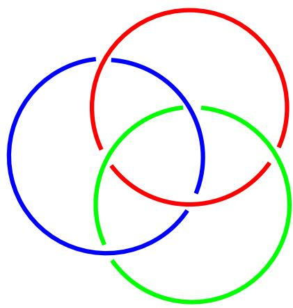

Vous pouvez vérifier qu’aucun de ces ronds ne pénètre dans le trou d’un autre. Le nouage est parfaitement solide, mais parfaitement symbolique.

Comment passer du trèfle au nœud borroméen ? Dans le trèfle, une proposition tourne sur elle-même comme un symptôme qui ne cesse pas de s’écrire, parce qu’elle ne trouve pas d’autre qui puisse l’entendre, c'est-à-dire qui puisse en identifier les brins. Nous venons de voir deux modes d’identification, l’un qui aboutit au dénouage, l’autre qui aboutit à un lien bien trop serré, parce que réel. Une combinaison des deux nous donnerait peut-être la souplesse symbolique du nœud borroméen ? C’est à peine plus compliqué que ça.

Les deux modes d’identification déjà abordés sont deux points de vue au miroir : le miroir objectif antérieur (Moa) dans lequel le sujet est situé entre la miroir et l’objet dont il cherche à percevoir l’image, et le miroir subjectif vertical (Msx) dans lequel le sujet se prend lui-même en objet (narcissisme). Il se trouve que dans le miroir objectif antérieur (Moa), le sujet est actif car il doit se retourner pour voir l’image, puis l’objet. J’ai été actif en faisant apparaître une image là ou il semblait n’y avoir qu’une nécessité objective, c'est-à-dire un objet : je suis obligé de retourner chez maman. J’ai fait apparaître ce fait qu’il s’agissait d’un choix, lui aussi actif mais insu.

Par contre mon rêve, antérieur à mon intervention, pose un miroir subjectif : je m’identifie, dans la mesure des écritures dont je dispose dans ma mémoire. La position qui me choquait tant, qu’elle retourne chez sa mère, mon rêve l’avait pourtant anticipée.

Il y encore deux autres points de vue, le miroir objectif postérieur (Mop) dans lequel le sujet est placé derrière l’objet par rapport au miroir, et le miroir subjectif horizontal (Msy), qui reflète l’autre partie du sujet, la partie inconsciente, qu’il préfère habituellement ne pas voir. J’ai préféré ne pas voir à ce moment-là l’identification que me proposait mon rêve. L’écriture de l’image du trèfle (ou du nœud borroméen) dans un tel miroir ne diffère pas de l’écriture de objet, au contraire de tous les autres points de vue dans lesquels le miroir inverse toujours deux dimensions sur trois. Le miroir Msy fait intervenir une 4ème dimension, que je ne détaillerait pas ici (voir « une théorie du nœud borroméen » sur mon site).

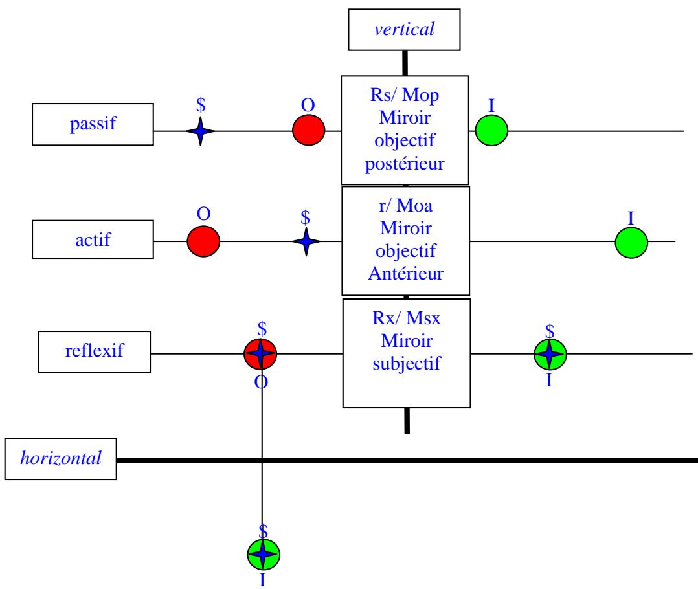

Ce qui nous donne 4 écritures, 4 points de vue sur le trèfle :  
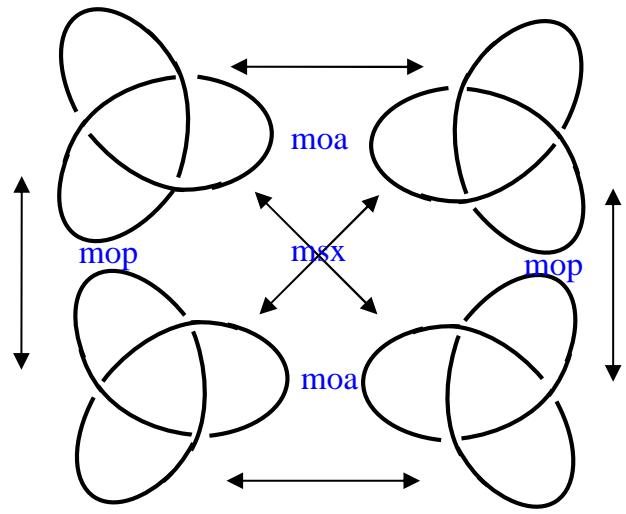

Lacan, reprenant Freud nous dit à plusieurs reprises : gardez-vous de comprendre trop vite ! en effet le mise en continuité de deux points de vue ne suffit pas, surtout si elle aboutit, comme on l’a vu, à la rigidité d’un triple enlacement. La mise en rapport de tous les points de vue possibles s’avère nécessaire afin d’obtenir un nœud qui tienne, et qui tienne de manière souple, c'est-à-dire purement symbolique.

Mon rêve avait-il apporté les points de vue manquants ? Quoiqu’il en soit, il est possible d’en soutenir l’hypothèse, avec le corollaire : c’est de n’avoir pas interprété mon rêve assez tôt, c'est-à-dire les résistances de l’analyste que le dénouage s’est produit. Les différents points de vue ne valent en effet que par leur ouverture l’un sur l’autre, c'est-à-dire par la mise en continuité donnant une perspective globale de l’ensemble. C’est l’interprétation qui apporte ces mises en continuité.

Les topologues avec lesquels j’ai été en débat privilégient le point de vue global, mais dans leur perspective, c’est au détriment des points de vue locaux. Le point de vue global que je retiens est un parcours exhaustif des points de vue locaux, dialectisant le point de vue global comme tel.

Plus haut, j’ai proposé deux sortes de mise en rapport entre deux points de vue. Etayons les à présent avec d’autres points de vue. Pour construire un nœud borroméen, il faut mettre en continuité trois de ces points de vue plus un qui peut passer pour un Msy (miroir horizontal), de telle sorte que trois trèfles tournant dans un sens encadrent un 4ème tournant en sens inverse :

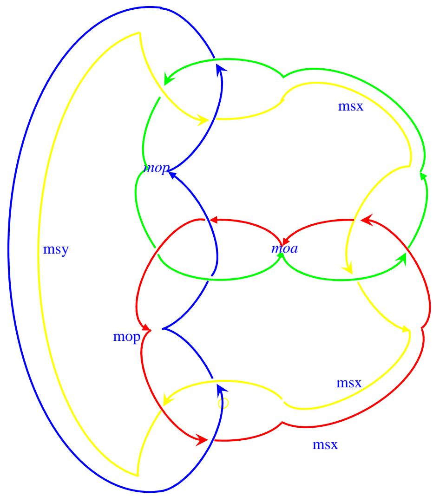  
…autrement écrit

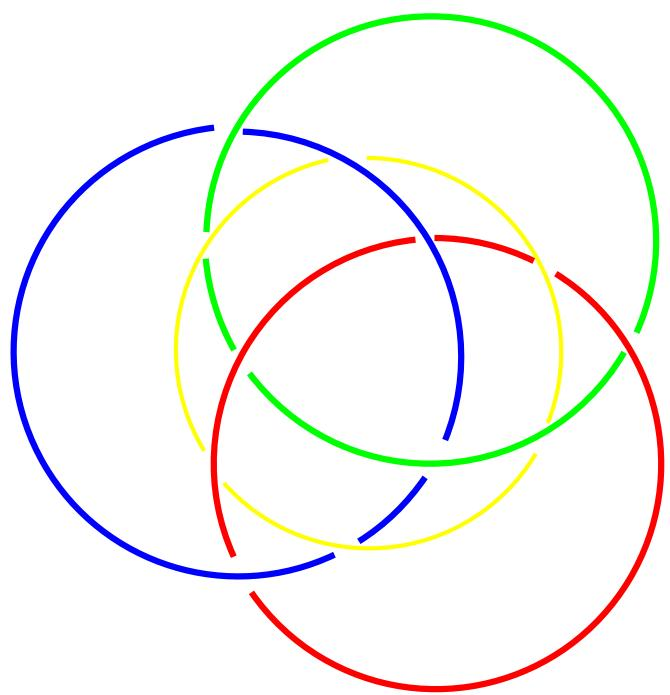

C’est la recherche empirique, avec d multiples essais qui m’a permis de trouver cette solution. Je ne la considérerais comme un théorème que le jour où je pourrais expliciter pourquoi c’est cette configuration qui marche et pas une autre. D’ailleurs il est possible qu’il existe une autre configuration que je n’ai pas trouvée, et c’est aussi cela qui m’interdit de tenir cette configuation pour un théorème.

Néanmoins ce n’est pas ici la bonne hypothèse, car elle n’aboutit pas à un dénouage, mais au blocage du nœud borroméen par le rond jaune surnuméraire, ce qui aurait signifié le blocage de l‘analyse dans la résistance, et non son interruption.

Pour obtenir un nœud borroméen débarrassé de ce rond jaune qui fait résistance, on fait intervenir le point de vue qu’on avait oublié jusqu’à présent, c'est-à-dire un retournement Msx (miroir vertical subjectif) du trèfle central :

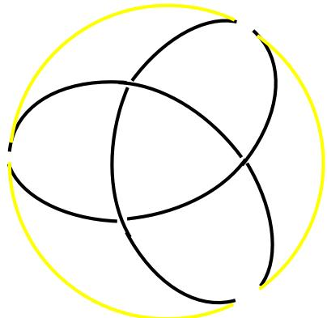

C'est-à-dire une identification subjective : celle que l’aurait procuré mon rêve si j’avais pu le décrypter plus tôt.

On peut y lire l’importance de l’oubli d’un point de vue quant à l’analyse. En ce qui concerne le cas qui nous occupe, j’ai pensé, par mon intervention rappeler un point de vue oublié chez mon analysante : qu’elle pourrait faire un autre choix. Ce faisant, j’oubliais un point de vue d’importance chez moi : que son point de vue présenté comme une obligation de retour chez maman m’était insupportable.

Mais en disant cela je brûle un peu les étapes. Voyons d’abord si un premier tour des points de vue peut s’organiser sur la mise en continuité des trèfles :

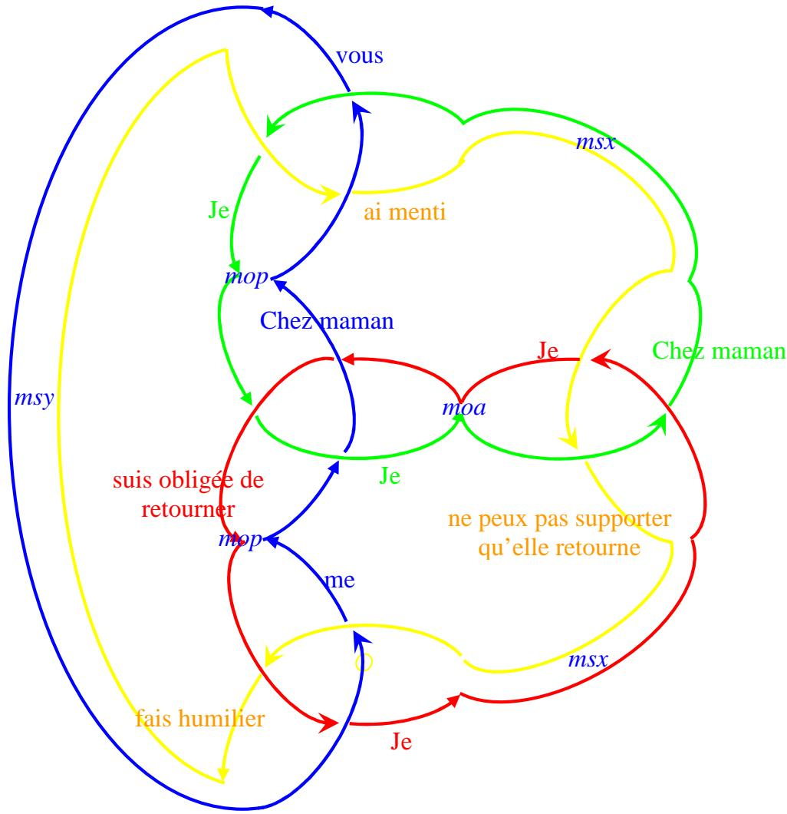

Sur un même axe vertical nous lisons le développement des points de vue d’Amélia :

le fait qu’elle ait menti pour se soustraire à une séance (je vous ai menti)

dont la conséquence, le retourné dans le miroir horizontal Msy, est l’humiliation qu’elle en conçoit par son aveu (je me fais humilier = je me fais battre)

il s’en suit la position centrale, qui s’était manifestée dans le transfert selon les deux points de vue précédents, et qui s’exprime alors par la nécessité d’aller produire la même chose chez maman.

Et, décalé sur un axe horizontal, le point de vue que ça suscite chez l‘analyste :

l’expression du retour chez maman m’amène à me retourner comme dans un miroir objectif antérieur (moa) qui témoigne de ma résistance.

Ce qui se résume par :

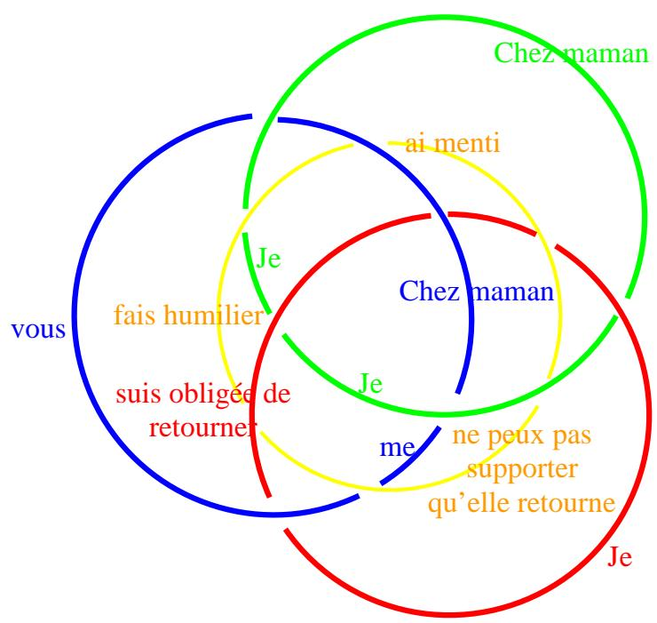  
L’analyse du retournement dans le transfert permet de dissoudre le mensonge et l’humiliation qui conditionnaient la résistance de l’analyste :

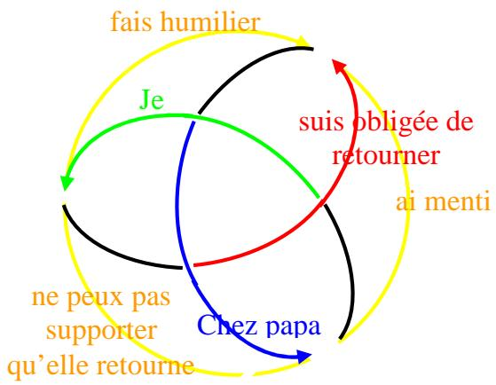

Ce qui permet de lire les identités que la coupure réelle de ce rond jaune masquait :

l’identification entre le je de l’analysante qui se fait humilier et le je de l’humiliation du père de l’analyste dans son rêve, ce qui se traduisait par ce je sujet de la résistance : je ne peux supporter qu’elle retourne chez maman. (rond rouge)

L’identification entre le je de l’analysante qui a menti et sa maman dans ma façon de concevoir cette dernière.(rond vert)

L’identification entre le moi de l‘analysante dans le narcissisme ((le « me » du « je me fais… »), l’analyste (le vous de ${ \ll } \mathrm { j e }$ vous ai menti »), et la mère de l’analysante.

Tout cela ne sont que des inattendus graphiques issus de l’écriture topologique et de sa logique. Reflète-t-elle la logique de l’inconscient ? il n’y a pas de réponse à cette question, car l’inconscient n’est pas un objet dont on pourrait donner une représentation plus ou moins valable ; c’est ce qui se développe dans un transfert, et voici une topologie inspirée du transfert qui à son tour inspire le transfert. Par la logique de son écriture elle fait surgir un inattendu qui mérite réflexion, c'est-à-dire qui suppose qu’on en parle, rien de plus.

J’ai d’ailleurs fait une section de phrases qui me parassent important leur donnant une forme proche du mathème pour pouvoir les faire se correspondre. La forme canonique permettant d’obtenir un nœud borroméen à partir de 4 trèfles limite le mathème à 4 phrases. Cette limitation est elle-même gage d’invention et de créativité. Mais il est possible d’en rajouter s’il s’avère que cette mise en forme est insuffisante. On peut détailler en en rajoutant dans une généralisation de la figure, qui est la suivante :

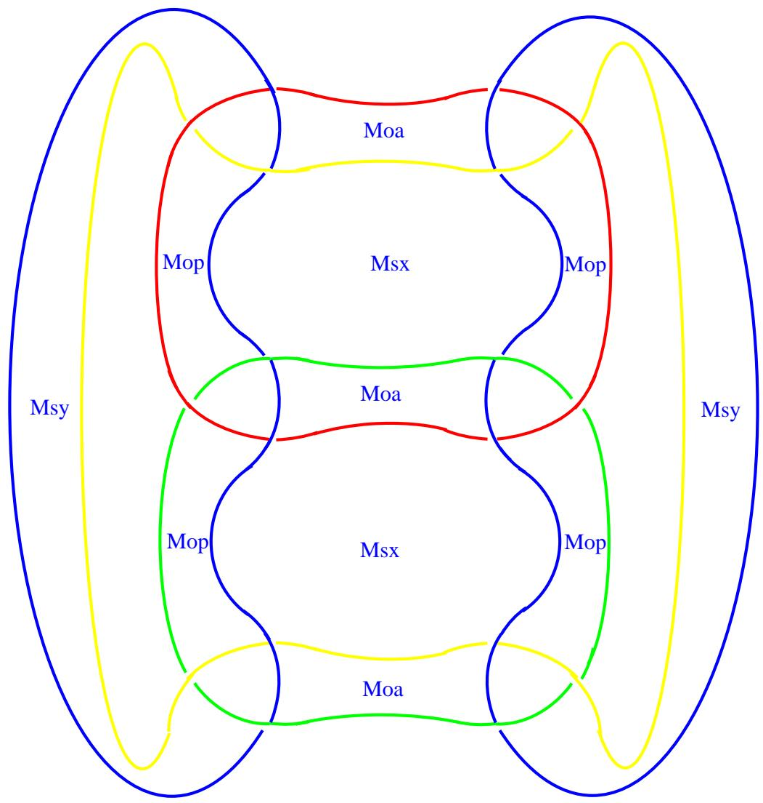  
Ce qui, une fois débarrassé du rond jaune supplémentaire, donne ceci :

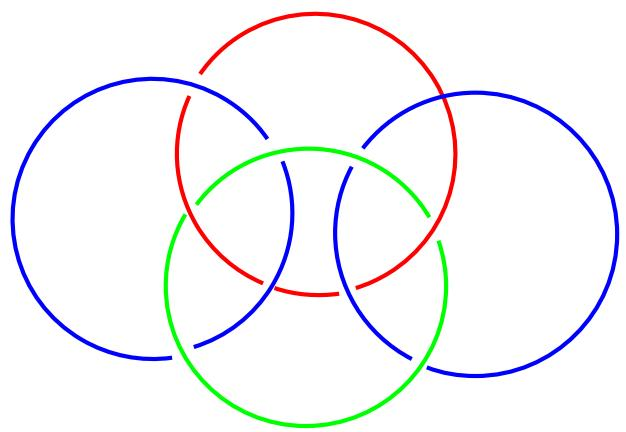

Soit le nœud borroméen à 4 issu de la réparation d’un nœud borroméen « raté », tel que Lacan le présente pour illustrer la réparation par l’ego chez Joyce, dans la séance du 13 avril 76 du « Sinthome ». (p. 170 dans l’édition de l’ALI). Il représente l’assemblage de deux nœud borroméens, qui aurait alors deux ronds commun, le rouge et le vert, le bleu de droite appartenant à l’un, le bleu de gauche, à l’autre.

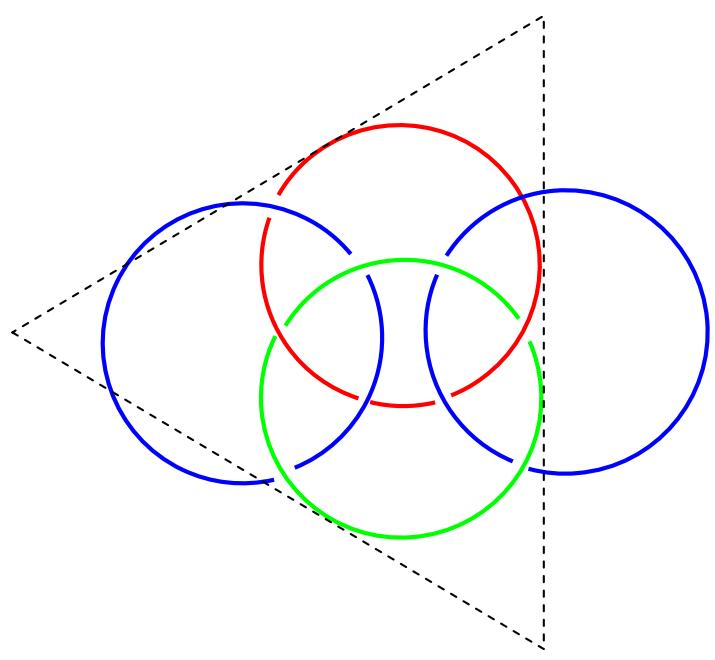

Pour l’instant je laisse ces outils à la disposition du lecteur afin qu’ils exercent leur sagacité à déplier le transfert que je viens d’exposer avec cette formule plus générale, sachant qu’on pourra ajouter au nouage primitif de six trèfles autant qu’on voudra de lignes « moa » de deux trèfles, dans une alternance respectant celle initiée dans la structure primordiale.

Il est remarquable de constater qu’un raboutage des bords, non par les côtés, mais par le haut et le bas, donne un montage qui se dénoue complètement :

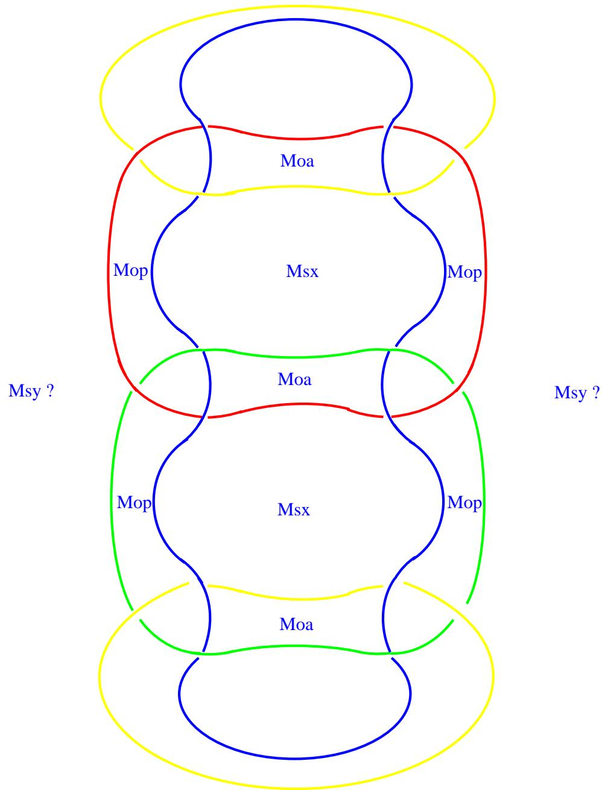

Ce qui s’explique fort bien : le raboutage par les côtés met en rapport le début et la fin d’un texte ce qui signifie le retour que l’on fait la fin pour, se remémorant le début, boucler la signification du texte sur un point de vue global, à la manière d’une coupure courbe qui, revenant sur elle-même pour se recouper, peut détacher un rondelle d’une surface :

Coupure qui se recoupe

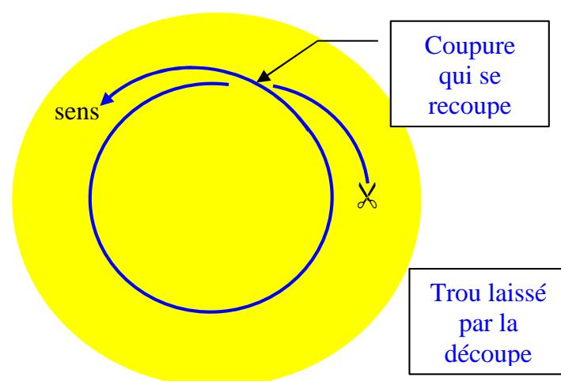  
Trou laissé par la découpe

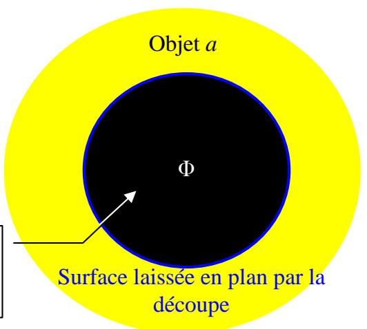

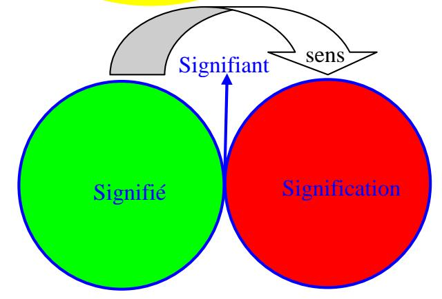  
Rondelle (à deux faces) produite par la découpe

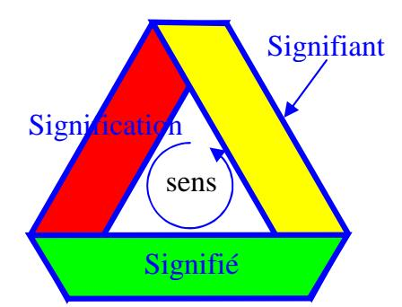  
Autre présentation du même processus : la bande de Mœbius

Le nouveau raboutage proposé laisse tomber les deux opérations Msy des côtés : autrement dit il oublie le point de vue de l’inconscient (miroir horizontal), celui qui, recoupant la structure, permet en détachant une rondelle d’en consulter l’Autre face, la face rouge. Il en reste aux points de vue locaux, ceux qu’on peut obtenir en prenant le risque de comprendre trop vite, sans mettre en rapport la totalité des éléments dans leurs liaisons complexes. Ce que Freud appelait, à la fin de sa vie, les « constructions en analyse ».
