# 5,&+\$5' \$%,%21 /( <, .,1\*  81( 7232/2\*,( (1 3,(55( "

# (WKLTXH GH O¶LPPRELOLWp HW GX PRXYHPHQW  HW OH GpVLU "

## ,GHQWLWp HW GLIIpUHQFH

Sur la 4ème de couverture du livre de François Jullien « Figures de l’Immanence », il est dit : « …car le Yi King prétend nous faire accéder à l’intelligibilité des choses sans avoir recours à la mise en scène d’une histoire ou au développement d’un argument. Autrement dit, sans en appeler au mythe et au discours ».

Il se trouve que c’est le projet de la topologie, tant qu’on ne considère que les figures, et leurs transformations ; mais dès qu’on passe au commentaire, ce n’est plus ça. Or il est aussi vrai que même en mathématiques pures, il est impossible de livrer les formules sans commentaires. Et tant mieux : au fond, le Yi King comme la topologie n’ont qu’un seul propos : faire parler.

Il se trouve que sur la couverture du même livre figure une bande de Mœbius, ou plutôt, ce qui apparaît comme la photographie d’une bande de Mœbius en pierre. Peu importe qu’il s’agisse de l’œuvre d’un graphiste ou d’un sculpteur : pour nous lecteur, nous lisons une bande de Mœbius mise à plat, puisque malgré les illusions du relief, pour nous, il s’agit d’un écrit sur la couverture d’un livre, où on lit très bien les trois torsions de la bande. François Jullien, autant que je sache, ne parle jamais de bande de Mœbius explicitement. Pourtant, pour un familier de la topologie, il est clair qu’il ne cesse pas de ne parler que de ça.

Au vu de ce graphème, une question se pose cependant : la bande de Mœbius est une écriture du passage, une lettre à lire comme le mouvement même de celui qui tourne la page d’un livre. La sagesse chinoise, nous dit François Jullien, porte l’accent sur le mouvement, contre la fixation : en effet, une bande de Mœbius est tout à fait à même de représenter cela, puisqu’elle présentifie le passage d’une face à une autre. Mais si elle est sculptée dans la pierre, où ira se réfugier la fluidité qu’elle est censée représenter ?

Ma faible connaissance de l’orient me confine à l’outrecuidance, si je pose la question suivante : à partir d’une telle idée de l’immanence, à travers laquelle le sage ne cesse de se couler dans la fluidité supposée du Réel, comment la Chine en est-elle arrivée à cette passivité contre laquelle Lu Xun se révoltait au début de ce siècle ? Tout semble s’être passé comme si, en effet, la souplesse de la bande de Mœbius n’avait trouvé d’incarnation qu’à se figer dans la pierre.

Derrière fluidité et fixation se profile toujours l’autre polarité : différence et identité. L’accent porté sur la différence peut être de bon augure quant au maintien d’un écart qui assure le passage de l’un à l’autre des pôles ainsi distingués. Mais ce peut devenir rapidement une différence forclusive au sens d’un point de vue des bords : si c’est l’un, ce n’est pas l’autre, entraînant la rigidité des positions plutôt que le passage. Au contraire elle peut être discordentielle ; si le point de vue privilégié est celui courant engendré entre les pôles, le point de vue du vide intermédiaire. L’identité de son côté peut être pareillement considérée des deux points de vue : l’identité qui fixe forclusivement l’unarité ou celle qui privilégie le fait que, s’il l’on peut parler d’identité, c’est qu’il y a, de manière discordentielle, différence, sinon parler d’identité n’aurait même pas de sens. Il faut bien au moins deux traits pour affirmer qu’ils sont identiques.

La fluidité suppose donc de ne pas cesser de faire le tour non seulement des objets considérés mais encore des points de vue sur ces objets.

Ces questions sont celles qui intéressent la psychanalyse. Y a-t-il une ou deux pulsions, la sexuelle et celle d’ autoconservation ? une ou deux libidos, celle de l’ objet et celle du moi ? la pulsion de vie n’ est-elle pas l’ autre manifestation de la pulsion de mort ? Est-ce un ? est-ce deux ? S1 S2, telle est l’ un des mathèmes fondamentaux de Lacan Il est remarquable que le Yi King traite aussi de ces questions d’ une façon tout à fait semblable ; est-ce yang ? est-ce yin ? C'est-à-dire : est-ce un trait continu, unaire, ou est-ce deux, un trait discret, présentant une brisure ? Or, nous dit le Yi King, le trait continu et le trait brisé, ils sont deux certes, mais aussi ils sont un puisque chacun de ses manifestations peut s’ inverser en son contraire. C’ était bien la réponse, discordentielle, de Freud, et c’ est bien pourquoi Lacan a introduit la bande de Mœbius dans son enseignement.

## 8QH pWKLTXH GX GpVLU "

La fluidité trouverait-elle son incarnation dans le concept psychanalytique du désir ?

La bande de Mœ bius est une bonne écriture du désir : écriture du passage d’ une face à l’ autre, elle met l’ accent sur le mouvement s’ opposant à la fixation sur une face ou sur l’ autre. Dans le mouvement de l’ analyse, le désir peut ainsi passer d’ un objet à un autre, pour ne cesser de s’ apercevoir que tout objet ne peut que s’ avérer insatisfaisant. Mieux, il en vient à considérer la fixation sur l’ objet comme ce qui fait obstacle au mouvement. Il en revient ainsi à ne s’ appuyer que sur lui-même. Passer d’ un objet à l’ autre, oui, mais au moins, c’ est toujours le même désir, et il me fonde comme sujet.

Il se trouve que, à la fin de cet ouvrage , l’ auteur, qui a beaucoup fait pour démontrer la différence fondamentale entre pensée occidentale et pensée chinoise, avoue repérer dans la psychanalyse le lieu où ces deux modes de pensée se rencontrent pourtant : une des formes les plus ancienne de la pensée chinoise croiserait la plus moderne avancée de la pensée occidentale sous le forme de la psychanalyse. Mais d’ en toucher l’ analogie, François Jullien la nuance aussitôt d’ une différence : « la pensée chinoise n’ établit rien ici à partir du désir »… quoique, je m’ interroge alors sur cet aphorisme de Confucius, cité par l’ auteur : « en suivant mon GpVLU, jamais je n’ ai transgressé la règle » ou encore, de Mencius : « l’ homme de bien GpVLUH son auto-obtention [de la voie] » On pourrait en dire autant de bien d’ autres formules tirées de Wang Fu Zi ou de Confucius, sans que le mot désir soit explicitement énoncé. Et comme le Tao, la voie, s’ établit sur le fonds de l’ immanence, dont nous verrons qu’ il correspond à la définition lacanienne de l’ objet D, nous retrouvons en effet le désir causé par cet objet indéterminé qui n’ en est psychanalyse un.

Il semblerait donc bien que, malgré les dénégations explicites de l’ auteur, le fondement de cette pensée, contre la fixation et pour la fluidité de l’ immanence, puisse s’ assimiler à la conception lacanienne du désir, qui s’ énonce d’ un : « ne cède pas sur ton désir ». Ceci ne veut pas dire : « fais ce que tu veux ». Il s’ agit surtout de ne pas de se fixer sur un objet. Au contraire, la fin de la cure se signe d’ une chute de l’ objet comme tel, au-delà des vœ ux formulés sur des objets de dupe, laissant toute sa place à la circulation du désir, non comme réalisé, ce qui est l’ effet du rêve et du fantasme, mais comme tel : le désir toujours ouvert sur l’ absence de sa satisfaction. Ce qui bien évidemment l’ amène, peut-être pas à se conformer, comme dirait les chinois, mais à saisir cette limite de l’ éternelle insatisfaction comme règle impossible à transgresser, non par effet d’ une contrainte morale mais par le constat de son impossible transgression.

Si la différence, au niveau de la conception du désir, s’ éteint, pourrait-on alors la situer au niveau de la parole, dont les sages chinois semblent beaucoup se méfier : « Parler à peine on y est incité est le comble du méprisable ». Je ne sais pas dès lors, comment il peut être possible de concilier l’ immanence avec cette défiance en la parole, qui est au contraire au fondement de l’ acte psychanalytique et se passe complètement de transcendance. Mais il ne s’ agit évidemment pas du bavardage, qui est sans doute ce qui est visé par la méfiance chinoise. En ce cas, si cela se vérifie, cette différence tomberait aussi.

Cependant la psychanalyse insiste sur la différence entre parole et écriture, c'est-à-dire, chez Lacan entre le signifiant et la lettre. La vérité parle, le savoir écrit. La première est du côté de la fluidité et de l’ interprétation, la seconde du côté de la fixation et de formations de l’ inconscient. Il semble que la pensée chinoise fasse au contraire grand cas de l’ écriture, sans opérer cette différence fondamentale entre lettre et signifiant. A moins de choisir d’ interpréter, comme je le fais, les traits de l’ hexagramme comme les traits des figures topologiques : en termes d’ écriture théorique du signifiant.

## 'X <L .LQJ j OD WRSRORJLH XQH pWKLTXH GH OD IOXLGLWp "

Examinons alors le problème de l’ éthique, auquel personne n’ échappe.

Dans le Yi King que nous présente François Jullien, « est décrété « faste » tout ce qui épouse la « logique » inhérente au renouvellement sans fin du réel ; est jugé « néfaste » ce qui s’ y oppose » . Ceci rejoint l’ éthique de la psychanalyse, éthique du bien dire dans la mesure où est « faste » en psychanalyse tout ce qui va dans le sens de la fluidité de la parole dans les associations libres, est néfaste tout ce qui fait blocage dans l’ écriture des formations de l’ inconscient, notamment le symptôme. Freud aurait dit « censure », Lacan propose une « éthique du bien dire ». Le Yi King asserte, selon moi, une éthique du bien lire. Bien lire quoi ? Les figures tissées par toutes les combinatoires possibles des traits de l’ hexagramme. Est-ce bien loin de la psychanalyse, dans laquelle le fameux « bien dire » comporte le « bien lire les formations de l’ inconscient ». Mais la psychanalyse insiste sur la lecture à haute voix tandis que le Yi King nous propose seulement la voie.

Une étoffe est formée de fils, comme l’ hexagramme, dont la surface n’ est faite que de traits. Sauf que les traits de l’ hexagramme vont tous dans le même sens, tandis que l’ étoffe ne tient que du croisement de fils perpendiculaires. Dans le Yi King, la différence de « sens » est encodée autrement : ce n’ est pas le changement de sens du fil, c’ est la notation d’ une différence dans le trait. Le trait \LQ présente un trou, qui en fait un trait double. L’ analogie avec le tissu se poursuit malgré tout et se précise : ce trou pourrait être la notation d’ un « dessous », à l’ endroit ou un fil perpendiculaire, \DQJ, passerait « dessus ». Or, dans tout tissu, lorsque le fil est passé dessous, il faut qu’ il passe ensuite dessus, ce qui répond à la potentialité toujours valide de l’ inversion du \LQ en \DQJ et inversement.

Ce sont ces croisements incessant du fil qui construisent la souplesse du tissus, à l’ opposé des matériaux composés d’ un seul bloc.

Lorsqu’ on veut couper un tissu avec un cutter, on peut choisir de longer un fil : ce dernier ne saurait en aucun cas gêner la progression de la coupure. Par contre, ce sont les fils perpendiculaires qui se chargent de cette obstruction. La sagesse chinoise dit : le \LQ est l’ obstruction, le \DQJ est le mouvement, ce qui féconde le \LQ. La psychanalyse énonce, avec Freud : il s’ agit de la même libido dont la division en deux (libido du moi et libido d’ objet)

occasionne le conflit qui fait obstacle ; et, avec Lacan : il s’ agit du même fil, le fil signifiant, qui n’ est pas disposé dans le même sens. Ce qui rejoint la sagesse chinoise avec une légère nuance, puisque tout \LQ peut s’ inverser en \DQJ, mais il n’ est pas dit que cette inversion appuie sur l’ identité de deux occurrences différentes du même trait. Il semble aussi qu’ on puisse verser dans un point de vue ontologique sur la nature du \LQ et du \DQJ. A en croire ce verset du Yi King, c’ est loin d’ être le cas :

\$XVVL FH TXL HVW DXGHVVXV HQ DPRQW GH O¶DFWXDOLVDWLRQ HVW FH TX¶RQ DSSHOOH OD YRLH

&H TXL HVW HQGHVVRXV HQ DYDO GH O¶DFWXDOLVDWLRQ HVW FH TX¶RQ DSSHOOH VRQ UpFLSLHQW

François Jullien précise qu’ il s’ agit bien de l’ amont et de l’ aval du PrPH procès6 Paraphrasant, la psychanalyse dirait :

&H TXL HVW DXGHVVXV GH OD EDQGH GH 0°ELXV HVW FH TX¶RQ DSSHOOH DYHF OD YRL[ &H TXL HQGHVVRXV GH OD EDQGH GH 0°ELXV  HVW FH WLVVX TXH WLVVH O¶pFULWXUH GH OD PpPRLUH

Ou encore : ce que je parle (\DQJ) vient féconder – modifier - ce qui a déjà été parlé et qui a été versé au grand récipient de la mémoire sous forme d’ écrit (\LQ).

Le nœud borroméen présente une écriture encore plus explicite de ce procès. Chaque rond y est coupé en deux par les deux autres. Comme l’ hexagramme, il s’ écrit donc avec six traits. Ainsi, chaque rond présente une lecture possible « \DQJ » lorsqu’ on en lit la continuité entre deux trous (le moment du passage dessus) ou une lecture « \LQ », lorsqu’ on en lit le caractère discret de part et d’ autre d’ un trou (le moment du passage dessous).

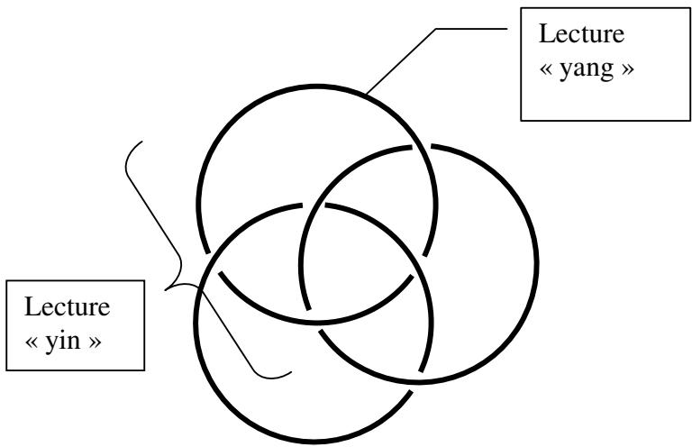

A la différence de l’ hexagramme qui doit changer successivement chacun de ses traits et selon les diverses combinatoires possibles, le nœ ud borroméen présente la combinatoire la plus condensée qui soit, puisque chaque rond, dans ce mode de lecture, se lit aussi bien comme \DQJ que comme son inverse \LQ. Une seule écriture du nœud borroméen peut donc condenser ce que le Yi King détaille en 64 figures. Encore est-il possible de développer ces écritures du nœ ud selon les diverses modalités de transformations possibles de l’ espace nœ ud, ce qui nous amène à un détail de 32 écritures.

Si la bande de Mœbius est une écriture du passage, le nœud borroméen se présente comme une combinatoire de deux ou trois bande de Mœ bius, selon le point de vue. Chaque croisement représente en effet la même opération qu’ une torsion. On y lit donc une approximation six fois répétée du caractère ZHQ , le texte, ou la langue, ou du caractèreMLDR, , le croisement, dont la semblance avec ce qu’ il désigne est frappante.

De même que chaque hexagramme n’ est finalement construit que de traits c'est-à-dire de bords, ce qui pourtant l’ amène à faire surface, de même, le nœud borroméen peut être lus comme ci-dessus seulement pour ses bords, qui sont les croisements du fil signifiant, ou comme ci-dessous, en tenant compte de la surface qu’ il circonscrit.

La fluidité du mouvement est alors représentée dans ce mouvement par lequel le retournement d’ un rond autour de la fixité des deux autres fait trou dans la surface (à gauche), tandis que l’ obstruction peut se lire dans le retournement suivant, par lequel ce qui se dit s’ écrit dans la mémoire (à droite) :

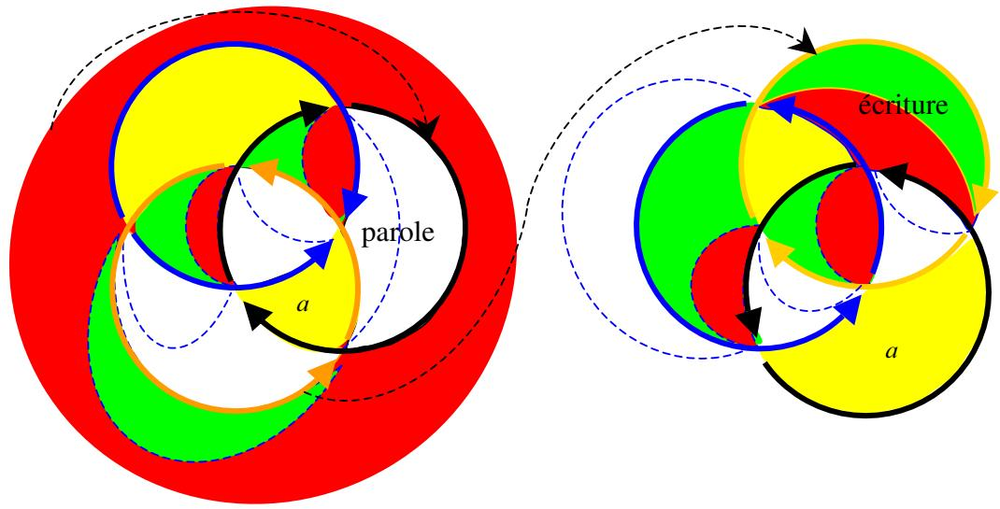

## /HV GHX[ ERUGV GH OD SDUROH

« Dans la pensée chinoise, les contraires ne s’ excluent pas7 ».

La grande découverte de Freud, c’ est d’ avoir su lire les formations de l’ inconscient comme formations de compromis entre des motions contradictoires. Le conflit de tendances contraires provoque ainsi le refoulement de l’ une d’ elles, qui ne cesse cependant de faire retour sous forme d’ écriture dans les rêves, les symptômes, les lapsi, les actes manqués. Mais elle fait retour sous forme masquée, étant obligée de se dissimuler pour satisfaire aux exigences de la motion refoulante. Ainsi Freud en est-il venu à distinguer dans les figures de l’ inconscient, le patent du latent, rejoignant la vieille opposition dont François Jullien nous dit qu’ elle fonde la sagesse chinoise depuis des millénaires.

Ceci est important, car au fond, la question est, pour les chinois comme pour nous : qu’ inscrit le trait ? Pour moi, dans le cadre de la psychanalyse, c'est-à-dire de ce qu’ écrit la théorie par le biais de cet outil qu’ est la topologie, le trait inscrit la linéarité de la parole. Et comme Lacan l’ avait inscrit d’ un double trait dans son graphe8 (VLJQLILDQWYRL[ HW MRXLVVDQFH FDVWUDWLRQ), je considère chaque trait comme double. Dans ce qui s’ entend, il y du patent, et au-delà, il y a du latent. C’ est bien là où l’ on retrouve la logique du Yi king : chaque trait dans l’ hexagramme, ne vaut que par sa place, et par son opposition au trait qui toujours en fera son envers : tout \DQJ patent est susceptible d’ être remplacé par un \LQ latent, et réciproquement. C’ est le point de vue qui fait de tel trait un patent, renvoyant l’ autre au latent. La topologie peut justement se définir comme une science des points de vue.

Autrement dit, chacun des bords peut se transformer en l’ Autre bord ce qui est la définition même d’ une bande de Mœbius : ∀xΦx. Quel que soit le bord il peut devenir l’ Autre bord, quel que soit un point x de ce bord, il appartient aussi à l’ autre bord, c'est-à-dire : quel que soit un point x, il appartient à cette coupure qui différencie une face de l’ Autre face, un bord de l’ Autre bord, et le patent du latent. Et finalement en étendant cette assertion à tous les traits de l’ hexagramme, on peut l’ étendre aussi à tous les points de la surface moebienne : quel que soit le point de la surface il appartient au bord, c'est-à-dire à la coupure.

Autrement dit, les contraires ne s’ excluent pas : ce point appartient à ce bord donc il n’ appartient pas à l’ Autre bord ; et pourtant, il appartient aussi à l’ Autre bord. Si la logique occidentale, depuis Aristote, fonctionne sur l’ exclusion des contraires, la topologie nous ramène en proximité avec la sagesse chinoise. La grammaire aussi, Lacan ayant attiré notre attention sur le travail de grammairien de Damourette et Pichon, lesquels distinguent la négation forclusive, sur laquelle se base la logique, de la négation discordentielle, qui affirme ce qu’ elle nie. On retrouve cette dernière aussi bien en topologie que dans les deux théorèmes de Gödel qui énoncent les limites de la mathématique, l’ une dans l’ irréductible de la contradiction (et la chose, et son contraire sont démontrées vraies), l’ autre dans l’ incontournable de l’ indécidable (impossible de trancher entre la chose et son contraire).

Ainsi trouvons-nous aussi deux façons d’ affirmer l’ universel de cette assertion (Φ) portant non sur le trait mais sur le changement d’ un trait en son contraire il y a deux façon de l’ exprimer : soit ∀x Φx, tout trait est \DQJ quelque part, même si actuellement il est \LQ, soit :∃xΦx, il n’ est pas de \LQ qui ne soit aussi potentiellement \DQJ. Ces deux universaux sont tempérés par leurs voisinages locaux : le premier, positif, est démenti localement d’ un ∃xΦx, il y a au moins un trait qui n’ est pas \DQJ, c’ est le \LQ sans lequel le \DQJ n’ aurait pas de sens (pas de ciel sans la terre), le second, négatif, est contredit localement d’ un∀x Φx, pas tous les traits sont yang, et ils ne se référent pas tous au yang.

Ceci n’ est que l’ énonciation d’ une bande de Mœ bius, sans qu’ il soit besoin d’ en écrire la lettre. Mais on peut aussi l’ écrire :

ou encore :

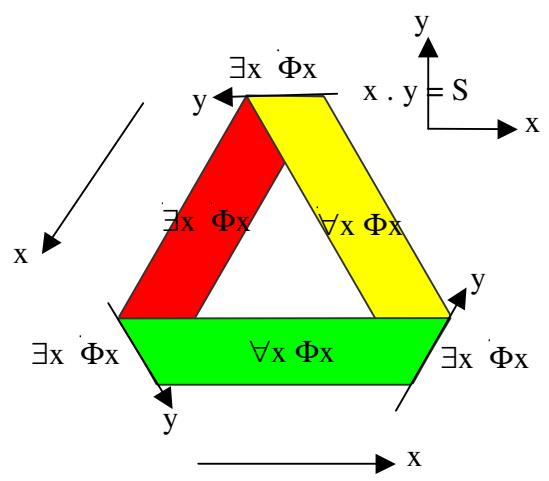

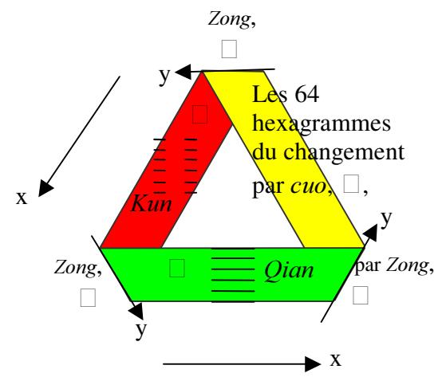

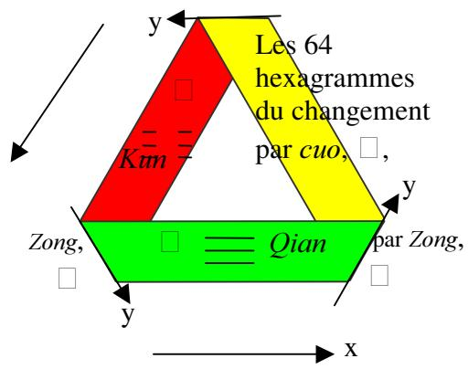

C’ est au niveau de ce paradoxe d’ une surface qui est en même temps une coupure, que l’ extrême originaire de la pensée chinoise rejoint l’ extrême terminal de la pensée occidentale, représentée aussi bien par la psychanalyse que par les mathématiques telles qu’ elles articulent elles-mêmes leur propre infinitude à l’ énoncé du théorème de Gödel. La jonction de ces deux extrêmes pourrait à son tour bien représenter le paradoxe de la recherche de François Jullien : les deux bords de la pensée, l’ occidental et l’ oriental, d’ être au plus éloigné l’ un de l’ autre, finissent par se rejoindre.

## /HV RSpUDWLRQV GX FKDQJHPHQW

Chaque hexagramme n’ est que l’ image du résultat d’ un changement en l’ attente d’ un autre changement. La bande de Mœbius écrit ce passage dans sa zone jaune, ce pourquoi j’ y ai inscrit – mais c’ est un abus de langage – les 64 figures du changements. Le nœud borroméen détaille deux surface jaunes ayant la même fonction. Il faut en effet plutôt considérer les deux modes d’ écriture des passages, celui par une surface qui n’ est que bord en elle-même, la surface jaune, et celui par la surface qui se transforme en une autre surface. Ceci correspond à ce que nous dit François Jullien des deux modalités de passage d’ une figure à une autre :

FXR, , inversion de chaque trait d’ une figure, de yang en yin ou de yin en yang. Cette opération est du côté de la métonymie.

=RQJ,  double retournement, entre haut et bas de chaque trigramme, et entre les deux trigrammes du haut et du bas. Cette opération est de l’ ordre la métaphore.

En effet, François Jullien fait remarquer :

© 2U j SDUWLU G¶HOOHV OHV VL[ SRVLWLRQV GH O¶KH[DJUDPPH VH QRXHQW GHV OLHQV VSpFLILTXHV HQWUH OHV GLIIpUHQWV WUDLWV GH OD ILJXUH 'HX[ W\SHV GH UHODWLRQ VRQW HQ HIIHW GpJDJpV TXL QH VRQW SDV VDQV UDSSHOHU OHV GHX[ D[HV PpWDSKRULTXH RX PpWRQ\PLTXH GH OD OLQJXLVWLTXH FRQWHPSRUDLQH 6RLW XQ WUDLW G¶XQ GHV GHX[ WULJUDPPHV FRPSRVDQW OD ILJXUH HVW SHUoX HQ UHODWLRQ DX WUDLW TXL RFFXSH XQH SRVLWLRQ DQDORJXH GDQV O¶DXWUH WULJUDPPH FI O¶D[H PpWDSKRULTXH «  VRLW HQFRUH XQ WUDLW HVW SHUoX HQ UHODWLRQ j FHOXL TXL VH WURXYH LPPpGLDWHPHQW j F{Wp GH OXL j O¶LQWpULHXU GX PrPH WULJUDPPH FI O¶D[H PpWRQ\PLTXHª

Les traits et les figures ne se lisent donc que dans leurs rapports, ce qui nous renvoie à la définition lacanienne du signifiant : un signifiant est ce qui représente un sujet pour un autre signifiant. Il n’ y pas d’ être du \DQJ pas plus qu’ il n’ y a d’ être du \LQ, mais il y a une immanence des changements entre l’ un et l’ autre. Le changement métonymique renvoie à la succession des signifiants dans l’ énonciation d’ une parole, qui ne saurait avoir lieu sans s’ articuler aux transformations métaphoriques faisant écriture au sein même de l’ énonciation parlée. Ce qui s’ entend dans ce qui est dit « évoque » quelque chose, cette chose qui n’ est pas dite mais s’ imagine aisément, sans être forcément la même chez le locuteur et l’ auditeur. A partir des même sons, chacun n’ écrit pas le même texte, et c’ est la source de tous les malentendus qui sont l’ essence de la communication, comme le dit Lacan.

Le transformation FXR permet donc de lire les traits de chaque trigramme comme les traits qui délimitent l’ écriture de la bande de Mœ bius : comme des signifiants. Un trait \DQJ qui se transforme en \LQ, c’ est un continu (bleu) qui se change en un brisé (rouge):

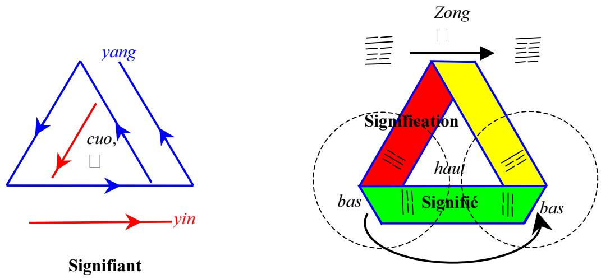

Un hexagramme considéré comme la combinaison de deux trigrammes suppose la prise en compte de la surface délimitée par le positionnement des traits côte à côte. Un pli représente cette articulation dépourvue de toute matérialité entre les deux trigrammes. La transformation ]RQJ s’ écrit par le glissement continu de l’ hexagramme d’ un pli vers le pli suivant.

Sans bien le dire et tout en se méfiant de la parole, en articulant ]RQJ et FXR, le Yi King établit une écriture des rapports de la lettre et du signifiant. Ainsi s’ écrit l’ immanence par laquelle la chose n’ est pas en dehors du discours, pas plus que celui qui l’ aurait créée.

Cependant le livre de François Jullien laisse une forte imprécision dans l’ exposé de ces transformations. L’ emploi d’ un mot pour un autre : inversion renversement, retournement, s’ il allège le style, ne facilite pas la compréhension. Ainsi après avoir donné la définition de ]RQJ à laquelle je me suis référé plus haut ; il énonce10: « les 64 hexagrammes forment 32 paires d’ hexagrammes inversés trait à trait (FXR), mais seulement 28 paires d’ hexagramme inversés haut et bas ». Il donne en effet un peu plus loin plusieurs exemples d’ inversion haut et bas « globale » (c’ est moi qui rajoute ce qualificatif) et ne tenant pas compte de la coupure locale en deux trigrammes. Si bien qu’ il semble qu’ on soit en présence de trois opérations distinctes et non deux, sans que cela soit explicite, d’ autant que dans la dernière phrase citées, il utilise le même mot « inversion » pour deux opérations différentes, ce qui ne contribue pas à la clarté.

S’ il existe cette troisième opération non-dite, il faudrait alors écrire l’ hexagramme entier sur une seule zone de la bande de Mœ bius et non à cheval sur un pli comme je l’ ai fait plus haut. Nous pourrions alors distinguer :

\- l’ inversion, FXR trait à trait

le retournement, ]RQJ, double entre de chaque trigramme et entre les deux trigrammes

le renversement, qui n’ a pas de nom chinois puisqu’ il est resté implicite, et qui serait la rotation globale de l’ hexagramme sur lui-même.

Mais à défaut de cette précision, il est impossible de s’ y retrouver dans les décomptes repris de Wang Fu Zi par François Jullien.

En fait il est vraisemblable qu’ il y ait beaucoup plus d’ opérations non-dites. J’ en prends pour exemple la transformation de SL en [LDQ, p. 113, qui consiste en un échange des 3ème traits de chaque hexagramme. Mais c’ est peut-être un exemple particulier de FXR, un changement trait à trait : le 3ème trait de chaque trigramme s’ inverse.

C’ est là où le Yi King manque de précision pour devenir une topologie. Mais on peut en dire autant à Lacan lorsqu’ il a amené la topologie dans son enseignement. On peut lui en vouloir, par exemple, de ne pas avoir formalisé la différence entre l’ objet et l’ écriture de l’ objet, alors qu’ il insiste par ailleurs sur ce qu’ il appelle le réel de l’ écriture, ce qui entraîne pas mal de ses successeurs à prendre l’ objet pour seul objet d’ études, comme s’ il ne s’ agissait pas d’ une écriture implicite.

## ,PPDQHQFH GX UpHO GH O¶pFULWXUH RX WUDQVFHQGDQFH G¶XQ 5pHO H[WpULHXU j O¶pFULWXUH "

Il y a cette sorte d’ ambiguïté dans le Yi King tel qu’ il nous est restitué par François Jullien : il s’ agit de l’ immanence du Réel nous explique-t-on. Alors il faut préciser : du réel de l’ écriture. Les sages chinois semblent laisser entendre qu’ il s’ agirait du réel comme tel. C’ est un réel comme tel en tant que l’ écriture engendre un certain nombre d’ impossibles, comme d’ écrire la troisième dimension. Qu’ on étende cette conception du réel à une transcendance à localiser dans ce qui est extérieur à l’ écriture, voilà qui reste à discuter.

Dans « un sage est sans idée », François Jullien écrit : « la philosophie conçoit, dirons-nous, (elle a un objet, la vérité) tandis que la sagesse réalise (le « le »/ « cela » de l’ évidence). Au sens où l’ on dit réaliser, ou plutôt ne pas arriver à réaliser que quelqu'un est mort ». Voilà un impossible en effet : avoir une représentation de l’ au-delà de la mort, ce pourquoi c’ est en effet si difficile à réaliser. La mort est un Réel un impossible à réaliser, au sens où on ne saurait non plus donner une représentation du vide, car toute représentation devient un plein, elle n’ est plus le vide dont il s’ agit de rendre compte.

François Jullien écrit (p. 75) : « réaliser, c’ est prendre conscience du caractère réel du réel ». Si on s’ en tient à l’ explicite des énoncés, il y a donc un grand écart à ce niveau là, entre sagesse orientale, qui tiendrait le réel pour réel, et la psychanalyse, pour laquelle le réel, c’ est l’ impossible. Mais si on considère que c’ est un jeu d’ écriture, le Yi King, qui en rende compte, l’ accord est au contraire remarquable. « Par exemple, poursuit François Jullien, que le temps passe, qu’ on vieillit, - ou simplement qu’ on est « en vie ». Car personne ne réalise vraiment qu’ il est promis à mourir, et pourtant chacun le sait ».

Réaliser qu’ on vieillit, et même qu’ on est en vie, cela ne suppose-t-il pas la mémoire, où les expériences V¶pFULYHQW les unes après les autres, et ne prenant sens que les unes par rapport aux autres ? Sans ces inscriptions, pas de mémoire, et pas de prise de conscience du temps qui passe. C’ est là où se trouve une remarquable congruence avec la psychanalyse, et notamment le concept de pulsion de mort, puisqu’ il est au fondement de la représentation. Cette dernière ne peut prendre que deux formes, le dire et l’ écrire, sachant que le dire ne vaut que, d’ une part, par rapport à ce qui est déjà écrit, d’ autre part, par ce qui reste à écrire, sachant que tout ce qui se dit s’ écrit (dans la mémoire), tandis que ce qui ne peut pas se dire ne cesse pas de chercher à s’ écrire (dans les formations de l’ inconscient).

« Réaliser », au sens de la sagesse chinoise telle que nous la transmet François Jullien, ça se trouverait donc fort proche du « symboliser » de la psychanalyse. Car c’ est justement la pulsion de mort qui est au fondement de la symbolisation : le meurtre de la Chose, expression hégélienne volontiers reprise par Lacan, le meurtre de la Chose est la voie (Tao, ) nécessaire à sa réalisation, c'est-à-dire à sa venue au monde du symbole, que nous appelons volontiers réalité.

Le « réaliser » rencontre cependant des impossibles, tels la mort (mais aussi la castration), et c’ est cela que la théorie lacanienne appelle le Réel. Il ne s’ agit pas d’ un Réel extrinsèque qui transcenderait la réalité symbolisée, mais justement une limite marquant les bords du territoire intrinsèque de la symbolisation. Qui dit limite dit trace, et nous sommes renvoyés à ce Réel de l’ écriture qui fait que, bien que lorsqu’ on soit en présence d’ un impossible à dire, il soit encore possible de l’ écrire, il n’ est pas possible de tout écrire.

Ne serait-ce que, tout bêtement, la 3ème dimension, qui ne cesse pas de ne pas s’ écrire, même si on en trouve des représentations (perspective, codages divers…).

Remarquons l’ étonnante congruence de ces deux modes d’ écriture, l’ hexagramme et la bande de Mœbius. Pour le premier, toute la surface qu’ il occupe n’ est définie que par des traits, et chaque trait peut à tout moment s’ inverser en son contraire. Pour la seconde, sa surface ne vaut que comme tension locale entre deux bords qui globalement s’ avèrent le même : autrement dit, là aussi, chaque bord local peut s’ inverser en l’ autre bord. C’ est pourquoi j’ appellerais volontiers « bords » les traits de l’ hexagramme, même ceux qui sont au milieu. Tout trait longeant le bord d’ une bande de Mœbius finit par revenir sur lui même au bout de deux tours, dégageant entre ses bords une bande de Mœbius identique à celle sur laquelle il s’ écrit. Ainsi se démontre l’ identité du trait et de la coupure, la bande de Mœbius comme telle s’ avérant de ce fait globalement comme une coupure. Ça ne l’ empêche pas localement de faire surface, comme l’ hexagramme.

De ces deux bords qui ne font qu’ un, le fait d’ écrire de la bande de Mœ bius, avec ses trois torsions, oblige à en passer par trois traits, deux rouges, un bleu :

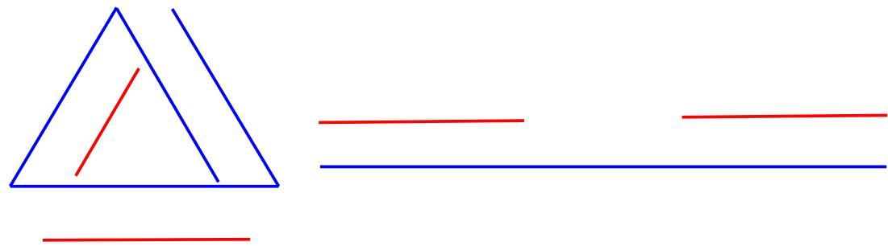

L’ écriture de l’ hexagramme se base sur cette opposition de deux bords, le yin et le yang, qui ne peuvent s’ écrire autrement que par WURLV traits. Tel est le réel de l’ écriture. En effet, nulle transcendance dans tout cela.

La seuls différence entre psychanalyse et sagesse orientale, serait de l’ ordre d’ une inversion : le sage se pense partie intrinsèque d’ un réel immanent, tandis que l’ analyste ne connaît pas d’ autre réel que celui de l’ écriture, à laquelle il est immanent dans le transfert à son analysant. La cure se déroule comme une suite de réels rencontrés au titre des impossibles à dire, noués aux impossibles à écrire. Tout comme l’ analyste est à l’ écoute de ce qui peut faire incitation et engendrement de la parole, le sage est dans l’ expectative des indices ténus du changement afin de l’ accompagner dans le continuel renouvellement du réel. Il ne manquerait à la sagesse chinoise qu’ à poser ce qu’ elle appelle le réel comme écriture et engramme de la perception ; il ne faudrait à l’ analyse qu’ à considérer son Réel comme immanence de la nature.

Considérons un peu plus loin les réels de l’ écriture… réels sans majuscule qui englobes les impossibles, tels que je l’ ai énoncé plus haut, mais aussi cette fois, les nécessaires, qu’ on pourrait dire encore : les impossibles de faire autrement.

## /HV UpHOV GH O¶pFULWXUH

En occident (mais peut-être en orient aussi) même un illettré sait faire un croix. C’ est ce qu’ on demandait comme minimum à ces derniers, pour signer leur contrat d’ engagement dans l’ armée.

Pour faire une croix, il faut faire un trait premier : – , puis lever la plume et, d’ un geste circulaire du poignet, venir la reposer en arrière pour barrer ce premier d’ un deuxième : +.

Ce qui s’ écrit, en marquant par des flèches la dynamique du mouvement :

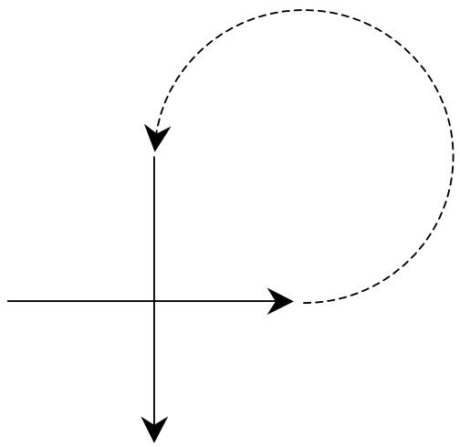

En général, on en reste là. Cependant, si on veut bien se rendre compte que le deuxième trait coupe le premier en passant forcément dessus, on peut écrire ce détail de mouvement et de temporalité, en introduisant deux petits vides :

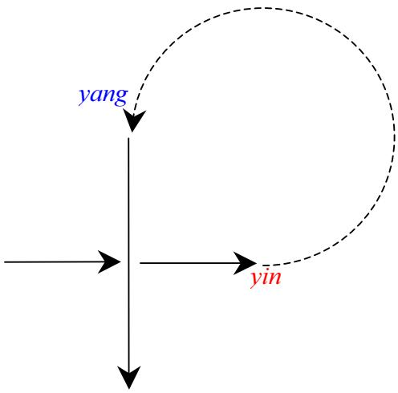

On obtient l’opposition du yin et du yang, dans la dynamique de leur croisement,MLDR, avec le yang, le pouvoir du ciel qui vient traverser le yin, la terre, pour la féconder. Ainsi le yin n’ est-il que l’ autre face du yang. Il y a deux écritures, mais c’ est le même mouvement qui va de l’ une à l’ autre. Ici, dans l’ écriture du croisement, le changement de dimension, c'est-à- dire le passage de x à y, correspond à ce que le Yi King écrit à deux traits différents, le trait continu, <DQJ et le trait discret, \LQ. Ceci engendre en effet de la surface, celle des objets du monde, puisque nous recouvrons le monde du quadrillage des significations :

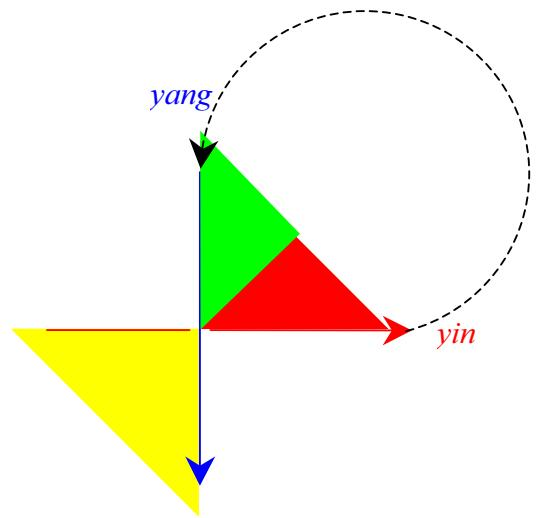

C’ est une autre façon d’ écrire la bande de Mœ bius. Les trois croisements y sont :

le croisement de l’ écriture avec le lever du poignet, moment où ça cesse de s’ écrire ; la plume quitte la terre pour le ciel.

le croisement de la plume avec, de nouveau, le papier, là où ça cesse de ne pas s’ écrire ; la plume quitte le ciel pour féconder la terre.

celui des deux flèches qui se recoupent, l’ une, \DQJ, qui ne cesse pas de s’ écrire, l’ autre \LQ, dans le milieu de laquelle ça ne cesse pas de ne pas s’ écrire.

Mais c’ est aussi l’ écriture d’ un des 6 croisements élémentaires du nœud borroméen.

Tout cela inscrit le sens du mouvement du monde (le croisement comme tel, jaune), en conférant à la surface ainsi délimitée, signifié (patent : vert) et signification (latent : rouge).

En écrivant le yang dans sa fonction de pénétration du yin, nous nouons la sagesse chinoise à Lacan, qui fait du signifiant la fonction phallique. Trois gestes différents sont nécessaires, pour écrire ce que nous impose le réel de l’ écriture, à savoir à présent : trois traits. Ce qui nous introduit au premier trigramme du Yi King. Là se retrouvent l’ orient et l’ occident. Il faut toujours un 2ème trait pour recouper le premier, ce qui isole entre eux, qui sont les signifiants, une surface, celle du signifié, qui du coup se révèle lettre.

4LDQ, le « tout yang » serait équivalent du « tout signifiant » dans son registre métonymique, celui du glissement incessant d’ un mot à un autre, la métonymie, les bords, tandis que .XQ, le « tout <LQ », représenterait la métaphore, là où ça se bloque, où ça s’ épaissit, où ça se prend dans les glaces de la surface. <DQJ est l’ acoupure qui, rappelée de façon régrédiente sur elle-même, devient la coupure du <LQ. Il n’ y a jamais de « tout signifiant », au même titre qu’ il n’ y a jamais de « tout yin » ou de « tout yang ». Pas de métaphore sans métonymie.

Pas de ciel (<DQJ) sans terre (\LQ). Pas de fonction sans objet. Pas d’ écriture sans support. Or, le support de l’ écriture est déjà une écriture. Il faut avoir délimité dans l’ espace le lieu de l’ écriture. On le fait par des traits, qui sont écriture. Toute écriture est donc écriture sur l’ écriture, la première ressemblant à l’ objet support, au point qu’ on la prend pour un objet. De ce point de vue, elle ressemble aux caractères chinois qui présentent quelques similitudes avec l’ objet qu’ ils représentent, même s’ il s’ agit d’ une similitude d’ après-coup. Car tout objet dans la nature n’ est présent à la perception que si cette perception « brute » est recoupée par une représentation, elle-même divisée en représentation de chose et représentation de mot.

La terre reçoit le ciel, elle est fille du ciel. De même, l’ écriture comme support reçoit l’ écriture comme telle. Le croisement, la croix d’ où je suis parti, en rend compte.

Deux figures WDL et SL (, passage  obstruction - je ne suis pas sûr de l’ idéogramme) équilibrent le \LQ et le \DQJ en les répartissant harmonieusement entre les deux trigrammes, celui du haut et celui du bas. Or le passage, lieu où se croisent le Ciel (yang) et la terre (yin), se nomme justement en chinois le « croisement »,MLDR : . Nous retrouvons la figure de base de la topologie, le croisement dont je viens de parler, qui se lit aussi bien comme croisement des ficelles d’ un nœud et torsion de la bande de Mœbius. Ici la similarité avec l’ écriture chinoise s’ impose : le sinogramme présente en effet un croisement sous un toit. Ça pose la question du rapport de ces «figures » ([LDQJ : ) avec l’ écriture comme telle ([Lp :). Pour les commentateurs du Yi king, ces figures et leurs transformations sont le Réel.12

Il y a 64 figures. Or les transformations du borroméen sont, à partir du nœud réel :

\- 4 figures de base qui font huit par dédoublement haut-bas.

\- 8 écritures de chacune par retournement local d’ un rond.

Ce qui fait bien au total 64 figures, lorsque les ronds sont distingués l’ un de l’ autre par une écriture.

\- Mais ça se réduit à 32 dans la mesure où deux séries se recoupent.

La base du nœ ud borroméen est bien de six traits, dont toujours trois yin (dessous) et trois yang (dessus).

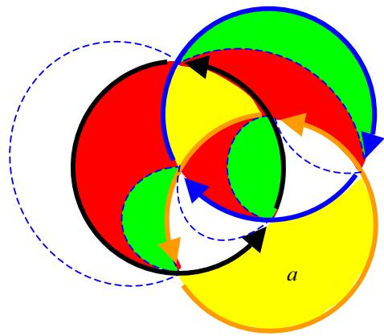

L’ accent est mis ici non sur la signification de chacun de ces 64 hexagrammes, mais sur les modalités de passages de l’ un à l’ autre. C’ est une interrogation sur la fonction plus que sur l’ objet.

Je retiens qu’ il y a aussi 6 modalités de construction des sinogrammes ;

La question qui se pose serait celle du rapport de ces écritures avec celles qui nous servent couramment d’ écriture, en occident et en Chine.

/DFDQ ' XQ \$XWUH j O DXWUH VpDQFH GX  0DL 

/H UHJDUG GDQV WRXWH VRQ DPELJXwWp TXH M DL GpMj WRXW j O KHXUH PDUTXpH j SURSRV GX UDSSRUW j OD WUDFH O HQWUHYX HW SRXU WRXW GLUH OD FRXSXUH GDQV OH YX OD FKRVH TXL V RXYUH DXGHOj GX YX DVVXUpPHQW O DFFHQW j PHWWUH VXU O pFULWXUH HVW FDSLWDO SRXU OD MXVWH pYDOXDWLRQ GH FH TX LO HQ HVW GX ODQJDJH HW TXH O pFULWXUH VRLW SUHPLqUH HW GRLYH rWUH FRQVLGpUpH FRPPH WHOOH DX UHJDUG GH FH TXL HVW OD SDUROH F HVW FH TXL DSUqV WRXW SHXW rWUH FRQVLGpUp FRPPH QRQ VHXOHPHQW OLFLWH PDLV UHQGX pYLGHQW SDU OD VHXOH H[LVWHQFH G XQH pFULWXUH FRPPH OD FKLQRLVH R LO HVW FODLU TXH FH TXL HVW GH O RUGUH GH O DSSUpKHQVLRQ GX UHJDUG Q HVW SDV VDQV UDSSRUW j FH TXL V HQ WUDGXLW DX QLYHDX GH OD YRL[ j VDYRLU TX LO \ D GHV pOpPHQWV SKRQpWLTXHV PDLV TX LO \ HQ D DXVVL EHDXFRXS TXL QH OH VRQW SDV FHFL pWDQW G DXWDQW SOXV IUDSSDQW TXH GX SRLQW GH YXH GH OD VWUXFWXUH GH OD VWUXFWXUH VWULFWH GH FH TX LO HQ HVW G XQ ODQJDJH QXOOH ODQJXH QH VH WLHQW G XQH IDoRQ SOXV SXUH TXH FHWWH ODQJXH FKLQRLVH R FKDTXH pOpPHQW PRUSKRORJLTXH VH UpGXLW j XQ SKRQqPH

& HVW GRQF ELHQ Oj R o DXUDLW pWp OH SOXV VLPSOH VL O RQ SHXW GLUH TXH O pFULWXUH QH VRLW TXH WUDQVFULSWLRQ GH FH TXL V pQRQFH HQ SDUROHV TX LO HVW IUDSSDQW GH YRLU TXH WRXW DX FRQWUDLUH O pFULWXUH ORLQ G rWUH WUDQVFULSWLRQ HVW XQ DXWUH V\VWqPH DXTXHO pYHQWXHOOHPHQW V DFFURFKH FH TXL HVW GpFRXSp GDQV XQ DXWUH VXSSRUW FHOXL GH OD YRL[

## /¶REMHW D  XQH pFULWXUH GX IRQGV G¶LPPDQHQFH

« En quête d’orthodoxie, (Zhu Xi), la tradition néo confucéenne donnera un nom à cet insaisissable , qui est en même temps le plus quotidien,et le plus concret , et qu’ on ne cesse d’ avoir à « réaliser » : ce nom, on le connaît déjà, c’ est le « juste milieu »(de la régulation)13. »

J’ ai été frappé par cette définition, venant après quelques développements concernant la « réalisation » dont j’ ai parlé plus haut. Non seulement elle correspond exactement à celle que Lacan donne de l’ objet a, mais encore, elle se confirme de la structure du mouvement de l’ écriture du nœud borroméen telle que je l’ ai établie.

On l’ a vu, il n’ y a pas d’ écriture du milieu de l’ hexagramme. Si chaque trigramme a son milieu, l’ hexagramme n’ en a pas. Or c’ est au milieu de cet hexagramme particulier qu’ est l’ écriture du nœud borroméen que Lacan a inscrit l’ objet D. je l’ écris au contraire sur un bord de cette figure et on me demande souvent : pourquoi le mettez-vous u bord alors que Lacan l’ avait mis au centre ? Alors je réponds : parce que l’ objet D est partout. Il est au centre de la structure d’ un point de vue idéologique, et c’ est ce que Lacan a voulu écrire. De la même façon le « juste milieu » ne s’ écrit pas, et surtout pas au centre de l’ hexagramme. La structure des mouvements du nœud, lorsqu’on fait tourner un rond autour des deux autres, et chacun successivement dans une syntaxe définie, s’ avère laisser hors de son champ deux zones qui restent ainsi désorientée, mais de ce fait, matérialisent les deux axes de rotation autour duquel se manifestent ces mouvements du nœud ; tel est le « juste milieu » du nœud borroméen, qui s’ avère nulle part et partout à la manière de l’ objet D. Je ne l’ inscris en bas et à droite, dans cette figure standard, que parce qu’ il s’ agit de son emplacement au 6ème retournement, c’est-à- dire lorsqu’ on a acquis la certitude que la coupure ne pourrait jamais passer à cet endroit là, et que donc, il fait coupure, cet endroit là, il fait trou d’ inorientable dans le reste de la surface en tant qu’ orientée.

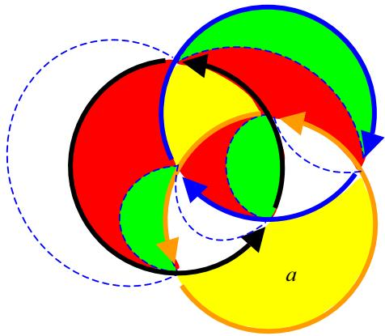

Tel le milieu de l’ hexagramme, il reste une écriture en creux de ce qui ne cesse pas de ne pas s’ écrire. François Jullien en donne une définition qui correspond exactement, et au « ça » de Freud, et à l’ objet D de Lacan, et à mon écriture de la surface désorientée : « Il faudrait pouvoir laisser ce « le »/ « cela » à son indétermination réussissant à dire l’ ajointement de l’ étalé et du caché – cela même qui, au sein de l’ expérience la plus ordinaire, , en demeure inobjectivable, et dont on a à réaliser l’ évidence : c’ est lui que j’ ai commencé d’ appeler le IRQGV G¶LPPDQHQFH ; et c’ est lui, que je ne cesse moi-même de vouloir saisir ici, par tous ces biais successifs, puisqu’ il ne peut être objet de discours, en travaillant à sa réappropriation par la philosophie ».

Indétermination : inorientation

Ajointement : le littoral entre surface rouge (caché) et verte (étalé), sans matérialité aucune, pure coupure qui s’ étale dans les surfaces jaunes.

Inobjectivable : les surfaces jaunes, écrivant théoriquement cet objet sans écriture qu’ est l’ objet a.

Dont on a à réaliser l’ évidence : dont on a, en psychanalyse, à évider toute représentation qui le recouvre afin de réaliser la place du vide. Ce dont François Jullien s’ acquitte semble-t-il, dans cet énoncé.

## 'H OD &KLQH j O¶RFFLGHQW O¶HQMHX GX GpEDW  G¶XQ DXWUH j O¶\$XWUH

La nuit précédant notre colloque, j’ ai fait le rêve suivant :

'HX[ SURIHVVHXUV IUDQoDLV VRQW HPSOR\pV HQ &KLQH &¶HVW OH GpEXW GH OD UpYROXWLRQ FXOWXUHOOH 2Q OHXU IDLW FRPSUHQGUH SDU GLYHUVHV YH[DWLRQV TX¶LOV VRQW LQWHOOHFWXHOV TX¶LOV VRQW pWUDQJHUV EUHI TXH OHXU SODFH Q¶HVW SDV Oj ,OV WLHQQHQW OH FRXS WDQW TX¶LOV SHXYHQW MXVTX¶j FH TX¶XQ ELOOHW RIILFLHO DQQRQFH j O¶XQ G¶HX[ TX¶LO SHXW SDUWLU DYHF OH FKqTXH GH  <XDQV TXL DFFRPSDJQH OD OHWWUH  RQ OXL SURPHW TXH OH JRXYHUQHPHQW FKLQRLV SDLHUD OH UHVWH GH FH TX¶RQ OXL GRLW XQH IRLV TX¶LO VHUD UHQWUp HQ )UDQFH  \XDQV F¶HVW XQH PLVqUH PDLV XQ WLHQW YDXW PLHX[ TXH GHX[ WX O¶DXUDV UHQWUHU HQ )UDQFH DYHF F¶HVW SUHQGUH OH ULVTXH GH QH SDV YRLU OD FRXOHXU GX UHVWH PDLV UHVWHU F¶HVW SUHQGUH OH ULVTXH GH SHUGUH ELHQ SOXV HQFRUH 4XHIDLUH "

,OV HQ VRQW Oj GH OHXU LQWHUURJDWLRQ ORUVTXH LO HVW TXHVWLRQ GH GHX[ FRQIpUHQFHV TX¶LOV GRLYHQW GRQQHU GDQV XQH YLOOH RX XQ YLOODJH G¶j F{Wp \$ FH PRPHQW LO QH V¶DJLW SOXV GH GHX[ SURIHVVHXUV IUDQoDLV LO V¶DJLW GH PRL HW G¶XQH GH PHV DQDO\VDQWHV XQH FKDUPDQWH NDE\OH DX[ JUDQGV FKHYHX[ IULVpV OXL WRPEDQW GDQV OH GRV j O¶DOOXUH WUqV IUDQoDLVH /¶DXWUH FRQIpUHQFH F¶HVW HOOH TXL GRLW OD IDLUH \$OORQVQRXV \ DOOHU " O¶KpVLWDWLRQ GXUHMXVTX¶j O¶KHXUH GH OD GLWH FRQIpUHQFH  j FH PRPHQWMH PH GpFLGH MH YDLV \ DOOHU MH VHUDLV HQ UHWDUG PDLV WDQW SLV (Q FDWDVWURSKHMH UHJDUGH TXHO VLqJHMH SRXUUDLV PHWWUH GDQV OD YRLWXUH«LO \ D GHV FROOHFWLRQV GH VLqJHV FRORUpV GHV VLqJHV DWWDFKpV OHV XQV DX[ DXWUHV FRPPH GDQV XQH VDOOH G¶DWWHQWH PDLV WRXV VRQW GpPRQWpV LO VXIILUDLW TXH MH MHWWH OHV SLqFHV HQ YUDF HW HQ YLWHVVH HQ YRLWXUH« PDLV MH PH GLV TXH TXDQG PrPH LOV GRLYHQW DYRLU FH TX¶LO IDXW VXU SODFH &¶HVW TXDQG PrPH SDV j PRL G¶DSSRUWHU OH PDWpULHO 0D YRLWXUH F¶HVW XQH '6 GHV DQQpHV VRL[DQWH JULVH FRPPH FHOOH GH PRQ SqUH -¶HVVDLH GH GpPDUUHU HW ULHQ QH VH SDVVH FRPPH VL OD EDWWHULH pWDLW FRPSOqWHPHQW YLGH 2UMH VDLV TXH FH Q¶HVW SDV SRVVLEOH PD EDWWHULH DOODLW WUqV ELHQ -H VXSSXWH GRQF DXVVLW{W XQ VDERWDJH GHVWLQp j P¶HPSrFKHU GH GRQQHU FHWWH FRQIpUHQFH

L’ enjeu de notre débat est tout entier dans ce rêve, du moins tel qu’ il me touche personnellement. Mais s’ il ne me touchait pas personnellement qu'est-ce que je ferais ici ? et si nous n’ étions pas touché personnellement, à des degrés divers, que ferions nous tous dans cette salle à parler de la Chine, même si nous choisissons d’ en parler sous la forme d’ un aller et retour culturel. C’ est, je crois la position de François Jullien : la Chine nous intéresse car, à l’ interroger, nous sommes obligés de repenser notre propre culture.

Ceci est un propos de philosophe, éventuellement d’ ethnologue, ou de sociologue. Qu’ en est-il du propos du psychanalyste ? Peut-il être le même ? Que veut dire parler en psychanalyste, ou même au nom de la pratique de la psychanalyse, par rapport au discours philosophique, au discours sociologique, ethnologique, voire psychiatrique ?

Voilà les questions qui se posent. Voilà ce qui est en jeu : à quel autre je parle, voilà qui peut me revenir sous la forme d’ un : du coup, de quelle place je parle ? suis-je à moi tout seul toutes les places du discours ? vais-je emporter avec moi les sièges destinés à mon audience ?

Parler en psychanalyste est un impossible. Le psychanalyste ne parle pas il écoute ; s’ il parle, et il parle parfois, c’ est pour dire ce qu’ il a entendu. C'est-à-dire, pour dire à quel endroit sa carapace de protection narcissique a été particulièrement effractée… parce que c’ est ça, entendre, c’ est lorsqu’ on se laisse altérer : lorsque l’ autre a trouvé une voie de pénétration par le biais de sa voix, parce qu’ il n’ y en a que peu d’ autres. Un rêve de l’ autre ne peut être transmis que par le biais de la voix. Si on ne s’ est pas laissé altérer, c’ est qu’ on continue de considérer l’ autre comme un simple support de son narcissisme. Et pourquoi pas, mais ce n’ est pas la fonction du psychanalyste.

Alors, il peut être en effet très intéressant de définir l’ autre. Et, retour du retour, c’ est de se poser la question de ce que l’ autre m’ apprend sur moi.

François Jullien en retire cette différence pour lui essentielle entre la philosophie et la sagesse, se demandant entre autres pourquoi a échoué en Chine, la tentative des mohistes qui, à peu près à la même époque qu’ aux débuts de la philosophie en Grèce, cherchaient à dégager une doctrine forclusive, c'est-à-dire quelque chose de l’ ordre de la logique d’ Aristote, celle qui exclut a contradiction.

Au lieu de cela, la sagesse – dite par moi discordentielle - implantée depuis bien plus longtemps, a selon lui, continué d’ étendre son empire.

A la suite de Freud Lacan pose une définition lapidaire (pour en revenir à la pierre de la topologie dans le jardin de la psychanalyse) : « l’ inconscient, c’ est le discours de l’ Autre », m’ Autre avec un grand A, pour l’ opposer à l’ autre avec un petit a, l’ autre mon semblable, celui auquel je m’ adresse tous les jours quand je parle. Il complétait cette définition d’ un : » il n’ y a pas d’ Autre de l’ Autre », dans lequel il faut entendre ce qu’ il comprenait de l’ immanence, ce par quoi il fait se rejoindre, sans avoir jamais été explicite là-dessus, psychanalyse et sagesse chinoise.

« Il n’ y a pas d’ Autre de l’ Autre », ça signifie que lorsqu’ on croit parler de l’ autre, c’ est de l’ Autre dont il est question, c’ est cet Autre intrinsèque qui s’ exprime dans la bouche du sujet clivé. Aussitôt, ej suis obligé de corriger mon propos en précisant : ce que je viens de dire de la signification de cette phrase de Lacan, ce n’ est pas ce que Lacan en comprenait comme je l’ ai dit tout d’ abord, c’ est ce que j’ ai compris de ce que Lacan en a dit. Et c’ est là que se profilent des bagarres homériques avec mes camarades lacaniens, qui auront, eux, compris autre chose. Le caractère forclusif de notre mode de pensée, ce qui lui donne son côté paranoïaque, nous fait, en occident, réagir ainsi : une assertion ne peut se supporter de l’ assertion contraire. Et chacun de se battre pour défendre sa façon d’ asserter ; la psychanalyse pourtant, comme sure nous apprend à reconnaître ce clivage du sujet qui fait coexister les assertions contradictoires. Le moindre rêve se présente comme un compromis entre affirmations contradictoires. Et j’ attribue à l’ Autre celle qui me semble la plus détestable. Pourtant, c’ est moi qui rêve, c’ est moi le metteur en scène qui distribue les rôles, qui fait se mouvoir et parler tous les personnages du rêve.

L’ admettre, telle est la sagesse qu’ offre à l’ analysant la terminaison de sa cure. Ainsi, dans mon rêve, je rêve de la Chine. J’ y suis allé, je dois y retourner, mais ce n’ est pas la Chine qui se trouve dans mon rêve, c’ est l’ endroit où elle m’ interpelle. Je crois qu’ il s’ agit de l’ autre, mais il s’ agit de l’ Autre intrinsèque. J’ attribue aux chinois une sacré résistance à la psychanalyse, propos qui est déjà venu dans nos débats sous la forme d’ indifférence à la psychanalyse. Je ne sais ce qu’ il en est de celui qui a promu cette formule, je lui laisse le soin de s’ en expliquer ; quant à moi, je me vois forcé de reconnaître ici, que c’ est moi qui résiste à aller faire des conférences en Chine. Le saboteur de la déesse, c’ est moi et personne d’ autre. Aucun autre autre à cet Autre qu’ en moi je faisais chinois. Immanence du rêve.

Comment parler en psychanalyste ? On ne le peut pas. Dès qu’ on parle, on est analysant. Mais témoigner de sa pratique d’ analysant c’ est encore le meilleur moyen de transmettre la psychanalyse, beaucoup plus que parler en philosophe, en ethnologue, ou en psychiatre. Le seul cas dont, à mon sens il peut être question pour un dit psychanalyste qui prend la parole, c’ est le sien : c’ est la voie ouverte par Freud dans sa 7UDXPGHXWXQJ aussi bien que dans sa « psychopathologie de la vie quotidienne ». C’ est son Tao. Auteur du livre, Il est toujours l’ acteur princeps des rêves, lapsi, et actes manqués sur lesquels porte son étude. Il montre d’ ailleurs finement au début de la Traumdeutung, de quoi est faite sa méthode, qui se distingue, dit-il15, de toutes les autres en ce qu’ elle confie au rêveur le soin d’ interpréter ses propres rêves.

Pas d’ autre de l’ Autre : je pourrais vous parler de l’ analyse que cette jeune femme kabyle est en train de faire avec moi. Mais, sous couvert de parler d’ elle, je ne vous parlerais en définitive que de moi, puisque c’ est le sujet qui par ma voix s’ exprime, ce n’ est pas elle. J’ arrête donc de me tromper d’ autre, et je peux ainsi parler de l’ Autre intrinsèque, ce qui est le contraire que d’ en revenir au narcissisme, puisque c’ est reconnaître l’ endroit où je me suis laissé altéré par l’ autre, et qui se manifesté sous la forme du discours de l’ Autre.

Je n’ ai jamais vécu longtemps en Chine au contraire de cette jeune femme, qui vit en France, étrangère menacée d’ expulsion. Sans en faire un plat d’ ailleurs : elle ne parle presque pas de ses déboires liés aux papiers, mais beaucoup de ses problèmes liés aux hommes. Ce qu’ elle vit, je ne peux en parler à sa place et pourtant, dans mon rêve, je vis quelque chose de similaire. Mais est-il vraiment question du statut des étrangers ? Ne serait-il pas question tout simplement du statut de l’ Autre intrinsèque, celui qu’ on ne cesse pas de chercher à expulser dans cette opération que Freud a nommé le refoulement ? Si j’ ai été touché à cet endroit, n’ est-ce pas justement qu’ il s’ agit du même problème chez elle et chez moi ? J’ en laisse la question ouverte. L’ important était d’ avoir pu la poser.

La résistance que j’ attribue aux chinois, c’ est une résistance par rapport à une conférence que je dois faire ; or si vous vous rappelez bien le rêve, Ounissa doit aussi faire sa propre conférence. Pas d’ Autre de l’ Autre, si quelqu'un doit parler d’ elle, c’ est elle. Mais si je dois parler de moi, alors c’ est là que se fait jour la plus grande résistance, que j’ attribue à mes auditeurs, ces auditeurs que vous êtes aujourd’ hui, gens qui vous intéressez à la Chine, et que j’ ai transformé dans mon rêve en chinois.

Comme vous le constatez, parler en analysant, ce n’ est pas parler en philosophe, ni en mathématicien, ce que parfois je me prends à essayer de faire, et ce pourquoi je ne suis guère plus doué que pour parler de philosophie.

Allons donc un peu plus loin. Je vous ai dit que la DS était la voiture de mon père dans ces années soixante, et même de la fin des cinquante. Ça me renvoie donc à mon enfance, même si elle est réactivée par la présence actuelle de Citroën en Chine. Je rêve de DS, pas de ZX, la voiture la plus présente dans les rues de Pékin. Il paraît qu’ on a repéré, - notamment Merleau-Ponty16 – ce qui serait la puérilité de la pensée orientale. Ça tombe bien, puisque Freud est celui auquel on doit d’ avoir repéré la puerilité de la pensée occidentale… enfin, de toute pensée puisque : « l’ inconscient, c’ est l’ infantile en nous ».

Ce sabotage de la DS va m’ empêcher de parler, une des formes les plus commune de ce qui est vécu comme castration. Il est donc vraisemblable que c’ est ce que vit Ounissa, à travers l’ identification que présente mon rêve, puisque le sabotage la touche autant que moi. Mais la castration, ce serait vraiment de lui couper la parole en continuant à croire que je parle d’ elle, alors que je ne parle que de l’ endroit où elle m’ a touché.

Et comme la castration touche cette voiture qui est à mon père, c’ est qu’ il s’ agit de ma mère, la déesse de mon enfance. Bien sûr, celle-là, seul mon père avait le droit de la conduire. La castration la touche : il s’ agit bien de la panne de la voiture. Mais elle me touche aussi : je ne pourrais pas conduire la voiture de mon père pour aller parler, c'est-à-dire faire valoir la fonction phallique. Et pourtant j’ en ai le désir, comme j’ ai eu le désir du petit Œdipe, puisque malgré les menaces je choisi de rester en Chine et d’ aller faire ma conférence. Voilà les deux assertions contradictoires qui contribuaient à la mise en scène de mon rêve : un désir de parler et le désir de ne rien dire de ce qui fait l’ os, comme dirait Lacan l’ os de la psychanalyse. Voilà où je rejoins l’ élargissement (par les lettres) et la retenue (par les rites)17.

La question est donc, au-delà de l’ indifférence de la Chine à la psychanalyse, la question de l’ indifférence de la philosophie, et surtout, la question de l’ indifférence de la théorie analytique elle-même, une théorie qui serait complètement détachée de la pratique, désaffectée, en quelque sorte, en tant qu’ elle se situerait sans cesse dans la transcendance de la pratique. Tandis qu’ une pratique d’ analysant telle que je viens de vous la proposer, c’ est une pratique de l’ immanence, telle que, je crois, on peut la retrouver dans ce que j’ ai compris de ce que François Jullien nous restitue de ses lectures des sages chinois.

Ici et là se retrouve le même paradoxe : au Yi King, qui écrit les figures de l’ immanence, correspondrait la topologie, deux méthodes d’ écritures permettant de parler d’ une pratique de l’ immanence, chaque trait pouvant s’ inverser en son contraire, comme chaque trait d’ Eros, qui peut apporter jouissance ou douleur selon l’ endroit où il frappe.

Paris, le 7 novembre 2003