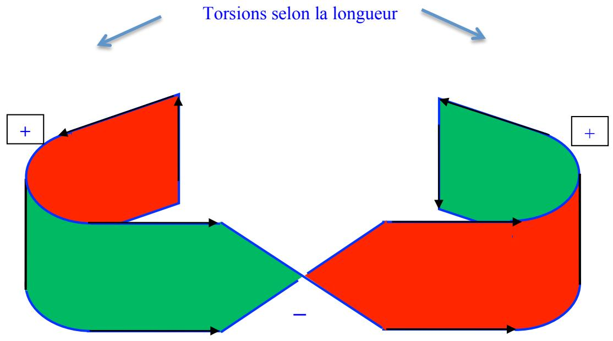
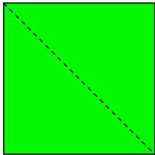
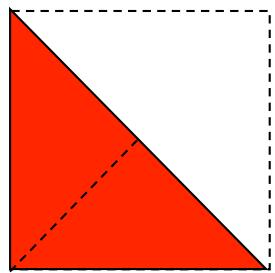
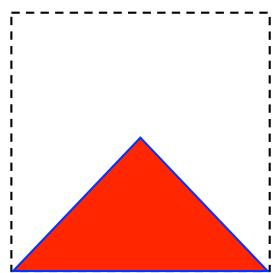
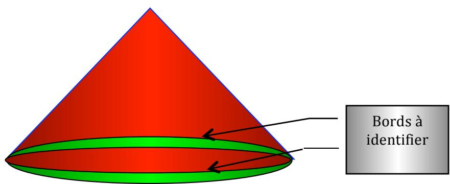

## Précisant les démonstrations 2 et 3 des trois torsions de la bande de Moebius

Le 24 novembre 2012, en exposant une nouvelle fois la théorie des trois torsions au groupe de travail composé de Marie-Laure Caussanel, Michel Thomé, et François Duchène, je me suis aperçu, notamment grâce à la remarque de Marie Laure, qu’on pouvait préciser de la manière suivante : il faut mieux définir ce qu’est une torsion. Jusqu’à présent, je disais : c’est la fonction qui fait passer d’une face à l’autre. C’est juste. Mais on peut préciser : c’est la fonction qui inverse la troisième dimension, celle qui n’est pas dans la page d’écriture, de $+ \ z$ ${ \dot { \mathbf { a } } } - \mathbf { z } . \operatorname { O r } ,$ ceci ne peut se produire sans l’inversion des autres dimensions qui construisent la surface, x et y. « La » torsion, celle que tout le monde fait en préparant une bande de Moebius consiste à inverser la largeur, soit + y en – y. Là dessus, tout le monde sera d’accord. Le raboutage, que tout le monde insiste à appeler « pli » et non torsion, consiste à inverser deux fois la longueur, soit + x en – x. Or si, d’une point de vue intuitif on différencie longueur et largeur en disant : la longueur est plus grande que la largeur, quelle différence intrinsèque y at-il entre les deux dimensions de toute surface ? D’autant que, en topologie, la mesure devrait nous être indifférente. L’inversion de la largeur inverse aussi la profondeur, soit le troisième dimension, z, faisant apparaître le dessous. L’inversion de la longueur inverse de la même façon la profondeur, faisant aussi apparaître le dessous. C’est exactement la même chose. Par conséquent je demande à ceux qui insistent à appeler « pli » les deux torsions de raboutage, afin de nier qu’elles soient torsions : quelle est, selon vous, la différence ? Comment définissez-vous alors la torsion, de façon à la distinguer du pli ?

  
Torsion selon la largeur

Toute torsion inverse la troisième dimension, et cela s’accompagne aussi de l’inversion de, soit l’une, soit l’autre, des deux dimensions de la surface.

La construction qui va suivre de la bande de Moebius carrée vient à l’appui de cette remarque : là, plus de différence de mesure entre les dimensions. D’ailleurs, les contraintes ainsi générées font disparaître toute différence entre pli et torsion. Ici, on n’a le sentiment de ne faire que des plis. Ils sont tous identiques et pourtant, ce sont des torsions.

(Ajout du lundi 3 décembre 2012)

## Démonstration	  3 :	  travail	  manuel :	  construction	  de	  la	  bande	  de	  Mœbius	  carrée

Raccourci qui signifie : construction de la bande de Mœbius à partir d’un carré. Vous avez remarqué que ce qui caractérise une bande, la bande la plus commune, celle qui nous sert à construire les bande de Mœbius, c’est l’inégalité de la mesure de ces bords. Nous partons habituellement d’un rectangle. Essayez d’effectuer les trois mouvements de torsion indiqués plus haut à partir d’un carré ! Vous constaterez que vous manquez sérieusement d’amplitude pour votre mouvement. Une métaphore du blocage névrotique dans un symptôme ? Pourquoi pas…certains, qui se veulent très carrés, en morale ou en métaphysique, en logique ou en mathématique, peuvent y faire penser.

C’est pourtant possible, avec un peu d’astuce :

Plions le carré selon une diagonale (une torsion, +) : dans l’écriture (point de vue du plieur), c’est l’Autre face qui apparaît. Ça fait une torsion.

Plions le triangle obtenu selon la diagonale opposée. C’est une autre portion de l’Autre face qui apparaît. Ça fait deux torsions (encore une torsion, +).

Si nous avons pris soin de colorier l’une et l’Autre, nous pouvons repérer, dans les quatre bords qui constituent la base du triangle obtenue, ceux qui font bord d’Une face, et ceux qui font celui de l’Autre face.

Ils sont opposés deux à deux. Pour identifier une face et l’Autre face, il suffit de coller une bande de scotch qui, enjambant un bord, réunit les bords de part et d’autre. Pour effectuer correctement cet office, la bande de scotch doit présenter une pliure : c’est la troisième torsion (-). On vérifie qu’on a bien construit une bande de Mœbius, en effectuant une coupure à deux tours dans l’objet obtenu. Il en tombe en effet un bilatère et une bande de Mœbius, plus aisément reconnaissable comme telle, puisqu’elle a acquis par cette opération la dissymétrie de bords que nous lui connaissons habituellement.

Ayant analysé le mode construction de son objet, le sujet peut encore une fois le jeter à la poubelle, avec son carré sophistiqué.