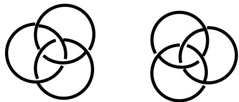  
qui sont les deux possibilités immédiates d’écriture, traditionnellement nommées le lévogyre et le dextrogyre.

Richard Abibon

# UNE THÉORIE DE LA DIMENSION, ILLUSTRÉE PAR L’ÉCRITURE DU NŒUD BORROMÉEN

## LES TROIS DIMENSIONS DE L’ESPACE-NOEUD

## Gyrie

Dans l’espace à trois dimensions, l’espace euclidien sensible , il n’y a qu’un seul nœud borroméen. En d’autres1 termes, il n’y a qu’une immersion du nœud borroméen, qui, dans l’espace à trois dimensions, a lui-même trois dimensions. Sa mise à plat, c'est-à-dire son plongement dans un espace à deux dimensions, soit encore, son écriture, opère une coupure en deux :

Comme j’ai déjà eu l’occasion de le montrer , cette2 polarité ne recouvre pas la chiralité, c'est-à-dire l’opposition droite-gauche.

## Chiralité

On peut en effet écrire un lévogyre « droit » et un lévogyre « gauche », et de même pour le dextrogyre :

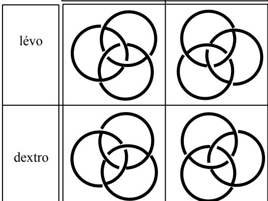  
Le mathématicien dira que ces deux écritures – la droite et la gauche - sont égales ou semblables (les deux lévogyres d’une part, les deux dextrogyre de l’autre), mais pour le sujet qui les lit, il est clair que le plongement a opéré un couplage arbitraire de deux ronds selon l’axe de l’une des dimensions entraînant le troisième rond à se situer d’un côté ou de l’autre de cet axe (en haut ou en bas si on réalisé le couplage selon la dimension x, à gauche ou à droite si on l’a réalisé selon la dimension y).

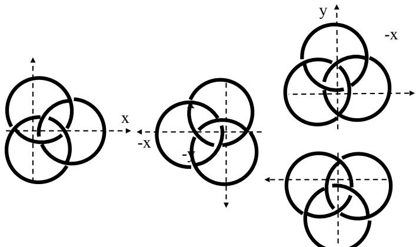

C’est clair pour un sujet qui lit parce qu’il est habitué-y culturellement à un sens d’écriture et que la station debout (y) s’y superpose. Il n’est donc pas superflu de faire l’hypothèse que le plongement est opéré par le sujet lui-même, qui lit ce qu’il écrit. Les caractéristiques du plan de plongement (deux dimensions) se sont transférées à l’objet plongé en couplant deux ronds dans l’opposition au troisième.

On aurait ainsi quatre écritures du nœud dextrogyre, et, de même, quatre écritures du lévogyre, que nous pouvons symboliser par quatre triangles équilatéraux égaux sur le plan géométrique, mais différents sur le plan topologique. En fait, on en compte à la fois beaucoup plus et beaucoup moins. Plus, parce qu’il est possible d’écrire tous les intermédiaires entre la première position (x) et la seconde (-x) ; pour un lecteur, chacune d’entre elles se distinguera de toutes les autres par un certain angle. Moins, parce que toutes ne sont qu’un parcours des valeurs de la fonction qui met en tension la première (x) en tant que renversée de la seconde (-x).

Ainsi, dans le tableau ci-dessous, les deux symboles de la ligne verticale (y, -y) ne sont que les intermédiaires médians d’un parcours des valeurs de la ligne horizontale (x, -x). Ils sont en quelque sorte pris dans la masse de l’intension (x). Si nous avions choisis comme intension la dimension (y), c'est-à- dire la ligne verticale, les valeurs (x, -x) de la ligne horizontale, n’auraient été que l’expression des valeurs intermédiaires de (y).

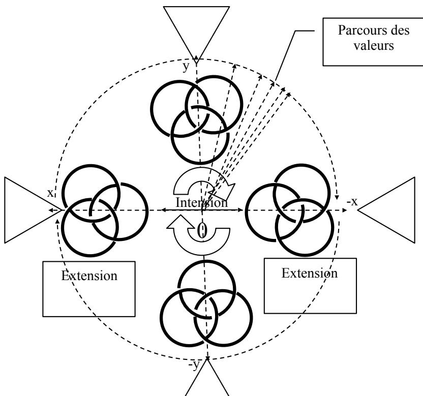  
Nous sommes à présent en mesure de donner la définition de la dimension avec laquelle nous allons travailler : la dimension est une cotation des valeurs, qui ne suppose au minimum que deux pôles, $\mathrm { \ q u ^ { \prime } o n }$ pourrait tout aussi bien appeler + et -, ou droite et gauche, 1 et 2, ou encore, pourquoi pas, noir et blanc, bien et mal, masculin et feminin… L’une ne vaut que dans son opposition à l’autre, autrement dit, en tension avec l’autre, ce qui nous permet de définir comme intension la coupure en deux, effet de l’écriture produisant

deux extensions. L’intension est la trouure (le zéro) que provoque le plongement du nœud dans le plan de l’écriture, engendrant deux extensions (1et 2).

$$
\begin{array}{c c c} \text { Extension } & \text { Intension } & \text { Extension } \\ 1 & x & - x \\ & 0 & 2 \end{array}
$$

En termes d’une topologie des surfaces, ce serait l’effet d’une coupure séparant deux bords.

La dimension se pose ainsi comme limite à l’infinité possible des extensions que sont l’ensemble des valeurs intermédiaires entre x et –x.

Notre triangle équilatéral, posé seul au centre d’une feuille ne veut rien dire. Mis en tension avec son opposé, il signifie immédiatement une direction pour un sujet qui cherche son chemin :

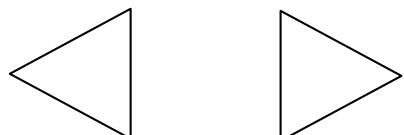

Il prend ainsi un statut de lettre : non pas en tant que transcription d’un phonème, comme les lettres de notre alphabet, mais en tant que les deux symboles se font signes, au sens où Lacan disait « les choses se font signes ». Il parle des3 représentations de choses bien sûr, les distinguant des représentations de mots. Celles-ci sont, dans l’écriture, la transcription des mots entendus. Les lettres ainsi définies renvoient au contraire aux hiéroglyphes dont Freud nous dit qu’ils peuplent nos rêves… mais aussi, nos actes manqués, lapsus, et symptômes. En bref, nous sommes en train d’ébaucher une grammaire de la lettre, comme formation de l’inconscient.

## Centration

Une première approche intuitive nous ferait penser que le plongement du nœud « à trois dimensions » dans le plan d’écriture, lui ferait perdre la troisième dimension, (z), celle du trou qui entoure la feuille de papier recevant l’écriture. Or, le trou est toujours là, même si nous ne savons pas s’il s’agit du même : c’est la trouure engendrée entre les deux extensions . Il4 se trouve aussi dans la trouure entre les deux intensions, car nous venons d’étudier la chiralité en tant qu’elle se différencie de la gyrie. En ce sens nous prenons ces deux intensions comme extensions de cette intension quadratique qui les met en tension.

Enfin, le trou se retrouve encore dans la dimension de la centration (c) qui met en tension le centripète et le centrifuge. Celle-ci se présente comme une dimension de surface, car on ne peut pas dire qu’elle emprunte les mêmes modalités d’écriture qu’une dimension de longueur, telle la chiralité. Comme le gyrie, elle fait appel à la disposition relative des solutions de continuité dans l’écriture des brins, et ces dernières sont situés en des points non alignés de la surface.

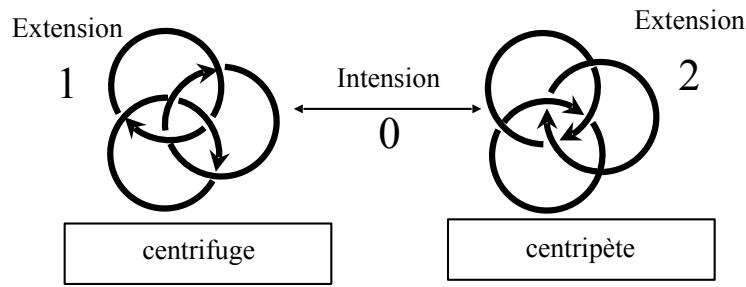

J’ai démontré par ailleurs que, dans toutes les5 transformations qu’on peut appliquer à l’écriture du nœud, la centration (c) suit les même variations que la dimension (z), dessus-dessous. Dans l’écriture ci-dessus, par exemple, on a inversé tous les croisements (donc les dessus-dessous), ce qui correspond à l’inversion de la centration. Cette opération a entrainé également un inversion de la gyrie, mais l’étude des autres transformations (voir plus loin) montre que cette liaison n’a pas lieu dans les autres cas.

Vérifions que cette dimension est bien intrinsèque à l’écriture du nœud, c'est-à-dire qu’elle n’est pas un effet de l’apport extrinsèque des flèches, ajoutées par simple didactique. Si nous parlons seulement le vocabulaire du nœud, nous pouvons lire une mise en rapport des ronds : « sur le centrifuge, le rond de droite (x) est sur (z) celui du bas (-y)» « sur le centripète, le rond de droite (x) est sous (-z) celui du bas $( - \mathbf { y } ) \mathfrak { w } \ . \left( \mathbf { x } , \mathbf { z } \right) \left( - \mathbf { y } \right) \to \left( - \mathbf { x } , - \mathbf { z } \right) \left( - \mathbf { y } \right) \Rightarrow \left( \mathbf { x } , \mathbf { c } \right) \left( - \mathbf { y } \right) \to \left( - \mathbf { x } , - \mathbf { c } \right)$ (- y). On a fait appel à la dimension y pour le repérage, mais on voit qu’elle reste neutre dans l’opération, ce qui confirme la différence entre « dessus-dessous » (c, qui s’inverse) et « hautbas » (y, qui ne s’inverse pas).

On en déduit que la centration (c) est la dimension de la trouure, représentant la dimension (z) dans le plan de l’écriture. Elle la représente par l’ordre apparent d’empilement des ronds, obtenu par la répartition des solutions de continuité sur les brins. Elle met en tension les bords (centrifuge) et le centre (centripète) du trou, à la place du dessus et du dessous, qui peuvent être mis en tension dans la 3ème dimension par une torsion. Cette dimension est tétravalente : comme la chiralité, elle developpe des cotations intermédiaires, mais au nombre de deux seulement .6

La gyrie par contre, reste strictement bivalente.

## Dimensions de surfaces, dimension de trou

Gyrie, chiralité et centration apparaissent par l’effet du plongement dans l’espace 2. Ces dimensions n’étaient pas présentes dans l’espace 3 : elles sont engendrées par l’écriture. C’est pourquoi nous ne sommes pas en train de parler des propriétés du nœud borroméen, mais des propriétés de l’écriture du nœud borroméen. Elles naissent de l’écriture exactement comme le démontre Lacan dans « La lettre volée » : l’encodage littéral d’une succession de hasards crée un système de lois dû uniquement à cette transcription.

Autrement dit, les dimensions du plan de plongement ont transféré leurs caractéristiques non seulement à l’objet plongé, mais encore aux dimensions de cet objet. Le plan d’écriture, que nous concevons intuitivement comme « surface », construit l’objet plongé comme une lettre dont les dimensions paraissent aussi être de l’ordre de la surface. A priori : la parole d’un sujet, lorsqu’elle s’énonce, serait le plongement du sujet dans les dimensions de l’Autre. Et ce que nous constatons tous les jours, c’est que ce plongement d’un sujet dans les dimensions de l’Autre, qu’on appelle une analyse, produit aussi entre les deux sujets qui en sont le support, l’analysant et l’analyste, ce changement qu’on nomme le transfert.

Il faut tenir compte toutefois d’une différence : c’est la parole qui engendre le transfert. Ici, nous parlons d’écriture, et je formule l’hypothèse que cette écriture est celle par laquelle l’analysant, ne pouvant pas tout dire, produit à l’usage de son analyste : rêves, lapsus, actes manqués, symptômes. La difficulté, lorsqu’on essaie de construire une logique, c’est qu’il n’y a de logique que de l’écrit . Nous sommes donc, dans7 notre travail théorique, dans la même situation que l’analysant qui ne peut pas tout dire.

L’interprétation serait donc l’autre type de plongement du sujet dans les dimensions de l’Autre, un plongement des trois dimensions de la lettre dans la dimension zéro de la parole.

Ainsi, centration et gyrie peuvent être dites des dimensions de surface, au sens où elles ne peuvent pas s’assimiler à l’idée que nous nous faisons communément de la dimension sous la forme d’une ligne droite, que ce soit longueur, largeur, ou hauteur. Elles font appel à la trouure de la différence s’instaurant entre deux figures nécessitant la surface, au sens où elles s’appuient sur la répartition des solutions de continuité dans l’écriture des brins. Nous avons pu assimiler la centration au trou, mais un trou, c’est aussi une surface en tant qu’elle est vide. Par opposition, la gyrie pourra être considérée comme une surface en tant qu’elle est pleine.

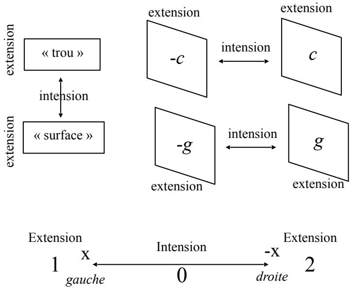

L’ i n t e n t i o n c o r r e s p o n d à l a r e p r é s e n t a n c e (Repräzentanz), les extensions aux représentations (Vorstellungen).

Ceci relativise considérablement nos notions intuitives de surface et de trou, et devrait contribuer à réactualiser dans de semblables proportions notre façon de concevoir la chiralité, seule de nos « dimensions » à conserver un aspect semblable à un segment de droite : lui aussi, il faut le penser comme trouure. Ainsi, nous nous dégageons de l’imaginaire géométrique pour fonctionner dans la symbolique du concept. Nous construisons une topologie.

Penser la gyrie comme « surface » et la centration comme « trou », c’est se situer dans le registre imaginaire. Penser la trouure comme intension entre deux extensions, c’est passer au registre symbolique. Alors, et le Réel ? C’est ce qui reste impossible à saisir dans l’une et l’autre conception : tout comme une dimension manquante, qui ne cesse pas de ne pas s’écrire.

## De la dimension, effet du manque, à la dimension manquante

L’intension entre les deux extensions n’a pas de sens sans l’intention d’un sujet qui lit, cherchant sa voie, et peutêtre même sa voix pour en dire quelque chose. Autrement dit, c’est dans cette trouure (0), où le sujet peut faire le choix d’une orientation (1 ou 2), que s’actualise son désir.

Lacan, suivant Freud, a conceptualisé le désir comme le produit d’un manque, c'est-à-dire d’un trou. Cet objet manquant, il l’a nommé l’objet a, cause du désir. Or, nous venons de le voir, l’écriture du nœud engendre ces trouures que nous appelons des dimensions, dans la mesure où les extensions se font signes. Si nous en passons par l’écriture du nœud (car, pourquoi pas l’écriture d’autre chose ?), c’est qu’elle nous permet de nous détacher de l’emprise imaginaire d’un espace euclidien à trois dimensions, dans lequel nous avons trop l’habitude d’évoluer en l’appelant « la réalité ».

Les dimensions d’écriture de l’espace-nœud se sont se révélées tout autre. Or, si deux d’entre elles se sont avérées « trouures » entre deux « surfaces » la troisième se révèle « trouure » entre… quoi ? des lieux, des topos, qui n’ont d’autre consistance que d’être différent l’un de l’autre pour un sujet qui lit. De même que l’écriture du nœud opère, pour celui qui lit, une différenciation entre un couplage de deux ronds s’opposant au troisième, de même les dimensions de l’espace d’écriture inaugurent une certaine identité entre deux d’entre elles – gyrie et centration - qui s’opposent radicalement à la troisième – la chiralité.

Une différenciation du même type s’opère lorsqu’on écrit la mise à plat d’un bande de Mœbius, dans laquelle l’orientation des plis oppose deux semblables à un différent :+1

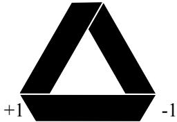

Manquerait-il quelque chose à la chiralité pour s’apparenter aux autres dimensions ? Et ce qui lui manque serait-il une dimension ? Quoiqu’il en soit, il nous faut distinguer ce manque (pour l’instant potentiel) d’une dimension, qui certes, fait trou, à la trouure constituant la fonctionnalité de la dimension. Le premier « trou » désigne une absence de fonctionnalité de la dimension : la fonction y est bloquée en objet, et c’est de l’objet a qu’il s’agit, lettre pour l’instant en instance ; le second, sa présence comme trouure de l’intension efficiente, et c’est la fonction phallique Φ(x).

Nous avons repéré que le choix d’une intension, la chiralité, rendait caduc l’autre dimension, la verticalité de l’axe (y). Nous avons donc l’intuition que $\mathrm { c } '$ est cette dimension « haut-bas » qui manque, étant en quelque sorte prise dans la masse de la chiralité.

Nous avons l’habitude de concevoir la surface comme le produit des deux dimensions de longueur, $\mathbf { \boldsymbol { s } } = \mathbf { \boldsymbol { x } } . \mathbf { \boldsymbol { y } } .$ . Nous venons de construire un espace où la surface ne se conçoit plus $\mathrm { d } ^ { \prime }$ un point de vue métrique, ni même phénoménologique, un espace dans lequel la centration ${ \mathsf s } ^ { \prime }$ oppose à la gyrie comme le trou à la surface, et où chaque dimension est trouure entre deux extensions. Mais la présence de la chiralité comme $\mathbf { \tau } ( \mathbf { x } )$ nous amène à penser une possible absence de la dimension (y) qui permettrait de penser la surface comme tension entre ses deux dimensions :

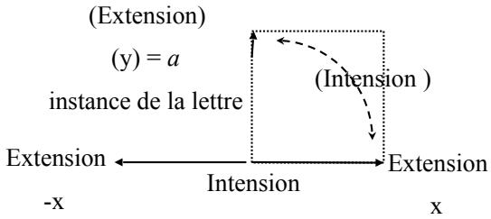

Si objet a il y a, $\mathrm { c } '$ est dans cette dimension manquante que nous le situerons, par opposition aux trous de la centration et de la gyrie, que nous assimilerons aux fonctions $\mathrm { P _ { 0 } }$ et $\Phi _ { 0 }$ de l’algèbre lacanienne .8

Théoriquement, il $\boldsymbol { \mathrm { n ^ { \prime } y } }$ a pas plus de raison que cette absence soit celle de $\mathrm { ( y ) }$ plutôt que celle de (x). Cependant, notre point de vue topologique prenant en compte le désir de celui qui lit – et qui, ainsi, lit son désir – en tant $\mathrm { \ q u ^ { \prime } i l }$ cherche à ${ \mathsf s } ^ { \prime }$ orienter – et $\mathrm { c } '$ est là $\mathrm { \ q u ^ { \prime } i l }$ lie son désir à un objet qui le cause $^ - ,$ nous amène à pencher en faveur $\mathrm { d } ^ { \prime }$ une exclusion de la dimension « haut-bas », pour cause $\mathrm { d } ^ { \prime }$ évidence : l’autre, en face de moi, se situe dans une même orientation dans ce rapport « haut-bas », ce pourquoi je néglige cette dimension, je n’en fais même pas état. Ce que j’éprouve à l’égard de l’autre, je vais considérer que c’est ce qu’il éprouve à mon égard, et ce qu’il dit, je ne peux concevoir que ce soit différent de ce que je dis . Par contre, cet autre me présente sa gauche là où il y a ma9 droite, et cela vaut aussi lorsque je me présente à moi-même comme un autre dans le miroir. S’il y a identité quelque part, il y a aussi différence. En termes plus freudiens, ça vaut aussi bien pour l’amour d’objet que pour le narcissisme. En termes lacaniens ça fait résonner à nos oreilles la formule selon laquelle le sujet reçoit de l’Autre son propre message sous une forme inversée.

La dimension « haut-bas » est donc forclose de cet espace. Nous la posons comme représentant le refoulement originaire de Freud, l’objet a de Lacan. Nous étions parti de l’idée de la perte d’une dimension par l’effet de plongement. Si l’intuition nous portait à penser comme (z) (dessus-dessous) cette troisième dimension perdue, nous venons de voir que la question est plus complexe. Non seulement l’espace d’écriture du nœud s’avère (jusqu’à présent) à trois dimensions, mais encore, s’il faut nommer la dimension perdue, ce serait plutôt la dimension (y) (haut-bas). La question n’est pas encore: quelle dimension s’est perdue (question ordinale) ? mais : c o m b i e n d e d i m e n s i o n s a v o n s - n o u s ( q u e s t i o n cardinale) ? Quelle qu’elle soit, cette dimension perdue, nous pouvons l’assimiler à l’objet a. Ce dernier se présente donc comme une surface qui inclut un « quelque chose » sur lequel il n’est pas possible de mettre un nom, étant une fonction prise en masse comme objet au sein de la surface qu’il contribue à former.

L’examen des opérations de passage entre les extensions va nous permettre de confirmer l’hypothèse de cette forclusion.

## LES OPÉRATIONS ADMISES DANS L’ESPACE-NOEUD

L’organisation de ces opérations se laisse appréhender comme une grammaire, approchant de fort près les travaux de Freud sur le destin des pulsions . Les extensions 1 et 2 seront10 considérées comme un sujet et un complément d’objet, tandis que la trouure de l’intension sera l’opérateur verbal qui les met en rapport.

## Retournement local r, ou miroir antérieur, M

Commençons par la première dimension à laquelle le plongement nous a confronté : la gyrie. Qu'est-ce qui peut opérer le passage d’une extension à l’autre, du sujet à l’objet ? La première réponse est : l’écriture elle-même considérée comme une mise à plat. Lorsqu’on pose un nœud borroméen sur un plan, on est devant ce choix : lévogyre ou dextrogyre. Le passage de l’un à l’autre, une fois posé, s’effectue alors par le déplacement d’un rond selon la dimension x, c'est-à-dire de droite à gauche.

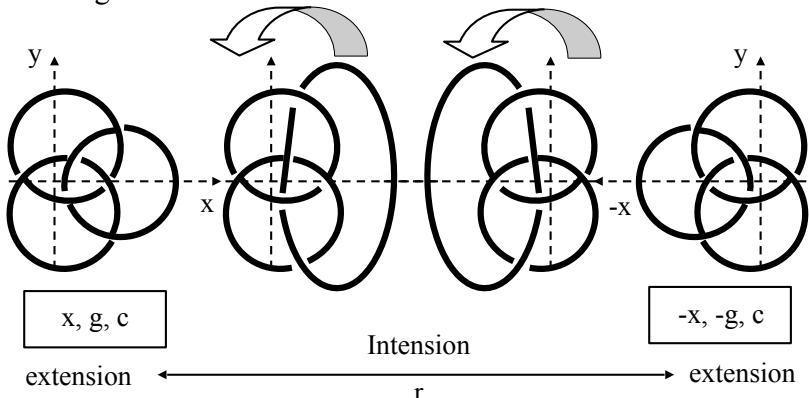  
Nous appelons r ce retournement local d’un seul rond.

Le retournement global du plan d’écriture opère la même transformation sur l’écriture du nœud lue par transparence une fois la feuille retournée.

Nous retrouvons le transfert des caractéristiques du plan de plongement à l’objet plongé : l’inversion d’une dimension entraîne immanquablement l’inversion d’une autre. Nous le vérifierons dans toutes les opérations que nous allons décrire : deux dimensions se couplent, faisant « surface », pour s’inverser en tournant autour de la troisième qui reste neutre, faisant « trou » dans l’opération en tant qu’elle manque à être inversée.

La 3ème dimension (z) sert de voie de passage, mais n’est en définitive, pas inversée : l’ordre d’empilement des ronds (c) reste le même . Nous avions constaté plus haut que l’inversion11 de (c) entraînait celle de (g). Ici, c’est l’inversion de (x) qui entraîne celle de (g).

Ce qui rend l’écriture équivalente à un mouvement, à moins que ce ne soit le mouvement, qu’il faille lire comme écriture. Je renvoie à mon « Ecriture du temps logique », qui12 décrit l’intension immobilité-mouvement comme ce qui, dans le sophisme des trois prisonniers, est à lire par ceux-là même qui l’écrivent.

Un autre mouvement effectue la même opération. Il s’agit du miroir antérieur, M, c'est-à-dire le mouvement d’un sujet qui, placé entre le miroir A et l’objet nœud, se retourne pour voir en deux temps différents, l’objet et son image.

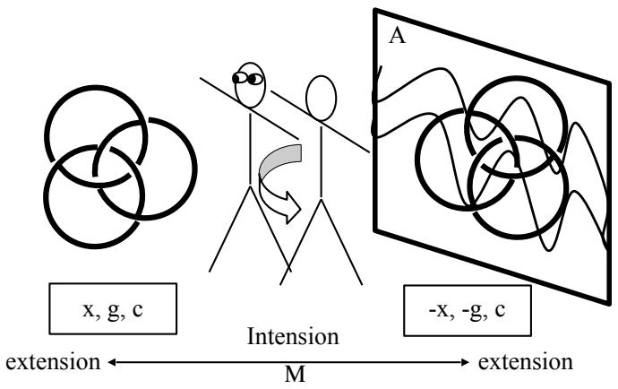  
Les deux écritures du nœud ci-dessus le sont selon le subjectif du sujet dessiné, à laquelle le lecteur du présent ouvrage peut s’identifier.

## Retournement subjectif Rs, ou miroir postérieur objectif, mo

Le retournement dit subjectif , est l’opération par13 laquelle un sujet s’oriente en fonction de ses propres repères corporels. Il se représente en effet en considérant que sa droite est à sa droite, et sa gauche à sa gauche : évidence qu’il vaut quand même le coup d’énoncer, car cela signifie qu’il se place dans la situation de quelqu'un qui le verrait de dos. Dans le même temps, un sujet se représente mentalement de face, c'est à dire comme quelqu'un qui le verrait de face, ou comme son image dans le miroir considérée comme non retournée. C’est une identification « immédiate », par laquelle le sujet ne fait pas le retournement imaginaire qui lui permettrait de s’identifier à son image située derrière le miroir.

De dos, à droite

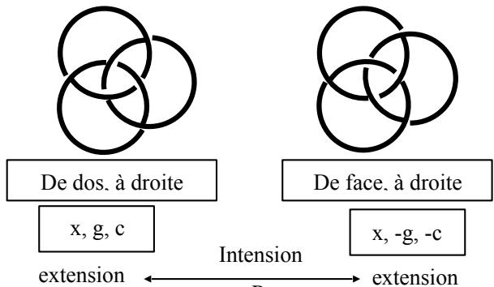

x, g, c

De face, à droite

Intension

x, -g, -c

extension extension D

Il correspond au fait de modifier tous les croisements du nœud, que nous avons évoqué plus haut.

Il correspond aussi à la position d’un sujet considérant l’objet nœud, ce dernier étant placé entre le sujet et le miroir. Le sujet voit la face « arrière » du nœud et, en même temps, sa face « avant » reflétée dans le miroir.

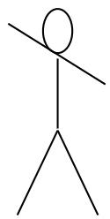

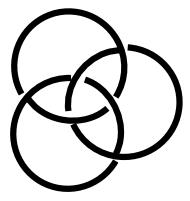  
x, g, c

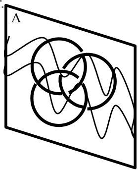  
Intension

x, -g, -c

extension

extension

Comme précédemment, notre écriture reprend le point mo de vue du sujet.

Retournement objectif Ro, ou miroir subjectif ms Il s’agit cette fois d’un retournement global du nœud.

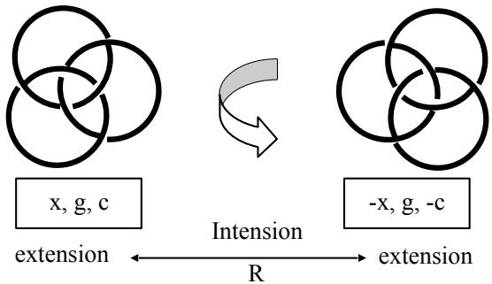

A ce retournement « objectif » s’associe le retournement du sujet derrière le miroir, par lequel il s’identifie subjectivement à son image. Le sujet, s’il est un nœud borroméen, s’identifie par le croisement de points de vue du retournement intrinsèque ; il se représente de face, à ce que lui renvoie le miroir (par exemple dextrogyre, alors qu’un observateur placé en face le voit lévogyre), mais avec un rond indiquant la droite. Se retournant derrière le miroir pour se couler dans son image, il entraîne avec lui, et la face à laquelle il s’identifie (dextrogyre), et son rond de droite, qui ainsi passe à gauche, sans qu’il y ait inversion de gyrie. Cette opération étant purement virtuelle, il ne peut vérifier, comme un observateur qui le verrait de face, qu’il est en fait lévogyre.

Comme le sujet de la psychanalyse, il croise ainsi libido du moi et libido d’objet : pour une partie de lui-même (consciente), la chiralité, il se réfère à lui dans son rapport à l’Autre (le miroir A), pour l’autre partie, la gyrie, il ne peut que se laisser porter par l’Autre (le discours de l’inconscient) tel qu’il lui présente son propre message sous une forme inversée.

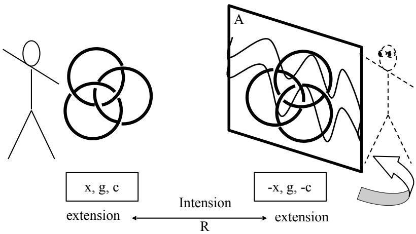

## Hétérogénéité du Transfert

Nous avons considéré successivement trois fonctions, qui ne sont pas autre chose que des nominations du mouvement exprimant la trouure de l’intension. Elles décrivent la dynamique des trois dimensions de l’espace-nœud :

r : le retournement local d’un seul rond,

Rs : le retournement subjectif du sujet se prenant pour objet, dans un croisement de deux points de vue sur lui-même,

Ro le retournement objectif de l’objet par le sujet.

Les deux premières fonctions sont dédoublées par des fonctions miroir :

M, miroir antérieur, où le sujet oriente son point de vue sur l’objet puis sur l’image de l’objet dans A, (actif)

$\bf { m _ { 0 } } ,$ miroir postérieur objectif, où $\mathrm { c } '$ est le miroir A qui retourne l’objet nœud pour le sujet (passif).

ms, miroir subjectif, où le sujet se retourne derrière le miroir pour s’identifier à son image.

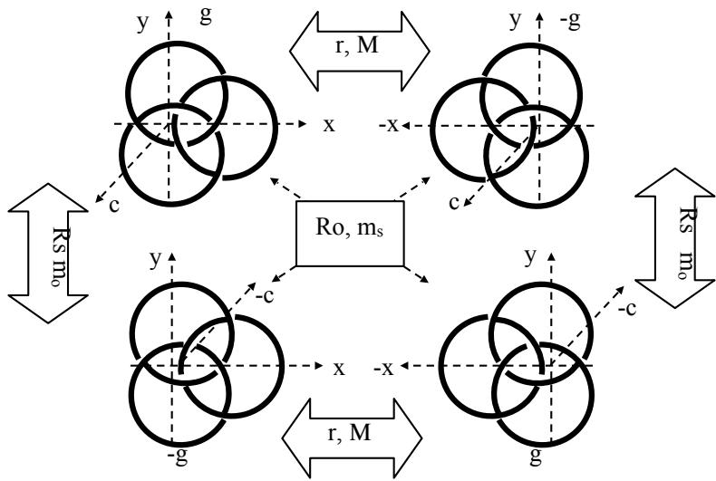

L’hétérogénéité de l’objet nœud témoignait du transfert des caractéristiques du plan de plongement à l’objet plongé. De la même manière, nous avons constaté une hétérogénéité des dimensions de l’espace nœud, opposant deux dimensions « complètes »(gyrie et centration) à une dimensions « incomplète », la chiralité. Il en est encore de même pour les opérations, qui fonctionnent selon la même hétérogénéité : chacune implique non pas trois, ni une, mais deux dimensions.

Il n’y a donc pas d’objet en soi, ni d’espace en soi, ni d’opérations en soi ; la structure de l’objet renvoie à la structure de l’espace de plongement, dont les dimensions s’avèrent structurées comme les opérations qui en assurent les changements.

L’hétérogénéité se signalant par des localités, distinctes de la globalité par leurs attributs dimensionnels, n’en souligne que mieux la fonctionnalité du nœud comme unité : si l’on change la place d’un seul, tous changent de place. Cette fonctionnalité symbolique renvoie à la fonctionnalité réelle qui était la sienne dans l’immersion à trois dimensions : si on en coupe un, tous sont libres. Tous les ronds changent de place, mais seules deux dimensions s’inversent. Lorsqu’on ne déplace qu’un rond (inversion de x) par un retournement local r, on inverse aussi la dimension g qui est d’ordre global, faisant intervenir tous les ronds. Lorsqu’on veut changer l’ordre d’empilement d’un seul rond , on est obligé de changer l’ordre de tous (–c), et de fait, ça change aussi la gyrie. Et cet impossible d’une transformation qui impliquerait une seule ou trois dimensions du nœud, fait partie du Réel de l’écriture. C’est là où la fonctionnalité de l’écriture trouve sa limite. Cette hétérogénéité est donc celle qui oppose tout groupement de deux dimensions, faisant « surface » (mais c’est une trouure fonctionnelle, Φ(x)), à la troisième, faisant « trou» (mais c’est une surface en tant que trouure en instance, objet a).

Le transfert des caractéristiques du plan de plongement révèle une fondamentale hétérogénéité de structure, brisant l’homogénéité supposée du nœud Réel des dimensions de l’espace Réel des opérations dans l’espace Réel. Nous avons supposé que les trois dimensions de ce Réel pourraient bien être une reconstruction après-coup à partir des caractéristiques de l’espace de plongement. Nous lisons l’espace sensible en lui conférant les trois dimensions de l’écriture. Nous pouvons ajouter que cet espace de plongement pourrait bien être, lui aussi une construction des opérations que nous venons de parcourir. Il n’existait pas plus que le supposé Réel de l’immersion.

Le transfert est donc bien un espace neuf qui s’engendre dans l’après-coup des opérations de la parole et de l’écriture, de la même façon qu’un analysant reconstruit son histoire par son plongement dans les dimensions de l’analyste comme Autre.

De plus, chacune des opérations peut se traduire selon deux registres de représentations de mots (les mouvements, les miroirs), qui correspondent à la condensation d’un seul couple de représentations de choses (de lettres). C’est l’autre limite.

Cette identité de structure entre l’objet, l’espace dans ses dimensions, et l’espace des opérations nous amène à poser la question : Y aurait-il une quatrième fonction qui dynamiserait la dimension manquante, que nous avions repérée, par anticipation, pour être la dimension (y) ?

La réponse est oui, et cette fonction c’est le renversement

## Renversement, ρ

Nous avons pu remarquer que les trois fonctions précédentes opéraient autour de l’axe (y), laissé neutre dans l’opération. Si nous inversons cet axe, nous inaugurons un nouveau type de fonction, qui ne sera plus rotation autour d’un axe avec sortie hors du plan d’écriture, mais rotation autour d’un point dans le plan d’écriture. L’inversion de (y) entraîne celle de (x). C’est ce que nous avions étudié lors de notre première approche de l’écriture du nœud, nous obligeant à constater la disparition de la dimension (y) dans sa prise en masse au sein des autres dimensions.

Le renversement du lévogyre et celui du dextrogyre permettent d’obtenir deux écritures du nœud renversé, dont nous constatons aussitôt qu’elles ne sont pas intrinsèquement différentes du nœud retourné. Seul l’apport extrinsèque de l’inversion de l’axe (y) permet de repérer une différence.

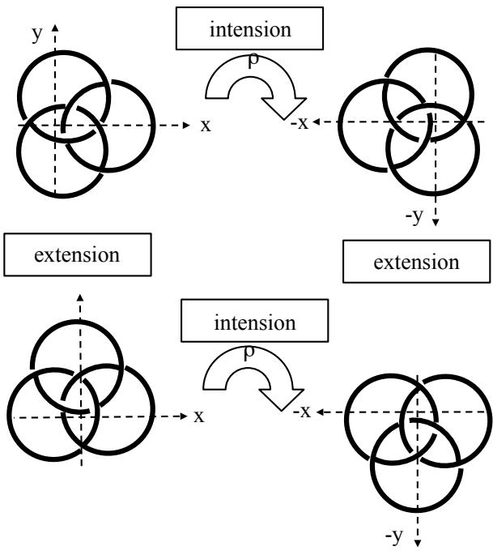

Ainsi, de même que la dimension (y) restait prise dans la masse de la chiralité (x), de même le retournement reste confondu dans le renversement.

Le renversement fait passer en haut le rond du bas qui était sous le rond de droite, et qui reste sous le rond de droite, puisque la centration $\mathbf { n } ^ { \prime } \mathbf { a }$ pas changé. En revanche, le retournement laisse ce même rond du bas en bas, mais le dispose $s u r$ le rond de gauche, conformément à l’inversion de la centration. Si nous pouvons faire ces distinctions $\mathrm { c } '$ est grâce aux représentations de mots « haut-bas », que nous ajoutons au vocabulaire écrit de la lettre nodale. Dans ce dernier, dans les représentations de chose, rien ne spécifie le tableau des renversements ci-dessus, du tableau obtenu par les trois autres fonctions, p. 20.

## Grammaire de la lettre

Nous sommes en présence d’une logique littérale qui ne doit rien à la parole. Cette écriture ne retranscrit pas les sons des mots, elle s’essaie à s’exprimer par la « ressemblance » avec le nœud réel, comme les hiéroglyphes primitifs. Mais du nœud réel, elle ne dit rien : tout ce que nous avons inscrit là est le fait même de l’écriture. Il n’y a pas de nœud lévogyre et dextrogyre dans l’espace d’immersion à trois dimensions, pas plus que de nœud droite ou gauche. De ce fait, le nœud dit « réel », immergé dans l’espace 3, l’est, en effet, réel au sens de la définition de Lacan : impossible à saisir. L’écriture a engendré ce qui s’écrit, qui n’était d’aucune façon là auparavant, invalidant toute idée de ressemblance. Elle a engendré une grammaire, c'est-à-dire des lettres (les quatre figures du nœud ) et des opérations (verbales) qui les mettent en rapport. Certaines de ces opérations sont impossible à saisir dans leurs différences, et impossible à écrire dans le vocabulaire littéral du nœud.

Ces impossibles-là sont le réel de l’écriture, dont Lacan parle à de nombreuses reprises. Il n’était pas là auparavant, n’étant que le produit des impasses de l’écriture.

Ainsi Lacan définit-il la lettre : effacement d’aucune14 trace qui soit d’avant. Notre démonstration n’est d’ailleurs pas différente de celle de « La lettre volée », dans laquelle l’encodage littéral d’une série de hasard binaire s’avère construire un système de lois qui n’était nullement dans la chaîne de départ. Le fait que Lacan se soit servi de chiffres et de lettres a pu prêter à confusion, car les lettres de notre alphabet servent aussi à retranscrire des sons. Mais dans la démonstration de Lacan, leur valeur phonétique n’y était pour rien. Seule comptait leur pure valeur de lettre. Notre démonstration portant sur l’écriture nodale n’y ajoute que ceci : la confusion avec les lettres comme représentant des phonèmes n’y est plus possible.

Nous voyons donc que cet essai d’écriture par la ressemblance ne ressemble à rien du tout. La référence première n’est pas l’objet nœud, dit « réel » : il est impossible d’en écrire quoi que ce soit quant à l’orientation. Par contre, on peut en dire quelque chose quant à sa fonctionnalité réelle : si on coupe un rond, tous sont libres. Mais justement, cet acte détruit le nœud. La connaissance, ici, défait l’objet à connaître, tandis que la médiatisation de l’écriture ouvre un champ totalement original. Lacan disait qu’il n’y a rien de plus proche du réel que l’écriture : ce réel, elle l’engendre comme radicalement Autre que tout ce qui pouvait en faire la référence extrinsèque. C’est le réel de la signifiance, mais il ne s’agit pas du signifiant. Ce dernier transcrit des représentations de mots, tandis que la lettre engendre des représentations de choses.

Or, ce réel des représentations de choses ne doit rien non plus aux quatre figures que nous avons tracées. Le Réel engendré par l’écriture, c’est cet impossible à inscrire la différence des fonctions que nous avons repérées : le renversé est identique au retourné. C’est en ce sens que nous retrouvons dans la grammaire de la lettre, la structure du langage à son niveau le plus radical : une seule lettre condense un couple de significations, le renversé et le retourné, tandis que le passage d’une lettre à l’autre dénote un déplacement.

## Grammaire des négations

Si nos quatre figures se différencient, $\mathbf { c } ^ { \ast }$ est qu’elles sont des objets - qu’elles soient des symboles n’y change rien – produit par ces fonctions, dont on peut dire qu’elles sont de l’ordre d’une rhétorique forclusive, au sens de la négation forclusive : le lévo-gauche $n ^ { \prime }$ est pas le lévo droite, ni aucune des autres figures. Aucune ne vaut par elle-même, mais seulement par différence d’avec les autres.

Que nous puissions parler de la différence du mode de passage, retournement ou renversement, que je $n ^ { \prime }$ ai pas pu inscrire, laisse entendre une discordance quant à la négation, que nous appelons de ce fait discordantielle. Elle est discordante parce que les raisons didactiques nous ont fait parler de renversement et de retournement, de dimension (x) et de dimension (y), alors que pour l’écriture de la lettre, ces différences étaient forcloses.

Dans le cadre de la didactique, cette différence des fonctions n’est forclose qu’au sens de la négation forclusive, qui laisse entendre que le caractère forclusif (adjectif) de la différence des objets est menacé d’invalidation : $\mathrm { c } '$ est en cela qu’il y a du discordantiel. Il y a de l’identique là où il devrait y avoir du différent. Ici, $\mathrm { c } '$ est le conditionnel de la modalité qui change tout. Mais ce pourrait être la modalité discordantielle de la négation qui se charge de l’exprimer : je crains que ce ne soit la même chose, je crains que le renversé ne soit la même figure que le retourné. Grâce au signifiant, on sait que l’écriture est en manque d’une lettre en instance.

Mais si nous nous plaçons subjectivement dans le cadre strict de l’écriture, alors, aucun discordentiel n’apparaît. La dimension (y) est forclose, cette fois au sens de la forclusion (substantif) lacanienne.

Dans le rêve de l’oncle à barbe jaune, Freud nous dit : « Mon ami R…. est mon oncle. - j’éprouve pour lui une grande tendresse ». Il y a deux figures, mais15 $\mathbf { c } ^ { \ast }$ est la même : elles ont la même cote de valeur, une cote d’amour. Le discordantiel pointe lorsque Freud repère que, s’il aime bien son ami R, il n’a aucune raison d’avoir quelque tendresse que ce soit à l’égard de son oncle. Le récit du rêve avait laissé forclose cette différence de cote d’amour, forclusion qui s’était traduite immédiatement au réveil par un rejet : « Ce rêve est absurde », équivalent de « ce rêve n’a pas de sens ». C’est l’excès même du caractère forclusif de l’affirmation qui alerte Freud : ce rêve pourrait bien avoir un sens.

Le plongement du nœud dans le plan d’écriture a produit quatre possibilités de lettres, quatre figures imaginaires, effets du symbolique de la trouure. L’impossibilité d’inscrire une différence entre renversement et retournement constitue le Réel engendré par cette trouure. Une autre façon de le dire, c’est qu’il est impossible d’écrire le rapport entre les fonctions : à rapprocher de l’impossible inscription du rapport sexuel.

## CHANGEMENT D’ESPACE DE PLONGEMENT

## Trouure de l’interprétation

Distinguer retournement et renversement, comme nous venons de le faire à l’aide de représentations de mots, revient à distinguer (x) et (y), confondus dans la représentation de chose. Nous avons ajouté « haut-bas » comme intension efficiente au dictionnaire de la lettre nodale. Nous avions été obligé de l’utiliser dès l’abord de ces questions, parce que ces mots, nous les avions, et nous ne pouvions nous en passer pour des raisons didactiques nécessaires à l’exposé. Mais de ce fait, nous avons pu constater l’absence d’une représentation de ces mots dans la représentation de chose à laquelle nous avions à faire.

Notre introduction des signifiants « haut-bas » vient de faire interprétation pour cette dimension (y) chosifiée au sein de (x). Ce sont des signifiants, parce que nous avons procédé à un apport extrinsèque à l’écriture nodale. Nous pouvons à présent rectifier cette écriture en proposant un trait différentiel qui rendra efficiente la dimension manquante. Dans le domaine de la grammaire de la lettre, (y) pourra être considéré comme une modalité de (x) qui nous amènera penser cette fonction comme analogue à un verbe dont le parcours des valeurs serait la conjugaison. Si nous appelons cette fonction « renversement », nous conjuguons le verbe « renverser ». Il est toujours impossible de l’écrire comme verbe, mais nous pouvons écrire toutes les modalités du renversement par le biais de l’écriture de l’objet renversé. Nous avions limité ces écritures par la position de la dimension x comme seule tension valable. Nous pouvons à présent ajouter une limite à cette limite par trop limitante, dans laquelle nous avions reconnu la forclusion du discours psychotique. C’est ainsi qu’on engendre de la trouure : par le recoupement de la coupure.

Pour cela, un seul trait suffit, correspondant à la définition lacanienne du trait unaire : un marquage de l’un des ronds du couplage qui, jusqu’à présent, faisait axe de rotation pour le troisième rond ou pour l’ensemble du nœud. Ce peut être une rayure aussi bien qu’un coloriage de ce rond, solution que nous retiendrons pour son élégance. Nous écrivons sur l’écriture, inaugurant une fonction quadratique qui repère non seulement de nouvelles extensions, mais encore l’écriture comme telle.

Par cette trouure, les « trous » Φ0 et P0 que nous avions repérés comme surfaces, regagnent de la fonctionnalité en devenant les trouures Φ et P du schéma R.

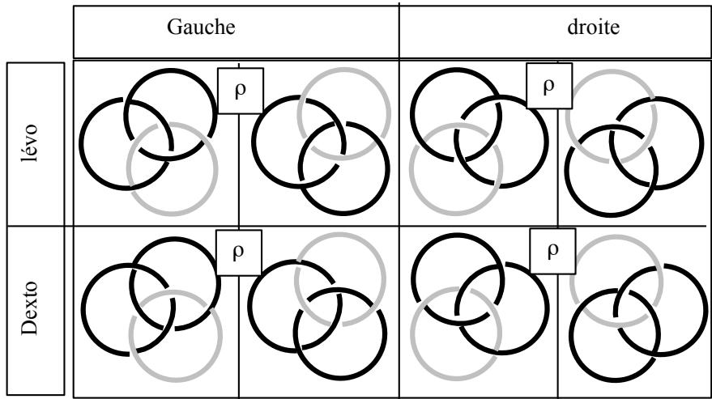

Ainsi la lettre travaille –t-elle le signifiant, de la même manière que le signifiant travaille la lettre. La représentation de chose va se trouver altérée par l’apport extrinsèque de la représentation de mot, engendrant, avec de nouvelles lettres, un dédoublement de l’espace nœud. Le renversement restant dans le plan d’écriture, opère, en se distinguant du retournement, une trouure de ce plan en rendant efficiente la tension entre (y) et (x) :

(Extension)

instance de la lettre

Trouure de l’interprétation

Freud nous indique que ce qui manque aux représentations de choses pour parvenir à la conscience, ce sont les représentations de mots . C’est ainsi que les16 hiéroglyphes du rêve, comme représentations de choses, sont interprétées par le rêveur au moment où il en parle, grâce aux représentations de mots.

## Hypercube

Nous allons construire une représentation c'est-à-dire une lettre, capable d’écrire le dédoublement d’espace obtenu par la trouure de la dimension nouvelle. Nous avions représenté (p. 20) à plat les trois fonctions de l’espace-nœud, sous la forme d’un groupe de Klein. Dans cette représentation les fonctions étaient écrites par des lettres issues de notre alphabet, c'est-à-dire de façon extrinsèque à l’espace nœud. Il était déjà impossible d’écrire cette lettre de manière intrinsèque aux définitions de nos dimensions. Comme nous l’avons dit, il est impossible de dire quoique ce soit du nœud Réel. Tout ce que nous avons repéré de son espace l’a été du fait de l’écriture.

En projetant les trois dimensions de l’espace nœud sur l’espace euclidien qui s’en déduit par reconstruction, on obtiendrait un cube tel que :

chaque arête est une dimension

quatre sommets sont les extensions

chaque face est la trouure d’une intension impliquant les deux dimensions qui s’inversent.

quatre diagonales des faces relient les extensions selon un tétraèdre formant la réalité de l’espacenœud

les quatre sommets des extensions impossibles construisent le tétraèdre du Réel. Ces sommets correspondent aux transformations de l’écriture du nœud selon l’inversion d’une seule dimension. Nous avons vu que $\mathrm { { c } ^ { \prime } }$ é t a i t impossible, toute inversion $\mathrm { d } ^ { \prime }$ une dimension entraînant l’inversion d’une autre.

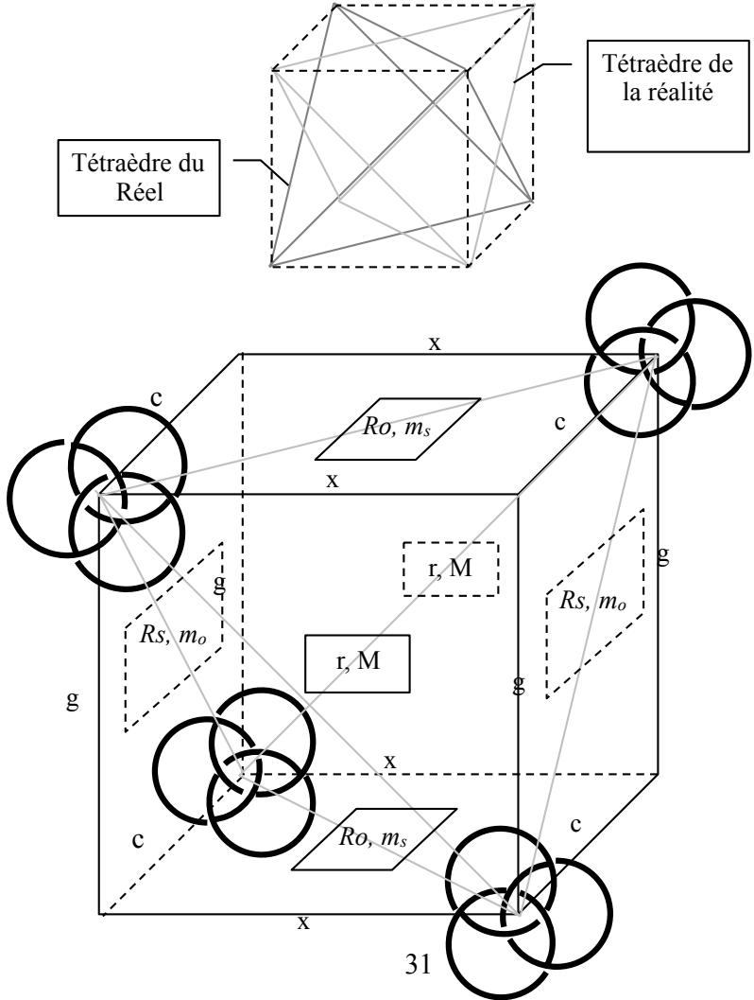

Trouure de l’interprétation, la mise en jeu d’une dimension supplémentaire, (y), ouvre un hyperespace qui dédouble le premier cube : Les deux parties de l’hypercube sont traditionnellement représentée imbriquée l’une dans l’autre. Je les ai décalées pour une plus grande lisibilité de la figure. Chacune des 4 nouvelles transformation “r”, (renversement) se présente comme la diagonale d’un carré dont les côtés sont (x) et (y).

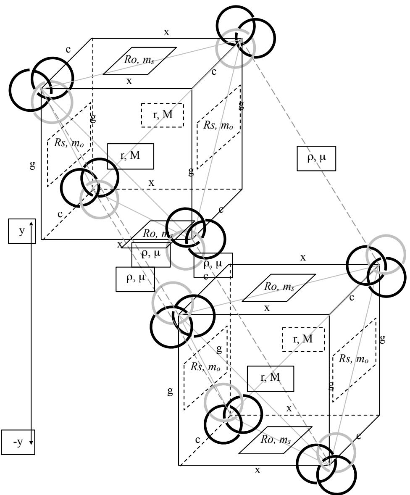

L’espace a été dédoublé par la trouure de l’inteprétation entre un cube “du haut” et un cube “du bas”. À entendre comme ce qui inaugure l’inconscient, à côté des nouvelles représentations disponibles pour le conscient. Freud, dans la Verneinung, nous indiquait cet effet de la négation (qui est trouure), de rendre des représentations disponibles pour le conscient . Lacan, quant à lui, nous propose cette formule :17 « plus le discours est interprété, plus il est inconscient » , dont voici le contexte :

« Est-ce que ce ne serait pas la coupure interprétative elle-même, qui, pour l’ânonneur sur la touche, fait problème de faire conscience ? elle révélerait alors la topologie qui la commande dans un cross cap, soit dans une bande de Moebius. Car c’est seulement de cette coupure que cette surface, où de tout point, on a accès à son envers, sans qu’on ait à passer de bord. (à une seule face, donc) se voit par après pourvue d’un recto et d’un verso. La double inscription freudienne ne serait donc du ressort d’aucune barrière saussurienne, mais de la pratique même qui en pose la question, à savoir la coupure dont l’inconscient à se désister témoigne qu’il ne consistait qu’en elle, soit, que plus le discours est interprété, plus il est inconscient. Au point que la psychanalyse seule découvrirait qu’il y a un envers du discours, à condition de l’interpréter. »18

La double inscription freudienne dont parle Lacan, est celle qui articule représentations de choses et représentations de mots. C’est ce que nous venons de faire en donnant un crédit redoublé à l’expression « double inscription », puisque nous trouvons le passage de l’écrit à la parole comme écriture sur l’écriture : autrement dit, un recoupement de l’ordre du cross-cap, dans lequel l’abolition (Aufhebung) des dimensions – qui en fait la place du trou – produit un objet à quatre dimensions, le cross-cap. C’est un nouveau plongement des dimensions du Sujet dans celles de l’Autre, nouveau plongement dans la dimension zéro de la trouure comme telle.

Montrons rapidement, en cinq dessins, comment l’annulation successive de quatre dimensions (x, y, z, S) construit le cross-cap, comme « place du trou » : c’est sous ce vocable que Lacan l’avait introduit dans « l’Identification ».

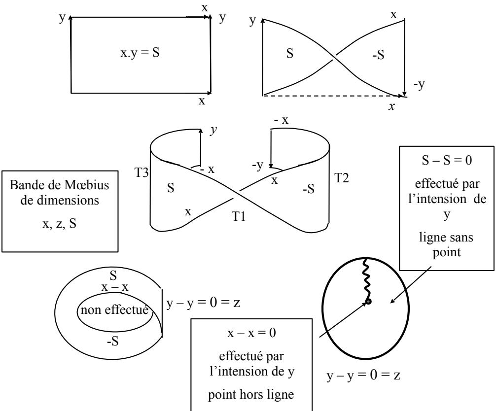  
La bande de Mœbius est théoriquement une ligne sans point. Cependant, sa construction pratique n’a pas abolit la

surface, ni donc sa dimension y. Il s’agit de pousser jusqu’à sa limite cette logique du discordantiel : puisque cette surface est une coupure, augmentons sa surface, donc la coupure, par une extension de l’intension (y) ; ça entraîne une effectuation progressive de $\textbf { x } - \textbf { x } = \textbf { 0 }$ tandis que S enfle jusqu’à s’autotraverser pour rencontrer –S en tous points : $\mathrm { S } - \mathrm { S } = 0$

Il n’est pas sûr que ce petit apologue suffise à démontrer que la quatrième dimension produit, comme fonction, la place du trou, ni que l’écriture sur l’écriture soit la parole. Mais c’est une piste. Peut-être est-ce la limite de la théorie, qui, ne pouvant en passer que par l’écrit, se trouve bien en peine de théoriser la parole.

## Miroir horizontal, µ

De la même façon que :

r, le retournement local était aussi M, le miroir antérieur,

Rs, le retournement subjectif, était aussi mo, le miroir postérieur objectif,

Ro, le retournement objectif, était aussi ms , le miroir subjectif,

ρ, le renversement possède sa contrepartie dans l’univers des fonctions du miroir : c’est le miroir horizontal, µ, deuxième temps de la dialectique des miroirs dans la « Remarque sur le rapport de Daniel lagache ».19

Je rappelle ici les études que j’ai produites à ce propos antérieurement : si pour le physicien, il n’y a pas de20 différence entre miroir vertical et horizontal, pour le sujet qui se tient debout sur un miroir horizontal, il y en a une, et de taille : il ne peut pas voir son image (négation forclusive), de la même façon que le sujet conscient se refuse à voir son image inversée selon une dimension qui place son sexe et son derrière face au miroir ! Il ne le peut (négation discordentielle) qu’en se penchant dans le trou que l’espace du miroir ouvre entre ses jambes, ce qui le replace dans les conditions du miroir vertical, ou en reconstruisant virtuellement son image inversée haut-bas à partir de celle d’un autre qui se tient à côté de lui. J’ai montré par ailleurs comment cette dialectique temporelle construit, elle aussi, un cross-cap .21

Ce sont les conditions de l’analyse, qui l’amènent à se pencher sur ce qu’il ne veut pas voir, grâce à la parole dite à un Autre qui l’entend. Ceci n’est dit que pour faire image, l’efficience de l’analyse reposant essentiellement sur la trouure (mise en œuvre d’une nouvelle intension : renversement, écriture sur l’écriture, et donc parole) ayant permis au sujet d’advenir comme fonction (y), à la place de l’instance de la lettre.

## Ouverture de la structure

L’instance de la lettre n’est pas supprimée pour autant. D’une part, le Réel des trajets impossibles, non seulement reste en place, mais se dédouble.

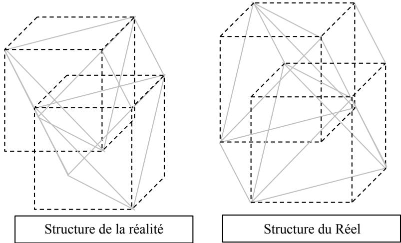

D’autre part, nous ne sommes pas en mesure d’écrire dans le vocabulaire du nœud la différence entre les fonctions « mécaniques » et leur dédoublement par des fonctions miroir. Il existe un moyen de le réduire par l’emploi des flèches écrivant la centration. Je ne l’étudierai pas ici. Il ne le réduit que pour une petite partie.

Enfin, nous ne pouvons inscrire les fonctions comme telles, puisqu’elles sont mouvements de passage . Nous ne22 pouvons inscrire, à la lettre, que le résultat du passage... sauf à en passer par des représentations de mots qui disent ce que l’écriture nodale ne peut pas inscrire : le retournement subjectif se distingue du miroir postérieur, etc… bref : les miroirs M, mo, ms, µ, ne sont pas les mouvements r, Rs, Ro, ρ, bien que, du point de vue des objets qu’ils transforment, le résultat soit le même. Ceci nous met sur la piste d’un sérieux discordantiel entre l’objectif et le subjectif, qui nous renvoie au croisement nécessaire de la libido du moi avec la libido d’objet.

Evident entre mo et Rs d’une part, ms et Ro d’autre part, ce croisement se retrouve au sein même de M où le sujet se retourne pour considérer les deux faces de l’objet.

M, le miroir antérieur, est une transformation dans laquelle le sujet observant opère sur lui-même, tandis que par r, il opère sur l'objet. Dans les deux cas, le sujet est actif, mais dans M, se retournant pour voir successivement l’image puis l’objet, certes, il transforme l’objet par son changement de point de vue sur lui, mais il se prend lui-même comme objet pour accomplir ce changement, ce qui n’est pas le cas dans r .

Une autre différence ${ \mathsf s } ^ { \prime }$ observe entre Rs et mo. Le miroir postérieur $\mathfrak { m } _ { 0 }$ est un opérateur externe, A, qui laisse passif aussi bien le sujet que l’objet. $\mathrm { C } '$ est la position du sujet de la science, qui veut ne compter pour rien dans l’appréhension de l’objet. Celle-ci doit se faire entièrement par un A impersonnel, discours reproductible par tous. Rs, le retournement subjectif, est une action d’écriture que le sujet actif opère sur l’objet nœud passif qu’il est lui-même, en inversant chacun de ses croisements. Il n’y a pas de meilleure façon de représenter le narcissisme. Les objets transformés par ces deux positions étant les mêmes, ceci justifie pleinement l’aphorisme de Lacan selon lequel le sujet de la science, c’est le sujet de la psychanalyse.

Nous proposons ainsi un modèle pour l’inconscient comme espace Autre à quatre dimensions déterminé par l’écriture et le miroir. Ce qui ne peut se dire dans le conscient, par les représentations de mots, s’écrit dans l’inconscient par le biais de ses manifestations (rêves, actes manqués, lapsus, symptôme) qui sont des représentations de choses. Le passage à la parole achève le basculement des quatre dimensions dans la dimension zéro de l’intension comme telle.
